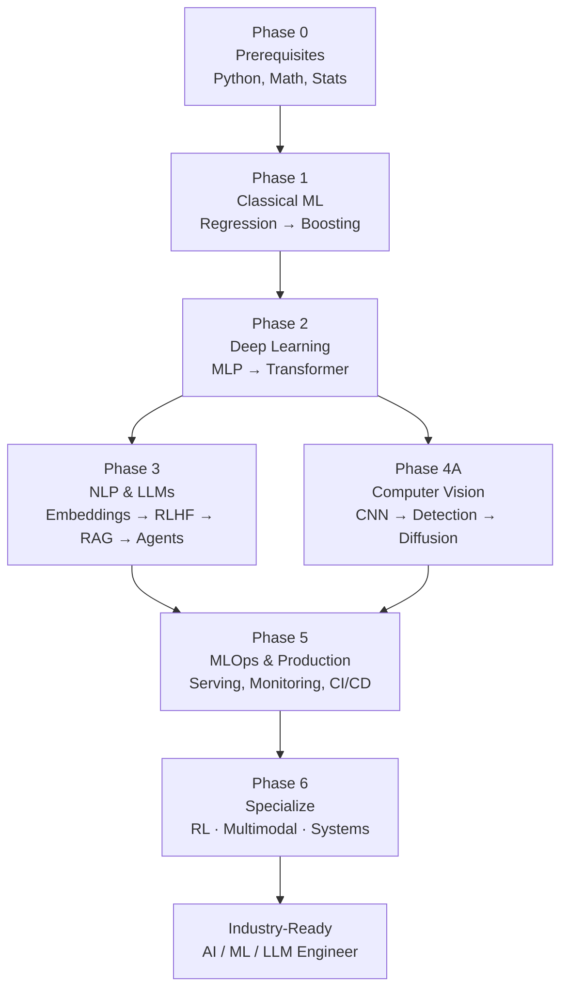

# The Ultimate AI Engineer / ML Engineer / DL Engineer / LLM Engineer Roadmap

> A zero-to-industry, mentor-style curriculum. Every topic follows the same 26-point template so you learn **intuition → math → algorithm → code from scratch → library code → projects → interview prep → industry usage**.

---

## How to use this roadmap

1. Start at **Phase 0** if you are a complete beginner. If you already know Python and basic math, skim it and move on.
2. For each topic, open the file inside `roadmap/<phase>/<topic>.md`. Every file follows this exact template:

   1. Intuition first
   2. Why the topic exists
   3. What problem it solves
   4. Mathematics
   5. Every formula explained
   6. Every variable explained
   7. Step-by-step algorithm
   8. Simple example
   9. Real-world example
   10. Diagram (Markdown / Mermaid)
   11. Implementation from scratch (Python, NumPy only)
   12. Implementation using libraries (scikit-learn / PyTorch / HuggingFace)
   13. Time complexity
   14. Space complexity
   15. Advantages
   16. Disadvantages
   17. Interview questions
   18. Common mistakes
   19. Optimization techniques
   20. Coding exercises
   21. Mini project
   22. Medium project
   23. Advanced project
   24. Where it is used in industry
   25. How companies use it
   26. When NOT to use it

3. Do the **projects** at the end of each topic. Reading is passive — projects are what make you an engineer.
4. After each phase, build the **Capstone Project** listed at the bottom of this file.

---

## Learning philosophy

- **First-principles > memorization.** If you cannot derive the formula on a whiteboard, you do not understand it.
- **From scratch, then framework.** Implement Linear Regression, Backprop, and Self-Attention in raw NumPy at least once. After that, use PyTorch/HuggingFace.
- **Ship things.** Every phase ends with a deployable project. An unshipped model is a hobby, not engineering.
- **Read papers weekly.** From Phase 2 onward, add one paper per week to your routine.
- **Interview as you go.** After each topic, answer its interview questions out loud.

---

## The roadmap at a glance



---

## Phase 0 — Prerequisites

| # | Topic | File |
|---|-------|------|
| 0.1 | Python for AI (numpy-first) | [`roadmap/phase-0-prerequisites/01-python-for-ai.md`](roadmap/phase-0-prerequisites/01-python-for-ai.md) |
| 0.2 | Linear Algebra | [`roadmap/phase-0-prerequisites/02-linear-algebra.md`](roadmap/phase-0-prerequisites/02-linear-algebra.md) |
| 0.3 | Calculus (Derivatives, Chain Rule, Gradients) | [`roadmap/phase-0-prerequisites/03-calculus.md`](roadmap/phase-0-prerequisites/03-calculus.md) |
| 0.4 | Probability & Statistics | [`roadmap/phase-0-prerequisites/04-probability-statistics.md`](roadmap/phase-0-prerequisites/04-probability-statistics.md) |
| 0.5 | Data manipulation (NumPy, Pandas) | [`roadmap/phase-0-prerequisites/05-numpy-pandas.md`](roadmap/phase-0-prerequisites/05-numpy-pandas.md) |

**Phase 0 Capstone:** Build a data-cleaning + EDA notebook on the Titanic dataset using only NumPy + Pandas + Matplotlib, no ML libraries.

---

## Phase 1 — Classical Machine Learning

| # | Topic | File |
|---|-------|------|
| 1.1 | Machine Learning fundamentals (bias-variance, train/val/test) | [`roadmap/phase-1-classical-ml/01-ml-fundamentals.md`](roadmap/phase-1-classical-ml/01-ml-fundamentals.md) |
| 1.2 | Linear Regression | [`roadmap/phase-1-classical-ml/02-linear-regression.md`](roadmap/phase-1-classical-ml/02-linear-regression.md) |
| 1.3 | Gradient Descent | [`roadmap/phase-1-classical-ml/03-gradient-descent.md`](roadmap/phase-1-classical-ml/03-gradient-descent.md) |
| 1.4 | Logistic Regression | [`roadmap/phase-1-classical-ml/04-logistic-regression.md`](roadmap/phase-1-classical-ml/04-logistic-regression.md) |
| 1.5 | Regularization (L1, L2, Elastic Net) | [`roadmap/phase-1-classical-ml/05-regularization.md`](roadmap/phase-1-classical-ml/05-regularization.md) |
| 1.6 | K-Nearest Neighbors | [`roadmap/phase-1-classical-ml/06-knn.md`](roadmap/phase-1-classical-ml/06-knn.md) |
| 1.7 | Naive Bayes | [`roadmap/phase-1-classical-ml/07-naive-bayes.md`](roadmap/phase-1-classical-ml/07-naive-bayes.md) |
| 1.8 | Decision Trees | [`roadmap/phase-1-classical-ml/08-decision-trees.md`](roadmap/phase-1-classical-ml/08-decision-trees.md) |
| 1.9 | Random Forests & Bagging | [`roadmap/phase-1-classical-ml/09-random-forests.md`](roadmap/phase-1-classical-ml/09-random-forests.md) |
| 1.10 | Gradient Boosting (XGBoost, LightGBM, CatBoost) | [`roadmap/phase-1-classical-ml/10-gradient-boosting.md`](roadmap/phase-1-classical-ml/10-gradient-boosting.md) |
| 1.11 | Support Vector Machines | [`roadmap/phase-1-classical-ml/11-svm.md`](roadmap/phase-1-classical-ml/11-svm.md) |
| 1.12 | K-Means Clustering | [`roadmap/phase-1-classical-ml/12-kmeans.md`](roadmap/phase-1-classical-ml/12-kmeans.md) |
| 1.13 | Principal Component Analysis (PCA) | [`roadmap/phase-1-classical-ml/13-pca.md`](roadmap/phase-1-classical-ml/13-pca.md) |
| 1.14 | Model evaluation & metrics | [`roadmap/phase-1-classical-ml/14-evaluation-metrics.md`](roadmap/phase-1-classical-ml/14-evaluation-metrics.md) |
| 1.15 | Feature engineering | [`roadmap/phase-1-classical-ml/15-feature-engineering.md`](roadmap/phase-1-classical-ml/15-feature-engineering.md) |

**Phase 1 Capstone:** Kaggle-style tabular competition. Train Linear/Logistic → RF → XGBoost, do proper CV, feature engineering, and submit to a real Kaggle competition. Target top 25%.

---

## Phase 2 — Deep Learning

| # | Topic | File |
|---|-------|------|
| 2.1 | Perceptron & MLP | [`roadmap/phase-2-deep-learning/01-perceptron-mlp.md`](roadmap/phase-2-deep-learning/01-perceptron-mlp.md) |
| 2.2 | Backpropagation | [`roadmap/phase-2-deep-learning/02-backpropagation.md`](roadmap/phase-2-deep-learning/02-backpropagation.md) |
| 2.3 | Activation functions | [`roadmap/phase-2-deep-learning/03-activations.md`](roadmap/phase-2-deep-learning/03-activations.md) |
| 2.4 | Loss functions | [`roadmap/phase-2-deep-learning/04-loss-functions.md`](roadmap/phase-2-deep-learning/04-loss-functions.md) |
| 2.5 | Optimizers (SGD → Adam → Lion) | [`roadmap/phase-2-deep-learning/05-optimizers.md`](roadmap/phase-2-deep-learning/05-optimizers.md) |
| 2.6 | Regularization (Dropout, BatchNorm, LayerNorm) | [`roadmap/phase-2-deep-learning/06-regularization-dl.md`](roadmap/phase-2-deep-learning/06-regularization-dl.md) |
| 2.7 | Convolutional Neural Networks | [`roadmap/phase-2-deep-learning/07-cnn.md`](roadmap/phase-2-deep-learning/07-cnn.md) |
| 2.8 | RNN, LSTM, GRU | [`roadmap/phase-2-deep-learning/08-rnn-lstm-gru.md`](roadmap/phase-2-deep-learning/08-rnn-lstm-gru.md) |
| 2.9 | Attention & Self-Attention | [`roadmap/phase-2-deep-learning/09-attention.md`](roadmap/phase-2-deep-learning/09-attention.md) |
| 2.10 | The Transformer architecture | [`roadmap/phase-2-deep-learning/10-transformer.md`](roadmap/phase-2-deep-learning/10-transformer.md) |
| 2.11 | Autoencoders & VAE | [`roadmap/phase-2-deep-learning/11-autoencoders.md`](roadmap/phase-2-deep-learning/11-autoencoders.md) |
| 2.12 | Generative Adversarial Networks | [`roadmap/phase-2-deep-learning/12-gan.md`](roadmap/phase-2-deep-learning/12-gan.md) |

**Phase 2 Capstone:** Train a Transformer from scratch on TinyShakespeare (character-level LM) in pure PyTorch. Then fine-tune a small CNN on CIFAR-10 to > 90% accuracy.

---

## Phase 3 — NLP & Large Language Models

| # | Topic | File |
|---|-------|------|
| 3.1 | Text preprocessing & tokenization (BPE, WordPiece) | [`roadmap/phase-3-nlp-llm/01-tokenization.md`](roadmap/phase-3-nlp-llm/01-tokenization.md) |
| 3.2 | Word embeddings (Word2Vec, GloVe, fastText) | [`roadmap/phase-3-nlp-llm/02-word-embeddings.md`](roadmap/phase-3-nlp-llm/02-word-embeddings.md) |
| 3.3 | Seq2Seq & encoder-decoder | [`roadmap/phase-3-nlp-llm/03-seq2seq.md`](roadmap/phase-3-nlp-llm/03-seq2seq.md) |
| 3.4 | BERT-family (encoders) | [`roadmap/phase-3-nlp-llm/04-bert.md`](roadmap/phase-3-nlp-llm/04-bert.md) |
| 3.5 | GPT-family (decoders) & LLM pretraining | [`roadmap/phase-3-nlp-llm/05-gpt-pretraining.md`](roadmap/phase-3-nlp-llm/05-gpt-pretraining.md) |
| 3.6 | Instruction tuning & RLHF / DPO | [`roadmap/phase-3-nlp-llm/06-rlhf-dpo.md`](roadmap/phase-3-nlp-llm/06-rlhf-dpo.md) |
| 3.7 | Parameter-efficient fine-tuning (LoRA, QLoRA) | [`roadmap/phase-3-nlp-llm/07-lora-peft.md`](roadmap/phase-3-nlp-llm/07-lora-peft.md) |
| 3.8 | Prompt engineering | [`roadmap/phase-3-nlp-llm/08-prompt-engineering.md`](roadmap/phase-3-nlp-llm/08-prompt-engineering.md) |
| 3.9 | Retrieval-Augmented Generation (RAG) | [`roadmap/phase-3-nlp-llm/09-rag.md`](roadmap/phase-3-nlp-llm/09-rag.md) |
| 3.10 | Vector databases | [`roadmap/phase-3-nlp-llm/10-vector-databases.md`](roadmap/phase-3-nlp-llm/10-vector-databases.md) |
| 3.11 | LLM agents & tool use | [`roadmap/phase-3-nlp-llm/11-agents.md`](roadmap/phase-3-nlp-llm/11-agents.md) |
| 3.12 | LLM evaluation | [`roadmap/phase-3-nlp-llm/12-llm-evaluation.md`](roadmap/phase-3-nlp-llm/12-llm-evaluation.md) |

**Phase 3 Capstone:** Build a production-quality RAG system over a domain corpus (e.g. legal, medical, or your company's docs) with: chunking strategy, hybrid retrieval, reranker, guardrails, evaluation harness, and a FastAPI + React frontend. Ship it to a cloud provider.

---

## Phase 4 — Computer Vision (parallel track to Phase 3)

| # | Topic | File |
|---|-------|------|
| 4.1 | Image fundamentals & classification | [`roadmap/phase-4-cv/01-image-classification.md`](roadmap/phase-4-cv/01-image-classification.md) |
| 4.2 | Object detection (YOLO, Faster R-CNN) | [`roadmap/phase-4-cv/02-object-detection.md`](roadmap/phase-4-cv/02-object-detection.md) |
| 4.3 | Segmentation (U-Net, Mask R-CNN, SAM) | [`roadmap/phase-4-cv/03-segmentation.md`](roadmap/phase-4-cv/03-segmentation.md) |
| 4.4 | Diffusion models (DDPM, Stable Diffusion) | [`roadmap/phase-4-cv/04-diffusion-models.md`](roadmap/phase-4-cv/04-diffusion-models.md) |
| 4.5 | Multimodal models (CLIP, LLaVA) | [`roadmap/phase-4-cv/05-multimodal.md`](roadmap/phase-4-cv/05-multimodal.md) |

---

## Phase 5 — MLOps & Production

| # | Topic | File |
|---|-------|------|
| 5.1 | Experiment tracking (MLflow, W&B) | [`roadmap/phase-5-mlops/01-experiment-tracking.md`](roadmap/phase-5-mlops/01-experiment-tracking.md) |
| 5.2 | Model packaging & serving (FastAPI, TorchServe, vLLM) | [`roadmap/phase-5-mlops/02-model-serving.md`](roadmap/phase-5-mlops/02-model-serving.md) |
| 5.3 | Containers & orchestration (Docker, Kubernetes) | [`roadmap/phase-5-mlops/03-docker-k8s.md`](roadmap/phase-5-mlops/03-docker-k8s.md) |
| 5.4 | CI/CD for ML | [`roadmap/phase-5-mlops/04-cicd-ml.md`](roadmap/phase-5-mlops/04-cicd-ml.md) |
| 5.5 | Monitoring & drift detection | [`roadmap/phase-5-mlops/05-monitoring-drift.md`](roadmap/phase-5-mlops/05-monitoring-drift.md) |
| 5.6 | Feature stores & data pipelines | [`roadmap/phase-5-mlops/06-feature-stores.md`](roadmap/phase-5-mlops/06-feature-stores.md) |
| 5.7 | LLMOps (prompt versioning, safety, cost) | [`roadmap/phase-5-mlops/07-llmops.md`](roadmap/phase-5-mlops/07-llmops.md) |

---

## Phase 6 — Advanced & Specializations

| # | Topic | File |
|---|-------|------|
| 6.1 | Reinforcement Learning (MDP → DQN → PPO) | [`roadmap/phase-6-advanced/01-reinforcement-learning.md`](roadmap/phase-6-advanced/01-reinforcement-learning.md) |
| 6.2 | Model interpretability (SHAP, LIME, attention viz) | [`roadmap/phase-6-advanced/02-interpretability.md`](roadmap/phase-6-advanced/02-interpretability.md) |
| 6.3 | Distributed training (DDP, FSDP, DeepSpeed) | [`roadmap/phase-6-advanced/03-distributed-training.md`](roadmap/phase-6-advanced/03-distributed-training.md) |
| 6.4 | Quantization, pruning, distillation | [`roadmap/phase-6-advanced/04-model-compression.md`](roadmap/phase-6-advanced/04-model-compression.md) |
| 6.5 | AI safety & responsible AI | [`roadmap/phase-6-advanced/05-ai-safety.md`](roadmap/phase-6-advanced/05-ai-safety.md) |

---

## Recommended weekly rhythm

- **5 × 90 min** deep-work blocks: read the topic file, derive math on paper, code the "from scratch" version.
- **2 × 90 min** blocks: work on the current phase's capstone.
- **1 × 60 min**: paper reading (from Phase 2 onwards).
- **1 × 60 min**: mock interviews using the topic's interview questions.

---

## Capstone portfolio (build these in order)

1. **Titanic EDA** (Phase 0)
2. **Kaggle tabular top-25%** (Phase 1)
3. **Char-level Transformer + CIFAR-10 CNN** (Phase 2)
4. **Production RAG system** (Phase 3)
5. **Real-time object-detection web app** (Phase 4)
6. **Deployed & monitored ML service on K8s with CI/CD** (Phase 5)
7. **Fine-tuned & quantized LLM with agentic tool-use, RAG, guardrails, evals** (Phase 6 — your job-hunting flagship)

These seven projects, well-documented on GitHub with READMEs, blog posts, and demo videos, are enough to land offers at ML-serious companies.

---

## Books & courses (curated, not exhaustive)

- **Math:** *Mathematics for Machine Learning* — Deisenroth, Faisal, Ong.
- **Classical ML:** *Hands-On Machine Learning* — Aurélien Géron.
- **Deep Learning:** *Deep Learning* — Goodfellow, Bengio, Courville. *Dive into Deep Learning* (d2l.ai).
- **NLP/LLM:** *Speech and Language Processing* — Jurafsky & Martin. *Build a Large Language Model (From Scratch)* — Sebastian Raschka.
- **RL:** *Reinforcement Learning: An Introduction* — Sutton & Barto.
- **MLOps:** *Designing Machine Learning Systems* — Chip Huyen.
- **Courses:** Andrew Ng ML Specialization → CS229 → CS231n → CS224n → CS336 (Stanford LLMs) → HuggingFace NLP course → FastAI Practical DL.

---

## How this repo is organized

```
AI_ROADMAP.md              ← this file (the index)
roadmap/
    phase-0-prerequisites/
    phase-1-classical-ml/
    phase-2-deep-learning/
    phase-3-nlp-llm/
    phase-4-cv/
    phase-5-mlops/
    phase-6-advanced/
```

Each markdown file is self-contained: read it top-to-bottom and you get the full 26-point treatment.

Good luck. Ship things.
