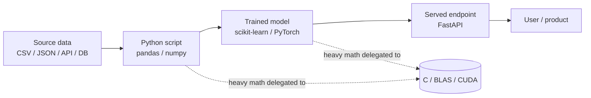
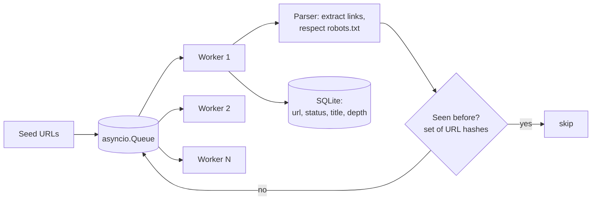

# 0.1 — Python for AI

> Prerequisite level: none. This is the first chapter of the roadmap. Expect ~2 weeks of focused practice to become fluent.

---

## 1. Overview

**What is it?** Python is a high-level, dynamically typed, general-purpose programming language. In the AI world it plays a very specific role: it is the *orchestration layer* that glues your ideas to heavily optimized numerical libraries written in C, C++, Fortran, and CUDA.

**Why does it exist?** Before Python dominated, machine learning was written in MATLAB (expensive licenses), R (statistics-first, weak general-purpose story), C++ (fast but slow to iterate), or Lua (Torch's original language). Python won because it combined the interactive feel of MATLAB with the free, general-purpose nature of a real programming language, and because its C-extension model made it trivial to wrap fast native code — which is exactly what NumPy, PyTorch, and TensorFlow do.

**What problem does it solve?** Rapid experimentation (REPLs, notebooks, dynamic typing: change one line, rerun, learn), production bridging (the same language that runs your prototype can serve HTTP requests with FastAPI and orchestrate pipelines with Airflow), and team communication (a data scientist, an ML engineer, and a backend engineer can all read each other's code).

**Where is it used?** Every part of the AI stack: data pipelines, notebooks, training scripts, model servers, orchestration, evaluation harnesses. The entire modern ML ecosystem — NumPy, Pandas, scikit-learn, PyTorch, HuggingFace, LangChain, Ray — is Python-first.

## 2. Learning Objectives

After this chapter you will be able to:

- Read and write idiomatic Python: comprehensions, unpacking, `zip`, `enumerate`, generators.
- Choose the right data structure (`list`, `tuple`, `set`, `dict`, `deque`, `Counter`, `defaultdict`) and state its big-O costs.
- Write classes with the essential dunder methods (`__init__`, `__repr__`, `__len__`, `__iter__`, `__eq__`).
- Use functional tools: `lambda`, `map`/`filter`, `functools.reduce`, closures, and higher-order functions.
- Write and read decorators and context managers, and explain how they work.
- Use generators to process arbitrarily large files with constant memory.
- Add type hints (`list[int]`, `Optional`, `Callable`, `Protocol`, `TypedDict`) and check them with `mypy`.
- Structure a project as an installable package (`pyproject.toml`, virtual environments, `pip`).
- Explain the GIL, reference-counting garbage collection, `is` vs `==`, and shallow vs deep copy.
- Profile Python code and know when to escape to NumPy, `numba`, or multiprocessing.

## 3. Prerequisites

| Prerequisite | Link | Why |
|---|---|---|
| None | — | This is the entry point of the roadmap. Basic computer literacy (files, terminal) is assumed. |

Everything that follows depends on this chapter: [Linear Algebra](02-linear-algebra.md), [Calculus](03-calculus.md), [Probability & Statistics](04-probability-statistics.md), and especially [NumPy & Pandas](05-numpy-pandas.md) all express their ideas in Python code.

## 4. Intuition

Think of Python as the **conductor of an orchestra**. The conductor doesn't play any instrument at full volume — the violins (NumPy), the brass (PyTorch), and the percussion (CUDA kernels) do the heavy lifting. The conductor's job is to tell everyone *what* to play and *when*. Python code is slow per-instruction, but in AI work each Python instruction triggers millions of fast C/GPU operations, so the conductor's slowness barely matters.

An everyday story: imagine you manage a warehouse. You could carry each box yourself (a pure-Python `for` loop moving one number at a time), or you could write one instruction — "forklift, move that whole pallet" — and let a machine do it (one NumPy call moving a million numbers at once). Fluent Python-for-AI is largely learning to *speak in pallets, not boxes*: expressing computations so that the fast machinery underneath does the work.

The second intuition: Python is designed to read like pseudocode. `[x * x for x in xs if x % 2 == 0]` says "squares of the even elements" almost in English. This readability is why research papers, tutorials, and production teams converge on it — the syntax gets out of the way of the ML idea.

## 5. Real-world Motivation

- **Meta** created and maintains PyTorch, whose user-facing API is entirely Python; virtually all deep-learning research code at Meta AI is Python.
- **OpenAI, Anthropic, and Google DeepMind** write training, evaluation, and data-pipeline code in Python (Google also uses JAX, itself a Python library).
- **Netflix, Uber, and Airbnb** run large Python codebases for data pipelines, feature engineering, and ML services; Netflix has publicly described its heavy use of Python notebooks and Metaflow (a Python framework it open-sourced).
- **Amazon** SageMaker's SDK, and essentially every cloud ML product, exposes a Python-first interface.
- Companies hire for Python because it minimizes the gap between research prototypes and production services: the FastAPI server that serves your model is the same language as the notebook that trained it.

## 6. Mathematical Foundations

This is a tool chapter, so there is no new mathematics — everything below assumes only basic arithmetic and the idea of **function composition**: if $f$ and $g$ are functions, then $(f \circ g)(x) = f(g(x))$ means "apply $g$ first, then $f$." This idea shows up constantly: decorators wrap functions ($\text{timer}(f)$ is a new function), pipelines compose transformations, and later, neural networks are literally deep compositions of functions (see [Calculus](03-calculus.md)).

One quantitative fact worth internalizing now: a pure-Python arithmetic operation costs on the order of 50–100 nanoseconds of interpreter overhead, while the same operation in vectorized C costs well under 1 ns. That factor of ~100 is *why* the rest of this roadmap leans on NumPy and PyTorch. Instead of formulas, memorize these idioms:

| Idiom | Meaning |
|-------|---------|
| `[f(x) for x in xs if cond(x)]` | list comprehension = map + filter in one line |
| `dict(zip(keys, values))` | build a dict from two aligned sequences |
| `for i, x in enumerate(xs):` | iterate with index |
| `sorted(xs, key=lambda x: x.field)` | sort by a projection |
| `with open(path) as f:` | resource management (auto-close) |
| `a, *rest = xs` | tuple unpacking |
| `def f(*args, **kwargs):` | variadic arguments |
| `(x for x in xs)` | generator expression — lazy, O(1) memory |

## 7. Visual Explanation

Where Python sits in an AI system:



How a Python call reaches fast native code:

```
your code            interpreter           native layer
-----------          ------------          -------------
np.dot(a, b)  --->   CPython finds   --->  BLAS dgemm kernel
                     the C function        (SIMD, multi-core)
   ~1 call              ~100 ns             millions of FLOPs
```

The key visual takeaway: the *number of Python-level calls* should be small and each call should do a *lot* of work.

## 8. Algorithm

The "algorithm" here is the learning path — the order in which to acquire the skills:

1. **Syntax basics** — variables, types, control flow, functions.
2. **Data structures** — `list`, `tuple`, `set`, `dict`, `deque`, `defaultdict`, `Counter`.
3. **Idiomatic Python** — comprehensions, generators, unpacking, `zip`, `enumerate`, `itertools`.
4. **OOP** — classes, dunder methods (`__init__`, `__repr__`, `__len__`, `__iter__`).
5. **Functional tools** — `map`, `filter`, `functools.reduce`, `lambda`, closures.
6. **Modules & packaging** — `import`, `__init__.py`, virtual environments, `pip`, `pyproject.toml`.
7. **File I/O + `pathlib`**.
8. **`typing` & type hints** — `Optional`, `Callable`, `Protocol`, `TypedDict`; check with `mypy`.
9. **Exceptions, context managers, decorators.**
10. **NumPy** — covered in [NumPy & Pandas](05-numpy-pandas.md).

And the everyday working loop, as pseudocode:

```text
LOOP until task solved:
    write the smallest piece of code that could work
    run it (REPL / notebook / pytest)
    inspect actual values (print, debugger, df.head())
    IF wrong: form a hypothesis, change ONE thing, go to run
    IF right but slow: profile FIRST, then vectorize or cache the hot spot
    IF right and fast enough: add types + tests, move on
```

## 9. Worked Example

**Tiny example, by hand.** Evaluate `[x * x for x in range(6) if x % 2 == 0]` mentally: `range(6)` yields 0,1,2,3,4,5; the filter keeps 0,2,4; squaring gives **`[0, 4, 16]`**. Now trace `dict(zip("ab", [1, 2]))`: `zip` pairs `('a',1), ('b',2)`; the dict is **`{'a': 1, 'b': 2}`**. If you can trace these without running them, you read comprehensions fluently.

**Realistic example.** Load a CSV of customer transactions, filter to the last 30 days, and compute per-customer total spend — the canonical Python data script:

```python
from pathlib import Path
from collections import defaultdict
from datetime import datetime, timedelta
import csv

cutoff = datetime.now() - timedelta(days=30)   # only keep recent rows
totals = defaultdict(float)                    # missing keys default to 0.0

with Path("transactions.csv").open() as f:     # context manager: auto-close
    for row in csv.DictReader(f):              # each row is a dict keyed by header
        ts = datetime.fromisoformat(row["timestamp"])
        if ts >= cutoff:
            totals[row["customer_id"]] += float(row["amount"])

# sort (customer, total) pairs by total, descending; keep the top 10
top_10 = sorted(totals.items(), key=lambda kv: kv[1], reverse=True)[:10]
print(top_10)   # e.g. [('C042', 1893.20), ('C007', 1544.99), ...]
```

Every construct from the idiom table appears: `with`, `DictReader` iteration, `defaultdict`, `sorted` with a `key` lambda, slicing. Expected output: a list of at most 10 `(customer_id, total)` tuples. Complexity: O(n) over rows plus O(c log c) for the sort over c customers.

## 10. Python from Scratch

To prove there is no magic in the functional built-ins, reimplement them with only `def`, `for`, and `yield`:

```python
def my_map(fn, xs):
    """Lazily apply fn to each element (like built-in map)."""
    for x in xs:          # pull one element at a time
        yield fn(x)       # 'yield' makes this a generator: O(1) memory

def my_filter(pred, xs):
    """Lazily keep elements where pred(x) is truthy."""
    for x in xs:
        if pred(x):
            yield x

def my_reduce(fn, xs, init=None):
    """Fold a sequence into one value: fn(fn(fn(a,b),c),d)..."""
    it = iter(xs)                              # explicit iterator
    acc = next(it) if init is None else init   # seed the accumulator
    for x in it:
        acc = fn(acc, x)                       # combine left-to-right
    return acc

assert list(my_map(lambda x: x + 1, [1, 2, 3])) == [2, 3, 4]
assert list(my_filter(lambda x: x % 2 == 0, range(6))) == [0, 2, 4]
assert my_reduce(lambda a, b: a + b, [1, 2, 3, 4]) == 10
```

And two workhorses you will write in interviews — a decorator and a context manager:

```python
import time
from contextlib import contextmanager
from functools import wraps

def timer(fn):
    """Decorator: wraps fn in timing code without changing callers."""
    @wraps(fn)                      # preserve fn.__name__ / docstring
    def wrapper(*args, **kwargs):   # accept any signature
        t0 = time.perf_counter()
        result = fn(*args, **kwargs)
        print(f"{fn.__name__} took {time.perf_counter() - t0:.4f}s")
        return result
    return wrapper

@contextmanager
def timed(label):
    """Context manager version: 'with timed("load"): ...'"""
    t0 = time.perf_counter()
    yield                           # body of the with-block runs here
    print(f"{label}: {time.perf_counter() - t0:.4f}s")
```

Common bug: forgetting `@wraps(fn)` — the decorated function then reports the wrong `__name__`, which breaks logging and pickling.

## 11. Library Implementation

The standard library already provides these tools; production code uses them directly:

```python
from functools import reduce, lru_cache
from operator import add
from collections import Counter

reduce(add, [1, 2, 3, 4])              # 10 — same as my_reduce
list(map(lambda x: x + 1, [1, 2, 3]))  # [2, 3, 4]
Counter("mississippi").most_common(2)  # [('i', 4), ('s', 4)] — frequency counting

@lru_cache(maxsize=None)               # memoize: cache results by arguments
def fib(n: int) -> int:
    return n if n < 2 else fib(n - 1) + fib(n - 2)
fib(80)                                # instant; without the cache: exponential time
```

For data work you lean on Pandas (detailed in [NumPy & Pandas](05-numpy-pandas.md)) — the 30-day-spend script shrinks to:

```python
import pandas as pd

df = pd.read_csv("transactions.csv", parse_dates=["timestamp"])  # typed columns
cutoff = pd.Timestamp.now() - pd.Timedelta(days=30)
top_10 = (
    df[df["timestamp"] >= cutoff]              # boolean-mask filter (vectorized)
      .groupby("customer_id")["amount"].sum()  # hash-based group + aggregate
      .nlargest(10)                            # top-k without a full sort
)
```

Each line replaces an entire loop from Section 9 with a single vectorized call — this is the "speak in pallets" principle from Section 4 in action.

## 12. Code Walkthrough

Walking through the Pandas version of the pipeline:

| Value | Type / Shape | Meaning |
|---|---|---|
| `df` | `DataFrame`, shape `(n_rows, 3)` | columns: `customer_id` (str), `timestamp` (datetime64), `amount` (float64) |
| `df["timestamp"] >= cutoff` | `Series` of `bool`, length `n_rows` | mask: True for recent rows |
| `df[mask]` | `DataFrame`, shape `(n_recent, 3)` | filtered rows only |
| `.groupby(...)["amount"].sum()` | `Series`, length `n_customers` | index = customer_id, value = total spend |
| `top_10` | `Series`, length ≤ 10 | largest 10 totals, descending |

Inputs: a CSV file path. Output: a `Series` mapping customer IDs to floats. Expected result on a toy file with two customers (`C1` spends 10+20 recently, `C2` spends 5): `C1 → 30.0, C2 → 5.0`. Common bug: forgetting `parse_dates=`, which leaves `timestamp` as strings so the `>=` comparison raises a `TypeError` (or worse, silently compares lexicographically in older code paths).

## 13. Complexity Analysis

Memorize the costs of core containers — they drive every design decision:

| Op | list | dict | set |
|----|------|------|-----|
| index / key lookup | O(1) by index / O(n) by value | O(1) avg | O(1) avg |
| insert at end | O(1) amortized | O(1) avg | O(1) avg |
| insert at front | O(n) (use `deque`: O(1)) | — | — |
| membership `in` | O(n) | O(1) avg | O(1) avg |
| iterate | O(n) | O(n) | O(n) |

Reasoning: lists are contiguous arrays (index arithmetic is O(1), but searching scans), while dicts and sets are open-addressing hash tables (expected O(1), degrading only under adversarial hash collisions). Space: a list comprehension materializes O(n) results; a generator holds O(1) state and produces values on demand — prefer generators for streaming pipelines. Python objects carry overhead (a `float` is ~24 bytes vs 8 bytes raw), which is another reason large numeric data belongs in NumPy arrays.

## 14. Advantages

- **Enormous ecosystem.** Every ML library of consequence ships a Python API first — you will never be blocked waiting for bindings.
- **Fast to prototype.** An idea → notebook → plot loop that takes minutes in Python takes hours in C++. Example: testing five feature-engineering ideas in an afternoon.
- **Easy to hire for and to read.** A new teammate can review your training script on day one; the `top_10` pipeline above is self-explanatory.
- **Great debugging story.** `pdb`/`ipdb`, rich tracebacks, and REPL-driven inspection mean you can poke at a live failure instead of re-running with printfs.
- **Gradual typing.** You can start dynamic and add `mypy`-checked hints as code matures — the best of both worlds.

## 15. Disadvantages

- **Slow single-threaded execution** — interpreted, dynamically dispatched. A pure-Python double loop over a 1000×1000 grid takes seconds; the NumPy equivalent takes milliseconds. Failure case: writing per-pixel image loops in Python.
- **The GIL** (Global Interpreter Lock) allows only one thread to execute Python bytecode at a time, so pure-Python CPU-bound code cannot use multiple cores via threads. Use `multiprocessing`, `concurrent.futures.ProcessPoolExecutor`, or native extensions instead. (Threads are still fine for I/O-bound work.)
- **Dynamic typing → runtime type errors.** A typo like `row["amonut"]` explodes only when that line runs, possibly hours into a job. Mitigate with `mypy` and tests.
- **Deployment weight.** Shipping a Python environment (interpreter + packages) is heavier than a single compiled binary; dependency conflicts ("it works on my machine") are real — hence virtual environments and lock files.
- **Not for hard real-time or tiny devices.** Sub-millisecond inference or microcontroller deployment calls for C++/Rust/ONNX Runtime.

## 16. Common Mistakes

- **Mutable default arguments**: `def f(x=[])` — the list is created *once* and shared across calls. Fix: `def f(x=None): x = [] if x is None else x`.
- **Modifying a list while iterating over it** — elements get skipped. Fix: iterate over a copy (`for x in xs[:]`) or build a new list.
- **Confusing `==` and `is`** — `==` compares values, `is` compares identity. `a is b` may accidentally be True for small ints/interned strings and then break for larger values.
- **Shallow vs deep copy** — `b = a.copy()` on a list of lists copies only the outer list; inner lists are shared. Use `copy.deepcopy` when nesting matters.
- **Not activating the virtual environment before `pip install`** — packages land in the wrong interpreter; "ModuleNotFoundError" despite installing.
- **Overusing OOP for data scripts** — a 40-line script does not need four classes; prefer functions until state genuinely needs encapsulating.
- **Writing Python loops instead of vectorized NumPy** — the single biggest performance mistake in ML code (Section 13 explains why).

## 17. Best Practices

A production-readiness checklist:

- [ ] One virtual environment per project (`python -m venv .venv`); dependencies pinned in `pyproject.toml` / lock file.
- [ ] Type hints on all public functions; `mypy` (or `pyright`) in CI.
- [ ] Format and lint automatically (`ruff format`, `ruff check`) — never argue about style in review.
- [ ] Tests with `pytest`; every bug fix gets a regression test.
- [ ] `pathlib.Path` instead of string paths; `with` blocks for every file/connection.
- [ ] Log with the `logging` module, not `print`, in anything long-running.
- [ ] Small, pure functions for data transforms — easy to test and to later vectorize.
- [ ] Fail loudly: validate inputs at boundaries, raise specific exceptions, never `except: pass`.

> [!TIP]
> Keep notebooks for exploration, but graduate any code you run twice into a `.py` module with tests. Notebooks hide state; modules don't.

## 18. Optimization Techniques

- **Vectorize** with NumPy/Pandas — move loops from the interpreter into C (typically 50–200× speedups).
- **Cache** with `functools.lru_cache` for pure functions; cache to disk (Parquet/pickle) for expensive data pulls.
- **Profile before optimizing**: `cProfile` for call graphs, `line_profiler` for per-line cost, `py-spy` for sampling a *running* process without modifying it.
- **Parallelize** CPU-bound work with `multiprocessing`/`joblib` (bypasses the GIL); I/O-bound work with threads or `asyncio`.
- **Compile hot loops** with `numba` (`@njit` decorator, near-C speed on numeric code) or Cython.
- **Use better data structures**: `set` membership instead of `list` scans; `deque` for queues; generators to keep memory flat.

> [!WARNING]
> Never optimize without profiling first. In typical ML scripts, >90% of the time is in a handful of lines — find them, don't guess.

## 19. Industry Applications

- **Model training & research**: PyTorch (Meta), JAX (Google), and HuggingFace Transformers are Python libraries; nearly all published ML research code is Python.
- **Data pipelines & orchestration**: Airflow (created at Airbnb) and Netflix's Metaflow define pipelines *as Python code*.
- **Model serving**: FastAPI/Flask services front models at countless companies; OpenAI's and Anthropic's client SDKs are Python-first.
- **Notebook-driven analytics**: Netflix, Uber, and Stripe have all described large internal notebook platforms where analyses and even scheduled jobs are Python notebooks.
- **Evaluation & safety harnesses**: LLM eval frameworks (e.g., EleutherAI's lm-evaluation-harness) are Python programs orchestrating thousands of model calls.

## 20. Interview Questions

### Beginner

- **Q: Difference between `list`, `tuple`, `set`, `dict`?**
  A: `list` — ordered, mutable sequence. `tuple` — ordered, immutable (hashable if elements are). `set` — unordered unique elements, O(1) membership. `dict` — key→value hash map, O(1) average lookup, insertion-ordered since Python 3.7.
- **Q: How is `is` different from `==`?**
  A: `==` calls `__eq__` and compares values; `is` compares object identity (same memory object). Use `is` only for singletons like `None`.
- **Q: What does `*args, **kwargs` do?**
  A: `*args` collects extra positional arguments into a tuple; `**kwargs` collects extra keyword arguments into a dict. They let wrappers/decorators forward any signature.
- **Q: What is a virtual environment and why use one?**
  A: An isolated interpreter + site-packages directory per project, so projects with conflicting dependency versions don't break each other and builds are reproducible.
- **Q: Shallow vs deep copy?**
  A: Shallow copy duplicates the outer container but shares inner objects; deep copy (`copy.deepcopy`) recursively duplicates everything.

### Intermediate

- **Q: Generators vs list comprehensions — when to use which?**
  A: List comprehensions materialize all results (O(n) memory, reusable, indexable). Generators are lazy (O(1) memory, single-pass). Use generators for large/streaming data or pipelines; lists when you need random access or multiple passes.
- **Q: Explain decorators and sketch `@timer`.**
  A: A decorator is a function taking a function and returning a replacement; `@d` above `def f` means `f = d(f)`. `timer` wraps the call between two `time.perf_counter()` reads and prints the difference (see Section 10).
- **Q: `@staticmethod` vs `@classmethod` vs instance methods?**
  A: Instance methods receive `self`; classmethods receive the class `cls` (good for alternate constructors like `from_csv`); staticmethods receive neither — they're namespaced plain functions.
- **Q: What is the GIL and when does it matter?**
  A: A mutex ensuring one thread executes Python bytecode at a time. It bottlenecks CPU-bound multi-threading but not I/O-bound threading (the GIL is released during blocking I/O) nor NumPy internals (released during C computation). Work around it with processes.
- **Q: How does Python garbage collection work?**
  A: Primarily reference counting (object freed when count hits zero) plus a generational cycle collector to reclaim reference cycles that refcounting alone can't free.

### Advanced

- **Q: How would you make a class usable in a `for` loop and with `len()`?**
  A: Implement `__iter__` (return an iterator, e.g. a generator) and `__len__`. Alternatively `__getitem__` with integer indices provides legacy iteration.
- **Q: Why is `except Exception: pass` dangerous, and what's better?**
  A: It swallows every error including bugs (typos, `KeyboardInterrupt` escapes only because it's not an `Exception`). Better: catch the *narrowest* exception, handle or log it, and re-raise what you can't handle.
- **Q: Explain closures and the late-binding gotcha in `[lambda: i for i in range(3)]`.**
  A: A closure captures *variables*, not values; all three lambdas share the same `i`, which ends at 2, so all return 2. Fix: default-arg capture, `lambda i=i: i`.
- **Q: When do type hints change runtime behavior?**
  A: Almost never — hints are metadata checked by external tools. Exceptions: libraries that introspect them (dataclasses, pydantic, FastAPI) use hints to generate validation/serialization at runtime.
- **Q: You must process a 100 GB log file on a 16 GB machine. Approach?**
  A: Stream it: iterate line-by-line (file objects are lazy iterators), aggregate into fixed-size structures (dict/Counter), or chunk with `itertools.islice`; never call `.read()` or `readlines()` on the whole file.

## 21. Coding Exercises

### Easy

1. Reverse a string in three different ways (slicing, `reversed` + `join`, manual loop). *Hint: `s[::-1]` is the idiomatic one.*
2. Given two lists `names` and `scores`, build a dict and print the top-3 by score. *Hint: `dict(zip(...))`, then `sorted(..., key=...)`.*
3. Write a context manager that measures execution time of a block. *Hint: `@contextmanager` and `yield` (Section 10).*

### Medium

1. Implement `flatten` for arbitrarily nested lists. *Hint: recursion + `isinstance(x, list)`; make it a generator with `yield from`.*
2. Write a decorator that retries a function up to `n` times with exponential backoff. *Hint: loop inside the wrapper, `time.sleep(base * 2**attempt)`, re-raise on final failure.*
3. Read a large log file line-by-line and count unique IPs using constant memory beyond the set of IPs. *Hint: iterate the file object directly; store only the `set`.*

### Hard

1. Implement an `LRUCache` class with O(1) `get`/`put` using `collections.OrderedDict`. *Hint: `move_to_end` on access, `popitem(last=False)` on eviction.*
2. Build a mini pipeline framework: `Pipeline([step1, step2, ...]).run(data)` where each step is a callable, with per-step timing and error reporting. *Hint: `functools.reduce` over steps.*
3. Write a generator-based tokenizer that streams a huge text file and yields (token, count-so-far) pairs, then compare its memory profile to a list-based version. *Hint: `sys.getsizeof` won't see everything; use `tracemalloc`.*

## 22. Mini Project

**Personal finance summarizer** (pure Python + stdlib):

1. Download or synthesize a CSV bank statement with columns `date, description, amount`.
2. Parse it with `csv.DictReader`, converting `date` via `datetime.fromisoformat` and `amount` to `float`.
3. Write a rule-based categorizer: a list of `(keyword, category)` pairs matched against descriptions (default category `"other"`).
4. Aggregate spend per `(month, category)` with a `defaultdict(float)`.
5. Print a formatted monthly table (f-strings with alignment: `f"{cat:<15}{total:>10.2f}"`).
6. Add `argparse` flags for the input path and a `--month` filter; add three `pytest` tests for the categorizer.

## 23. Medium Project

**CLI weather app** (packaging + HTTP + caching):

1. Sign up for a free weather API (e.g., Open-Meteo needs no key) and fetch a forecast with `requests`.
2. Model the response as a `@dataclass` with type hints.
3. Cache responses to disk (JSON file keyed by city + date) with a 10-minute TTL to avoid repeated calls.
4. Pretty-print with the `rich` library (table of days, colors for temperature).
5. Package it: `pyproject.toml` with a `[project.scripts] weather = "weather_app.cli:main"` entry point so `pip install .` creates a `weather` command.
6. Add `mypy` and `ruff` configuration; make both pass.

## 24. Advanced Project

**Async web crawler with benchmark suite.**

Architecture:



Implementation phases:

1. **Synchronous baseline**: `requests` + a `deque` frontier, depth-limited BFS to depth `k`, URL deduplication with a `set`.
2. **Threaded version**: `ThreadPoolExecutor` — observe the speedup (I/O-bound, so threads help despite the GIL).
3. **Async version**: `asyncio` + `aiohttp`, N workers pulling from an `asyncio.Queue`, `robots.txt` honored via `urllib.robotparser`, results streamed to SQLite (single writer task to avoid lock contention).
4. **CLI + benchmark**: `--workers`, `--depth`, `--rate-limit` flags; a benchmark script comparing pages/second across the three versions and plotting the result.

Possible improvements: per-domain politeness delays, retry with exponential backoff (reuse your decorator from Section 21), a bloom filter for the seen-set, resumable crawls via the SQLite state.

## 25. Summary

- Python is the orchestration layer of AI: slow per-instruction, but every instruction can trigger fast native code.
- Fluency = idioms: comprehensions, unpacking, `zip`/`enumerate`, generators, decorators, context managers.
- Choose data structures by their big-O: dict/set for O(1) membership, list for ordered data, deque for queues.
- Generators give O(1)-memory streaming; list comprehensions give O(n)-memory random access.
- The GIL blocks CPU-bound threading; use processes or native extensions — I/O-bound threading is fine.
- Mutable default arguments, `==` vs `is`, and shallow copies are the classic beginner traps.
- Type hints + `mypy` catch a large class of bugs before runtime, at zero runtime cost.
- Package real projects with `pyproject.toml` and a virtual environment; keep notebooks for exploration only.
- Profile before optimizing; the fix is usually vectorization (next chapters) or caching.
- Everything in [Linear Algebra](02-linear-algebra.md) through [NumPy & Pandas](05-numpy-pandas.md) — and every later phase — is expressed in this language.

## 26. Cheat Sheet

| Construct | One-liner |
|---|---|
| map+filter | `[f(x) for x in xs if p(x)]` |
| dict build | `{k: v for k, v in pairs}` |
| top-k | `sorted(xs, key=..., reverse=True)[:k]` or `heapq.nlargest` |
| counting | `Counter(xs).most_common(k)` |
| grouping | `defaultdict(list)`; `d[key].append(x)` |
| safe file | `with open(p) as f:` |
| lazy pipeline | generators + `yield from` |
| memoize | `@functools.lru_cache` |
| timing | `time.perf_counter()` pairs |

Defaults & tips: one venv per project; `ruff` + `mypy` in CI; `pathlib` over string paths; log, don't print. Gotchas: `def f(x=[])` shares state; closures capture variables late; `is` ≠ `==`; `iterrows`-style element loops are the #1 perf killer — vectorize.

## 27. Further Reading

- **Books**: *Fluent Python* (Luciano Ramalho) — the definitive idioms book; *Effective Python* (Brett Slatkin); *Python Cookbook* (Beazley & Jones).
- **Research Papers**: not a research topic per se, but "Array programming with NumPy" (Harris et al., Nature 2020) explains the ecosystem Python anchors.
- **Documentation**: The official Python Tutorial (docs.python.org); the `typing`, `itertools`, and `functools` module docs; Python Packaging User Guide (packaging.python.org).
- **GitHub Repositories**: `python/cpython` (read the source of `functools`!); `TheAlgorithms/Python`; `astral-sh/ruff`.
- **Datasets**: Titanic (Kaggle) and any bank-statement CSV for the projects in this chapter.
- **YouTube/Videos**: Corey Schafer's Python series; Raymond Hettinger's talks ("Beyond PEP 8", "Transforming Code into Beautiful, Idiomatic Python"); David Beazley's generator/GIL talks.
- **Blogs**: Real Python (realpython.com); the official Python blog; Trey Hunner's Python Morsels articles.
