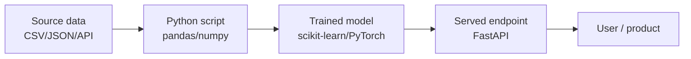

# 0.1 — Python for AI

> Prerequisite level: none. You should finish this in ~2 weeks of focused practice.

---

## 1. Intuition first

Python is the *lingua franca* of AI because it is:

- **Readable** — feels like pseudocode, so you spend brain cycles on the ML idea, not the syntax.
- **Interoperable** — thin wrappers (NumPy, PyTorch, TensorFlow) call fast C / CUDA underneath, so you write Python but run at hardware speed.
- **Batteries-included ecosystem** — the entire modern ML stack (NumPy, Pandas, scikit-learn, PyTorch, HuggingFace, LangChain, Ray…) is Python-first.

Think of Python as the **glue** between your ideas and heavily-optimized numerical libraries.

## 2. Why the topic exists

Before Python dominated, ML was written in MATLAB, R, C++, or Lua. Each had trade-offs (licensing, speed, ecosystem). Python became the winner because it combined the interactive feel of MATLAB with the free, general-purpose nature of a real programming language, and its C-extension model made it trivial to wrap fast native code.

## 3. What problem it solves

- **Rapid experimentation** — REPLs, notebooks, dynamic typing → change one line, rerun, learn.
- **Production bridging** — the same language that runs your prototype can also serve HTTP requests (via FastAPI), orchestrate pipelines (via Airflow), and run on the cloud.
- **Team communication** — a data scientist, ML engineer, and backend engineer can all read each other's code.

## 4. Mathematics

None specific — but everything below assumes basic arithmetic and function-composition intuition.

## 5. Every "formula" explained

Not applicable — this is a tool chapter. Instead, memorize these idioms:

| Idiom | Meaning |
|-------|---------|
| `[f(x) for x in xs if cond(x)]` | list comprehension = map + filter in one line |
| `dict(zip(keys, values))` | build a dict from two aligned sequences |
| `for i, x in enumerate(xs):` | iterate with index |
| `sorted(xs, key=lambda x: x.field)` | sort by a projection |
| `with open(path) as f:` | resource management (auto-close) |
| `a, *rest = xs` | tuple unpacking |
| `def f(*args, **kwargs):` | variadic arguments |

## 6. Every "variable" explained

Not applicable.

## 7. Step-by-step "algorithm" (learning path)

1. **Syntax basics** (1 day) — variables, types, control flow, functions.
2. **Data structures** (2 days) — list, tuple, set, dict, deque, defaultdict, Counter.
3. **Idiomatic Python** (2 days) — comprehensions, generators, unpacking, `zip`, `enumerate`, `itertools`.
4. **OOP** (1 day) — classes, dunder methods (`__init__`, `__repr__`, `__len__`, `__iter__`).
5. **Functional tools** (1 day) — `map`, `filter`, `functools.reduce`, `lambda`, higher-order functions, closures.
6. **Modules & packaging** (1 day) — `import`, `__init__.py`, virtual environments, `pip`, `pyproject.toml`.
7. **File I/O + `pathlib`** (1 day).
8. **`typing` & type hints** (1 day) — `List`, `Dict`, `Optional`, `Callable`, `Protocol`, `TypedDict`.
9. **Exceptions, context managers, decorators** (1 day).
10. **NumPy** (2–3 days — covered in 0.5).

## 8. Simple example

```python
squares_of_evens = [x * x for x in range(10) if x % 2 == 0]
```

## 9. Real-world example

Loading a CSV of customer transactions, filtering to the last 30 days, and computing per-customer total spend — the canonical Python data script:

```python
from pathlib import Path
from collections import defaultdict
from datetime import datetime, timedelta
import csv

cutoff = datetime.now() - timedelta(days=30)
totals = defaultdict(float)

with Path("transactions.csv").open() as f:
    for row in csv.DictReader(f):
        ts = datetime.fromisoformat(row["timestamp"])
        if ts >= cutoff:
            totals[row["customer_id"]] += float(row["amount"])

top_10 = sorted(totals.items(), key=lambda kv: kv[1], reverse=True)[:10]
```

## 10. Diagram



## 11. Implementation from scratch (of the "Python skill" — solve without libraries)

Reimplement common utilities using only built-ins:

```python
def my_map(fn, xs):
    for x in xs:
        yield fn(x)

def my_filter(pred, xs):
    for x in xs:
        if pred(x):
            yield x

def my_reduce(fn, xs, init=None):
    it = iter(xs)
    acc = next(it) if init is None else init
    for x in it:
        acc = fn(acc, x)
    return acc

assert list(my_map(lambda x: x + 1, [1, 2, 3])) == [2, 3, 4]
assert my_reduce(lambda a, b: a + b, [1, 2, 3, 4]) == 10
```

## 12. Implementation using libraries

```python
from functools import reduce
from operator import add

reduce(add, [1, 2, 3, 4])  # 10
list(map(lambda x: x + 1, [1, 2, 3]))  # [2, 3, 4]
```

For data work you will lean on:

```python
import numpy as np
import pandas as pd

df = pd.read_csv("transactions.csv", parse_dates=["timestamp"])
cutoff = pd.Timestamp.now() - pd.Timedelta(days=30)
top_10 = (
    df[df["timestamp"] >= cutoff]
      .groupby("customer_id")["amount"].sum()
      .nlargest(10)
)
```

## 13. Time complexity

Depends on the operation. Memorize these for `list`, `dict`, `set`:

| Op | list | dict | set |
|----|------|------|-----|
| index / lookup | O(1) / O(n) | O(1) avg | O(1) avg |
| insert end | O(1) amortized | O(1) avg | O(1) avg |
| membership `in` | O(n) | O(1) avg | O(1) avg |
| iterate | O(n) | O(n) | O(n) |

## 14. Space complexity

- Generators / iterators = O(1) memory (lazy).
- List comprehensions = O(n) memory (materialized).
- Prefer generators for streaming pipelines.

## 15. Advantages

- Enormous ecosystem.
- Fast to prototype.
- Easy to hire for.
- Great debugging story (pdb, ipdb, rich tracebacks).

## 16. Disadvantages

- **Slow single-threaded execution** — hence NumPy / C-extensions.
- **GIL** limits pure-Python multithreading for CPU-bound work → use `multiprocessing`, `concurrent.futures`, or Rust/Cython.
- **Dynamic typing** → runtime type errors. Mitigate with `mypy`.

## 17. Interview questions

1. Difference between `list`, `tuple`, `set`, `dict`.
2. What is the GIL and when does it matter?
3. How is `is` different from `==`?
4. Shallow vs deep copy?
5. What does `*args, **kwargs` do?
6. Generators vs list comprehensions — when to use which?
7. Explain decorators. Write `@timer`.
8. What is the difference between `@staticmethod`, `@classmethod`, and instance methods?
9. How does Python's garbage collection work (refcount + cycle collector)?
10. What is a Python virtual environment and why do we use one?

## 18. Common mistakes

- Using mutable default arguments: `def f(x=[]):`.
- Modifying a list while iterating over it.
- Confusing `==` and `is`.
- Not activating the virtual environment before `pip install`.
- Overusing OOP for data-processing scripts.
- Not vectorizing (writing Python loops instead of NumPy operations).

## 19. Optimization techniques

- Vectorize with NumPy / Pandas.
- Use `numba` or `cython` for hot loops.
- Use `multiprocessing` / `joblib` for parallelism.
- Profile with `cProfile`, `line_profiler`, `py-spy`.
- Cache with `functools.lru_cache`.

## 20. Coding exercises

1. Reverse a string in 3 different ways.
2. Implement `flatten` for arbitrarily nested lists.
3. Write a decorator that retries a function up to `n` times with exponential backoff.
4. Implement a `LRUCache` class using `OrderedDict`.
5. Read a large log file line-by-line and count unique IPs using constant memory.
6. Implement a context manager that measures execution time.
7. Solve the top 30 "Easy" LeetCode problems in Python.

## 21. Mini project

**"Personal finance summarizer"** — parse a CSV bank statement, categorize transactions with rules, print a monthly summary. Pure Python + stdlib only.

## 22. Medium project

**"CLI weather app"** — call an HTTP API (`requests`), cache responses to disk (`pickle`), pretty-print with `rich`, package it with `pyproject.toml` so `pip install .` makes a `weather` command.

## 23. Advanced project

**"Async web crawler"** — using `asyncio` + `aiohttp`, crawl a website up to depth `k`, respect `robots.txt`, deduplicate URLs, and stream results to a SQLite DB. Add a `--workers` flag and benchmark against a threaded and a synchronous version.

## 24. Where it is used in industry

Every part of the AI stack: data pipelines, notebooks, training scripts, model servers, orchestration, evaluation harnesses.

## 25. How companies use it

- **OpenAI, Anthropic, Google DeepMind** — training and evaluation code is Python.
- **Netflix, Uber, Airbnb** — Python for data pipelines, feature engineering, ML services.
- **Meta** — PyTorch itself is Python-first.

## 26. When NOT to use it

- Ultra-low-latency inference (< 1 ms) — use C++, Rust, or Triton.
- Mobile / embedded deployment — use TFLite, CoreML, or ONNX runtime in C++.
- Extremely CPU-bound multi-core workloads without NumPy — use Rust or Go.
