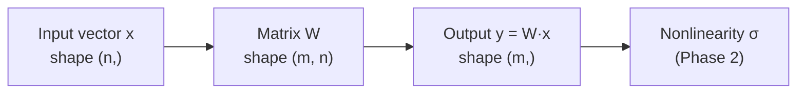
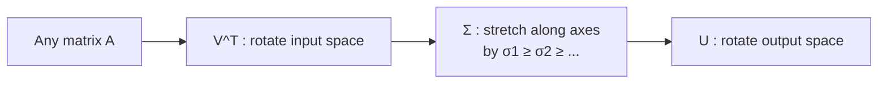
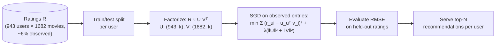

# 0.2 — Linear Algebra for AI

> The single most important branch of math for ML. If you skip this, everything in Phase 1–6 will feel like magic.

---

## 1. Overview

**What is it?** Linear algebra is the mathematics of vectors (ordered lists of numbers), matrices (grids of numbers), and the linear transformations between them. It gives us a compact language for manipulating *many numbers at once*.

**Why does it exist?** Almost every learning algorithm boils down to: "find parameters (a vector or matrix) that transform inputs (vectors) into outputs (vectors) in a way that minimizes some scalar loss." Linear algebra provides both the notation for that statement and the primitive operations — dot products, matrix multiplies, decompositions — that hardware can execute massively in parallel.

**What problem does it solve?** It lets us represent structured data (images, text embeddings, tabular rows) compactly; express complex transformations in short notation ($\mathbf{y} = W\mathbf{x} + \mathbf{b}$); exploit GPUs and TPUs, whose entire design centers on fast matrix multiplication (BLAS, cuBLAS); and solve linear systems that appear everywhere (least squares, PCA, normal equations, Kalman filters, PageRank).

**Where is it used?** Every neural-network layer is a matrix multiply. Every embedding similarity is a dot product. Attention in transformers is three matrix multiplies and a softmax. PCA, recommender systems, and image compression are matrix decompositions. There is no ML without linear algebra.

## 2. Learning Objectives

After this chapter you will be able to:

- Define scalars, vectors, matrices, and tensors, and read shape notation like $A \in \mathbb{R}^{m \times n}$ or $[B, C, H, W]$.
- Compute dot products, matrix–vector, and matrix–matrix products by hand and state their complexity.
- Interpret a matrix geometrically as a linear transformation that stretches, rotates, and shears space.
- Compute and compare L1, L2, L∞, and Frobenius norms, and explain their roles in ML (Lasso vs Ridge).
- Use transpose, inverse, identity, determinant, rank, and trace correctly, and know when an inverse exists.
- Explain eigenvalues/eigenvectors and compute the dominant one via power iteration.
- State the Singular Value Decomposition and use it for low-rank approximation and PCA.
- Explain why cosine similarity works for embeddings.
- Implement matrix multiplication and power iteration in pure Python, then in NumPy.
- Avoid the classic numerical pitfalls: computing explicit inverses, shape-mismatch bugs, `(n,)` vs `(n,1)`.

## 3. Prerequisites

| Prerequisite | Link | Why |
|---|---|---|
| Python for AI | [01-python-for-ai.md](01-python-for-ai.md) | All implementations here are Python; you need loops, lists, and functions. |

This chapter is itself a prerequisite for nearly everything later, most directly [Calculus](03-calculus.md) (gradients are vectors, Jacobians are matrices), [NumPy & Pandas](05-numpy-pandas.md) (NumPy is executable linear algebra), [PCA](../phase-1-classical-ml/13-pca.md), and [Attention](../phase-2-deep-learning/09-attention.md) in Phase 2.

## 4. Intuition

Linear algebra is the language of "many numbers at once." Instead of one value $x$, you think in **vectors** (lists), **matrices** (grids), and **tensors** (higher-dimensional grids). Two mental models will carry you through the entire roadmap:

- **A vector is a point** (or an arrow from the origin) in high-dimensional space; its coordinates are its components. A 512-dimensional sentence embedding is literally a point in a 512-dimensional space, and "similar sentences" are nearby points.
- **A matrix is a function** — a machine that takes a vector in and produces a vector out, in a way that is *linear*: it can stretch, rotate, and shear space, but it keeps grid lines straight, parallel, and evenly spaced, and it keeps the origin fixed.

An everyday story: think of a photo-editing app. When you resize, rotate, or skew a photo, every pixel coordinate is being pushed through a small matrix. The matrix *is* the edit. Eigenvectors are then easy to describe: they are the special directions the edit doesn't rotate — a pure horizontal stretch leaves the horizontal axis pointing the same way, only longer. And SVD says something remarkable: **every** linear edit, no matter how messy, is secretly a rotation, then an axis-aligned stretch, then another rotation.

One more analogy for the dot product: it is a "compatibility score." Point two arrows the same way and the score is large and positive; make them perpendicular and it is zero; oppose them and it is negative. That single idea powers embedding search and attention scores.

## 5. Real-world Motivation

- **Google**'s original PageRank algorithm ranks web pages by computing the dominant eigenvector of the web's link matrix — a pure linear-algebra computation at planetary scale.
- **Netflix and Spotify** popularized low-rank matrix factorization for recommendations: approximate the (users × items) rating matrix as $R \approx UV^T$, where the low-dimensional factors capture latent taste dimensions. The Netflix Prize (2006–2009) made this famous.
- **OpenAI, Meta, Google** train transformers whose compute cost is dominated by matrix multiplication; NVIDIA GPUs and Google TPUs exist essentially to multiply matrices fast (Tensor Cores and systolic arrays are matmul hardware).
- **ML infrastructure teams** everywhere treat GEMM (general matrix multiply) as the #1 optimization target — a few percent improvement saves millions in compute.
- **Embedding search** at companies like Google (semantic search) and Amazon (product similarity) is dot products between query vectors and billions of item vectors.

## 6. Mathematical Foundations

### 6.1 The objects

- **Scalar** $x \in \mathbb{R}$ — a single real number.
- **Vector** $\mathbf{x} \in \mathbb{R}^n$ — an ordered tuple of $n$ numbers, written as a column:

$$
\mathbf{x} = \begin{bmatrix} x_1 \\ x_2 \\ \vdots \\ x_n \end{bmatrix}
$$

- **Matrix** $A \in \mathbb{R}^{m \times n}$ — $m$ rows, $n$ columns; $A_{ij}$ is the entry at row $i$, column $j$.
- **Tensor** — the generalization to 3D, 4D, …; e.g. a batch of images has shape $[B, C, H, W]$ (batch, channels, height, width).

### 6.2 Core operations

**Dot product** of $\mathbf{a}, \mathbf{b} \in \mathbb{R}^n$ (both length-$n$ vectors):

$$
\mathbf{a} \cdot \mathbf{b} = \mathbf{a}^T\mathbf{b} = \sum_{i=1}^{n} a_i b_i
$$

Geometrically, $\mathbf{a}\cdot\mathbf{b} = \|\mathbf{a}\|_2\,\|\mathbf{b}\|_2 \cos\theta$, where $\theta$ is the angle between the vectors — hence for unit vectors the dot product *is* $\cos\theta$, the foundation of cosine similarity and attention scores.

**Matrix–vector multiply** $\mathbf{y} = A\mathbf{x}$ with $A \in \mathbb{R}^{m \times n}$, $\mathbf{x} \in \mathbb{R}^n$:

$$
y_i = \sum_{j=1}^{n} A_{ij}\, x_j \quad \text{for } i = 1, \ldots, m
$$

Two equivalent readings: each output $y_i$ is the dot product of row $i$ of $A$ with $\mathbf{x}$; or $\mathbf{y}$ is a weighted combination of the *columns* of $A$ with weights $x_j$. The second view explains why the columns of $A$ span the set of reachable outputs.

**Matrix–matrix multiply** $C = AB$ with $A \in \mathbb{R}^{m \times k}$, $B \in \mathbb{R}^{k \times n}$ (inner dimensions must match):

$$
C_{ij} = \sum_{p=1}^{k} A_{ip}\, B_{pj}, \qquad C \in \mathbb{R}^{m \times n}
$$

Composition of transformations: applying $B$ then $A$ equals applying $AB$. Note $AB \neq BA$ in general.

### 6.3 Norms — measuring size

For $\mathbf{x} \in \mathbb{R}^n$:

$$
\|\mathbf{x}\|_2 = \sqrt{\sum_i x_i^2} \qquad \text{(L2 / Euclidean: straight-line length)}
$$

$$
\|\mathbf{x}\|_1 = \sum_i |x_i| \qquad \text{(L1: "taxicab" distance; used in Lasso — promotes sparsity)}
$$

$$
\|\mathbf{x}\|_\infty = \max_i |x_i| \qquad \text{(largest component)}
$$

$$
\|A\|_F = \sqrt{\sum_{i,j} A_{ij}^2} \qquad \text{(Frobenius: L2 of a matrix flattened)}
$$

Their regularization roles are developed in [Regularization](../phase-1-classical-ml/05-regularization.md).

### 6.4 Transpose, identity, inverse

- **Transpose**: $(A^T)_{ij} = A_{ji}$ — flip rows and columns. Key identity: $(AB)^T = B^T A^T$ (proved in Section 20).
- **Identity** $I$: the do-nothing transformation, $I\mathbf{x} = \mathbf{x}$; ones on the diagonal, zeros elsewhere.
- **Inverse** $A^{-1}$: the undo transformation, $AA^{-1} = A^{-1}A = I$. It exists iff $A$ is square **and** full-rank ($\det(A) \neq 0$). If $A$ squashes space onto a line or plane (rank-deficient), information is lost and no inverse can recover it.

### 6.5 Determinant, rank, trace

- $\det(A)$ — the **volume scaling factor** of the transformation: $|\det| = 2$ means areas/volumes double; $\det = 0$ means space is flattened (not invertible); negative sign means orientation flips.
- $\operatorname{rank}(A)$ — the number of linearly independent columns (equivalently rows) = the dimension of the output space $A$ can actually reach.
- $\operatorname{tr}(A) = \sum_i A_{ii}$ — the sum of the diagonal; equals the sum of eigenvalues.

### 6.6 Eigenvalues and eigenvectors

For square $A$, a nonzero vector $\mathbf{v}$ and scalar $\lambda$ satisfying

$$
A\mathbf{v} = \lambda\mathbf{v}
$$

are an **eigenvector** and its **eigenvalue**: directions that $A$ merely stretches by factor $\lambda$ without rotating. Derivation of how to find them: rewrite as $(A - \lambda I)\mathbf{v} = \mathbf{0}$; a nonzero solution $\mathbf{v}$ exists only if $A - \lambda I$ is singular, i.e.

$$
\det(A - \lambda I) = 0
$$

— the *characteristic equation*, a degree-$n$ polynomial in $\lambda$ whose roots are the eigenvalues. Symmetric matrices (like covariance matrices) have real eigenvalues and orthogonal eigenvectors — the fact behind [PCA](../phase-1-classical-ml/13-pca.md).

### 6.7 Singular Value Decomposition (SVD)

Every real matrix $A \in \mathbb{R}^{m \times n}$ — square or not — factors as

$$
A = U \Sigma V^T
$$

where $U \in \mathbb{R}^{m \times m}$ is orthogonal (columns = **left singular vectors**), $V \in \mathbb{R}^{n \times n}$ is orthogonal (columns = **right singular vectors**), and $\Sigma \in \mathbb{R}^{m \times n}$ is diagonal with non-negative **singular values** $\sigma_1 \ge \sigma_2 \ge \cdots \ge 0$. Reading right to left: rotate ($V^T$), stretch along axes ($\Sigma$), rotate again ($U$). The **Eckart–Young theorem** says the best rank-$k$ approximation of $A$ (in Frobenius norm) is obtained by keeping the top $k$ singular values:

$$
A_k = \sum_{i=1}^{k} \sigma_i\, \mathbf{u}_i \mathbf{v}_i^T, \qquad \|A - A_k\|_F^2 = \sum_{i>k} \sigma_i^2
$$

where $\mathbf{u}_i, \mathbf{v}_i$ are the $i$-th columns of $U, V$. This underlies PCA, image compression, latent semantic analysis, and LoRA-style low-rank fine-tuning in [Phase 3](../phase-3-nlp-llm/).

**Symbol table**: $n, m, k$ — dimensions; $\mathbf{x}, \mathbf{y}, \mathbf{a}, \mathbf{b}, \mathbf{v}$ — vectors; $A, B, C, W$ — matrices; $x_i$ — $i$-th component; $A_{ij}$ — entry (row $i$, col $j$); $\lambda$ — eigenvalue; $\sigma_i$ — $i$-th singular value; $\theta$ — angle between vectors; $\|\cdot\|$ — a norm; $I$ — identity matrix.

## 7. Visual Explanation

Data flow of one linear layer:



How SVD decomposes any transformation:



Geometric intuition for a 2×2 matrix acting on the unit square:

```
Before A            After A
+-----+             +---------+
|     |    --->    /         /
|     |           /         /
+-----+          +---------+
(the matrix stretches / rotates / shears space;
 |det A| = ratio of the two areas)
```

## 8. Algorithm

The workhorse algorithm of all of ML — **matrix multiplication** $C = AB$ with $A \in \mathbb{R}^{m \times k}$, $B \in \mathbb{R}^{k \times n}$:

1. Check inner dimensions match ($A$ has $k$ columns, $B$ has $k$ rows); otherwise the product is undefined.
2. Allocate output $C \in \mathbb{R}^{m \times n}$, all zeros.
3. For each row $i = 1..m$ and each column $j = 1..n$, set $C_{ij} = \sum_{p=1}^{k} A_{ip} B_{pj}$ — the dot product of row $i$ of $A$ with column $j$ of $B$.
4. Return $C$.

```text
function MATMUL(A[m][k], B[k][n]):
    assert cols(A) == rows(B)
    C = zeros(m, n)
    for i in 1..m:
        for j in 1..n:
            s = 0
            for p in 1..k:
                s += A[i][p] * B[p][j]
            C[i][j] = s
    return C          # O(m·n·k) multiply-adds
```

And **power iteration** for the dominant eigenvector (used by PageRank):

```text
function POWER_ITERATION(A[n][n], iters):
    v = random unit vector of length n
    repeat iters times (or until v stops changing):
        v = A·v            # apply the transformation
        v = v / ||v||2     # renormalize to prevent overflow
    λ = vᵀ A v             # Rayleigh quotient = eigenvalue estimate
    return λ, v
```

Why it works: writing $\mathbf{v}$ in the eigenbasis, each application of $A$ multiplies the component along eigenvector $i$ by $\lambda_i$; after many iterations the largest $|\lambda|$ dominates, so $\mathbf{v}$ rotates toward the dominant eigenvector.

## 9. Worked Example

**Tiny example by hand.** Let

$$
A = \begin{bmatrix} 1 & 2 \\ 3 & 4 \end{bmatrix}, \quad \mathbf{x} = \begin{bmatrix} 5 \\ 6 \end{bmatrix}
$$

$$
A\mathbf{x} = \begin{bmatrix} 1\cdot 5 + 2\cdot 6 \\ 3\cdot 5 + 4\cdot 6 \end{bmatrix} = \begin{bmatrix} 17 \\ 39 \end{bmatrix}
$$

Also by hand: $\det(A) = 1\cdot 4 - 2\cdot 3 = -2 \neq 0$, so $A$ is invertible and flips orientation while doubling areas. Eigenvalues: $\det(A - \lambda I) = (1-\lambda)(4-\lambda) - 6 = \lambda^2 - 5\lambda - 2 = 0$, giving $\lambda = \frac{5 \pm \sqrt{33}}{2} \approx 5.37, -0.37$.

**Cosine similarity by hand.** $\mathbf{a} = (1, 0)$, $\mathbf{b} = (1, 1)$: $\mathbf{a}\cdot\mathbf{b} = 1$, $\|\mathbf{a}\| = 1$, $\|\mathbf{b}\| = \sqrt{2}$, so $\cos\theta = 1/\sqrt{2} \approx 0.707$ → 45°, "moderately similar."

**Realistic example.** A neural-network layer maps a 512-dimensional embedding to 256 features: $\mathbf{h} = \sigma(W\mathbf{x} + \mathbf{b})$ with $W \in \mathbb{R}^{256 \times 512}$, $\mathbf{x} \in \mathbb{R}^{512}$, $\mathbf{b} \in \mathbb{R}^{256}$ (bias) and $\sigma$ an elementwise nonlinearity. One forward pass costs $256 \times 512 = 131{,}072$ multiply-adds; a batch of 64 inputs becomes a single matmul $XW^T$ of shape $(64, 512) \times (512, 256) \to (64, 256)$ — exactly why we batch.

## 10. Python from Scratch

Pure Python (no NumPy), fully spelled out:

```python
def matmul(A, B):
    """C = A @ B for lists-of-lists. Shapes: (m,k) x (k,n) -> (m,n)."""
    m, k = len(A), len(A[0])
    k2, n = len(B), len(B[0])
    assert k == k2, "inner dims must match"      # classic bug: passing B transposed
    C = [[0.0] * n for _ in range(m)]            # allocate zero matrix
    for i in range(m):                           # each output row
        for j in range(n):                       # each output column
            s = 0.0
            for p in range(k):                   # dot product of row i, col j
                s += A[i][p] * B[p][j]
            C[i][j] = s
    return C                                     # O(m*n*k) time, O(m*n) space

def dot(a, b):
    """Dot product of two equal-length vectors. O(n)."""
    return sum(x * y for x, y in zip(a, b))

def l2_norm(x):
    """Euclidean length. O(n)."""
    return sum(v * v for v in x) ** 0.5
```

Power iteration for the dominant eigenpair:

```python
def power_iteration(A, num_iters=100, tol=1e-9):
    n = len(A)
    v = [1.0 / n] * n                            # any nonzero start vector works
    for _ in range(num_iters):
        # Av: apply the matrix (O(n^2) per iteration)
        Av = [sum(A[i][j] * v[j] for j in range(n)) for i in range(n)]
        norm = l2_norm(Av)
        new_v = [x / norm for x in Av]           # renormalize: prevents overflow
        if l2_norm([a - b for a, b in zip(new_v, v)]) < tol:
            v = new_v
            break                                # converged
        v = new_v
    # Rayleigh quotient v^T A v gives the eigenvalue estimate
    Av = [sum(A[i][j] * v[j] for j in range(n)) for i in range(n)]
    lam = dot(v, Av)
    return lam, v

lam, v = power_iteration([[2.0, 0.0], [0.0, 1.0]])
print(round(lam, 6), [round(x, 3) for x in v])   # 2.0 [1.0, 0.0]
```

Expected output: eigenvalue `2.0` with eigenvector `[1, 0]` — the direction of largest stretch. Common bug: skipping renormalization, which overflows to `inf` for $|\lambda| > 1$ (or underflows to 0 for $|\lambda| < 1$). Convergence is slow when $|\lambda_1| \approx |\lambda_2|$.

## 11. Library Implementation

NumPy is the reference implementation of linear algebra for Python (fuller treatment in [NumPy & Pandas](05-numpy-pandas.md)):

```python
import numpy as np

A = np.array([[1., 2.], [3., 4.]])       # shape (2, 2)
x = np.array([5., 6.])                   # shape (2,)

y = A @ x                                # matrix-vector: array([17., 39.])
C = A @ A.T                              # matrix-matrix, shape (2, 2)
sol = np.linalg.solve(A, y)              # solve A·s = y  -> recovers x = [5., 6.]
U, S, Vt = np.linalg.svd(A)              # SVD: U (2,2), S (2,) descending, Vt (2,2)
w, V = np.linalg.eig(A)                  # eigenvalues w (2,), eigenvectors in columns of V

# Low-rank (rank-1) approximation via truncated SVD:
A1 = S[0] * np.outer(U[:, 0], Vt[0, :])  # best rank-1 approx by Eckart-Young
err = np.linalg.norm(A - A1)             # equals S[1], the discarded singular value

# Cosine similarity between all pairs of rows of a matrix E (n, d):
E = np.random.default_rng(0).normal(size=(4, 3))
En = E / np.linalg.norm(E, axis=1, keepdims=True)  # normalize rows to unit length
sims = En @ En.T                          # (4, 4) matrix of cosines; diagonal = 1.0
```

> [!WARNING]
> Prefer `np.linalg.solve(A, b)` over `np.linalg.inv(A) @ b`. Explicit inversion is slower and numerically less stable — the solver factorizes $A$ (LU) and back-substitutes, avoiding the error amplification of forming $A^{-1}$.

## 12. Code Walkthrough

Tracing the library code above:

| Tensor | Shape | Meaning |
|---|---|---|
| `A` | (2, 2) | the transformation |
| `x` | (2,) | input vector (1-D, *not* a column matrix) |
| `y = A @ x` | (2,) | transformed vector → `[17., 39.]` |
| `U`, `Vt` | (2, 2), (2, 2) | orthogonal rotation factors |
| `S` | (2,) | singular values, descending — for this `A`: ≈ `[5.465, 0.366]` |
| `A1` | (2, 2) | best rank-1 approximation; error `‖A−A1‖_F = 0.366 = S[1]` |
| `En` | (4, 3) | rows scaled to unit L2 norm |
| `sims` | (4, 4) | pairwise cosine similarities; symmetric, diagonal 1.0 |

Inputs are plain arrays; outputs are arrays whose shapes you should *predict before running* — shape prediction is the core skill. Note the `(n,)` vs `(n,1)` distinction: `A @ x` with `x` of shape `(2,)` returns shape `(2,)`, but with `x` of shape `(2,1)` returns `(2,1)`; mixing them causes broadcasting surprises downstream.

## 13. Complexity Analysis

| Operation | Time | Why |
|---|---|---|
| Dot product ($n$-vectors) | $O(n)$ | one multiply-add per component |
| Matrix–vector ($m \times n$) | $O(mn)$ | $m$ dot products of length $n$ |
| Matrix–matrix ($m\times k \cdot k\times n$) | $O(mnk)$ naive | $mn$ dot products of length $k$; Strassen ≈ $O(n^{2.807})$, theoretical bounds ≈ $O(n^{2.37})$, but real libraries use blocked/BLAS naive-order algorithms tuned for cache and SIMD |
| Solve $A\mathbf{x}=\mathbf{b}$ ($n\times n$) | $O(n^3)$ | LU / Gaussian elimination |
| Full SVD ($m \times n$) | $O(\min(mn^2, m^2n))$ | bidiagonalization + iteration |
| Power iteration | $O(n^2)$ per iteration | one mat-vec each step |

Space: a dense $m \times n$ float64 matrix takes $8mn$ bytes ($O(mn)$); sparse formats (CSR/CSC) take $O(\text{nnz})$ — proportional to nonzeros. In practice large matmuls are often **memory-bandwidth-bound**, not FLOP-bound: moving data to the compute units costs more than the arithmetic, which is why blocking/tiling for cache is the heart of BLAS.

## 14. Advantages

- **Compact notation.** $\mathbf{h} = \sigma(W\mathbf{x}+\mathbf{b})$ describes in one line what would be nested loops in scalar code — and the same line scales from 2 dimensions to 4096.
- **Hardware alignment.** GPUs/TPUs are matmul machines; expressing your model as matrix ops means near-peak hardware utilization (e.g., transformer training is >90% matmul FLOPs).
- **Rich, mature theory.** Existence/uniqueness of solutions, conditioning, decompositions — centuries of results you can rely on (e.g., Eckart–Young guarantees your truncated SVD is *optimal*, not just good).
- **Composability.** Linear maps compose by multiplication, so deep architectures are analyzable layer by layer.
- **Batching for free.** Stacking inputs as rows turns many small computations into one big matmul (Section 9's batch example).

## 15. Disadvantages

- **Dense operations are memory-hungry and bandwidth-bound.** A dense $10^6 \times 10^6$ matrix needs 8 TB — impossible; you must exploit structure (sparsity, low rank) or avoid materializing.
- **Numerical precision issues.** Near-singular matrices amplify rounding error (large *condition number*); catastrophic cancellation when subtracting nearly equal numbers; float32/float16 make this worse.
- **Inversion is usually the wrong computation.** Failure case: solving least squares by forming $(X^TX)^{-1}X^T\mathbf{y}$ explicitly squares the condition number; use QR or SVD-based solvers instead.
- **Linearity is limiting.** Purely linear models cannot represent XOR or any curved decision boundary — the reason neural nets interleave nonlinearities (Phase 2).
- **Not the right tool for combinatorial structure.** Problems like SAT or graph coloring don't reduce to linear systems.

## 16. Common Mistakes

- **Confusing elementwise `*` with matrix `@` in NumPy.** `A * B` multiplies entry-by-entry; `A @ B` is the matrix product. Silent wrong answers, not errors — the most common bug in student code.
- **Ignoring broadcasting rules**, producing shape-mismatched results that "work" numerically but are wrong (details in [NumPy & Pandas](05-numpy-pandas.md)).
- **Computing `inv(A) @ b` instead of `solve(A, b)`** — slower and less stable (Section 11 warning).
- **Treating `(n,)` and `(n, 1)` as interchangeable.** A 1-D array is neither a row nor a column; transposing it does nothing. Standardize on 1-D vectors or explicit 2-D shapes.
- **Forgetting that matrix multiplication doesn't commute**: $AB \neq BA$; layer order matters.
- **Testing invertibility with `det(A) != 0` in floating point.** Determinants under/overflow; check the condition number or smallest singular value instead.
- **Normalizing by the wrong axis** when computing cosine similarity (normalizing columns instead of rows).

## 17. Best Practices

- [ ] Predict shapes before running; assert them in code (`assert W.shape == (m, n)`), or comment every tensor with its shape.
- [ ] Use `np.linalg.solve` / `lstsq`, never explicit inverses, for linear systems and least squares.
- [ ] Keep vectors 1-D (`(n,)`) consistently, or 2-D consistently — never mix within a codebase.
- [ ] Check conditioning (`np.linalg.cond`) before trusting a solve; ill-conditioned systems need regularization.
- [ ] Prefer orthogonal decompositions (QR, SVD) for numerical work — orthogonal matrices don't amplify error.
- [ ] Exploit structure: sparse formats for sparse data, low-rank factors when $k \ll \min(m,n)$.
- [ ] Seed random generators (`np.random.default_rng(42)`) so results are reproducible.
- [ ] Test numeric code against tiny hand-computed cases (like Section 9) before scaling up.

## 18. Optimization Techniques

- **Use BLAS-backed routines** — NumPy on MKL/OpenBLAS is 50–200× faster than pure-Python loops; never hand-roll a matmul outside of exercises.
- **Batch small matmuls into one big one** — GPUs and BLAS amortize overhead over large operands; a `(64, 512) @ (512, 256)` beats 64 separate `(512,) @ (512, 256)` calls.
- **Exploit sparsity** with `scipy.sparse` (CSR for row ops, CSC for column ops) when density < ~10%.
- **Use lower precision** — fp32 instead of fp64 halves memory traffic; fp16/bf16 on modern GPUs doubles throughput again (details in [Phase 2 optimizers](../phase-2-deep-learning/05-optimizers.md) and [Phase 5 MLOps](../phase-5-mlops/)).
- **Low-rank approximation** — replace an $m \times n$ product with $m \times k$ and $k \times n$ factors: cost drops from $O(mn)$ to $O((m+n)k)$ per mat-vec.
- **Choose multiplication order**: $(AB)\mathbf{v}$ costs $O(mnk + mn)$ but $A(B\mathbf{v})$ costs $O(kn + mk)$ — associativity is free performance.

## 19. Industry Applications

- **Search & ranking**: Google PageRank (dominant eigenvector of the link matrix); semantic search everywhere via embedding dot products.
- **Recommendations**: Netflix/Spotify-style matrix factorization $R \approx UV^T$; ad platforms use factorization machines for CTR features.
- **Deep learning**: every layer of every model at OpenAI, Meta, Google is matmul; attention is $\operatorname{softmax}(QK^T/\sqrt{d})V$ — three matmuls ([Attention](../phase-2-deep-learning/09-attention.md)).
- **Compression & denoising**: truncated SVD for images and signals; low-rank adapters (LoRA) fine-tune LLMs by learning small factors instead of full weight updates.
- **State estimation**: Kalman filters (Tesla/Waymo-style autonomy stacks, aerospace) are recursive linear-algebra updates.
- **Hardware**: NVIDIA Tensor Cores and Google TPUs are silicon dedicated to $D = AB + C$.

## 20. Interview Questions

### Beginner

- **Q: What is the rank of a matrix? Give a rank-1 example.**
  A: The number of linearly independent columns (= rows) — the dimension of the image of the map. $\begin{bmatrix}1 & 2\\ 2 & 4\end{bmatrix}$ has rank 1: the second column is twice the first. Any rank-1 matrix can be written $\mathbf{u}\mathbf{v}^T$.
- **Q: When is a matrix invertible?**
  A: Iff it is square and full-rank — equivalently $\det \neq 0$, no zero eigenvalue, columns linearly independent, and $A\mathbf{x}=\mathbf{b}$ has a unique solution for every $\mathbf{b}$.
- **Q: Why does the dot product measure similarity of embeddings?**
  A: $\mathbf{a}\cdot\mathbf{b} = \|\mathbf{a}\|\|\mathbf{b}\|\cos\theta$; for normalized embeddings it equals $\cos\theta$ — 1 for same direction, 0 for unrelated (orthogonal), −1 for opposite.
- **Q: What do the shapes in $C = AB$ have to satisfy?**
  A: $A \in \mathbb{R}^{m\times k}$ and $B \in \mathbb{R}^{k\times n}$ — inner dimensions equal — giving $C \in \mathbb{R}^{m\times n}$.
- **Q: L1 vs L2 norm — difference and ML impact?**
  A: L1 sums absolute values, L2 is Euclidean length. As regularizers, L1 (Lasso) pushes weights exactly to zero (sparse models); L2 (Ridge) shrinks weights smoothly without zeroing them.

### Intermediate

- **Q: Geometric meaning of an eigenvector?**
  A: A direction the transformation doesn't rotate — vectors along it are only scaled, by the eigenvalue. Repeated application of $A$ aligns generic vectors with the dominant eigenvector (basis of power iteration).
- **Q: Eigendecomposition vs SVD?**
  A: Eigendecomposition $A = V\Lambda V^{-1}$ needs $A$ square (and diagonalizable); eigenvalues can be complex; one basis. SVD $A = U\Sigma V^T$ exists for *every* real matrix, uses two orthonormal bases, and singular values are real and non-negative. For symmetric PSD matrices they coincide.
- **Q: How does PCA relate to SVD?**
  A: PCA diagonalizes the data covariance $\frac{1}{n}X_c^TX_c$ (with $X_c$ mean-centered). The right singular vectors of $X_c$ are the principal components and $\sigma_i^2/n$ are the variances — so PCA is computed via SVD of the centered data, more stably than forming the covariance.
- **Q: Complexity of solving $A\mathbf{x}=\mathbf{b}$, and why not use the inverse?**
  A: $O(n^3)$ via LU factorization. Forming $A^{-1}$ is also $O(n^3)$ but with a larger constant and worse numerical error; `solve` factorizes and back-substitutes directly.
- **Q: Prove $(AB)^T = B^TA^T$.**
  A: $((AB)^T)_{ij} = (AB)_{ji} = \sum_p A_{jp}B_{pi} = \sum_p (B^T)_{ip}(A^T)_{pj} = (B^TA^T)_{ij}$. Intuition: transposing reverses the order of composition.

### Advanced

- **Q: What is a condition number and why do ML practitioners care?**
  A: $\kappa(A) = \sigma_{\max}/\sigma_{\min}$ — the factor by which relative input error can be amplified in solving $A\mathbf{x}=\mathbf{b}$. Ill-conditioned feature matrices make least-squares estimates unstable; fixes include feature standardization and ridge regularization (which lifts $\sigma_{\min}$).
- **Q: Why is attention $\operatorname{softmax}(QK^T/\sqrt{d_k})V$ scaled by $\sqrt{d_k}$?**
  A: If query/key components are unit-variance, the dot product of $d_k$-vectors has variance $d_k$; dividing by $\sqrt{d_k}$ restores unit variance so softmax doesn't saturate. (Full treatment in Phase 2.)
- **Q: Best rank-$k$ approximation of $A$ in Frobenius norm?**
  A: Truncated SVD $A_k = \sum_{i\le k}\sigma_i\mathbf{u}_i\mathbf{v}_i^T$, by Eckart–Young; the error is $\sqrt{\sum_{i>k}\sigma_i^2}$.
  Nothing else of rank $k$ does better.
- **Q: When does power iteration fail or converge slowly?**
  A: Fails if the start vector is orthogonal to the dominant eigenvector (measure-zero, but possible by symmetry) or if $|\lambda_1| = |\lambda_2|$ (no unique dominant direction). Converges at rate $|\lambda_2/\lambda_1|^t$ — slow when the spectral gap is small. Remedies: shifts, deflation, Lanczos.
- **Q: Storage and mat-vec cost for a rank-$k$ factorization $A \approx UV^T$, $U \in \mathbb{R}^{m\times k}$, $V \in \mathbb{R}^{n\times k}$?**
  A: Storage $O((m+n)k)$ vs $O(mn)$ dense; mat-vec $A\mathbf{x} \approx U(V^T\mathbf{x})$ costs $O((m+n)k)$ vs $O(mn)$ — huge wins when $k \ll \min(m,n)$, the economics behind recommender factorization and LoRA.

## 21. Coding Exercises

### Easy

1. Implement `matmul` in pure Python (Section 10) and benchmark it against NumPy for 200×200 matrices. *Hint: expect a ~100× gap; use `time.perf_counter`.*
2. Write `cosine_sim(a, b)` for two vectors, then vectorize it to all pairs of rows of a matrix. *Hint: normalize rows, then one `@`.*
3. Verify $(AB)^T = B^TA^T$ numerically for random matrices. *Hint: `np.allclose`.*

### Medium

1. Implement Gaussian elimination with partial pivoting to solve $A\mathbf{x}=\mathbf{b}$; compare with `np.linalg.solve`. *Hint: swap rows to put the largest pivot on the diagonal for stability.*
2. Implement PCA via SVD on the Iris dataset and plot the 2-D projection. *Hint: center columns first; project onto the top-2 right singular vectors.*
3. Write a `matrix_rank(A, tol)` function using SVD. *Hint: count singular values above `tol * S.max()`.*

### Hard

1. Implement power iteration **with deflation** to find the top-3 eigenpairs of a symmetric matrix; validate against `np.linalg.eigh`. *Hint: after finding $(\lambda_1, \mathbf{v}_1)$, iterate on $A - \lambda_1\mathbf{v}_1\mathbf{v}_1^T$.*
2. Implement randomized SVD (Halko et al.): project onto $A\Omega$ for a random Gaussian $\Omega \in \mathbb{R}^{n\times(k+10)}$, orthonormalize, and compute a small SVD. Compare accuracy/speed with full SVD on a 2000×2000 matrix. *Hint: `np.linalg.qr` for the orthonormalization.*
3. Given 100k unit embeddings of dimension 128, find the top-10 nearest neighbors of a query under cosine similarity without any Python loops. *Hint: one matmul + `np.argpartition`.*

## 22. Mini Project

**Image compression with SVD.**

1. Load a grayscale image as an $m \times n$ float matrix (e.g., `imageio.imread(...)` then convert to gray).
2. Compute `U, S, Vt = np.linalg.svd(img, full_matrices=False)`.
3. Reconstruct with the top $k$ singular values for $k \in \{5, 20, 50, 100\}$: `img_k = U[:, :k] * S[:k] @ Vt[:k]`.
4. Plot the reconstructions side by side, plus the curve of relative error $\|A - A_k\|_F / \|A\|_F$ vs $k$ (it should equal $\sqrt{\sum_{i>k}\sigma_i^2 / \sum_i \sigma_i^2}$).
5. Report the compression ratio $\frac{k(m+n+1)}{mn}$ for each $k$, and find the smallest $k$ that looks visually lossless.

## 23. Medium Project

**PageRank from scratch.**

1. Crawl ~1000 Wikipedia pages (reuse the crawler skills from [Python for AI](01-python-for-ai.md)), recording the link graph.
2. Build the column-stochastic transition matrix $P$: $P_{ij} = 1/\text{outdeg}(j)$ if page $j$ links to page $i$, else 0; handle dangling pages by linking them everywhere.
3. Form the Google matrix $G = 0.85\,P + 0.15\,\frac{1}{n}\mathbf{1}\mathbf{1}^T$ (damping ensures a unique dominant eigenvector).
4. Run power iteration on $G$ until the L1 change is below $10^{-10}$; the fixed point is the PageRank vector.
5. Output the top-20 pages; sanity-check that hub pages rank high. Bonus: implement the matrix-free version (never materialize $G$; use sparse mat-vec + rank-1 correction).

## 24. Advanced Project

**Recommender system via matrix factorization** on MovieLens-100k.

Architecture:



Implementation phases:

1. **Data**: load MovieLens-100k, split 80/20 per user so every user appears in both sets.
2. **Baseline**: global mean + user/item bias model; report test RMSE (~0.95). Any factorization must beat this.
3. **SGD factorization**: initialize $U, V$ with small Gaussian noise; for each observed $(u, i, r)$ update $\mathbf{u}_u \mathrel{+}= \eta\,(e\,\mathbf{v}_i - \lambda\,\mathbf{u}_u)$ and symmetrically for $\mathbf{v}_i$, where $e = r - \mathbf{u}_u^T\mathbf{v}_i$; tune $k \in \{10, 50, 100\}$, $\eta$, $\lambda$.
4. **Evaluation**: RMSE vs $k$ and vs epochs; compare against the `scikit-surprise` SVD baseline.
5. **Serving**: precompute top-N unseen movies per user via one matmul $UV^T$ + masking.

Possible improvements: add implicit-feedback weighting (ALS), incorporate biases into the factor model, warm-start new users via least squares against fixed $V$, or replace SGD with alternating least squares and compare convergence.

## 25. Summary

- Vectors are points in space; matrices are linear functions that stretch/rotate/shear space.
- The dot product measures alignment: $\mathbf{a}\cdot\mathbf{b} = \|\mathbf{a}\|\|\mathbf{b}\|\cos\theta$ — the basis of cosine similarity and attention.
- Matrix multiply composes transformations; it costs $O(mnk)$ and is the workhorse of all ML compute.
- Norms measure size: L2 for length, L1 for sparsity-inducing regularization, Frobenius for matrices.
- Rank measures how much of space a matrix reaches; $\det = 0$ ⟺ rank-deficient ⟺ not invertible.
- Eigenvectors are stretch-only directions ($A\mathbf{v} = \lambda\mathbf{v}$); power iteration finds the dominant one.
- SVD $A = U\Sigma V^T$ exists for every matrix; truncating it gives the *optimal* low-rank approximation (Eckart–Young).
- PCA = SVD of centered data; PageRank = dominant eigenvector; recommenders = low-rank factorization.
- Never invert when you can solve; watch conditioning; predict shapes before running code.
- GPUs are matmul machines — expressing computation as batched linear algebra is the key to performance.

## 26. Cheat Sheet

| Formula | Meaning |
|---|---|
| $\mathbf{a}^T\mathbf{b} = \sum_i a_ib_i = \|\mathbf{a}\|\|\mathbf{b}\|\cos\theta$ | dot product / similarity |
| $(AB)_{ij} = \sum_p A_{ip}B_{pj}$ | matmul, $O(mnk)$ |
| $\|\mathbf{x}\|_2 = \sqrt{\sum x_i^2}$, $\|\mathbf{x}\|_1 = \sum|x_i|$ | L2 / L1 norms |
| $A\mathbf{v} = \lambda\mathbf{v}$; $\det(A-\lambda I) = 0$ | eigenpair; characteristic eq. |
| $A = U\Sigma V^T$; $A_k = \sum_{i\le k}\sigma_i\mathbf{u}_i\mathbf{v}_i^T$ | SVD; optimal rank-$k$ approx |
| $(AB)^T = B^TA^T$, $(AB)^{-1} = B^{-1}A^{-1}$ | reverse-order identities |
| $\kappa(A) = \sigma_{\max}/\sigma_{\min}$ | condition number |

One-liners: `A @ x` not loops; `solve` not `inv`; normalize rows before cosine sims; `eigh` (not `eig`) for symmetric matrices; SVD of centered data = PCA. Gotchas: `*` is elementwise, `@` is matmul; `(n,)` is not `(n,1)`; $AB \neq BA$; floating-point `det` is not a rank test.

## 27. Further Reading

- **Books**: *Linear Algebra Done Right* (Axler); *Introduction to Linear Algebra* (Strang); *Mathematics for Machine Learning* (Deisenroth, Faisal, Ong — free PDF); *Numerical Linear Algebra* (Trefethen & Bau).
- **Research Papers**: "Finding Structure with Randomness" (Halko, Martinsson, Tropp, 2011 — randomized SVD); "Matrix Factorization Techniques for Recommender Systems" (Koren, Bell, Volinsky, 2009); "The PageRank Citation Ranking" (Page et al., 1999); "LoRA: Low-Rank Adaptation of Large Language Models" (Hu et al., 2021).
- **Documentation**: NumPy `numpy.linalg` docs; SciPy `scipy.sparse` and `scipy.linalg` docs; LAPACK Users' Guide.
- **GitHub Repositories**: `fastai/numerical-linear-algebra` (Rachel Thomas's course); `numpy/numpy`; `scipy/scipy`.
- **Datasets**: MovieLens-100k (GroupLens); Iris (UCI); any grayscale image for the SVD project.
- **YouTube/Videos**: 3Blue1Brown, *Essence of Linear Algebra* (the best geometric intuition available); Gilbert Strang's MIT 18.06 lectures (OpenCourseWare).
- **Blogs**: Gregory Gundersen's linear-algebra posts; "The Matrix Calculus You Need For Deep Learning" (Parr & Howard, explained.ai) — bridges into the next chapter.
