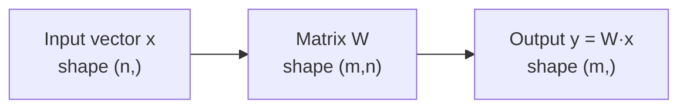

# 0.2 — Linear Algebra for AI

> The single most important branch of math for ML. If you skip this, everything in Phase 1–6 will feel like magic.

---

## 1. Intuition first

Linear algebra is the **language of "many numbers at once"**. Instead of thinking about a single value $x$, you think about **vectors** (lists of numbers), **matrices** (grids of numbers), and **tensors** (higher-dimensional grids). Nearly every ML computation — an image, a sentence embedding, a neural-network layer — is a bunch of numbers organized into a tensor, and the operations you apply are matrix multiplications, decompositions, or transformations.

Two mental models that will carry you far:

- **A vector is a point** in high-dimensional space (its coordinates are its components).
- **A matrix is a function** that stretches, rotates, and squishes space linearly.

## 2. Why the topic exists

Almost every learning algorithm boils down to:
"Find parameters (a vector or matrix) that transform inputs (vectors) into outputs (vectors) in a way that minimizes some scalar loss." Linear algebra gives us compact notation for that and fast primitive operations (BLAS, cuBLAS) that a GPU can execute in parallel.

## 3. What problem it solves

- Represent structured data (images, text embeddings, tabular rows) compactly.
- Express complex transformations in short notation ($y = Wx + b$).
- Leverage massively-parallel hardware (GPU/TPU) — matrix multiply is the workhorse of both CPUs and GPUs.
- Solve systems of linear equations that come up everywhere (least squares, PCA, normal equations, Kalman filters, PageRank).

## 4. Mathematics — the core objects

### 4.1 Scalar, vector, matrix, tensor

- **Scalar** $x \in \mathbb{R}$ — a single number.
- **Vector** $\mathbf{x} \in \mathbb{R}^n$ — an ordered tuple of $n$ numbers, written as a column:

$$
\mathbf{x} = \begin{bmatrix} x_1 \\ x_2 \\ \vdots \\ x_n \end{bmatrix}
$$

- **Matrix** $A \in \mathbb{R}^{m \times n}$ — $m$ rows, $n$ columns.
- **Tensor** — generalization: 3D, 4D, … (e.g. an image batch has shape $[B, C, H, W]$).

### 4.2 Basic operations

**Dot product** of two vectors $\mathbf{a}, \mathbf{b} \in \mathbb{R}^n$:

$$
\mathbf{a} \cdot \mathbf{b} = \sum_{i=1}^{n} a_i b_i
$$

**Matrix–vector multiply** $\mathbf{y} = A\mathbf{x}$, where $A \in \mathbb{R}^{m \times n}$ and $\mathbf{x} \in \mathbb{R}^n$:

$$
y_i = \sum_{j=1}^{n} A_{ij}\, x_j \quad \text{for } i = 1, \ldots, m
$$

**Matrix–matrix multiply** $C = AB$, with $A \in \mathbb{R}^{m \times k}$, $B \in \mathbb{R}^{k \times n}$:

$$
C_{ij} = \sum_{p=1}^{k} A_{ip}\, B_{pj}
$$

### 4.3 Norms

**L2 (Euclidean) norm:**

$$
\|\mathbf{x}\|_2 = \sqrt{\sum_i x_i^2}
$$

**L1 norm:**

$$
\|\mathbf{x}\|_1 = \sum_i |x_i|
$$

**L$_\infty$ norm:**

$$
\|\mathbf{x}\|_\infty = \max_i |x_i|
$$

**Frobenius norm** (matrix):

$$
\|A\|_F = \sqrt{\sum_{i,j} A_{ij}^2}
$$

### 4.4 Transpose, inverse, identity

- Transpose: $(A^T)_{ij} = A_{ji}$.
- Identity: $I \mathbf{x} = \mathbf{x}$.
- Inverse: $A A^{-1} = A^{-1} A = I$ (exists iff $A$ square and full-rank).

### 4.5 Determinant, rank, trace

- $\det(A)$ — "volume scaling factor" of the transformation.
- $\text{rank}(A)$ — number of linearly independent columns (= rows).
- $\text{tr}(A) = \sum_i A_{ii}$ — sum of diagonal.

### 4.6 Eigenvalues & eigenvectors

For a square matrix $A$, a nonzero vector $\mathbf{v}$ and scalar $\lambda$ satisfying

$$
A \mathbf{v} = \lambda \mathbf{v}
$$

are an **eigenvector** and **eigenvalue** of $A$. Eigenvectors are directions that $A$ merely stretches (does not rotate).

### 4.7 Singular Value Decomposition (SVD)

Every real matrix $A \in \mathbb{R}^{m \times n}$ factors as

$$
A = U \Sigma V^T
$$

- $U \in \mathbb{R}^{m \times m}$ orthogonal (left singular vectors).
- $V \in \mathbb{R}^{n \times n}$ orthogonal (right singular vectors).
- $\Sigma \in \mathbb{R}^{m \times n}$ diagonal, non-negative (singular values $\sigma_1 \ge \sigma_2 \ge \ldots \ge 0$).

SVD underlies PCA, low-rank approximation, latent semantic analysis, and much more.

## 5. Every formula explained

- **Dot product** measures similarity: if $\mathbf{a}$ and $\mathbf{b}$ are unit vectors, $\mathbf{a}\cdot\mathbf{b} = \cos\theta$ where $\theta$ is the angle between them. Foundation of cosine similarity, attention scores.
- **$\mathbf{y}=A\mathbf{x}$** — a linear transformation of $\mathbf{x}$. One neural network layer.
- **Norms** measure size. L2 = "length". L1 = "sum of absolute values" (used in Lasso).
- **Eigen decomposition** decomposes a linear transformation into scaling along special axes.
- **SVD** does the same for non-square / non-diagonalizable matrices; the singular values quantify how "important" each rank-1 component is.

## 6. Every variable explained

| Symbol | Meaning |
|--------|---------|
| $n, m, k$ | dimensions |
| $\mathbf{x}, \mathbf{y}$ | vectors |
| $A, B, C, W$ | matrices |
| $x_i$ | $i$-th component of vector $\mathbf{x}$ |
| $A_{ij}$ | entry at row $i$, column $j$ |
| $\lambda$ | eigenvalue |
| $\mathbf{v}$ | eigenvector |
| $\sigma_i$ | $i$-th singular value |
| $\|\cdot\|$ | norm |

## 7. Step-by-step algorithm — matrix multiplication

Given $A \in \mathbb{R}^{m \times k}$, $B \in \mathbb{R}^{k \times n}$:

1. Allocate output $C \in \mathbb{R}^{m \times n}$, all zeros.
2. For each $i = 1..m$:
   1. For each $j = 1..n$:
      1. Set $C_{ij} = \sum_{p=1}^{k} A_{ip} B_{pj}$.
3. Return $C$.

That is $O(mnk)$ scalar multiplies (Strassen and asymptotically-faster algorithms exist, but real implementations use blocking + BLAS).

## 8. Simple example

$$
A = \begin{bmatrix} 1 & 2 \\ 3 & 4 \end{bmatrix}, \quad \mathbf{x} = \begin{bmatrix} 5 \\ 6 \end{bmatrix}
$$

$$
A\mathbf{x} = \begin{bmatrix} 1\cdot5 + 2\cdot6 \\ 3\cdot5 + 4\cdot6 \end{bmatrix} = \begin{bmatrix} 17 \\ 39 \end{bmatrix}
$$

## 9. Real-world example

- **Neural network layer:** $\mathbf{h} = \sigma(W\mathbf{x} + \mathbf{b})$ — pure matrix multiply plus a nonlinearity.
- **Google PageRank:** dominant eigenvector of the web link matrix ranks pages.
- **Netflix / Spotify recommendations:** low-rank matrix factorization $R \approx UV^T$ discovers latent taste factors.
- **Compression / denoising:** truncated SVD keeps top-$k$ singular values.

## 10. Diagram



Geometric intuition for a 2×2 matrix acting on a unit square:

```
Before A            After A
+-----+             +---------+
|     |    --->    /         /
|     |           /         /
+-----+          +---------+
```
(the matrix stretches / rotates / shears space)

## 11. Implementation from scratch (pure Python)

```python
def matmul(A, B):
    m, k = len(A), len(A[0])
    k2, n = len(B), len(B[0])
    assert k == k2, "inner dims must match"
    C = [[0.0] * n for _ in range(m)]
    for i in range(m):
        for j in range(n):
            s = 0.0
            for p in range(k):
                s += A[i][p] * B[p][j]
            C[i][j] = s
    return C

def dot(a, b):
    return sum(x * y for x, y in zip(a, b))

def l2_norm(x):
    return sum(v * v for v in x) ** 0.5
```

Power iteration for the dominant eigenvector:

```python
def power_iteration(A, num_iters=100, tol=1e-9):
    n = len(A)
    v = [1.0 / n] * n
    for _ in range(num_iters):
        Av = [sum(A[i][j] * v[j] for j in range(n)) for i in range(n)]
        norm = l2_norm(Av)
        new_v = [x / norm for x in Av]
        if l2_norm([a - b for a, b in zip(new_v, v)]) < tol:
            break
        v = new_v
    lam = dot(v, [sum(A[i][j] * v[j] for j in range(n)) for i in range(n)])
    return lam, v
```

## 12. Implementation using libraries

```python
import numpy as np

A = np.array([[1., 2.], [3., 4.]])
x = np.array([5., 6.])

y = A @ x                    # matrix-vector multiply (17, 39)
C = A @ A.T                  # matrix-matrix multiply
inv_A = np.linalg.inv(A)     # inverse
U, S, Vt = np.linalg.svd(A)  # SVD
w, V = np.linalg.eig(A)      # eigen decomposition
```

## 13. Time complexity

- Dot product: O(n).
- Matrix–vector: O(mn).
- Matrix–matrix: O(mnk) naive; Strassen ≈ O(n^2.807); Coppersmith–Winograd variants ≈ O(n^2.37).
- Solve $Ax = b$: O(n³) via LU / Gaussian elimination.
- Full SVD: O(min(mn², m²n)).

## 14. Space complexity

- Storing an $m \times n$ dense matrix: O(mn).
- Sparse: O(nnz) with CSR/CSC.

## 15. Advantages

- Compact notation for ML.
- Massive hardware acceleration (GPU BLAS).
- Rich, well-understood theory.

## 16. Disadvantages

- Dense matrix ops are memory-bandwidth-bound.
- Numerical precision issues (near-singular matrices, catastrophic cancellation).
- Inversion is often the *wrong* thing to compute — prefer solvers.

## 17. Interview questions

1. What is the rank of a matrix? Give a matrix with rank 1.
2. When is a matrix invertible?
3. Explain the geometric meaning of an eigenvector.
4. Difference between eigen decomposition and SVD.
5. Why is dot product used to measure similarity in embeddings?
6. Explain broadcasting in NumPy.
7. Difference between L1 and L2 norm and their impact on ML models.
8. How does PCA relate to SVD?
9. What is the computational complexity of solving $Ax = b$?
10. Prove that $(AB)^T = B^T A^T$.

## 18. Common mistakes

- Confusing element-wise `*` with matrix `@` in NumPy.
- Forgetting broadcasting rules → silent shape mismatches.
- Actually computing `inv(A) @ b` instead of `np.linalg.solve(A, b)` (slower and less stable).
- Treating tensors of shape `(n,)` and `(n, 1)` as interchangeable.

## 19. Optimization techniques

- Use BLAS-backed routines (NumPy on top of MKL/OpenBLAS).
- Batch small matmuls into one big matmul (GPUs love this).
- Exploit sparsity where possible (`scipy.sparse`).
- Use half-precision (fp16, bf16) on modern GPUs.
- Prefer `A @ x` over Python loops.

## 20. Coding exercises

1. Implement `matmul` in pure Python; benchmark vs NumPy.
2. Compute cosine similarity between all pairs of rows in a matrix.
3. Implement Gaussian elimination to solve $Ax = b$.
4. Implement PCA using SVD on the Iris dataset.
5. Implement power iteration and compare with `np.linalg.eig`.
6. Write a function that returns the rank of a matrix using SVD.

## 21. Mini project

**Image compression with SVD.** Load a grayscale image as an $m \times n$ matrix, compute SVD, reconstruct with the top $k$ singular values, plot reconstruction error vs $k$.

## 22. Medium project

**PageRank from scratch.** Crawl 1000 Wikipedia pages, build the link matrix, compute the dominant eigenvector via power iteration, output the top 20 ranked pages.

## 23. Advanced project

**Recommender system via matrix factorization.** On the MovieLens-100k dataset, learn user and item latent factors by minimizing $\|R - UV^T\|_F^2$ with SGD, evaluate RMSE on held-out ratings, compare to a scikit-surprise baseline.

## 24. Where it is used in industry

Every ML model. Every GPU kernel. Every recommender, embedding, and attention layer.

## 25. How companies use it

- Search engines (PageRank).
- Ad platforms (matrix factorization for CTR features).
- Video / image compression (SVD-based codecs).
- ML infrastructure teams optimize GEMM (general matrix multiply) as their #1 performance target.

## 26. When NOT to use it

- Truly discrete / combinatorial problems (SAT, graph coloring) — use combinatorial optimization.
- Very high-dimensional sparse data with no low-rank structure — dense linear algebra will waste memory; use sparse or hashing.
