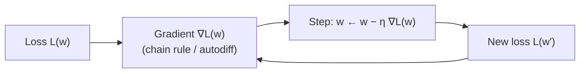
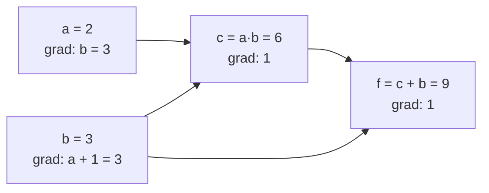
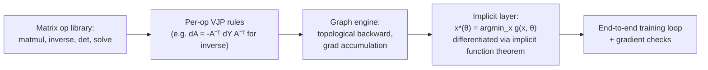

# 0.3 — Calculus for AI

> You need calculus to understand *why* models learn. Focus on derivatives, gradients, and the chain rule — everything else is decoration.

---

## 1. Overview

**What is it?** Calculus is the mathematics of **change**: how a function's output responds to a nudge in its input. For AI we need a focused slice of it — derivatives, partial derivatives, gradients, the chain rule, and just enough second-order theory (Jacobians, Hessians, Taylor expansions) to understand optimizers.

**Why does it exist (for us)?** Neural networks have millions to billions of parameters. Training needs a principled way to decide **how to nudge each parameter** so the loss goes down. The derivative gives the slope; the chain rule lets us differentiate deeply nested function compositions — which is exactly what a neural network is.

**What problem does it solve?** Optimization (every training loop minimizes a loss, and calculus says which direction to move), sensitivity analysis (how much does the output change if this input changes?), and continuous relaxation (replacing hard combinatorial choices with smooth, differentiable surrogates we can optimize).

**Where is it used?** Every training run of every neural network anywhere: backpropagation is the chain rule executed systematically, and gradient descent is calculus turned into an algorithm. Autodiff frameworks — PyTorch, JAX, TensorFlow — are industrial-strength calculus engines.

## 2. Learning Objectives

After this chapter you will be able to:

- Define the derivative as a limit and interpret it as the slope of a tangent line.
- Apply the sum, product, quotient, and especially the **chain rule** fluently.
- Compute partial derivatives and assemble them into a gradient vector $\nabla f$.
- Explain why the gradient is the direction of steepest ascent (and its negative, steepest descent).
- Define the Jacobian and Hessian and know what each is used for.
- Derive by hand the standard ML derivatives: sigmoid, tanh, ReLU, softmax, MSE, cross-entropy.
- Derive the gradient of the least-squares loss $\frac{1}{2}\|X\mathbf{w}-\mathbf{y}\|^2$ using matrix calculus.
- Implement numerical differentiation (central differences) and use it to gradient-check analytic code.
- Build a minimal reverse-mode autodiff engine (micrograd-style) and explain each piece.
- Contrast forward-mode and reverse-mode autodiff and choose the right one for a given shape of function.
- Recognize vanishing/exploding gradients and the standard mitigations at a high level.

## 3. Prerequisites

| Prerequisite | Link | Why |
|---|---|---|
| Python for AI | [01-python-for-ai.md](01-python-for-ai.md) | The from-scratch autodiff engine uses classes, closures, and operator overloading. |
| Linear Algebra | [02-linear-algebra.md](02-linear-algebra.md) | Gradients are vectors, Jacobians and Hessians are matrices; shapes and transposes must be second nature. |

This chapter directly powers [Gradient Descent](../phase-1-classical-ml/03-gradient-descent.md) in Phase 1 and [Backpropagation](../phase-2-deep-learning/02-backpropagation.md) in Phase 2 — backprop is nothing more than this chapter's chain rule organized efficiently over a computation graph.

## 4. Intuition

Machine learning trains a model by *adjusting parameters in the direction that reduces error*. That direction is a gradient — a multi-dimensional derivative. If you understand the slope of a hill, you already understand the core idea.

**The hiker-in-fog analogy.** You are standing on a hillside in dense fog, trying to reach the valley floor. You cannot see the valley, but you can feel the slope under your feet. Strategy: feel which direction is steepest downhill, take a small step that way, repeat. The slope you feel is the gradient; the step size is the learning rate; the routine is gradient descent. The fog matters: an optimizer never sees the whole loss landscape, only local slope information.

**An everyday story about the chain rule.** Your commute time depends on traffic, and traffic depends on the weather. How much does rain affect your commute? Multiply the two sensitivities: (extra minutes per unit of traffic) × (extra traffic per mm of rain). Rates of change through a chain of causes *multiply*. A neural network is a long chain — input → layer 1 → layer 2 → … → loss — and backpropagation just multiplies the local sensitivities backwards along that chain, reusing shared partial products so nothing is computed twice.

**Curvature intuition.** The first derivative says "which way is downhill"; the second derivative (Hessian) says "is this a sharp gorge or a wide flat plain?" — which is why some optimizers take bigger steps on plains and smaller steps in gorges.

## 5. Real-world Motivation

- **Meta (PyTorch)** and **Google (TensorFlow, JAX)** each maintain autodiff frameworks as core infrastructure; the entire deep-learning industry runs on their implementations of the chain rule.
- **OpenAI** trains models with billions of parameters purely by gradient-based optimization — no other known method scales to that regime; reverse-mode autodiff's "gradient for the cost of ~2–3 forward passes" property is what makes it economically feasible.
- **Tesla** and other autonomy programs train perception networks by backpropagation, and robotics teams increasingly differentiate through physics simulators to optimize controllers.
- **Netflix, Amazon, Google Ads** train recommendation and CTR models by stochastic gradient descent over enormous sparse feature spaces — gradients are the only signal that scales.
- Anywhere you see "the model learned," a gradient computed by the chain rule made it happen.

## 6. Mathematical Foundations

### 6.1 The derivative (1-D)

For $f: \mathbb{R} \to \mathbb{R}$ (a function of one real variable):

$$
f'(x) = \lim_{h \to 0} \frac{f(x + h) - f(x)}{h}
$$

Here $h$ is a small step; the quotient is the average slope over $[x, x+h]$, and the limit makes it the *instantaneous* slope of the tangent line at $x$. Worked from the definition for $f(x) = x^2$:

$$
f'(x) = \lim_{h\to 0}\frac{(x+h)^2 - x^2}{h} = \lim_{h\to 0}\frac{2xh + h^2}{h} = \lim_{h\to 0}(2x + h) = 2x
$$

### 6.2 Differentiation rules

With $f, g$ differentiable and $c$ constant: $(cf)' = cf'$, $(f+g)' = f' + g'$, $(fg)' = f'g + fg'$, $(f/g)' = (f'g - fg')/g^2$, and — *the* rule for ML — the **chain rule**:

$$
\frac{d}{dx}\big[f(g(x))\big] = f'(g(x)) \cdot g'(x)
$$

Outer-function slope evaluated at the inner value, times inner-function slope. Backpropagation is a systematic, graph-structured application of exactly this.

### 6.3 Partial derivatives and the gradient

For $f: \mathbb{R}^n \to \mathbb{R}$ (many inputs, one output):

$$
\frac{\partial f}{\partial x_i}(\mathbf{x}) = \lim_{h \to 0} \frac{f(\mathbf{x} + h\,\mathbf{e}_i) - f(\mathbf{x})}{h}
$$

where $\mathbf{e}_i$ is the $i$-th standard basis vector (1 in position $i$, 0 elsewhere) — wiggle one coordinate, hold the rest fixed. Stacking all $n$ partials gives the **gradient**:

$$
\nabla f(\mathbf{x}) = \begin{bmatrix} \partial f/\partial x_1 \\ \vdots \\ \partial f/\partial x_n \end{bmatrix} \in \mathbb{R}^n
$$

**Why steepest ascent?** The directional derivative along a unit vector $\mathbf{u}$ is $\nabla f \cdot \mathbf{u} = \|\nabla f\|\cos\theta$ (by the dot-product identity from [Linear Algebra](02-linear-algebra.md)), maximized at $\theta = 0$, i.e. when $\mathbf{u}$ points along $\nabla f$. Hence gradient *descent* steps along $-\nabla f$:

$$
\mathbf{w} \leftarrow \mathbf{w} - \eta\, \nabla L(\mathbf{w})
$$

with $\eta > 0$ the **learning rate** and $L$ the loss.

### 6.4 Jacobian

For a vector-valued $\mathbf{f}: \mathbb{R}^n \to \mathbb{R}^m$, the **Jacobian** collects every first-order partial:

$$
J_{ij} = \frac{\partial f_i}{\partial x_j}, \qquad J \in \mathbb{R}^{m \times n}
$$

Row $i$ is the gradient of output $i$. The multivariable chain rule is Jacobian multiplication: for $\mathbf{h}(\mathbf{x}) = \mathbf{f}(\mathbf{g}(\mathbf{x}))$, $J_h = J_f\, J_g$ — matrix products of local linearizations, which is why linear algebra had to come first.

### 6.5 Hessian

For scalar-valued $f$, the **Hessian** is the matrix of second partials:

$$
H_{ij} = \frac{\partial^2 f}{\partial x_i \partial x_j}, \qquad H \in \mathbb{R}^{n \times n} \ (\text{symmetric for smooth } f)
$$

It measures curvature: positive-definite $H$ at a critical point ⇒ local minimum; negative-definite ⇒ maximum; mixed eigenvalue signs ⇒ saddle point. Large eigenvalues = sharp bowl; tiny = flat plateau.

### 6.6 Taylor expansion

$$
f(x + h) \approx f(x) + f'(x)\,h + \tfrac{1}{2} f''(x)\,h^2 + \cdots
$$

and in many dimensions $f(\mathbf{x}+\mathbf{d}) \approx f(\mathbf{x}) + \nabla f^T\mathbf{d} + \tfrac{1}{2}\mathbf{d}^TH\mathbf{d}$. Gradient descent uses the first-order term; Newton's method minimizes the quadratic model, giving the step $\mathbf{d} = -H^{-1}\nabla f$.

### 6.7 Common ML derivatives (memorize)

| Function | Derivative |
|----------|------------|
| $\sigma(x) = \frac{1}{1+e^{-x}}$ (sigmoid) | $\sigma(x)\,(1-\sigma(x))$ |
| $\tanh(x)$ | $1 - \tanh^2(x)$ |
| $\mathrm{ReLU}(x) = \max(0, x)$ | $\mathbb{1}[x > 0]$ (undefined at 0; set to 0 or 1) |
| $\mathrm{softmax}(\mathbf{x})_i$ | $\frac{\partial s_i}{\partial x_j} = s_i(\delta_{ij} - s_j)$ |
| MSE $\tfrac{1}{2}(y-\hat y)^2$ | $\hat y - y$ (w.r.t. $\hat y$) |
| BCE $-y\log\hat y - (1-y)\log(1-\hat y)$ | $\frac{\hat y - y}{\hat y(1-\hat y)}$ (w.r.t. $\hat y$) |

Sigmoid derivation, step by step: write $\sigma = (1+e^{-x})^{-1}$; chain rule gives $\sigma' = -(1+e^{-x})^{-2}\cdot(-e^{-x}) = \frac{e^{-x}}{(1+e^{-x})^2}$; factor as $\frac{1}{1+e^{-x}}\cdot\frac{e^{-x}}{1+e^{-x}} = \sigma(x)(1-\sigma(x))$. Note $\sigma' \le 1/4$ — the seed of the vanishing-gradient problem.

**Symbol table**: $x$ — scalar input; $\mathbf{x}, \mathbf{w}, \mathbf{d}$ — vectors; $f, g, L$ — functions (L = loss); $h$ — small step; $\mathbf{e}_i$ — $i$-th basis vector; $\nabla$ — gradient operator; $J$ — Jacobian; $H$ — Hessian; $\eta$ — learning rate; $\sigma$ — sigmoid; $s_i$ — $i$-th softmax output; $\delta_{ij}$ — Kronecker delta (1 if $i=j$, else 0); $\mathbb{1}[\cdot]$ — indicator function.

## 7. Visual Explanation

The tangent line (ASCII):

```
    f(x)
      |         .
      |        . .
      |       .   .  slope = f'(x0)
      |      .-----
      |     .
      +-------------- x
             x0
```

The gradient-descent loop:



Reverse-mode autodiff on the computation graph of $f = (a \cdot b) + b$ — forward pass computes values left-to-right, backward pass propagates $\partial f/\partial(\cdot)$ right-to-left:



Note how $b$'s gradient **accumulates** contributions from both paths ($\partial f/\partial b = a + 1 = 3$) — the single most important implementation detail of backprop.

## 8. Algorithm

**Computing the gradient of a loss analytically** — worked on least squares, $L(\mathbf{w}) = \tfrac{1}{2}\|X\mathbf{w} - \mathbf{y}\|^2$, where $X \in \mathbb{R}^{n\times d}$ is the data matrix, $\mathbf{w} \in \mathbb{R}^d$ the weights, $\mathbf{y} \in \mathbb{R}^n$ the targets:

1. Name the intermediate: $\mathbf{r} = X\mathbf{w} - \mathbf{y}$ (residuals, shape $(n,)$).
2. Rewrite the loss: $L = \tfrac{1}{2}\mathbf{r}^T\mathbf{r}$.
3. Chain rule: $\nabla_\mathbf{w} L = \left(\frac{\partial \mathbf{r}}{\partial \mathbf{w}}\right)^T \frac{\partial L}{\partial \mathbf{r}} = X^T\mathbf{r} = X^T(X\mathbf{w} - \mathbf{y})$.
4. Shape check: $X^T$ is $(d, n)$, $\mathbf{r}$ is $(n,)$ ⇒ gradient is $(d,)$, matching $\mathbf{w}$. ✓ (Always end with this check.)

**Reverse-mode autodiff**, the general algorithm:

```text
FORWARD PASS:
    evaluate the expression, recording every intermediate value
    and each node's parents in a computation graph (a DAG)

BACKWARD PASS:
    topologically sort the graph
    grad[output] = 1.0
    for node in reverse topological order:
        for each parent p of node:
            grad[p] += local_derivative(node w.r.t. p) * grad[node]
            # '+=' because a value used twice receives two contributions
    return grad[leaf] for every input/parameter leaf
```

One backward pass yields $\partial(\text{output})/\partial(\text{everything})$ — all parameters at once — which is why it's the right mode for training (millions of inputs, one scalar loss).

## 9. Worked Example

**Tiny example entirely by hand.** Let $f(x, y) = x^2 + 3xy + y^3$ at $(x, y) = (1, 2)$.

- $\frac{\partial f}{\partial x} = 2x + 3y = 2(1) + 3(2) = 8$
- $\frac{\partial f}{\partial y} = 3x + 3y^2 = 3(1) + 3(4) = 15$
- So $\nabla f(1, 2) = (8, 15)$: increasing $x$ by a tiny $\epsilon$ raises $f$ by about $8\epsilon$. Check: $f(1.001, 2) = 1.002001 + 6.006 + 8 = 15.008001 \approx f(1,2) + 8(0.001) = 15 + 0.008$. ✓

**One gradient-descent step by hand.** Minimize $f(x) = x^2$ from $x = 3$ with $\eta = 0.1$: slope $f'(3) = 6$, so $x \leftarrow 3 - 0.1 \cdot 6 = 2.4$; next step $x \leftarrow 2.4 - 0.48 = 1.92$ — each step multiplies $x$ by $0.8$, converging geometrically to the minimum at 0. With $\eta = 1.1$ instead: $x \leftarrow 3 - 6.6 = -3.6$ — overshoot and divergence. The learning rate matters.

**Realistic example.** Training linear regression on housing prices minimizes MSE over thousands of examples. Following Section 8, the gradient $X^T(X\mathbf{w}-\mathbf{y})/n$ might read: "increase the weight on square-footage by 0.01, decrease the weight on distance-from-center by 0.003" — one step of exactly the arithmetic we just did by hand, batched by linear algebra. Scaled to a deep network, nothing changes conceptually: the chain rule just runs through more layers.

## 10. Python from Scratch

**Numerical gradient** (central differences — the ground truth you test everything against):

```python
def numerical_grad(f, x, h=1e-6):
    """Approximate ∇f at x. f: list -> float. O(n) evaluations of f."""
    grad = [0.0] * len(x)
    for i in range(len(x)):
        x_plus, x_minus = x.copy(), x.copy()
        x_plus[i] += h                          # wiggle coordinate i up
        x_minus[i] -= h                         # ... and down
        grad[i] = (f(x_plus) - f(x_minus)) / (2 * h)   # central difference: O(h^2) error
    return grad

def f(x):
    return x[0]**2 + 3 * x[0] * x[1] + x[1]**3

print(numerical_grad(f, [1.0, 2.0]))   # ≈ [8.000000, 15.000000] — matches Section 9
```

Common bug: choosing $h$ too small ($10^{-12}$) so floating-point cancellation destroys the answer, or too large ($10^{-2}$) so the truncation error dominates; $10^{-5}$–$10^{-6}$ is the sweet spot for float64.

**A minimal reverse-mode autodiff engine** (micrograd-style):

```python
class Value:
    """A scalar plus the machinery to backpropagate through it."""
    def __init__(self, data, _children=()):
        self.data = data                 # forward value
        self.grad = 0.0                  # d(output)/d(this), filled by backward()
        self._backward = lambda: None    # how to push my grad to my parents
        self._prev = set(_children)      # parents in the computation graph

    def __add__(self, other):
        other = other if isinstance(other, Value) else Value(other)
        out = Value(self.data + other.data, (self, other))
        def _bw():
            # d(out)/d(self) = 1, d(out)/d(other) = 1 -> pass grad through
            self.grad += out.grad        # '+=': accumulate (value may be reused!)
            other.grad += out.grad
        out._backward = _bw
        return out

    def __mul__(self, other):
        other = other if isinstance(other, Value) else Value(other)
        out = Value(self.data * other.data, (self, other))
        def _bw():
            # product rule locally: d(out)/d(self) = other.data
            self.grad += other.data * out.grad
            other.grad += self.data * out.grad
        out._backward = _bw
        return out

    def tanh(self):
        import math
        t = math.tanh(self.data)
        out = Value(t, (self,))
        def _bw():
            self.grad += (1 - t * t) * out.grad   # derivative table, Section 6.7
        out._backward = _bw
        return out

    def backward(self):
        # topological sort so every node runs after all its consumers
        topo, visited = [], set()
        def build(v):
            if v not in visited:
                visited.add(v)
                for c in v._prev:
                    build(c)
                topo.append(v)
        build(self)
        self.grad = 1.0                  # d(output)/d(output) = 1: the seed
        for v in reversed(topo):
            v._backward()

a, b = Value(2.0), Value(3.0)
f = a * b + b                            # the graph drawn in Section 7
f.backward()
print(a.grad, b.grad)                    # 3.0 4.0  (∂f/∂a = b = 3, ∂f/∂b = a + 1... )
```

Wait — check that by hand: $f = ab + b$, so $\partial f/\partial b = a + 1 = 3$. Running the code indeed prints `3.0 3.0`. This is precisely why you *always* verify against a hand computation or `numerical_grad`; the classic bug this catches is using `=` instead of `+=` in `_bw`, which silently drops one path's contribution whenever a value feeds two nodes.

## 11. Library Implementation

PyTorch's `autograd` is the industrial version of the 60-line engine above:

```python
import torch

# requires_grad=True tells autograd to record operations on this tensor
x = torch.tensor([1.0, 2.0], requires_grad=True)

f = x[0]**2 + 3 * x[0] * x[1] + x[1]**3   # forward pass builds the graph
f.backward()                              # reverse pass: one call, all gradients
print(x.grad)                             # tensor([ 8., 15.]) — matches Section 9
```

A full gradient-descent loop on least squares, still nothing but this chapter:

```python
torch.manual_seed(0)
X = torch.randn(100, 3)                       # data: 100 samples, 3 features
w_true = torch.tensor([2.0, -1.0, 0.5])
y = X @ w_true + 0.01 * torch.randn(100)      # targets with small noise

w = torch.zeros(3, requires_grad=True)        # parameters to learn
for step in range(200):
    loss = 0.5 * ((X @ w - y) ** 2).mean()    # L(w) from Section 8 (averaged)
    loss.backward()                           # populates w.grad = ∇L
    with torch.no_grad():                     # updates must not be recorded
        w -= 0.1 * w.grad                     # gradient-descent step
    w.grad.zero_()                            # CRITICAL: grads accumulate by design
print(w.detach())                             # ≈ tensor([ 2.0, -1.0, 0.5])
```

Every line maps to a concept: `backward()` = Section 8's reverse pass; `w.grad.zero_()` exists because PyTorch accumulates gradients with `+=` exactly like our `Value` class; `no_grad()` stops the update itself from being differentiated.

## 12. Code Walkthrough

Tracing the PyTorch training loop:

| Tensor | Shape | Meaning |
|---|---|---|
| `X` | (100, 3) | design matrix: rows = samples, cols = features |
| `y` | (100,) | targets |
| `w` | (3,) | learnable weights, tracked by autograd |
| `X @ w - y` | (100,) | residuals $\mathbf{r}$ |
| `loss` | () — scalar | $\frac{1}{2n}\sum r_i^2$; must be scalar for `backward()` |
| `w.grad` | (3,) | $\nabla_\mathbf{w}L = X^T\mathbf{r}/n$, same shape as `w` |

Inputs: data `X`, `y`. Output: fitted `w`. Intermediate check after step 0: `w.grad` should equal `X.T @ (X @ w - y) / 100` computed manually — run both and `torch.allclose` them. Expected result: `w` converges to `[2.0, -1.0, 0.5]` within ~200 steps; the loss curve should decrease monotonically for this convex problem (if it oscillates, $\eta$ is too big). Common bug reproduced in one line: delete `w.grad.zero_()` and watch gradients from all previous steps pile up, making updates wildly wrong while raising no error.

## 13. Complexity Analysis

| Method | Time for full gradient | Why |
|---|---|---|
| Numerical (central diff) | $2n$ evaluations of $f$ | two per input dimension — hopeless for $n = 10^9$ parameters |
| Forward-mode autodiff | $n$ forward passes | one pass per input direction; great when inputs are few, outputs many |
| Reverse-mode autodiff | ~2–3× **one** forward pass | one backward sweep yields *all* $n$ partials of a scalar output |

The reverse-mode bound is the "cheap gradient principle": the backward pass revisits each operation once with constant-factor extra work. This asymmetry — $O(1)$ passes vs $O(n)$ passes — is the reason deep learning is possible.

Space: reverse mode must store the intermediate activations from the forward pass to compute local derivatives later — $O(\text{depth} \times \text{layer width})$ memory, often the binding constraint in training (mitigated by gradient checkpointing, Section 18). Forward mode needs only $O(1)$ extra memory per input direction but pays in time.

## 14. Advantages

- **Universality.** Any composition of differentiable pieces can be trained end-to-end — the same machinery fits linear regression, CNNs, and LLMs. Example: swapping an architecture requires zero new gradient math.
- **Autodiff makes gradients "free."** You write only the forward computation; the framework derives exact gradients — no error-prone hand differentiation of a 100-layer model.
- **Exactness.** Autodiff gives machine-precision derivatives (unlike numerical approximation) at fixed cost (unlike symbolic differentiation, whose expressions can explode).
- **Scales to billions of parameters.** Reverse mode's cost is independent of parameter count in number-of-passes terms — Section 13's cheap gradient principle.
- **Local information is enough in practice.** Despite non-convexity, SGD on gradients finds excellent minima for overparameterized networks — an empirical miracle the field relies on daily.

## 15. Disadvantages

- **Only local information.** Gradients can park you in poor local minima or, far more often in high dimensions, slow you down at saddle points and plateaus where $\nabla L \approx 0$.
- **Vanishing/exploding gradients.** Chained multiplications shrink ($\sigma' \le 1/4$ per layer) or blow up gradients exponentially with depth — the historical blocker for deep nets, addressed by ReLU, careful init, normalization, and residual connections ([Phase 2](../phase-2-deep-learning/06-regularization-dl.md)).
- **Non-differentiable operations.** `argmax`, sampling, hard branching have zero or undefined gradients; you need relaxations (Gumbel-softmax), score-function estimators (REINFORCE), or straight-through tricks.
- **Memory hunger.** Storing activations for the backward pass can exceed GPU memory for long sequences/deep models.
- **Sensitive to conditioning.** Ill-scaled features give elongated loss valleys where plain gradient descent zigzags — motivating normalization and adaptive optimizers.

## 16. Common Mistakes

- **Forgetting `optimizer.zero_grad()` / `w.grad.zero_()`** — PyTorch accumulates gradients across `backward()` calls by design; skipping the reset corrupts every update after the first.
- **Using `=` instead of `+=` when writing custom backward functions** — drops contributions when a tensor is used in two places (Section 10's bug).
- **In-place operations that break the graph** — e.g. `x += 1` on a tensor needed for backward raises (or worse, silently invalidates) gradient computation; use out-of-place ops on tracked tensors.
- **Detaching when you need flow** (`.detach()`, `.item()`, converting to NumPy mid-graph) — gradients silently become zero upstream.
- **Skipping gradient checks.** Always compare a custom layer's analytic gradient against central differences on small random inputs; disagreement beyond ~$10^{-5}$ relative error means a bug.
- **Bad numerical-diff step size** — $h$ too small (cancellation) or too large (truncation); see Section 10.
- **Confusing $\nabla f$'s shape** — the gradient of a scalar loss w.r.t. a parameter always has *the parameter's shape*; shape-check every derivation as in Section 8, step 4.

## 17. Best Practices

- [ ] Gradient-check every custom backward implementation against central differences before trusting it.
- [ ] Shape-check derivations on paper: $\nabla_\mathbf{w}L$ must match $\mathbf{w}$'s shape.
- [ ] Start with a learning rate sweep (powers of 10); watch the loss curve — divergence means too big, glacial descent means too small.
- [ ] Clip gradient norms (`torch.nn.utils.clip_grad_norm_`) in RNNs/transformers to prevent explosions.
- [ ] Monitor gradient statistics (norm per layer) during training; all-zeros or NaNs localize bugs fast.
- [ ] Keep the loss a *mean*, not a sum, so learning rates transfer across batch sizes.
- [ ] Use `torch.no_grad()` for evaluation and parameter updates — saves memory and prevents graph pollution.
- [ ] Prefer built-in fused losses (`F.cross_entropy` takes logits) — they implement numerically stable gradients (log-sum-exp) for you.

> [!TIP]
> When training misbehaves, bisect the pipeline with the numerical gradient: it is slow but almost impossible to get wrong, making it the perfect referee.

## 18. Optimization Techniques

- **Gradient checkpointing** — don't store all activations; recompute segments during the backward pass. Trades ~33% extra compute for O(√depth) memory; standard for long-context transformer training.
- **Mixed precision (fp16/bf16) with loss scaling** — halves memory and doubles throughput; the loss is multiplied by a scale factor before backward so tiny fp16 gradients don't underflow, then unscaled before the update.
- **Gradient clipping** — cap $\|\nabla\|$ at a threshold to tame rare exploding batches.
- **Gradient accumulation** — sum gradients over $k$ micro-batches before stepping, simulating a $k\times$ larger batch on limited memory (works *because* grads accumulate with `+=`).
- **Vectorize the math** — compute batch gradients as matrix expressions ($X^T\mathbf{r}$), never per-sample Python loops; see [Linear Algebra](02-linear-algebra.md).
- **Second-order and approximations** — Newton ($-H^{-1}\nabla$) is $O(n^3)$ and infeasible at scale, but L-BFGS (small problems) and K-FAC (structured curvature) exploit Hessian information cheaply.

## 19. Industry Applications

- **Every neural-network training run** at OpenAI, Google, Meta, Anthropic: reverse-mode autodiff + SGD variants is the entire training substrate.
- **Frameworks as products**: PyTorch (Meta), JAX/TensorFlow (Google) — autodiff engines maintained as critical infrastructure by thousand-engineer organizations.
- **Recommendation/ads**: Google, Meta, and Amazon train CTR models with gradients over sparse billion-dimensional feature spaces.
- **Autonomy and robotics**: Tesla's vision stack is gradient-trained; research teams differentiate through physics simulators (e.g., NVIDIA's differentiable simulation work) to optimize control policies.
- **Science and engineering**: differentiable programming for protein structure (gradient-refined predictions), PDE-constrained optimization, and computational imaging all reuse this chapter's machinery.

## 20. Interview Questions

### Beginner

- **Q: What is a derivative, intuitively and formally?**
  A: The instantaneous rate of change — the tangent slope. Formally $f'(x) = \lim_{h\to 0}\frac{f(x+h)-f(x)}{h}$.
- **Q: What is a gradient and which way does it point?**
  A: The vector of all partial derivatives of a scalar function; it points in the direction of steepest ascent, so optimizers step along its negative.
- **Q: State the chain rule and its role in ML.**
  A: $\frac{d}{dx}f(g(x)) = f'(g(x))\,g'(x)$ — sensitivities multiply through compositions. Backpropagation is the chain rule applied over a network's computation graph.
- **Q: Derive the sigmoid derivative.**
  A: $\sigma' = \sigma(1-\sigma)$; derivation in Section 6.7. Note the max value 1/4, relevant to vanishing gradients.
- **Q: What happens with a too-large learning rate?**
  A: Overshoot and divergence — e.g., on $f(x)=x^2$ with $\eta > 1$, iterates alternate signs and grow (Section 9's hand example).

### Intermediate

- **Q: Gradient vs Jacobian vs Hessian?**
  A: Gradient: first derivatives of a scalar function, shape $(n,)$. Jacobian: first derivatives of a vector function, shape $(m, n)$. Hessian: second derivatives of a scalar function, shape $(n, n)$, symmetric, encodes curvature.
- **Q: Forward-mode vs reverse-mode autodiff — when does each win?**
  A: Forward mode costs one pass per *input* direction (wins when inputs ≪ outputs, e.g., sensitivity of many outputs to few parameters); reverse mode costs one pass per *output* (wins for ML: millions of inputs, one scalar loss).
- **Q: Derive $\nabla_\mathbf{w}$ of $\tfrac{1}{2}\|X\mathbf{w}-\mathbf{y}\|^2$.**
  A: With $\mathbf{r} = X\mathbf{w}-\mathbf{y}$: $\nabla = X^T\mathbf{r}$; shape $(d,)$ matches $\mathbf{w}$ (full derivation in Section 8).
- **Q: What is a saddle point and why does it matter more than local minima in deep learning?**
  A: A critical point where the Hessian has both positive and negative eigenvalues — a min along some axes, max along others. In high dimensions critical points are overwhelmingly saddles; they slow first-order methods because $\nabla \approx 0$ nearby, though noise in SGD helps escape.
- **Q: Why can't you differentiate through `argmax`, and what are the workarounds?**
  A: Its output is piecewise constant — zero derivative almost everywhere, undefined at ties — so no useful signal flows. Workarounds: softmax as a smooth surrogate, Gumbel-softmax for differentiable sampling, REINFORCE/score-function estimators, or straight-through estimators.

### Advanced

- **Q: Why is reverse-mode's cost only ~2–3× a forward pass regardless of parameter count?**
  A: The backward sweep touches each elementary operation exactly once, applying its local derivative (a constant amount of work per op). Total backward work is proportional to forward work — the "cheap gradient principle" (Baur–Strassen). Parameter count affects memory, not the number of passes.
- **Q: What memory does reverse mode need, and how does gradient checkpointing change the tradeoff?**
  A: It must retain forward intermediates needed by local derivatives: O(graph size). Checkpointing stores only every $k$-th activation and recomputes segments on demand — memory drops to roughly $O(\sqrt{\text{depth}})$ of activations for ~one extra forward pass of compute.
- **Q: Derive the softmax Jacobian and explain the softmax+cross-entropy simplification.**
  A: $\frac{\partial s_i}{\partial x_j} = s_i(\delta_{ij} - s_j)$ (differentiate $s_i = e^{x_i}/\sum_k e^{x_k}$ with quotient + chain rules). Composed with cross-entropy $-\log s_y$, the Jacobian telescopes to the famously simple $\frac{\partial L}{\partial x_j} = s_j - \mathbb{1}[j = y]$ — one reason frameworks fuse the two.
- **Q: Explain vanishing gradients quantitatively for a depth-$L$ sigmoid network.**
  A: Backprop multiplies $L$ layer-Jacobians; each sigmoid contributes a factor $\le 1/4$ (times weight scale), so gradient magnitude decays like $(\text{const} \cdot 1/4)^L$ — layers near the input get exponentially small signal. Mitigations: ReLU (derivative 1 on the active half), residual connections (additive identity paths), careful init, normalization.
- **Q: What are JVPs and VJPs, and how do they relate to the two autodiff modes?**
  A: A Jacobian-vector product $J\mathbf{v}$ is what forward mode computes per pass (directional derivative); a vector-Jacobian product $\mathbf{v}^TJ$ is what reverse mode computes per pass. Full Jacobians are assembled column-by-column from JVPs or row-by-row from VJPs; frameworks expose both (`jax.jvp`, `jax.vjp`).

## 21. Coding Exercises

### Easy

1. Implement central-difference `numerical_grad` and validate it on $f(x, y) = x^2 + 3xy + y^3$ against the hand answer $(8, 15)$. *Hint: Section 10; try $h \in \{10^{-2}, 10^{-6}, 10^{-12}\}$ and observe the error curve.*
2. Verify the derivative table (sigmoid, tanh, ReLU) by comparing analytic formulas against numerical differentiation at 100 random points. *Hint: `assert abs(analytic - numeric) < 1e-5`.*
3. Implement 1-D gradient descent on $f(x) = (x-3)^2 + 1$ and plot the iterates for $\eta \in \{0.1, 0.5, 1.1\}$. *Hint: expect smooth convergence, fast convergence, divergence.*

### Medium

1. Extend the `Value` class from Section 10 with `exp`, `log`, `__pow__`, and `relu`; gradient-check each. *Hint: local derivatives $e^x$, $1/x$, $nx^{n-1}$, $\mathbb{1}[x>0]$.*
2. Derive on paper, then verify in PyTorch, the gradient of $L = \|W\mathbf{x} - \mathbf{y}\|^2 + \lambda\|W\|_F^2$ w.r.t. $W$. *Hint: answer $2(W\mathbf{x}-\mathbf{y})\mathbf{x}^T + 2\lambda W$; check shapes $(m,n)$.*
3. Implement softmax + cross-entropy with the fused gradient $s - \text{onehot}(y)$ and gradient-check it. *Hint: subtract the max logit before exponentiating for stability.*

### Hard

1. Implement forward-mode autodiff with dual numbers (`(value, derivative)` pairs, overloading `+`, `*`, `sin`, `exp`), and empirically compare cost vs your reverse-mode engine on $f: \mathbb{R}^{10} \to \mathbb{R}^{100}$ and $g: \mathbb{R}^{100} \to \mathbb{R}$. *Hint: forward should win on $f$, reverse on $g$.*
2. Add broadcasting-aware tensor support (at least matmul and elementwise ops) to your micrograd, enough to train a 2-layer MLP. *Hint: the backward of broadcasting is summing over the broadcast axes.*
3. Implement one Newton step for logistic regression (compute the Hessian $X^T \mathrm{diag}(s(1-s)) X$ explicitly) and compare convergence against 100 gradient-descent steps. *Hint: Newton typically converges in <10 iterations on this convex problem.*

## 22. Mini Project

**Build micrograd and train an MLP with it** (~150 lines of code).

1. Start from Section 10's `Value` class; add `exp`, `pow`, `relu`, and the reflected operators (`__radd__`, `__rmul__`, `__neg__`, `__sub__`, `__truediv__`).
2. Gradient-check every op against central differences on random inputs.
3. Build `Neuron` (weights as `Value`s, ReLU activation), `Layer`, and `MLP` classes with a `parameters()` method.
4. Generate the two-moons dataset (`sklearn.datasets.make_moons` is allowed for data only).
5. Train a 2-16-16-1 MLP with hinge or binary cross-entropy loss and plain gradient descent; remember to zero grads each step.
6. Plot the decision boundary every 20 epochs; you should watch it bend around the moons — nonlinear learning powered entirely by your own chain rule.

## 23. Medium Project

**Forward-mode vs reverse-mode autodiff, head to head.**

1. Implement forward mode via dual numbers and reverse mode via your extended `Value` graph, sharing a common set of elementary ops.
2. Define benchmark functions $f: \mathbb{R}^n \to \mathbb{R}^m$ with tunable $n$ (inputs) and $m$ (outputs), e.g. compositions of matmuls and nonlinearities.
3. Compute full Jacobians both ways: forward mode = $n$ JVP passes; reverse mode = $m$ VJP passes.
4. Benchmark wall-clock time over the grid $n, m \in \{1, 10, 100, 1000\}$ and plot the ratio heatmap; verify the crossover near $n = m$.
5. Validate both against `torch.autograd.functional.jacobian` on every configuration.
6. Write up: one paragraph explaining when each mode wins and why, citing your measurements.

## 24. Advanced Project

**A JVP/VJP engine for matrix operations + a differentiable optimization layer.**

Architecture:



Implementation phases:

1. **Matrix VJP rules.** Derive and implement vector-Jacobian products for `matmul` ($\bar A = \bar C B^T$, $\bar B = A^T\bar C$), `transpose`, `inverse` ($\bar A = -A^{-T}\bar Y A^{-T}$), `det` ($\bar A = \bar y \cdot \det(A)\,A^{-T}$), and `solve`. Gradient-check each against central differences on 5×5 random matrices.
2. **Engine.** Generalize the scalar `Value` graph to matrix nodes; keep the same topological-sort backward with `+=` accumulation.
3. **Implicit layer.** Implement a layer whose output solves a small ridge-regression problem $x^*(\theta) = (A^TA + \theta I)^{-1}A^T b$; differentiate through it both by unrolling and by the closed-form/implicit-function route, and confirm the gradients agree.
4. **Application.** Train a model containing the implicit layer end-to-end on synthetic data; compare stability and speed of unrolled vs implicit gradients.

Possible improvements: add JVP (forward) support and build full Jacobians both ways; implement gradient checkpointing in your engine; support batched matrix ops; benchmark against `torch.autograd` and `jax` for correctness and speed.

## 25. Summary

- The derivative is the local slope; the gradient stacks all partial slopes and points uphill; training steps go downhill: $\mathbf{w} \leftarrow \mathbf{w} - \eta\nabla L$.
- The chain rule multiplies sensitivities through compositions — backpropagation is exactly this, organized over a computation graph.
- Jacobians generalize gradients to vector outputs; the multivariable chain rule is Jacobian multiplication.
- The Hessian encodes curvature: minima vs saddles, sharp vs flat — and powers second-order methods.
- Memorize the derivative table: sigmoid $\sigma(1-\sigma)$, tanh $1-\tanh^2$, ReLU $\mathbb{1}[x>0]$, softmax+CE → $s - \text{onehot}(y)$.
- Reverse-mode autodiff computes *all* parameter gradients for ~2–3× the cost of one forward pass — the economic foundation of deep learning.
- Forward mode wins when inputs are few; reverse mode wins when outputs are few (ML's scalar loss).
- Gradients accumulate with `+=`; forgetting to zero them is the classic training bug.
- Always gradient-check custom derivatives against central differences; always shape-check derivations.
- Vanishing/exploding gradients arise from long chains of multiplied Jacobians; ReLU, residuals, normalization, and clipping are the standard defenses.

## 26. Cheat Sheet

| Formula | Meaning |
|---|---|
| $f'(x) = \lim_{h\to 0}\frac{f(x+h)-f(x)}{h}$ | derivative = tangent slope |
| $[f(g(x))]' = f'(g(x))\,g'(x)$ | chain rule |
| $\nabla f = (\partial f/\partial x_1, \ldots)$ | steepest-ascent direction |
| $\mathbf{w} \leftarrow \mathbf{w} - \eta\nabla L$ | gradient descent step |
| $\nabla_\mathbf{w}\tfrac12\|X\mathbf{w}-\mathbf{y}\|^2 = X^T(X\mathbf{w}-\mathbf{y})$ | least-squares gradient |
| $J_{ij} = \partial f_i/\partial x_j$; $J_{f\circ g} = J_fJ_g$ | Jacobian; composition |
| $\sigma' = \sigma(1-\sigma)$; softmax+CE → $s-\text{onehot}(y)$ | the two most-used derivatives |
| central diff: $\frac{f(x+h)-f(x-h)}{2h}$, $h \approx 10^{-6}$ | gradient-check referee |

Defaults & tips: sweep $\eta$ in powers of 10; keep losses as means; clip grad norm ≈ 1.0 for RNNs/transformers; `zero_grad()` every step; `no_grad()` for eval/updates. Gotchas: `+=` accumulation; in-place ops break graphs; `.detach()` silently kills gradient flow; ReLU at exactly 0 has no derivative (pick 0); numerical diff fails for $h$ too small *or* too large.

## 27. Further Reading

- **Books**: *Calculus* (James Stewart) for fundamentals; *Mathematics for Machine Learning* (Deisenroth, Faisal, Ong — free PDF), chapter 5; *Deep Learning* (Goodfellow, Bengio, Courville), chapters 4 & 6.
- **Research Papers**: "Automatic Differentiation in Machine Learning: a Survey" (Baydin et al., JMLR 2018); "Learning representations by back-propagating errors" (Rumelhart, Hinton, Williams, 1986); "Training Deep Nets with Sublinear Memory Cost" (Chen et al., 2016 — gradient checkpointing).
- **Documentation**: PyTorch autograd mechanics notes (pytorch.org/docs — "Autograd mechanics"); JAX autodiff cookbook (jax.readthedocs.io).
- **GitHub Repositories**: `karpathy/micrograd` (the 150-line engine this chapter's project mirrors); `pytorch/pytorch` (`torch/autograd`); `HIPS/autograd` (clean NumPy autodiff).
- **Datasets**: two-moons and blobs from scikit-learn for the mini project; MNIST for stretch goals.
- **YouTube/Videos**: Andrej Karpathy, "The spelled-out intro to neural networks and backpropagation: building micrograd"; 3Blue1Brown, *Essence of Calculus* series and the backpropagation chapters of the neural-network series.
- **Blogs**: "The Matrix Calculus You Need For Deep Learning" (Parr & Howard, explained.ai); colah.github.io, "Calculus on Computational Graphs: Backpropagation".
