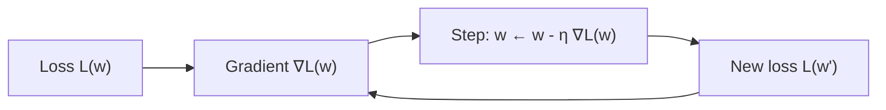

# 0.3 — Calculus for AI

> You need calculus to understand *why* models learn. Focus on derivatives, gradients, and the chain rule.

---

## 1. Intuition first

Calculus is the mathematics of **change**. Machine learning trains a model by *adjusting parameters in the direction that reduces error*. That "direction" is a gradient — a multi-dimensional derivative. If you understand slopes of hills, you can understand gradient descent.

## 2. Why the topic exists

Neural networks have millions of parameters. We need a principled way to **decide how to nudge each parameter** to make the loss go down. Derivatives give the slope; the chain rule lets us compute derivatives of deeply nested functions (which is exactly what a neural network is).

## 3. What problem it solves

- **Optimization** — every ML training loop minimizes a loss; calculus tells us which way to go.
- **Sensitivity analysis** — how does the output change if I change this input?
- **Continuous approximation** — replacing hard combinatorial problems with smooth relaxations we can differentiate.

## 4. Mathematics

### 4.1 Derivative (1D)

For $f: \mathbb{R} \to \mathbb{R}$:

$$
f'(x) = \lim_{h \to 0} \frac{f(x + h) - f(x)}{h}
$$

### 4.2 Rules

Constant, power, sum, product, quotient, chain:

$$
\frac{d}{dx}\big[f(g(x))\big] = f'(g(x)) \cdot g'(x)
$$

The chain rule is *the* rule for ML — backpropagation is a systematic application of it.

### 4.3 Partial derivative

For $f: \mathbb{R}^n \to \mathbb{R}$:

$$
\frac{\partial f}{\partial x_i}(\mathbf{x}) = \lim_{h \to 0} \frac{f(\mathbf{x} + h \mathbf{e}_i) - f(\mathbf{x})}{h}
$$

where $\mathbf{e}_i$ is the $i$-th standard basis vector — all others held fixed.

### 4.4 Gradient

$$
\nabla f(\mathbf{x}) = \begin{bmatrix} \partial f/\partial x_1 \\ \vdots \\ \partial f/\partial x_n \end{bmatrix}
$$

The gradient points in the direction of **steepest ascent**; its negative is steepest descent — the direction we move to reduce loss.

### 4.5 Jacobian

For $\mathbf{f}: \mathbb{R}^n \to \mathbb{R}^m$:

$$
J_{ij} = \frac{\partial f_i}{\partial x_j}
$$

The $m \times n$ matrix of all first-order partial derivatives.

### 4.6 Hessian

Second-derivative matrix for scalar $f$:

$$
H_{ij} = \frac{\partial^2 f}{\partial x_i \partial x_j}
$$

Positive-definite $H$ ⇒ local minimum.

### 4.7 Taylor expansion

$$
f(x + h) \approx f(x) + f'(x) h + \tfrac{1}{2} f''(x) h^2 + \ldots
$$

Optimizers like Newton's method use the second-order term.

### 4.8 Common ML derivatives (memorize)

| Function | Derivative |
|----------|------------|
| $\sigma(x) = \frac{1}{1+e^{-x}}$ | $\sigma(x)(1-\sigma(x))$ |
| $\tanh(x)$ | $1 - \tanh^2(x)$ |
| $\text{ReLU}(x) = \max(0, x)$ | $\mathbb{1}[x > 0]$ |
| $\text{softmax}(x)_i$ | $\text{softmax}(x)_i (\delta_{ij} - \text{softmax}(x)_j)$ |
| MSE $\tfrac{1}{2}(y-\hat{y})^2$ | $\hat{y} - y$ (w.r.t. $\hat{y}$) |
| BCE $-y\log\hat{y} - (1-y)\log(1-\hat{y})$ | $\frac{\hat{y}-y}{\hat{y}(1-\hat{y})}$ |

## 5. Every formula explained

- $f'(x)$ is the slope of the tangent line at $x$ — the instantaneous rate of change.
- Chain rule composes rates: outer-function-slope × inner-function-slope.
- Gradient generalizes slope to many variables: it is the vector of partial derivatives.
- Jacobian generalizes gradient to vector-valued functions: each row is the gradient of one output.
- Hessian measures curvature; large positive eigenvalues → sharp bowl, tiny → flat plateau.

## 6. Every variable explained

| Symbol | Meaning |
|--------|---------|
| $x$ | scalar input |
| $\mathbf{x}$ | vector input |
| $f, g$ | functions |
| $h$ | infinitesimal step |
| $\nabla$ | nabla, gradient operator |
| $J$ | Jacobian matrix |
| $H$ | Hessian matrix |
| $\sigma$ | sigmoid function |
| $\delta_{ij}$ | Kronecker delta (1 if $i=j$, else 0) |

## 7. Step-by-step algorithm — computing a gradient of a loss

Suppose $L(\mathbf{w}) = \tfrac{1}{2} \|X\mathbf{w} - \mathbf{y}\|^2$.

1. Define $\mathbf{r} = X\mathbf{w} - \mathbf{y}$ (residuals).
2. $L = \tfrac{1}{2} \mathbf{r}^T \mathbf{r}$.
3. By chain rule: $\nabla_\mathbf{w} L = X^T \mathbf{r} = X^T (X\mathbf{w} - \mathbf{y})$.
4. Verify shape: $X \in \mathbb{R}^{n \times d}$, $\mathbf{w} \in \mathbb{R}^d$, so $\nabla_\mathbf{w} L \in \mathbb{R}^d$. ✓

## 8. Simple example

$f(x) = x^2$. $f'(x) = 2x$. At $x = 3$, slope = 6. Move a tiny step in $-6$ direction to reduce $f$.

## 9. Real-world example

Training a linear-regression model on housing prices minimizes MSE. The gradient tells us "increase weight on square-footage by 0.01, decrease weight on distance-from-center by 0.003" to reduce error on this batch.

## 10. Diagram

```
    f(x)
      |         .
      |        . .
      |       .   . slope = f'(x0)
      |      .-----
      |     .
      +-------------- x
             x0
```

Multivariable: think of a bowl. Gradient at any point on the bowl's surface points uphill.



## 11. Implementation from scratch — numerical + symbolic differentiation

```python
def numerical_grad(f, x, h=1e-6):
    grad = [0.0] * len(x)
    for i in range(len(x)):
        x_plus, x_minus = x.copy(), x.copy()
        x_plus[i] += h
        x_minus[i] -= h
        grad[i] = (f(x_plus) - f(x_minus)) / (2 * h)   # central difference
    return grad

def f(x):
    return x[0]**2 + 3 * x[0] * x[1] + x[1]**3

print(numerical_grad(f, [1.0, 2.0]))  # ≈ [8.0, 15.0]
```

Tiny reverse-mode autodiff (Karpathy's `micrograd`-style):

```python
class Value:
    def __init__(self, data, _children=()):
        self.data = data
        self.grad = 0.0
        self._backward = lambda: None
        self._prev = set(_children)

    def __add__(self, other):
        other = other if isinstance(other, Value) else Value(other)
        out = Value(self.data + other.data, (self, other))
        def _bw():
            self.grad += out.grad
            other.grad += out.grad
        out._backward = _bw
        return out

    def __mul__(self, other):
        other = other if isinstance(other, Value) else Value(other)
        out = Value(self.data * other.data, (self, other))
        def _bw():
            self.grad += other.data * out.grad
            self.grad += 0                          # already accounted
            other.grad += self.data * out.grad
        out._backward = _bw
        return out

    def backward(self):
        topo, visited = [], set()
        def build(v):
            if v not in visited:
                visited.add(v)
                for c in v._prev:
                    build(c)
                topo.append(v)
        build(self)
        self.grad = 1.0
        for v in reversed(topo):
            v._backward()
```

## 12. Implementation using libraries

```python
import torch
x = torch.tensor([1.0, 2.0], requires_grad=True)
f = x[0]**2 + 3 * x[0] * x[1] + x[1]**3
f.backward()
print(x.grad)   # tensor([8., 15.])
```

## 13. Time complexity

- Numerical gradient: O(n) evaluations of $f$ per gradient — expensive.
- Reverse-mode autodiff: 2–3× the cost of one forward pass — cheap.

## 14. Space complexity

- Reverse-mode autodiff stores intermediate activations → O(depth × layer_size).
- Forward-mode: cheap in memory but O(n) time per input dim.

## 15. Advantages

- Universal — every differentiable model can be trained.
- Autodiff frameworks make it "free".
- Gradients scale to billions of parameters.

## 16. Disadvantages

- Local minima / saddle points — first-order info can get stuck.
- Vanishing / exploding gradients in deep nets.
- Non-differentiable operations (argmax, sampling) need tricks (Gumbel-softmax, REINFORCE).

## 17. Interview questions

1. Explain the chain rule and how it relates to backpropagation.
2. Derive the derivative of the sigmoid function.
3. What is a gradient? What is a Jacobian?
4. Difference between forward-mode and reverse-mode autodiff.
5. When would you prefer forward-mode?
6. What is a saddle point? Why is it a problem?
7. Derive the gradient of MSE loss w.r.t. weights in linear regression.
8. What does the Hessian tell you?
9. What is a vanishing gradient? How do we mitigate it?
10. Why can't you differentiate through `argmax`?

## 18. Common mistakes

- Forgetting to `zero_grad()` in PyTorch training loops.
- Using in-place operations that break the computational graph.
- Detaching tensors when you actually need gradient flow.
- Numerical vs analytical gradient mismatches — always gradient-check custom layers.

## 19. Optimization techniques

- Gradient checkpointing (trade compute for memory).
- Mixed precision (fp16/bf16) with loss scaling.
- Gradient clipping to prevent explosion.
- Second-order methods (K-FAC, L-BFGS) for small problems.

## 20. Coding exercises

1. Implement central-difference numerical gradient.
2. Extend `micrograd` above to support `tanh`, `exp`, `log`.
3. Gradient-check your custom softmax + cross-entropy layer.
4. Derive gradient of $L = \|W\mathbf{x} - \mathbf{y}\|^2 + \lambda\|W\|_F^2$ w.r.t. $W$.
5. Verify the derivative table for ReLU, sigmoid, tanh in code.

## 21. Mini project

Build `micrograd` (~150 LOC) and train a 2-layer MLP on the moons dataset using only your own autodiff engine.

## 22. Medium project

Implement forward- and reverse-mode autodiff libraries side by side; benchmark on a function with $n=10$ inputs and $m=100$ outputs to demonstrate when each mode wins.

## 23. Advanced project

Write a Jacobian-vector product (JVP) and vector-Jacobian product (VJP) engine that can differentiate matrix operations (matmul, inverse, det); train a small implicit layer (differentiable optimization layer).

## 24. Where it is used in industry

Every training run of every neural network anywhere in the world.

## 25. How companies use it

- Deep-learning frameworks (PyTorch, JAX, TensorFlow) are basically industrial-strength autodiff engines.
- Recommender systems use gradients on huge sparse features.
- Robotics uses gradients through differentiable simulators.

## 26. When NOT to use it

- Combinatorial optimization (TSP, scheduling) — use ILP, MCTS, or heuristics.
- Reward-only signals with no differentiable path — use RL / evolutionary methods.
