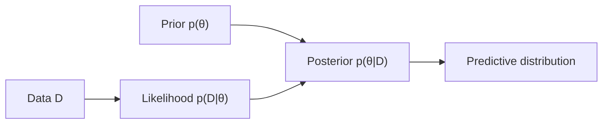

# 0.4 — Probability & Statistics for AI

> ML is applied probability. If you internalize a handful of distributions, Bayes' rule, and the notion of expectation, everything downstream (loss functions, generative models, RL) becomes obvious.

---

## 1. Intuition first

**Probability** is a formal language for reasoning about **uncertainty**. Almost every ML model outputs (or assumes) a probability distribution: a classifier says "80% cat, 20% dog"; an LLM samples the next token from a distribution; a diffusion model gradually denoises a Gaussian.

**Statistics** is what happens when you flip probability upside down: given data (samples), infer the parameters of the distribution that likely produced it. Training an ML model is (usually) statistical estimation.

## 2. Why the topic exists

- Real data is noisy — we cannot pretend labels are perfect.
- We need to **quantify confidence** (calibrated predictions, A/B tests, anomaly detection).
- Losses like cross-entropy come directly from maximum-likelihood estimation.
- Generative models are literally probability distributions we can sample from.

## 3. What problem it solves

- Estimating parameters (MLE, MAP, Bayesian inference).
- Making decisions under uncertainty (Bayes-optimal classifiers).
- Comparing models / features (hypothesis tests, information gain).
- Modeling generative processes (Naive Bayes, HMM, VAE, Diffusion).

## 4. Mathematics

### 4.1 Sample space, event, probability

- $\Omega$ = sample space (all possible outcomes).
- Event $A \subseteq \Omega$.
- Probability $P: 2^\Omega \to [0, 1]$ with $P(\Omega) = 1$ and $\sigma$-additivity.

### 4.2 Conditional probability & Bayes

$$
P(A \mid B) = \frac{P(A \cap B)}{P(B)}
$$

**Bayes' rule:**

$$
P(H \mid D) = \frac{P(D \mid H)\, P(H)}{P(D)}
$$

$P(H)$ prior, $P(D\mid H)$ likelihood, $P(H\mid D)$ posterior, $P(D)$ evidence.

### 4.3 Random variables, expectation, variance

Discrete: $E[X] = \sum_x x\, p(x)$. Continuous: $E[X] = \int x\, p(x)\,dx$.

$$
\text{Var}(X) = E[(X-E[X])^2] = E[X^2] - (E[X])^2
$$

Standard deviation $\sigma = \sqrt{\text{Var}(X)}$.

### 4.4 Common distributions (memorize)

| Distribution | PMF/PDF | Use in ML |
|--------------|---------|-----------|
| Bernoulli($p$) | $p^x(1-p)^{1-x}$, $x \in \{0,1\}$ | binary labels |
| Categorical($\boldsymbol{\pi}$) | $\prod_k \pi_k^{x_k}$ | multi-class labels, softmax |
| Binomial($n, p$) | $\binom{n}{k}p^k(1-p)^{n-k}$ | counts of successes |
| Gaussian $\mathcal{N}(\mu, \sigma^2)$ | $\frac{1}{\sigma\sqrt{2\pi}} e^{-\tfrac{(x-\mu)^2}{2\sigma^2}}$ | continuous outputs, noise |
| Uniform($a, b$) | $\frac{1}{b-a}$ | initialization, sampling |
| Exponential($\lambda$) | $\lambda e^{-\lambda x}$ | wait times |
| Poisson($\lambda$) | $\frac{\lambda^k e^{-\lambda}}{k!}$ | event counts |
| Beta($\alpha, \beta$) | conjugate to Bernoulli | Thompson sampling |
| Dirichlet | conjugate to Categorical | topic models |

### 4.5 Joint, marginal, independence

- $p(x, y)$ joint. Marginalize: $p(x) = \sum_y p(x, y)$.
- $X \perp Y$ iff $p(x,y) = p(x) p(y)$.

### 4.6 Maximum likelihood estimation (MLE)

Given data $\{x_1, \ldots, x_n\}$ from $p_\theta$, choose

$$
\hat\theta_{\text{MLE}} = \arg\max_\theta \prod_{i=1}^n p_\theta(x_i) = \arg\max_\theta \sum_{i=1}^n \log p_\theta(x_i)
$$

Log-likelihood turns products into sums (numerically stable).

### 4.7 MAP estimation

$$
\hat\theta_{\text{MAP}} = \arg\max_\theta p(\theta \mid x_{1:n}) = \arg\max_\theta \Big[\sum_i \log p_\theta(x_i) + \log p(\theta)\Big]
$$

Adds a prior — equivalent to regularization.

### 4.8 KL divergence & cross-entropy

$$
D_{\mathrm{KL}}(p \parallel q) = \sum_x p(x) \log \frac{p(x)}{q(x)}
$$

Cross-entropy $H(p, q) = -\sum p(x) \log q(x) = H(p) + D_{\mathrm{KL}}(p \parallel q)$.

Minimizing cross-entropy loss = minimizing KL from data distribution to model.

### 4.9 Central Limit Theorem

Sample mean of $n$ i.i.d. random variables with finite variance $\sigma^2$ tends to $\mathcal{N}(\mu, \sigma^2/n)$ as $n \to \infty$. Basis of confidence intervals, A/B tests, bootstrap.

## 5. Every formula explained

Explanations above; here are the key intuitions:

- **Bayes**: update belief in hypothesis given data.
- **MLE**: pick parameters that make the observed data "most probable".
- **KL divergence**: how much information is lost if we approximate $p$ with $q$; asymmetric.
- **Cross-entropy loss** for a classifier is the negative log-likelihood.

## 6. Every variable explained

| Symbol | Meaning |
|--------|---------|
| $P$, $p$ | probability / density |
| $E[\cdot]$ | expectation |
| $\text{Var}$ | variance |
| $\mu, \sigma$ | mean, std |
| $\theta$ | parameters of a distribution |
| $H$ | hypothesis / entropy |
| $D_{\mathrm{KL}}$ | KL divergence |

## 7. Step-by-step algorithm — MLE for Bernoulli

Data: $x_1, \ldots, x_n \in \{0, 1\}$.

1. Model: $x_i \sim \text{Bernoulli}(p)$.
2. Log-likelihood: $\ell(p) = \sum_i x_i \log p + (1-x_i)\log(1-p)$.
3. Differentiate: $\ell'(p) = \tfrac{\sum x_i}{p} - \tfrac{n - \sum x_i}{1-p}$.
4. Set to 0: $\hat p = \tfrac{1}{n}\sum x_i$ — the sample mean.

## 8. Simple example

You flip a coin 10 times, get 7 heads. MLE for $p$ = 0.7. With a Beta(2, 2) prior, MAP = $\tfrac{7 + 2 - 1}{10 + 4 - 2} = 8/12 = 0.667$.

## 9. Real-world example

- **Spam filter (Naive Bayes)** — uses Bayes' rule to combine per-word likelihoods.
- **A/B test** — is button B's click-rate really higher than A's? Two-proportion z-test.
- **LLM sampling** — categorical distribution over vocabulary at each step.
- **Kalman filter (self-driving)** — Bayesian update of vehicle state.

## 10. Diagram



## 11. Implementation from scratch

```python
import math, random

def sample_gaussian(mu, sigma):
    u1, u2 = random.random(), random.random()
    z = math.sqrt(-2 * math.log(u1)) * math.cos(2 * math.pi * u2)   # Box-Muller
    return mu + sigma * z

def mean(xs):
    return sum(xs) / len(xs)

def variance(xs, ddof=1):
    m = mean(xs)
    return sum((x - m)**2 for x in xs) / (len(xs) - ddof)

def kl_divergence(p, q):
    return sum(px * math.log(px / qx) for px, qx in zip(p, q) if px > 0)

def mle_bernoulli(data):
    return sum(data) / len(data)

def bayes_beta_bernoulli(data, alpha=1, beta=1):
    s = sum(data); n = len(data)
    return (s + alpha - 1) / (n + alpha + beta - 2)   # MAP
```

## 12. Implementation using libraries

```python
import numpy as np
from scipy import stats

samples = np.random.normal(loc=0, scale=1, size=1000)
mu_hat, sigma_hat = stats.norm.fit(samples)   # MLE

# hypothesis test
a = np.random.binomial(1, 0.5, size=500)
b = np.random.binomial(1, 0.55, size=500)
z, pvalue = stats.ttest_ind(a, b)
```

## 13. Time complexity

- MLE for exponential-family models: closed form, O(n).
- Iterative Bayesian methods (MCMC, VI): many passes over data.

## 14. Space complexity

Depends on model. Naive Bayes = O(|vocab| × |classes|); Kalman = O(state²).

## 15. Advantages

- Principled uncertainty.
- Interpretable (probabilities are calibratable).
- Bayesian view naturally handles small data via priors.

## 16. Disadvantages

- Requires distributional assumptions that may not hold.
- Full Bayesian inference is often intractable.
- Poorly-calibrated NN outputs are a pitfall.

## 17. Interview questions

1. State and prove Bayes' rule.
2. Difference between MLE and MAP.
3. Explain KL divergence and why it's asymmetric.
4. What is the relationship between cross-entropy loss and MLE?
5. Central Limit Theorem — statement and one use case.
6. Frequentist vs Bayesian statistics.
7. What is p-value? What is a Type I error?
8. Why do we use log-likelihood instead of likelihood?
9. What is a confidence interval? What does 95% mean?
10. Derive MLE for a Gaussian with unknown mean and variance.

## 18. Common mistakes

- Interpreting p-value as $P(H_0 \mid D)$.
- Ignoring multiple-comparisons corrections in A/B testing.
- Assuming NN softmax outputs are calibrated probabilities (they usually aren't — use temperature scaling).
- Confusing conditional independence with marginal independence.

## 19. Optimization techniques

- Log-space arithmetic for numerical stability (log-sum-exp).
- Reparameterization trick for gradient through samplers (VAE).
- Variational inference to approximate intractable posteriors.
- Bootstrap for empirical confidence intervals.

## 20. Coding exercises

1. Simulate 10 000 coin flips, plot the sample mean converging to 0.5.
2. Implement Box-Muller Gaussian sampler.
3. Implement a Naive Bayes spam classifier from scratch.
4. Compute confidence interval for a mean via bootstrap.
5. Show cross-entropy = negative log-likelihood on a binary classifier.
6. Fit a Beta-Binomial model to Amazon rating data.

## 21. Mini project

Build a Bayesian A/B test dashboard: input two conversion counts, output posterior over lift, probability lift > 0, expected loss.

## 22. Medium project

Implement a Kalman filter for tracking a moving object from noisy 2D measurements; visualize the shrinking uncertainty ellipse.

## 23. Advanced project

Variational Autoencoder from scratch on MNIST: derive the ELBO, implement the reparameterization trick, generate new digits, visualize the latent space.

## 24. Where it is used in industry

- Ad-tech: click prediction, uplift modeling, bandits.
- Finance: risk models, Bayesian portfolio optimization.
- Healthcare: diagnostic probability, survival analysis.
- Every A/B test at every tech company.

## 25. How companies use it

- **Amazon, Meta, Google** — Bayesian experimentation frameworks.
- **Insurance** — MLE / Bayesian estimation of loss distributions.
- **Robotics (Waymo, Boston Dynamics)** — probabilistic state estimation.

## 26. When NOT to use it

- When you already have massive labeled data + a well-tuned discriminative model, Bayesian machinery may be overkill.
- Real-time constraints that cannot afford MCMC.
