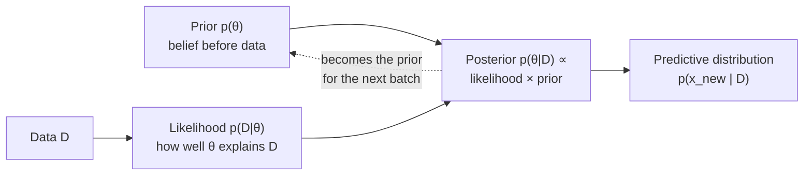
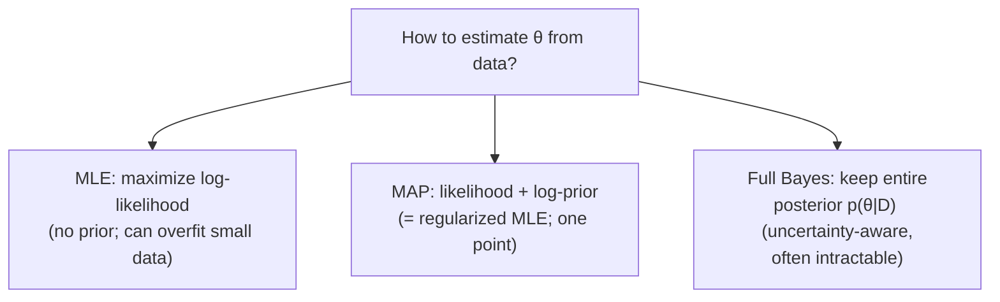
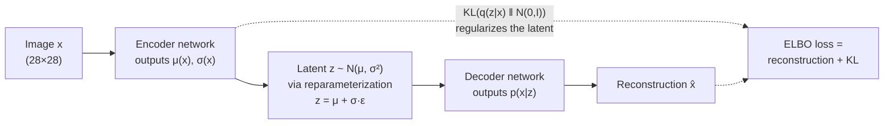

# 0.4 — Probability & Statistics for AI

> ML is applied probability. If you internalize a handful of distributions, Bayes' rule, and the notion of expectation, everything downstream (loss functions, generative models, RL) becomes obvious.

---

## 1. Overview

**What is it?** Probability is a formal language for reasoning about **uncertainty**: it assigns numbers between 0 and 1 to events and tells us how those numbers combine. Statistics is probability run in reverse: given observed data (samples), infer the parameters of the process that likely produced it.

**Why does it exist (for us)?** Real data is noisy — labels are imperfect, measurements jitter, users behave randomly. We cannot pretend otherwise, so we need machinery to quantify confidence (calibrated predictions, A/B tests, anomaly detection), and we need to understand that training an ML model *is* statistical estimation: cross-entropy loss comes directly from maximum likelihood.

**What problem does it solve?** Estimating parameters from data (MLE, MAP, Bayesian inference); making decisions under uncertainty (Bayes-optimal classifiers); comparing models and features (hypothesis tests, information gain); and modeling generative processes we can sample from (Naive Bayes, HMMs, VAEs, diffusion models).

**Where is it used?** Almost every model outputs or assumes a probability distribution: a classifier says "80% cat, 20% dog"; an LLM samples the next token from a categorical distribution over its vocabulary; a diffusion model gradually denoises a Gaussian; every A/B test at every tech company is a statistics computation.

## 2. Learning Objectives

After this chapter you will be able to:

- Define sample spaces, events, random variables, and the axioms of probability.
- Compute conditional probabilities and apply Bayes' rule, correctly naming prior, likelihood, posterior, and evidence.
- Compute expectations and variances of discrete and continuous random variables.
- Recognize and use the workhorse distributions (Bernoulli, Categorical, Binomial, Gaussian, Uniform, Exponential, Poisson, Beta, Dirichlet) and know where each appears in ML.
- Distinguish joint, marginal, and conditional distributions, and test independence.
- Derive maximum-likelihood estimators (MLE) for Bernoulli and Gaussian models, step by step.
- Explain MAP estimation and its equivalence to regularized MLE.
- Define KL divergence and cross-entropy and prove their relationship; connect cross-entropy loss to MLE.
- State the Law of Large Numbers and the Central Limit Theorem and use them for confidence intervals and A/B tests.
- Implement samplers (Box–Muller), estimators, and a Naive Bayes classifier from scratch.
- Avoid the classic inference traps: p-value misreading, uncalibrated softmax outputs, multiple comparisons.

## 3. Prerequisites

| Prerequisite | Link | Why |
|---|---|---|
| Python for AI | [01-python-for-ai.md](01-python-for-ai.md) | All implementations use Python (dicts, comprehensions, `math`, `random`). |
| Linear Algebra | [02-linear-algebra.md](02-linear-algebra.md) | Multivariate distributions live on vectors; covariance is a matrix. |
| Calculus | [03-calculus.md](03-calculus.md) | MLE derivations set derivatives of the log-likelihood to zero; densities integrate to 1. |

Forward references: this chapter is the foundation of [Naive Bayes](../phase-1-classical-ml/07-naive-bayes.md), [Logistic Regression](../phase-1-classical-ml/04-logistic-regression.md), [Loss Functions](../phase-2-deep-learning/04-loss-functions.md), and the generative models of [Phase 2](../phase-2-deep-learning/11-autoencoders.md) and beyond.

## 4. Intuition

Probability is a **belief meter**: 0 means "impossible," 1 means "certain," and everything in between quantifies how strongly you should bet. Statistics flips the telescope: instead of "given the coin's bias, what will I see?", it asks "given what I saw, what is the coin's bias?"

**The detective analogy for Bayes' rule.** A detective starts with hunches about suspects (the **prior**). Each clue is weighed by how expected it would be if a given suspect were guilty (the **likelihood**). Combining hunch and clue yields an updated hunch (the **posterior**). Crucially, a clue that is equally likely under every hypothesis changes nothing — evidence only discriminates when its probability differs across hypotheses.

**An everyday story about base rates.** A medical test for a rare disease is "99% accurate." You test positive. Are you 99% likely to be sick? No. If only 1 person in 1,000 has the disease, then among 1,000 people the test flags roughly 1 true positive and about 10 false positives (1% of the 999 healthy). Your chance of being sick is about 1 in 11 — under 10%. This is Bayes' rule protecting you from ignoring the prior, and it is exactly the calculation a spam filter does with every email.

**Expectation as a long-run average.** If a slot machine pays \$10 with probability 0.05 and \$0 otherwise, its expected payout is \$0.50 per pull — what you'd average over thousands of pulls. Losses in ML are expectations estimated by averaging over mini-batches.

## 5. Real-world Motivation

- **Google, Meta, Amazon, Netflix, Microsoft** run enormous experimentation platforms; every product change ships through A/B tests whose decisions rest on the Central Limit Theorem, confidence intervals, and increasingly Bayesian analyses.
- **OpenAI/Anthropic-style LLMs** are literally probability models: they define $p(\text{next token} \mid \text{context})$, are trained by minimizing cross-entropy (= maximizing likelihood), and generate text by sampling with temperature.
- **Gmail's spam filtering** historically built on Naive Bayes — Bayes' rule applied per word — and modern successors still output calibrated probabilities.
- **Self-driving stacks (e.g., Waymo)** run probabilistic state estimation (Kalman-filter-family Bayesian updates) to fuse noisy sensor readings into position/velocity beliefs.
- **Insurance and finance** estimate loss distributions by MLE and Bayesian methods; ad-tech allocates traffic with Thompson sampling over Beta posteriors.

## 6. Mathematical Foundations

### 6.1 Sample space, events, axioms

- $\Omega$ — the **sample space**: the set of all possible outcomes (for one die: $\{1,\dots,6\}$).
- An **event** $A \subseteq \Omega$ (e.g., "roll is even").
- A probability measure $P$ assigns each event a number with: $P(A) \ge 0$; $P(\Omega) = 1$; and for mutually exclusive events, $P(A \cup B) = P(A) + P(B)$ ($\sigma$-additivity for countable unions). Everything else in this chapter follows from these three axioms.

### 6.2 Conditional probability and Bayes' rule

The probability of $A$ *given that* $B$ happened rescales to the world where $B$ is true:

$$
P(A \mid B) = \frac{P(A \cap B)}{P(B)}, \qquad P(B) > 0
$$

Symmetry of the intersection gives $P(A\cap B) = P(A\mid B)P(B) = P(B\mid A)P(A)$; dividing yields **Bayes' rule**:

$$
P(H \mid D) = \frac{P(D \mid H)\, P(H)}{P(D)}
$$

with $H$ a hypothesis, $D$ observed data, $P(H)$ the **prior**, $P(D\mid H)$ the **likelihood**, $P(H\mid D)$ the **posterior**, and the **evidence** $P(D) = \sum_{H'} P(D\mid H')P(H')$ (law of total probability) acting as the normalizer.

### 6.3 Random variables, expectation, variance

A **random variable** $X$ maps outcomes to numbers. Discrete: $E[X] = \sum_x x\,p(x)$; continuous: $E[X] = \int x\,p(x)\,dx$, where $p$ is the PMF/PDF. Expectation is linear — $E[aX + bY] = aE[X] + bE[Y]$ — *always*, even for dependent variables. Variance measures spread:

$$
\mathrm{Var}(X) = E\big[(X - E[X])^2\big] = E[X^2] - (E[X])^2
$$

(the second form follows by expanding the square and using linearity). Standard deviation $\sigma = \sqrt{\mathrm{Var}(X)}$. For independent $X, Y$: $\mathrm{Var}(X+Y) = \mathrm{Var}(X) + \mathrm{Var}(Y)$.

### 6.4 The workhorse distributions

| Distribution | PMF / PDF | Use in ML |
|--------------|-----------|-----------|
| Bernoulli($p$) | $p^x(1-p)^{1-x}$, $x \in \{0,1\}$ | binary labels, coin flips |
| Categorical($\boldsymbol{\pi}$) | $\prod_k \pi_k^{x_k}$ (one-hot $x$) | multi-class labels, softmax outputs, LLM token sampling |
| Binomial($n, p$) | $\binom{n}{k}p^k(1-p)^{n-k}$ | count of successes in $n$ trials, A/B conversions |
| Gaussian $\mathcal{N}(\mu, \sigma^2)$ | $\frac{1}{\sigma\sqrt{2\pi}}\, e^{-\frac{(x-\mu)^2}{2\sigma^2}}$ | continuous noise, weight init, diffusion, CLT limit |
| Uniform($a, b$) | $\frac{1}{b-a}$ on $[a,b]$ | random init, the raw material of all samplers |
| Exponential($\lambda$) | $\lambda e^{-\lambda x}$, $x \ge 0$ | waiting times, survival analysis |
| Poisson($\lambda$) | $\frac{\lambda^k e^{-\lambda}}{k!}$ | event counts per interval (clicks, arrivals) |
| Beta($\alpha, \beta$) | $\propto x^{\alpha-1}(1-x)^{\beta-1}$ | prior over probabilities; conjugate to Bernoulli; Thompson sampling |
| Dirichlet($\boldsymbol{\alpha}$) | $\propto \prod_k x_k^{\alpha_k - 1}$ | prior over categoricals; topic models |

Here $\boldsymbol{\pi} = (\pi_1,\dots,\pi_K)$ are class probabilities summing to 1; $\mu, \sigma^2$ are mean and variance; $\lambda$ is a rate; $\alpha, \beta$ are pseudo-count shape parameters.

### 6.5 Joint, marginal, conditional, independence

- **Joint** $p(x, y)$: probability of both. **Marginalization** integrates out what you don't care about: $p(x) = \sum_y p(x, y)$.
- **Conditional**: $p(y \mid x) = p(x,y)/p(x)$ — the object every discriminative model learns.
- **Independence** $X \perp Y$ iff $p(x, y) = p(x)\,p(y)$ for all $x, y$. Conditional independence $X \perp Y \mid Z$ (given $Z$, learning $Y$ tells you nothing more about $X$) is the assumption behind Naive Bayes.

### 6.6 Maximum likelihood estimation (MLE)

Given i.i.d. data $x_1,\dots,x_n \sim p_\theta$, choose the parameters that make the data most probable:

$$
\hat\theta_{\text{MLE}} = \arg\max_\theta \prod_{i=1}^n p_\theta(x_i) = \arg\max_\theta \underbrace{\sum_{i=1}^n \log p_\theta(x_i)}_{\ell(\theta),\ \text{log-likelihood}}
$$

The $\log$ is monotone, so the argmax is unchanged — and products of thousands of small numbers underflow, while sums of logs are stable. **Derivation for Bernoulli**: $\ell(p) = \sum_i \big[x_i\log p + (1-x_i)\log(1-p)\big]$; setting $\ell'(p) = \frac{\sum_i x_i}{p} - \frac{n - \sum_i x_i}{1-p} = 0$ gives $\hat p = \frac{1}{n}\sum_i x_i$ — the sample mean. For a Gaussian, the same procedure yields $\hat\mu = \bar x$ and $\hat\sigma^2 = \frac{1}{n}\sum_i (x_i - \bar x)^2$.

### 6.7 MAP estimation

Bayes' rule on parameters gives $p(\theta \mid x_{1:n}) \propto p(x_{1:n}\mid\theta)\,p(\theta)$; maximizing:

$$
\hat\theta_{\text{MAP}} = \arg\max_\theta \Big[\sum_i \log p_\theta(x_i) + \log p(\theta)\Big]
$$

MLE plus a prior term. With a Gaussian prior on weights, $\log p(\theta) = -\frac{\|\theta\|^2}{2\tau^2} + \text{const}$ — MAP **is** L2-regularized MLE; a Laplace prior gives L1. Regularization ([Phase 1](../phase-1-classical-ml/05-regularization.md)) is Bayesian at heart.

### 6.8 Entropy, KL divergence, cross-entropy

**Entropy** $H(p) = -\sum_x p(x)\log p(x)$ measures the average surprise (in nats for $\ln$, bits for $\log_2$) of samples from $p$. **KL divergence** measures how badly $q$ approximates $p$:

$$
D_{\mathrm{KL}}(p \parallel q) = \sum_x p(x) \log \frac{p(x)}{q(x)} \;\ge\; 0, \quad = 0 \text{ iff } p = q
$$

It is **asymmetric**: $D_{\mathrm{KL}}(p\|q) \neq D_{\mathrm{KL}}(q\|p)$. **Cross-entropy** expands it:

$$
H(p, q) = -\sum_x p(x)\log q(x) = H(p) + D_{\mathrm{KL}}(p \parallel q)
$$

Since $H(p)$ (the data distribution's entropy) is fixed, **minimizing cross-entropy = minimizing KL from data to model = maximizing likelihood**. This single identity explains why classification uses cross-entropy loss.

### 6.9 Law of Large Numbers and Central Limit Theorem

**LLN**: the sample mean $\bar X_n = \frac{1}{n}\sum_i X_i$ of i.i.d. variables converges to the true mean $\mu$ as $n \to \infty$ — averages stabilize. **CLT**: not only does it converge, its fluctuations become Gaussian:

$$
\bar X_n \;\xrightarrow{\ d\ }\; \mathcal{N}\!\Big(\mu, \frac{\sigma^2}{n}\Big) \quad \text{as } n \to \infty
$$

for any i.i.d. distribution with finite variance $\sigma^2$ — regardless of its shape. This is why measurement noise is so often Gaussian, and it is the engine of confidence intervals ($\bar x \pm 1.96\,\sigma/\sqrt{n}$ for 95%), A/B tests, and the bootstrap.

**Symbol table**: $\Omega$ — sample space; $A, B$ — events; $P, p$ — probability / density; $X, Y$ — random variables; $E[\cdot]$ — expectation; $\mathrm{Var}$ — variance; $\mu, \sigma$ — mean, standard deviation; $\theta$ — model parameters; $\ell$ — log-likelihood; $H$ — hypothesis (6.2) or entropy (6.8), per context; $D_{\mathrm{KL}}$ — KL divergence; $\boldsymbol{\pi}, \lambda, \alpha, \beta$ — distribution parameters; $\hat\cdot$ — an estimate; i.i.d. — independent and identically distributed.

## 7. Visual Explanation

Bayesian updating as a pipeline:



The estimation landscape:



The CLT in ASCII — averaging hammers any shape into a bell:

```
 single die (uniform)      mean of 2 dice          mean of 30 dice
 ______________            /\                          _
 | | | | | | |            /  \                       _/ \_
 1 2 3 4 5 6             1 ... 6                    ~N(3.5, σ²/30)
```

## 8. Algorithm

**Deriving an MLE**, the general recipe:

1. Write the model: $x_i \sim p_\theta$, i.i.d.
2. Write the log-likelihood $\ell(\theta) = \sum_i \log p_\theta(x_i)$.
3. Differentiate w.r.t. each parameter (this is where [Calculus](03-calculus.md) pays off) and set to zero.
4. Solve; check it's a maximum (second derivative negative / Hessian negative-definite).
5. If no closed form exists (logistic regression, neural nets), run gradient *ascent* on $\ell$ — equivalently gradient descent on negative log-likelihood, which is exactly a standard training loop.

**Naive Bayes classification** (Bayes' rule as an algorithm):

```text
TRAIN(documents, labels):
    for each class c:
        prior[c] = count(labels == c) / N
        for each word w in vocabulary:
            # Laplace smoothing (+1) avoids zero probabilities
            lik[w][c] = (count of w in class-c docs + 1) /
                        (total words in class-c docs + |V|)

PREDICT(document):
    for each class c:
        # log-space: sums, not products -> no underflow
        score[c] = log(prior[c]) + Σ_{w in document} log(lik[w][c])
    return argmax_c score[c]
```

The conditional-independence assumption (words independent given the class) is what makes the product of per-word likelihoods legitimate — "naive," but startlingly effective.

## 9. Worked Example

**Tiny example entirely by hand — coin flipping.** You flip a coin 10 times and see 7 heads.

- **MLE**: $\hat p = 7/10 = 0.7$ (Section 6.6's formula).
- **MAP with a Beta(2, 2) prior** (a gentle belief that the coin is fair): the posterior is Beta$(7+2,\ 3+2)$ = Beta(9, 5), whose mode is $\frac{\alpha - 1}{\alpha + \beta - 2} = \frac{8}{12} \approx 0.667$. The prior pulls the estimate toward 0.5 — regularization in action, worth exactly 2 pseudo-flips of heads and 2 of tails.

**The medical-test example with numbers.** Disease prevalence $P(H) = 0.001$; test sensitivity $P(+\mid H) = 0.99$; false-positive rate $P(+\mid \neg H) = 0.01$. Then

$$
P(H \mid +) = \frac{0.99 \times 0.001}{0.99 \times 0.001 + 0.01 \times 0.999} = \frac{0.00099}{0.00099 + 0.00999} \approx 0.090
$$

A positive test means only a 9% chance of disease — the base rate dominates, as promised in Section 4.

**Realistic example — an A/B test.** Button A converts 500/10,000 (5.0%); button B converts 570/10,000 (5.7%). Standard error of the difference: $\sqrt{\frac{0.05 \cdot 0.95}{10^4} + \frac{0.057 \cdot 0.943}{10^4}} \approx 0.0032$. The observed lift 0.007 is $z = 0.007/0.0032 \approx 2.2$ standard errors from zero — p ≈ 0.028, significant at the 5% level. The CLT (Section 6.9) is what licenses treating the conversion-rate difference as Gaussian.

## 10. Python from Scratch

Core probability tools with nothing but the standard library:

```python
import math, random

def sample_gaussian(mu, sigma):
    """Box-Muller: turn two Uniform(0,1) draws into one N(mu, sigma^2) draw."""
    u1, u2 = random.random(), random.random()
    z = math.sqrt(-2 * math.log(u1)) * math.cos(2 * math.pi * u2)  # z ~ N(0,1)
    return mu + sigma * z                    # scale and shift

def mean(xs):
    return sum(xs) / len(xs)

def variance(xs, ddof=1):
    """ddof=1 -> unbiased sample variance (divide by n-1)."""
    m = mean(xs)
    return sum((x - m) ** 2 for x in xs) / (len(xs) - ddof)

def kl_divergence(p, q):
    """D_KL(p||q) for two discrete distributions given as aligned lists."""
    return sum(px * math.log(px / qx) for px, qx in zip(p, q) if px > 0)

def mle_bernoulli(data):
    """MLE for coin bias = the sample mean (derived in Section 6.6)."""
    return sum(data) / len(data)

def map_beta_bernoulli(data, alpha=2, beta=2):
    """Posterior mode under a Beta(alpha, beta) prior (Section 9's formula)."""
    s, n = sum(data), len(data)
    return (s + alpha - 1) / (n + alpha + beta - 2)

flips = [1, 1, 1, 1, 1, 1, 1, 0, 0, 0]       # 7 heads in 10
print(mle_bernoulli(flips))                   # 0.7
print(round(map_beta_bernoulli(flips), 3))    # 0.667 — matches the hand calculation
```

A minimal but complete **Naive Bayes spam classifier** (log-space, smoothed):

```python
from collections import defaultdict

def train_nb(docs, labels):
    """docs: list of token lists; labels: 'spam'/'ham'."""
    prior, word_counts, total = {}, {}, {}
    vocab = {w for d in docs for w in d}
    for c in set(labels):
        cls_docs = [d for d, l in zip(docs, labels) if l == c]
        prior[c] = len(cls_docs) / len(docs)
        counts = defaultdict(int)
        for d in cls_docs:
            for w in d:
                counts[w] += 1
        word_counts[c] = counts
        total[c] = sum(counts.values())
    return prior, word_counts, total, vocab

def predict_nb(doc, prior, word_counts, total, vocab):
    best_c, best_score = None, -math.inf
    for c in prior:
        score = math.log(prior[c])            # log prior
        for w in doc:
            # Laplace (+1) smoothing: unseen words don't zero the product
            lik = (word_counts[c][w] + 1) / (total[c] + len(vocab))
            score += math.log(lik)            # log-space sum, no underflow
        if score > best_score:
            best_c, best_score = c, score
    return best_c
```

Common bug: multiplying raw probabilities instead of summing logs — for a 200-word email, $0.01^{200}$ underflows to exactly `0.0` and every class ties. Complexity: training O(total tokens); prediction O(doc length × classes).

## 11. Library Implementation

NumPy and SciPy provide vetted, vectorized versions of everything above:

```python
import numpy as np
from scipy import stats

rng = np.random.default_rng(42)

# Sampling & fitting: 1000 draws, then MLE recovery of parameters
samples = rng.normal(loc=5.0, scale=2.0, size=1000)   # shape (1000,)
mu_hat, sigma_hat = stats.norm.fit(samples)           # MLE: ~5.0, ~2.0

# Densities, CDFs, quantiles
stats.norm.pdf(0.0)                    # density of N(0,1) at 0: 0.3989
stats.norm.cdf(1.96)                   # ~0.975 -> the 95% CI constant
stats.beta(9, 5).mean()                # posterior mean from Section 9: 0.643

# The A/B test from Section 9, in three lines
conv_a = np.concatenate([np.ones(500),  np.zeros(9500)])   # 5.0% of 10k
conv_b = np.concatenate([np.ones(570),  np.zeros(9430)])   # 5.7% of 10k
t, pvalue = stats.ttest_ind(conv_a, conv_b)                # p ≈ 0.03

# Cross-entropy = negative log-likelihood, verified numerically
p_true = np.array([1., 0., 0.])                 # one-hot label
q_model = np.array([0.7, 0.2, 0.1])             # model's softmax output
ce = -(p_true * np.log(q_model)).sum()          # 0.357 = -log(0.7)

# KL between two discrete distributions
p = np.array([0.5, 0.5]); q = np.array([0.9, 0.1])
kl = (p * np.log(p / q)).sum()                  # 0.511 nats; note KL(q||p) = 0.368 ≠
```

Each call has a from-scratch twin in Section 10 — use the library in production (edge cases, numerical stability, speed), but be able to write the twin.

## 12. Code Walkthrough

Tracing the fit-and-test pipeline:

| Value | Shape / Type | Meaning |
|---|---|---|
| `samples` | (1000,) float64 | i.i.d. draws from $\mathcal{N}(5, 4)$ |
| `mu_hat, sigma_hat` | scalars | MLE estimates; expect ≈ 5.0 and ≈ 2.0, off by $O(1/\sqrt{1000}) \approx 0.06$ |
| `conv_a`, `conv_b` | (10000,) of {0., 1.} | per-user conversion indicators, Bernoulli samples |
| `pvalue` | scalar | ≈ 0.03: probability of a difference this large *if* A and B truly converted equally |
| `ce` | scalar | 0.357 nats = $-\log 0.7$; drops toward 0 as the model puts mass on the true class |
| `kl` | scalar | 0.511 nats; recomputing with arguments swapped gives 0.368 — asymmetry demonstrated |

Expected results are deterministic given the seed. Sanity checks worth running: `samples.mean()` ≈ `mu_hat` (they're the same formula); increasing the sample size by 100× shrinks estimation error by 10× (the $\sqrt{n}$ law from the CLT). Common bug: calling `stats.norm.fit` on data containing `NaN` silently propagates `NaN` estimates — validate inputs first.

## 13. Complexity Analysis

| Computation | Time | Why |
|---|---|---|
| MLE for exponential-family models (Bernoulli, Gaussian, Poisson) | O(n) | closed forms are sums over data — one pass |
| Naive Bayes training | O(total tokens + \|V\|·\|classes\|) | counting; the model is just count tables |
| Naive Bayes prediction | O(doc length × classes) | a log-sum per class |
| Bootstrap CI ($B$ resamples) | O(B·n) | recompute the statistic per resample; embarrassingly parallel |
| MCMC / variational inference | many passes over data | iterative posterior approximation — the price of full Bayes |

Space: Naive Bayes stores O(|V| × |classes|) counts; a Gaussian fit needs O(1) beyond the data; a $d$-dimensional multivariate Gaussian needs O(d²) for its covariance matrix (and O(d³) time to invert it — linear algebra again). Statistical efficiency is a complexity axis too: MLE errors shrink like $O(1/\sqrt{n})$, so each extra digit of accuracy costs 100× more data.

## 14. Advantages

- **Principled uncertainty.** A probabilistic model doesn't just answer, it says how sure it is — enabling abstention ("route to a human below 90% confidence"), risk-weighted decisions, and exploration strategies like Thompson sampling.
- **Unified view of losses.** Cross-entropy, MSE (Gaussian likelihood), and regularizers (priors) all fall out of one framework — you can *derive* your loss instead of guessing (Section 6.7–6.8).
- **Priors handle small data.** A Beta prior on a new ad's CTR keeps you from concluding "100% click rate!" after 2 impressions — exactly Section 9's pseudo-count effect.
- **Generative capability.** A fitted distribution can be *sampled*: Naive Bayes can hallucinate documents, VAEs and diffusion models generate images, LLMs generate text.
- **Composable reasoning.** Bayes' rule chains: today's posterior is tomorrow's prior, enabling online updating (Kalman filters process one measurement at a time).

## 15. Disadvantages

- **Distributional assumptions can be wrong.** Fitting a Gaussian to heavy-tailed returns underestimates crashes; Naive Bayes' independence assumption fails for correlated words ("San" and "Francisco"). Wrong model ⇒ confidently wrong inference.
- **Full Bayesian inference is often intractable.** The evidence $P(D)$ integral has no closed form for most interesting models; MCMC is slow, variational approximations are biased.
- **Miscalibration in practice.** Modern neural networks' softmax outputs are systematically overconfident — treating them as honest probabilities without recalibration (e.g., temperature scaling) is a known failure mode.
- **The i.i.d. assumption breaks quietly.** Time series, distribution shift, and feedback loops (a recommender influencing the data it later trains on) violate the premises of CLT-based inference.
- **Statistics is easy to abuse.** P-hacking, peeking at running experiments, and multiple comparisons produce plausible-looking false discoveries at scale.

## 16. Common Mistakes

- **Reading the p-value as $P(H_0 \mid D)$.** It is $P(\text{data this extreme} \mid H_0)$ — the reverse conditional. Converting one to the other requires a prior (Bayes' rule!).
- **Ignoring base rates** — the medical-test trap of Section 9. Always multiply by the prior.
- **Multiplying raw likelihoods instead of summing logs** — underflow to 0.0 (Section 10's bug). Work in log-space; use log-sum-exp when you must normalize.
- **Forgetting smoothing** in count-based models — one unseen word zeroes an entire class posterior.
- **Treating softmax outputs as calibrated probabilities.** Check calibration curves; apply temperature scaling before trusting the numbers.
- **Multiple comparisons without correction** — test 20 metrics at $\alpha = 0.05$ and expect one false positive by chance; use Bonferroni/FDR corrections.
- **Confusing independence with conditional independence.** Two symptoms may be dependent overall yet independent given the disease — and vice versa; Naive Bayes needs the *conditional* version.
- **Using biased variance (`ddof=0`) when the unbiased sample variance is intended** — a silent off-by-$\frac{n}{n-1}$ everywhere downstream.

## 17. Best Practices

- [ ] Work in log-probabilities everywhere; normalize with the log-sum-exp trick.
- [ ] Fix random seeds for reproducibility; report them.
- [ ] Decide sample size *before* an A/B test (power analysis); never stop early on a significant peek without a sequential-testing correction.
- [ ] Report uncertainty with every point estimate — a confidence/credible interval or at least a standard error.
- [ ] Check calibration of any classifier whose probabilities feed decisions; recalibrate if needed.
- [ ] Prefer conjugate priors (Beta–Bernoulli, Dirichlet–Categorical, Gaussian–Gaussian) when they fit — closed-form posteriors, no MCMC.
- [ ] Validate distributional assumptions visually (QQ-plots, histograms) before trusting parametric tests; fall back to the bootstrap when in doubt.
- [ ] Version and log the exact data snapshot used for any statistical conclusion.

> [!WARNING]
> The most expensive statistics bugs are silent: an unlogged early stop of an A/B test, an uncorrected 40-metric dashboard, an uncalibrated model gating loan approvals. Process discipline matters as much as math.

## 18. Optimization Techniques

- **Log-space arithmetic + log-sum-exp**: compute $\log\sum_i e^{a_i}$ as $m + \log\sum_i e^{a_i - m}$ with $m = \max_i a_i$ — the difference between working code and NaNs in any likelihood computation.
- **Conjugacy**: Beta–Bernoulli and Dirichlet–Categorical posteriors are single-line count updates — use them before reaching for samplers.
- **Vectorized simulation**: Monte Carlo estimates (bootstrap, posterior predictive checks) as NumPy array ops — $10^6$ resamples in milliseconds rather than Python-loop minutes.
- **Reparameterization trick**: write $z = \mu + \sigma\epsilon$, $\epsilon \sim \mathcal{N}(0,1)$, so gradients flow through samples — the enabling trick of VAEs ([Phase 2](../phase-2-deep-learning/11-autoencoders.md)).
- **Variational inference**: replace an intractable posterior with the closest member of a tractable family (minimizing KL) — turns integration into optimization.
- **Streaming/online estimators**: Welford's algorithm updates mean and variance in O(1) per observation without storing data — essential for telemetry-scale statistics.

## 19. Industry Applications

- **Experimentation platforms**: Microsoft's ExP, Netflix's and Amazon's experimentation systems, and Google's internal tooling run thousands of concurrent A/B tests — CLT-based and Bayesian inference as production infrastructure.
- **LLMs and generative AI**: OpenAI-, Anthropic-, Google-style models are trained by cross-entropy (MLE) and sampled with temperature/top-p — probability end to end.
- **Spam & abuse**: Naive Bayes launched modern spam filtering (famously popularized by Paul Graham's "A Plan for Spam"); probabilistic scoring still underpins abuse pipelines.
- **Bandits & recommendation**: Thompson sampling over Beta posteriors allocates traffic in ad systems and content ranking (used and published on by Microsoft and Yahoo research, among others).
- **Autonomy & robotics**: Kalman and particle filters (recursive Bayes) fuse sensors at Waymo-style companies, in aerospace, and in every drone autopilot.
- **Finance & insurance**: MLE/Bayesian estimation of loss and return distributions, value-at-risk, survival models for churn and credit.

## 20. Interview Questions

### Beginner

- **Q: State Bayes' rule and name its four parts.**
  A: $P(H\mid D) = P(D\mid H)P(H)/P(D)$ — posterior = likelihood × prior / evidence. Derivation: both orderings of $P(A\cap B)$ set equal (Section 6.2).
- **Q: Expectation and variance of a Bernoulli($p$)?**
  A: $E[X] = p$; $\mathrm{Var}(X) = E[X^2] - E[X]^2 = p - p^2 = p(1-p)$, maximized at $p = 0.5$ (a fair coin is the most unpredictable).
- **Q: Why use log-likelihood instead of likelihood?**
  A: Same argmax (log is monotone), but products of many small numbers underflow while log-sums are stable — and sums differentiate more cleanly.
- **Q: What does a 95% confidence interval mean?**
  A: The *procedure* captures the true parameter in 95% of repeated experiments. It is not "the parameter is in this interval with probability 0.95" — that's a Bayesian credible interval, a different object.
- **Q: When is a Poisson distribution appropriate?**
  A: Counts of events in a fixed interval when events occur independently at a constant rate — clicks per minute, requests per second, typos per page.

### Intermediate

- **Q: MLE vs MAP — difference, and when do they coincide?**
  A: MAP adds $\log p(\theta)$ (the prior) to the log-likelihood before maximizing; it equals regularized MLE (Gaussian prior ↔ L2, Laplace ↔ L1). They coincide under a flat prior, and MAP → MLE as data grows because the likelihood term scales with $n$ while the prior doesn't.
- **Q: Explain KL divergence and why its asymmetry matters.**
  A: $D_{\mathrm{KL}}(p\|q) = E_p[\log(p/q)]$ — expected extra surprise from using $q$ when data comes from $p$. Minimizing $D(p\|q)$ over $q$ makes $q$ cover all of $p$'s mass (mean-seeking); minimizing $D(q\|p)$ makes $q$ hide inside one mode (mode-seeking) — the choice shapes variational methods and distillation.
- **Q: Prove that minimizing cross-entropy is maximizing likelihood.**
  A: For one-hot labels, the empirical cross-entropy is $-\frac{1}{n}\sum_i \log q_\theta(y_i\mid x_i)$ — exactly the negative average log-likelihood; also $H(p,q) = H(p) + D_{\mathrm{KL}}(p\|q)$ with $H(p)$ constant in $\theta$ (Section 6.8).
- **Q: State the CLT and one place it can fail.**
  A: The standardized mean of i.i.d. finite-variance variables converges to $\mathcal{N}(0,1)$. Fails for infinite-variance (heavy-tailed) distributions like Cauchy — sample means of Cauchy draws are Cauchy, never Gaussian — and for strongly dependent data.
- **Q: What is a Type I error, and what does the multiple-comparisons problem do to it?**
  A: Rejecting a true null (false positive), controlled at rate $\alpha$ per test. With $m$ independent tests, the chance of ≥1 false positive is $1 - (1-\alpha)^m$ (≈ 64% for $m = 20$, $\alpha = 0.05$); corrections (Bonferroni: $\alpha/m$; FDR) restore control.

### Advanced

- **Q: Derive the Gaussian MLE for both $\mu$ and $\sigma^2$, and comment on bias.**
  A: $\ell = -\frac{n}{2}\log(2\pi\sigma^2) - \frac{1}{2\sigma^2}\sum_i(x_i-\mu)^2$. Setting $\partial\ell/\partial\mu = 0$ gives $\hat\mu = \bar x$; then $\partial\ell/\partial\sigma^2 = 0$ gives $\hat\sigma^2 = \frac{1}{n}\sum_i(x_i - \bar x)^2$ — biased low by factor $\frac{n-1}{n}$ because $\bar x$ is fit to the same data; the unbiased version divides by $n-1$.
- **Q: Why is the Beta distribution conjugate to the Bernoulli, and what does the update look like?**
  A: Beta$(\alpha,\beta) \propto p^{\alpha-1}(1-p)^{\beta-1}$ has the same functional form in $p$ as the Bernoulli likelihood $p^s(1-p)^{n-s}$; multiplying gives Beta$(\alpha + s, \beta + n - s)$ — priors act as pseudo-counts and the posterior stays in the family.
- **Q: What is the reparameterization trick and why is it needed?**
  A: Sampling $z \sim \mathcal{N}(\mu_\theta, \sigma_\theta^2)$ isn't differentiable in $\theta$; rewriting $z = \mu_\theta + \sigma_\theta\,\epsilon$ with $\epsilon \sim \mathcal{N}(0,1)$ moves randomness into a parameter-free input so $\partial z/\partial\theta$ exists and backprop works — essential to VAEs (ties to [Calculus](03-calculus.md)'s non-differentiability discussion).
- **Q: Frequentist vs Bayesian — the core philosophical and practical difference?**
  A: Frequentists treat $\theta$ as fixed and randomness as living in the data (probability = long-run frequency); Bayesians put a distribution on $\theta$ itself (probability = degree of belief). Practically: confidence vs credible intervals, regularization chosen by cross-validation vs implied by priors, point estimates vs posterior predictive averaging. Both agree asymptotically under regularity conditions.
- **Q: Your model's validation log-loss is much lower than production log-loss. Give three probabilistic explanations.**
  A: (1) Distribution shift — production $p(x, y)$ differs from validation (violating i.i.d.); (2) leakage — validation likelihood was optimistically biased by information unavailable at serving time; (3) feedback loops — the model's own decisions alter the data distribution it is scored on. Each has a different fix (monitoring/reweighting, pipeline audit, holdout traffic).

## 21. Coding Exercises

### Easy

1. Simulate 10,000 coin flips and plot the running sample mean converging to 0.5 (LLN in action). *Hint: `np.cumsum(flips) / np.arange(1, n+1)`.*
2. Implement the Box–Muller sampler and verify with a histogram against `scipy.stats.norm.pdf`. *Hint: Section 10; 50,000 samples make a smooth histogram.*
3. Reproduce the medical-test posterior (Section 9) as a function `posterior(prevalence, sensitivity, false_positive_rate)` and tabulate it for prevalences $10^{-1}$ to $10^{-4}$. *Hint: watch the posterior collapse as the prior shrinks.*

### Medium

1. Implement Naive Bayes from scratch (Section 10) and evaluate on a small spam dataset (e.g., SMS Spam Collection); compare against `sklearn.naive_bayes.MultinomialNB`. *Hint: agreement within ~1% accuracy validates your smoothing.*
2. Compute a bootstrap 95% CI for the median of a skewed sample and compare with the CLT-based CI for the mean. *Hint: resample with replacement 10,000 times; take the 2.5th/97.5th percentiles of the statistic.*
3. Demonstrate numerically that cross-entropy = NLL: train nothing — just show for random one-hot labels and softmax outputs that the two formulas agree to machine precision. *Hint: Section 11's `ce` line vs `-log q[true_class]`.*

### Hard

1. Implement Thompson sampling for a 3-armed Bernoulli bandit (true rates 0.3/0.5/0.6) using Beta posteriors; plot cumulative regret against an ε-greedy baseline over 10,000 pulls. *Hint: each round, sample one draw from each arm's Beta posterior and pull the argmax.*
2. Write a sequential A/B-test simulator demonstrating the peeking problem: with $H_0$ true, show the false-positive rate when testing after every 100 users vs testing once at the end. *Hint: expect ~5% once vs 30%+ with continuous peeking.*
3. Fit a 2-component Gaussian mixture to 1-D data with the EM algorithm from scratch; visualize responsibilities per iteration. *Hint: E-step = posterior of component given point (Bayes' rule!); M-step = weighted MLE.*

## 22. Mini Project

**Bayesian A/B test dashboard.**

1. Inputs: conversions and totals for variants A and B (e.g., 500/10,000 vs 570/10,000).
2. Model each variant's rate with a Beta(1, 1) prior; the posteriors are Beta$(1 + s,\ 1 + n - s)$ — conjugacy, no MCMC needed.
3. Draw 100,000 Monte Carlo samples from each posterior with NumPy; estimate $P(\text{rate}_B > \text{rate}_A)$ as the fraction of sample pairs where B wins.
4. Compute the posterior distribution of relative lift $(r_B - r_A)/r_A$ and the *expected loss* of choosing each variant (average shortfall when the choice is wrong).
5. Plot both posteriors and the lift histogram (Matplotlib); print a plain-language recommendation ("B is better with probability 97.8%; expected loss of shipping B: 0.002 pp").
6. Wrap it in a small CLI (skills from [Python for AI](01-python-for-ai.md)).

## 23. Medium Project

**Kalman filter for 2-D object tracking.**

1. Simulate an object moving in 2-D with constant velocity plus Gaussian process noise; generate noisy position measurements (state: $[x, y, v_x, v_y]$).
2. Implement the predict step: propagate the state mean with the motion model and inflate covariance by process noise (a Gaussian prior pushed through a linear map — [Linear Algebra](02-linear-algebra.md) at work).
3. Implement the update step: Bayes' rule for Gaussians — compute the Kalman gain and blend prediction with measurement in proportion to their certainties.
4. Visualize truth, raw measurements, and filtered trajectory; draw the shrinking covariance ellipse at each step.
5. Experiments: drop 20% of measurements (prediction-only stretches widen the ellipse — honest uncertainty), and mis-specify the noise levels to see divergence.
6. Quantify: RMSE of filtered vs raw positions across noise settings.

## 24. Advanced Project

**Variational Autoencoder (VAE) from first principles on MNIST.** (This project reaches into Phase 2 territory — treat it as a capstone that shows where this chapter's probability leads.)

Architecture:



Implementation phases:

1. **Derive the ELBO on paper**: start from $\log p(x) \ge E_{q(z|x)}[\log p(x|z)] - D_{\mathrm{KL}}(q(z|x)\,\|\,p(z))$ and derive the closed-form KL between two Gaussians — every symbol from Sections 6.2, 6.8 reappears.
2. **Implement** encoder/decoder MLPs in PyTorch with a 2-D latent; the reparameterization trick (Section 18) makes sampling differentiable.
3. **Train** on MNIST with the ELBO; monitor reconstruction and KL terms separately (KL collapsing to 0 is the classic failure — mitigate with KL warm-up).
4. **Evaluate**: reconstruct held-out digits; sample $z \sim \mathcal{N}(0, I)$ and decode to generate new digits; plot the 2-D latent space colored by digit class.
5. **Analyze**: sweep the KL weight (β-VAE) and document the reconstruction-vs-disentanglement tradeoff.

Possible improvements: convolutional encoder/decoder, importance-weighted bound (IWAE), comparison of $D(q\|p)$ vs $D(p\|q)$ behavior in a toy 1-D setting, latent-space interpolation between digits.

## 25. Summary

- Probability quantifies uncertainty forward (parameters → data); statistics inverts it (data → parameters).
- Bayes' rule — posterior ∝ likelihood × prior — is the one-line engine of inference; never ignore the base rate.
- Expectation is a long-run average and is always linear; variance measures spread and adds only under independence.
- Memorize the workhorse distributions and their ML homes: Bernoulli/Categorical for labels, Gaussian for noise, Beta/Dirichlet as priors, Poisson/Exponential for counts and waits.
- MLE maximizes log-likelihood (Bernoulli → sample mean; Gaussian → sample mean & variance); MAP adds a log-prior and *is* regularization.
- Cross-entropy = entropy + KL, so minimizing cross-entropy loss = maximizing likelihood = matching the data distribution.
- KL divergence is asymmetric, and which direction you minimize changes the solution's character (covering vs mode-seeking).
- LLN says averages stabilize; CLT says their errors are Gaussian with width $\sigma/\sqrt{n}$ — the basis of confidence intervals and A/B tests.
- Work in log-space; smooth your counts; correct for multiple comparisons; don't peek at running experiments.
- Neural network confidences are not automatically calibrated probabilities — check and recalibrate before trusting them.

## 26. Cheat Sheet

| Formula | Meaning |
|---|---|
| $P(H\mid D) = \frac{P(D\mid H)P(H)}{P(D)}$ | Bayes: posterior ∝ likelihood × prior |
| $E[X] = \sum x\,p(x)$; $\mathrm{Var} = E[X^2] - E[X]^2$ | expectation, variance |
| $\hat\theta_{\text{MLE}} = \arg\max_\theta \sum_i \log p_\theta(x_i)$ | maximum likelihood |
| MAP = MLE + $\log p(\theta)$ | prior = regularizer (Gaussian↔L2, Laplace↔L1) |
| $D_{\mathrm{KL}}(p\|q) = \sum p\log\frac{p}{q} \ge 0$ | asymmetric divergence |
| $H(p,q) = H(p) + D_{\mathrm{KL}}(p\|q)$ | cross-entropy identity |
| $\bar X_n \to \mathcal{N}(\mu, \sigma^2/n)$ | CLT; 95% CI = $\bar x \pm 1.96\,\sigma/\sqrt n$ |
| Beta$(\alpha,\beta)$ + $s$ heads in $n$ → Beta$(\alpha{+}s, \beta{+}n{-}s)$ | conjugate update |

One-liners: log-space always; log-sum-exp for normalizing; Laplace +1 smoothing for counts; seed your RNG; power-analyze before testing. Gotchas: p-value ≠ $P(H_0\mid D)$; softmax ≠ calibrated; 20 tests at α=0.05 ≈ one free false positive; Cauchy breaks the CLT; `ddof` matters.

## 27. Further Reading

- **Books**: *Probability Theory: The Logic of Science* (Jaynes); *All of Statistics* (Wasserman); *Pattern Recognition and Machine Learning* (Bishop), chapters 1–2; *Bayesian Data Analysis* (Gelman et al.); *Think Bayes* (Downey — free online).
- **Research Papers**: "Auto-Encoding Variational Bayes" (Kingma & Welling, 2013); "On Calibration of Modern Neural Networks" (Guo et al., 2017); "A Tutorial on Thompson Sampling" (Russo et al., 2018); "An Empirical Evaluation of Thompson Sampling" (Chapelle & Li, 2011).
- **Documentation**: `scipy.stats` reference; NumPy random-generator docs (`np.random.default_rng`); PyMC and Stan documentation for probabilistic programming.
- **GitHub Repositories**: `pymc-devs/pymc`; `CamDavidsonPilon/Probabilistic-Programming-and-Bayesian-Methods-for-Hackers` (free interactive book); `scikit-learn` naive_bayes source.
- **Datasets**: SMS Spam Collection (UCI); MNIST (for the VAE capstone); MovieLens ratings for Beta-Binomial modeling.
- **YouTube/Videos**: 3Blue1Brown on Bayes' theorem and the binomial/beta distributions; StatQuest (Josh Starmer) on MLE, distributions, and hypothesis testing; MIT 6.041 Probabilistic Systems Analysis (Tsitsiklis).
- **Blogs**: "A Plan for Spam" (Paul Graham); Evan Miller's A/B-testing essays ("How Not To Run an A/B Test"); count-bayesie.com (Will Kurt); distill.pub where probabilistic visualization appears.
