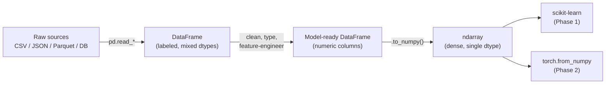
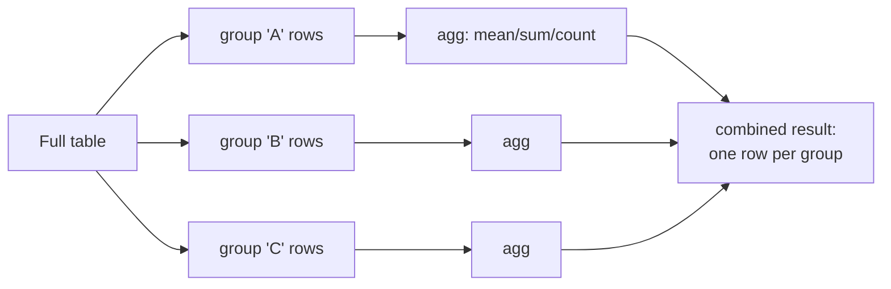
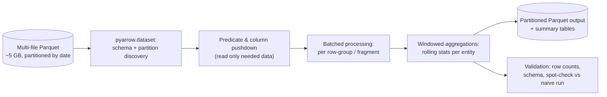

# 0.5 — NumPy & Pandas

> The two libraries you will touch every single day of your ML career. Master them before touching PyTorch.

---

## 1. Overview

**What are they?** **NumPy** provides fast, typed, N-dimensional arrays (`ndarray`) with vectorized math — "MATLAB in Python, but free and faster." **Pandas** builds labeled tabular data (`DataFrame`, `Series`) on top of NumPy — "SQL + Excel + a scripting language, in memory."

**Why do they exist?** Python `for` loops carry ~50–100 ns of interpreter overhead *per element* ([Python for AI](01-python-for-ai.md), Section 6) — roughly 100× slower than C. NumPy pushes numeric loops down into optimized C/Fortran (BLAS, LAPACK) so one Python call processes a whole array. Pandas adds what raw arrays lack: row/column labels, heterogeneous column types, missing-data handling, and relational operations (join, group-by).

**What problem do they solve?** Representing datasets efficiently (contiguous typed buffers instead of lists of Python objects), computing on them at native speed (vectorization: one line = a whole loop), and aligning data by labels (merge, groupby, resample — the bread and butter of data wrangling).

**Where are they used?** Every feature pipeline, every EDA notebook, every preprocessing step before a model, and inside virtually every scientific Python library. PyTorch, JAX, and TensorFlow deliberately copy NumPy's API — learning NumPy *is* learning tensors.

## 2. Learning Objectives

After this chapter you will be able to:

- Explain how an `ndarray` is laid out in memory (buffer + dtype + shape + strides) and why that makes it fast.
- Apply the broadcasting rules to predict result shapes without running code.
- Replace Python loops with vectorized expressions (arithmetic, reductions with `axis=`, `np.where`, fancy indexing).
- Distinguish views from copies and predict when a slice shares memory.
- Use `einsum` for explicit tensor contractions like batched matrix multiplication.
- Load, inspect, clean, and type a real dataset in Pandas (`read_csv/parquet`, `info`, `isna`, dtype management).
- Use `.loc`/`.iloc` correctly and avoid chained-assignment bugs.
- Perform split-apply-combine analytics: `groupby` with `agg`/`transform`, `merge` with all join types, `pivot_table`, rolling windows.
- Estimate the memory footprint of arrays and DataFrames and reduce it (dtypes, categoricals).
- Know when to leave Pandas (Polars, DuckDB, Dask, Spark) and how to bridge to modeling (`to_numpy()`).

## 3. Prerequisites

| Prerequisite | Link | Why |
|---|---|---|
| Python for AI | [01-python-for-ai.md](01-python-for-ai.md) | Comprehensions, slicing, and the "why loops are slow" story are assumed. |
| Linear Algebra | [02-linear-algebra.md](02-linear-algebra.md) | NumPy is executable linear algebra: `@`, norms, SVD, shapes. |
| Probability & Statistics | [04-probability-statistics.md](04-probability-statistics.md) | Sampling (`rng.normal`), means/variances, and aggregation semantics come from there. |

Forward references: every Phase 1 chapter (e.g., [Linear Regression](../phase-1-classical-ml/02-linear-regression.md), [Feature Engineering](../phase-1-classical-ml/15-feature-engineering.md)) manipulates data with these tools, and PyTorch tensors in [Phase 2](../phase-2-deep-learning/01-perceptron-mlp.md) behave like NumPy arrays with gradients.

## 4. Intuition

**NumPy: a warehouse of identical crates.** A Python list of floats is like a shelf of mixed parcels — each float is a full Python object (~24 bytes) with a pointer to it, so any operation must unwrap each parcel individually. A NumPy array is a single contiguous slab of raw numbers, all the same type, plus a small header (shape, dtype, strides) describing how to read the slab. Because the layout is regular, one C loop — or a SIMD instruction operating on 8 numbers at once — can sweep through the whole slab. "Vectorization" just means: describe the *whole* sweep in one Python call and let C do the per-element work.

**Broadcasting: the photocopier.** When you write `matrix + row`, NumPy behaves *as if* it photocopied the row down every line of the matrix — without actually allocating the copies. The rules for when this is legal are mechanical (Section 6) and worth learning cold, because they are also PyTorch's rules.

**Pandas: a spreadsheet that speaks SQL.** A DataFrame is a dict of columns (each a typed array) plus an index of row labels. An everyday story: you have an orders file and a customers file, and the boss asks for "average order value by signup month." In Excel you'd wrestle with VLOOKUP; in SQL you'd JOIN and GROUP BY; in Pandas it is `orders.merge(customers, on="customer_id").groupby("signup_month")["amount"].mean()` — one readable line that runs in seconds on millions of rows.

## 5. Real-world Motivation

- **The scientific-Python stack** — scikit-learn, SciPy, Matplotlib, statsmodels — is built directly on NumPy arrays; the first image of a black hole (Event Horizon Telescope, 2019) was processed with NumPy, as the *Nature* NumPy paper documents.
- **Meta's PyTorch and Google's JAX** intentionally mirror NumPy's API (`jax.numpy` is a drop-in namespace) — fluency here transfers one-to-one to deep learning.
- **Netflix, Airbnb, Uber, and Stripe** run large internal notebook platforms where day-to-day analytics and feature prototyping are overwhelmingly Pandas code; Pandas is the de facto interchange format for tabular data in Python.
- **AWS, GCP, and Azure** ML services accept and produce NumPy/Pandas structures in their Python SDKs; feature-store frameworks like Feast speak DataFrames.
- **Quant finance** (hedge funds, banks) has used NumPy/Pandas for years for time-series research — Pandas was originally written by Wes McKinney at the hedge fund AQR.

## 6. Mathematical Foundations

The heavy math lives in [Linear Algebra](02-linear-algebra.md); this chapter's "math" is a small set of exact mechanical rules.

**Memory model.** An array with shape $(d_0, d_1, \ldots, d_{k-1})$ and item size $s$ bytes stores element $(i_0, \ldots, i_{k-1})$ at byte offset

$$
\text{offset} = \sum_{a=0}^{k-1} i_a \cdot \text{stride}_a
$$

where $\text{stride}_a$ is the byte distance between consecutive elements along axis $a$ (for C-order: $\text{stride}_{k-1} = s$, $\text{stride}_a = d_{a+1}\cdot\text{stride}_{a+1}$). Transposing or slicing just rewrites shape/strides — **no data moves** — which is why those operations are free and why they return *views*.

**Broadcasting rules.** To combine arrays of shapes $S$ and $T$: align the shapes at the *trailing* end; for each aligned dimension the sizes must either be equal, or one of them must be 1 (that side is conceptually repeated); a missing leading dimension is treated as 1. The result shape takes the maximum size in each slot. Examples:

| A shape | B shape | Result | Why |
|---|---|---|---|
| (3, 4) | (4,) | (3, 4) | B treated as (1, 4), repeated over rows |
| (3, 1) | (1, 4) | (3, 4) | outer-product pattern |
| (8, 1, 6) | (7, 6) | (8, 7, 6) | B treated as (1, 7, 6) |
| (3, 4) | (3,) | **error** | trailing 4 vs 3: incompatible |

**Vectorization economics.** A vectorized op on $n$ elements costs $O(n)$ C-work plus $O(1)$ Python overhead; the loop version costs $O(n)$ C-work plus $O(n)$ Python overhead — same big-O, ~50–200× different constants.

**Relational algebra (Pandas).** `df[mask]` = selection $\sigma$; `df[cols]` = projection $\pi$; `merge` = join $\bowtie$; `groupby().agg()` = grouping with aggregation $\gamma$. A group-by mean computes, for each group $g$: $\bar{x}_g = \frac{1}{|g|}\sum_{i \in g} x_i$ — the sample mean from [Probability & Statistics](04-probability-statistics.md), computed per key.

**Symbols**: $d_a$ — size of axis $a$; $s$ — bytes per element (`dtype.itemsize`); $\text{stride}_a$ — byte step along axis $a$; $n, m$ — row counts; $\sigma, \pi, \bowtie, \gamma$ — relational selection, projection, join, aggregation.

## 7. Visual Explanation

The standard data path from raw files to models:



Broadcasting `(3,4) + (4,)` — the row is virtually stamped down the matrix:

```
  A (3,4)            b (4,)          A + b (3,4)
[ 0 1 2 3 ]      [10 20 30 40]    [10 21 32 43]
[ 4 5 6 7 ]  +   (reused row) =   [14 25 36 47]
[ 8 9 10 11]     (reused row)     [18 29 40 51]
```

Split-apply-combine, the mental model behind every `groupby`:



## 8. Algorithm

The canonical **tabular data workflow** — you will run this loop hundreds of times:

1. **Load** with explicit types: `pd.read_csv(path, parse_dates=[...], dtype={...})` or `pd.read_parquet`.
2. **Inspect**: `df.head()`, `df.info()` (dtypes + memory), `df.describe()`, `df.isna().sum()`.
3. **Clean**: cast wrong dtypes, choose a missing-value strategy per column (drop / impute / flag), deduplicate.
4. **Transform**: derived columns, encodings, `groupby` aggregations, joins to reference tables.
5. **Validate**: row counts before vs after joins, ranges, uniqueness of keys — assert them.
6. **Hand off**: `X = df[feature_cols].to_numpy()`, or persist to Parquet.

And the inner algorithm of a hash **group-by aggregation**, so it never feels like magic:

```text
function GROUPBY_MEAN(keys[n], values[n]):
    sums = empty hash map        # key -> running sum
    counts = empty hash map      # key -> running count
    for i in 0..n-1:                     # one pass, O(n)
        sums[keys[i]]   += values[i]
        counts[keys[i]] += 1
    return { k: sums[k] / counts[k] for k in sums }
```

`merge` is analogous: build a hash table on the smaller table's key column, then probe it with the larger table — O(n + m) expected.

## 9. Worked Example

**Tiny example by hand — broadcasting.** Let `a = [[1, 2, 3], [4, 5, 6]]` (shape (2,3)) and `b = [10, 20, 30]` (shape (3,)). Align trailing dims: 3 vs 3 ✓; `b` gains a leading 1 → (1,3), repeats over the 2 rows. Result: `[[11, 22, 33], [14, 25, 36]]`. Now `a + [10, 20]` (shape (2,)): trailing 3 vs 2 ✗ — error. To add per-*row* offsets you must reshape to a column: `a + [[10], [20]]` (shape (2,1)) → `[[11, 12, 13], [24, 25, 26]]`.

**Group-by by hand.** Keys `[A, B, A, B]`, values `[10, 20, 30, 40]`: running sums A→40, B→60; counts A→2, B→2; means **A = 20, B = 30**. That's all `groupby("k")["v"].mean()` does, at C speed.

**Realistic example** — monthly revenue and order counts per region from a raw sales table:

```python
import pandas as pd

sales = pd.read_parquet("sales.parquet")     # columns: date, region, order_id, amount

monthly = (
    sales
      .assign(month=lambda d: d["date"].dt.to_period("M"))   # derive a month column
      .groupby(["month", "region"], as_index=False)          # split by two keys
      .agg(revenue=("amount", "sum"),                        # named aggregations
           orders=("order_id", "nunique"))
      .sort_values(["region", "month"])
)
```

Input: one row per order line. Output: one row per (month, region) with two metrics — ready to plot or join back. The `assign(lambda ...)` style keeps the pipeline a single readable expression.

## 10. Python from Scratch

To demystify the `ndarray`, build a miniature one on plain lists — shape inference, flattening, elementwise add, and a taste of broadcasting:

```python
class Array:
    """A toy ndarray: nested lists + shape bookkeeping. Educational only."""
    def __init__(self, data):
        self.data = data
        self.shape = self._shape(data)

    @staticmethod
    def _shape(d):
        s = []
        while isinstance(d, list):     # descend nested lists
            s.append(len(d))
            d = d[0] if d else 0
        return tuple(s)

    def flatten(self):
        def go(d):
            if isinstance(d, list):
                for v in d:
                    yield from go(v)   # recursive generator (Chapter 0.1 idiom)
            else:
                yield d
        return list(go(self.data))

    def __add__(self, other):
        # exact-shape add, plus scalar 'broadcasting'
        if isinstance(other, (int, float)):
            flat = [a + other for a in self.flatten()]
        else:
            assert self.shape == other.shape, "toy version: shapes must match"
            flat = [a + b for a, b in zip(self.flatten(), other.flatten())]
        return self._reshape(flat, self.shape)

    @classmethod
    def _reshape(cls, flat, shape):
        # rebuild nested lists from a flat list, right-to-left
        for dim in reversed(shape[1:]):
            flat = [flat[i:i + dim] for i in range(0, len(flat), dim)]
        return cls(flat)

a = Array([[1, 2, 3], [4, 5, 6]])
print(a.shape)              # (2, 3)
print((a + 10).data)        # [[11, 12, 13], [14, 15, 16]]
```

And `groupby.mean` from scratch (Section 8's pseudocode made real):

```python
def groupby_mean(keys, values):
    sums, counts = {}, {}
    for k, v in zip(keys, values):          # single O(n) pass
        sums[k] = sums.get(k, 0.0) + v
        counts[k] = counts.get(k, 0) + 1
    return {k: sums[k] / counts[k] for k in sums}

print(groupby_mean(["A", "B", "A", "B"], [10, 20, 30, 40]))  # {'A': 20.0, 'B': 30.0}
```

Expected outputs shown inline. Common bug in the reshape helper: iterating `shape[1:]` forward instead of reversed, which scrambles the nesting for 3-D+ shapes. These toys are 100× slower than the real thing — the point is that nothing NumPy/Pandas does is conceptually mysterious.

## 11. Library Implementation

**NumPy essentials** — every line annotated with its result shape:

```python
import numpy as np

a = np.arange(12).reshape(3, 4)          # (3,4): 0..11 row-major
a.T                                      # (4,3): view, no copy (strides swapped)
a[:, ::2]                                # (3,2): every other column — also a view
a.sum(axis=0)                            # (4,): column sums (axis 0 collapses rows)
a.mean(axis=1, keepdims=True)            # (3,1): row means; keepdims -> broadcastable
np.where(a > 5, a, 0)                    # (3,4): elementwise if/else
a[a % 3 == 0]                            # (4,): boolean mask -> COPY of matches
np.linalg.norm(a, axis=1)                # (3,): L2 norm of each row (Chapter 0.2)

rng = np.random.default_rng(42)          # seeded generator (reproducibility)
X = rng.normal(size=(1000, 5))           # (1000,5) standard normals (Chapter 0.4)
Xn = (X - X.mean(axis=0)) / X.std(axis=0)  # standardize: (1000,5)-(5,) broadcasts

B = rng.normal(size=(8, 3, 4))           # batch of 8 (3,4) matrices
C = rng.normal(size=(8, 4, 2))
np.einsum("bij,bjk->bik", B, C)          # (8,3,2): batched matmul, explicit indices
```

**Pandas essentials**:

```python
import pandas as pd

df = pd.read_csv("data.csv", parse_dates=["ts"],
                 dtype={"region": "category"})        # types fixed at load time
df.loc[df["spend"] > 100, ["user_id", "spend"]]       # label-based row+col selection
df["age_bucket"] = pd.cut(df["age"], bins=[0, 18, 35, 60, 120])   # binning
df.groupby("age_bucket", observed=True)["spend"].agg(["mean", "std", "count"])
df["pct_of_region"] = df["spend"] / df.groupby("region")["spend"].transform("sum")
df.merge(users, on="user_id", how="left", validate="many_to_one")  # checked join
df.pivot_table(index="region", columns="month", values="revenue", aggfunc="sum")
df.sort_values("ts").rolling("7D", on="ts")["value"].mean()        # time window
```

Note `transform` vs `agg`: `agg` returns one row per group; `transform` broadcasts the group statistic back to every original row — indispensable for "share of group" features. `validate="many_to_one"` turns a silent join-explosion bug into a loud error.

## 12. Code Walkthrough

Tracing the standardization + batched-matmul block:

| Tensor | Shape | Meaning |
|---|---|---|
| `X` | (1000, 5) | 1000 samples, 5 features |
| `X.mean(axis=0)` | (5,) | per-feature means (axis 0 collapsed) |
| `X - X.mean(axis=0)` | (1000, 5) | broadcasting: (5,) → (1, 5) → repeated 1000× |
| `Xn` | (1000, 5) | each column ≈ mean 0, std 1 — verify with `Xn.mean(axis=0)` ≈ 0 |
| `B`, `C` | (8, 3, 4), (8, 4, 2) | batch of matrix pairs |
| `einsum("bij,bjk->bik", B, C)` | (8, 3, 2) | for each batch b: (3,4)@(4,2); j is summed |

And the join in Section 11: inputs `df` (n rows, key `user_id` repeated) and `users` (one row per user); output has *exactly n rows* under `how="left"` with `many_to_one` — if `users` accidentally had duplicate IDs, rows would multiply, which `validate=` catches. Expected result check: `len(merged) == len(df)` and `merged["signup_date"].isna().sum()` equals the count of unknown users.

> [!NOTE]
> The single most useful habit from this chapter: before running any array/DataFrame expression, *say the output shape out loud*. If you can't, you don't understand the line yet.

## 13. Complexity Analysis

| Operation | Time | Reasoning |
|---|---|---|
| Elementwise op on n elements | O(n) in C | one pass; ~50–200× faster than a Python loop of the same O(n) |
| Reduction (`sum`, `mean` with `axis=`) | O(n) | one pass; SIMD-accelerated |
| Boolean-mask selection | O(n) | scan + copy of matches |
| Sort / `sort_values` | O(n log n) | comparison sort |
| `groupby().agg()` | O(n) expected | hash grouping (Section 8); O(n log n) if sort-based |
| `merge` (hash join) | O(n + m) expected | build hash on one side, probe with the other |
| Slice / transpose / reshape (compatible) | O(1) | metadata-only: new strides, same buffer |

Space: an array costs `n × dtype.itemsize` bytes — a (1M, 10) float64 array is 80 MB, and switching to float32 halves it. DataFrames add index overhead, and `object`-dtype string columns store *Python objects* (pointer + full object each, easily 60+ bytes per short string) — the #1 cause of Pandas memory blowups; `category` or Arrow-backed string dtypes fix it. Watch hidden copies: fancy indexing, `astype`, and most Pandas ops allocate; peak memory during a pipeline can be 2–3× the resident data.

## 14. Advantages

- **Speed without leaving Python.** Vectorized grayscale conversion of a 12-MP image (`rgb @ weights`) runs in ~10 ms; the triple-nested Python loop takes ~30 s.
- **One API for the whole ecosystem.** The `X` you build here feeds scikit-learn directly and becomes a PyTorch tensor via `torch.from_numpy(X)` — zero-copy for compatible dtypes.
- **Expressiveness.** Section 9's monthly-revenue pipeline is six readable lines; the equivalent dict-and-loop code is ~40 lines with more bugs.
- **Label alignment prevents silent errors.** Adding two Series aligns on index automatically — misordered rows don't corrupt arithmetic the way parallel lists do.
- **Interoperability with the data world.** Parquet/Arrow, SQL (`read_sql`), Excel, JSON — Pandas reads and writes all of them, making it the universal adapter of data engineering.

## 15. Disadvantages

- **Memory hunger.** Pandas can transiently need several× the dataset size; `object` columns are worst. A 5 GB CSV can OOM a 16 GB machine at load time. Failure case: `pd.read_csv` on a big file with no `dtype`/`usecols` hints.
- **Eager, single-threaded core.** Every intermediate materializes; most Pandas ops use one core. No query optimizer reorders your pipeline (Polars and DuckDB do — use them at scale).
- **API sharp edges.** `.loc` vs `.iloc`, view-vs-copy ambiguity behind `SettingWithCopyWarning`, `NaN` (float) vs `None` (object) vs `pd.NA` — real bug sources, not cosmetic ones.
- **Dtype surprises.** An integer column with one missing value silently becomes float64 (classically), and ID columns read as int lose leading zeros.
- **Wrong tool past ~RAM-scale or in hot serving paths.** Sub-millisecond per-request feature computation should be precomputed or done in a compiled path, not by calling Pandas per request.

## 16. Common Mistakes

- **Iterating with `df.iterrows()`** — 10–1000× slower than vectorized ops, and it yields copies (mutations don't stick). Rewrite as column arithmetic, `where`, or `groupby`.
- **Chained assignment**: `df[df.a > 0]["b"] = 1` writes into a possibly-temporary object and silently does nothing. Always `df.loc[df.a > 0, "b"] = 1`.
- **Assuming a slice is independent** — NumPy basic slices are *views*: `b = a[:10]; b[:] = 0` mutates `a`. Call `.copy()` when you need isolation.
- **Using `apply` when a vectorized op exists** — `df["x"].apply(lambda v: v * 2)` is a Python loop in disguise; `df["x"] * 2` is not.
- **Not setting `dtype`/`usecols`/`parse_dates` when reading big CSVs** — Pandas guesses types by sampling, guesses wrong, and wastes memory.
- **Confusing `NaN` with `None`** — and testing with `x == np.nan`, which is *always False* (NaN ≠ NaN). Use `pd.isna(x)`.
- **Joining on unvalidated keys** — duplicate keys multiply rows; always check row counts or pass `validate=`.
- **Mixing up `axis=0` and `axis=1`** — remember: the axis you pass is the one that *collapses* (`sum(axis=0)` sums down the rows, leaving one value per column).

## 17. Best Practices

- [ ] Fix dtypes at load time (`dtype=`, `parse_dates=`, `usecols=`); check `df.info(memory_usage="deep")` immediately.
- [ ] Use `category` dtype for low-cardinality strings (region, status) — often a 10–50× memory cut.
- [ ] Write pipelines as method chains with `.assign()` and one operation per line — diff-able, comment-able, no intermediate-variable soup.
- [ ] Always use `.loc`/`.iloc` for assignment; treat `SettingWithCopyWarning` as an error, not noise.
- [ ] Validate every merge (`validate=`, row-count asserts) and every groupby (spot-check one group by hand, as in Section 9).
- [ ] Store intermediates as Parquet, never CSV (typed, compressed, ~10× faster round-trip).
- [ ] Seed `np.random.default_rng(seed)` and prefer it over the legacy `np.random.*` global state.
- [ ] Keep a strict boundary: Pandas for wrangling, NumPy arrays for math, and convert once (`to_numpy()`), not back-and-forth per row.

## 18. Optimization Techniques

- **Vectorize first** — it is the 80% solution; eliminate `iterrows`/`apply` before anything else.
- **Shrink dtypes**: float64→float32, int64→int32/int16, strings→`category`; `df.astype(...)` after inspecting real value ranges. Memory bandwidth is the bottleneck, so smaller = faster too.
- **Chunk streaming reads**: `pd.read_csv(..., chunksize=1_000_000)` yields DataFrames you aggregate incrementally — bounded memory for unbounded files.
- **Push work to Parquet/Arrow**: column pruning and predicate pushdown via `pd.read_parquet(columns=...)` / `pyarrow.dataset` filters mean you never load what you don't need.
- **Use `np.einsum` / `@` for tensor math** instead of reshape-multiply-sum gymnastics — clearer *and* lets the library pick an optimal contraction order.
- **Escape hatches for heavy lifting**: `numexpr` for big elementwise expressions, `numba` for genuinely irreducible loops, **Polars/DuckDB** for larger-than-comfortable data (both read the same Parquet files, so switching costs are low).
- **Profile before optimizing** — `%timeit` per candidate line, `df.memory_usage(deep=True)` for space; the habits from [Python for AI](01-python-for-ai.md) apply unchanged.

## 19. Industry Applications

- **Feature engineering for production ML**: feature-store frameworks (Feast; Tecton) and countless in-house pipelines define features as Pandas/NumPy transformations before they're productionized.
- **Orchestrated batch jobs**: Airflow (Airbnb-born) and Prefect tasks are very often "read Parquet → Pandas transform → write Parquet."
- **Notebook analytics at scale**: Netflix, Uber, and Stripe engineers analyze experiments and business metrics in Pandas notebooks daily; Netflix's Metaflow passes DataFrames between pipeline steps.
- **Scientific computing**: NASA/JPL, CERN, and the Event Horizon Telescope collaboration process instrument data with NumPy/SciPy.
- **Quant research**: Pandas originated at AQR Capital for time-series research; rolling windows, resampling, and joins remain the daily toolkit across quant finance.
- **Deep-learning data prep**: batching, normalization, and augmentation pipelines feeding PyTorch (Meta) and JAX (Google) start as NumPy arrays.

## 20. Interview Questions

### Beginner

- **Q: What is broadcasting? Give an example.**
  A: NumPy's rule set for combining different-shaped arrays without copying: align trailing dimensions; each pair must be equal or contain a 1. Example: `(1000, 5) - (5,)` subtracts per-column means from every row (Section 12's table).
- **Q: `.loc` vs `.iloc`?**
  A: `.loc` selects by *labels* (index values, column names; slices are inclusive of the endpoint); `.iloc` selects by *integer positions* (Python slice semantics, endpoint exclusive).
- **Q: Why is a NumPy array faster than a Python list for math?**
  A: Contiguous typed memory → one C loop with SIMD and cache-friendly access, versus per-element Python object unboxing and interpreter dispatch (~100× overhead).
- **Q: What does `axis=0` mean in `df.sum(axis=0)`?**
  A: The axis that gets *collapsed* — axis 0 is rows, so you sum down each column and get one value per column.
- **Q: How do you count missing values per column?**
  A: `df.isna().sum()` — the boolean frame's column sums. Note `x == np.nan` never works; NaN compares unequal to itself.

### Intermediate

- **Q: View vs copy in NumPy — how do you know which you got?**
  A: Basic slicing (`a[1:5]`, `a.T`, `reshape` when possible) returns views sharing the buffer (check `arr.base is not None`); fancy indexing and boolean masks return copies. Mutating a view mutates the original — a frequent hidden bug.
- **Q: Explain `SettingWithCopyWarning` and the correct pattern.**
  A: It fires when you assign through a chained selection (`df[cond]["col"] = v`) whose first step may be a copy, so the write may vanish. Correct: a single indexer, `df.loc[cond, "col"] = v`.
- **Q: `groupby().agg()` vs `groupby().transform()`?**
  A: `agg` reduces each group to one row (result length = number of groups); `transform` computes a group statistic and broadcasts it back to the original rows (result length = original length) — e.g., each row's share of its region's total (Section 11).
- **Q: Explain merge join types.**
  A: `inner` keeps keys present in both; `left`/`right` keep all keys of one side, filling the other with NaN; `outer` keeps the union. With duplicate keys the result is the per-key Cartesian product — validate with `validate="one_to_one"` etc.
- **Q: Why is an `object`-dtype column slow and large, and what do you do about it?**
  A: It stores pointers to individual Python objects — no vectorization, poor cache behavior, ~10× memory. Convert to `category` (low cardinality), numeric, datetime, or Arrow-backed string dtype.

### Advanced

- **Q: What is `np.einsum` and how would you write a batched matmul with attention-style scaling?**
  A: Einstein-summation notation: name each axis, repeat an index to contract it. Batched matmul: `np.einsum("bij,bjk->bik", A, B)`; attention scores: `np.einsum("bqd,bkd->bqk", Q, K) / np.sqrt(d)` — the exact contraction in [Attention](../phase-2-deep-learning/09-attention.md).
- **Q: How do strides explain why transpose is free but `.flatten()` on the transpose is not?**
  A: `a.T` only swaps shape/stride metadata — O(1), same buffer. Flattening the transpose requires C-contiguous output, so elements must physically be gathered in a new order — an O(n) copy.
- **Q: Dataset is 3× your RAM. Options, in order?**
  A: (1) Load less: `usecols`, dtypes, Parquet column/row-group pruning; (2) stream: `chunksize` aggregation; (3) switch engines: DuckDB or Polars (lazy, out-of-core-friendly) over the same Parquet; (4) go distributed (Dask/Spark) only if a single machine truly can't hold the *working set*.
- **Q: Why can integer columns turn into floats after a join, and what problems follow?**
  A: A left join introduces missing values, and classic NumPy-backed int64 has no NaN, so Pandas upcasts to float64 — IDs lose exactness past 2⁵³ and `== 5` comparisons can miss `5.0` edge cases. Fix: nullable dtypes (`Int64`) or fill before casting back.
- **Q: A groupby over 100M rows is slow. Diagnose and speed it up.**
  A: Check dtypes first (`object` keys → convert to `category`/int, often 10×); ensure the aggregation is a built-in (`"mean"`, not a Python lambda — lambdas fall back to per-group Python calls); consider sorting by key for cache locality, or hand the same Parquet to DuckDB/Polars for a multi-threaded engine.

## 21. Coding Exercises

### Easy

1. Given a `(n, 3)` array of RGB pixels, convert to grayscale via $0.299R + 0.587G + 0.114B$ with no loop. *Hint: `rgb @ np.array([0.299, 0.587, 0.114])` — a matmul from [Linear Algebra](02-linear-algebra.md).*
2. Standardize each column of a random `(1000, 5)` matrix and verify means ≈ 0, stds ≈ 1. *Hint: Section 11; broadcasting does the work.*
3. Implement one-hot encoding of an integer label vector without any library helper. *Hint: `np.eye(num_classes)[labels]` — fancy indexing.*

### Medium

1. In Pandas, compute a 30-day rolling median of returns per ticker from a long-format price table. *Hint: `groupby("ticker")` then `rolling("30D", on="date")`; sort first.*
2. Given transactions with `user_id` and `ts`, compute the fraction of *new* users per week (first-ever transaction that week). *Hint: `groupby("user_id")["ts"].transform("min")`, compare to the week, then a weekly `mean`.*
3. Implement `groupby_mean` on NumPy arrays without dicts, using `np.unique(keys, return_inverse=True)` and `np.bincount`. *Hint: `np.bincount(inv, weights=values) / np.bincount(inv)`.*

### Hard

1. Deduplicate near-duplicate rows of a `(n, d)` feature matrix using vectorized cosine similarity with threshold 0.99. *Hint: normalize rows, one matmul for all pairs ([Linear Algebra](02-linear-algebra.md), Section 11), then an upper-triangle mask; watch O(n²) memory.*
2. Reproduce `df.pivot_table(index=i, columns=c, values=v, aggfunc="mean")` using only `groupby` + `unstack`, and prove equality with `pd.testing.assert_frame_equal`. *Hint: `groupby([i, c])[v].mean().unstack(c)`.*
3. Process a larger-than-RAM CSV (synthesize 10⁸ rows) with `chunksize`, computing exact per-key means in one pass with bounded memory; verify against Pandas on a small sample. *Hint: accumulate `(sum, count)` per key across chunks — Section 8's algorithm, streamed.*

## 22. Mini Project

**Titanic EDA notebook** (NumPy + Pandas + Matplotlib only).

1. Load the Titanic CSV (Kaggle); run the Section 8 inspection ritual and record findings (dtypes, missingness in `Age`, `Cabin`, `Embarked`).
2. Clean: impute `Age` with the median *per (Sex, Pclass) group* using `groupby().transform("median")`; make `Sex`/`Embarked` categoricals; engineer `FamilySize = SibSp + Parch + 1` and extract `Title` from names.
3. Compute survival rates by sex, class, age bucket (`pd.cut`), and family size — each a one-line groupby.
4. Produce 6 informative plots: survival by sex/class (bar), age distributions by outcome (hist), fare by class (box), a correlation heatmap (`imshow` of `df.corr()`), family size vs survival, and missing-data pattern.
5. Export the cleaned feature table to Parquet, then `to_numpy()` — it will be your input for [Phase 1](../phase-1-classical-ml/01-ml-fundamentals.md) classifiers.

## 23. Medium Project

**E-commerce cohort retention analysis**, fully vectorized.

1. Get (or synthesize) an order log: `user_id, order_ts, amount` for ~1M orders across 18 months.
2. Assign each user an acquisition cohort: `cohort = groupby("user_id")["order_ts"].transform("min")` truncated to week.
3. For each order, compute weeks-since-acquisition; build the cohort × week retention matrix with a `groupby(["cohort", "week_offset"])["user_id"].nunique()` + `unstack`, then divide each row by its week-0 value (broadcasting a column — Section 9's `(2,1)` pattern).
4. Render as a heatmap; annotate the diagonal fade that signals decaying retention.
5. Compute average cumulative revenue per user (LTV curve) per cohort with `groupby` + `cumsum`, and compare early vs late cohorts.
6. Constraint: zero Python loops over rows — every step must be a vectorized operation; `%timeit` the pipeline end-to-end.

## 24. Advanced Project

**5-GB Parquet ETL pipeline, engineered for speed.**

Architecture:



Implementation phases:

1. **Generate** a realistic 5-GB dataset: e.g., sensor or clickstream events (`entity_id, ts, value, attrs`), written as date-partitioned Parquet with sensible row-group sizes.
2. **Naive baseline**: load-everything Pandas pipeline computing per-entity 7-day rolling statistics and daily aggregates; record wall time and peak memory (`/usr/bin/time -v` or `tracemalloc`).
3. **Optimized pipeline**: `pyarrow.dataset` scanning with column pruning and partition filters; process per-fragment with categorical dtypes and float32; maintain cross-chunk window state at fragment boundaries (the streamed groupby of Section 21 Hard-3, extended to windows).
4. **Write** partitioned output Parquet; validate against the naive run on a sampled subset (`pd.testing.assert_frame_equal` with tolerances).
5. **Benchmark report**: target ≥5× faster and ≤¼ peak memory vs baseline; table of what each optimization contributed.

Possible improvements: swap the transform layer to Polars lazy frames or DuckDB SQL and compare; parallelize fragments with `concurrent.futures`; add an incremental mode that processes only new partitions (the seed of a production feature pipeline — see [Phase 5 MLOps](../phase-5-mlops/)).

## 25. Summary

- NumPy = typed contiguous buffers + shape/stride metadata; that layout is *why* it's fast and why slices are free views.
- Vectorization moves the per-element loop from the interpreter into C — same big-O, ~100× smaller constants; it is the default, not an optimization.
- Broadcasting rules (align trailing dims; equal or 1) let you combine shapes without copies — learn to predict result shapes before running.
- Views share memory (basic slices, transpose); fancy/boolean indexing copies — know which you're holding before mutating.
- Pandas = labeled columns over NumPy + relational algebra: filter, project, `merge`, `groupby`, pivot, rolling.
- `agg` collapses groups; `transform` broadcasts group stats back to rows — the split-apply-combine pattern powers most feature engineering.
- Fix dtypes at load; use `category` for low-cardinality strings; store intermediates in Parquet.
- `.loc` for label assignment, never chained indexing; validate merges; `pd.isna` not `== np.nan`.
- Memory is the usual constraint: shrink dtypes, chunk, prune columns — and switch to Polars/DuckDB/Dask beyond RAM scale.
- The NumPy API is the tensor lingua franca: everything here transfers directly to PyTorch in [Phase 2](../phase-2-deep-learning/01-perceptron-mlp.md).

## 26. Cheat Sheet

| Task | One-liner |
|---|---|
| column means | `X.mean(axis=0)` (axis passed = axis collapsed) |
| standardize | `(X - X.mean(0)) / X.std(0)` |
| conditional | `np.where(cond, a, b)` |
| top-k | `np.argpartition(x, -k)[-k:]` |
| batched matmul | `np.einsum("bij,bjk->bik", A, B)` |
| typed load | `pd.read_csv(p, dtype=..., parse_dates=[...], usecols=[...])` |
| safe assign | `df.loc[mask, "col"] = v` |
| group stats | `df.groupby(k)["v"].agg(["mean","count"])` |
| group share | `df["v"] / df.groupby(k)["v"].transform("sum")` |
| checked join | `df.merge(other, on=k, how="left", validate="many_to_one")` |
| time window | `df.sort_values(t).rolling("7D", on=t)["v"].mean()` |

Defaults: `np.random.default_rng(42)`; Parquet over CSV; `category` for repeated strings; float32 when precision allows. Gotchas: views mutate the parent; `iterrows`/`apply` are slow-paths; NaN ≠ NaN; int + NaN → float; chained assignment silently no-ops; duplicate join keys multiply rows.

## 27. Further Reading

- **Books**: *Python for Data Analysis*, 3rd ed. (Wes McKinney — the Pandas creator; free at wesmckinney.com/book); *Effective Pandas* (Matt Harrison); *Elegant SciPy* (Nunez-Iglesias et al.).
- **Research Papers**: "Array programming with NumPy" (Harris et al., *Nature*, 2020); "pandas: a Foundational Python Library for Data Analysis and Statistics" (McKinney, 2011); "Apache Arrow"-related design docs for the columnar format underpinning modern Parquet I/O.
- **Documentation**: NumPy user guide (broadcasting and indexing chapters especially); Pandas user guide ("MultiIndex", "GroupBy", "Merge, join, concatenate"); PyArrow `dataset` docs.
- **GitHub Repositories**: `numpy/numpy`; `pandas-dev/pandas`; `rougier/numpy-100` (100 NumPy exercises); `pola-rs/polars` and `duckdb/duckdb` (the scale-up escape hatches).
- **Datasets**: Titanic (Kaggle); NYC Taxi trips (large-scale Parquet practice); MovieLens; the UCI repository for tabular variety.
- **YouTube/Videos**: Wes McKinney conference talks on Pandas and Arrow; Jake VanderPlas, "Losing your Loops: Fast Numerical Computing with NumPy" (PyCon 2015); Matt Harrison's "Effective Pandas" talks.
- **Blogs**: the official Pandas blog on Copy-on-Write; Jake VanderPlas's *Python Data Science Handbook* (free online); DuckDB blog posts on larger-than-memory analytics.
