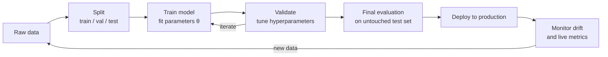
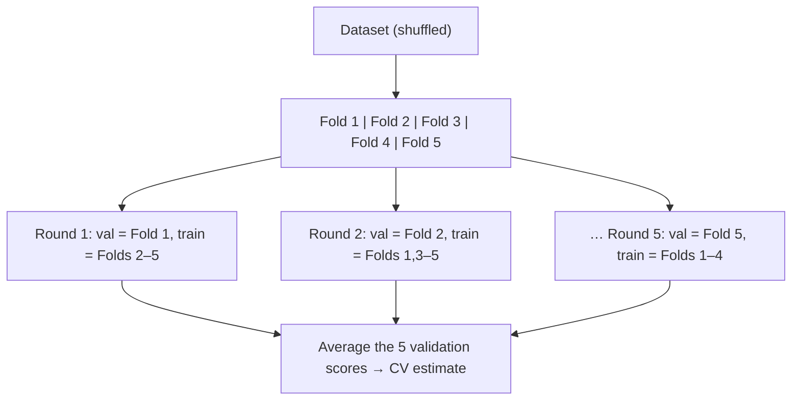
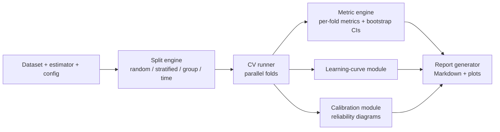

# 1.1 — Machine Learning Fundamentals

> Before you learn any algorithm, learn the **framework** every algorithm plugs into: risk, bias-variance, generalization, data splitting, cross-validation, and leakage. Everything else in this roadmap is a special case of the ideas in this chapter.

---

## 1. Overview

**What is it?** Machine learning (ML) is the discipline of *learning a function from data*. Given example pairs $(x_i, y_i)$, we search a family of candidate functions for one, $f_\theta$, that maps inputs $x$ to outputs $y$ well — not on the examples we have already seen, but on **new, unseen data**. That last clause is the entire subject. Memorizing training data is trivial (a lookup table does it perfectly); predicting new data is hard, and the theory of when and why it is possible is called **generalization theory**.

**Why does it exist?** Programmers used to hand-write rules. But for tasks like "is this image a cat?", "is this email spam?", or "what word comes next?", nobody can articulate all the rules. ML replaces rule-writing with rule-*learning* from labeled examples, and it is the only known approach that scales for perception, language, and messy real-world data.

**What problem does it solve?** It automates tasks whose rules we cannot write down, it improves automatically as data grows, and — when done correctly — it generalizes to inputs no one has ever seen.

**Where is it used?** Everywhere: search ranking, recommendation, fraud detection, spam filtering, medical diagnosis, autonomous driving, and every large language model you have ever talked to. Every one of those systems is built on the concepts in this chapter: a loss function, an empirical-risk minimizer, a validation protocol, and a test set that someone (hopefully) touched only once.

## 2. Learning Objectives

After this chapter you will be able to:

- Define **risk** and **empirical risk**, and explain why we can only minimize the latter.
- State and interpret the **bias-variance decomposition** for squared error, defining every term.
- Explain the **generalization gap** and how model complexity and dataset size affect it.
- Design a correct **train / validation / test** split and articulate the role of each subset.
- Implement and use **k-fold cross-validation**, including stratified and grouped variants.
- Recognize and prevent **data leakage** in at least five distinct forms.
- Choose an appropriate splitting strategy for i.i.d., grouped, imbalanced, and time-series data.
- Diagnose whether a model suffers from **underfitting (high bias)** or **overfitting (high variance)** from learning curves.
- Build a sensible **baseline** for any prediction problem and explain why baselines matter.
- Describe the full ML workflow from problem framing to production monitoring.

## 3. Prerequisites

| Chapter | Why you need it |
|---|---|
| [Python for AI](../phase-0-prerequisites/01-python-for-ai.md) | All code in this chapter is Python; you need functions, list comprehensions, and generators. |
| [Linear Algebra](../phase-0-prerequisites/02-linear-algebra.md) | Feature vectors and datasets are vectors and matrices. |
| [Calculus](../phase-0-prerequisites/03-calculus.md) | Losses are functions we minimize; expectations of functions appear throughout. |
| [Probability & Statistics](../phase-0-prerequisites/04-probability-statistics.md) | Risk is an expectation; bias and variance are statistical moments; sampling drives every split. |
| [NumPy & Pandas](../phase-0-prerequisites/05-numpy-pandas.md) | We manipulate datasets as arrays and dataframes. |

## 4. Intuition

Imagine you are studying for an exam using a stack of past papers. You have two possible strategies:

1. **Memorize** every past question and its answer word-for-word.
2. **Understand** the underlying patterns so you can answer questions you have never seen.

Strategy 1 gives you a perfect score on the past papers and a disastrous score on the real exam. Strategy 2 might make small mistakes on the past papers but performs well on exam day. Machine learning models face exactly this choice, and *overfitting* is the technical name for strategy 1.

Here is the everyday story that motivates data splitting. Suppose a friend claims they can predict horse races. They show you a notebook of 500 past races where their "system" got 95% right. Should you bet your savings? Not yet — you don't know whether they wrote the predictions *before* or *after* the races. The only fair test is to have them predict *future* races they have never seen. In ML, the **test set** plays the role of those future races: data the model has genuinely never touched, used exactly once, at the very end.

One more analogy for bias and variance: think of an archer.

- **High bias** = a systematic aim error. Every arrow lands to the left of the bullseye. The archer is consistently wrong (an underfit model, e.g., fitting a straight line to a curve).
- **High variance** = a shaky hand. The arrows scatter widely around the target; where each arrow lands depends heavily on tiny random factors (an overfit model whose predictions change wildly if you re-collect the training data).
- A great archer has both low bias and low variance — and in ML, there is usually a *trade-off* between the two that you tune with model complexity and regularization.

## 5. Real-world Motivation

Rigorous evaluation is *the* differentiator between amateur and professional ML teams, and large companies invest heavily in it:

- **Netflix** predicts whether you will watch a title; its famous Netflix Prize competition (2006–2009) was decided by held-out test-set RMSE, and improper validation methodology sank many competitors.
- **Google** ranks search results and filters Gmail spam with models that are continuously evaluated on held-out and live traffic (A/B experiments) before any launch.
- **Meta** evaluates feed-ranking models offline on held-out data, then in online experiments, precisely because offline metrics computed with leakage do not transfer to production.
- **Stripe** and other payment companies build fraud models where a leaked feature (e.g., a chargeback flag that only exists *after* fraud is confirmed) produces a model that looks perfect offline and useless in production.
- **Tesla** validates driving models on geographically and temporally held-out fleets, because a model that memorizes one city's roads must still generalize to another.

In every case the pattern is the same: the business value comes from performance on *future* data, so evaluation must simulate the future honestly.

## 6. Mathematical Foundations

### 6.1 The supervised learning problem

Assume each example is drawn independently from an unknown joint distribution: $(x, y) \sim \mathcal{D}$, where $x \in \mathcal{X}$ is the input (e.g., a feature vector in $\mathbb{R}^d$) and $y \in \mathcal{Y}$ is the target (a real number for regression, a class label for classification). We choose a **loss function** $\ell(\hat y, y)$ that measures how bad it is to predict $\hat y$ when the truth is $y$ (e.g., squared error $(\hat y - y)^2$).

The **risk** (also called *true risk* or *expected risk*) of a hypothesis $f$ is its average loss over the whole distribution:

$$
R(f) = \mathbb{E}_{(x, y)\sim\mathcal{D}} \big[\ell(f(x), y)\big]
$$

where $\mathbb{E}$ denotes the expectation. We cannot compute $R(f)$ because $\mathcal{D}$ is unknown — we only have a finite sample. So we minimize the **empirical risk** on a training set $\{(x_i, y_i)\}_{i=1}^n$ of $n$ i.i.d. samples:

$$
\hat R(f) = \frac{1}{n}\sum_{i=1}^n \ell(f(x_i), y_i)
$$

Choosing $f$ from a hypothesis class $\mathcal{F}$ to minimize $\hat R$ is called **empirical risk minimization (ERM)**. By the law of large numbers, $\hat R(f) \to R(f)$ for a *fixed* $f$ as $n \to \infty$ — but the $f$ we pick is *not* fixed; it is chosen to fit this particular sample, which is exactly where overfitting sneaks in.

### 6.2 Bias-variance decomposition (for squared error)

Suppose the truth is $y = f^*(x) + \epsilon$ with noise $\epsilon$ having mean $0$ and variance $\sigma_\epsilon^2$, and let $\hat f$ be the model we learn from a random training set (so $\hat f$ is itself random). For a fixed test point $x$, the expected squared error decomposes exactly:

$$
\mathbb{E}\big[(y - \hat f(x))^2\big]
= \underbrace{\big(\mathbb{E}[\hat f(x)] - f^*(x)\big)^2}_{\text{bias}^2}
+ \underbrace{\mathbb{E}\big[(\hat f(x) - \mathbb{E}[\hat f(x)])^2\big]}_{\text{variance}}
+ \underbrace{\sigma_\epsilon^2}_{\text{irreducible noise}}
$$

**Derivation (step by step).** Write $\bar f(x) = \mathbb{E}[\hat f(x)]$ (the average prediction over training sets). Then:

1. $\mathbb{E}[(y - \hat f)^2] = \mathbb{E}[(f^* + \epsilon - \hat f)^2]$ (substitute $y = f^* + \epsilon$).
2. Expand: $= \mathbb{E}[(f^* - \hat f)^2] + 2\,\mathbb{E}[\epsilon(f^* - \hat f)] + \mathbb{E}[\epsilon^2]$.
3. The cross term vanishes because $\epsilon$ is independent of the training set and has mean zero, leaving $\mathbb{E}[(f^* - \hat f)^2] + \sigma_\epsilon^2$.
4. Insert and subtract $\bar f$: $(f^* - \hat f) = (f^* - \bar f) + (\bar f - \hat f)$. Squaring and taking expectations, the cross term $2(f^* - \bar f)\,\mathbb{E}[\bar f - \hat f] = 0$ since $\mathbb{E}[\hat f] = \bar f$.
5. Result: $(f^* - \bar f)^2 + \mathbb{E}[(\hat f - \bar f)^2] + \sigma_\epsilon^2 = \text{bias}^2 + \text{variance} + \text{noise}$. $\blacksquare$

Interpretation:

- **Bias** = how far the *average* model is from the truth → symptom of **underfitting** (model too simple).
- **Variance** = how much the model changes across different training sets → symptom of **overfitting** (model too flexible for the amount of data).
- **Irreducible noise** = the fundamental limit set by the data-generating process; no model can beat it.

### 6.3 Generalization gap

$$
\text{gap}(f) = R(f) - \hat R(f)
$$

Statistical learning theory (VC dimension, Rademacher complexity) bounds this gap, roughly, by $\sqrt{\text{complexity}(\mathcal{F})/n}$: more data or a simpler hypothesis class ⇒ smaller gap. You do not need the formal machinery yet; the practical lesson is that *training performance systematically overstates true performance, and the overstatement grows with model complexity and shrinks with dataset size.*

### 6.4 Train / validation / test split

- **Training set** — used to fit parameters $\theta$.
- **Validation set** — used to choose hyperparameters (model class, regularization strength $\lambda$, learning rate $\eta$), for early stopping, and for model selection. Because you make many decisions using it, it slowly becomes "contaminated" and optimistic.
- **Test set** — the final, unbiased estimate of the risk. **Touch it once.** Every additional peek converts it into another validation set.

Typical proportions are 60/20/20 or 80/10/10, but the right split depends on data size: with millions of rows, 1% may suffice for validation; with 500 rows, use cross-validation instead of a fixed split.

### 6.5 k-fold cross-validation

Split the data into $k$ disjoint folds of (roughly) equal size. For each $i \in \{1, \dots, k\}$: train on the other $k-1$ folds and evaluate on fold $i$. The **CV score** is the average of the $k$ validation scores:

$$
\text{CV}_k = \frac{1}{k}\sum_{i=1}^{k} \hat R_{\text{fold } i}\big(f^{(-i)}\big)
$$

where $f^{(-i)}$ is the model trained without fold $i$. Every example is used for validation exactly once, giving a lower-variance estimate of the risk than a single hold-out split — at $k\times$ the training cost. Common choices: $k=5$ or $k=10$; $k=n$ is *leave-one-out* CV.

**Variants you must know:** **stratified** k-fold preserves class proportions in each fold (essential for imbalanced classification); **group** k-fold keeps all rows sharing a group ID (patient, user, session) in the same fold; **time-series** CV uses expanding or rolling windows so the model never trains on the future.

### 6.6 Data leakage, formally

Leakage is any situation where information from outside the training fold influences the trained model, making $\hat R_{\text{val}}$ a biased (optimistic) estimate of $R$. Canonical forms: (1) fitting preprocessing (scalers, imputers, feature selection) on train+validation data; (2) temporal leakage — features computed with future information; (3) group leakage — the same patient/user appearing in both train and test; (4) target leakage — a feature that is a proxy for the label (e.g., "number of chemotherapy sessions" when predicting cancer); (5) duplicate rows straddling the split.

## 7. Visual Explanation

The full ML lifecycle, with evaluation at its center:



How k-fold cross-validation reuses every row:



Bias vs. variance, in ASCII:

```
Underfit (high bias)     Just right               Overfit (high variance)
data:  o  o  o  o  o     o  o  o  o  o            o  o  o  o  o
fit:   ─────────────     .-'~'-.~.-'~             /\/\/\/\/\/\/\
train error: HIGH        LOW-ish                  ~ZERO
test  error: HIGH        LOW                      HIGH
```

> [!NOTE]
> The signature of overfitting is not high test error alone — it is a **large gap** between training error and test error. High error on *both* sets signals underfitting.

## 8. Algorithm

The standard, leakage-safe evaluation procedure:

1. **Freeze a test set.** Randomly (or temporally, for time series) carve off the test set *first*, before any exploration, and do not look at it.
2. **Choose a splitting scheme** for the rest: single validation split (big data) or k-fold CV (small/medium data); stratify by class if imbalanced; group by entity if rows are not independent.
3. **For each candidate model/hyperparameter setting:** for each fold, fit *all* preprocessing (scaling, imputation, feature selection) on the training portion only, transform the validation portion, train, and score.
4. **Select** the setting with the best average validation score.
5. **Refit** the winning configuration on all non-test data.
6. **Evaluate once** on the test set; report that number with a confidence interval (e.g., bootstrap).
7. **Ship and monitor** for distribution drift.

Pseudocode:

```text
procedure EVALUATE(dataset, candidate_configs, k):
    test, rest ← split(dataset, test_frac=0.2, respect_groups_and_time=True)
    folds ← make_k_folds(rest, k, stratified=is_classification)
    for config in candidate_configs:
        scores ← []
        for i in 1..k:
            train ← folds \ folds[i];  val ← folds[i]
            prep  ← fit_preprocessing(train)          # ONLY on train — leakage guard
            model ← fit(config, prep.transform(train))
            scores.append(score(model, prep.transform(val)))
        cv_score[config] ← mean(scores)
    best ← argmax(cv_score)
    final_model ← fit(best, fit_preprocessing(rest).transform(rest))
    report score(final_model, test)                    # touched exactly once
```

## 9. Worked Example

**Tiny example, entirely by hand.** Predict house price (in \$1000s) from square footage. Data: five houses with prices $y = [200, 250, 300, 350, 400]$.

- **Baseline (predict the mean):** $\bar y = \frac{200+250+300+350+400}{5} = 300$. Its mean squared error on this data is $\frac{(−100)^2+(−50)^2+0^2+50^2+100^2}{5} = \frac{25000}{5\cdot 1} = 5000$ (i.e., RMSE ≈ \$70.7k).
- **3-fold-style hold-out:** hold out houses 2 and 4 ($y=250, 350$). Training mean on the remaining three is $\bar y_{\text{train}} = \frac{200+300+400}{3} = 300$. Validation MSE $= \frac{(250-300)^2 + (350-300)^2}{2} = \frac{2500+2500}{2} = 2500$. This 2500 is an *honest* estimate; the 5000 computed on training data is an in-sample number for a model with no parameters — for flexible models, the in-sample number would be misleadingly small.

Any real model (linear regression, [next chapter](02-linear-regression.md)) must beat the mean baseline on **held-out** data to justify its existence.

**Realistic example.** On the California Housing dataset (~20,640 rows, 8 features), a typical honest workflow yields: mean-baseline RMSE ≈ 1.15 (in \$100k units), linear regression ≈ 0.73, gradient-boosted trees ≈ 0.47 — all measured with 5-fold CV on the training portion and confirmed once on a held-out test set. If you instead fit the scaler on the full dataset before splitting, the numbers barely move here (mild leakage), but the identical mistake on a time-series fraud dataset can inflate AUC from 0.75 to 0.99.

## 10. Python from Scratch

Splitting and cross-validation with no libraries beyond the standard library — no magic:

```python
import random

def train_test_split(X, y, test_frac=0.2, seed=0):
    """Shuffle indices with a seeded RNG, then slice off the test portion."""
    idx = list(range(len(X)))                 # [0, 1, ..., n-1]
    random.Random(seed).shuffle(idx)          # deterministic shuffle (reproducible)
    n_test = int(len(X) * test_frac)          # size of the test set
    test_idx, train_idx = idx[:n_test], idx[n_test:]
    return ([X[i] for i in train_idx], [X[i] for i in test_idx],
            [y[i] for i in train_idx], [y[i] for i in test_idx])

def k_fold(X, y, k=5, seed=0):
    """Yield k (train, val) splits; every row is validated exactly once."""
    idx = list(range(len(X)))
    random.Random(seed).shuffle(idx)
    folds = [idx[i::k] for i in range(k)]     # round-robin assignment to folds
    for i in range(k):
        val = folds[i]                        # fold i is the validation set
        train = [j for f in folds if f is not folds[i] for j in f]
        yield ([X[j] for j in train], [X[j] for j in val],
               [y[j] for j in train], [y[j] for j in val])

def stratified_k_fold(y, k=5, seed=0):
    """Index-only stratified k-fold: preserve class ratios in every fold."""
    by_class = {}
    for i, label in enumerate(y):
        by_class.setdefault(label, []).append(i)   # bucket indices by class
    rng = random.Random(seed)
    folds = [[] for _ in range(k)]
    for label, members in by_class.items():
        rng.shuffle(members)
        for pos, i in enumerate(members):
            folds[pos % k].append(i)               # deal each class round-robin
    for i in range(k):
        val = folds[i]
        train = [j for f in folds if f is not folds[i] for j in f]
        yield train, val

# --- demo: expected output ---
X = list(range(10)); y = [0]*7 + [1]*3            # imbalanced 70/30
for tr, va in stratified_k_fold(y, k=5, seed=0):
    print(sorted(va), [y[i] for i in sorted(va)])
# Each printed fold contains ~2 samples, with class 1 spread across folds
# (never all class-1 rows in one fold), e.g. [1, 8] [0, 1]
```

Complexity: shuffling is $O(n)$; generating the folds is $O(n)$; the total cost is dominated by the $k$ model fits, not the splitting. **Common bug:** using `folds.remove(...)` or `f != folds[i]` (value comparison) instead of `f is not folds[i]` (identity) — two folds can be equal as lists on tiny data, silently dropping rows from training.

## 11. Library Implementation

The same protocol with scikit-learn, including the leakage-proof `Pipeline` idiom:

```python
from sklearn.model_selection import train_test_split, StratifiedKFold, cross_val_score
from sklearn.pipeline import Pipeline
from sklearn.preprocessing import StandardScaler
from sklearn.linear_model import LogisticRegression

# 1. Freeze the test set FIRST; stratify keeps class ratios identical in both parts.
X_train, X_test, y_train, y_test = train_test_split(
    X, y, test_size=0.2, stratify=y, random_state=42)

# 2. Put preprocessing INSIDE the pipeline so CV refits the scaler per fold —
#    this is the single most important leakage guard in sklearn.
pipe = Pipeline([
    ("scale", StandardScaler()),                       # fit on each fold's train only
    ("clf", LogisticRegression(max_iter=1000)),        # the model under test
])

# 3. Stratified 5-fold CV; scoring="roc_auc" is robust to class imbalance.
cv = StratifiedKFold(n_splits=5, shuffle=True, random_state=42)
scores = cross_val_score(pipe, X_train, y_train, cv=cv, scoring="roc_auc")
print(f"CV AUC: {scores.mean():.3f} ± {scores.std():.3f}")
# Expected output: something like "CV AUC: 0.912 ± 0.014"

# 4. Final fit on all training data, single test-set evaluation.
pipe.fit(X_train, y_train)
print("Test AUC:", pipe.score(X_test, y_test))         # touch the test set ONCE
```

**Common bug:** calling `StandardScaler().fit(X)` on the full matrix before `cross_val_score` — the CV scores will be slightly (sometimes dramatically) optimistic because every fold's validation statistics leaked into scaling.

## 12. Code Walkthrough

Inputs, outputs, and intermediate shapes for the library version, assuming $n = 1000$ samples and $d = 20$ features:

| Tensor / object | Shape | Meaning |
|---|---|---|
| `X` | (1000, 20) | full feature matrix |
| `y` | (1000,) | binary labels {0, 1} |
| `X_train` / `X_test` | (800, 20) / (200, 20) | stratified 80/20 split |
| fold train / val (inside CV) | (640, 20) / (160, 20) | 5-fold split of `X_train` |
| `scores` | (5,) | one ROC-AUC per fold |
| `scores.mean()` | scalar | the number you compare models with |
| test AUC | scalar | the number you report — computed once |

Expected behavior: `scores.std()` tells you how noisy your estimate is; if two models' mean CV scores differ by less than roughly one standard deviation, treat them as tied. The final test score should land within ~1–2 standard deviations of the CV mean; a much lower test score suggests validation-set overfitting or leakage.

## 13. Complexity Analysis

- **Splitting:** $O(n)$ time and $O(n)$ space for index arrays — negligible.
- **k-fold CV:** $k \times$ the cost of one training run, each on $\frac{k-1}{k}n$ samples. For a model with training cost $C(n)$, total time is $k \cdot C\!\left(\tfrac{k-1}{k}n\right)$; for linear-cost models this is roughly $(k-1)\,C(n)$.
- **Nested CV** (outer loop for evaluation, inner loop for tuning) multiplies again by the inner $k'$: $k \cdot k' \cdot |\text{configs}| \cdot C(\cdot)$ — expensive but the only fully honest way to tune *and* evaluate on small data.
- **Space:** $O(n)$ for indices plus one model's memory at a time; folds are index views, not copies, if implemented properly.

The reasoning: CV does not change asymptotic model complexity; it multiplies a constant factor. That is why practitioners use plain hold-out splits once $n$ is large enough that a single validation set is itself a low-variance estimate.

## 14. Advantages

- **General-purpose framework.** The same risk/ERM machinery covers regression, classification, ranking, and generative modeling — learn it once, reuse it in every later chapter (e.g., [Evaluation Metrics](14-evaluation-metrics.md) and deep-learning training loops in [Backpropagation](../phase-2-deep-learning/02-backpropagation.md)).
- **Improves with data.** A spam filter trained on 10× more mail simply gets better, with no code changes — unlike hand-written rules.
- **Empirical and testable.** Claims like "model A beats model B" become falsifiable statements about held-out metrics, e.g., Netflix Prize submissions being ranked by test RMSE.
- **CV squeezes small datasets.** With 300 medical records, 10-fold CV gives a usable risk estimate where a single 60-row hold-out would be hopelessly noisy.
- **Leakage discipline transfers.** The same "fit preprocessing on train only" rule protects you from feature stores, embeddings, and LLM fine-tuning data contamination later.

## 15. Disadvantages

- **Needs labeled data.** Supervised ML requires labels, which are expensive; workarounds (self-supervision, weak labeling, transfer learning) come later in the roadmap.
- **Distribution shift breaks everything.** All guarantees assume test data comes from the same $\mathcal{D}$ as training data. A credit model trained pre-recession can fail overnight when the economy shifts.
- **i.i.d. assumptions are often false.** Time series, grouped users, and networked data violate independence; naive random splits then produce fictional performance numbers.
- **Validation sets wear out.** Every hyperparameter decision made against the validation set leaks a little information into the model; after hundreds of experiments, the validation score is no longer trustworthy (this is why Kaggle has separate public/private leaderboards).
- **Interpretability declines with model power.** The framework tells you *how well* a model predicts, not *why* — an explicit trade-off in domains like medicine and lending.

## 16. Common Mistakes

- **Fitting preprocessing on all data.** Scaling, imputation, or feature selection fit on train+test leaks statistics. *Fix:* put every fitted transform inside a `Pipeline` so CV refits it per fold.
- **Shuffling time-series data.** Random splits let the model train on the future and validate on the past. *Fix:* expanding-window or rolling-window splits.
- **Letting groups straddle the split.** Same patient in train and test → the model memorizes the patient, not the disease. *Fix:* `GroupKFold` on the entity ID.
- **Tuning on the test set.** Every peek turns the test set into a validation set. *Fix:* freeze it, evaluate once, and if you must iterate afterwards, collect fresh test data.
- **Optimizing the wrong metric.** 99% accuracy on a dataset with 1% positives is achieved by predicting "negative" always. *Fix:* choose metrics that reflect the cost structure (AUC, precision/recall, expected profit) — see [Evaluation Metrics](14-evaluation-metrics.md).
- **Comparing models across different splits or seeds.** Differences may reflect split noise, not model quality. *Fix:* fix seeds, use identical folds for every candidate, and compare paired per-fold scores.
- **Skipping the baseline.** Without a mean/majority-class baseline you cannot tell whether 0.82 AUC is good or terrible. *Fix:* always report the dumb baseline alongside your model.

## 17. Best Practices

A production-readiness checklist:

- [ ] Test set frozen before any EDA; access controlled (ideally physically separate).
- [ ] Splitting strategy documented and justified (random vs. stratified vs. group vs. temporal).
- [ ] All preprocessing inside a pipeline; no `fit` call ever sees validation or test rows.
- [ ] Random seeds fixed and logged for every experiment; experiments tracked (even a CSV works).
- [ ] Baseline model reported next to every candidate.
- [ ] Metric matches the business cost structure; secondary metrics monitored for regressions.
- [ ] CV standard deviation reported, not just the mean; use paired comparisons for model selection.
- [ ] Nested CV (or a fresh holdout) used when both tuning and reporting from the same small dataset.
- [ ] Post-deployment monitoring for input drift, label drift, and metric decay.

> [!TIP]
> When in doubt about the split, ask: *"At prediction time in production, what information will genuinely be available?"* Your validation setup must give the model exactly that — no more.

## 18. Optimization Techniques

- **Vectorize splitting and scoring** with NumPy index arrays rather than Python loops; fold generation should never be the bottleneck.
- **Parallelize folds:** the $k$ CV fits are embarrassingly parallel (`n_jobs=-1` in scikit-learn).
- **Cache preprocessed folds** (`Pipeline(memory=...)`) when tuning many model configs over identical folds, so expensive transforms run once per fold.
- **Use fewer folds on large data:** with $n > 10^6$, a single 98/1/1 split has lower total cost and adequately low variance.
- **Early stopping as cheap model selection:** monitor validation loss during iterative training and stop when it degrades — a free regularizer used in every deep-learning run.
- **Successive halving / Hyperband** for hyperparameter search: allocate tiny budgets to many configs, promote only survivors — often 10–50× cheaper than full grid search under CV.

## 19. Industry Applications

- **Netflix** — watch-probability and ranking models, evaluated offline on held-out interactions and online in A/B tests before rollout.
- **Google** — Gmail spam classification and Search ranking, with continuous held-out evaluation and strict launch criteria on live experiments.
- **Meta** — feed and ads ranking; offline replay evaluation is designed specifically to avoid temporal leakage from the logging policy.
- **Stripe / PayPal** — fraud detection, where temporal splits are mandatory because fraud patterns drift week to week.
- **Amazon** — demand forecasting with rolling-origin (time-based) cross-validation across thousands of products.
- **Hospitals and pharma** — risk scores validated with patient-level grouping so no patient appears on both sides of the split; regulators explicitly audit for leakage.

## 20. Interview Questions

### Beginner

**Q: What is the difference between training error and test error, and which one do we actually care about?**
A: Training error is the average loss on data the model was fit to; test error estimates the risk on unseen data. We care about test error, because production traffic is unseen data. Training error is systematically optimistic — a flexible model can drive it to zero by memorization.

**Q: Explain the bias-variance trade-off in one paragraph.**
A: Bias is the systematic error from a model too simple to capture the truth (underfitting); variance is the sensitivity of the learned model to the particular training sample (overfitting). Increasing model complexity lowers bias but raises variance; total expected error is bias² + variance + irreducible noise, so we tune complexity (and regularization) to minimize the sum.

**Q: Why do we need a separate test set when we already have a validation set?**
A: Because we make many decisions using the validation set (hyperparameters, model choice, early stopping), its score becomes optimistically biased — we have implicitly fit to it. The test set, used exactly once, gives an unbiased final estimate.

**Q: What is a baseline and why is it important?**
A: The simplest sensible predictor — the mean for regression, the majority class for classification. It anchors interpretation: a model is only valuable to the extent it beats the baseline on held-out data, and many "impressive" numbers turn out to be at or below baseline.

**Q: Define supervised, unsupervised, and self-supervised learning.**
A: Supervised: learn $x \to y$ from labeled pairs. Unsupervised: find structure (clusters, low-dimensional representations) in unlabeled data. Self-supervised: create labels from the data itself (e.g., predict the next word) so supervised machinery can run without human labels.

### Intermediate

**Q: What is data leakage? Give three concrete examples.**
A: Leakage is information unavailable at prediction time influencing training, inflating offline metrics. Examples: (1) fitting a scaler or feature selector on train+test data; (2) a feature computed with future information, like "total purchases this month" when predicting mid-month churn; (3) the same patient's records in both train and test, letting the model memorize the patient.

**Q: How does k-fold CV differ from a single hold-out split, and when do you prefer each?**
A: k-fold trains $k$ models, each validated on a different fold, and averages the scores — every row is validated once, giving a lower-variance estimate at $k\times$ cost. Prefer k-fold on small/medium data; prefer a single hold-out on large data, where one split is already low-variance and $k$ fits are wasteful.

**Q: When would you use stratified sampling, and what goes wrong without it?**
A: For imbalanced classification (e.g., 2% positives). Without stratification, some folds may contain almost no positives, making per-fold metrics undefined or wildly noisy, and the model trains on class ratios different from deployment.

**Q: Why can't we tune hyperparameters on the test set?**
A: Each tuning decision uses test information to select the model, making the reported score an over-estimate of true risk — the multiple-comparisons problem. With enough hyperparameter trials you can "overfit the test set" without ever training on it.

**Q: Give three ways to detect overfitting.**
A: (1) A large gap between training and validation error; (2) validation loss rising while training loss keeps falling during iterative training; (3) learning curves: validation error improves substantially as training data grows, indicating the model has variance that more data absorbs.

### Advanced

**Q: Explain nested cross-validation and why plain CV gives biased estimates when tuning.**
A: If you select the hyperparameter with the best k-fold score and report that same score, you have selected the maximum of $k$-averaged noisy estimates — an optimistic statistic. Nested CV fixes this with an outer loop for evaluation and an inner loop (within each outer training set) for tuning; the outer scores never influence any selection decision, so their average is unbiased for the *tuned procedure's* risk.

**Q: Derive why the cross term vanishes in the bias-variance decomposition.**
A: Writing $\hat f - f^* = (\hat f - \bar f) + (\bar f - f^*)$ with $\bar f = \mathbb{E}[\hat f]$, the cross term is $2(\bar f - f^*)\mathbb{E}[\hat f - \bar f]$. The first factor is a constant (not random), and $\mathbb{E}[\hat f - \bar f] = \bar f - \bar f = 0$ by definition of $\bar f$, so the term is zero. The noise cross term vanishes similarly because $\epsilon$ is mean-zero and independent of the training sample.

**Q: Your model's CV score is 0.90 AUC but the production metric is 0.71. List the likely causes in the order you would investigate.**
A: (1) Leakage — a feature that will not exist, or exists in a different form, at serving time; (2) training/serving skew — the feature computation pipeline differs offline vs. online; (3) temporal drift — the offline data is older than production traffic; (4) population mismatch — the offline sample is not representative (e.g., only logged-in users); (5) label definition mismatch between offline and online.

**Q: How do you compare two models fairly when their CV scores are close?**
A: Use identical folds for both models and compare *paired* per-fold differences (e.g., a paired t-test or Wilcoxon signed-rank on the $k$ differences); report the mean difference with a confidence interval. Repeated CV with multiple seeds reduces split noise further. Never compare scores computed on different splits.

**Q: What is the "validation-set overfitting" problem in long-running projects (or Kaggle), and how is it mitigated?**
A: Hundreds of decisions against one validation set gradually fit the model to its idiosyncrasies, so its score inflates. Mitigations: keep a second untouched holdout for milestone checks, refresh validation data periodically, limit the number of adaptive queries (Kaggle's public/private leaderboard split), and prefer decisions supported by consistent improvements across folds and seeds.

## 21. Coding Exercises

### Easy

1. **Stratified splitter.** Implement `train_test_split(X, y, test_frac, stratify=True)` from scratch so class proportions match in both parts. *Hint:* bucket indices by class, shuffle each bucket, slice each proportionally.
2. **Baseline zoo.** Write `DummyRegressor` (predicts the training mean/median) and `DummyClassifier` (predicts the majority class) with `fit`/`predict` methods, and verify them against `sklearn.dummy`. *Hint:* store one number in `fit`.

### Medium

1. **Group k-fold.** Implement k-fold CV where rows sharing a group ID never cross folds; verify no group appears in two folds. *Hint:* assign *groups* to folds (largest group first, to the currently smallest fold), then expand to row indices.
2. **Bias-variance simulation.** On synthetic data $y = \sin(2\pi x) + \epsilon$, fit polynomials of degree 1–15 across 200 resampled training sets; plot estimated bias², variance, and their sum vs. degree. *Hint:* bias² at $x$ uses the mean prediction across resamples; variance uses their spread.
3. **Find the leak.** Take a pipeline that (a) imputes with the global mean, (b) selects top-10 features by correlation with $y$ on the full dataset, then (c) cross-validates. Quantify the score inflation vs. the leak-free pipeline. *Hint:* on pure-noise features with small $n$, step (b) alone can produce AUC ≫ 0.5.

### Hard

1. **Expanding-window CV.** Implement time-series cross-validation with an expanding training window and fixed-size validation window, with an optional "gap" parameter (embargo) between train and validation. *Hint:* the gap prevents leakage through lagged/rolling features.
2. **Nested CV with statistics.** Build nested cross-validation (5 outer × 3 inner folds) around a hyperparameter grid, and report the outer-score mean with a bootstrap confidence interval. Show empirically that non-nested CV overstates performance on a small dataset. *Hint:* run both on $n=100$ with 50 candidate configs on pure noise — non-nested CV will "find" signal.

## 22. Mini Project

**Honest benchmark on a real dataset.** Take the UCI Adult (income) dataset and produce a rigorous model comparison report.

1. Load the data; freeze a stratified 20% test set immediately.
2. Build three pipelines: majority-class baseline, logistic regression (with scaling inside the pipeline), and a decision tree.
3. Evaluate each with stratified 5-fold CV on the training portion; record accuracy, precision, recall, and ROC-AUC per fold.
4. Compare models using paired per-fold differences; pick a winner.
5. Refit the winner on all training data; evaluate once on the test set.
6. Write a half-page summary: which model won, by how much (± std), and whether the test score matched CV expectations.

## 23. Medium Project

**Reproduce a Kaggle baseline with rigorous CV.** Choose a completed tabular Kaggle competition (e.g., Titanic or House Prices).

1. Read the competition's evaluation metric and replicate it exactly in code; verify against a known submission score.
2. Design a CV scheme that mirrors the public/private split (stratified or temporal as appropriate).
3. Implement a leak-free preprocessing + model pipeline; log every experiment (config, seed, per-fold scores).
4. Iterate on features/models using only CV scores; never use the leaderboard as a tuning signal more than a few times.
5. Target landing within 5% of the top public leaderboard score; document where your CV estimate and leaderboard score diverge and hypothesize why (split mismatch, leakage in public kernels, leaderboard overfitting).

## 24. Advanced Project

**A reusable evaluation library.** Build a small Python package (`evallib`) that, given a dataset and a scikit-learn-compatible estimator, produces a complete evaluation report.

Architecture:



Implementation phases:

1. **Split engine:** unified API over random, stratified, group, and expanding-window splitters, with seed control and an embargo option.
2. **CV runner:** parallel fold execution, per-fold artifact capture (fitted pipeline, predictions), deterministic re-runs.
3. **Metric engine:** pluggable metrics; bootstrap confidence intervals for each; paired model-vs-model comparison tests.
4. **Diagnostics:** learning curves (score vs. training-set size) and calibration plots with Brier scores.
5. **Report generator:** a single Markdown report with tables, plots, and an auto-generated "leakage checklist" section.

Possible improvements: experiment tracking backend (SQLite/MLflow), drift-detection hooks for post-deployment monitoring, and an adversarial "leakage probe" that shuffles labels and flags any pipeline scoring above chance.

## 25. Summary

- ML = learning $f_\theta: x \mapsto y$ from samples of an unknown distribution $\mathcal{D}$; the goal is low **risk** $R(f)$, but we can only minimize **empirical risk** $\hat R(f)$.
- The **generalization gap** $R - \hat R$ grows with model complexity and shrinks with data size; training error always overstates quality.
- Expected squared error = **bias² + variance + irreducible noise**; simple models err by bias (underfit), flexible models by variance (overfit).
- **Train** fits parameters, **validation** selects hyperparameters, **test** is touched once for the final number.
- **k-fold CV** trades $k\times$ compute for a lower-variance risk estimate; use stratified folds for imbalance, group folds for dependent rows, expanding windows for time series.
- **Leakage** — preprocessing fit on all data, future information, group contamination, target proxies — is the most common cause of "great offline, terrible online."
- Put every fitted transform inside a **pipeline** so CV refits it per fold.
- Always report a **baseline**; a model's value is its margin over the baseline on held-out data.
- Compare models on **identical folds** with paired statistics; a difference smaller than the fold std is noise.
- Production ML adds **monitoring**: distribution shift silently invalidates all offline guarantees.

## 26. Cheat Sheet

**Key formulas**

| Concept | Formula |
|---|---|
| Risk | $R(f) = \mathbb{E}_{(x,y)\sim\mathcal{D}}[\ell(f(x), y)]$ |
| Empirical risk | $\hat R(f) = \frac{1}{n}\sum_i \ell(f(x_i), y_i)$ |
| Bias-variance | $\mathbb{E}[(y-\hat f)^2] = \text{bias}^2 + \text{variance} + \sigma_\epsilon^2$ |
| Generalization gap | $R(f) - \hat R(f) \lesssim \sqrt{\text{complexity}/n}$ |
| k-fold CV score | mean of $k$ per-fold validation scores |

**Defaults that rarely hurt**

- Split: 80/20 train/test, then 5-fold CV inside train; `random_state` fixed.
- Imbalanced classes → `stratify=y` + AUC or PR-AUC, never raw accuracy.
- Rows share an entity → `GroupKFold`. Time order matters → expanding-window CV with a gap.
- All preprocessing inside `Pipeline`.

**One-liner tips**

- "Would this feature exist, with this value, at serving time?" — ask it for every column.
- If test ≪ CV score, suspect leakage first, drift second, bugs third.
- The dumbest baseline is the most informative number in your report.

**Gotchas**

- Feature selection before splitting is leakage even though "it's just column selection."
- `shuffle=True` on time series = training on the future.
- Duplicate rows straddling the split silently inflate every metric.

## 27. Further Reading

**Books**

- *The Elements of Statistical Learning* — Hastie, Tibshirani, Friedman (Ch. 2, 7: model assessment and selection).
- *Pattern Recognition and Machine Learning* — Christopher Bishop (Ch. 1, 3).
- *Machine Learning Yearning* — Andrew Ng (free; entirely about splits, metrics, and error analysis).
- *Understanding Machine Learning: From Theory to Algorithms* — Shalev-Shwartz & Ben-David (formal ERM and generalization theory).

**Research Papers**

- Kohavi (1995), "A Study of Cross-Validation and Bootstrap for Accuracy Estimation and Model Selection."
- Kaufman et al. (2012), "Leakage in Data Mining: Formulation, Detection, and Avoidance."
- Cawley & Talbot (2010), "On Over-fitting in Model Selection and Subsequent Selection Bias in Performance Evaluation."

**Documentation**

- scikit-learn User Guide: "Cross-validation: evaluating estimator performance" and "Common pitfalls and recommended practices."

**GitHub Repositories**

- `scikit-learn/scikit-learn` — reference implementations of every splitter discussed here.

**Datasets**

- UCI Adult, California Housing, Titanic (Kaggle) — the standard sandboxes for practicing honest evaluation.

**YouTube / Videos**

- Andrew Ng's Machine Learning Specialization (Coursera) — bias/variance and ML strategy lectures.
- StatQuest with Josh Starmer — "Machine Learning Fundamentals: Bias and Variance," "Cross Validation."

**Blogs**

- Google's "Rules of Machine Learning" (Martin Zinkevich).
- scikit-learn's "Common pitfalls" guide — the best short read on leakage in practice.
