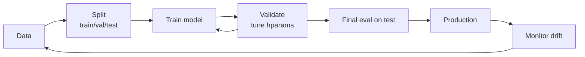

# 1.1 — Machine Learning Fundamentals

> Before you learn any algorithm, learn the **framework** every algorithm plugs into: data splitting, bias-variance, generalization, and evaluation.

---

## 1. Intuition first

Machine learning is **learning a function from data**. Given examples $(x_i, y_i)$, we search for $f_\theta$ that maps $x \mapsto y$ well *on unseen data*. The whole game is generalization — memorizing training data is trivial; predicting new data is hard.

## 2. Why the topic exists

Programmers used to hand-write rules. But for tasks like "is this image a cat?" no one can write all the rules. ML lets us **learn** the rules from labeled examples, which is the only known scalable approach for perception, language, and messy real-world data.

## 3. What problem it solves

- Automates tasks whose rules we cannot articulate.
- Improves as data grows.
- Generalizes to new, unseen inputs.

## 4. Mathematics

### 4.1 The learning problem (supervised)

Assume $(x, y) \sim \mathcal{D}$ (an unknown data distribution). Given a loss $\ell(\hat y, y)$, the **risk** of hypothesis $f$ is

$$
R(f) = \mathbb{E}_{(x, y)\sim\mathcal{D}} [\ell(f(x), y)]
$$

We can't compute $R$ (we don't know $\mathcal{D}$), so we minimize the **empirical risk** on a training set of $n$ samples:

$$
\hat R(f) = \frac{1}{n}\sum_{i=1}^n \ell(f(x_i), y_i)
$$

### 4.2 Bias-variance decomposition (for MSE)

$$
\underbrace{\mathbb{E}[(y - \hat f(x))^2]}_{\text{expected error}} = \underbrace{(\mathbb{E}[\hat f(x)] - f^*(x))^2}_{\text{bias}^2} + \underbrace{\text{Var}(\hat f(x))}_{\text{variance}} + \underbrace{\sigma_\epsilon^2}_{\text{irreducible noise}}
$$

### 4.3 Generalization gap

$$
\text{gap} = R(f) - \hat R(f)
$$

Bounded (roughly) by $\sqrt{\text{complexity}/n}$. More data or simpler model ⇒ smaller gap.

### 4.4 Train / validation / test split

- **Train** — fit parameters.
- **Validation** — tune hyperparameters, early stopping.
- **Test** — final unbiased performance estimate. **Touch it once.**

### 4.5 k-fold cross-validation

Split data into $k$ folds; for each fold, train on the other $k-1$ and validate on it. Average the $k$ scores.

## 5. Every formula explained

- Empirical risk = average loss on training data.
- Bias = how far the average model is from the truth (underfitting).
- Variance = how much the model changes across different training sets (overfitting).
- Irreducible noise = fundamental limit set by data.
- CV score = out-of-sample estimate of risk.

## 6. Every variable explained

| Symbol | Meaning |
|--------|---------|
| $x$ | input features |
| $y$ | target |
| $\hat y = f_\theta(x)$ | prediction |
| $\theta$ | model parameters |
| $\ell$ | loss function |
| $\mathcal{D}$ | true data distribution |
| $f^*$ | Bayes-optimal predictor |

## 7. Step-by-step ML workflow

1. **Frame the problem** — is it classification, regression, ranking, generative?
2. **Collect & split data** — respect temporal / group boundaries.
3. **Baseline** — always start with the dumbest model (mean, median, most-common class).
4. **EDA & feature engineering**.
5. **Fit a simple model** (linear/logistic).
6. **Iterate** — more expressive model, more features, hyperparameter tuning.
7. **Evaluate on validation**, diagnose bias vs variance.
8. **Final test set evaluation**.
9. **Ship & monitor**.

## 8. Simple example

Predict house price from square footage. Baseline = mean price. Linear regression usually beats it. Random forest may beat linear. But if you never evaluate on held-out data, you have no idea.

## 9. Real-world example

- Netflix predicting whether you'll watch a title.
- Bank predicting whether a transaction is fraudulent.
- Gmail classifying spam.
- Google Search ranking documents.

## 10. Diagram



Bias-variance visualization:

```
Underfit (high bias)   Just right           Overfit (high variance)
data:  o o o o o o     o o o o o o          o o o o o o
line:  ---------       .-'-.-'-.            zig-zag-zig-zag
test error: HIGH       LOW                  HIGH
```

## 11. Implementation from scratch — train/val/test + k-fold

```python
import random

def train_test_split(X, y, test_frac=0.2, seed=0):
    idx = list(range(len(X)))
    random.Random(seed).shuffle(idx)
    n_test = int(len(X) * test_frac)
    test_idx, train_idx = idx[:n_test], idx[n_test:]
    return ([X[i] for i in train_idx], [X[i] for i in test_idx],
            [y[i] for i in train_idx], [y[i] for i in test_idx])

def k_fold(X, y, k=5, seed=0):
    idx = list(range(len(X)))
    random.Random(seed).shuffle(idx)
    folds = [idx[i::k] for i in range(k)]
    for i in range(k):
        val = folds[i]
        train = [j for f in folds if f is not folds[i] for j in f]
        yield ([X[j] for j in train], [X[j] for j in val],
               [y[j] for j in train], [y[j] for j in val])
```

## 12. Implementation using libraries

```python
from sklearn.model_selection import train_test_split, StratifiedKFold, cross_val_score
from sklearn.linear_model import LogisticRegression

X_train, X_test, y_train, y_test = train_test_split(
    X, y, test_size=0.2, stratify=y, random_state=42)

scores = cross_val_score(
    LogisticRegression(max_iter=1000),
    X_train, y_train,
    cv=StratifiedKFold(n_splits=5, shuffle=True, random_state=42),
    scoring="roc_auc")
print(scores.mean(), scores.std())
```

## 13. Time complexity

Depends on model — see individual topic files.

## 14. Space complexity

Same.

## 15. Advantages of the ML framework

- General-purpose (works for perception, language, forecasting, ranking, control).
- Improves with data.
- Empirical, testable.

## 16. Disadvantages

- Needs labeled data (or clever workarounds: self-supervision, RL, weak labels).
- Distribution shift can invalidate a model overnight.
- Interpretability suffers as models grow.

## 17. Interview questions

1. Explain bias-variance trade-off.
2. Why do we need a separate test set?
3. What is data leakage? Give three examples.
4. When would you use stratified sampling?
5. How does k-fold CV differ from a single hold-out split?
6. Why can't we tune hyperparameters on the test set?
7. What is the difference between generative and discriminative models?
8. Give three ways to detect overfitting.
9. What is a "baseline" and why is it important?
10. Define supervised, unsupervised, and self-supervised learning.

## 18. Common mistakes

- **Leakage**: fitting the scaler on train+test, or including future information.
- Shuffling time-series data (breaks temporal order).
- Optimizing the wrong metric.
- Comparing models across different splits.
- Ignoring class imbalance.

## 19. Optimization techniques

- Use nested CV when tuning + evaluating.
- Set random seeds; log everything.
- Prefer group / time-based splits when appropriate.
- Use `stratify` for imbalanced classification.

## 20. Coding exercises

1. Implement `train_test_split` with a `stratify` option.
2. Implement group k-fold (rows with the same group id never cross folds).
3. Simulate the bias-variance trade-off on synthetic polynomial data.
4. Detect a data-leakage bug in a provided notebook.
5. Implement time-series `expanding-window` CV.

## 21. Mini project

Take a dataset, define baseline (majority class), linear model, and tree model. Report accuracy, precision, recall on a proper stratified split; explain results.

## 22. Medium project

Reproduce a Kaggle competition's public leaderboard baseline; implement rigorous CV; achieve within 5% of the leaderboard's best known score.

## 23. Advanced project

Build a reusable evaluation library: given a dataset + model, run CV, save learning curves, calibration plots, bootstrapped CIs for every metric, and a Markdown report.

## 24. Where it is used in industry

Every ML system, everywhere.

## 25. How companies use it

Rigorous evaluation is *the* differentiator between amateur and professional ML teams. Google, Meta, Netflix, Stripe all have dedicated evaluation infrastructure.

## 26. When NOT to use it

- If a rule-based system solves it with 99% accuracy and interpretability, don't add ML.
- If you have < 100 examples per class and no transfer-learning option, ML is unlikely to help.
