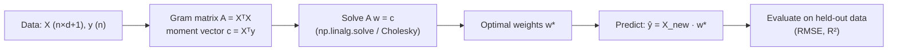
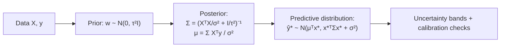

# 1.2 — Linear Regression

> The Hello-World of ML and the algorithm every senior interviewer asks about. The math behind it — normal equations, projections, gradients, maximum likelihood — is the same math used everywhere else in this roadmap. If you truly understand linear regression, you understand 80% of what follows.

---

## 1. Overview

**What is it?** Linear regression predicts a continuous target $y$ as a weighted sum of input features: $\hat y = \mathbf{w}^T\mathbf{x} + b$. Fitting the model means choosing the weights $\mathbf{w}$ and intercept $b$ that make predictions closest to the observed targets, where "closest" is measured by squared error. The classical solution method is called **ordinary least squares (OLS)**.

**Why does it exist?** It is the fastest, simplest, most interpretable predictive model in existence, with a 200-year pedigree (Legendre and Gauss used least squares for astronomy in the early 1800s). It is the workhorse of econometrics, A/B-test analysis, forecasting baselines, and scientific data analysis.

**What problem does it solve?** Given features $\mathbf{x} \in \mathbb{R}^d$ and a continuous target $y \in \mathbb{R}$, learn a function that predicts $y$ for new inputs — and, crucially, produces *coefficients you can read*: "each extra square meter adds \$3,200 to the predicted price, holding everything else fixed."

**Where is it used?** Real-estate pricing, ad-spend attribution (media-mix modeling), demand forecasting, factor models in finance, treatment-effect estimation in experiments, and as the mandatory first baseline for essentially every regression problem in industry. It is also, secretly, the last layer of most neural networks — a linear map applied to learned features.

## 2. Learning Objectives

After this chapter you will be able to:

- Write the linear model in vector and matrix form, including the bias-absorption trick.
- Define the mean-squared-error (MSE) loss and explain why we minimize squared, not absolute, error.
- Derive the **normal equations** step by step and state the conditions under which they have a unique solution.
- Explain the **geometric view**: OLS as orthogonal projection of $\mathbf{y}$ onto the column space of $X$.
- Derive the gradient of the MSE loss and fit linear regression with [gradient descent](03-gradient-descent.md).
- Derive OLS as **maximum likelihood** under Gaussian noise, and predict what changes under Laplacian noise.
- Write the closed-form **ridge** solution and explain why $\lambda I$ guarantees invertibility.
- Implement linear regression from scratch in NumPy (both closed-form and iterative) and with scikit-learn.
- Analyze the time/space complexity of the normal equations vs. gradient descent and choose between them.
- Diagnose multicollinearity, outlier sensitivity, and scale-related pitfalls in fitted models.

## 3. Prerequisites

| Chapter | Why you need it |
|---|---|
| [Linear Algebra](../phase-0-prerequisites/02-linear-algebra.md) | Matrix multiplication, transposes, inverses, column spaces, and projections are the language of OLS. |
| [Calculus](../phase-0-prerequisites/03-calculus.md) | We set a gradient to zero to derive the normal equations. |
| [Probability & Statistics](../phase-0-prerequisites/04-probability-statistics.md) | The Gaussian distribution and maximum likelihood justify the squared-error loss. |
| [NumPy & Pandas](../phase-0-prerequisites/05-numpy-pandas.md) | All implementations use NumPy arrays and linear-algebra routines. |
| [ML Fundamentals](01-ml-fundamentals.md) | Train/test splits and bias-variance framing tell us how to evaluate the fitted model. |

## 4. Intuition

Picture a scatter plot of house sizes (x-axis) versus prices (y-axis). The points form a rough upward cloud. Linear regression draws the single straight line through that cloud that makes the **total squared vertical distance** from the points to the line as small as possible. Each vertical distance is a *residual* — the amount by which the line's prediction misses that house's actual price. Squaring the residuals does two things: it treats over- and under-predictions symmetrically, and it punishes large misses much more than small ones (missing by \$100k hurts 100× more than missing by \$10k, not 10×).

In higher dimensions, replace "line" with "hyperplane": with two features (size, age) the model is a tilted plane floating over the feature plane; with $d$ features it is a $d$-dimensional hyperplane you can no longer draw but the algebra never changes.

An everyday story: a barista notices that iced-coffee sales track the day's temperature. She jots down ten (temperature, sales) pairs and eyeballs a line: "roughly 3 extra cups per degree above 20°C, starting from a base of 40 cups." She has just done linear regression by eye — a slope (weight) and an intercept (bias). OLS merely replaces her eyeball with a criterion (least squares) and a formula that provably finds the best line under that criterion.

A useful second analogy: OLS is like casting a shadow. Your target vector $\mathbf{y}$ lives in $n$-dimensional space; the predictions your model *can* produce form a flat subspace (all linear combinations of the feature columns). OLS finds the point in that subspace closest to $\mathbf{y}$ — the shadow $\mathbf{y}$ casts onto the subspace when light falls perpendicular to it.

## 5. Real-world Motivation

- **Zillow's early Zestimate** models estimated property prices from hundreds of features; regression-based approaches were the backbone before gradient-boosted trees and neural nets took over.
- **Google, Meta, Netflix, Amazon** all rely on regression-style analysis of A/B experiments: the treatment effect is literally a coefficient in a (linear) model, and confidence intervals on that coefficient decide launches.
- **Marketing/media-mix modeling** at large advertisers regresses revenue on spend per channel (TV, search, social) to allocate budgets; interpretable coefficients are the entire point.
- **Finance:** factor models (CAPM and successors) are linear regressions of asset returns on market factors; the fitted "beta" is a regression slope.
- **Every ML team's first deliverable** on a new regression problem is a linear baseline: if your deep model cannot beat regularized linear regression, ship the linear model — it is faster, cheaper, and auditable.

## 6. Mathematical Foundations

### 6.1 Model and notation

For one example, the prediction is

$$
\hat y_i = \mathbf{w}^T \mathbf{x}_i + b
$$

where $\mathbf{x}_i \in \mathbb{R}^d$ is the $i$-th feature vector, $\mathbf{w} \in \mathbb{R}^d$ the weight vector, and $b \in \mathbb{R}$ the intercept (bias). **Bias absorption:** append a constant 1 to every feature vector, $\tilde{\mathbf{x}}_i = [\mathbf{x}_i; 1]$, and fold $b$ into the weights, $\tilde{\mathbf{w}} = [\mathbf{w}; b]$; then $\hat y_i = \tilde{\mathbf{w}}^T\tilde{\mathbf{x}}_i$ with no separate bias term. From here on, assume this has been done and write $\mathbf{w}$ and $X$ for the augmented versions.

Stacking $n$ examples row-wise gives the **design matrix** $X \in \mathbb{R}^{n \times (d+1)}$ and target vector $\mathbf{y} \in \mathbb{R}^n$, so all predictions at once are $\hat{\mathbf{y}} = X\mathbf{w}$.

### 6.2 Loss — mean squared error

$$
J(\mathbf{w}) = \frac{1}{2n}\sum_{i=1}^n (\mathbf{w}^T \mathbf{x}_i - y_i)^2 = \frac{1}{2n}\, \|X\mathbf{w} - \mathbf{y}\|_2^2
$$

Here $\|\cdot\|_2$ is the Euclidean norm and the factor $\tfrac{1}{2}$ exists purely to cancel the 2 that appears when differentiating a square — it does not change the minimizer.

### 6.3 The normal equations (closed form), derived step by step

Expand the loss (dropping the $\tfrac{1}{2n}$ scale, which doesn't move the minimum):

$$
\|X\mathbf{w} - \mathbf{y}\|_2^2 = (X\mathbf{w} - \mathbf{y})^T(X\mathbf{w} - \mathbf{y}) = \mathbf{w}^T X^T X \mathbf{w} - 2\,\mathbf{y}^T X \mathbf{w} + \mathbf{y}^T\mathbf{y}
$$

Differentiate with respect to $\mathbf{w}$ using the identities $\nabla_\mathbf{w}(\mathbf{w}^T A \mathbf{w}) = 2A\mathbf{w}$ (for symmetric $A$) and $\nabla_\mathbf{w}(\mathbf{c}^T\mathbf{w}) = \mathbf{c}$:

$$
\nabla_\mathbf{w} J \propto 2X^T X\mathbf{w} - 2X^T\mathbf{y}
$$

Set the gradient to zero (a valid optimality condition because $J$ is convex — its Hessian $X^TX$ is positive semi-definite):

$$
X^T X\, \mathbf{w} = X^T \mathbf{y} \quad\Longrightarrow\quad \boxed{\ \mathbf{w}^* = (X^T X)^{-1} X^T \mathbf{y}\ }
$$

These are the **normal equations**. The inverse exists iff $X^TX$ is invertible, i.e., iff the columns of $X$ are linearly independent (which requires $n \ge d+1$ and no perfectly redundant features).

**Geometric reading:** rearranged, $X^T(\mathbf{y} - X\mathbf{w}^*) = \mathbf{0}$ — the residual vector is *orthogonal to every column of $X$*. OLS projects $\mathbf{y}$ orthogonally onto the column space of $X$; the name "normal" refers to this perpendicularity, not the Gaussian.

### 6.4 Gradient view (for iterative optimization)

Restoring the $\tfrac{1}{2n}$ scale:

$$
\nabla_\mathbf{w} J = \frac{1}{n}\, X^T (X\mathbf{w} - \mathbf{y})
$$

i.e., "features transposed times residuals, averaged." Gradient descent iterates $\mathbf{w} \leftarrow \mathbf{w} - \eta\,\nabla_\mathbf{w} J$ with learning rate $\eta$; the full treatment is in [Gradient Descent](03-gradient-descent.md). Use it when $d$ is too large to form and factor $X^TX$, or when data streams in.

### 6.5 Probabilistic view — OLS is Gaussian maximum likelihood

Assume the data-generating process

$$
y_i = \mathbf{w}^T\mathbf{x}_i + \epsilon_i, \qquad \epsilon_i \sim \mathcal{N}(0, \sigma^2) \text{ i.i.d.}
$$

where $\sigma^2$ is the noise variance. The likelihood of the data given $\mathbf{w}$ is $\prod_i \mathcal{N}(y_i \mid \mathbf{w}^T\mathbf{x}_i, \sigma^2)$. Taking the log:

$$
\log L(\mathbf{w}) = -\frac{n}{2}\log(2\pi\sigma^2) - \frac{1}{2\sigma^2}\sum_{i=1}^n (y_i - \mathbf{w}^T\mathbf{x}_i)^2
$$

Maximizing over $\mathbf{w}$ ignores the constant first term and the positive factor $\tfrac{1}{2\sigma^2}$, leaving: *minimize the sum of squared residuals*. **MLE under Gaussian noise = OLS.** So MSE is not arbitrary — it is the Gaussian log-likelihood in disguise. If the noise were Laplacian (heavy-tailed), the same derivation yields absolute error (least absolute deviations), which is robust to outliers. This loss-follows-noise-model principle recurs throughout ML (see [Loss Functions](../phase-2-deep-learning/04-loss-functions.md)).

### 6.6 Ridge regression — closed form

Add an L2 penalty $\lambda\|\mathbf{w}\|_2^2$ (with strength $\lambda > 0$; details and the Bayesian story in [Regularization](05-regularization.md)). The objective stays quadratic, and setting the gradient to zero gives

$$
\mathbf{w}^*_{\text{ridge}} = (X^T X + \lambda I)^{-1} X^T \mathbf{y}
$$

where $I$ is the identity matrix. Adding $\lambda I$ shifts every eigenvalue of $X^TX$ up by $\lambda$, so the matrix is **always invertible** — ridge simultaneously fixes multicollinearity and shrinks weights toward zero. (Convention: don't penalize the intercept column.)

## 7. Visual Explanation

The fit, in ASCII:

```
   y
   |                    *
   |               *  ／
   |            ／*
   |        *／
   |     ／*        ／ = fitted line  ŷ = w·x + b
   |  ／ *              * = data,  vertical gaps = residuals
   +----------------------------- x
```

The closed-form pipeline:



The geometric picture: $\hat{\mathbf{y}}$ is the orthogonal projection of $\mathbf{y}$ onto the plane spanned by the columns of $X$; the residual $\mathbf{y} - \hat{\mathbf{y}}$ sticks out perpendicular to that plane.

```
            y  •
               |\
      residual | \   (⊥ to the column space)
               |  \
   ────────────ŷ───────────────  column space of X
        (all achievable predictions Xw)
```

## 8. Algorithm

**Closed form (normal equations):**

1. Assemble the design matrix $X$: one row per example, one column per feature, plus a final column of 1s for the intercept.
2. Compute $A = X^T X$ (a $(d{+}1)\times(d{+}1)$ matrix) and $\mathbf{c} = X^T \mathbf{y}$.
3. Solve the linear system $A\mathbf{w} = \mathbf{c}$ — use a solver (`np.linalg.solve`, which factors $A$), **never** compute the explicit inverse; solving is faster and numerically stabler.
4. (Ridge variant) use $A = X^TX + \lambda I$ instead, zeroing the $\lambda$ on the intercept's diagonal entry.
5. Return $\mathbf{w}$; predict new points with $\hat y = \mathbf{w}^T\tilde{\mathbf{x}}$.

**Gradient descent:**

1. Standardize features (zero mean, unit variance) — this roughly equalizes curvature across dimensions and lets one learning rate work for all weights.
2. Initialize $\mathbf{w} = \mathbf{0}$.
3. Repeat: compute residuals $\mathbf{r} = X\mathbf{w} - \mathbf{y}$, gradient $g = \tfrac{1}{n}X^T\mathbf{r}$, update $\mathbf{w} \leftarrow \mathbf{w} - \eta\, g$.
4. Stop when the loss decrease $|\Delta J| < \varepsilon$ or after $T$ iterations.

Pseudocode:

```text
procedure OLS_CLOSED_FORM(X, y, λ=0):
    X ← [X | 1]                        # append intercept column
    A ← XᵀX + λ·I                      # I has 0 in the intercept slot
    c ← Xᵀy
    w ← SOLVE(A, c)                    # LU/Cholesky solve, O(d³)
    return w

procedure OLS_GRADIENT_DESCENT(X, y, η, T):
    X ← [standardize(X) | 1]
    w ← 0
    for t in 1..T:
        g ← (1/n) · Xᵀ(Xw − y)         # O(nd) per iteration
        w ← w − η·g
        if loss_change < ε: break
    return w
```

## 9. Worked Example

**Tiny example, entirely by hand.** Fit $\hat y = wx + b$ to three points:

| $x$ | $y$ |
|---|---|
| 1 | 2 |
| 2 | 4 |
| 3 | 5 |

For simple (1-feature) regression the normal equations reduce to the classic formulas. Compute means: $\bar x = \frac{1+2+3}{3} = 2$, $\bar y = \frac{2+4+5}{3} = \frac{11}{3} \approx 3.667$.

Slope:

$$
w = \frac{\sum_i (x_i - \bar x)(y_i - \bar y)}{\sum_i (x_i - \bar x)^2}
= \frac{(-1)(-\tfrac{5}{3}) + (0)(\tfrac{1}{3}) + (1)(\tfrac{4}{3})}{(-1)^2 + 0^2 + 1^2}
= \frac{\tfrac{5}{3} + 0 + \tfrac{4}{3}}{2} = \frac{3}{2} = 1.5
$$

Intercept: $b = \bar y - w\bar x = \tfrac{11}{3} - 1.5 \times 2 = \tfrac{11}{3} - 3 = \tfrac{2}{3} \approx 0.667$.

Fitted model: $\hat y = 1.5x + 0.667$. Check the predictions: $\hat y(1) = 2.167$, $\hat y(2) = 3.667$, $\hat y(3) = 5.167$ — residuals $(-0.167, +0.333, -0.167)$, which sum to zero (they always do when an intercept is included, a direct consequence of the orthogonality condition applied to the all-ones column).

**Realistic example.** On the California Housing dataset (20,640 districts, 8 features, target = median house value in \$100k), a leak-free pipeline (standardize inside a `Pipeline`, 5-fold CV per [Chapter 1.1](01-ml-fundamentals.md)) gives OLS a test RMSE around 0.73 vs. 1.15 for the predict-the-mean baseline — a 36% error reduction from a model that trains in milliseconds. The largest standardized coefficient is median income, and latitude/longitude carry strong negative/positive weights reflecting coastal geography.

## 10. Python from Scratch

A complete NumPy implementation supporting both solution methods and optional ridge:

```python
import numpy as np

class LinearRegression:
    """OLS / ridge via normal equations or batch gradient descent."""

    def __init__(self, lr=0.01, n_iters=1000, method="normal", l2=0.0):
        self.lr = lr            # learning rate η (GD only)
        self.n_iters = n_iters  # max GD iterations T
        self.method = method    # "normal" (closed form) or "gd"
        self.l2 = l2            # ridge strength λ (0 = plain OLS)

    def _add_bias(self, X):
        # Append a column of 1s: absorbs the intercept into the weights.
        return np.hstack([X, np.ones((X.shape[0], 1))])

    def fit(self, X, y):
        Xb = self._add_bias(np.asarray(X, dtype=float))   # (n, d+1)
        y = np.asarray(y, dtype=float)                    # (n,)
        n, d = Xb.shape
        if self.method == "normal":
            reg = self.l2 * np.eye(d)
            reg[-1, -1] = 0.0                 # never penalize the intercept
            A = Xb.T @ Xb + reg               # (d+1, d+1): O(n d²) to build
            # solve, don't invert: LU factorization is faster & more stable
            self.w = np.linalg.solve(A, Xb.T @ y)
        else:                                 # batch gradient descent
            self.w = np.zeros(d)
            for _ in range(self.n_iters):
                resid = Xb @ self.w - y                    # (n,)
                grad = Xb.T @ resid / n                    # (d+1,)  O(nd)
                grad[:-1] += self.l2 * self.w[:-1] / n     # L2 term, no bias
                self.w -= self.lr * grad
        return self

    def predict(self, X):
        return self._add_bias(np.asarray(X, dtype=float)) @ self.w

# --- sanity check on synthetic data with a known answer ---
rng = np.random.default_rng(0)
X = rng.normal(size=(200, 3))                 # 200 samples, 3 features
w_true = np.array([1.5, -2.0, 0.7])
y = X @ w_true + 1.0 + rng.normal(scale=0.1, size=200)   # intercept = 1.0

model = LinearRegression(method="normal").fit(X, y)
print(np.round(model.w, 3))
# Expected output ≈ [ 1.5  -2.0   0.7   1.0 ]  (last entry = intercept)
```

Block-by-block: `_add_bias` implements bias absorption; the `"normal"` branch builds the Gram matrix ($O(nd^2)$) and solves it ($O(d^3)$); the GD branch costs $O(nd)$ per iteration and recovers the same weights when $\eta$ is small enough and iterations are plentiful. **Common bug:** forgetting to add the bias column at *predict* time too — the shapes still broadcast in some cases and you silently get garbage. A second classic: penalizing the intercept in ridge, which biases predictions when the target is far from zero.

## 11. Library Implementation

```python
from sklearn.linear_model import LinearRegression, Ridge
from sklearn.preprocessing import StandardScaler
from sklearn.pipeline import Pipeline
from sklearn.model_selection import train_test_split
from sklearn.metrics import mean_squared_error
import numpy as np

X_train, X_test, y_train, y_test = train_test_split(X, y, test_size=0.2,
                                                    random_state=42)

# Plain OLS. sklearn solves via SVD (lstsq) — stable even if XᵀX is singular.
ols = LinearRegression().fit(X_train, y_train)
print(ols.coef_)        # weight vector w, shape (d,)
print(ols.intercept_)   # bias b (kept separate — no manual bias column needed)
print(ols.score(X_test, y_test))   # R² on held-out data, e.g. 0.99 on our toy

# Ridge, with scaling in the pipeline (leakage guard from Chapter 1.1).
ridge = Pipeline([
    ("scale", StandardScaler()),   # ridge penalties are scale-sensitive
    ("model", Ridge(alpha=1.0)),   # alpha = λ, the L2 strength
]).fit(X_train, y_train)

rmse = np.sqrt(mean_squared_error(y_test, ridge.predict(X_test)))
print(f"Ridge test RMSE: {rmse:.4f}")   # expected ≈ noise scale (0.1) on toy data
```

Notes: `LinearRegression` uses an SVD-based least-squares solver, so it returns the minimum-norm solution even when features are collinear (where the naive normal equations would crash). `Ridge(alpha=...)` maps directly to $\lambda$; `alpha=0` recovers OLS. `score` returns $R^2 = 1 - \frac{\sum_i (y_i-\hat y_i)^2}{\sum_i (y_i-\bar y)^2}$, the fraction of target variance explained.

## 12. Code Walkthrough

Shapes and intermediates for the from-scratch fit on the synthetic data ($n=200$, $d=3$):

| Tensor | Shape | Meaning |
|---|---|---|
| `X` | (200, 3) | raw feature matrix |
| `Xb` | (200, 4) | features + intercept column of 1s |
| `y` | (200,) | targets |
| `A = Xb.T @ Xb` | (4, 4) | Gram matrix (symmetric PSD) |
| `Xb.T @ y` | (4,) | moment vector |
| `self.w` | (4,) | `[w1, w2, w3, b]` — solution of the 4×4 system |
| `model.predict(X)` | (200,) | fitted values $\hat{\mathbf y}$ |

Expected results: with noise scale 0.1 and $n=200$, recovered weights land within about $\pm 0.02$ of `[1.5, -2.0, 0.7, 1.0]`; training RMSE ≈ 0.1 (the noise floor — you cannot do better, per the irreducible-noise term from [Chapter 1.1](01-ml-fundamentals.md)). If GD with `lr=0.01` returns visibly different weights, it has not converged — raise `n_iters` or the learning rate.

## 13. Complexity Analysis

| Method | Time | Space | Why |
|---|---|---|---|
| Normal equations | $O(nd^2 + d^3)$ | $O(d^2)$ | $nd^2$ to form $X^TX$ (each of the $d^2$ entries is an $n$-term dot product); $d^3$ to factor/solve the $d\times d$ system; store the Gram matrix. |
| SVD least squares | $O(nd^2)$ | $O(nd)$ | thin SVD of $X$; slower constant but handles rank deficiency. |
| Batch gradient descent | $O(nd)$ per iteration × $T$ | $O(nd)$ | each step is one matrix–vector product with $X$ and one with $X^T$; you hold $X$ in memory (or stream it). |
| SGD | $O(d)$ per update | $O(d)$ | one example at a time — the only option at web scale. |

Rule of thumb: closed form wins while $d \lesssim 10^4$ and $X^TX$ fits in memory; beyond that, or with streaming data, use (mini-batch) gradient methods — the subject of the [next chapter](03-gradient-descent.md).

## 14. Advantages

- **Interpretable coefficients.** "Each additional bedroom adds \$14k, holding size constant" is a sentence a regulator, doctor, or product manager can act on — the reason banks and pharma still favor linear models.
- **Closed-form, deterministic training.** No learning rates, no seeds, no convergence anxiety: `solve(XᵀX, Xᵀy)` returns the global optimum in one shot.
- **Extremely fast.** Millions of rows with dozens of features fit in well under a second — ideal for the always-required baseline.
- **Rich statistical theory.** Under the Gauss–Markov assumptions, OLS is the best linear unbiased estimator; you get standard errors, confidence intervals, and p-values for free — the machinery behind A/B-test analysis at every major tech company.
- **Foundation for everything after.** Ridge/lasso ([Regularization](05-regularization.md)), logistic regression ([next-but-one chapter](04-logistic-regression.md)), and neural-network output layers are all linear regression plus one twist each.

## 15. Disadvantages

- **Linearity assumption.** If the truth is $y = x^2$, a linear fit in $x$ has irreducible bias; you must engineer features ($x^2$, interactions) or switch model families ([Decision Trees](08-decision-trees.md), [MLPs](../phase-2-deep-learning/01-perceptron-mlp.md)).
- **Outlier sensitivity.** Squared loss lets one corrupted point (a house price entered as \$100M instead of \$1M) drag the whole hyperplane; robust losses (Huber, absolute error) trade this for harder optimization.
- **Multicollinearity instability.** Highly correlated features make $X^TX$ near-singular: coefficients explode in magnitude with opposite signs and flip under tiny data changes, destroying interpretability (ridge is the standard fix).
- **Extrapolation is unguarded.** The hyperplane extends forever; predictions far outside the training range are confident and often absurd.
- **No automatic interactions.** "Location matters more for small apartments" is invisible to the model unless you hand-craft a location×size feature.

## 16. Common Mistakes

- **Not standardizing features before GD or ridge.** GD converges glacially when features span different scales (ill-conditioning), and ridge penalizes large-scale features less — *fix:* `StandardScaler` inside the pipeline.
- **Reading raw coefficient magnitude as importance.** A coefficient of 0.0003 on "house price in dollars" can matter more than 2.1 on "number of floors." *Fix:* compare standardized coefficients.
- **Using `inv(A) @ b` instead of `solve(A, b)`.** Explicit inversion is slower and amplifies rounding error on ill-conditioned matrices; solvers factor once and back-substitute.
- **Forgetting the intercept.** Without the 1s column, the hyperplane is forced through the origin, biasing everything when $\bar y \neq 0$.
- **Ignoring residual diagnostics.** Funnel-shaped residuals (heteroscedasticity) invalidate the standard errors; curved residuals reveal missing non-linear terms. Plot residuals vs. fitted values, always.
- **Trusting in-sample $R^2$.** It never decreases as you add features, even pure-noise ones. *Fix:* held-out RMSE / $R^2$, or adjusted $R^2$ for quick in-sample comparisons.

## 17. Best Practices

- [ ] Standardize features; keep the scaler inside a `Pipeline` (leakage guard from [Chapter 1.1](01-ml-fundamentals.md)).
- [ ] Add mild L2 regularization by default in production (`Ridge(alpha≈1.0)` after standardization); pure OLS is fragile under collinearity.
- [ ] Report held-out RMSE (in target units) alongside $R^2$; stakeholders understand "\$23k average error."
- [ ] Check the condition number of $X$ (`np.linalg.cond`) and variance inflation factors when coefficients will be interpreted.
- [ ] Plot residuals vs. fitted values and a Q–Q plot of residuals before trusting any inference.
- [ ] Winsorize or investigate extreme targets before fitting; consider Huber loss if outliers are structural.
- [ ] For skewed positive targets (prices, incomes), try `log(y)` — the model then predicts multiplicative effects, which is often more natural.

> [!WARNING]
> Coefficients are *associations*, not causal effects, unless the data comes from a randomized experiment or you have applied causal-inference machinery. "Ice-cream sales predict drownings" is a real regression and a wrong causal claim.

## 18. Optimization Techniques

- **Vectorization:** never loop over samples; `X.T @ (X @ w - y)` computes the whole gradient in optimized BLAS calls — typically 100–1000× faster than Python loops.
- **Cholesky factorization:** $X^TX$ is symmetric positive definite (with ridge), so a Cholesky solve is ~2× faster than LU.
- **SVD for stability:** on ill-conditioned $X$, solve via SVD/`np.linalg.lstsq`; you also get the minimum-norm solution for rank-deficient problems.
- **Mini-batch SGD for scale:** when $n$ is huge or streaming, process batches (see [Gradient Descent](03-gradient-descent.md)); the model still converges to the OLS solution in expectation.
- **Sparse matrices:** with one-hot categorical features, store $X$ in CSR format; `scipy.sparse` matvecs keep gradient steps proportional to non-zeros, not $nd$.
- **Warm starts along a $\lambda$ path:** when tuning ridge strength, initialize each fit from the previous $\lambda$'s solution — near-free speedups in CV loops.

## 19. Industry Applications

- **Econometrics and policy:** essentially all empirical economics runs on linear regression variants; central banks forecast with them.
- **Finance:** factor models (market beta, Fama–French factors) at asset managers are linear regressions refit daily.
- **Marketing:** media-mix modeling at large advertisers (a practice Google and Meta both publish methodologies for) regresses sales on channel spend to allocate budgets.
- **Real estate:** Zillow-style automated valuation models began as large regressions on property attributes.
- **Experimentation platforms:** A/B-test analysis at Netflix, Microsoft, and Amazon estimates treatment effects as regression coefficients, often with covariate adjustment (CUPED) to shrink variance.
- **Sports analytics:** expected-goals and player-value models frequently start (and sometimes end) as regularized linear regressions.

## 20. Interview Questions

### Beginner

**Q: What does linear regression assume about the relationship between features and target?**
A: That the conditional mean of $y$ is a linear function of the features: $\mathbb{E}[y\mid\mathbf{x}] = \mathbf{w}^T\mathbf{x} + b$, with additive noise. Linearity is in the *parameters* — you can still feed in $x^2$ or $\log x$ as features.

**Q: Why do we minimize squared error rather than absolute error?**
A: Three reasons: squared error is differentiable everywhere (absolute error is not, at 0), it has a closed-form solution (the normal equations), and it is the maximum-likelihood loss under Gaussian noise. The price is outlier sensitivity; absolute error corresponds to Laplacian noise and a median-like, robust fit.

**Q: What is the role of the intercept, and what happens if you omit it?**
A: The intercept lets the hyperplane sit at the right height — the predicted value when all features are zero. Omitting it forces the fit through the origin, which biases predictions whenever the target mean is nonzero, and breaks the "residuals sum to zero" property.

**Q: What does $R^2$ measure?**
A: The fraction of target variance explained by the model: $R^2 = 1 - \frac{\text{SS}_{\text{res}}}{\text{SS}_{\text{tot}}}$. $R^2 = 0$ means no better than predicting the mean; 1 means perfect fit. In-sample $R^2$ never decreases when adding features, so compare models with held-out $R^2$ or adjusted $R^2$.

**Q: How do outliers affect OLS?**
A: Quadratically: a point with residual $r$ contributes $r^2$ to the loss, so one extreme point can dominate and rotate the entire hyperplane toward itself. Remedies: investigate/cap outliers, use Huber loss, or use RANSAC.

### Intermediate

**Q: Derive the normal equations.**
A: $J(\mathbf{w}) = \|X\mathbf{w}-\mathbf{y}\|^2 = \mathbf{w}^TX^TX\mathbf{w} - 2\mathbf{y}^TX\mathbf{w} + \mathbf{y}^T\mathbf{y}$. The gradient is $2X^TX\mathbf{w} - 2X^T\mathbf{y}$; setting it to zero gives $X^TX\mathbf{w} = X^T\mathbf{y}$, hence $\mathbf{w}^* = (X^TX)^{-1}X^T\mathbf{y}$ when $X$ has full column rank. Convexity ($X^TX \succeq 0$) makes this stationary point the global minimum.

**Q: Explain the geometric interpretation of OLS.**
A: Predictions $X\mathbf{w}$ range over the column space of $X$. OLS chooses the point in that subspace closest to $\mathbf{y}$ in Euclidean distance — the orthogonal projection. Equivalently, the residual $\mathbf{y} - X\mathbf{w}^*$ is orthogonal to every column of $X$, which is exactly what $X^T(\mathbf{y}-X\mathbf{w}^*)=0$ says.

**Q: What are the Gauss–Markov assumptions and what do they buy you?**
A: Linearity of the true model, exogeneity ($\mathbb{E}[\epsilon\mid X]=0$), homoscedasticity (constant noise variance), and uncorrelated errors. Under them, OLS is BLUE — the Best (minimum-variance) Linear Unbiased Estimator. Note Gaussianity is *not* required for BLUE, only for exact finite-sample inference.

**Q: When would you use gradient descent instead of the normal equations?**
A: When $d$ is large ($d^3$ factorization or $d^2$ memory becomes prohibitive, roughly $d \gtrsim 10^4$), when data streams or doesn't fit in memory (SGD), when using losses without closed forms (Huber, quantile), or when the linear model is one layer inside a larger differentiable system.

**Q: What is multicollinearity, how do you detect it, and how do you fix it?**
A: Near-linear dependence among feature columns, making $X^TX$ near-singular: coefficient estimates get huge variance and unstable signs. Detect with pairwise correlations, the condition number of $X$, or variance inflation factors (VIF > 10 is a red flag). Fix by dropping/combining features, or — most commonly — ridge regularization, which adds $\lambda I$ and stabilizes the solve.

### Advanced

**Q: Show that OLS is the MLE under Gaussian noise, and state what changes under Laplacian noise.**
A: With $y_i = \mathbf{w}^T\mathbf{x}_i + \epsilon_i$, $\epsilon_i\sim\mathcal{N}(0,\sigma^2)$, the log-likelihood is $-\frac{n}{2}\log(2\pi\sigma^2) - \frac{1}{2\sigma^2}\sum_i(y_i - \mathbf{w}^T\mathbf{x}_i)^2$; maximizing over $\mathbf{w}$ minimizes the squared-error sum — OLS. Under Laplacian noise, the density $\propto e^{-|r|/b}$ makes the negative log-likelihood proportional to $\sum_i |y_i - \mathbf{w}^T\mathbf{x}_i|$ — least absolute deviations, a robust, median-like regression.

**Q: Why is `np.linalg.solve(A, b)` preferred over `np.linalg.inv(A) @ b`?**
A: `solve` computes an LU (or Cholesky) factorization and back-substitutes: about $\tfrac{1}{3}d^3$ flops and backward-stable. Explicit inversion costs ~3× more flops and compounds rounding error, especially on ill-conditioned $A$ — the relative error scales with the condition number $\kappa(A)$, and inversion effectively squares your exposure to it.

**Q: The columns of $X$ are rank-deficient. What happens to OLS and what do solvers return?**
A: Infinitely many $\mathbf{w}$ achieve the same minimal loss (you can move along the null space of $X$ without changing $X\mathbf{w}$). $(X^TX)^{-1}$ does not exist. SVD-based solvers (`lstsq`, sklearn's `LinearRegression`) return the *minimum-norm* solution — the unique minimizer with smallest $\|\mathbf{w}\|_2$; ridge resolves the ambiguity differently, by explicitly penalizing norm.

**Q: How would you compute confidence intervals for OLS coefficients?**
A: Under Gauss–Markov + Gaussian noise, $\hat{\mathbf{w}} \sim \mathcal{N}(\mathbf{w}, \sigma^2(X^TX)^{-1})$. Estimate $\hat\sigma^2 = \frac{\text{SS}_{\text{res}}}{n-d-1}$, take standard errors as square roots of the diagonal of $\hat\sigma^2(X^TX)^{-1}$, and form $\hat w_j \pm t_{n-d-1, 0.975}\cdot \text{SE}(\hat w_j)$. With heteroscedasticity, use robust (sandwich) standard errors or the bootstrap instead.

**Q: Derive the ridge solution and explain its effect on the eigenvalues of the problem.**
A: Objective $\|X\mathbf{w}-\mathbf{y}\|^2 + \lambda\|\mathbf{w}\|^2$; gradient $2X^TX\mathbf{w} - 2X^T\mathbf{y} + 2\lambda\mathbf{w} = 0$ gives $(X^TX + \lambda I)\mathbf{w} = X^T\mathbf{y}$. If $X^TX$ has eigendecomposition $V\Lambda V^T$ with eigenvalues $\lambda_j \ge 0$, ridge replaces each $\lambda_j$ with $\lambda_j + \lambda > 0$ — always invertible — and in the SVD view shrinks each component of the solution by the factor $\frac{\lambda_j}{\lambda_j + \lambda}$: directions with little data support (small $\lambda_j$) are shrunk hardest, which is exactly where OLS variance lives.

## 21. Coding Exercises

### Easy

1. **Closed-form OLS.** Implement `fit(X, y)` returning weights via `np.linalg.solve`, with bias absorption; verify recovery of known weights on synthetic data. *Hint:* generate $y = Xw_{\text{true}} + b + \epsilon$ and check `np.allclose` within noise tolerance.
2. **Metrics from scratch.** Implement RMSE, MAE, and $R^2$ without sklearn and validate them against `sklearn.metrics` on random inputs. *Hint:* $R^2$ needs $\bar y$ from the *evaluation* set.

### Medium

1. **SVD-based OLS.** Solve least squares via the thin SVD $X = U\Sigma V^T$ (so $\mathbf{w} = V\Sigma^{-1}U^T\mathbf{y}$) and show it still works when you duplicate a column (rank deficiency) while `solve(XᵀX, Xᵀy)` fails. *Hint:* zero out tiny singular values before inverting.
2. **Coefficient confidence intervals.** Compute $\text{Cov}(\hat{\mathbf{w}}) = \hat\sigma^2(X^TX)^{-1}$, report 95% CIs per coefficient, and validate coverage over 1,000 simulated datasets. *Hint:* coverage should be ≈ 950/1000.
3. **GD vs. closed form.** Fit California Housing with both; plot GD's loss curve and the distance $\|\mathbf{w}_t - \mathbf{w}^*\|$ to the closed-form optimum over iterations, with and without feature standardization. *Hint:* unstandardized GD may need a 100× smaller learning rate.

### Hard

1. **Robust regression.** Implement Huber-loss regression with gradient descent, and demonstrate on data with 5% gross outliers that it recovers the true weights while OLS does not. *Hint:* the Huber gradient is the residual clipped to $[-\delta, \delta]$.
2. **Streaming OLS.** Implement recursive least squares (rank-one updates of $(X^TX)^{-1}$ via the Sherman–Morrison formula) so the model updates in $O(d^2)$ per new sample without refitting. *Hint:* maintain $P_t = (X_t^TX_t)^{-1}$ and update $P_{t+1} = P_t - \frac{P_t x x^T P_t}{1 + x^T P_t x}$.

## 22. Mini Project

**California Housing, three ways.**

1. Load `sklearn.datasets.fetch_california_housing`; freeze a 20% test set.
2. Build three pipelines: mean baseline, OLS, and `Ridge` — all with `StandardScaler` inside the pipeline.
3. Evaluate with 5-fold CV (RMSE); tune ridge's `alpha` over a log grid `[0.01, 0.1, 1, 10, 100]`.
4. Refit the winner and evaluate once on the test set.
5. Report the top-5 standardized coefficients with a one-sentence interpretation each, and a residuals-vs-fitted plot with commentary on any visible structure.

## 23. Medium Project

**Ride-share demand forecasting.**

1. Obtain a daily demand time series (e.g., a public bike-share dataset) plus weather and calendar data.
2. Engineer features: temperature, precipitation, day-of-week one-hots, holiday flag, and lagged demand (yesterday, 7 days ago).
3. Split temporally — expanding-window CV, never random shuffling (see [Chapter 1.1](01-ml-fundamentals.md) on temporal leakage).
4. Fit OLS and ridge; compare against a "same as last week" baseline.
5. Perform residual analysis by weekday and season; identify systematic misses and add features to address them.
6. Deliver a short report: final RMSE vs. baseline, coefficient table, and an honest discussion of when the model would fail (concerts, extreme weather).

## 24. Advanced Project

**Bayesian linear regression with uncertainty, from scratch.**

Architecture:



Implementation phases:

1. **Conjugate posterior:** implement the closed-form Gaussian posterior over weights (note the MAP estimate equals ridge with $\lambda = \sigma^2/\tau^2$ — connect this to [Regularization](05-regularization.md)).
2. **Predictive distribution:** return mean and variance per test point; plot 95% predictive bands on 1-D synthetic data and verify bands widen away from the training data.
3. **Hyperparameter learning:** implement evidence maximization (type-II MLE) for $\sigma^2$ and $\tau^2$, and compare against grid-search CV.
4. **Validation:** compare against `sklearn.linear_model.BayesianRidge` on real data; check calibration (do 95% intervals contain ~95% of held-out targets?).

Possible improvements: sequential/online posterior updates for streaming data; Student-t noise for robustness; feature-basis expansion (random Fourier features) to get non-linear Bayesian regression with the same closed forms.

## 25. Summary

- Linear regression models $\hat y = \mathbf{w}^T\mathbf{x} + b$; the bias absorbs into the weights via a constant-1 feature.
- OLS minimizes MSE $\frac{1}{2n}\|X\mathbf{w}-\mathbf{y}\|^2$; the **normal equations** $X^TX\mathbf{w} = X^T\mathbf{y}$ give the closed form $\mathbf{w}^* = (X^TX)^{-1}X^T\mathbf{y}$.
- Geometrically, OLS is the **orthogonal projection** of $\mathbf{y}$ onto the column space of $X$; residuals are perpendicular to every feature column.
- The gradient $\frac{1}{n}X^T(X\mathbf{w}-\mathbf{y})$ enables iterative fitting at scales where the closed form is infeasible.
- OLS = **maximum likelihood under Gaussian noise**; Laplacian noise ⇒ absolute-error regression. Losses encode noise assumptions.
- **Ridge** $(X^TX + \lambda I)^{-1}X^T\mathbf{y}$ is always solvable, tames multicollinearity, and shrinks weights; don't penalize the intercept.
- Complexity: closed form $O(nd^2 + d^3)$; GD $O(nd)$ per step; SGD $O(d)$ per update.
- Always `solve`, never `inv`; prefer SVD on ill-conditioned or rank-deficient problems.
- Standardize features for GD and for any penalized variant; compare standardized coefficients, not raw ones.
- Squared loss is outlier-sensitive; inspect residual plots before trusting the fit or its p-values.

## 26. Cheat Sheet

**Key formulas**

| Item | Formula |
|---|---|
| Model | $\hat y = \mathbf{w}^T\mathbf{x} + b$ |
| Loss (MSE) | $J = \frac{1}{2n}\|X\mathbf{w}-\mathbf{y}\|_2^2$ |
| Normal equations | $\mathbf{w}^* = (X^TX)^{-1}X^T\mathbf{y}$ |
| Gradient | $\nabla J = \frac{1}{n}X^T(X\mathbf{w}-\mathbf{y})$ |
| Ridge closed form | $\mathbf{w}^* = (X^TX + \lambda I)^{-1}X^T\mathbf{y}$ |
| Simple-regression slope | $w = \frac{\sum(x_i-\bar x)(y_i-\bar y)}{\sum(x_i-\bar x)^2}$, $b = \bar y - w\bar x$ |
| $R^2$ | $1 - \text{SS}_{\text{res}}/\text{SS}_{\text{tot}}$ |

**Defaults**

- Production baseline: `StandardScaler` + `Ridge(alpha=1.0)`.
- Skewed positive target → model `log(y)`.
- $d \lesssim 10^4$: closed form. Bigger, or streaming: mini-batch SGD.

**One-liner tips**

- Residuals sum to zero iff the intercept is included.
- Adding any feature never lowers in-sample $R^2$ — only held-out metrics count.
- Coefficient sign flips between refits = multicollinearity; reach for ridge.

**Gotchas**

- `inv(A) @ b` on a near-singular Gram matrix silently returns junk.
- Forgetting the bias column at predict time.
- Penalizing the intercept in ridge biases every prediction.

## 27. Further Reading

**Books**

- *The Elements of Statistical Learning* — Hastie, Tibshirani, Friedman (Ch. 3: linear methods for regression).
- *An Introduction to Statistical Learning* — James, Witten, Hastie, Tibshirani (Ch. 3; the gentlest rigorous treatment).
- *Pattern Recognition and Machine Learning* — Bishop (Ch. 3: Bayesian linear regression).
- *Econometric Analysis* — Greene (for the full inference machinery).

**Research Papers**

- Hoerl & Kennard (1970), "Ridge Regression: Biased Estimation for Nonorthogonal Problems."
- Stigler (1981), "Gauss and the Invention of Least Squares" (history).

**Documentation**

- scikit-learn User Guide: "Linear Models" (`LinearRegression`, `Ridge`, solver notes).
- NumPy docs: `numpy.linalg.solve`, `numpy.linalg.lstsq`.

**GitHub Repositories**

- `scikit-learn/scikit-learn` — `linear_model` module source is very readable.
- `statsmodels/statsmodels` — OLS with full inference output (standard errors, diagnostics).

**Datasets**

- California Housing (sklearn), Ames Housing (Kaggle), UCI Bike Sharing.

**YouTube / Videos**

- StatQuest — "Linear Regression, Clearly Explained."
- 3Blue1Brown — *Essence of Linear Algebra* (for the projection intuition).
- Andrew Ng, Machine Learning Specialization — linear regression and normal-equation lectures.

**Blogs**

- Gregory Gundersen — "Why the Normal Equations Work" and related linear-model posts.
- scikit-learn examples gallery — ordinary least squares and ridge condition-number demos.
