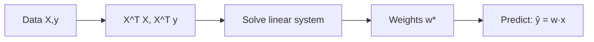

# 1.2 — Linear Regression

> The Hello-World of ML and the algorithm every senior interviewer asks about. If you truly understand it, you understand 80% of what follows.

---

## 1. Intuition first

Draw a straight line through a cloud of points so that the total squared vertical distance from points to line is as small as possible. That line is your predictor.

In higher dimensions, replace "line" with "hyperplane". The model assumes the target is a **linear combination** of the input features (plus noise).

## 2. Why the topic exists

- Fastest, simplest, most interpretable predictive model.
- Serves as the workhorse for baselines, econometrics, A/B analysis.
- The math behind it (normal equations, projections, gradient descent) is the same math used everywhere in ML.

## 3. What problem it solves

Given features $\mathbf{x} \in \mathbb{R}^d$, predict a continuous target $y \in \mathbb{R}$:

$$
\hat y = \mathbf{w}^T \mathbf{x} + b
$$

Learn $\mathbf{w}$ and $b$ from data.

## 4. Mathematics

### 4.1 Model

$$
\hat y_i = \mathbf{w}^T \mathbf{x}_i + b = \mathbf{w}^T \tilde{\mathbf{x}}_i \quad \text{where } \tilde{\mathbf{x}}_i = [\mathbf{x}_i; 1],\ \mathbf{w} \to [\mathbf{w}; b]
$$

Stack into matrix form: $\hat{\mathbf{y}} = X\mathbf{w}$, where $X \in \mathbb{R}^{n \times (d+1)}$.

### 4.2 Loss — Mean Squared Error

$$
J(\mathbf{w}) = \frac{1}{2n}\sum_{i=1}^n (\mathbf{w}^T \mathbf{x}_i - y_i)^2 = \frac{1}{2n} \|X\mathbf{w} - \mathbf{y}\|_2^2
$$

Divide by 2 to make gradient neat.

### 4.3 Normal equations (closed form)

Set $\nabla_\mathbf{w} J = 0$:

$$
X^T X \mathbf{w} - X^T \mathbf{y} = 0 \implies \mathbf{w}^* = (X^T X)^{-1} X^T \mathbf{y}
$$

### 4.4 Gradient (for gradient descent)

$$
\nabla_\mathbf{w} J = \frac{1}{n} X^T (X\mathbf{w} - \mathbf{y})
$$

### 4.5 Probabilistic view

Assume $y_i = \mathbf{w}^T \mathbf{x}_i + \epsilon_i$, $\epsilon_i \sim \mathcal{N}(0, \sigma^2)$. Then MLE of $\mathbf{w}$ = OLS solution — so MSE is not arbitrary; it is the Gaussian log-likelihood (up to constants).

### 4.6 Ridge (L2) closed form

$$
\mathbf{w}^*_{\text{ridge}} = (X^T X + \lambda I)^{-1} X^T \mathbf{y}
$$

Always invertible for $\lambda > 0$; regularizes weights.

## 5. Every formula explained

- $\hat y = \mathbf{w}^T \mathbf{x} + b$: prediction is a dot product plus intercept.
- MSE: penalizes large residuals quadratically; sensitive to outliers.
- Normal equations solve OLS analytically in one shot — no iteration.
- Gradient formula is used when $X$ is too big for $X^T X$ to invert.
- Ridge adds $\lambda I$ to guarantee invertibility and shrink weights.

## 6. Every variable explained

| Symbol | Meaning |
|--------|---------|
| $n$ | number of examples |
| $d$ | number of features |
| $\mathbf{x}_i \in \mathbb{R}^d$ | $i$-th feature vector |
| $y_i$ | $i$-th target |
| $\mathbf{w}, b$ | weight vector and intercept |
| $J$ | loss |
| $\lambda$ | ridge penalty strength |
| $\sigma^2$ | Gaussian noise variance |

## 7. Step-by-step algorithm

**Closed form:**
1. Stack features into matrix $X$, append column of 1s for intercept.
2. Compute $A = X^T X$ and $\mathbf{b} = X^T \mathbf{y}$.
3. Solve $A \mathbf{w} = \mathbf{b}$ (use `np.linalg.solve`, not `inv`).
4. Return $\mathbf{w}$.

**Gradient descent:**
1. Initialize $\mathbf{w} = 0$.
2. Repeat: $\mathbf{w} \leftarrow \mathbf{w} - \eta \cdot \tfrac{1}{n} X^T(X\mathbf{w} - \mathbf{y})$.
3. Stop when $|\Delta J| < \epsilon$ or after $T$ epochs.

## 8. Simple example

Data:

| x | y |
|---|---|
| 1 | 2 |
| 2 | 4 |
| 3 | 5 |

$\bar x = 2$, $\bar y = 11/3$. Slope $= \tfrac{\sum (x_i-\bar x)(y_i-\bar y)}{\sum (x_i-\bar x)^2} = 1.5$. Intercept = $\bar y - 1.5 \bar x = 0.667$. So $\hat y = 1.5 x + 0.667$.

## 9. Real-world example

- **Zillow Zestimate** (early versions) — property-price regression on hundreds of features.
- **Ad revenue forecasting** — spend vs revenue.
- **A/B test lift modeling** — treatment effect as a coefficient.

## 10. Diagram

```
   y
   |          *
   |       *
   |    *
   |  *
   |*     -- fitted line: y = wx + b
   +---------------- x
```



## 11. Implementation from scratch (NumPy)

```python
import numpy as np

class LinearRegression:
    def __init__(self, lr=0.01, n_iters=1000, method="normal", l2=0.0):
        self.lr = lr; self.n_iters = n_iters; self.method = method; self.l2 = l2

    def _add_bias(self, X):
        return np.hstack([X, np.ones((X.shape[0], 1))])

    def fit(self, X, y):
        Xb = self._add_bias(np.asarray(X, dtype=float))
        y = np.asarray(y, dtype=float)
        n, d = Xb.shape
        if self.method == "normal":
            A = Xb.T @ Xb + self.l2 * np.eye(d)
            self.w = np.linalg.solve(A, Xb.T @ y)
        else:  # gradient descent
            self.w = np.zeros(d)
            for _ in range(self.n_iters):
                grad = Xb.T @ (Xb @ self.w - y) / n + self.l2 * self.w / n
                self.w -= self.lr * grad
        return self

    def predict(self, X):
        return self._add_bias(np.asarray(X, dtype=float)) @ self.w

# quick test
rng = np.random.default_rng(0)
X = rng.normal(size=(200, 3))
w_true = np.array([1.5, -2.0, 0.7])
y = X @ w_true + 1.0 + rng.normal(scale=0.1, size=200)
model = LinearRegression(method="normal").fit(X, y)
print(model.w)   # ~ [1.5, -2.0, 0.7, 1.0]
```

## 12. Implementation using libraries

```python
from sklearn.linear_model import LinearRegression, Ridge
model = LinearRegression().fit(X_train, y_train)
print(model.coef_, model.intercept_, model.score(X_test, y_test))

ridge = Ridge(alpha=1.0).fit(X_train, y_train)
```

## 13. Time complexity

- Normal equations: $O(nd^2 + d^3)$.
- Gradient descent: $O(nd)$ per epoch × #epochs.
- SGD: $O(d)$ per update.

## 14. Space complexity

- Normal equations: $O(d^2)$ for $X^T X$.
- GD: $O(nd)$ if you keep whole $X$ in memory.

## 15. Advantages

- Simple, interpretable coefficients.
- Closed-form solution.
- Fast to train and predict.
- Well-understood statistical properties (CIs, p-values).

## 16. Disadvantages

- Assumes linearity in features.
- Sensitive to outliers (squared loss).
- Multicollinearity destabilizes coefficients.
- Cannot model non-linear relationships without engineered features.

## 17. Interview questions

1. Derive OLS via the normal equations.
2. Why do we assume Gaussian noise? What if it's Laplacian?
3. What are the Gauss-Markov assumptions?
4. Ridge vs Lasso vs Elastic Net.
5. What is multicollinearity? How do you detect it (VIF)?
6. How does $R^2$ differ from adjusted $R^2$?
7. When would you prefer gradient descent to the normal equations?
8. Explain the geometric interpretation of OLS (projection).
9. Why is `np.linalg.solve` preferred over `inv(A) @ b`?
10. How do outliers affect OLS?

## 18. Common mistakes

- Forgetting to standardize features when using GD or ridge.
- Interpreting large coefficients as "important" when features are on different scales.
- Ignoring residual diagnostics (heteroscedasticity, non-normality).
- Using $R^2$ on non-linear regressions blindly.

## 19. Optimization techniques

- Standardize / normalize features.
- Use SVD for numerically stable OLS on ill-conditioned $X$.
- Use SGD / mini-batch for very large $n$.
- Add L2 regularization by default in production.

## 20. Coding exercises

1. Derive and code closed-form OLS.
2. Add L2, L1 (via subgradient) support.
3. Solve OLS via SVD instead of normal equations.
4. Compute confidence intervals for each coefficient (from $\text{Cov}(\hat{\mathbf{w}}) = \sigma^2 (X^T X)^{-1}$).
5. Compare gradient-descent and closed-form on the Boston / California housing dataset.

## 21. Mini project

Predict house prices on the California Housing dataset; compare linear vs ridge vs lasso; interpret top coefficients.

## 22. Medium project

Build a linear model to predict daily ride-share demand from weather, day-of-week, holiday flag; do proper time-based CV; document residual analysis.

## 23. Advanced project

Implement Bayesian linear regression from scratch: posterior over weights, predictive distribution with uncertainty bands, compare with `sklearn.linear_model.BayesianRidge`.

## 24. Where it is used in industry

Econometrics, finance (factor models), marketing (media-mix modeling), causal inference, baselines for every regression problem.

## 25. How companies use it

- Ad spend attribution ("media-mix modeling").
- Real-estate pricing.
- Sports analytics (WAR, expected goals).
- Every ML project's *first baseline*.

## 26. When NOT to use it

- Highly non-linear problems (use trees or NNs).
- High-dimensional sparse text (use logistic regression or transformers).
- Data with strong interaction effects (use gradient boosting).
