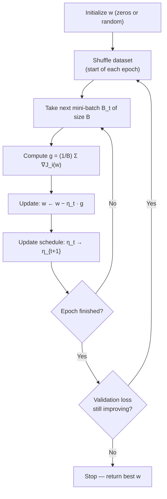
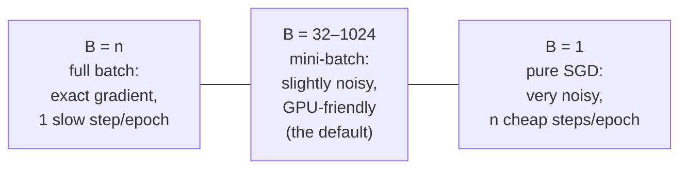
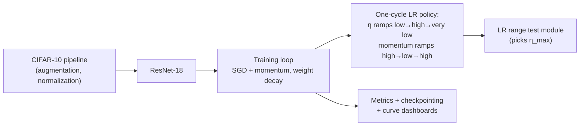

# 1.3 — Gradient Descent

> The optimization engine underneath 95% of modern ML. Every neural network you will ever train — including the largest language models — is fit by some descendant of the update rule in this chapter. Advanced variants (momentum, Adam, AdamW) get their own chapter in [Optimizers](../phase-2-deep-learning/05-optimizers.md); here we build the foundation deeply.

---

## 1. Overview

**What is it?** Gradient descent is an iterative algorithm for minimizing a differentiable function $J(\mathbf{w})$. Starting from an initial guess, it repeatedly takes a small step in the direction of steepest decrease — the negative gradient — until it reaches (or gets close to) a minimum:

$$
\mathbf{w} \leftarrow \mathbf{w} - \eta \nabla J(\mathbf{w})
$$

**Why does it exist?** Closed-form optima exist only for special losses — OLS with modest dimensionality being the canonical example from [Linear Regression](02-linear-regression.md). For logistic regression, neural networks, embeddings, boosting — anything non-linear or with millions to billions of parameters — no formula gives the answer. We need an *iterative* method, and gradient descent is the simplest one that scales.

**What problem does it solve?** Find $\mathbf{w}^* = \arg\min_\mathbf{w} J(\mathbf{w})$ for a differentiable loss $J: \mathbb{R}^d \to \mathbb{R}$, using only the ability to evaluate $J$ and its gradient — no matrix inversions, no second derivatives, no structure beyond smoothness.

**Where is it used?** Everywhere in modern ML: fitting logistic regression on billions of ad impressions, training convolutional networks for vision, pre-training and fine-tuning LLMs (as Adam/AdamW, which are gradient descent with adaptive per-coordinate step sizes), and learning embeddings for recommendation. The stochastic variant — SGD — is arguably the single most consequential algorithm in machine learning.

## 2. Learning Objectives

After this chapter you will be able to:

- Derive the gradient-descent update rule from a first-order Taylor expansion.
- Distinguish **batch**, **mini-batch**, and **stochastic** gradient descent, and articulate the cost/noise trade-off among them.
- Explain why the mini-batch gradient is an **unbiased estimator** of the full gradient.
- State the convergence rate of gradient descent for convex, $L$-smooth functions, and what strong convexity buys.
- Explain the role of the **learning rate** and diagnose too-high/too-low symptoms from loss curves.
- Implement and compare the standard **learning-rate schedules**: constant, step decay, exponential, cosine annealing, and warmup.
- Implement **backtracking line search** and explain when it is worth its cost.
- Explain conditioning: why ill-conditioned losses cause zig-zagging and how feature standardization helps.
- Implement mini-batch SGD from scratch in NumPy and with PyTorch's `torch.optim`.
- Choose batch size, learning rate, and schedule sensibly for a new problem.

## 3. Prerequisites

| Chapter | Why you need it |
|---|---|
| [Calculus](../phase-0-prerequisites/03-calculus.md) | Gradients, Taylor expansions, and convexity are the core objects here. |
| [Linear Algebra](../phase-0-prerequisites/02-linear-algebra.md) | Parameters are vectors; conditioning is an eigenvalue story. |
| [Probability & Statistics](../phase-0-prerequisites/04-probability-statistics.md) | SGD's correctness rests on unbiased estimation and expectations. |
| [NumPy & Pandas](../phase-0-prerequisites/05-numpy-pandas.md) | Vectorized gradient computations. |
| [Linear Regression](02-linear-regression.md) | Supplies our running example: the MSE loss and its gradient $\frac{1}{n}X^T(X\mathbf{w}-\mathbf{y})$. |
| [ML Fundamentals](01-ml-fundamentals.md) | Validation-based stopping is how we decide when to quit iterating. |

## 4. Intuition

You are blindfolded on a foggy mountain and want to reach the valley floor. You cannot see the terrain, but you can feel the slope under your feet. The sensible strategy: point yourself downhill and take a step; repeat. That is gradient descent — the gradient is the slope you feel, and the learning rate is the length of your stride.

The stride length matters enormously. Take baby steps and you will descend safely but need thousands of steps to reach the valley. Take giant leaps and you may jump clear across the valley and land *higher* on the opposite slope — then overshoot back, bouncing ever farther out. This is exactly what divergence looks like in training: the loss oscillates and then explodes to `NaN`.

Now for the stochastic twist, with an everyday story. Suppose you manage a restaurant and want to improve the menu using customer feedback. The "full-batch" approach reads *all 10,000 comment cards* before making one menu change — extremely reliable, extremely slow. The "stochastic" approach changes something after *every single card* — fast and responsive, but one grumpy customer can send you sideways. The "mini-batch" approach reads a random stack of 32 cards, adjusts, then grabs another stack: nearly as reliable a signal as the full read, at a fraction of the cost. That compromise — average a small random sample of the data to estimate the direction, step, resample — is mini-batch SGD, the default of all modern deep learning.

One more useful image: the noise in SGD is not purely a defect. A marble rolled down a bumpy surface with a bit of jitter can escape shallow dents that would trap a marble rolling deterministically. In non-convex landscapes (neural networks), SGD's noise helps escape saddle points and sharp, poorly generalizing minima.

## 5. Real-world Motivation

- **OpenAI, Google DeepMind, Meta, Anthropic** train every large language model with AdamW — gradient descent with momentum and per-coordinate adaptive learning rates — over billions of parameters and trillions of tokens, with warmup-plus-cosine-decay schedules almost universally.
- **Meta's ads and feed-ranking models** have historically been trained with large-scale (asynchronous/streaming) SGD on click data; the ability to update on data as it arrives is an SGD-family superpower no closed-form method has.
- **Google's early production systems** (e.g., the FTRL-based ad CTR models described in their published work) are direct industrial descendants of online gradient descent.
- **Netflix and Spotify** learn embedding models for recommendations by SGD on implicit-feedback data; matrix factorization by SGD famously starred in the Netflix Prize.
- **Tesla** trains vision networks for Autopilot with SGD-family optimizers on fleet data — no alternative optimizer class scales to that regime.

The common thread: when the dataset is huge and the model is non-linear, gradient descent variants are not merely the best option — they are essentially the *only* option.

## 6. Mathematical Foundations

### 6.1 Deriving the update rule from a Taylor expansion

Near the current point $\mathbf{w}_t$, a differentiable loss is approximated by its first-order Taylor expansion:

$$
J(\mathbf{w}_t + \Delta) \approx J(\mathbf{w}_t) + \nabla J(\mathbf{w}_t)^T \Delta
$$

where $\Delta \in \mathbb{R}^d$ is a small step and $\nabla J(\mathbf{w}_t)$ is the gradient — the vector of partial derivatives $\left(\frac{\partial J}{\partial w_1}, \dots, \frac{\partial J}{\partial w_d}\right)$. To decrease $J$ as fast as possible per unit of step length, choose $\Delta$ to minimize the inner product $\nabla J^T\Delta$ subject to $\|\Delta\| = \text{const}$: by Cauchy–Schwarz, the minimizer is $\Delta \propto -\nabla J(\mathbf{w}_t)$. Hence the **steepest-descent update**:

$$
\mathbf{w}_{t+1} = \mathbf{w}_t - \eta\, \nabla J(\mathbf{w}_t)
$$

with **learning rate** (step size) $\eta > 0$. The gradient points *uphill*; we move opposite to it.

### 6.2 Batch, stochastic, and mini-batch variants

In ML the loss is an average over $n$ examples, $J(\mathbf{w}) = \frac{1}{n}\sum_{i=1}^n J_i(\mathbf{w})$, where $J_i$ is the loss on example $i$.

**Batch (full) gradient descent** uses the entire dataset per step:

$$
\mathbf{w}_{t+1} = \mathbf{w}_t - \eta\, \nabla J(\mathbf{w}_t) \qquad \text{cost: } O(n)\ \text{gradient evaluations per step}
$$

**Stochastic gradient descent (SGD)** samples one index $i_t$ uniformly at random:

$$
\mathbf{w}_{t+1} = \mathbf{w}_t - \eta\, \nabla J_{i_t}(\mathbf{w}_t)
$$

**Mini-batch SGD** samples a batch $\mathcal{B}_t$ of size $B$:

$$
\mathbf{w}_{t+1} = \mathbf{w}_t - \eta \cdot \frac{1}{B}\sum_{i \in \mathcal{B}_t} \nabla J_i(\mathbf{w}_t)
$$

**Why stochastic estimates are legitimate:** because $i_t$ is uniform, $\mathbb{E}[\nabla J_{i_t}(\mathbf{w})] = \frac{1}{n}\sum_i \nabla J_i(\mathbf{w}) = \nabla J(\mathbf{w})$ — the sampled gradient is an **unbiased estimator** of the true gradient. Its variance shrinks like $1/B$ as the batch grows, which is the precise sense in which bigger batches give cleaner (but costlier) directions.

### 6.3 Convergence for convex, smooth functions

Call $J$ **$L$-smooth** if its gradient is $L$-Lipschitz: $\|\nabla J(\mathbf{u}) - \nabla J(\mathbf{v})\| \le L\|\mathbf{u}-\mathbf{v}\|$ for all $\mathbf{u},\mathbf{v}$ ($L$ measures maximum curvature). For convex, $L$-smooth $J$ and fixed step $\eta \le 1/L$, batch gradient descent satisfies

$$
J(\mathbf{w}_T) - J(\mathbf{w}^*) \;\le\; \frac{\|\mathbf{w}_0 - \mathbf{w}^*\|^2}{2\eta\, T}
$$

where $\mathbf{w}_0$ is the initialization, $\mathbf{w}^*$ the minimizer, and $T$ the iteration count. Read it as: error shrinks like $O(1/T)$; halving $\eta$ (while staying $\le 1/L$) doubles the iterations needed for the same error; starting closer helps quadratically.

If $J$ is additionally **$\mu$-strongly convex** (curves upward at least like $\frac{\mu}{2}\|\cdot\|^2$), the rate improves to *linear* (geometric) convergence: $\|\mathbf{w}_T - \mathbf{w}^*\|^2 \le \rho^T \|\mathbf{w}_0 - \mathbf{w}^*\|^2$ with $\rho = 1 - \mu/L < 1$. The ratio $\kappa = L/\mu$ is the **condition number**: large $\kappa$ (elongated, taco-shaped loss valleys) makes $\rho$ close to 1 — slow, zig-zagging progress. Feature standardization reduces $\kappa$ for linear models, which is *why* it accelerates training.

For SGD with constant $\eta$, iterates converge to a *noise ball* around $\mathbf{w}^*$ whose radius scales with $\eta\,\sigma^2/B$ ($\sigma^2$ = gradient-noise variance); convergence to $\mathbf{w}^*$ itself requires a decaying schedule satisfying the Robbins–Monro conditions $\sum_t \eta_t = \infty$, $\sum_t \eta_t^2 < \infty$ (e.g., $\eta_t \propto 1/t$).

### 6.4 Learning-rate schedules

Let $\eta_0$ be the initial rate, $t$ the step, $T$ the horizon:

| Schedule | Formula | Typical use |
|---|---|---|
| Constant | $\eta_t = \eta_0$ | convex problems, quick baselines |
| Step decay | $\eta_t = \eta_0\,\gamma^{\lfloor t/s\rfloor}$ (drop by factor $\gamma$ every $s$ steps) | classic CNN training |
| Exponential | $\eta_t = \eta_0\, e^{-kt}$ | smooth continuous decay |
| Cosine annealing | $\eta_t = \eta_{\min} + \tfrac{1}{2}(\eta_0 - \eta_{\min})\big(1 + \cos(\pi t/T)\big)$ | modern default for deep nets |
| Warmup + decay | linear ramp $0 \to \eta_0$ over $t_w$ steps, then decay | transformers, large-batch training |

**Why warmup?** Early in training, weights are near their random initialization and gradients can be large and poorly scaled; a full-size step can catapult the model into a bad region (or, for adaptive optimizers, corrupt their statistics). Ramping $\eta$ up over the first few hundred/thousand steps avoids this — standard practice for every transformer.

### 6.5 Backtracking line search

Instead of a fixed $\eta$, *search* for a step that provably decreases the loss. The **Armijo condition** accepts step size $\alpha$ along descent direction $\mathbf{d}$ (usually $-\nabla J$) if

$$
J(\mathbf{w} + \alpha\, \mathbf{d}) \;\le\; J(\mathbf{w}) + c\,\alpha\, \nabla J(\mathbf{w})^T \mathbf{d}
$$

with $c \in (0,1)$ small (e.g., $10^{-4}$) — i.e., the actual decrease is at least a $c$-fraction of what the linear approximation promises. Backtracking starts at $\alpha = \alpha_0$ and multiplies by $\rho \in (0,1)$ (e.g., 0.5) until the condition holds. It costs extra loss evaluations per step, so it is common in classical/deterministic optimization (and inside L-BFGS) but rare in mini-batch deep learning, where the noisy loss makes the test unreliable and schedules are cheaper.

## 7. Visual Explanation

Descent into a 1-D valley, in ASCII:

```
   J(w)
    |\
    | \  w0
    |  \ ●
    |   \ ↘ η∇J
    |    \  ●
    |     \  ↘
    |      \   ●
    |       \__↘_●___●●  ← converges near the minimum
    +---------------------------- w
        good η: steps shrink as slope flattens

   J(w)                        divergence (η too large):
    |  ●            ●
    |   \          /
    |    ●        ●         each bounce lands HIGHER
    |     \      /
    |      ●___●
    +---------------------------- w
```

The mini-batch training loop:



The batch-size spectrum:



## 8. Algorithm

Mini-batch SGD with a schedule and early stopping:

1. Standardize features (for linear models) so the loss surface is well-conditioned.
2. Initialize $\mathbf{w}_0$ (zeros for convex problems; small random values for neural nets).
3. For each epoch $e = 1, 2, \dots$:
   1. Shuffle the dataset (fresh random order each epoch — prevents cyclical bias).
   2. Partition into mini-batches of size $B$.
   3. For each batch $\mathcal{B}$: compute $g = \frac{1}{B}\sum_{i\in\mathcal{B}} \nabla J_i(\mathbf{w})$; update $\mathbf{w} \leftarrow \mathbf{w} - \eta_t\, g$; advance the schedule.
   4. Evaluate validation loss.
4. Stop when validation loss has not improved for $p$ epochs ("patience"); return the weights from the best epoch.

Pseudocode:

```text
procedure MINIBATCH_SGD(data, grad_fn, η0, B, max_epochs, patience):
    w ← init();  best ← ∞;  stale ← 0;  t ← 0
    for epoch in 1..max_epochs:
        shuffle(data)
        for batch in partition(data, B):
            g ← (1/B) · Σ_{i∈batch} grad_fn(w, i)     # unbiased estimate of ∇J
            η ← schedule(η0, t);  t ← t + 1
            w ← w − η · g
        v ← validation_loss(w)
        if v < best:  best ← v;  w_best ← w;  stale ← 0
        else:         stale ← stale + 1
        if stale ≥ patience: break                    # early stopping
    return w_best
```

## 9. Worked Example

**Tiny example, entirely by hand.** Minimize $J(w) = (w-3)^2$, a 1-D bowl with minimum at $w^*=3$. The gradient is $J'(w) = 2(w-3)$. Start at $w_0 = 0$ with $\eta = 0.1$:

| $t$ | $w_t$ | $J'(w_t) = 2(w_t - 3)$ | $w_{t+1} = w_t - 0.1\,J'(w_t)$ |
|---|---|---|---|
| 0 | 0.000 | −6.000 | $0 + 0.6 = 0.600$ |
| 1 | 0.600 | −4.800 | $0.6 + 0.48 = 1.080$ |
| 2 | 1.080 | −3.840 | $1.080 + 0.384 = 1.464$ |
| 3 | 1.464 | −3.072 | 1.771 |
| 10 | 2.668 | −0.664 | 2.734 |

Each step multiplies the error $(w_t - 3)$ by exactly $1 - 2\eta = 0.8$: geometric convergence, $w_t = 3 - 3\,(0.8)^t$. Notice the theory in action: with $\eta = 0.5$ the factor is $1 - 2(0.5) = 0$ — one perfect step (this quadratic's ideal rate is $1/L$ with $L=2$); with $\eta = 1.1$ the factor is $-1.2$ — the iterates *alternate sign and grow*: divergence.

**Realistic example.** Training logistic regression ([next chapter](04-logistic-regression.md)) on a 100-million-row fraud dataset: the closed-form route does not exist, and even one full-batch gradient costs a full pass over 100M rows. Mini-batch SGD with $B = 512$ makes ~195,000 updates per epoch, typically reaching near-optimal validation loss within 1–2 epochs — minutes on commodity hardware, streaming from disk, never holding the dataset in memory.

## 10. Python from Scratch

A reusable mini-batch SGD and backtracking line search, NumPy only:

```python
import numpy as np

def sgd(grad_fn, w0, X, y, lr=0.01, batch_size=32, epochs=10,
        schedule=None, seed=0):
    """Generic mini-batch SGD.
    grad_fn(w, X_batch, y_batch) -> gradient vector, shape (d,)
    schedule(t) -> multiplier applied to lr at global step t (or None)."""
    w = np.array(w0, dtype=float)            # (d,) — copy, don't alias caller's array
    n = len(X)
    rng = np.random.default_rng(seed)        # seeded → reproducible runs
    t = 0                                    # global step counter for the schedule
    for epoch in range(epochs):
        idx = rng.permutation(n)             # fresh shuffle EVERY epoch
        for start in range(0, n, batch_size):
            b = idx[start:start + batch_size]        # batch indices, ≤ B of them
            g = grad_fn(w, X[b], y[b])               # unbiased gradient estimate
            eta = lr * (schedule(t) if schedule else 1.0)
            w -= eta * g                             # the descent step
            t += 1
    return w

def cosine_schedule(total_steps, warmup=0, eta_min_frac=0.0):
    """Returns multiplier(t): linear warmup then cosine decay to eta_min_frac."""
    def mult(t):
        if t < warmup:                       # linear ramp 0 → 1
            return (t + 1) / warmup
        p = (t - warmup) / max(1, total_steps - warmup)   # progress in [0, 1]
        return eta_min_frac + 0.5 * (1 - eta_min_frac) * (1 + np.cos(np.pi * p))
    return mult

# --- demo: linear regression by SGD (gradient from Chapter 1.2) ---
rng = np.random.default_rng(0)
X = rng.normal(size=(1000, 5))
w_true = np.array([2.0, -1.0, 0.5, 0.0, 3.0])
y = X @ w_true + rng.normal(scale=0.1, size=1000)

def mse_grad(w, Xb, yb):
    return Xb.T @ (Xb @ w - yb) / len(Xb)    # (d,): (1/B) Xᵀ(Xw − y)

steps = (1000 // 32 + 1) * 20                # total updates over 20 epochs
w_hat = sgd(mse_grad, np.zeros(5), X, y, lr=0.1, batch_size=32,
            epochs=20, schedule=cosine_schedule(steps, warmup=50))
print(np.round(w_hat, 3))
# Expected output ≈ [ 2.0  -1.0   0.5   0.0   3.0 ]  (± ~0.01)
```

Backtracking line search for the deterministic (full-batch) setting:

```python
def backtracking_line_search(f, grad_f, w, direction, alpha=1.0, c=1e-4, rho=0.5):
    """Shrink alpha until the Armijo sufficient-decrease condition holds.
    direction should be a descent direction (e.g., -grad_f(w))."""
    fw = f(w)                                # loss at current point (1 evaluation)
    slope = grad_f(w) @ direction            # directional derivative; < 0 required
    while f(w + alpha * direction) > fw + c * alpha * slope:
        alpha *= rho                         # halve the step until enough decrease
    return alpha                             # guaranteed to terminate for smooth f
```

Complexity: each SGD update costs $O(Bd)$ for a linear model (one matvec with the batch); the line search adds one loss evaluation per halving. **Common bug:** slicing batches from the *unshuffled* array (`X[start:start+B]` instead of `X[idx[...]]`) — if the file was sorted by label, every batch is single-class and training oscillates wildly. Another classic: forgetting that the last batch may be smaller than `B`, so dividing by `batch_size` instead of `len(Xb)` inflates its gradient.

## 11. Library Implementation

The same loop with PyTorch — this exact pattern is the skeleton of all deep-learning training:

```python
import torch
from torch.utils.data import DataLoader, TensorDataset

# Data as tensors; DataLoader handles shuffling + batching for us.
ds = TensorDataset(torch.tensor(X, dtype=torch.float32),
                   torch.tensor(y, dtype=torch.float32))
loader = DataLoader(ds, batch_size=32, shuffle=True)   # shuffle=True is essential

model = torch.nn.Linear(5, 1)                    # w ∈ R^{5×1}, b ∈ R — same model as Ch. 1.2
loss_fn = torch.nn.MSELoss()                     # mean squared error

# SGD with momentum and weight decay (L2) — the classical production recipe.
opt = torch.optim.SGD(model.parameters(), lr=0.1, momentum=0.9, weight_decay=1e-4)
# Cosine annealing over 20 epochs (schedule stepped once per epoch here).
sched = torch.optim.lr_scheduler.CosineAnnealingLR(opt, T_max=20)

for epoch in range(20):
    for xb, yb in loader:                        # xb: (32, 5), yb: (32,)
        opt.zero_grad()                          # clear stale gradients (bug #1 if missing!)
        pred = model(xb).squeeze(-1)             # (32,) — drop the trailing dim of (32,1)
        loss = loss_fn(pred, yb)                 # scalar
        loss.backward()                          # autodiff fills p.grad for every parameter
        opt.step()                               # w ← w − η(g + momentum + decay terms)
    sched.step()                                 # advance the LR schedule
    # Expected: loss falls from ~14 to ~0.01 (the 0.1² noise floor) within a few epochs

print(model.weight.data, model.bias.data)        # ≈ w_true and ≈ 0
```

Line-by-line: `zero_grad()` is required because PyTorch *accumulates* gradients into `.grad` across backward calls; `backward()` computes gradients via autodiff (mechanics in [Backpropagation](../phase-2-deep-learning/02-backpropagation.md)); `step()` applies the update; the scheduler multiplies the learning rate according to the cosine curve. `weight_decay` implements L2 regularization inside the optimizer (see [Regularization](05-regularization.md) for the subtleties).

## 12. Code Walkthrough

Shapes and intermediates for the PyTorch loop ($n = 1000$, $d = 5$, $B = 32$):

| Tensor | Shape | Meaning |
|---|---|---|
| `xb` | (32, 5) | one mini-batch of features |
| `yb` | (32,) | matching targets |
| `model.weight` | (1, 5) | weight matrix of the linear layer |
| `model.bias` | (1,) | intercept |
| `model(xb)` | (32, 1) | raw predictions (note the trailing dim) |
| `pred` | (32,) | after `squeeze(-1)` — must match `yb`'s shape |
| `loss` | scalar | mean squared error over the batch |
| `p.grad` for weight | (1, 5) | gradient filled by `backward()` |

Expected results: with `lr=0.1`, the epoch-average loss drops below 0.05 by epoch 3 and settles near 0.01 — the injected noise variance ($0.1^2$), the irreducible floor. **Watch for the silent shape bug:** without `squeeze`, `MSELoss` broadcasts `(32,1)` against `(32,)` into a `(32,32)` matrix of pairwise errors — the code runs, the loss is wrong, and the model trains badly. Newer PyTorch warns; never ignore that warning.

## 13. Complexity Analysis

- **Per update:** $O(B \times \text{cost of one example's gradient})$. For a linear model with $d$ features that is $O(Bd)$; for a neural network it is $O(B \times (\text{forward} + \text{backward}))$, with backward ≈ 2× forward.
- **Per epoch:** all variants touch each example once, so an epoch costs $O(n d)$ for a linear model *regardless of $B$* — what changes is the number of parameter updates per epoch ($n/B$) and hardware efficiency (large $B$ amortizes GPU kernel launches and uses matrix–matrix rather than matrix–vector products).
- **Total to accuracy $\varepsilon$ (convex case):** full-batch GD needs $O(1/\varepsilon)$ iterations at $O(n)$ gradient cost each; SGD needs $O(1/\varepsilon^2)$ updates at $O(1)$ cost each (with decaying steps). For large $n$ and moderate accuracy — exactly the ML regime — SGD wins, which is the deep reason it dominates.
- **Space:** $O(d)$ for parameters and the gradient. Autodiff adds $O(\text{activations})$ memory for the backward pass (reducible via gradient checkpointing, §18). Nothing here needs the $O(d^2)$ matrices of the [normal equations](02-linear-regression.md).

## 14. Advantages

- **Scales to arbitrary data sizes.** Mini-batch SGD streams data from disk; nothing requires the dataset in memory — how ad-click models train on billions of rows daily.
- **Model-agnostic.** Anywhere you can compute a gradient — linear models, CNNs, transformers, embeddings — the same update rule applies. One algorithm, the entire field.
- **Cheap per step.** $O(Bd)$ beats the $O(nd^2 + d^3)$ of closed forms as soon as $d$ or $n$ is large; GPT-scale models have $d \sim 10^{11}$ parameters, where forming $X^TX$ is unthinkable.
- **Noise helps in non-convex landscapes.** SGD's stochasticity escapes saddle points and tends toward flatter minima that generalize better — an empirical pillar of deep learning practice.
- **Online/streaming learning.** A fraud model can update on this morning's transactions without retraining from scratch — impossible for one-shot analytic solutions.

## 15. Disadvantages

- **Learning-rate sensitivity.** The single most fragile hyperparameter in ML: 10× too high diverges to `NaN`; 10× too low wastes 10× the compute. Schedules and adaptive optimizers mitigate but don't eliminate this.
- **Ill-conditioning slows it badly.** On loss surfaces with condition number $\kappa$, plain GD needs $O(\kappa)$ iterations — a taco-shaped valley makes it zig-zag across the steep axis while crawling along the shallow one. Standardization, momentum, and preconditioning (Adam) are the antidotes.
- **No natural stopping criterion.** The gradient never hits exactly zero in stochastic mode; you must impose validation-based early stopping.
- **Only finds local minima / stationary points.** For non-convex losses there is no global guarantee — acceptable in deep learning practice, but a real limitation for problems needing certified optima.
- **Hyperparameter interactions.** Batch size, learning rate, schedule, and momentum interact (e.g., doubling $B$ often warrants raising $\eta$), multiplying the tuning burden.

## 16. Common Mistakes

- **Learning rate too high → `NaN`s; too low → flat loss curve.** *Fix:* run an LR range test (sweep $\eta$ over a few orders of magnitude for a few hundred steps; pick a value below where loss stops improving/starts exploding).
- **Not shuffling each epoch.** Data sorted by class/time yields correlated, biased batch gradients and oscillating loss. *Fix:* fresh permutation per epoch (`shuffle=True` in `DataLoader`).
- **Forgetting `opt.zero_grad()`.** PyTorch accumulates gradients; without zeroing, each step applies the *sum* of all past gradients. Symptom: loss decreases briefly, then blows up. *Fix:* zero at the top of every iteration.
- **Mixing `mean` vs. `sum` loss reduction.** With `sum`, the gradient — and thus the effective learning rate — scales with batch size; change $B$ and training silently changes. *Fix:* use `mean` reduction (the $\frac{1}{B}$ in our formulas).
- **Comparing runs with different implicit budgets.** "Big batches converge in fewer epochs" can be an artifact of fewer updates. *Fix:* compare at equal wall-clock or equal update counts.
- **Skipping standardization for linear models.** Features on scales of 1 vs. 10,000 create extreme conditioning; GD crawls. *Fix:* standardize (fit on train only — [Chapter 1.1](01-ml-fundamentals.md)).

## 17. Best Practices

- [ ] Standardize inputs; for deep nets, use appropriate initialization and normalization layers.
- [ ] Start with mini-batch size 32–256; scale up only with hardware justification (and adjust $\eta$ when you do).
- [ ] Always use a schedule for long runs: warmup (transformers especially) + cosine or step decay.
- [ ] Log training *and* validation loss every epoch; base stopping on validation, keep the best checkpoint.
- [ ] Fix seeds and log every hyperparameter; loss-curve comparisons are meaningless otherwise.
- [ ] Clip gradients (`torch.nn.utils.clip_grad_norm_`) when training RNNs/transformers or whenever spikes appear.
- [ ] Diagnose from curve shape: explosion → lower $\eta$/clip; plateau from step 0 → raise $\eta$ or fix data/scaling; noisy but trending down → normal for SGD.
- [ ] Smoke-test any new pipeline by overfitting a tiny subset (e.g., 100 samples) to ~zero loss — if it can't, the bug is in the code, not the hyperparameters.

> [!TIP]
> When something is wrong, the loss curve is your stethoscope. Learn the four canonical shapes: diverging (η too high), flat (η too low or dead gradients), smooth-then-rising validation (overfitting — stop earlier or regularize), and noisy-but-descending (healthy SGD).

## 18. Optimization Techniques

- **Momentum / Nesterov:** accumulate an exponential moving average of gradients; damps zig-zag across steep directions and accelerates along shallow ones. Covered fully in [Optimizers](../phase-2-deep-learning/05-optimizers.md).
- **Adaptive methods (AdaGrad/RMSProp/Adam):** per-coordinate step sizes from gradient statistics — approximate preconditioning that tames bad conditioning automatically.
- **Gradient clipping:** rescale the gradient when its norm exceeds a threshold; insurance against loss spikes in deep/recurrent models.
- **Batch-size ↔ LR scaling:** when multiplying batch size by $k$, scale $\eta$ up (linear scaling rule, with warmup) to keep the effective noise level comparable — the trick behind large-batch ImageNet training.
- **LR range test / one-cycle:** Leslie Smith's technique to find good $\eta$ empirically in minutes, and the one-cycle schedule that exploits it for "super-convergence."
- **Mixed precision (AMP):** compute forward/backward in FP16/BF16 with FP32 master weights — ~2× throughput and half the memory on modern GPUs, numerically safe with loss scaling.
- **Gradient checkpointing:** trade compute for memory by recomputing activations during backward — enables training models that otherwise don't fit.
- **Gradient accumulation:** simulate large batches on small GPUs by summing gradients over $k$ micro-batches before stepping (remember to divide by $k$).

## 19. Industry Applications

- **LLM training:** OpenAI's GPT series, Meta's Llama models, and Anthropic's Claude models are trained with AdamW (a gradient-descent variant) under warmup + cosine/linear decay schedules over trillions of tokens.
- **Ads and feeds:** Google's published FTRL work and Meta's ranking systems descend directly from online/streaming gradient descent on click data.
- **Recommendations:** Netflix (matrix factorization since the Netflix Prize) and Spotify learn user/item embeddings with SGD on implicit feedback.
- **Vision in production:** Tesla's Autopilot networks and virtually all industrial CNNs are trained with SGD + momentum or AdamW.
- **Speech and translation:** Microsoft's and Google's speech/translation stacks moved to end-to-end networks in the mid-2010s — feasible only because SGD scales where classical solvers cannot.

## 20. Interview Questions

### Beginner

**Q: Explain gradient descent in one paragraph, including the role of the learning rate.**
A: Gradient descent minimizes a differentiable loss by repeatedly stepping opposite the gradient — the direction of steepest local increase: $\mathbf{w} \leftarrow \mathbf{w} - \eta\nabla J(\mathbf{w})$. The learning rate $\eta$ scales the step: too small wastes iterations; too large overshoots and can diverge. It stops when the gradient is (near) zero — a stationary point.

**Q: What is the difference between batch, mini-batch, and stochastic gradient descent?**
A: They differ in how much data estimates each gradient: batch uses all $n$ examples (exact, expensive), SGD uses one (noisy, cheap), mini-batch uses $B$ examples (nearly as accurate as batch at a fraction of the cost, and hardware-friendly). Mini-batch is the modern default.

**Q: Why do we shuffle the data every epoch?**
A: To keep batch gradients unbiased and decorrelated across steps. Data ordered by class or time yields batches whose gradients systematically point in skewed directions, causing oscillation and slower convergence; fresh shuffling restores the i.i.d.-sampling assumption behind SGD's guarantees.

**Q: What happens if the learning rate is too large? Too small?**
A: Too large: updates overshoot the minimum; on a quadratic, error is multiplied by $|1 - \eta L| > 1$ each step, so loss oscillates and explodes (in practice, `NaN`). Too small: convergence is provably correct but needs proportionally many more iterations — training appears frozen.

**Q: Does gradient descent always find the global minimum?**
A: Only for convex losses (any stationary point is global). For non-convex losses like neural networks it finds a stationary point — possibly a local minimum or saddle. Empirically, SGD's noise plus overparameterization makes the minima found in deep learning good enough, but there is no global guarantee.

### Intermediate

**Q: Derive the update rule from a first-order Taylor expansion.**
A: $J(\mathbf{w} + \Delta) \approx J(\mathbf{w}) + \nabla J^T\Delta$. Minimizing the linear term over steps of fixed length: by Cauchy–Schwarz, $\nabla J^T\Delta \ge -\|\nabla J\|\|\Delta\|$ with equality iff $\Delta \propto -\nabla J$. So the steepest-descent step is $\Delta = -\eta\nabla J$, valid while the linear approximation holds — hence small $\eta$, and formally $\eta \le 1/L$ for $L$-smooth losses.

**Q: Why is the mini-batch gradient an unbiased estimator, and why does that matter?**
A: With uniform sampling, $\mathbb{E}[\nabla J_i(\mathbf{w})] = \frac{1}{n}\sum_i \nabla J_i(\mathbf{w}) = \nabla J(\mathbf{w})$; averaging $B$ such terms stays unbiased with variance $\propto 1/B$. Unbiasedness means the *expected* step is the true descent step, so the noise averages out over iterations — this is the foundation of every SGD convergence proof (Robbins–Monro).

**Q: State the convergence rate of GD for convex, $L$-smooth functions and interpret it.**
A: With $\eta \le 1/L$: $J(\mathbf{w}_T) - J^* \le \frac{\|\mathbf{w}_0 - \mathbf{w}^*\|^2}{2\eta T}$ — sublinear $O(1/T)$. Doubling iterations halves the error bound; the largest safe step is set by the maximum curvature $L$. Adding $\mu$-strong convexity upgrades this to geometric convergence with rate $1 - \mu/L$, so the condition number $\kappa = L/\mu$ governs iteration counts.

**Q: What is a learning-rate schedule? Give three examples and when you'd use each.**
A: A rule making $\eta$ depend on the step. (1) Step decay (drop 10× at fixed milestones) — classic CNN recipes; (2) cosine annealing — smooth decay to near zero, the modern deep-learning default; (3) warmup + decay — linear ramp first, essential for transformers and large batches, where full-size early steps destabilize training. Decay lets you start fast and finish precisely, shrinking SGD's noise ball.

**Q: How does batch size affect optimization and generalization?**
A: Larger $B$ reduces gradient variance ($\propto 1/B$) and improves hardware utilization, but yields fewer updates per epoch and less exploration noise; very large batches can converge to sharper minima that generalize slightly worse unless the learning rate is scaled up (linear scaling rule) and warmup is used. Small $B$ gives noisy, regularizing updates but poor GPU efficiency. The sweet spot is usually 32–1024.

### Advanced

**Q: Why does plain GD zig-zag on ill-conditioned problems, and what is the precise dependence on the condition number?**
A: On a quadratic with Hessian eigenvalues $\mu \le \dots \le L$, the safe step is limited by the steepest direction ($\eta \le 2/L$ for stability), but progress along the shallowest direction then shrinks error by only $1 - \eta\mu \approx 1 - \mu/L$ per step. The iterates bounce across the steep axis while inching along the valley floor, and reaching accuracy $\varepsilon$ needs $O(\kappa\log(1/\varepsilon))$ iterations with $\kappa = L/\mu$. Momentum improves this to $O(\sqrt{\kappa}\log(1/\varepsilon))$; preconditioning attacks $\kappa$ itself.

**Q: Why doesn't constant-step SGD converge to the exact minimum, and what fixes it?**
A: At $\mathbf{w}^*$ the full gradient is zero but individual $\nabla J_i(\mathbf{w}^*)$ are not, so updates keep jittering — the iterates reach a stationary distribution ("noise ball") with radius $\propto \sqrt{\eta\sigma^2/B}$. Fixes: decay $\eta_t$ per Robbins–Monro ($\sum\eta_t = \infty$, $\sum\eta_t^2 < \infty$), average the iterates (Polyak–Ruppert), or grow the batch size over training.

**Q: What are saddle points, and why is SGD better at escaping them than full-batch GD?**
A: Points with zero gradient that are minima along some directions and maxima along others — in high dimensions they vastly outnumber local minima. Exact GD can stall on the unstable manifold since the gradient there is tiny; SGD's noise almost surely perturbs the iterate off it, after which the descent direction is exponentially amplified. This is a key reason noisy first-order methods work so well in deep learning.

**Q: Explain warmup: what specifically goes wrong without it in transformer training?**
A: At initialization, gradient magnitudes are poorly calibrated and, for adaptive optimizers like Adam, the second-moment estimates are computed from very few samples — so early effective steps can be enormous, catapulting weights into regions with saturated attention/softmax units from which recovery is slow (or loss diverges). A linear ramp over the first thousands of steps keeps early updates small until statistics stabilize; empirically transformers often fail to train at all without it.

**Q: Derive the effect of `sum` vs. `mean` loss reduction on the effective learning rate.**
A: With mean reduction, $J = \frac{1}{B}\sum_i \ell_i$ and $\nabla J$ is batch-size independent in expectation. With sum reduction, $J = \sum_i \ell_i = B \cdot J_{\text{mean}}$, so the gradient — and hence the step $\eta\nabla J$ — is $B$ times larger: switching $B$ from 32 to 256 silently multiplies the effective learning rate by 8. Always fix the reduction convention before tuning $\eta$.

**Q: When is backtracking line search worth it, and why is it rarely used in deep learning?**
A: Worth it in deterministic, full-batch settings (classical convex problems, L-BFGS) where each extra loss evaluation is cheap relative to reliable step-size selection and no tuning is desired. In mini-batch deep learning, the Armijo test compares *noisy* loss values (a decrease may be sampling luck), each test costs an extra forward pass, and cheap schedules plus adaptive optimizers achieve similar robustness — so schedules won.

## 21. Coding Exercises

### Easy

1. **Three variants, one plot.** Implement full-batch, mini-batch ($B=32$), and pure SGD on linear-regression data; plot loss vs. *examples processed* (not steps) for all three. *Hint:* the x-axis choice is the whole point — steps flatter SGD, epochs flatter batch.
2. **Divergence demo.** On $J(w) = (w-3)^2$, run GD with $\eta \in \{0.1, 0.5, 0.9, 1.1\}$ and tabulate $w_t$ for 10 steps each. *Hint:* the error multiplier is $1 - 2\eta$; predict each column before running.

### Medium

1. **Momentum & Nesterov from scratch.** Add velocity $v \leftarrow \beta v + g$, $w \leftarrow w - \eta v$ (and the Nesterov look-ahead variant) to your SGD; compare trajectories on an ill-conditioned 2-D quadratic ($\lambda_1/\lambda_2 = 100$) with a contour plot. *Hint:* plain GD zig-zags visibly; momentum's path is a smooth curve.
2. **Cosine schedule with warmup.** Implement it, verify the multiplier at $t = 0$, $t_w$, $T/2$, $T$ against hand-computed values, and show on a real task that warmup prevents early loss spikes at high $\eta_0$. *Hint:* the multiplier at $T/2$ (after warmup, with $\eta_{\min}=0$) is 0.5.
3. **LR range test.** Increase $\eta$ exponentially each step from $10^{-6}$ to $10$ while training on MNIST logistic regression; plot loss vs. $\eta$ (log axis) and pick the value one decade below the explosion point. *Hint:* smooth the loss curve (EMA) before reading it.

### Hard

1. **Convergence-rate verification.** For a strongly convex quadratic with known $\mu, L$, verify empirically that GD's error contracts per step at the theoretical rate, and that momentum with textbook parameters achieves the $\sqrt{\kappa}$ acceleration. *Hint:* plot $\log\|\mathbf{w}_t - \mathbf{w}^*\|$ — geometric rates are straight lines; compare slopes.
2. **Noise-ball measurement.** Run constant-step SGD to stationarity on linear regression; estimate the stationary error $\mathbb{E}\|\mathbf{w}_t - \mathbf{w}^*\|^2$ for $\eta \in \{0.01, 0.05, 0.1\}$ and $B \in \{1, 8, 64\}$, and verify the $\propto \eta/B$ scaling. *Hint:* average over the last few thousand iterates and over several seeds.

## 22. Mini Project

**MNIST logistic regression with your own SGD.**

1. Load MNIST (flatten images to 784-dim vectors; scale pixels to [0, 1]).
2. Implement multinomial logistic regression's loss and gradient in NumPy (formulas in [Logistic Regression](04-logistic-regression.md); the gradient is $\frac{1}{B}X^T(\hat P - Y)$).
3. Train with your from-scratch mini-batch SGD: $B = 64$, constant $\eta = 0.1$, 10 epochs; log training and validation loss per epoch.
4. Add a cosine schedule and compare final accuracy against the constant rate.
5. Target: > 90% test accuracy. Deliver loss curves and a table of (schedule, final accuracy).

## 23. Medium Project

**An optimizer benchmark suite.**

1. Implement five optimizers from scratch in NumPy: SGD, SGD+momentum, Nesterov, AdaGrad, Adam (formulas in [Optimizers](../phase-2-deep-learning/05-optimizers.md)).
2. Build a 2-layer MLP (from-scratch forward/backward, or PyTorch with your optimizers plugged in) for Fashion-MNIST.
3. For each optimizer, run an LR range test to pick its learning rate fairly — never reuse one $\eta$ across optimizers.
4. Train each for an equal update budget over 3 seeds; record loss/accuracy curves with mean ± std bands.
5. Also benchmark all five on the ill-conditioned Rosenbrock function with trajectory plots.
6. Deliver a report ranking optimizers per task, with a paragraph on *why* the ranking differs between the MLP and Rosenbrock.

## 24. Advanced Project

**Reproduce "super-convergence" with the one-cycle policy.**

Architecture:



Implementation phases:

1. **Baseline:** ResNet-18 on CIFAR-10 with a standard recipe (SGD momentum 0.9, weight decay $5\times10^{-4}$, step decay, ~100+ epochs); record accuracy and wall-clock.
2. **LR range test:** implement Leslie Smith's test to find $\eta_{\max}$; document the loss-vs-LR curve and your selection rule.
3. **One-cycle:** implement the policy (LR up then down over one cycle, inverse-cycled momentum); train for ≤ 50 epochs targeting ≥ 94% test accuracy — matching the baseline in a fraction of the epochs.
4. **Analysis:** ablate cycle length, $\eta_{\max}$, and weight decay; plot the schedule against validation accuracy over training.

Possible improvements: add mixed-precision training and measure the speedup; scale batch size with the linear-scaling rule and re-tune; compare against AdamW + cosine under the same budget.

## 25. Summary

- Gradient descent minimizes differentiable losses by iterating $\mathbf{w} \leftarrow \mathbf{w} - \eta\nabla J(\mathbf{w})$ — the steepest-descent step from a first-order Taylor argument.
- **Batch** GD uses all data per step; **SGD** uses one sample; **mini-batch** ($B \approx 32$–1024) is the modern default — unbiased gradients with variance $\propto 1/B$ at GPU-friendly cost.
- Convex + $L$-smooth with $\eta \le 1/L$ ⇒ error $O(1/T)$; strong convexity ⇒ geometric convergence at rate governed by the condition number $\kappa = L/\mu$.
- Ill-conditioning causes zig-zagging and $O(\kappa)$ iteration counts; standardize features, use momentum, or precondition (Adam).
- Constant-step SGD converges to a noise ball of radius $\propto\sqrt{\eta/B}$; decay the learning rate (or average iterates) to converge fully.
- Schedules matter: step decay, cosine annealing, and especially **warmup** for transformers and large batches.
- Backtracking line search gives principled steps in deterministic settings but is rarely used with noisy mini-batches.
- The four loss-curve pathologies — explosion, flatline, validation divergence, healthy noise — diagnose most training problems.
- `zero_grad()`, per-epoch shuffling, and `mean` reduction are the three most common implementation bugs.
- Per-update cost is $O(Bd)$ for linear models; nothing ever requires the $O(d^3)$ solves of closed-form methods — which is why gradient methods run at GPT scale.

## 26. Cheat Sheet

**Key formulas**

| Item | Formula |
|---|---|
| Update rule | $\mathbf{w}_{t+1} = \mathbf{w}_t - \eta\nabla J(\mathbf{w}_t)$ |
| Mini-batch gradient | $g = \frac{1}{B}\sum_{i\in\mathcal{B}}\nabla J_i(\mathbf{w})$, $\mathbb{E}[g] = \nabla J$ |
| Convex rate ($\eta \le 1/L$) | $J(\mathbf{w}_T) - J^* \le \frac{\|\mathbf{w}_0-\mathbf{w}^*\|^2}{2\eta T}$ |
| Strongly convex rate | error $\times\,(1 - \mu/L)$ per step |
| Cosine annealing | $\eta_t = \eta_{\min} + \frac{1}{2}(\eta_0-\eta_{\min})(1+\cos(\pi t/T))$ |
| Armijo condition | $J(\mathbf{w}+\alpha \mathbf{d}) \le J(\mathbf{w}) + c\,\alpha\,\nabla J^T\mathbf{d}$ |

**Defaults**

- Batch size 32–256; $\eta$: 0.1 (SGD+momentum on standardized data), 1e-3 (Adam).
- Schedule: cosine decay; add warmup (~1–5% of steps) for transformers/large batches.
- Early stopping on validation loss with patience 5–10 epochs; keep the best checkpoint.

**One-liner tips**

- LR range test before any long run — it costs minutes and saves days.
- Doubling batch size? Consider raising $\eta$ (up to linearly) and adding warmup.
- Overfit 100 samples to ~zero loss as a pipeline smoke test.

**Gotchas**

- Missing `zero_grad()` → accumulated gradients → mysterious blow-up.
- `sum` reduction couples effective LR to batch size.
- Unshuffled sorted data → single-class batches → oscillating loss.
- `(B,1)` vs `(B,)` shape mismatch broadcasting inside the loss.

## 27. Further Reading

**Books**

- *Deep Learning* — Goodfellow, Bengio, Courville (Ch. 4 and 8: numerical optimization and training).
- *Convex Optimization* — Boyd & Vandenberghe (Ch. 9: unconstrained minimization, line search).
- *Optimization for Machine Learning* — Sra, Nowozin, Wright.

**Research Papers**

- Robbins & Monro (1951), "A Stochastic Approximation Method" — the birth of SGD.
- Bottou, Curtis, Nocedal (2018), "Optimization Methods for Large-Scale Machine Learning" — the definitive survey.
- Smith (2017), "Cyclical Learning Rates for Training Neural Networks"; Smith & Topin (2018), "Super-Convergence."
- Goyal et al. (2017), "Accurate, Large Minibatch SGD: Training ImageNet in 1 Hour" — the linear scaling rule + warmup.
- Loshchilov & Hutter (2017), "SGDR: Stochastic Gradient Descent with Warm Restarts" — cosine annealing.

**Documentation**

- PyTorch docs: `torch.optim`, `torch.optim.lr_scheduler`.
- scikit-learn User Guide: `SGDRegressor` / `SGDClassifier`.

**GitHub Repositories**

- `pytorch/pytorch` — optimizer implementations in `torch/optim` are short and readable.
- `davidcpage/cifar10-fast` — engineering fast CIFAR-10 training end to end.

**Datasets**

- MNIST, Fashion-MNIST, CIFAR-10 — the standard optimization sandboxes.

**YouTube / Videos**

- 3Blue1Brown — "Gradient descent, how neural networks learn."
- Andrej Karpathy — "Neural Networks: Zero to Hero" (training loops and their bugs, live).
- Stanford CS231n lectures on optimization.

**Blogs**

- Sebastian Ruder — "An overview of gradient descent optimization algorithms."
- Distill.pub — "Why Momentum Really Works."
- Karpathy — "A Recipe for Training Neural Networks."
