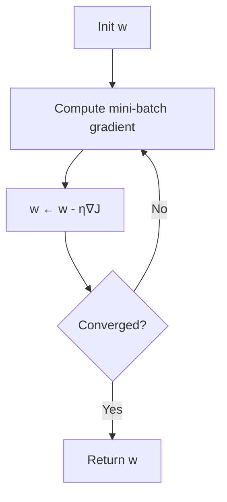

# 1.3 — Gradient Descent

> The optimization engine underneath 95% of modern ML. Understand it deeply — variants (SGD, momentum, Adam) get their own file in Phase 2.

---

## 1. Intuition first

You are blindfolded on a foggy mountain and want to reach the valley. At every step you feel the slope under your feet and step **downhill**. That is gradient descent.

For a smooth loss $J(\mathbf{w})$, the gradient $\nabla J(\mathbf{w})$ points uphill. Move opposite to it:

$$
\mathbf{w} \leftarrow \mathbf{w} - \eta \nabla J(\mathbf{w})
$$

Learning rate $\eta$ controls step size. Too big → overshoot. Too small → glacial progress.

## 2. Why the topic exists

Closed-form optima only exist for special losses (OLS with small $d$). For neural nets, boosting, logistic regression, embeddings — anything with millions of parameters or non-linear structure — we need an **iterative** optimizer. Gradient descent is the simplest one that scales.

## 3. What problem it solves

Minimize a differentiable loss $J: \mathbb{R}^d \to \mathbb{R}$:

$$
\mathbf{w}^* = \arg\min_\mathbf{w} J(\mathbf{w})
$$

## 4. Mathematics

### 4.1 Batch (a.k.a. full) gradient descent

$$
\mathbf{w}_{t+1} = \mathbf{w}_t - \eta \nabla J(\mathbf{w}_t)
$$

Uses the **entire dataset** to compute one gradient step.

### 4.2 Stochastic gradient descent (SGD)

Approximate $\nabla J$ by one random sample $i_t$:

$$
\mathbf{w}_{t+1} = \mathbf{w}_t - \eta \nabla J_{i_t}(\mathbf{w}_t)
$$

Noisy but fast; escapes shallow local minima.

### 4.3 Mini-batch SGD

Compromise using a batch of $B$ samples:

$$
\mathbf{w}_{t+1} = \mathbf{w}_t - \eta \cdot \frac{1}{B}\sum_{i \in \mathcal{B}_t} \nabla J_i(\mathbf{w}_t)
$$

Modern DL default. GPU-friendly.

### 4.4 Convergence theorem (convex case)

For convex $L$-smooth $J$ and $\eta \leq 1/L$:

$$
J(\mathbf{w}_T) - J(\mathbf{w}^*) \leq \frac{\|\mathbf{w}_0 - \mathbf{w}^*\|^2}{2\eta T}
$$

Rate $O(1/T)$. Strongly convex → $O(\rho^T)$ linear rate.

### 4.5 Learning-rate schedules

- Constant.
- Step decay: $\eta_t = \eta_0 \cdot \gamma^{\lfloor t / s \rfloor}$.
- Exponential: $\eta_t = \eta_0 e^{-kt}$.
- Cosine annealing: $\eta_t = \eta_{\min} + \tfrac{1}{2}(\eta_0 - \eta_{\min})(1 + \cos(\pi t/T))$.
- Warmup + decay (standard for transformers).

## 5. Every formula explained

- Update rule: subtract step ∝ gradient. Larger $\eta$ = bolder step.
- SGD: unbiased estimator of full gradient (since $E[\nabla J_i] = \nabla J$).
- Convergence bound tells us: halving $\eta$ doubles iterations; doubling $T$ halves error.
- Warmup avoids destabilizing large updates when weights are small and gradients large.

## 6. Every variable explained

| Symbol | Meaning |
|--------|---------|
| $\mathbf{w}_t$ | parameter vector at step $t$ |
| $\eta$ | learning rate (a.k.a. step size) |
| $\nabla J$ | gradient of loss |
| $B$ | mini-batch size |
| $L$ | Lipschitz constant of $\nabla J$ |
| $T$ | total iterations |

## 7. Step-by-step algorithm (mini-batch SGD)

1. Shuffle dataset.
2. Split into batches of size $B$.
3. For each epoch:
   1. For each batch $\mathcal{B}$:
      1. Compute gradient $g = \tfrac{1}{B}\sum_{i\in\mathcal{B}} \nabla J_i(\mathbf{w})$.
      2. Update $\mathbf{w} \leftarrow \mathbf{w} - \eta g$.
   2. (Optionally) decay $\eta$.
4. Stop when validation loss stops improving.

## 8. Simple example

Minimize $J(w) = (w - 3)^2$. Gradient $= 2(w - 3)$. Start $w = 0$, $\eta = 0.1$: $w_1 = 0.6$, $w_2 = 1.08$, ..., $w \to 3$.

## 9. Real-world example

- Training a logistic-regression fraud model on 100 M rows — closed form is infeasible; mini-batch SGD runs in minutes.
- Fine-tuning GPT — Adam / AdamW on billions of parameters.

## 10. Diagram

```
        J(w)
         |    \
         |     \       .
         |      \     /
         |       \   /
         |        \ /   ← optimum
         +-----------------
                w
             ↓ ↓ ↓ ↓ ↓  gradient steps
```



## 11. Implementation from scratch

```python
import numpy as np

def sgd(grad_fn, w0, data, lr=0.01, batch_size=32, epochs=10, seed=0):
    """grad_fn(w, X_batch, y_batch) -> gradient vector"""
    X, y = data
    w = np.array(w0, dtype=float)
    n = len(X)
    rng = np.random.default_rng(seed)
    for epoch in range(epochs):
        idx = rng.permutation(n)
        for start in range(0, n, batch_size):
            b = idx[start:start + batch_size]
            g = grad_fn(w, X[b], y[b])
            w = w - lr * g
    return w
```

Line-search variant that adapts $\eta$:

```python
def backtracking_line_search(f, grad_f, w, direction, alpha=1.0, c=1e-4, rho=0.5):
    fw = f(w); gw = grad_f(w).dot(direction)
    while f(w + alpha * direction) > fw + c * alpha * gw:
        alpha *= rho
    return alpha
```

## 12. Implementation using libraries

```python
import torch
opt = torch.optim.SGD(model.parameters(), lr=0.01, momentum=0.9, weight_decay=1e-4)
sched = torch.optim.lr_scheduler.CosineAnnealingLR(opt, T_max=100)

for epoch in range(100):
    for x, y in loader:
        opt.zero_grad()
        loss = loss_fn(model(x), y)
        loss.backward()
        opt.step()
    sched.step()
```

## 13. Time complexity

Per step: O(B × cost-of-gradient). For linear model, O(Bd). For NN, O(B × forward+backward).

## 14. Space complexity

O(d) for parameters + O(activations) for autodiff.

## 15. Advantages

- Scales to huge data (streaming, mini-batch).
- Simple to implement.
- Escapes saddle points thanks to noise (SGD).

## 16. Disadvantages

- Sensitive to learning rate.
- Slow near flat regions; can zig-zag in ill-conditioned valleys.
- No natural stopping criterion.

## 17. Interview questions

1. Derive the update rule from a first-order Taylor expansion of $J$.
2. Difference between batch, mini-batch, and stochastic GD.
3. Why does SGD work in practice despite being noisy?
4. What is a learning-rate schedule? Give 3 examples.
5. Explain momentum intuitively.
6. Why do we shuffle data every epoch?
7. What is a saddle point? Does GD escape it?
8. When would you use full-batch GD?
9. What is the effect of batch size on generalization?
10. Explain warmup and why it matters for transformers.

## 18. Common mistakes

- Too-high LR → NaNs. Too-low LR → training stalls.
- Not shuffling → biased gradient.
- Forgetting to `zero_grad()` in PyTorch → gradients accumulate.
- Mixing up loss reduction (`mean` vs `sum`) → effective LR changes with batch size.

## 19. Optimization techniques

- Momentum, Nesterov, Adam (Phase 2).
- Gradient clipping (`torch.nn.utils.clip_grad_norm_`).
- LR range test (Cyclical LR, Leslie Smith).
- Larger batches with LR scaling ($\eta \propto B$).
- Warmup + cosine decay for transformers.

## 20. Coding exercises

1. Implement full-batch, mini-batch, and SGD; compare loss curves.
2. Implement momentum and Nesterov from scratch.
3. Reproduce the LR-range test on MNIST.
4. Implement cosine schedule with warmup.
5. Show divergence when LR is too large on a quadratic bowl.

## 21. Mini project

Train logistic regression on MNIST using your own mini-batch SGD; achieve > 90% test accuracy.

## 22. Medium project

Implement 5 optimizers (SGD, momentum, Nesterov, AdaGrad, Adam) and benchmark on a 2-layer MLP on Fashion-MNIST. Produce loss / accuracy plots per optimizer.

## 23. Advanced project

Reproduce Leslie Smith's "Super-Convergence" paper: train ResNet-18 on CIFAR-10 with a one-cycle LR schedule, reach state-of-the-art in < 50 epochs.

## 24. Where it is used in industry

Every gradient-based ML system. Training runs at OpenAI, DeepMind, Anthropic, xAI, Meta, Google use variants of SGD/Adam.

## 25. How companies use it

- Fine-tuning LLMs uses AdamW + cosine schedules.
- Recommender systems train with SGD on streaming clickstreams.
- Robotics uses SGD-based policy gradients.

## 26. When NOT to use it

- Non-differentiable objectives (use RL, evolutionary search, LP/ILP).
- Very small problems where second-order methods (L-BFGS) converge in a few iterations.
- Ill-conditioned problems where preconditioning or Newton is much faster.
