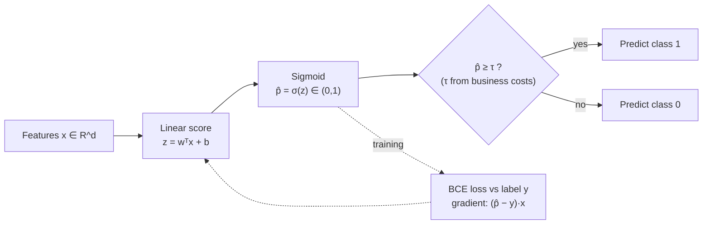
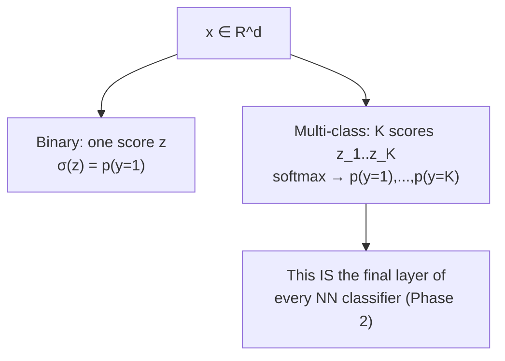
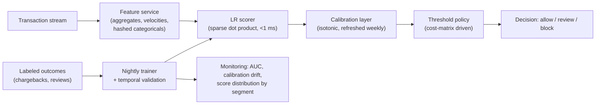

# 1.4 — Logistic Regression

> The go-to linear classifier and the direct parent of the last layer of every modern neural-network classifier. Softmax + cross-entropy — derived in this chapter — is *exactly* what sits at the top of every image classifier and language model you will meet in Phase 2.

---

## 1. Overview

**What is it?** Logistic regression is a linear model for **classification**. It takes linear regression's raw score $z = \mathbf{w}^T\mathbf{x} + b$ and squashes it through the **sigmoid** function so the output lands in $(0, 1)$ and can be read as a probability: $p(y{=}1 \mid \mathbf{x}) = \sigma(z)$. Despite the name, it performs classification, not regression — the "regression" refers to fitting a continuous quantity (the log-odds).

**Why does it exist?** Most practical prediction problems are categorical: spam or not, fraud or legitimate, click or no click, malignant or benign. Hard yes/no answers are often not enough — a bank wants to know a loan has a *17% default probability*, not just "risky." Logistic regression delivers calibrated probabilities from an interpretable linear model, trains in seconds, and scales to billions of sparse features.

**What problem does it solve?** Binary classification with probability estimates — and, via the **softmax** generalization, multi-class classification. Its loss, binary cross-entropy, falls straight out of maximum likelihood for Bernoulli-distributed labels, giving the model a principled statistical foundation.

**Where is it used?** Credit scoring, fraud detection, click-through-rate (CTR) prediction, medical risk scores, churn prediction, spam filtering — and inside every neural classifier, whose final layer is precisely multinomial logistic regression applied to learned features.

## 2. Learning Objectives

After this chapter you will be able to:

- Define the sigmoid function, prove its key properties ($\sigma(-z) = 1 - \sigma(z)$, $\sigma'(z) = \sigma(z)(1-\sigma(z))$), and explain why it is the right squashing function via log-odds.
- Derive **binary cross-entropy (BCE)** from the Bernoulli maximum-likelihood principle, step by step.
- Derive the BCE gradient and explain why it has the same elegant form as linear regression's.
- Generalize to $K$ classes with **softmax** and categorical cross-entropy, and connect this to neural-network classification heads.
- Interpret coefficients as **log-odds ratios** and communicate them to non-technical stakeholders.
- Explain what **calibration** means, measure it (reliability diagrams, Brier score, ECE), and fix miscalibration (Platt scaling, isotonic regression).
- Implement logistic regression from scratch (NumPy) and with scikit-learn, with numerical stability safeguards.
- Choose decision thresholds based on business costs rather than defaulting to 0.5.
- Handle class imbalance with weights, resampling, and threshold tuning.
- Explain why squared loss is the wrong objective for classification.

## 3. Prerequisites

| Chapter | Why you need it |
|---|---|
| [Probability & Statistics](../phase-0-prerequisites/04-probability-statistics.md) | Bernoulli distributions, likelihood, and MLE are where BCE comes from. |
| [Calculus](../phase-0-prerequisites/03-calculus.md) | Deriving the gradient requires the chain rule and the sigmoid derivative. |
| [Linear Algebra](../phase-0-prerequisites/02-linear-algebra.md) | The model is a dot product; batch computation is matrix algebra. |
| [Linear Regression](02-linear-regression.md) | Logistic regression is linear regression's score passed through a sigmoid; bias absorption carries over unchanged. |
| [Gradient Descent](03-gradient-descent.md) | There is no closed form here — the model is always fit iteratively. |
| [ML Fundamentals](01-ml-fundamentals.md) | Stratified splits and honest evaluation, especially under class imbalance. |

## 4. Intuition

Linear regression outputs any real number — fine for prices, useless for probabilities. Predicting "1.7" or "−0.3" for *probability of default* is nonsense. We need a function that takes the linear score $z = \mathbf{w}^T\mathbf{x} + b$ (which lives on $(-\infty, \infty)$) and bends it into $(0, 1)$ smoothly and monotonically. The sigmoid is that function: an S-shaped curve that maps huge negative scores to probabilities near 0, huge positive scores to probabilities near 1, and $z = 0$ to exactly 0.5.

**Analogy: a fair judge with a conviction meter.** Think of the linear score as the total weight of evidence in a court case — each feature contributes evidence for or against, weighted by how diagnostic it is. The sigmoid is the judge's conviction meter: overwhelming evidence either way pins the needle near "certain," while mixed evidence leaves it hovering near 50%. Crucially, the meter *saturates*: once evidence is overwhelming, one more piece barely moves the needle — exactly how rational belief should behave.

**Everyday story.** A loan officer reviews applications. Years of experience taught her rough rules: +2 points for stable employment, −3 for recent missed payments, +1 per \$10k of income. She totals the points and converts her gut feeling to an approval probability — near-certain approval above +6, near-certain rejection below −6, coin-flip around 0. Logistic regression *is* this officer, with the points (weights) learned from thousands of historical loans and the gut-feel conversion made mathematically exact by the sigmoid.

The decision boundary intuition: the model splits feature space with a straight hyperplane — the set of points where the evidence exactly balances ($z = 0$, $p = 0.5$). On one side probabilities rise smoothly toward 1; on the other they fall toward 0. Distance from the boundary is confidence.

## 5. Real-world Motivation

- **Meta (Facebook)**: the News Feed and ads CTR models of the pre-deep-learning era were massive-scale L2-regularized logistic regressions over billions of sparse features; their 2014 paper "Practical Lessons from Predicting Clicks on Ads at Facebook" pairs boosted trees with a logistic-regression layer and remains a classic.
- **Google**: published its ad-click prediction system built on FTRL-optimized (online) logistic regression handling billions of features ("Ad Click Prediction: a View from the Trenches," 2013).
- **Stripe / PayPal / banks**: fraud and credit-risk models rely on logistic regression where regulators demand explainable coefficients; credit scorecards are essentially rescaled logistic regressions.
- **Medicine**: the Framingham cardiovascular risk score — used clinically for decades — is a logistic-style model; regulatory transparency keeps logistic regression the default for clinical risk tools.
- **Every deep-learning company**: the classification head of every network — from ResNet to GPT's next-token predictor — is multinomial logistic regression (softmax + cross-entropy) on learned features. Understanding this chapter *is* understanding how neural nets classify.

## 6. Mathematical Foundations

### 6.1 The sigmoid and the model

$$
\sigma(z) = \frac{1}{1 + e^{-z}}, \qquad p_\theta(y = 1 \mid \mathbf{x}) = \sigma(\mathbf{w}^T\mathbf{x} + b) = \hat p
$$

Here $z = \mathbf{w}^T\mathbf{x} + b$ is the **logit** (linear score), $\mathbf{w} \in \mathbb{R}^d$ the weights, $b$ the intercept, and $\hat p$ the predicted probability of the positive class. Key properties (all worth verifying by hand):

- **Range:** $\sigma(z) \in (0,1)$; $\sigma(0) = 0.5$; $\sigma(z) \to 1$ as $z \to \infty$, $\to 0$ as $z \to -\infty$.
- **Symmetry:** $\sigma(-z) = 1 - \sigma(z)$, so $p(y{=}0\mid\mathbf{x}) = 1 - \hat p = \sigma(-z)$.
- **Derivative:** $\sigma'(z) = \sigma(z)\big(1 - \sigma(z)\big)$. Proof: $\sigma'(z) = \frac{e^{-z}}{(1+e^{-z})^2} = \frac{1}{1+e^{-z}} \cdot \frac{e^{-z}}{1+e^{-z}} = \sigma(z)(1-\sigma(z))$.

**Why sigmoid and not some other squasher?** Invert the model: solving $\hat p = \sigma(z)$ for $z$ gives

$$
z = \log\frac{\hat p}{1 - \hat p} \;=\; \text{log-odds (logit) of the positive class}
$$

So logistic regression is the assumption that the **log-odds are linear in the features**. Each weight $w_j$ is the change in log-odds per unit change in $x_j$; equivalently, a unit increase in $x_j$ multiplies the *odds* by $e^{w_j}$ — the interpretability payoff used across medicine and finance.

### 6.2 Loss — binary cross-entropy from maximum likelihood

Model each label as a Bernoulli draw: $y_i \sim \text{Bernoulli}(\hat p_i)$, i.e., $p(y_i \mid \mathbf{x}_i) = \hat p_i^{\,y_i}(1-\hat p_i)^{1-y_i}$ — a compact way to write "$\hat p_i$ if $y_i{=}1$, else $1-\hat p_i$." The likelihood of $n$ independent examples is the product $\prod_i \hat p_i^{\,y_i}(1-\hat p_i)^{1-y_i}$. Take the log (products → sums), negate (maximize → minimize), and average:

$$
J(\mathbf{w}) = -\frac{1}{n}\sum_{i=1}^n \Big[y_i \log \hat p_i + (1 - y_i)\log(1 - \hat p_i)\Big]
$$

This is **binary cross-entropy** (log loss). It is not an arbitrary choice — it is *the* maximum-likelihood objective for Bernoulli labels, exactly as MSE was the Gaussian MLE in [Linear Regression](02-linear-regression.md). Note the behavior at the extremes: predicting $\hat p \to 0$ when $y = 1$ costs $-\log \hat p \to \infty$ — confident wrong predictions are punished unboundedly, with correspondingly huge gradients. (Squared loss, by contrast, caps the penalty at 1 and its gradient *vanishes* for confident-wrong predictions when composed with a sigmoid — one reason it fails for classification.) BCE in $\mathbf{w}$ is convex, so [gradient descent](03-gradient-descent.md) finds the global optimum.

### 6.3 Gradient — derived step by step

For one example, $J_i = -[y\log\hat p + (1-y)\log(1-\hat p)]$ with $\hat p = \sigma(z)$, $z = \mathbf{w}^T\mathbf{x}$. Chain rule in three links:

1. $\dfrac{\partial J_i}{\partial \hat p} = -\dfrac{y}{\hat p} + \dfrac{1-y}{1-\hat p} = \dfrac{\hat p - y}{\hat p(1-\hat p)}$
2. $\dfrac{\partial \hat p}{\partial z} = \sigma'(z) = \hat p(1 - \hat p)$
3. $\dfrac{\partial z}{\partial \mathbf{w}} = \mathbf{x}$

Multiply: the $\hat p(1-\hat p)$ factors **cancel exactly**, leaving

$$
\nabla_\mathbf{w} J_i = (\hat p - y)\,\mathbf{x}, \qquad \text{and in batch form} \qquad \nabla_\mathbf{w} J = \frac{1}{n} X^T(\hat{\mathbf{p}} - \mathbf{y})
$$

— *identical in form* to linear regression's gradient $\frac{1}{n}X^T(\hat{\mathbf y}-\mathbf{y})$, with probabilities replacing raw predictions. This cancellation is not luck: it happens whenever a loss is paired with its "matching" link function from the exponential family (Gaussian↔identity, Bernoulli↔sigmoid, categorical↔softmax), and it is why gradients stay well-scaled during training.

### 6.4 Softmax — the multi-class generalization

For $K$ classes, give each class its own weight vector $\mathbf{w}_k$ (stacked into $W \in \mathbb{R}^{d\times K}$), compute logits $z_k = \mathbf{w}_k^T\mathbf{x}$, and normalize with **softmax**:

$$
p(y = k \mid \mathbf{x}) = \frac{e^{z_k}}{\sum_{j=1}^K e^{z_j}}
$$

Softmax outputs are positive and sum to 1 — a proper distribution over classes. With $K = 2$, softmax reduces exactly to the sigmoid on the logit difference $z_1 - z_0$ (only differences matter — softmax is invariant to adding a constant to all logits, a fact used for numerical stability). The MLE loss is **categorical cross-entropy**, $J = -\frac{1}{n}\sum_i \log p(y_i \mid \mathbf{x}_i)$, and the gradient again collapses beautifully:

$$
\nabla_W J = \frac{1}{n} X^T(\hat P - Y)
$$

where $\hat P \in \mathbb{R}^{n\times K}$ holds predicted probabilities and $Y$ the one-hot labels. **Softmax + cross-entropy is the exact output layer of every modern classifier** — image models, speech models, and LLMs (where $K$ = vocabulary size); see [Loss Functions](../phase-2-deep-learning/04-loss-functions.md).

### 6.5 Decision boundary and thresholds

Classifying $\hat y = 1$ iff $\hat p \ge 0.5$ is equivalent to $z \ge 0$: the boundary is the hyperplane $\mathbf{w}^T\mathbf{x} + b = 0$ — logistic regression is a **linear classifier**. But 0.5 is only correct when false positives and false negatives cost the same. With asymmetric costs $c_{FP}, c_{FN}$, the expected-cost-minimizing threshold is $\tau = \frac{c_{FP}}{c_{FP} + c_{FN}}$ — e.g., if missing a fraud costs 10× a false alarm, flag at $\hat p \ge 1/11 \approx 0.09$.

### 6.6 Calibration

A model is **calibrated** if, among all examples given probability $\hat p \approx 0.7$, about 70% are truly positive — the probabilities *mean what they say*. Measures: the **reliability diagram** (bin predictions by $\hat p$, plot observed frequency per bin against the diagonal), the **Brier score** $\frac{1}{n}\sum_i(\hat p_i - y_i)^2$, and **expected calibration error (ECE)** — the average |confidence − accuracy| gap across bins. Well-regularized logistic regression is typically well calibrated *by construction* (a stationarity condition of the MLE makes average predicted probability match the base rate), unlike SVMs, boosted trees, or modern deep nets, which are commonly overconfident. Post-hoc fixes, fit on a held-out calibration set: **Platt scaling** (fit $\sigma(az + b)$ on the model's scores — literally a tiny logistic regression) and **isotonic regression** (fit a monotone step function; needs more data, more flexible).

## 7. Visual Explanation

The sigmoid and the threshold:

```
   p = σ(z)
  1.0 |                    ________________
      |               ／
      |             ／
  0.5 |－－－－－●－－－－－－  ← decision threshold (z = 0)
      |         ／
      |       ／
  0.0 |_____／________________________
      -6    -3    0    +3   +6     z = wᵀx + b
      confident 0 | uncertain | confident 1
```

The prediction pipeline, and where the pieces live:



Binary vs. multi-class heads:



## 8. Algorithm

Training binary logistic regression with gradient descent:

1. Standardize features (fit the scaler on training data only — [Chapter 1.1](01-ml-fundamentals.md)); append the bias column of 1s.
2. Initialize $\mathbf{w} = \mathbf{0}$ (fine here: the loss is convex, no symmetry to break).
3. Repeat until convergence:
   1. Compute logits $\mathbf{z} = X\mathbf{w}$ and probabilities $\hat{\mathbf p} = \sigma(\mathbf{z})$ (element-wise).
   2. Compute the gradient $g = \frac{1}{n}X^T(\hat{\mathbf p} - \mathbf{y})$; add the L2 term $\lambda\mathbf{w}$ (excluding the bias — see [Regularization](05-regularization.md)).
   3. Update $\mathbf{w} \leftarrow \mathbf{w} - \eta\, g$.
4. Stop when the loss decrease falls below tolerance or validation loss stops improving.
5. Select the decision threshold $\tau$ on validation data from business costs; optionally fit a post-hoc calibrator.

Pseudocode:

```text
procedure LOGISTIC_GD(X, y, η, λ, T):
    X ← [standardize(X) | 1]
    w ← 0
    for t in 1..T:
        z ← X w                              # logits, shape (n,)
        p ← 1 / (1 + exp(−z))                # probabilities (clip z for safety)
        g ← (1/n)·Xᵀ(p − y) + λ·[w; 0]       # do not penalize the bias entry
        w ← w − η·g
        if |ΔJ| < ε: break
    return w
```

## 9. Worked Example

**Tiny example, entirely by hand.** One feature (standardized credit score $x$), current weights $w = 0.8$, $b = -0.5$. Three applicants:

| Applicant | $x$ | $z = 0.8x - 0.5$ | $\hat p = \sigma(z)$ | Label $y$ |
|---|---|---|---|---|
| A | $+1.0$ | $0.3$ | $\frac{1}{1+e^{-0.3}} \approx 0.574$ | 1 (repaid) |
| B | $-1.0$ | $-1.3$ | $\frac{1}{1+e^{1.3}} \approx 0.214$ | 0 (defaulted) |
| C | $+2.0$ | $1.1$ | $\approx 0.750$ | 0 (defaulted) |

BCE loss: $J = -\frac{1}{3}\big[\log 0.574 + \log(1{-}0.214) + \log(1{-}0.750)\big] = -\frac{1}{3}\big[(-0.555) + (-0.241) + (-1.386)\big] \approx 0.727$. Applicant C — a confident wrong prediction — contributes most of the loss.

Gradient for $w$: $\frac{1}{3}\sum_i (\hat p_i - y_i)x_i = \frac{1}{3}\big[(0.574{-}1)(1) + (0.214{-}0)(-1) + (0.750{-}0)(2)\big] = \frac{1}{3}[-0.426 - 0.214 + 1.500] = 0.287$. One step with $\eta = 0.5$: $w \leftarrow 0.8 - 0.5(0.287) = 0.657$ — the model correctly reduces its reliance on credit score, because C's high score misled it.

Interpretation payoff: with $w = 0.8$ per standard deviation of credit score, one SD of extra score multiplies the odds of repayment by $e^{0.8} \approx 2.2\times$.

**Realistic example.** On the Titanic dataset (~890 passengers), logistic regression on standardized features (sex, class, age, fare, family size) reaches ~80% accuracy with 5-fold CV. The coefficients tell the story: being female multiplies survival odds by roughly $e^{2.5} \approx 12\times$; each passenger-class step down multiplies them by about $e^{-1} \approx 0.37\times$ — interpretable evidence, not a black box.

## 10. Python from Scratch

```python
import numpy as np

class LogisticRegression:
    """Binary logistic regression via batch gradient descent, with L2."""

    def __init__(self, lr=0.1, n_iters=1000, l2=0.0):
        self.lr = lr            # learning rate η
        self.n_iters = n_iters  # max iterations
        self.l2 = l2            # L2 strength λ (0 = plain MLE)

    @staticmethod
    def _sigmoid(z):
        # Clip logits: exp(±30) is the safe range; exp(1000) overflows to inf
        # and produces NaN losses. This is THE classic numerical bug here.
        return 1.0 / (1.0 + np.exp(-np.clip(z, -30, 30)))

    def fit(self, X, y):
        X = np.hstack([X, np.ones((len(X), 1))])   # bias absorption → (n, d+1)
        y = np.asarray(y, dtype=float)             # labels MUST be 0/1 floats
        n, d = X.shape
        self.w = np.zeros(d)                       # convex loss → zeros are fine
        for _ in range(self.n_iters):
            p = self._sigmoid(X @ self.w)          # (n,) predicted probabilities
            grad = X.T @ (p - y) / n               # (d,)  (1/n)·Xᵀ(p̂ − y)
            grad[:-1] += self.l2 * self.w[:-1] / n # L2 on weights, not bias
            self.w -= self.lr * grad
        return self

    def predict_proba(self, X):
        X = np.hstack([X, np.ones((len(X), 1))])
        return self._sigmoid(X @ self.w)           # (n,) in (0, 1)

    def predict(self, X, threshold=0.5):
        # Threshold is a business decision, not math — expose it.
        return (self.predict_proba(X) >= threshold).astype(int)

# --- demo on separable-ish 2-D data ---
rng = np.random.default_rng(0)
X0 = rng.normal(loc=[-1, -1], scale=1.0, size=(200, 2))   # class 0 cloud
X1 = rng.normal(loc=[+1, +1], scale=1.0, size=(200, 2))   # class 1 cloud
X = np.vstack([X0, X1]); y = np.array([0]*200 + [1]*200)

model = LogisticRegression(lr=0.5, n_iters=2000, l2=0.1).fit(X, y)
acc = (model.predict(X) == y).mean()
print(np.round(model.w, 2), f"accuracy={acc:.3f}")
# Expected: w ≈ [1.5, 1.5, 0.0] (boundary x₁+x₂=0), accuracy ≈ 0.92
```

Block-by-block: `_sigmoid` guards against overflow; `fit` implements exactly the math of §6.3 with the bias excluded from the penalty; `predict_proba`/`predict` separate the *probability estimate* (statistics) from the *decision* (business). Complexity: $O(nd)$ per iteration, $O(d)$ memory beyond the data. **Common bug:** passing labels in $\{-1, +1\}$ — the gradient $(p - y)$ silently assumes $\{0, 1\}$; with $-1$s the model chases impossible targets and the loss math is wrong. A second: applying `_sigmoid` again to `predict_proba`'s output ("double sigmoid"), which crushes all probabilities into (0.5, 0.73).

## 11. Library Implementation

```python
from sklearn.linear_model import LogisticRegression
from sklearn.preprocessing import StandardScaler
from sklearn.pipeline import Pipeline
from sklearn.model_selection import train_test_split
from sklearn.metrics import roc_auc_score, log_loss, brier_score_loss
from sklearn.calibration import CalibratedClassifierCV

X_train, X_test, y_train, y_test = train_test_split(
    X, y, test_size=0.2, stratify=y, random_state=42)   # stratify: Ch. 1.1

pipe = Pipeline([
    ("scale", StandardScaler()),        # penalized LR is scale-sensitive
    ("clf", LogisticRegression(
        C=1.0,                          # C = 1/λ — INVERSE regularization (!)
        penalty="l2",                   # ridge-style penalty (the default)
        solver="lbfgs",                 # quasi-Newton; great for dense d ≲ 10⁴
        max_iter=1000,                  # default 100 often hits ConvergenceWarning
        class_weight=None,              # "balanced" reweights for imbalance
    )),
]).fit(X_train, y_train)

proba = pipe.predict_proba(X_test)[:, 1]      # column 1 = P(y=1); (n_test,)
print("AUC:", roc_auc_score(y_test, proba))          # rank quality, e.g. 0.95
print("log-loss:", log_loss(y_test, proba))          # the BCE we minimized
print("Brier:", brier_score_loss(y_test, proba))     # calibration-sensitive

# Post-hoc calibration (useful for models worse-calibrated than LR):
calibrated = CalibratedClassifierCV(pipe, method="isotonic", cv=5)
calibrated.fit(X_train, y_train)
```

Key lines: `C` is the *inverse* of regularization strength — small `C` = strong penalty (a perennial interview gotcha); `lbfgs` is a quasi-Newton solver that typically converges in tens of iterations for medium problems, while `saga` handles very large/sparse data and L1/elastic-net penalties; `predict_proba` returns an $(n, 2)$ array — take column 1. `class_weight="balanced"` scales each class's loss contribution by inverse frequency (note: it improves recall on the minority class but distorts calibration; recalibrate afterward if probabilities matter).

## 12. Code Walkthrough

Shapes and intermediates for the from-scratch demo ($n = 400$, $d = 2$):

| Tensor | Shape | Meaning |
|---|---|---|
| `X` (after bias) | (400, 3) | features + intercept column |
| `y` | (400,) | binary labels in {0, 1} |
| `X @ self.w` | (400,) | logits $z$ |
| `p` | (400,) | probabilities $\hat p = \sigma(z)$ |
| `p - y` | (400,) | residual-like error term |
| `grad` | (3,) | $\frac{1}{n}X^T(\hat p - y)$ + L2 term |
| `self.w` | (3,) | `[w₁, w₂, b]` |
| `predict_proba(X)` | (400,) | probabilities for downstream thresholding |

Expected results: the two Gaussian clouds centered at $(\pm 1, \pm 1)$ overlap, so the Bayes-optimal accuracy is ≈ 92% — the model should land there, *not* at 100%; the learned boundary is close to $x_1 + x_2 = 0$ (weights roughly equal, bias near 0). Training loss should fall monotonically (convexity) from $\log 2 \approx 0.693$ (the all-probabilities-0.5 starting point) to ≈ 0.22.

## 13. Complexity Analysis

- **Training (gradient descent):** $O(nd)$ per iteration — one matvec each with $X$ and $X^T$ — times the number of iterations. L-BFGS typically needs far fewer iterations (tens vs. thousands) at slightly higher per-iteration cost; Newton's method (IRLS) costs $O(nd^2 + d^3)$ per iteration but converges quadratically — great for small $d$, infeasible for millions of features.
- **Training on sparse data:** per-iteration cost drops to $O(\text{nnz})$ (number of non-zeros), which is how billion-feature CTR models are tractable — each example touches only its few hundred active features.
- **Prediction:** $O(d)$ per example (one dot product plus one exponential) — microseconds, which is why LR still serves latency-critical paths.
- **Space:** $O(d)$ for weights. The softmax version scales everything by $K$: $O(ndK)$ per training pass, $O(dK)$ memory.

## 14. Advantages

- **Calibrated probabilities by design.** The MLE's stationarity condition makes average predicted probability match observed frequency — insurers and lenders can plug $\hat p$ directly into expected-value calculations, something raw SVM scores can't do.
- **Interpretable coefficients.** $e^{w_j}$ is an odds ratio: "smoking multiplies the odds by 2.1" is a publishable, regulator-friendly statement — the reason clinical risk scores and credit scorecards are logistic regressions.
- **Fast and scalable.** Trains in seconds on millions of rows; with sparse features it scaled to Facebook- and Google-sized ad systems years before deep learning did.
- **Convex loss.** Gradient descent finds *the* global optimum — no initialization anxiety, no seed-to-seed variance, deterministic and auditable training.
- **The foundation of neural classification.** Softmax + cross-entropy learned here transfers verbatim to every network in Phase 2 — logistic regression *is* a one-layer neural network.

## 15. Disadvantages

- **Linear decision boundary only.** XOR-style problems — where the classes interleave — are unlearnable without feature engineering; trees ([Decision Trees](08-decision-trees.md)) or networks ([MLPs](../phase-2-deep-learning/01-perceptron-mlp.md)) handle them natively.
- **Manual feature engineering for interactions.** "Age matters only for third-class passengers" must be hand-encoded as an interaction term; the model will never discover it alone.
- **Complete separation pathology.** If a hyperplane perfectly splits the training classes, the unregularized MLE drives $\|\mathbf{w}\| \to \infty$ (probabilities → 0/1, loss → 0 only in the limit) — weights explode and never converge. Regularization is the fix, and it is one reason `sklearn` regularizes by default.
- **Sensitive to correlated features.** Like OLS, multicollinearity inflates coefficient variance and scrambles interpretability (individual odds ratios become untrustworthy even when predictions are fine).
- **Imbalance needs deliberate handling.** With 0.1% positives, the unweighted model can achieve tiny loss while being useless for the minority class; you must reweight, resample, or move the threshold — none of which is automatic.

## 16. Common Mistakes

- **Using accuracy on imbalanced data.** 99% accuracy on 1%-positive data is achieved by predicting "negative" always. *Fix:* report AUC, PR-AUC, and per-class precision/recall ([Evaluation Metrics](14-evaluation-metrics.md)).
- **Forgetting that `C` is inverse regularization** in scikit-learn: `C=100` is *weak* regularization, `C=0.01` is strong. *Fix:* remember $C = 1/\lambda$; tune on a log grid.
- **Not standardizing features.** The L2 penalty punishes large-scale features' coefficients more, silently distorting the model. *Fix:* `StandardScaler` inside the pipeline.
- **Treating 0.5 as sacred.** The right threshold depends on error costs and base rates. *Fix:* choose $\tau$ on validation data from the cost matrix ($\tau = c_{FP}/(c_{FP}+c_{FN})$ as a starting point).
- **Numerical overflow in the sigmoid.** `np.exp(1000)` → `inf` → NaN loss. *Fix:* clip logits, or compute the loss from logits directly with the log-sum-exp trick (what `torch.nn.BCEWithLogitsLoss` does).
- **Applying sigmoid twice.** Passing probabilities into a loss that itself applies sigmoid (e.g., feeding `sigmoid(z)` to `BCEWithLogitsLoss`). *Fix:* keep a strict convention — models output *logits*; losses own the squashing.
- **Reading causal claims off coefficients.** "The coefficient on price is negative, so cutting price raises conversion" confuses association with causation. *Fix:* coefficients describe the data distribution; causal claims need experiments.

## 17. Best Practices

- [ ] Standardize numeric features; one-hot (or hash) categoricals; keep all preprocessing in a `Pipeline`.
- [ ] Always regularize (start `C=1.0`); tune `C` on a log grid with stratified CV.
- [ ] Report AUC or PR-AUC *plus* calibration (reliability diagram / Brier) — rank quality and probability quality are different axes.
- [ ] Pick thresholds from the business cost matrix on validation data; document the choice.
- [ ] For imbalance: try `class_weight="balanced"`, then recalibrate probabilities if they will be consumed downstream.
- [ ] Check coefficient stability across CV folds before presenting odds ratios; unstable signs signal collinearity.
- [ ] Prefer `solver="saga"` + sparse matrices for high-dimensional sparse data; `lbfgs` for dense medium-sized problems.
- [ ] In PyTorch, always use `BCEWithLogitsLoss` / `CrossEntropyLoss` on raw logits — never hand-rolled `log(sigmoid(z))`.

> [!WARNING]
> A model with great AUC can still have terrible probabilities (and vice versa). AUC only measures *ranking*; if anyone multiplies your $\hat p$ by a dollar amount, you must also validate *calibration*.

## 18. Optimization Techniques

- **Solver choice:** L-BFGS (quasi-Newton) for dense, small-to-medium problems; SAGA/SGD for large sparse data; IRLS/Newton when $d$ is small and you want fast, high-precision convergence.
- **Sparse everything:** store one-hot/hashed features in CSR; training cost becomes $O(\text{nnz})$ per pass — the enabling trick for billion-feature CTR models.
- **Feature hashing:** map high-cardinality categoricals into a fixed-size space (e.g., $2^{24}$ buckets) with a hash function — bounded memory, no vocabulary maintenance, minor collision noise (the Vowpal Wabbit approach).
- **Warm starts:** when tuning `C` along a path, initialize each fit from the previous solution — large CV speedups.
- **Log-sum-exp stability:** compute losses from logits (subtract $\max_k z_k$ before softmax); never exponentiate raw logits.
- **Post-hoc calibration:** Platt scaling (small data, parametric) or isotonic regression (larger data, nonparametric) on a held-out calibration set.
- **Vectorized batch scoring:** at serving time, score batches with a single matrix–vector product; LR's tiny cost makes it ideal for cascades that filter candidates before expensive models run.

## 19. Industry Applications

- **Ad CTR prediction:** Google's FTRL-based system and Meta's GBDT+LR hybrid (both published) served production ad ranking at billion-user scale on logistic-regression foundations.
- **Credit scoring:** bank scorecards — including FICO-style models — are logistic regressions by regulatory preference: every point change traces to an auditable coefficient.
- **Fraud detection:** Stripe, PayPal, and card networks use LR both as serving models on latency-critical paths and as strong baselines for deep alternatives.
- **Medicine:** the Framingham risk score and many hospital readmission/sepsis-risk tools are logistic models; interpretability is a clinical requirement, not a preference.
- **Churn and marketing:** telecoms and subscription businesses (e.g., streaming services) rank customers by churn probability to target retention spend — an expected-value calculation that *requires* calibrated probabilities.
- **Inside every neural network:** the softmax classification head of ResNet, BERT, and GPT-style models is multinomial logistic regression over learned features — trained with exactly the cross-entropy of §6.4.

## 20. Interview Questions

### Beginner

**Q: Why can't we use plain linear regression for binary classification?**
A: Its output is unbounded — probabilities above 1 and below 0 are meaningless — and squared loss punishes *confidently correct* extreme predictions (a score of 5 for a true positive incurs loss), pulling the boundary toward outliers. Logistic regression fixes both: sigmoid bounds the output, and BCE is the statistically correct likelihood for binary labels.

**Q: What does the sigmoid do, and what is special about $z = 0$?**
A: It maps any real score to $(0,1)$ monotonically: $\sigma(z) = 1/(1+e^{-z})$. At $z = 0$, $\sigma = 0.5$ — the point of maximal uncertainty and (with threshold 0.5) the decision boundary. Large $|z|$ saturates toward 0 or 1, encoding confidence.

**Q: How do you interpret a logistic-regression coefficient?**
A: $w_j$ is the change in *log-odds* of the positive class per unit increase of $x_j$, holding other features fixed; equivalently the odds are multiplied by $e^{w_j}$. E.g., $w = 0.7$ on "has prior default" means priors multiply the odds of default by $e^{0.7} \approx 2$.

**Q: Why is the decision boundary of logistic regression linear?**
A: Predicting class 1 iff $\hat p \ge 0.5$ is equivalent to $z = \mathbf{w}^T\mathbf{x} + b \ge 0$ because sigmoid is monotone with $\sigma(0)=0.5$. The set $\{\mathbf{x}: \mathbf{w}^T\mathbf{x}+b = 0\}$ is a hyperplane — the model is linear *in the features you give it* (feed it $x^2$ and the boundary curves in the original space).

**Q: What is the loss function, and what happens when the model is confidently wrong?**
A: Binary cross-entropy: $-[y\log\hat p + (1-y)\log(1-\hat p)]$. A confident wrong prediction ($\hat p \to 0$ with $y=1$) costs $-\log\hat p \to \infty$, with a large gradient $(\hat p - y)\mathbf{x}$ — the model is yanked hard toward correcting exactly its worst errors.

### Intermediate

**Q: Derive BCE from maximum likelihood.**
A: Model $y_i \sim \text{Bernoulli}(\hat p_i)$: $p(y_i) = \hat p_i^{y_i}(1-\hat p_i)^{1-y_i}$. Independence gives likelihood $\prod_i \hat p_i^{y_i}(1-\hat p_i)^{1-y_i}$; the log is $\sum_i [y_i\log\hat p_i + (1-y_i)\log(1-\hat p_i)]$. Maximizing this equals minimizing its negative mean — BCE. So minimizing log loss *is* Bernoulli MLE, exactly parallel to MSE being Gaussian MLE.

**Q: Show that the BCE gradient is $\frac{1}{n}X^T(\hat p - y)$ and explain the cancellation.**
A: Chain rule: $\frac{\partial J}{\partial \hat p} = \frac{\hat p - y}{\hat p(1-\hat p)}$, $\frac{\partial \hat p}{\partial z} = \hat p(1-\hat p)$, $\frac{\partial z}{\partial \mathbf{w}} = \mathbf{x}$. The $\hat p(1-\hat p)$ factors cancel, leaving $(\hat p - y)\mathbf{x}$ per example. The cancellation is the canonical-link property of the exponential family: pairing sigmoid with BCE (like identity with MSE, softmax with CE) always yields "error × input" gradients — well-scaled and saturation-free.

**Q: When do sigmoid and softmax coincide, and why does softmax have a redundant parameterization?**
A: For $K=2$: $\text{softmax}(z_1, z_0)_1 = \frac{e^{z_1}}{e^{z_1}+e^{z_0}} = \sigma(z_1 - z_0)$ — only the logit difference matters. Generally, adding any constant $c$ to all logits leaves softmax unchanged, so one class's weight vector can be fixed at zero without loss of generality; regularization also resolves the redundancy in practice.

**Q: What is complete separation, and what does regularization do about it?**
A: When some hyperplane classifies all training points perfectly, the likelihood increases monotonically as $\|\mathbf{w}\|\to\infty$ (probabilities pushed to exact 0/1), so the MLE doesn't exist and weights diverge. An L2 penalty makes the objective strictly convex with a finite minimizer, capping the weights — one reason production LR is always regularized.

**Q: How would you handle a dataset with 0.5% positives?**
A: (1) Stratified splits and PR-AUC/recall-at-precision as metrics — never accuracy; (2) `class_weight="balanced"` or minority oversampling to give the positive class gradient weight; (3) tune the decision threshold on validation data from the cost matrix; (4) if probabilities feed downstream systems, recalibrate after reweighting, since weighting distorts calibration; (5) invest in features — imbalance amplifies the value of each informative signal.

### Advanced

**Q: Show that softmax + cross-entropy yields the gradient $\frac{1}{n}X^T(\hat P - Y)$.**
A: For one example with one-hot label $y$ (true class $c$), $J = -\log \hat p_c$ where $\hat p_k = e^{z_k}/\sum_j e^{z_j}$. Then $\frac{\partial J}{\partial z_k} = \hat p_k - \mathbb{1}[k=c]$: for $k=c$, $\frac{\partial}{\partial z_c}(-z_c + \log\sum_j e^{z_j}) = -1 + \hat p_c$; for $k\ne c$, $\frac{\partial}{\partial z_k}\log\sum_j e^{z_j} = \hat p_k$. With $z = W^T\mathbf{x}$, $\nabla_W J = \mathbf{x}(\hat p - y)^T$; averaging over the batch gives $\frac{1}{n}X^T(\hat P - Y)$. This "probabilities minus one-hot" gradient is what backpropagates from the head of every neural classifier.

**Q: Why does the MLE of logistic regression produce calibrated probabilities in aggregate?**
A: Setting the gradient to zero at the optimum: $\sum_i (\hat p_i - y_i)\mathbf{x}_i = 0$. Because the bias column is all ones, one component reads $\sum_i \hat p_i = \sum_i y_i$ — mean predicted probability equals the base rate; other components enforce analogous balance along each feature. This moment-matching is why LR tends to be calibrated where hinge-loss SVMs and overconfident deep nets are not (regularization trades a bit of it back for variance reduction).

**Q: Compare Platt scaling and isotonic regression for recalibration.**
A: Platt fits $p' = \sigma(a z + b)$ on held-out (score, label) pairs — two parameters, sample-efficient, but assumes a sigmoid-shaped distortion. Isotonic fits an arbitrary monotone step function — flexible enough for any monotone miscalibration but data-hungry (typically ≥ ~1000 calibration points) and prone to overfitting below that. Both must be fit on data disjoint from training; use Platt when calibration data is scarce, isotonic when plentiful.

**Q: Why is squared loss on top of a sigmoid a poor training objective even for binary targets?**
A: The gradient of $\frac{1}{2}(\sigma(z)-y)^2$ w.r.t. $z$ is $(\sigma(z)-y)\,\sigma(z)(1-\sigma(z))$. For a confidently wrong prediction ($z \ll 0$, $y=1$), the factor $\sigma(z)(1-\sigma(z)) \approx 0$ makes the gradient *vanish* precisely when the error is largest — learning stalls. It is also non-convex in $\mathbf{w}$ and corresponds to no sensible likelihood for binary labels. BCE's cancellation (previous questions) removes the saturating factor entirely.

**Q: Design the serving path for a 10⁹-sparse-feature CTR logistic regression.**
A: Feature hashing into a fixed space (e.g., $2^{26}$) to bound memory and avoid vocabulary management; weights in a flat float array; scoring = gather-and-sum over each impression's few hundred active indices — microseconds per candidate, no matrix libraries needed. Train online (FTRL-style) on the click stream with per-coordinate learning rates and L1 for sparsity; monitor calibration drift daily (predicted vs. observed CTR by segment) and refresh or recalibrate on schedule. Serve LR as the fast first stage of a cascade, passing survivors to heavier models.

## 21. Coding Exercises

### Easy

1. **Sigmoid properties.** Implement `sigmoid` and verify numerically that $\sigma(-z) = 1-\sigma(z)$ and $\sigma'(z) = \sigma(z)(1-\sigma(z))$ (finite differences) on a grid of $z$ values. *Hint:* central differences, $\frac{\sigma(z+h)-\sigma(z-h)}{2h}$ with $h=10^{-5}$.
2. **Decision-boundary plot.** Train your from-scratch model on 2-D two-moons data and plot the boundary line plus probability contours (0.1, 0.5, 0.9). *Hint:* the $p$-contour is the line $\mathbf{w}^T\mathbf{x} + b = \log\frac{p}{1-p}$; note how badly a line fits the moons.

### Medium

1. **Multinomial from scratch.** Implement softmax logistic regression (stable log-sum-exp softmax, CE loss, gradient $\frac{1}{n}X^T(\hat P - Y)$) and reach ≥ 90% on MNIST with mini-batch SGD from [Chapter 1.3](03-gradient-descent.md). *Hint:* subtract the row max from logits before exponentiating.
2. **Gradient checking.** Verify your BCE and softmax-CE gradients against finite differences to $10^{-6}$ relative error. *Hint:* perturb one weight at a time; use float64.
3. **Threshold economics.** With $c_{FN} = \$500$, $c_{FP} = \$25$ on a fraud dataset, sweep thresholds, plot expected cost vs. $\tau$, and compare the empirical optimum with the theoretical $\tau = c_{FP}/(c_{FP}+c_{FN})$. *Hint:* they match only if the model is calibrated — check that too.

### Hard

1. **Calibration lab.** Train logistic regression, a random forest, and a gradient-boosted model on the same data; plot reliability diagrams and compute ECE/Brier for each; then fix the worst with Platt and isotonic calibration and quantify the improvement. *Hint:* use a proper three-way split — train / calibration / test.
2. **Separation pathology.** Construct a linearly separable dataset; show unregularized weights grow without bound over iterations (plot $\|\mathbf{w}\|_2$ vs. iteration) while L2-regularized weights converge; relate the direction $\mathbf{w}/\|\mathbf{w}\|$ approaches to the max-margin separator. *Hint:* this connects to [SVM](11-svm.md) — gradient descent on separable logistic loss converges in direction to the max-margin solution.

## 22. Mini Project

**Titanic survival, done properly.**

1. Load the Titanic dataset; freeze a stratified 20% test set.
2. Engineer features: title extracted from name, family size, cabin deck letter, fare per person; one-hot categoricals, standardize numerics — all inside a `Pipeline`.
3. Train regularized logistic regression; tune `C` over a log grid with stratified 5-fold CV.
4. Report test accuracy, AUC, and a reliability diagram.
5. Present the top-8 coefficients as odds ratios with one plain-English sentence each ("first-class passengers had ≈3× the survival odds of third-class, all else equal").

## 23. Medium Project

**CTR prediction on the Criteo sample.**

1. Download the Criteo display-advertising sample (~10M rows class-imbalanced click logs).
2. Build a streaming pipeline: hash the 26 categorical fields into $2^{22}$ buckets; log-transform the 13 numeric fields; store batches as sparse CSR.
3. Train logistic regression with mini-batch SGD (or `SGDClassifier(loss="log_loss")`), one pass over the data; evaluate log-loss and AUC on a *temporal* holdout (final day).
4. Compare against two baselines: predict-the-base-rate, and a model on numeric features only (quantifying the value of the hashed categoricals).
5. Plot calibration by decile of predicted CTR; recalibrate if needed.
6. Ablate hash size ($2^{18}$ vs. $2^{22}$ vs. $2^{24}$) and report the memory/AUC trade-off.

## 24. Advanced Project

**A production-style fraud-scoring service.**

Architecture:



Implementation phases:

1. **Offline model:** train regularized LR on a public fraud dataset (e.g., IEEE-CIS) with strictly temporal splits; establish AUC/PR-AUC baselines and a cost-based threshold.
2. **Serving:** wrap the model in a REST service returning score + decision within a 5 ms budget; sparse weight lookup, no heavyweight libraries on the hot path.
3. **Calibration & thresholds:** isotonic layer fit on recent data; expose `allow/review/block` bands derived from the cost matrix, with the review band sized to analyst capacity.
4. **Retraining & monitoring:** nightly retrain with time-decayed sample weights; dashboards for calibration drift (predicted vs. realized fraud rate by band), feature distribution shift, and champion/challenger comparison before promotion.

Possible improvements: FTRL online updates between nightly retrains; a GBDT feature-transformer feeding the LR (the Facebook recipe); SHAP-style reason codes per decision for analyst and regulatory consumption.

## 25. Summary

- Logistic regression = linear score $z = \mathbf{w}^T\mathbf{x} + b$ + **sigmoid** → probability $\hat p = \sigma(z) \in (0,1)$; equivalently, log-odds are linear in features.
- **BCE loss is Bernoulli MLE** — the exact classification analogue of MSE-as-Gaussian-MLE; it punishes confident errors unboundedly and is convex.
- The gradient collapses to $\frac{1}{n}X^T(\hat{\mathbf p} - \mathbf{y})$ — the sigmoid derivative cancels against the loss (canonical-link property), so gradients never saturate.
- **Softmax + cross-entropy** generalizes to $K$ classes with gradient $\frac{1}{n}X^T(\hat P - Y)$, and *is* the output layer of every neural classifier.
- Coefficients are log-odds ratios: $e^{w_j}$ multiplies the odds per unit of $x_j$ — the interpretability that keeps LR in banks and hospitals.
- The decision boundary is a hyperplane; the threshold is a business decision ($\tau = c_{FP}/(c_{FP}+c_{FN})$), not a constant 0.5.
- **Calibration** — probabilities meaning what they say — is measured with reliability diagrams/Brier/ECE and repaired with Platt or isotonic scaling.
- Always regularize: it fixes the complete-separation pathology and improves generalization; in sklearn, `C = 1/λ` (inverse!).
- Clip logits or compute losses from logits directly (`BCEWithLogitsLoss`) — overflow in the sigmoid is the classic numerical bug.
- Handle imbalance deliberately (weights, resampling, thresholds) and recalibrate afterward if probabilities are consumed downstream.

## 26. Cheat Sheet

**Key formulas**

| Item | Formula |
|---|---|
| Sigmoid | $\sigma(z) = \frac{1}{1+e^{-z}}$; $\sigma' = \sigma(1-\sigma)$; $\sigma(-z) = 1-\sigma(z)$ |
| Model | $\hat p = \sigma(\mathbf{w}^T\mathbf{x} + b)$; log-odds $= \mathbf{w}^T\mathbf{x}+b$ |
| BCE loss | $-\frac{1}{n}\sum_i [y_i\log\hat p_i + (1-y_i)\log(1-\hat p_i)]$ |
| Gradient | $\frac{1}{n}X^T(\hat{\mathbf p} - \mathbf{y})$ |
| Softmax | $p_k = e^{z_k}/\sum_j e^{z_j}$; CE gradient $\frac{1}{n}X^T(\hat P - Y)$ |
| Odds ratio | unit increase in $x_j$ ⇒ odds × $e^{w_j}$ |
| Cost threshold | $\tau = c_{FP}/(c_{FP}+c_{FN})$ |
| Brier score | $\frac{1}{n}\sum_i (\hat p_i - y_i)^2$ |

**Defaults**

- `Pipeline(StandardScaler, LogisticRegression(C=1.0, solver="lbfgs", max_iter=1000))`.
- Sparse/large data: `solver="saga"`; L1/elastic-net also needs `saga`.
- Imbalance: `class_weight="balanced"`, then recalibrate; metrics: AUC + PR-AUC.

**One-liner tips**

- Models output logits; losses own the sigmoid/softmax.
- Small `C` = strong regularization (it's $1/\lambda$).
- Great AUC ≠ calibrated probabilities — check both.

**Gotchas**

- Labels must be {0, 1} for the $(p - y)$ gradient to be meaningful.
- Double sigmoid squashes all probabilities into (0.5, 0.73).
- Perfectly separable data + no regularization = diverging weights.
- `exp` overflow on large logits → NaN loss; clip or use logit-space losses.

## 27. Further Reading

**Books**

- *An Introduction to Statistical Learning* — James, Witten, Hastie, Tibshirani (Ch. 4).
- *The Elements of Statistical Learning* — Hastie, Tibshirani, Friedman (Ch. 4: linear methods for classification).
- *Pattern Recognition and Machine Learning* — Bishop (Ch. 4: probabilistic discriminative models).
- *Applied Logistic Regression* — Hosmer, Lemeshow, Sturdivant (the statistician's reference).

**Research Papers**

- McMahan et al. (2013), "Ad Click Prediction: a View from the Trenches" (Google's FTRL system).
- He et al. (2014), "Practical Lessons from Predicting Clicks on Ads at Facebook" (GBDT + LR).
- Platt (1999), "Probabilistic Outputs for Support Vector Machines" (Platt scaling).
- Niculescu-Mizil & Caruana (2005), "Predicting Good Probabilities with Supervised Learning" (calibration across model families).
- Guo et al. (2017), "On Calibration of Modern Neural Networks."

**Documentation**

- scikit-learn User Guide: "Logistic regression" and "Probability calibration."
- PyTorch docs: `BCEWithLogitsLoss`, `CrossEntropyLoss`.

**GitHub Repositories**

- `scikit-learn/scikit-learn` — `linear_model/_logistic.py`.
- `VowpalWabbit/vowpal_wabbit` — industrial-scale online logistic regression with feature hashing.

**Datasets**

- Titanic (Kaggle), UCI Adult, Criteo Display Advertising Challenge, IEEE-CIS Fraud Detection.

**YouTube / Videos**

- StatQuest — "Logistic Regression" series (sigmoid, odds, MLE).
- Andrew Ng, Machine Learning Specialization — classification and logistic regression weeks.

**Blogs**

- scikit-learn examples: probability calibration curves.
- Distill-style treatments of cross-entropy and softmax gradients (e.g., Chris Olah's blog on information theory).
