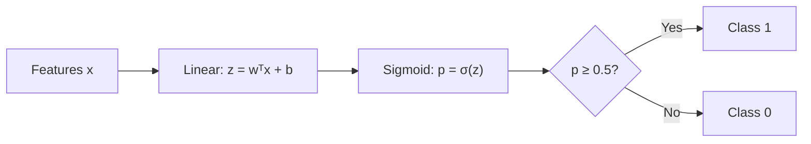

# 1.4 — Logistic Regression

> The go-to linear classifier and the direct parent of the last layer of every modern neural-network classifier.

---

## 1. Intuition first

Take linear regression's output $\mathbf{w}^T\mathbf{x} + b$ and squash it through a **sigmoid** so it becomes a probability in $(0, 1)$. Threshold at 0.5 (or a business-chosen cut-off) to classify.

## 2. Why the topic exists

Predict a class label with a probability, not just a hard prediction. Interpretable, fast, and the best baseline for tabular classification.

## 3. What problem it solves

Binary (and, via one-vs-rest or softmax, multi-class) classification with calibrated probabilities.

## 4. Mathematics

### 4.1 Sigmoid & the model

$$
\sigma(z) = \frac{1}{1 + e^{-z}}, \qquad p_\theta(y=1 \mid \mathbf{x}) = \sigma(\mathbf{w}^T \mathbf{x} + b)
$$

### 4.2 Loss — Binary Cross-Entropy (BCE)

For labels $y_i \in \{0, 1\}$ and predictions $\hat p_i$:

$$
J(\mathbf{w}) = -\frac{1}{n}\sum_{i=1}^n \big[y_i \log \hat p_i + (1 - y_i)\log(1 - \hat p_i)\big]
$$

Derived from Bernoulli log-likelihood (see 0.4).

### 4.3 Gradient

$$
\nabla_\mathbf{w} J = \frac{1}{n} X^T (\hat{\mathbf{p}} - \mathbf{y})
$$

Beautifully identical in form to linear regression's gradient — the sigmoid derivative and log cancel exactly.

### 4.4 Multinomial (softmax) generalization

For $K$ classes:

$$
p(y = k \mid \mathbf{x}) = \frac{e^{\mathbf{w}_k^T \mathbf{x}}}{\sum_{j=1}^K e^{\mathbf{w}_j^T \mathbf{x}}}
$$

Loss: categorical cross-entropy. Softmax + CE is the **exact** last layer of every modern classification NN.

### 4.5 Decision boundary

Where $\mathbf{w}^T\mathbf{x} + b = 0$ — a hyperplane.

## 5. Every formula explained

- Sigmoid maps $\mathbb{R} \to (0, 1)$: bounded, monotone, differentiable.
- BCE penalizes confident wrong predictions to infinity (huge gradient).
- Softmax is the natural extension for $K$ classes; sums to 1.

## 6. Every variable explained

| Symbol | Meaning |
|--------|---------|
| $\sigma$ | sigmoid |
| $z$ | logit ($\mathbf{w}^T\mathbf{x} + b$) |
| $\hat p_i$ | predicted probability |
| $y_i$ | ground truth label |
| $\mathbf{w}_k$ | weight vector for class $k$ (softmax) |

## 7. Step-by-step algorithm

1. Standardize features.
2. Initialize $\mathbf{w} = 0$.
3. Loop: compute logits $z = X\mathbf{w}$, probabilities $\hat p = \sigma(z)$.
4. Compute gradient $\tfrac{1}{n} X^T(\hat p - y)$, add L2 term $\lambda \mathbf{w}$.
5. Update $\mathbf{w} \leftarrow \mathbf{w} - \eta \cdot \text{grad}$.
6. Repeat until loss converges.

## 8. Simple example

Predict "will pay loan (1) vs default (0)" from credit score. Threshold at 0.5. Coefficients tell you: each 100-point score bump raises log-odds by 0.8 → odds by $e^{0.8} \approx 2.2\times$.

## 9. Real-world example

- Facebook News Feed CTR baseline (pre-DNN era) was massive-scale L2-regularized logistic regression with billions of sparse features.
- Fraud detection at Stripe / PayPal.
- Medical risk scoring (Framingham risk score is essentially LR).

## 10. Diagram

```
   p
   1|      _________
    |     /
  0.5|----/------  ← decision threshold
    |   /
    0|_/________________
              z = wᵀx + b
```



## 11. Implementation from scratch

```python
import numpy as np

class LogisticRegression:
    def __init__(self, lr=0.1, n_iters=1000, l2=0.0):
        self.lr = lr; self.n_iters = n_iters; self.l2 = l2

    @staticmethod
    def _sigmoid(z):
        return 1.0 / (1.0 + np.exp(-np.clip(z, -30, 30)))

    def fit(self, X, y):
        X = np.hstack([X, np.ones((len(X), 1))])
        n, d = X.shape
        self.w = np.zeros(d)
        for _ in range(self.n_iters):
            p = self._sigmoid(X @ self.w)
            grad = X.T @ (p - y) / n + self.l2 * self.w / n
            self.w -= self.lr * grad
        return self

    def predict_proba(self, X):
        X = np.hstack([X, np.ones((len(X), 1))])
        return self._sigmoid(X @ self.w)

    def predict(self, X, threshold=0.5):
        return (self.predict_proba(X) >= threshold).astype(int)
```

## 12. Implementation using libraries

```python
from sklearn.linear_model import LogisticRegression
m = LogisticRegression(C=1.0, penalty="l2", solver="lbfgs", max_iter=1000)
m.fit(X_train, y_train)
proba = m.predict_proba(X_test)[:, 1]
```

## 13. Time complexity

- Training (GD): O(nd × #iters).
- Prediction: O(d) per sample.

## 14. Space complexity

O(d) for weights.

## 15. Advantages

- Fast, interpretable.
- Well-calibrated probabilities (with mild regularization).
- Scales to billions of sparse features.

## 16. Disadvantages

- Only linear decision boundary.
- Needs feature engineering for interactions/non-linearities.
- Sensitive to class imbalance.

## 17. Interview questions

1. Derive the BCE loss from Bernoulli MLE.
2. Show that $\sigma'(z) = \sigma(z)(1-\sigma(z))$.
3. Why is squared loss a bad idea for classification?
4. Softmax vs sigmoid — when do they coincide?
5. What is the odds ratio interpretation of a coefficient?
6. How does L1 vs L2 change the solution?
7. Why is logistic regression a "linear" model?
8. Explain class-imbalance strategies (class weights, resampling, focal loss).
9. What does calibration mean and how do you measure it (reliability diagram, Brier score)?
10. Why is softmax + cross-entropy the standard classification head?

## 18. Common mistakes

- Using accuracy on an imbalanced dataset (0.99 by predicting majority).
- Not standardizing features (LR with L2 becomes scale-dependent).
- Forgetting to add intercept.
- Applying sigmoid twice (in model and loss).

## 19. Optimization techniques

- L-BFGS for small-to-medium problems (`sklearn`'s default).
- SAGA / SGD for very large sparse data.
- Feature hashing for high-cardinality categoricals.
- Isotonic / Platt scaling for post-hoc calibration.

## 20. Coding exercises

1. Implement from-scratch multinomial logistic regression.
2. Prove and verify that softmax + CE gradient is $\tfrac{1}{n}X^T(\hat P - Y)$.
3. Plot decision boundary on 2D toy data.
4. Compare L1, L2, elastic-net on a sparse text dataset.
5. Calibrate an under-confident model with Platt scaling.

## 21. Mini project

Titanic survival prediction with logistic regression; feature-engineer titles, family-size, cabin letter.

## 22. Medium project

Build a CTR predictor on the Criteo click-log sample: hash features, train LR on 10 M rows with mini-batch SGD, evaluate log-loss and AUC.

## 23. Advanced project

Reproduce a "logistic-regression-only" baseline that beats naive DNNs on a Kaggle tabular competition using feature crosses + calibrated LR; write a blog post.

## 24. Where it is used in industry

Fraud, CTR, credit scoring, medical risk, spam, churn, A/B lift, LLM classification heads.

## 25. How companies use it

- **Facebook** (pre-DNN era): huge sparse LR served ads globally.
- **Banks**: FICO-adjacent scores.
- **Pharma**: logistic-regression is often preferred for regulatory transparency.

## 26. When NOT to use it

- Strong non-linearities / interactions → prefer trees or NNs.
- Sequential / image data → prefer specialized models.
