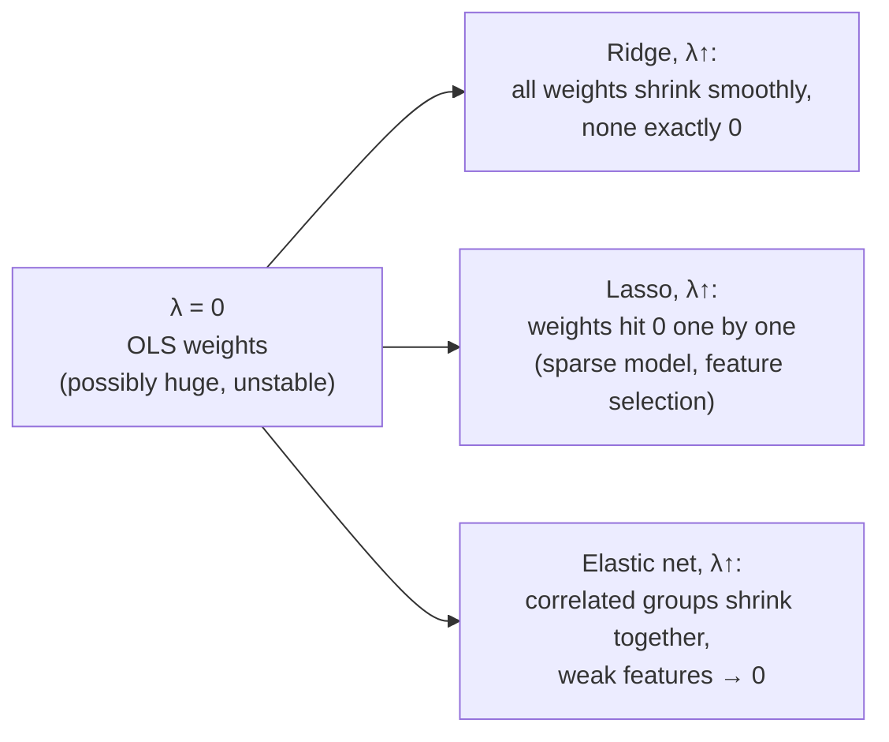
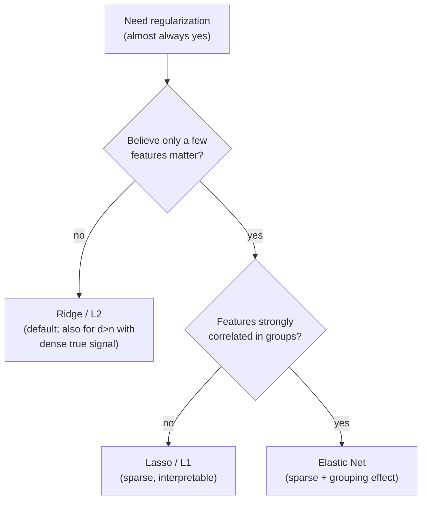
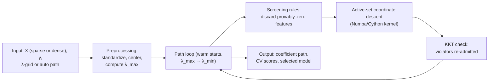

# 1.5 — Regularization (L1, L2, Elastic Net)

> The single cheapest way to make almost any model generalize better. One extra term in the loss buys you stability, sparsity, and protection from overfitting — and its Bayesian reading (penalties are priors) reappears everywhere from ridge regression to weight decay in LLM training.

---

## 1. Overview

**What is it?** Regularization adds a penalty on the *size* of the model's weights to the training loss. Instead of minimizing fit error alone, we minimize *fit error + λ · weight-magnitude penalty*. The two classic penalties are **L2** (sum of squared weights — "ridge") and **L1** (sum of absolute weights — "lasso"); **Elastic Net** combines them.

**Why does it exist?** An unregularized model minimizes training error only, and per the bias-variance analysis of [ML Fundamentals](01-ml-fundamentals.md), that is a recipe for high variance: the model happily grows huge, mutually-canceling weights to memorize noise. Regularization expresses a preference — *among models that fit similarly well, prefer the one with smaller weights* — which reliably improves test performance.

**What problem does it solve?** Four at once: (1) overfitting — it trades a little bias for a large variance reduction; (2) multicollinearity — it stabilizes coefficients when features are correlated and makes $X^TX + \lambda I$ always invertible; (3) feature selection — L1 sets many weights to *exactly zero*, picking a sparse subset automatically; (4) ill-posedness — it makes underdetermined problems ($d > n$, e.g., 20,000 genes and 200 patients) solvable at all.

**Where is it used?** Everywhere linear and logistic models run in production, and far beyond: "weight decay" in every deep-learning training run — including GPT-scale pretraining — is L2 regularization by another name, and L1 sparsity powers genomics, compressed sensing, and billion-feature ad models.

## 2. Learning Objectives

After this chapter you will be able to:

- Write down the ridge, lasso, and elastic-net objectives and explain every term.
- Explain geometrically *why L1 induces sparsity* and L2 does not (corners of the diamond vs. the smooth circle).
- Derive the **closed-form ridge solution** and its shrinkage interpretation via eigenvalues/SVD.
- Derive the **soft-thresholding operator** as the exact solution of the 1-D lasso problem.
- Implement **coordinate descent** for lasso from scratch and explain why it works for this non-smooth objective.
- State the **Bayesian interpretation**: L2 = Gaussian prior, L1 = Laplace prior, MAP estimation = penalized MLE.
- Choose between L1, L2, and elastic net based on the correlation structure and sparsity of the problem.
- Tune $\lambda$ honestly with cross-validation and warm-started regularization paths.
- Explain why features must be standardized and the intercept left unpenalized.
- Connect classical regularization to deep learning's weight decay and its subtleties (AdamW).

## 3. Prerequisites

| Chapter | Why you need it |
|---|---|
| [Linear Algebra](../phase-0-prerequisites/02-linear-algebra.md) | Norms, eigenvalues, and the invertibility of $X^TX + \lambda I$. |
| [Calculus](../phase-0-prerequisites/03-calculus.md) | Gradients for ridge; subgradients for the non-differentiable L1 term. |
| [Probability & Statistics](../phase-0-prerequisites/04-probability-statistics.md) | Priors, MAP estimation, Gaussian vs. Laplace distributions. |
| [ML Fundamentals](01-ml-fundamentals.md) | Bias-variance trade-off — regularization is its main control knob. |
| [Linear Regression](02-linear-regression.md) | Ridge extends OLS; we reuse the normal equations directly. |
| [Gradient Descent](03-gradient-descent.md) | Penalized objectives are fit iteratively at scale; proximal methods extend GD. |
| [Logistic Regression](04-logistic-regression.md) | The same penalties apply verbatim to classification (sklearn's `C = 1/λ`). |

## 4. Intuition

An unregularized model is a student who answers *every* practice question with maximum confidence, inventing elaborate special-case rules for each one. He aces the practice set and bombs the exam. Regularization is the teacher's instruction: "Prefer simple explanations; only commit to a strong rule when the evidence really supports it." Formally, we charge the model *rent* for every unit of weight it uses — it will pay for weights that genuinely reduce error, and give up the ones that only chased noise.

**An everyday story.** You're packing for a hiking trip with a strict weight limit. Every item must justify its grams. The L2 packer shrinks everything proportionally — travel-size toothpaste, lighter jacket, smaller camera: *everything comes, in reduced form*. The L1 packer is more ruthless: items that don't clearly earn their weight get left at home entirely — *a smaller number of full-size essentials*. That is precisely the difference in the fitted weights: ridge shrinks all coefficients smoothly toward (but never exactly to) zero; lasso zeroes out the weak ones completely and keeps a sparse kit.

**Why the difference?** Think of the penalty as a budget region the weights must live in: for L2 it's a sphere (no corners), for L1 a diamond (sharp corners *on the axes*). The best fit subject to the budget is where the loss's contour ellipses first touch the region — and ellipses overwhelmingly first touch a diamond at its corners, where some coordinates are exactly zero. Touching a sphere at an axis point is a measure-zero coincidence, so ridge essentially never produces exact zeros.

One more framing that becomes precise later: regularization is a *prior belief*. Before seeing data, you believe weights are probably small (L2: bell-curve belief) or probably zero with occasional exceptions (L1: spike-and-tails belief). Data must overcome the prior to justify big weights.

## 5. Real-world Motivation

- **Every deep-learning training run** at OpenAI, Google, Meta, and Anthropic uses weight decay (L2-style regularization) — typical AdamW `weight_decay≈0.1` in LLM pretraining recipes published by these labs.
- **Google's and Meta's ad-CTR systems** (the FTRL and GBDT+LR papers from [Logistic Regression](04-logistic-regression.md)) rely on L1 to keep billion-feature models sparse enough to serve: features with zero weight cost nothing at inference.
- **Genomics/pharma:** with 20,000 gene-expression features and a few hundred patients, unregularized regression is hopeless ($d \gg n$); lasso and elastic net (the latter invented partly for this setting) select handfuls of candidate biomarkers.
- **Finance:** portfolio optimization and factor models use ridge-type shrinkage to stabilize estimates from noisy, highly correlated return series — unshrunk estimates produce wild, untradeable allocations.
- **Netflix Prize-era recommenders:** the winning matrix-factorization models were heavily L2-regularized; the regularization strength mattered as much as the architecture.
- **Marketing-mix modeling** at large advertisers: media channels (TV, search, social) are strongly correlated in spend; ridge keeps their attribution coefficients stable enough to base budget decisions on.

## 6. Mathematical Foundations

Throughout, $\mathbf{w} \in \mathbb{R}^d$ are the weights, $\lambda \ge 0$ the regularization strength, $\ell$ the per-example loss, and the data matrix/targets $X \in \mathbb{R}^{n\times d}$, $\mathbf{y} \in \mathbb{R}^n$ as in [Linear Regression](02-linear-regression.md). The intercept is conventionally *not* penalized (shifting all targets by a constant shouldn't change the penalty), so absorb it separately.

### 6.1 The three objectives

**Ridge (L2):**

$$
J_{\text{ridge}}(\mathbf{w}) = \frac{1}{n}\sum_{i=1}^n \ell\big(f_\mathbf{w}(\mathbf{x}_i), y_i\big) + \lambda \|\mathbf{w}\|_2^2, \qquad \|\mathbf{w}\|_2^2 = \sum_{j=1}^d w_j^2
$$

**Lasso (L1):**

$$
J_{\text{lasso}}(\mathbf{w}) = \frac{1}{n}\sum_{i=1}^n \ell\big(f_\mathbf{w}(\mathbf{x}_i), y_i\big) + \lambda \|\mathbf{w}\|_1, \qquad \|\mathbf{w}\|_1 = \sum_{j=1}^d |w_j|
$$

**Elastic Net (both):**

$$
J_{\text{en}}(\mathbf{w}) = \frac{1}{n}\sum_{i=1}^n \ell\big(f_\mathbf{w}(\mathbf{x}_i), y_i\big) + \lambda_1 \|\mathbf{w}\|_1 + \lambda_2 \|\mathbf{w}\|_2^2
$$

(sklearn parameterizes elastic net with a total strength `alpha` and a mixing ratio `l1_ratio` $\in [0,1]$.) In all three, $\lambda = 0$ recovers the unpenalized model and $\lambda \to \infty$ drives $\mathbf{w} \to \mathbf{0}$; in between, $\lambda$ *is* the bias-variance dial from [Chapter 1.1](01-ml-fundamentals.md).

### 6.2 Ridge closed form and shrinkage

For squared loss, add the penalty gradient $2\lambda\mathbf{w}$ to the OLS derivation of [Chapter 1.2](02-linear-regression.md) and set to zero:

$$
(X^TX + \lambda I)\,\mathbf{w} = X^T\mathbf{y} \quad\Longrightarrow\quad \mathbf{w}^*_{\text{ridge}} = (X^TX + \lambda I)^{-1}X^T\mathbf{y}
$$

Since $X^TX$ is positive semi-definite (eigenvalues $\ge 0$), adding $\lambda I$ lifts every eigenvalue by $\lambda > 0$, so the matrix is **always invertible** — ridge solves the multicollinearity and $d > n$ problems by construction.

**What it does, precisely (SVD view).** Let $X = U\Sigma V^T$ with singular values $\sigma_1 \ge \dots \ge \sigma_d \ge 0$. Then OLS reconstructs $\mathbf{y}$'s components with factors $1/\sigma_j$ (exploding for tiny $\sigma_j$ — that's the variance), while ridge uses

$$
\frac{\sigma_j}{\sigma_j^2 + \lambda}
$$

— nearly $1/\sigma_j$ for strong directions ($\sigma_j^2 \gg \lambda$), but *shrunk toward zero* for weak directions ($\sigma_j^2 \ll \lambda$). Ridge dampens exactly the directions where the data provides little information, which is where OLS variance lives.

### 6.3 The Bayesian view — penalties are priors

Place a prior on the weights and do **MAP (maximum a posteriori)** estimation: maximize $\log p(\mathbf{y}\mid X, \mathbf{w}) + \log p(\mathbf{w})$.

- **Gaussian prior** $w_j \sim \mathcal{N}(0, \tau^2)$: $\log p(\mathbf{w}) = -\frac{1}{2\tau^2}\|\mathbf{w}\|_2^2 + \text{const}$. With Gaussian noise (variance $\sigma^2$), MAP = ridge with $\lambda = \sigma^2/\tau^2$. *Tighter prior (small $\tau$) ⇒ stronger shrinkage.*
- **Laplace prior** $p(w_j) = \frac{1}{2b}e^{-|w_j|/b}$: $\log p(\mathbf{w}) = -\frac{1}{b}\|\mathbf{w}\|_1 + \text{const}$. MAP = lasso. The Laplace density's sharp spike at zero encodes "most weights are exactly irrelevant" — the sparsity belief.

This reading explains *why* regularized models generalize: they blend data with a sensible prior instead of trusting the sample alone. It also gives principled intuition for tuning: $\lambda$ encodes how strongly you believe weights are small, relative to the noise level.

### 6.4 Why L1 creates exact zeros — the subgradient argument

$|w|$ is not differentiable at 0; its **subdifferential** there is the whole interval $[-1, 1]$ (every line through the origin with slope in $[-1,1]$ underestimates $|w|$). The optimality condition for $w_j = 0$ in the lasso is that *zero belongs to the subdifferential of the total objective*:

$$
\big|\text{(gradient of the fit term w.r.t. } w_j\text{ at } w_j{=}0)\big| \;\le\; \lambda
$$

So there is a *finite threshold*: unless feature $j$'s correlation with the residual exceeds $\lambda$, the optimum sits exactly at $w_j = 0$. L2's penalty gradient $2\lambda w_j$ vanishes *at* zero, providing no such dead zone — ridge weights approach zero asymptotically but never land there.

### 6.5 Soft thresholding — the 1-D lasso solved exactly

Consider the scalar problem $\min_w \frac{1}{2}(w - z)^2 + \tau|w|$ (fit a single weight toward target $z$ under an L1 charge $\tau$). Split by sign and solve each smooth piece; the minimizer is the **soft-thresholding operator**:

$$
S(z, \tau) = \operatorname{sign}(z)\,\max(|z| - \tau,\, 0) =
\begin{cases}
z - \tau & z > \tau\\
0 & |z| \le \tau\\
z + \tau & z < -\tau
\end{cases}
$$

*Derivation sketch:* for $w > 0$ the objective is $\frac{1}{2}(w-z)^2 + \tau w$ with stationary point $w = z - \tau$, valid only if $z > \tau$; symmetrically $w = z + \tau$ for $z < -\tau$; otherwise the kink at 0 is optimal. Every large-scale lasso algorithm — coordinate descent, ISTA/FISTA — is this operator applied repeatedly. (Compare ridge's 1-D answer: $w = z/(1 + 2\tau)$ — *proportional* shrinkage, never exactly zero.)

### 6.6 Coordinate descent for the lasso

There is no closed form for the full lasso, but the problem is *exactly solvable one coordinate at a time* (§6.5), and cycling through coordinates converges for this objective (the non-smooth part is separable across coordinates — the key condition). For standardized features, the update for coordinate $j$ is:

$$
w_j \leftarrow \frac{S\!\big(\rho_j,\ \lambda n\big)}{\sum_i x_{ij}^2}, \qquad \rho_j = \sum_{i=1}^n x_{ij}\big(y_i - \hat y_i^{(-j)}\big)
$$

where $\hat y_i^{(-j)} = \sum_{k\ne j} w_k x_{ik}$ is the prediction *excluding* feature $j$, so $\rho_j$ measures feature $j$'s correlation with the partial residual. (The threshold's exact form depends on the loss scaling convention; the code below matches sklearn's $\frac{1}{2n}\|X\mathbf{w}-\mathbf{y}\|^2 + \lambda\|\mathbf{w}\|_1$.) This is the algorithm inside `sklearn.Lasso` and the R package `glmnet`.

### 6.7 Elastic net — why combine them

Lasso has two practical flaws: with correlated features it picks one *arbitrarily* and zeroes the rest (unstable selections across resamples), and it selects at most $n$ features when $d > n$. Adding an L2 term makes the objective strictly convex, spreads weight across correlated groups (the "grouping effect"), and removes the $n$-feature cap — Zou & Hastie's motivation for elastic net (2005).

## 7. Visual Explanation

The constraint-region geometry (the classic picture — penalized optimization is equivalent to constraining $\|\mathbf{w}\|$ to a budget region):

```
     L2 (ridge): circle            L1 (lasso): diamond

        loss contours                  loss contours
       (ellipses around OLS w*)       (ellipses around OLS w*)
            ⬭ ⬭ ⬭                          ⬭ ⬭ ⬭
         _______                             /\
        /       \                           /  \
       |    ●    |  ← touch point          ●    \   ← touch point AT a corner:
        \_______/     generic (both        \    /     w₁ = 0 exactly (sparse!)
                      coords ≠ 0)           \  /
                                             \/
```

Where each method drives the weights as $\lambda$ grows:



Choosing a penalty in practice:



## 8. Algorithm

Coordinate descent for the lasso (squared loss, standardized features):

1. Standardize each feature to zero mean, unit variance (fit on training data only); center $\mathbf{y}$ (this handles the unpenalized intercept).
2. Initialize $\mathbf{w} = \mathbf{0}$; precompute the column norms $\sum_i x_{ij}^2$ (all $= n$ after standardization).
3. Repeat until the largest weight change in a full sweep is below tolerance:
   1. For each coordinate $j = 1, \dots, d$:
      1. Compute the partial residual correlation $\rho_j = \mathbf{x}_j^T\big(\mathbf{y} - X\mathbf{w} + \mathbf{x}_j w_j\big)$ (add back $j$'s own contribution rather than recomputing the full prediction — the efficiency trick).
      2. Update $w_j \leftarrow S(\rho_j, \lambda n) / \sum_i x_{ij}^2$.
4. Return $\mathbf{w}$ (many entries exactly zero); recover the intercept as $\bar y - \mathbf{w}^T\bar{\mathbf{x}}$ in original units.

Pseudocode:

```text
procedure LASSO_CD(X, y, λ, tol):
    w ← 0;  colnorm_j ← Σ_i x_ij²  for all j
    repeat:
        Δ ← 0
        for j in 1..d:
            r_j ← y − Xw + x_j·w_j          # partial residual (j excluded)
            ρ_j ← x_jᵀ r_j                   # correlation with partial residual
            w_new ← soft_threshold(ρ_j, λ·n) / colnorm_j
            Δ ← max(Δ, |w_new − w_j|);  w_j ← w_new
    until Δ < tol
    return w
```

For ridge, no iteration is needed: solve $(X^TX + \lambda I)\mathbf{w} = X^T\mathbf{y}$ directly, as in [Chapter 1.2](02-linear-regression.md).

## 9. Worked Example

**Tiny example, entirely by hand.** One standardized feature, $n = 4$ points: $\mathbf{x} = (1, -1, 2, -2)$, $\mathbf{y} = (2, -1, 3, -4)$. Note $\sum_i x_i^2 = 1+1+4+4 = 10$ and $\sum_i x_i y_i = 2 + 1 + 6 + 8 = 17$.

- **OLS (λ = 0):** $w = \frac{\sum x_i y_i}{\sum x_i^2} = \frac{17}{10} = 1.7$.
- **Ridge with λ = 5** (penalty $\lambda w^2$, objective $\sum(y_i - wx_i)^2 + \lambda w^2$): $w = \frac{\sum x_i y_i}{\sum x_i^2 + \lambda} = \frac{17}{15} \approx 1.133$ — shrunk by a third, but nonzero.
- **Lasso with λ = 5** (objective $\sum(y_i - wx_i)^2 + \lambda|w|$; 1-D solution $w = S(\sum x_iy_i,\ \lambda/2)/\sum x_i^2$): $w = S(17, 2.5)/10 = 14.5/10 = 1.45$.
- **Lasso with λ = 40:** $w = S(17, 20)/10 = 0$ — the threshold exceeds the evidence and the feature is *dropped entirely*. Ridge at the same λ would give $\frac{17}{50} = 0.34$: small, but still in the model. This is the sparsity difference in one line of arithmetic.

**Realistic example.** Simulate $n = 100$, $d = 50$ where only 5 features have true nonzero weights. Typical outcome: OLS fits all 50 with noisy values (test $R^2 \approx 0.55$); ridge (CV-tuned) shrinks all 50 (test $R^2 \approx 0.72$); lasso (CV-tuned) selects ~6–8 features including the true 5, zeroing the rest (test $R^2 \approx 0.78$ *and* an interpretable model). With the 5 true features duplicated as correlated pairs, lasso's selections become unstable across CV folds while elastic net keeps whole pairs — the grouping effect in action.

## 10. Python from Scratch

Soft thresholding and lasso coordinate descent, NumPy only:

```python
import numpy as np

def soft_threshold(z, tau):
    """S(z, τ) = sign(z)·max(|z|−τ, 0): the exact 1-D lasso solution."""
    return np.sign(z) * np.maximum(np.abs(z) - tau, 0.0)

def lasso_cd(X, y, lam=0.1, n_iter=1000, tol=1e-8):
    """Coordinate descent for (1/2n)||Xw − y||² + lam·||w||₁.
    Assumes X standardized and y centered (intercept handled outside)."""
    n, d = X.shape
    w = np.zeros(d)
    colnorm = (X ** 2).sum(axis=0)            # (d,): Σ_i x_ij², = n if standardized
    r = y - X @ w                             # residual, maintained incrementally
    for _ in range(n_iter):
        max_delta = 0.0
        for j in range(d):
            r += X[:, j] * w[j]               # add back j's contribution → partial residual
            rho = X[:, j] @ r                 # correlation with partial residual
            w_new = soft_threshold(rho, lam * n) / colnorm[j]
            r -= X[:, j] * w_new              # subtract updated contribution
            max_delta = max(max_delta, abs(w_new - w[j]))
            w[j] = w_new
        if max_delta < tol:                   # converged: a full sweep changed nothing
            break
    return w

def ridge_closed_form(X, y, lam=1.0):
    """Ridge for (1/2n)||Xw − y||² + (lam/2)||w||₂² → solve (XᵀX + n·lam·I)w = Xᵀy."""
    d = X.shape[1]
    return np.linalg.solve(X.T @ X + X.shape[0] * lam * np.eye(d), X.T @ y)

# --- demo: sparse ground truth, correlated noise features ---
rng = np.random.default_rng(0)
n, d = 200, 30
X = rng.normal(size=(n, d))
X = (X - X.mean(0)) / X.std(0)                       # standardize (essential!)
w_true = np.zeros(d); w_true[[0, 3, 7]] = [2.0, -1.5, 1.0]   # only 3 real signals
y = X @ w_true + rng.normal(scale=0.5, size=n)
y = y - y.mean()                                     # center → intercept-free problem

w_lasso = lasso_cd(X, y, lam=0.1)
w_ridge = ridge_closed_form(X, y, lam=0.1)
print("lasso nonzeros:", np.flatnonzero(np.round(w_lasso, 3)))
print("ridge nonzeros:", np.count_nonzero(np.round(w_ridge, 3)))
# Expected: lasso nonzeros ≈ [0, 3, 7] (maybe 1–2 extras with tiny values);
#           ridge has ~30 nonzeros — everything shrunk, nothing dropped.
```

Block-by-block: the residual `r` is updated incrementally ($O(n)$ per coordinate instead of recomputing $X\mathbf{w}$ at $O(nd)$) — the difference between $O(nd)$ and $O(nd^2)$ per sweep; `lam * n` matches the $\frac{1}{2n}$ loss convention (sklearn's); convergence is declared when a full sweep moves no weight more than `tol`. **Common bug:** forgetting to standardize — then the threshold `lam * n / colnorm[j]` differs per feature, and large-scale features are unfairly *under*-penalized; a subtler one is updating `w[j]` *before* subtracting its new contribution from `r`, which silently corrupts all subsequent coordinates in the sweep.

## 11. Library Implementation

```python
from sklearn.linear_model import Ridge, Lasso, ElasticNet, LassoCV, LogisticRegression
from sklearn.preprocessing import StandardScaler
from sklearn.pipeline import Pipeline
import numpy as np

# Ridge: alpha = λ. Closed-form-style solve; keep the scaler in the pipeline.
ridge = Pipeline([("sc", StandardScaler()),
                  ("m", Ridge(alpha=1.0))]).fit(X_train, y_train)

# Lasso: coordinate descent inside; max_iter matters for small alpha.
lasso = Pipeline([("sc", StandardScaler()),
                  ("m", Lasso(alpha=0.01, max_iter=10_000))]).fit(X_train, y_train)
n_selected = np.count_nonzero(lasso["m"].coef_)      # sparsity, for free
print(f"lasso kept {n_selected} of {X_train.shape[1]} features")

# Elastic net: alpha = total strength, l1_ratio = mix (1.0 → lasso, 0.0 → ridge).
enet = Pipeline([("sc", StandardScaler()),
                 ("m", ElasticNet(alpha=0.01, l1_ratio=0.5))]).fit(X_train, y_train)

# LassoCV: fits the whole λ-path with warm starts + picks λ by CV in one call.
lcv = Pipeline([("sc", StandardScaler()),
                ("m", LassoCV(cv=5, n_alphas=100))]).fit(X_train, y_train)
print("best alpha:", lcv["m"].alpha_)                # data-driven λ

# The same penalties for classification (note C = 1/λ — inverse!):
logit_en = LogisticRegression(penalty="elasticnet", solver="saga",
                              l1_ratio=0.5, C=1.0, max_iter=5000)
```

Line notes: `alpha` in `Ridge`/`Lasso`/`ElasticNet` is $\lambda$ (larger = stronger), while `LogisticRegression`'s `C` is $1/\lambda$ (larger = *weaker*) — a perennial source of inverted experiments; only the `saga` solver supports elastic net for logistic regression; `LassoCV` exploits warm starts along a geometric grid of $\lambda$ values, making a full path barely more expensive than a single fit. Expected behavior on the §10 data: `LassoCV` picks a small alpha and `coef_` shows the three true features dominant.

## 12. Code Walkthrough

Shapes and intermediates for `lasso_cd` on the demo data ($n = 200$, $d = 30$):

| Tensor | Shape | Meaning |
|---|---|---|
| `X` | (200, 30) | standardized features |
| `y` | (200,) | centered targets |
| `w` | (30,) | weights; ends mostly zeros |
| `colnorm` | (30,) | per-feature squared norms (≈ 200 each) |
| `r` | (200,) | running residual $\mathbf{y} - X\mathbf{w}$ |
| `rho` (per coordinate) | scalar | $\mathbf{x}_j^T(\text{partial residual})$ |
| `w_lasso` (output) | (30,) | ≈ `[2.0, 0, 0, −1.5, 0, …, 1.0, 0, …]` |

Expected results: recovered nonzero values land within ~±0.1 of the truth (they are slightly *shrunk* toward zero — the lasso's bias, the price of selection); convergence takes a few dozen sweeps at `lam=0.1`. Diagnostics: if *everything* is zero, λ exceeds $\lambda_{\max} = \frac{1}{n}\|X^T\mathbf{y}\|_\infty$ (the smallest λ that kills all features — a useful anchor for grids); if nothing is zero, λ is effectively 0 and you are fitting OLS slowly.

## 13. Complexity Analysis

- **Ridge (closed form):** identical to OLS — $O(nd^2)$ to form $X^TX$, $O(d^3)$ to solve; space $O(d^2)$. The $\lambda I$ addition is free and *improves* conditioning, so iterative solvers also converge faster.
- **Lasso (coordinate descent):** $O(nd)$ per full sweep with incremental residuals (each of $d$ coordinates costs $O(n)$); total = sweeps × $O(nd)$, where the sweep count grows as λ shrinks. Space $O(n + d)$. Sparse-aware implementations skip zero coordinates ("active set"), making later sweeps effectively $O(n \cdot d_{\text{active}})$.
- **Proximal gradient (ISTA):** $O(nd)$ per iteration, $O(1/T)$ convergence; **FISTA** (accelerated) improves to $O(1/T^2)$ with the same per-step cost — the reasoning mirrors the momentum acceleration of [Chapter 1.3](03-gradient-descent.md).
- **Regularization path:** fitting ~100 λ values with warm starts typically costs only a few times a single cold fit, because each solution starts near the previous one.

## 14. Advantages

- **Better generalization for one line of code.** On the 50-feature/5-signal simulation of §9, CV-tuned lasso lifts test $R^2$ from 0.55 to ~0.78 — the cheapest accuracy gain in ML.
- **Numerical stability under multicollinearity.** Ridge turns the near-singular $X^TX$ of correlated ad-channel data into a well-conditioned system; media-mix coefficients stop flipping signs between refits.
- **Automatic feature selection (L1).** A genomics lasso reduces 20,000 genes to a dozen candidates — a lab can actually validate a dozen; and in serving systems, zero-weight features cost zero compute and zero storage.
- **Makes $d > n$ problems solvable at all.** Text models with millions of n-gram features and thousands of documents are only fittable with penalties.
- **Principled Bayesian semantics.** λ is not a hack; it encodes a prior, connects to MAP estimation, and generalizes cleanly (weight decay in deep nets, priors in Bayesian regression from the [Chapter 1.2 advanced project](02-linear-regression.md)).

## 15. Disadvantages

- **One more hyperparameter.** λ must be tuned per dataset (its right value depends on noise level, scaling, and $n$); a bad λ can underfit as badly as no λ overfits.
- **L1 is unstable under correlated features.** Among near-duplicates it picks one *arbitrarily* — resample the data and the "selected biomarker" changes, a real reproducibility hazard in science (elastic net mitigates).
- **Shrinkage biases coefficients.** Penalized estimates are systematically pulled toward zero, so their raw values understate true effects; naive confidence intervals and p-values are invalid (post-selection inference is an active research area).
- **Scaling sensitivity.** The penalty treats all coordinates identically, so unscaled features are penalized inconsistently; forgetting standardization silently distorts the entire model.
- **Not a substitute for signal.** Regularization manages variance; it cannot fix biased labels, leakage ([Chapter 1.1](01-ml-fundamentals.md)), or a fundamentally wrong model class.

## 16. Common Mistakes

- **Penalizing the intercept.** The bias term should absorb the target's mean freely; penalizing it biases *every* prediction. *Fix:* exclude it (sklearn does by default; hand-rolled code must zero its penalty row).
- **Not standardizing features.** A feature measured in millimeters gets a ~1000× different effective penalty than the same feature in meters. *Fix:* `StandardScaler` inside the pipeline, fit on train only.
- **Confusing `alpha` and `C`.** `Ridge(alpha=10)` is *strong* regularization; `LogisticRegression(C=10)` is *weak*. *Fix:* remember $C = 1/\lambda$ and sanity-check by inspecting coefficient norms.
- **Reusing one λ across datasets or scalings.** λ's meaning depends on $n$, noise, and feature scale. *Fix:* tune with CV every time; use `LassoCV`/`RidgeCV`.
- **Treating lasso's selections as ground truth.** With correlated features, the selected set is one of many near-equivalent sets. *Fix:* check selection stability across bootstrap resamples before making scientific claims.
- **Too small `max_iter` at small λ.** Coordinate descent needs more sweeps as λ → 0; sklearn's `ConvergenceWarning` is telling you the solution is *wrong*, not just slow. *Fix:* raise `max_iter`, or don't fit essentially-unregularized lassos.
- **Tuning λ on the test set.** λ is a hyperparameter like any other. *Fix:* validation data or nested CV per [Chapter 1.1](01-ml-fundamentals.md).

## 17. Best Practices

- [ ] Regularize by default: unpenalized linear/logistic models in production are almost always a mistake.
- [ ] Standardize features; never penalize the intercept; keep preprocessing in the pipeline.
- [ ] Tune λ on a **geometric grid** (e.g., $10^{-4}$ to $10^{2}$), anchored above by $\lambda_{\max} = \frac{1}{n}\|X^T\mathbf{y}\|_\infty$; use warm-started path solvers (`LassoCV`, `RidgeCV`).
- [ ] Default choices: ridge when you expect dense signal or want maximal stability; lasso when you expect sparsity and need selection; elastic net (`l1_ratio≈0.5`) when features come in correlated groups.
- [ ] Report the **coefficient path** plot (weights vs. λ) with any lasso analysis — it shows selection order and stability at a glance.
- [ ] For scientific feature selection, run stability selection (lasso on bootstrap resamples; keep features selected in ≥ 70% of runs).
- [ ] Use the 1-SE rule when in doubt: pick the largest λ whose CV score is within one standard error of the best — simpler models, near-optimal accuracy.
- [ ] In deep learning, use decoupled weight decay (AdamW) and exclude biases/normalization parameters from decay — the standard modern recipe.

> [!TIP]
> Quick λ sanity check: at your chosen λ, roughly what fraction of weights are (near) zero, and did the validation score beat λ=0? If nothing shrank, λ is too small to matter; if the model is all zeros, you crossed $\lambda_{\max}$.

## 18. Optimization Techniques

- **Warm starts along the λ-path:** fit from large λ (all zeros) down to small λ, initializing each fit at the previous solution — the whole path for a small multiple of one fit's cost (how `glmnet` and `LassoCV` work).
- **Active-set strategies:** most coordinates stay zero at moderate λ; iterate mainly over the active set with occasional full sweeps to check for violators — order-of-magnitude speedups on sparse problems.
- **FISTA (accelerated proximal gradient):** gradient step on the smooth loss + soft-threshold step for L1, with Nesterov momentum; $O(1/T^2)$ convergence, and it works for *any* smooth loss (logistic lasso, etc.).
- **Safe screening rules:** cheap tests (El Ghaoui et al.) that provably discard features before solving — a 10⁶-feature problem can shrink to 10³ features at moderate λ.
- **Group lasso:** penalize $\sum_g \|\mathbf{w}_g\|_2$ over predefined groups (e.g., all dummies of one categorical) so whole groups enter or leave together.
- **Sparse serving:** exploit L1's zeros at inference — store only nonzero weights; billion-feature CTR models fit in memory precisely because of this.
- **Weight decay in deep learning:** decouple the decay from adaptive gradient scaling (AdamW, Loshchilov & Hutter 2019) — with plain Adam, "L2 in the loss" and "weight decay" behave differently, and the decoupled version generalizes better; see [Regularization for Deep Learning](../phase-2-deep-learning/06-regularization-dl.md).

## 19. Industry Applications

- **Ad-tech at Google and Meta:** L1-regularized (FTRL) logistic regression kept billion-feature click models sparse enough to train online and serve in milliseconds — sparsity as an infrastructure requirement, not just a statistical nicety.
- **LLM pretraining at OpenAI, Meta, Anthropic:** published recipes use AdamW weight decay (≈0.1) as a core stabilizer of large-scale training.
- **Genomics/pharma:** lasso and elastic net are the standard tools for biomarker discovery from microarray/RNA-seq data — the very setting elastic net was invented for.
- **Finance:** shrinkage estimators (ridge-type, Ledoit–Wolf) stabilize covariance and factor-model estimates that would otherwise produce untradeable portfolios.
- **Netflix:** heavily L2-regularized matrix factorization was central to Prize-era and production recommenders.
- **Insurance and credit:** regularized GLMs are the pricing/scoring workhorse — stable, auditable coefficients under regulator scrutiny, with elastic net increasingly accepted.

## 20. Interview Questions

### Beginner

**Q: Why do we regularize at all?**
A: To control the bias-variance trade-off. Unregularized models minimize training error only and can grow large weights that fit noise (high variance). Adding a weight penalty accepts a small bias in exchange for a large variance reduction, lowering *test* error — and additionally stabilizes ill-conditioned problems and enables $d > n$ fitting.

**Q: What is the practical difference between L1 and L2 in the fitted model?**
A: L2 shrinks all weights smoothly toward zero but leaves them nonzero — everything stays in the model, smaller. L1 sets many weights *exactly* to zero — automatic feature selection and a sparse, cheaper, more interpretable model. Rule of thumb: L2 for dense signal and stability; L1 when you believe few features matter.

**Q: What happens as λ goes from 0 to ∞?**
A: At λ=0 you recover the unpenalized model (OLS/plain logistic). As λ grows, weights shrink (lasso zeroing them one by one); training error rises monotonically while test error typically falls then rises — the U-shape you tune against. As λ→∞ all penalized weights hit zero and the model predicts the intercept alone.

**Q: Why must features be standardized before regularization?**
A: The penalty charges all coordinates at the same rate, but a coefficient's size depends on its feature's scale: predicting from "distance in mm" needs a 1000× smaller weight than "distance in m," so the mm version is effectively penalized 1000× less. Standardizing puts all features on one scale so λ means the same thing for each.

**Q: Should the intercept be regularized?**
A: No. The intercept absorbs the target's baseline level; shrinking it toward zero just biases all predictions (imagine house prices with mean \$400k forced toward \$0). Penalties encode beliefs about *feature effects*, not about the overall level.

### Intermediate

**Q: Give the geometric argument for why L1 induces sparsity.**
A: The penalized problem is equivalent to minimizing the loss subject to a norm budget: $\|\mathbf{w}\|_1 \le t$ (a diamond/cross-polytope) or $\|\mathbf{w}\|_2 \le t$ (a sphere). The solution is where the loss's elliptical contours first touch the budget region. The diamond's corners lie *on the axes* (some coordinates exactly zero) and protrude outward, so contact overwhelmingly happens at corners or edges — exact zeros. The sphere has no corners; contact at an axis point is a coincidence of measure zero.

**Q: Derive the soft-thresholding operator.**
A: Minimize $g(w) = \frac{1}{2}(w-z)^2 + \tau|w|$. For $w>0$: $g' = w - z + \tau = 0 \Rightarrow w = z - \tau$, valid iff $z > \tau$. For $w<0$: $w = z+\tau$, valid iff $z < -\tau$. For $|z| \le \tau$, neither smooth branch is valid and the kink $w=0$ is optimal (0 lies in the subdifferential $[-\tau, \tau] + (w - z)|_{w=0}$). Hence $S(z,\tau) = \text{sign}(z)\max(|z|-\tau, 0)$ — shift toward zero by $\tau$, clamp at zero.

**Q: State the Bayesian interpretation of ridge and lasso.**
A: With Gaussian noise, the penalized objectives are MAP estimation: ridge ↔ Gaussian prior $w_j \sim \mathcal{N}(0,\tau^2)$ with $\lambda = \sigma^2/\tau^2$; lasso ↔ Laplace prior $\propto e^{-|w_j|/b}$. The Laplace density's spike at zero encodes "most effects are exactly null," which is why its MAP produces exact zeros. This view makes λ interpretable — prior strength relative to noise — and explains why more data (fixed prior) reduces the *effective* regularization.

**Q: Why does coordinate descent work for lasso when plain gradient descent doesn't apply cleanly?**
A: The objective is convex but non-differentiable at $w_j = 0$, so vanilla GD has no gradient there (and subgradient methods converge slowly, never producing exact zeros). Coordinate descent exploits two facts: each 1-D subproblem has the exact closed-form solution $S(\cdot)$, and the non-smooth part $\sum_j |w_j|$ is *separable* across coordinates — the condition guaranteeing coordinate-wise minimization converges for convex problems. Each sweep is cheap ($O(nd)$) and zeros are produced exactly, not approximately.

**Q: When would you choose elastic net over lasso?**
A: When features are correlated in groups (gene pathways, dummy blocks, spend channels): lasso picks one member per group arbitrarily and unstably, while the L2 component makes the objective strictly convex and spreads weight across the group ("grouping effect"). Also when $d > n$ and you may need more than $n$ selected features — lasso caps selections at $n$; elastic net does not.

### Advanced

**Q: Derive the ridge estimator's effect in the SVD basis and connect it to bias-variance.**
A: With $X = U\Sigma V^T$, OLS gives $\hat{\mathbf{w}} = \sum_j \frac{u_j^T\mathbf{y}}{\sigma_j} v_j$, and ridge gives $\hat{\mathbf{w}}_\lambda = \sum_j \frac{\sigma_j}{\sigma_j^2+\lambda} (u_j^T\mathbf{y})\, v_j$. Each component is multiplied by the shrinkage factor $\frac{\sigma_j^2}{\sigma_j^2+\lambda} \in (0,1)$: ≈1 for well-determined directions, ≈0 for weak ones. Variance of the estimator in direction $j$ scales like $\sigma^2\frac{\sigma_j^2}{(\sigma_j^2+\lambda)^2}$ — bounded even as $\sigma_j\to 0$, where OLS variance $\sigma^2/\sigma_j^2$ explodes. Ridge injects bias exactly where the data is least informative, buying a large variance reduction there — the bias-variance trade made surgical.

**Q: Prove the optimality condition for $w_j = 0$ in the lasso, and derive $\lambda_{\max}$.**
A: At $\mathbf{w} = \mathbf{0}$, the subdifferential condition requires $0 \in -\frac{1}{n}X^T\mathbf{y} + \lambda\,\partial\|\mathbf{0}\|_1$, i.e., $|\frac{1}{n}\mathbf{x}_j^T\mathbf{y}| \le \lambda$ for every $j$. Hence the all-zero solution is optimal iff $\lambda \ge \lambda_{\max} = \frac{1}{n}\|X^T\mathbf{y}\|_\infty$; below it, the feature with the largest absolute correlation enters first. This anchors λ-grids and explains the entry order in path plots.

**Q: What is the difference between L2 regularization and weight decay in Adam, and why does AdamW exist?**
A: With SGD they coincide: the L2 gradient $\lambda\mathbf{w}$ becomes a multiplicative decay $(1-\eta\lambda)\mathbf{w}$ each step. With Adam, an L2 term added to the *loss* gets divided by the adaptive second-moment scaling, so weights with large gradient history are decayed *less* — an unintended coupling that empirically hurts generalization. AdamW *decouples* the decay: it applies $(1-\eta\lambda)\mathbf{w}$ directly, outside the adaptive machinery, restoring true weight decay. This is why modern recipes specify AdamW, and why "L2" and "weight decay" must not be used interchangeably around adaptive optimizers.

**Q: Why are naive p-values and confidence intervals invalid after lasso selection?**
A: Because the *same data* chose the model: conditioning on "feature $j$ was selected" distorts the sampling distribution of $\hat w_j$ (selection happens precisely when the noisy estimate is large — a winner's-curse bias), and shrinkage biases the estimates toward zero besides. Remedies include data splitting (select on one half, infer on the other), debiased/desparsified lasso estimators, and formal post-selection inference (e.g., Lee et al.'s exact conditional tests).

**Q: Is early stopping a regularizer? Relate it to L2.**
A: Yes. For gradient descent on least squares from $\mathbf{w}_0=\mathbf{0}$, stopping after $t$ steps shrinks each SVD component by $1 - (1-\eta\sigma_j^2)^t$ — small for weak directions, ≈1 for strong ones — closely mirroring ridge's $\frac{\sigma_j^2}{\sigma_j^2 + \lambda}$ spectrum with $\lambda \sim 1/(\eta t)$. Fewer iterations ≈ larger λ. This is why early stopping on validation loss regularizes deep networks "for free," and why training longer without other regularizers can overfit.

## 21. Coding Exercises

### Easy

1. **Shrinkage curves.** For a 1-feature problem, plot the fitted weight vs. λ for ridge ($\frac{z}{1+\lambda}$-style smooth decay) and lasso (soft-threshold cliff to zero) on the same axes. *Hint:* use the 1-D formulas from §9 — no solver needed.
2. **Verify soft thresholding.** Implement `soft_threshold` and check it against brute-force minimization of $\frac{1}{2}(w-z)^2 + \tau|w|$ over a dense grid of $w$, for 20 random $(z, \tau)$ pairs. *Hint:* `np.argmin` on the grid; agreement to grid resolution.

### Medium

1. **ISTA vs. FISTA.** Implement both for the lasso (gradient step on $\frac{1}{2n}\|X\mathbf{w}-\mathbf{y}\|^2$, then soft-threshold by $\eta\lambda$); plot objective vs. iteration on the §10 data and confirm FISTA's visibly faster convergence. *Hint:* step size $\eta = 1/L$ with $L = \sigma_{\max}(X)^2/n$; FISTA adds the momentum sequence $t_{k+1} = \frac{1+\sqrt{1+4t_k^2}}{2}$.
2. **Coefficient paths.** Fit lasso over a geometric grid from $\lambda_{\max}$ down to $10^{-3}\lambda_{\max}$ with warm starts; plot every coefficient vs. $\log\lambda$ and mark where each true feature enters. *Hint:* compute $\lambda_{\max} = \frac{1}{n}\|X^T\mathbf{y}\|_\infty$ first; compare with `sklearn.linear_model.lasso_path`.
3. **Ridge vs. multicollinearity.** Build a dataset with two features correlated at 0.99; refit OLS and ridge on 100 bootstrap resamples and compare the spread (and sign flips!) of each coefficient. *Hint:* OLS coefficient std should be ~an order of magnitude larger.

### Hard

1. **Stability selection.** Run lasso on 200 bootstrap subsamples across a λ-grid; plot each feature's selection frequency; compare selected-set stability with plain single-fit lasso on data with duplicated (correlated) true features, and show elastic net's selections are more stable. *Hint:* frequency ≥ 0.7 is the usual stability-selection cutoff.
2. **Fast coordinate descent.** Optimize your §10 implementation with active-set iteration (sweep only nonzero coordinates; full sweep every 10 iterations to admit violators) and Numba or vectorization; benchmark against `sklearn.Lasso` on $10^5 \times 10^3$ data and get within ~2–3×. *Hint:* profile first — the partial-residual update is the hot loop; keep `X` in Fortran order for column access.

## 22. Mini Project

**Genomic feature selection with the lasso.**

1. Obtain a small public microarray dataset (e.g., the Golub leukemia set: ~7,000 genes, ~72 patients).
2. Standardize expression values (inside a pipeline); note $d \gg n$ — OLS is impossible, which is the point.
3. Fit `LassoCV` (classification variant: L1 `LogisticRegression`) with stratified CV to pick λ.
4. Report the selected genes, cross-validated accuracy/AUC, and the coefficient path plot.
5. Rerun on 30 bootstrap resamples and report each selected gene's selection frequency — a first taste of how unstable single-run selections are, and why §17's stability practices exist.

## 23. Medium Project

**Regularization, end to end, on California Housing.**

1. Load the dataset; engineer ~30 additional features (polynomial terms, interactions, binned latitudes) to create realistic redundancy.
2. Fit and CV-tune four models in identical pipelines: OLS, ridge, lasso, elastic net.
3. Produce: (a) test RMSE comparison table; (b) lasso coefficient path with entry annotations; (c) selected-feature list with plain-English interpretations; (d) ridge-vs-OLS coefficient stability across 50 bootstrap refits.
4. Apply the 1-SE rule to the lasso and report how many features the simpler model keeps at what RMSE cost.
5. Write a one-page recommendation: which model to ship, at which λ, and why — as if to a team lead.

## 24. Advanced Project

**A production-grade lasso solver.**

Architecture:



Implementation phases:

1. **Correct core:** coordinate descent with incremental residuals; validate coefficients against `sklearn.Lasso` to $10^{-6}$ on dense benchmarks.
2. **Speed:** compile the inner loop (Numba/Cython); add active-set iteration and sequential-strong-rule screening with KKT verification; target parity with sklearn on $10^6 \times 10^3$ data.
3. **Path + CV:** warm-started geometric λ-path, integrated k-fold CV with the 1-SE rule, and path/CV-curve plotting.
4. **Extensions:** elastic-net penalty; sparse-matrix inputs (CSR/CSC) for text-scale problems; logistic loss via IRLS-wrapped coordinate descent (the `glmnet` recipe).

Possible improvements: parallel CV folds; GPU batch soft-thresholding for FISTA mode; adaptive lasso (weighted penalties from a pilot fit) for reduced selection bias; a stability-selection driver as a first-class API.

## 25. Summary

- Regularization adds a weight-magnitude penalty to the loss: **ridge** ($\lambda\|\mathbf{w}\|_2^2$), **lasso** ($\lambda\|\mathbf{w}\|_1$), **elastic net** (both) — trading a little bias for a large variance reduction.
- λ is the bias-variance dial: 0 = unpenalized fit; ∞ = all (penalized) weights zero; tune it with CV on a geometric grid anchored by $\lambda_{\max} = \frac{1}{n}\|X^T\mathbf{y}\|_\infty$.
- **Ridge** has the closed form $(X^TX + \lambda I)^{-1}X^T\mathbf{y}$ — always solvable, shrinking weak SVD directions by $\frac{\sigma_j^2}{\sigma_j^2+\lambda}$; it fixes multicollinearity and $d>n$ by construction.
- **L1 produces exact zeros** because the penalty's kink creates a finite evidence threshold (subgradient condition); geometrically, loss contours hit the diamond's corners.
- The 1-D lasso is solved exactly by **soft thresholding** $S(z,\tau) = \text{sign}(z)\max(|z|-\tau,0)$; coordinate descent applies it cyclically and powers `sklearn.Lasso`/`glmnet`.
- **Bayesian reading:** L2 = Gaussian prior, L1 = Laplace prior; penalized fitting = MAP estimation with $\lambda$ as prior strength relative to noise.
- **Elastic net** fixes lasso's arbitrary picks among correlated features (grouping effect) and its $\le n$ selection cap.
- Always standardize features and never penalize the intercept; in sklearn beware `alpha` = λ but `C` = 1/λ.
- Shrinkage biases coefficients and invalidates naive p-values; use data splitting or post-selection inference for scientific claims, and stability selection for robust feature sets.
- Deep learning's **weight decay is L2's descendant** — use decoupled decay (AdamW) with adaptive optimizers, excluding biases and norm layers.

## 26. Cheat Sheet

**Key formulas**

| Item | Formula |
|---|---|
| Ridge objective | $\frac{1}{n}\sum\ell + \lambda\|\mathbf{w}\|_2^2$ |
| Ridge closed form | $(X^TX + \lambda I)^{-1}X^T\mathbf{y}$ |
| Ridge SVD shrinkage | factor $\frac{\sigma_j^2}{\sigma_j^2 + \lambda}$ per direction |
| Lasso objective | $\frac{1}{n}\sum\ell + \lambda\|\mathbf{w}\|_1$ |
| Soft threshold | $S(z,\tau) = \text{sign}(z)\max(|z|-\tau, 0)$ |
| CD update (standardized) | $w_j \leftarrow S(\mathbf{x}_j^T r^{(-j)},\ \lambda n)/\|\mathbf{x}_j\|^2$ |
| λ that zeroes everything | $\lambda_{\max} = \frac{1}{n}\|X^T\mathbf{y}\|_\infty$ |
| Bayesian map | L2 ↔ Gaussian prior ($\lambda = \sigma^2/\tau^2$); L1 ↔ Laplace prior |

**Defaults**

- Ridge `alpha=1.0` on standardized features is a strong default baseline.
- Lasso/elastic net: tune with `LassoCV`/`ElasticNetCV`; `l1_ratio=0.5` to start.
- Classification: same penalties via `LogisticRegression` (`C = 1/λ`; `saga` for L1/EN).
- Deep learning: AdamW `weight_decay` 0.01–0.1; no decay on biases/norm layers.

**One-liner tips**

- Correlated feature groups? Elastic net, not lasso.
- Want the simplest near-optimal model? 1-SE rule on the CV curve.
- All-zero lasso = λ above $\lambda_{\max}$; nothing-zero lasso = λ effectively 0.

**Gotchas**

- `alpha` (λ) vs. `C` (1/λ) inversion between sklearn regressors and classifiers.
- Unstandardized features = wildly uneven effective penalties.
- Penalized intercept biases every prediction.
- `ConvergenceWarning` from `Lasso` means the answer is wrong — raise `max_iter`.

## 27. Further Reading

**Books**

- *The Elements of Statistical Learning* — Hastie, Tibshirani, Friedman (Ch. 3.4: shrinkage methods).
- *Statistical Learning with Sparsity* — Hastie, Tibshirani, Wainwright (the lasso book; free online).
- *An Introduction to Statistical Learning* — James et al. (Ch. 6: linear model selection and regularization).
- *Pattern Recognition and Machine Learning* — Bishop (Ch. 3: Bayesian view of regularized regression).

**Research Papers**

- Tibshirani (1996), "Regression Shrinkage and Selection via the Lasso."
- Hoerl & Kennard (1970), "Ridge Regression: Biased Estimation for Nonorthogonal Problems."
- Zou & Hastie (2005), "Regularization and Variable Selection via the Elastic Net."
- Friedman, Hastie, Tibshirani (2010), "Regularization Paths for Generalized Linear Models via Coordinate Descent" (the glmnet paper).
- Beck & Teboulle (2009), "A Fast Iterative Shrinkage-Thresholding Algorithm" (FISTA).
- Meinshausen & Bühlmann (2010), "Stability Selection."
- Loshchilov & Hutter (2019), "Decoupled Weight Decay Regularization" (AdamW).

**Documentation**

- scikit-learn User Guide: "Linear Models" (Ridge, Lasso, ElasticNet, paths and CV variants).
- glmnet vignette (Hastie & Qian) — the canonical practical guide to paths and CV.

**GitHub Repositories**

- `scikit-learn/scikit-learn` — `linear_model/_coordinate_descent.py`.
- `glmnet` (R) / `glmnet_python` — the reference path-fitting implementation.

**Datasets**

- Golub leukemia microarray, California Housing, Kaggle House Prices (engineered-feature redundancy makes it ideal for penalty comparisons).

**YouTube / Videos**

- StatQuest — "Regularization Part 1: Ridge," "Part 2: Lasso," "Part 3: Elastic Net."
- Stanford STATS216 / Hastie & Tibshirani's online lectures on shrinkage.

**Blogs**

- scikit-learn examples: "Lasso and Elastic Net paths," "Ridge coefficients as a function of the regularization."
- Gregory Gundersen — posts on ridge from Bayesian and SVD perspectives.
