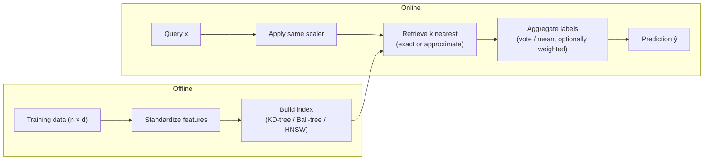
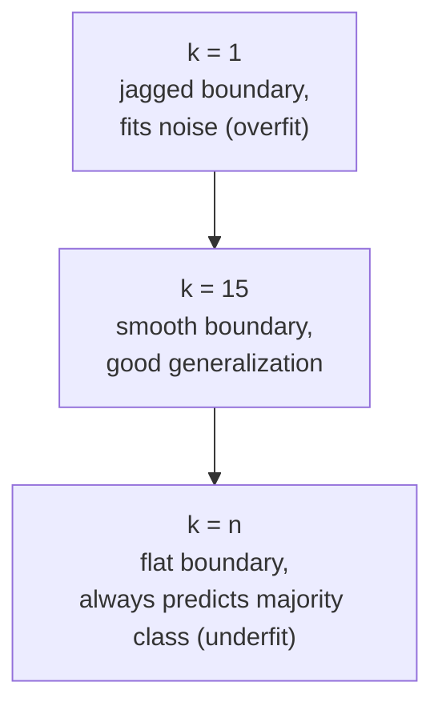
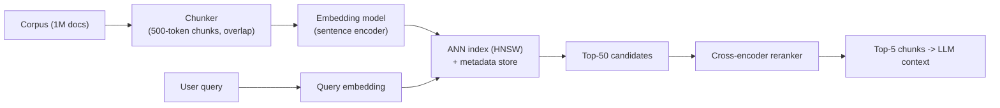

# 1.6 — K-Nearest Neighbors (KNN)

## 1. Overview

**What is it?** K-Nearest Neighbors is a non-parametric, instance-based learning algorithm. To predict a label for a new point, it finds the $k$ training points closest to it (under some distance metric) and aggregates their labels — a majority vote for classification, an average for regression. There is no training phase in the usual sense: the "model" *is* the training data, which is why KNN is called a **lazy learner**.

**Why does it exist?** KNN formalizes the oldest idea in pattern recognition: *similar things have similar labels*. It dates back to Fix and Hodges (1951) and Cover and Hart (1967), who proved a remarkable theoretical guarantee: with infinite data, the error of 1-NN is at most twice the Bayes-optimal error. It exists because it needs almost no assumptions about the shape of the decision boundary.

**What problem does it solve?** Classification, regression, and — most importantly today — **retrieval**: finding the most similar items to a query. Every semantic-search engine, recommendation candidate generator, and Retrieval-Augmented Generation (RAG) system is, at its core, running a nearest-neighbor search over embedding vectors.

**Where is it used?** As a teaching baseline for classification; as the retrieval engine inside vector databases ([Vector Databases](../phase-3-nlp-llm/10-vector-databases.md)); in recommender systems (item-item similarity); in anomaly detection (points far from all neighbors are suspicious); and in deduplication (near-duplicate images/documents).

## 2. Learning Objectives

After this chapter you will be able to:

- Explain why KNN is called a *lazy*, *non-parametric*, *instance-based* learner.
- Choose and justify a distance metric (Euclidean, Manhattan, Minkowski, cosine, Mahalanobis) for a given data type.
- Derive the effect of $k$ on the bias–variance trade-off and select $k$ via cross-validation.
- Explain the curse of dimensionality mathematically and demonstrate it empirically.
- Implement KNN from scratch in NumPy, including weighted voting.
- Describe how KD-trees and Ball-trees accelerate exact search, and why they fail in high dimensions.
- Explain approximate nearest neighbor (ANN) methods — LSH, HNSW, IVF, product quantization — at a conceptual level.
- Connect KNN to modern vector databases and RAG retrieval pipelines.
- Analyze the time and space complexity of brute-force vs. indexed search.
- Diagnose and fix the classic KNN failure modes: unscaled features, class imbalance, and irrelevant dimensions.

## 3. Prerequisites

| Chapter | Why you need it |
|---|---|
| [Linear Algebra](../phase-0-prerequisites/02-linear-algebra.md) | Distances are norms of difference vectors; cosine similarity is a normalized dot product. |
| [Probability & Statistics](../phase-0-prerequisites/04-probability-statistics.md) | KNN classification is a local estimate of $P(y \mid \mathbf{x})$; you need expectation and variance to reason about it. |
| [NumPy & Pandas](../phase-0-prerequisites/05-numpy-pandas.md) | The from-scratch implementation relies on vectorized array operations and broadcasting. |
| [ML Fundamentals](01-ml-fundamentals.md) | Train/test splits, cross-validation, and the bias–variance trade-off are used throughout. |
| [Logistic Regression](04-logistic-regression.md) | Serves as the parametric counterpoint: KNN is what happens when you refuse to fit parameters. |

## 4. Intuition

Imagine you move to a new city and want to guess whether a restaurant is good before eating there. You have no menu, no reviews of *this* restaurant — but you know how you rated the five most similar restaurants you've been to (same cuisine, same price band, same neighborhood vibe). If four out of five were great, you predict "great." That's KNN with $k=5$: no model, no learned parameters, just *memory plus a notion of similarity*.

A second analogy: KNN is like asking your nearest neighbors how to vote in a local election. If you live in a neighborhood where most people vote one way, you're statistically likely to vote that way too — geographic proximity correlates with the label. The whole art of KNN is defining "neighborhood" well: what does *near* mean for your data?

Two dials control the algorithm's personality:

- **The distance metric** decides *who counts as a neighbor*. Physical distance? Shared interests? Same language? The wrong metric groups the wrong people.
- **The number $k$** decides *how big your neighborhood is*. Ask 1 person and you get a noisy, opinionated answer (low bias, high variance). Ask 10,000 people and you just get the citywide average, blind to your street (high bias, low variance).

> [!NOTE]
> KNN never "learns" anything at training time — `fit()` just stores the data. All the work happens at prediction time. This is the opposite of models like [linear regression](02-linear-regression.md), which do all the work up front and then predict in microseconds.

## 5. Real-world Motivation

Companies use nearest-neighbor search whenever the question is "what is most similar to this?":

- **Pinterest** runs visual search over billions of image embeddings; finding visually similar pins is approximate KNN at extreme scale.
- **Spotify** uses nearest-neighbor search over audio and collaborative-filtering embeddings to find similar songs and generate candidates for radio and Discover Weekly-style features (their open-source ANN library, Annoy, came out of this work).
- **Meta (Facebook AI)** built **FAISS**, the most widely used similarity-search library, to power embedding retrieval across products and research.
- **Google** developed **ScaNN** for high-performance vector search, and vector retrieval underpins semantic search features across its products.
- **Amazon** uses item-item nearest-neighbor collaborative filtering — a KNN over item vectors — as a core recommendation technique (published as "item-to-item collaborative filtering").
- **Every modern RAG stack** (OpenAI-based assistants, enterprise chatbots) retrieves the top-$k$ most similar document chunks to a query embedding before generating an answer. Pinecone, Weaviate, Qdrant, and Milvus are, essentially, production-grade KNN engines — see [Vector Databases](../phase-3-nlp-llm/10-vector-databases.md).

The lesson: as a *classifier*, KNN is a baseline; as a *retrieval engine*, it is one of the most commercially important algorithms in existence.

## 6. Mathematical Foundations

### 6.1 Distance metrics

Let $\mathbf{x}, \mathbf{x}' \in \mathbb{R}^d$ be two feature vectors with components $x_j$, $x'_j$ for $j = 1, \dots, d$.

**Euclidean (L2)** — straight-line distance:

$$
d_2(\mathbf{x},\mathbf{x}') = \sqrt{\sum_{j=1}^{d} (x_j - x'_j)^2}
$$

**Manhattan (L1)** — city-block distance, more robust to outlier coordinates:

$$
d_1(\mathbf{x},\mathbf{x}') = \sum_{j=1}^{d} |x_j - x'_j|
$$

**Minkowski (Lp)** — the family that contains both ($p=2$ gives Euclidean, $p=1$ gives Manhattan):

$$
d_p(\mathbf{x},\mathbf{x}') = \Big(\sum_{j=1}^{d} |x_j - x'_j|^p\Big)^{1/p}
$$

**Cosine distance** — measures the *angle* between vectors, ignoring magnitude; the standard for text and neural embeddings:

$$
d_{\cos}(\mathbf{x},\mathbf{x}') = 1 - \frac{\mathbf{x}\cdot\mathbf{x}'}{\|\mathbf{x}\|\,\|\mathbf{x}'\|}
$$

where $\mathbf{x}\cdot\mathbf{x}' = \sum_j x_j x'_j$ is the dot product and $\|\mathbf{x}\| = \sqrt{\sum_j x_j^2}$ is the L2 norm.

**Mahalanobis distance** — accounts for feature correlations via the covariance matrix $\Sigma \in \mathbb{R}^{d \times d}$ of the data:

$$
d_M(\mathbf{x},\mathbf{x}') = \sqrt{(\mathbf{x}-\mathbf{x}')^\top \Sigma^{-1} (\mathbf{x}-\mathbf{x}')}
$$

Intuitively it "whitens" the data first: distances shrink along directions of high variance and stretch along directions of low variance. When $\Sigma = I$ (identity), it reduces to Euclidean.

### 6.2 Prediction rules

Let $\mathcal{N}_k(\mathbf{x})$ denote the set of indices of the $k$ training points nearest to query $\mathbf{x}$, and $\mathbb{1}[\cdot]$ the indicator function (1 if true, 0 otherwise).

**Classification (uniform vote):**

$$
\hat y = \arg\max_{c} \sum_{i \in \mathcal{N}_k(\mathbf{x})} \mathbb{1}[y_i = c]
$$

**Regression (mean of neighbors):**

$$
\hat y = \frac{1}{k}\sum_{i \in \mathcal{N}_k(\mathbf{x})} y_i
$$

**Distance-weighted prediction** — closer neighbors get more say. With $d_i$ the distance to the $i$-th neighbor:

$$
\hat y = \frac{\sum_{i \in \mathcal{N}_k(\mathbf{x})} \frac{1}{d_i^2}\, y_i}{\sum_{i \in \mathcal{N}_k(\mathbf{x})} \frac{1}{d_i^2}}
$$

The weight $1/d_i^2$ is a common choice; any decreasing function of distance works. Weighting reduces sensitivity to the exact value of $k$.

### 6.3 KNN as a probability estimator

Uniform-vote KNN is a local, empirical estimate of the class posterior:

$$
\hat P(y = c \mid \mathbf{x}) = \frac{1}{k} \sum_{i \in \mathcal{N}_k(\mathbf{x})} \mathbb{1}[y_i = c]
$$

This is exactly the fraction of the $k$ nearest neighbors that belong to class $c$. As $n \to \infty$ with $k \to \infty$ and $k/n \to 0$, this estimate converges to the true posterior — which is why KNN is *universally consistent*: with enough data it approaches the Bayes-optimal classifier.

### 6.4 The bias–variance role of $k$

- **Small $k$ (e.g., $k=1$):** the decision boundary follows every training point, including noise → **low bias, high variance**. The 1-NN training error is exactly zero (each point is its own nearest neighbor), a red flag for overfitting.
- **Large $k$ (e.g., $k=n$):** every prediction is the global majority class → **high bias, low variance**; the model ignores $\mathbf{x}$ entirely.
- The classical asymptotic result (Cover & Hart, 1967): the 1-NN error rate $R_{1\text{NN}}$ satisfies $R^* \le R_{1\text{NN}} \le 2R^*(1 - R^*) \le 2R^*$, where $R^*$ is the Bayes error — the lowest achievable error. Half of the achievable information is already in your single nearest neighbor.

### 6.5 The curse of dimensionality

In high dimensions, "nearest" loses meaning. Two complementary arguments:

**Volume argument.** To capture a fraction $r$ of uniformly distributed data in a $d$-dimensional unit hypercube, you need a sub-cube of edge length $e_d(r) = r^{1/d}$. For $r = 0.01$ (1% of the data) and $d = 10$: $e_{10}(0.01) = 0.01^{0.1} \approx 0.63$ — your "local" neighborhood spans 63% of each axis's range. Locality is gone.

**Distance concentration.** For i.i.d. points in high dimension, the ratio of the distances to the farthest and nearest neighbor converges to 1:

$$
\frac{d_{\max} - d_{\min}}{d_{\min}} \xrightarrow{d \to \infty} 0
$$

All points become nearly equidistant, so the ranking of neighbors is dominated by noise. This is why raw high-dimensional data (pixels, one-hot text) must first be mapped to a lower-dimensional, semantically meaningful embedding — via [PCA](13-pca.md) or a learned neural encoder — before KNN works well.

## 7. Visual Explanation

Decision by neighborhood — the query `?` gets the label of the majority of its 3 nearest neighbors:

```
   x2
    |     x  x  x
    |   x    ?     o     <- ? = query; nearest 3 are all "x" -> predict "x"
    |  x   x         o o
    |               o
    +---------------------- x1
```

The end-to-end query pipeline, including the indexing shortcut used in production:



And the effect of $k$ on the decision boundary:



## 8. Algorithm

1. **Preprocess:** standardize every feature to zero mean and unit variance (or min–max scale). Distances are meaningless if one feature is in dollars and another in kilometers.
2. **"Train":** store the training matrix $X \in \mathbb{R}^{n \times d}$ and labels $y$. Optionally build a spatial index (KD-tree for $d \lesssim 20$, Ball-tree for moderate $d$, HNSW for large $n$ and high $d$).
3. **Query**, for each new point $\mathbf{x}$:
   1. Compute (or retrieve via the index) distances to training points.
   2. Select the $k$ smallest distances → neighbor set $\mathcal{N}_k(\mathbf{x})$.
   3. Aggregate: majority vote (classification) or mean (regression), optionally weighted by $1/d_i^2$.
4. **Tune:** choose $k$ and the metric by cross-validation; odd $k$ avoids ties in binary classification.

```text
PSEUDOCODE — brute-force KNN classification
────────────────────────────────────────────
fit(X_train, y_train):
    store X_train (n × d), y_train (n)

predict(x_query):
    for i in 1..n:                      # O(n·d)
        dist[i] = metric(x_query, X_train[i])
    nn = indices of k smallest dist     # O(n) with partial selection
    if weighted:
        return argmax_c Σ_{i∈nn, y_i=c} 1/dist[i]²
    else:
        return mode(y_train[nn])        # majority vote
```

## 9. Worked Example

### Tiny example, fully by hand

Training set (2 features, already scaled), binary labels:

| Point | $x_1$ | $x_2$ | $y$ |
|---|---|---|---|
| A | 1 | 1 | Red |
| B | 2 | 1 | Red |
| C | 4 | 3 | Blue |
| D | 5 | 4 | Blue |
| E | 3 | 3 | Blue |

Query: $\mathbf{q} = (3, 2)$, $k = 3$, Euclidean distance.

Compute each distance $d_2(\mathbf{q}, \cdot)$:

- $d(\mathbf{q}, A) = \sqrt{(3-1)^2 + (2-1)^2} = \sqrt{5} \approx 2.24$
- $d(\mathbf{q}, B) = \sqrt{(3-2)^2 + (2-1)^2} = \sqrt{2} \approx 1.41$
- $d(\mathbf{q}, C) = \sqrt{(3-4)^2 + (2-3)^2} = \sqrt{2} \approx 1.41$
- $d(\mathbf{q}, D) = \sqrt{(3-5)^2 + (2-4)^2} = \sqrt{8} \approx 2.83$
- $d(\mathbf{q}, E) = \sqrt{(3-3)^2 + (2-3)^2} = 1.00$

The 3 nearest are **E (Blue, 1.00), B (Red, 1.41), C (Blue, 1.41)**. Vote: Blue 2, Red 1 → **predict Blue**.

With *distance-weighted* voting: Blue gets $1/1.00^2 + 1/1.41^2 = 1 + 0.5 = 1.5$; Red gets $1/1.41^2 = 0.5$. Still Blue, but now with a confidence-like score of $1.5 / 2.0 = 0.75$.

### Realistic example

On the Iris dataset (150 flowers, 4 features, 3 species): standardize, use $k = 5$, Euclidean. A query flower with sepal length 5.1 and sepal width 3.5 finds its 5 nearest neighbors — all *setosa* — so the vote is unanimous. 5-fold cross-validated accuracy is typically ~96–97%, matching far more complex models on this small, well-separated dataset.

## 10. Python from Scratch

Pure NumPy implementation with three metrics and both uniform and distance-weighted voting.

```python
import numpy as np
from collections import Counter

class KNN:
    """K-Nearest Neighbors classifier, brute force. O(n·d) per query."""

    def __init__(self, k=5, metric="l2", weighted=False):
        self.k = k                # number of neighbors
        self.metric = metric      # "l2", "l1", or "cosine"
        self.weighted = weighted  # True -> 1/d² distance weighting

    def fit(self, X, y):
        # Lazy learner: "training" = memorizing the data.
        self.X = np.asarray(X, dtype=float)   # shape (n, d)
        self.y = np.asarray(y)                # shape (n,)
        return self

    def _dist(self, x):
        """Distances from one query x (shape (d,)) to all n training rows."""
        if self.metric == "l2":
            # Broadcasting: (n, d) - (d,) -> (n, d); norm along axis 1 -> (n,)
            return np.linalg.norm(self.X - x, axis=1)
        if self.metric == "l1":
            return np.abs(self.X - x).sum(axis=1)
        if self.metric == "cosine":
            # Normalize rows and query to unit length; distance = 1 - cos sim
            a = self.X / np.linalg.norm(self.X, axis=1, keepdims=True)
            b = x / np.linalg.norm(x)
            return 1.0 - a @ b                # (n,) cosine distances
        raise ValueError(f"unknown metric {self.metric}")

    def predict(self, X):
        out = []
        for x in np.asarray(X, dtype=float):
            d = self._dist(x)                                  # (n,)
            # argpartition: O(n) partial sort — top-k without full sort
            idx = np.argpartition(d, self.k)[: self.k]
            if self.weighted:
                # Accumulate 1/d² votes per class; eps avoids division by 0
                w = 1.0 / (d[idx] ** 2 + 1e-12)
                votes = {}
                for lbl, wi in zip(self.y[idx], w):
                    votes[lbl] = votes.get(lbl, 0.0) + wi
                out.append(max(votes, key=votes.get))
            else:
                out.append(Counter(self.y[idx]).most_common(1)[0][0])
        return np.array(out)

# --- Demo on the hand-worked example -------------------------------------
X = np.array([[1, 1], [2, 1], [4, 3], [5, 4], [3, 3]], dtype=float)
y = np.array(["Red", "Red", "Blue", "Blue", "Blue"])
print(KNN(k=3).fit(X, y).predict([[3, 2]]))   # Expected output: ['Blue']
```

**Complexity:** each query costs $O(nd)$ for distances plus $O(n)$ for `argpartition`. Memory is $O(nd)$ — the whole training set.

> [!WARNING]
> **Common bug:** forgetting to apply the *same* scaler to queries that you fit on training data. If you standardize `X_train` but pass raw `X_test`, distances are computed in mismatched units and accuracy collapses silently — no error is raised.

## 11. Library Implementation

scikit-learn is the standard choice for classical KNN; FAISS for large-scale retrieval.

```python
from sklearn.datasets import load_iris
from sklearn.model_selection import train_test_split, GridSearchCV
from sklearn.pipeline import Pipeline
from sklearn.preprocessing import StandardScaler
from sklearn.neighbors import KNeighborsClassifier

X, y = load_iris(return_X_y=True)
X_tr, X_te, y_tr, y_te = train_test_split(X, y, test_size=0.3, random_state=42)

# Pipeline guarantees the scaler is fit on train folds only (no leakage).
pipe = Pipeline([
    ("scaler", StandardScaler()),          # zero mean, unit variance per feature
    ("knn", KNeighborsClassifier(
        weights="distance",                # 1/d weighting instead of uniform
        algorithm="auto",                  # picks brute / kd_tree / ball_tree
        metric="minkowski", p=2,           # p=2 -> Euclidean
    )),
])

# Cross-validate over k: the single most important hyperparameter.
grid = GridSearchCV(pipe, {"knn__n_neighbors": [1, 3, 5, 7, 11, 15, 21]}, cv=5)
grid.fit(X_tr, y_tr)
print(grid.best_params_)                   # e.g. {'knn__n_neighbors': 7}
print(grid.score(X_te, y_te))              # e.g. 0.955…
```

For millions of vectors, exact search is too slow — use **FAISS**:

```python
import faiss, numpy as np

d = 128                                    # embedding dimension
xb = np.random.rand(1_000_000, d).astype("float32")  # database vectors
xq = np.random.rand(5, d).astype("float32")          # queries

index = faiss.IndexHNSWFlat(d, 32)         # HNSW graph, 32 links per node
index.add(xb)                              # build index: one-time cost
D, I = index.search(xq, k=10)              # D: (5,10) distances, I: (5,10) ids
```

`IndexHNSWFlat` returns *approximate* neighbors with typical recall > 95% at ~100× the speed of brute force. This is exactly what vector databases run internally ([Vector Databases](../phase-3-nlp-llm/10-vector-databases.md)).

## 12. Code Walkthrough

Tracing the scratch implementation on the 5-point example with $k=3$:

| Tensor / value | Shape | Meaning |
|---|---|---|
| `self.X` | (5, 2) | Stored training features |
| `self.y` | (5,) | Stored labels `["Red","Red","Blue","Blue","Blue"]` |
| `x` (query) | (2,) | `[3., 2.]` |
| `self.X - x` | (5, 2) | Broadcast difference vectors |
| `d` | (5,) | `[2.24, 1.41, 1.41, 2.83, 1.00]` |
| `idx` | (3,) | Indices of 3 smallest → `{4, 1, 2}` (E, B, C, any order) |
| `self.y[idx]` | (3,) | `["Blue","Red","Blue"]` |
| output | (1,) | `["Blue"]` |

**Inputs:** raw feature matrix + labels (fit), query matrix (predict). **Intermediate values:** distance vector per query, top-$k$ index set. **Output:** predicted label per query row. **Expected result:** `['Blue']`, matching the hand computation in Section 9 exactly — always verify scratch code against a hand-solved case.

## 13. Complexity Analysis

| Approach | Query time | Build time | Space | Notes |
|---|---|---|---|---|
| Brute force | $O(nd)$ | $O(1)$ | $O(nd)$ | Exact; fine up to ~10⁵–10⁶ points |
| KD-tree | $O(d \log n)$ avg, low $d$ | $O(dn \log n)$ | $O(nd)$ | Degrades to $O(nd)$ for $d \gtrsim 20$ |
| Ball-tree | $O(d \log n)$ avg | $O(dn \log n)$ | $O(nd)$ | Handles moderate $d$ better than KD-tree |
| HNSW (approximate) | ~$O(d\log n)$ empirical | $O(dn \log n)$ | $O(nd + n \cdot M)$ | Graph with $M$ links/node; recall < 100% |
| IVF-PQ (approximate) | sub-linear | $O(nd)$ + k-means | $\ll O(nd)$ (compressed) | Product quantization compresses vectors ~10–100× |

**Reasoning:** brute force must touch every training vector ($n$ of them, $d$ operations each). Tree methods prune subtrees whose bounding regions cannot contain a nearer neighbor — but in high dimensions the bounding regions overlap almost everywhere (a consequence of distance concentration, Section 6.5), so nothing gets pruned and you fall back to linear scan. Approximate methods deliberately give up exactness: HNSW walks a small-world graph greedily; IVF probes only a few coarse clusters.

Space is always at least $O(nd)$ unless you compress: KNN stores the training set forever, unlike parametric models whose size is independent of $n$.

## 14. Advantages

- **Zero training time.** Adding new data is instant — just append rows. Valuable for systems ingesting fresh content continuously (e.g., new documents in a RAG index).
- **No assumptions about the decision boundary.** KNN adapts to arbitrarily curved, disconnected class regions where linear models fail. Example: concentric-circle data is trivial for KNN and impossible for [logistic regression](04-logistic-regression.md) without feature engineering.
- **Naturally multi-class.** No one-vs-rest machinery required; the vote handles any number of classes.
- **The right tool for retrieval.** "Find the 10 most similar items" *is* the KNN problem — recommendation candidate generation, semantic search, dedup all reduce to it.
- **Interpretable predictions.** You can show the user *which* neighbors caused the prediction ("this looks like these 5 past cases"), useful in medical or legal settings.

## 15. Disadvantages

- **Slow inference.** $O(nd)$ per query without an index; a 10M-row dataset at 100 features means a billion operations per prediction. Fails hard in low-latency serving without ANN.
- **Memory-hungry.** The entire training set lives in RAM at serving time.
- **Curse of dimensionality.** Above ~20 effective dimensions, distances concentrate and neighbors become meaningless (Section 6.5). Raw pixels or one-hot text vectors are guaranteed failure cases.
- **Sensitive to feature scaling and irrelevant features.** One feature in units of thousands dominates all others; 50 noise features drown out 3 informative ones. There is no built-in feature selection.
- **Class imbalance skews votes.** With 95% negatives, large $k$ neighborhoods are majority-negative almost everywhere; minority classes get outvoted.
- **No probabilistic calibration.** Vote fractions are crude probability estimates, especially for small $k$.

## 16. Common Mistakes

- **Not scaling features.** The #1 KNN bug. *Fix:* always wrap a `StandardScaler` and the classifier in a single sklearn `Pipeline` so scaling is applied consistently and without leakage.
- **Choosing $k$ by gut feeling.** $k=3$ vs $k=15$ can differ by many accuracy points. *Fix:* grid-search $k$ with cross-validation; plot validation accuracy vs. $k$ to see the bias–variance curve.
- **Even $k$ in binary classification.** Ties must be broken arbitrarily. *Fix:* use odd $k$, or distance-weighted voting (ties become measure-zero events).
- **Running KNN on raw high-dimensional data** (pixels, one-hot bag-of-words). *Fix:* embed first — [PCA](13-pca.md), or a pretrained neural encoder — then run KNN in embedding space.
- **Evaluating on the training set.** 1-NN gives 100% training accuracy by construction, which means nothing. *Fix:* always use held-out data.
- **Shipping brute-force KNN to production** and watching latency and memory explode as data grows. *Fix:* use an ANN index (FAISS/HNSW) once $n$ exceeds ~10⁵.

## 17. Best Practices

Production checklist:

- [ ] Standardize features inside a pipeline; persist the scaler with the model.
- [ ] Select $k$ and metric via cross-validation; prefer distance weighting for robustness.
- [ ] Reduce dimensionality (or use learned embeddings) before neighbor search when $d > 20$.
- [ ] Use cosine distance for text/neural embeddings; Euclidean for standardized numeric features; Mahalanobis when features are strongly correlated and $d$ is small.
- [ ] For $n > 10^5$: switch to FAISS/HNSW; measure **recall@k against exact search** on a sample to validate the index.
- [ ] Monitor index freshness: plan for inserts/deletes (HNSW supports incremental adds; IVF may need periodic retraining of coarse centroids).
- [ ] For imbalanced classes, use distance weighting and consider per-class distance calibration.
- [ ] Log neighbor IDs with predictions — invaluable for debugging ("why did the model say this?").

## 18. Optimization Techniques

- **Approximate nearest neighbors.** HNSW (hierarchical navigable small-world graphs), IVF (inverted-file coarse quantization), and LSH (locality-sensitive hashing) trade a few points of recall for 10–1000× speedups. Libraries: FAISS, ScaNN, HNSWlib, Annoy.
- **Product quantization (PQ).** Split each vector into sub-vectors, quantize each with a small codebook; a 512-byte float vector compresses to ~32 bytes, and distances are computed via table lookups. Enables billion-scale indexes in RAM.
- **Dimensionality reduction.** [PCA](13-pca.md) to 32–128 dims before indexing often *improves* both speed and accuracy by discarding noise dimensions.
- **Vectorization / batching.** Compute all query–database distances as one matrix operation: for L2, use the identity $\|a-b\|^2 = \|a\|^2 + \|b\|^2 - 2a^\top b$ so the bulk of the work is a single GEMM — orders of magnitude faster than Python loops.
- **GPU brute force.** For $n \le 10^7$, `faiss.IndexFlatL2` on GPU is often faster (and exact) than a CPU approximate index.
- **Caching.** Popular queries (head of the query distribution) can have their neighbor lists cached with a TTL.

## 19. Industry Applications

- **RAG retrieval (production example).** An enterprise assistant embeds every document chunk with a text encoder, indexes ~10M vectors in a vector database, and at query time retrieves top-20 neighbors in <50 ms, which are passed to an LLM. Recall@20 of the ANN layer is monitored as a first-class production metric. See [RAG](../phase-3-nlp-llm/09-rag.md) and [Vector Databases](../phase-3-nlp-llm/10-vector-databases.md).
- **Visual search — Pinterest.** Billions of image embeddings; a user taps an image and gets visually similar products via approximate KNN.
- **Music similarity — Spotify.** Nearest neighbors in collaborative-filtering embedding space generate song candidates (Annoy was built for this workload).
- **Item-to-item recommendations — Amazon.** The classic "customers who bought this also bought" pipeline is neighbor search over item co-purchase vectors.
- **Anomaly and fraud detection.** Transactions whose distance to their $k$-th nearest historical neighbor is large are flagged as outliers.
- **Near-duplicate detection.** Web-scale dedup of images and documents (e.g., for training-set hygiene of large models) uses ANN over perceptual hashes or embeddings.

## 20. Interview Questions

### Beginner

**Q1. Why is KNN called a "lazy" learner?**
**A.** It defers all computation to prediction time. `fit()` just stores the data; there is no parameter estimation. Eager learners (linear regression, neural nets) compress data into parameters up front and predict cheaply; KNN does the opposite.

**Q2. Why must features be standardized before KNN?**
**A.** Distances sum contributions across features. A feature ranging 0–100,000 (salary) numerically dominates one ranging 0–1 (rate), so neighbors are chosen almost entirely by the large-scale feature. Standardization gives every feature equal a-priori influence.

**Q3. What happens as $k$ increases from 1 to $n$?**
**A.** Variance decreases and bias increases. $k=1$: jagged boundary that fits noise (zero training error). $k=n$: constant prediction of the majority class. The sweet spot balances the two and is found by cross-validation.

**Q4. Is KNN parametric or non-parametric, and why?**
**A.** Non-parametric: it makes no fixed-dimensional assumption about the form of the decision function. Its effective complexity grows with the training data rather than being fixed by a parameter vector.

**Q5. How does KNN do regression?**
**A.** Predict the mean (or distance-weighted mean) of the $k$ nearest neighbors' target values instead of a majority vote.

### Intermediate

**Q1. Explain the curse of dimensionality for KNN.**
**A.** In high dimensions, (a) neighborhoods needed to capture even 1% of data span most of each axis (volume grows as $r^{1/d}$), and (b) distances concentrate — $d_{\max}/d_{\min} \to 1$ — so the nearest neighbor is barely nearer than the farthest and neighbor rankings become noise. Remedy: embed into a low-dimensional, semantically meaningful space first.

**Q2. When would you use cosine distance instead of Euclidean?**
**A.** When direction matters more than magnitude: text vectors (a long and a short document about the same topic should be "close") and neural embeddings (often trained with cosine/dot-product objectives). Note: on L2-normalized vectors, cosine and Euclidean rankings are identical, since $\|a-b\|^2 = 2 - 2\cos(a,b)$.

**Q3. Uniform vs. distance-weighted voting — trade-offs?**
**A.** Weighted voting lets close neighbors dominate, reduces sensitivity to the exact $k$, breaks ties naturally, and helps when the query lies near a class boundary. Downside: sensitive to distance-scale noise, and a single duplicate point (distance ≈ 0) can hijack the vote — hence the epsilon in implementations.

**Q4. How does KNN behave under class imbalance and what do you do about it?**
**A.** The majority class wins votes almost everywhere for moderate/large $k$. Mitigations: distance weighting, smaller $k$, class-weighted votes (divide votes by class frequency), or resampling the training set.

**Q5. Why does a KD-tree fail in high dimensions?**
**A.** KD-tree pruning relies on bounding hyper-rectangles being distinguishable in distance from the query. With concentrated distances, almost every branch's bounding box *could* contain a nearer neighbor, so the search visits nearly all leaves — $O(n)$, same as brute force, with extra overhead.

### Advanced

**Q1. State the Cover–Hart bound and its meaning.**
**A.** As $n \to \infty$, the 1-NN error $R_{1\text{NN}}$ satisfies $R^* \le R_{1\text{NN}} \le 2R^*(1-R^*) \le 2R^*$ where $R^*$ is the Bayes error. Meaning: with unlimited data, the *simplest possible* classifier is at most a factor-2 from optimal — half the discriminative information is in the single nearest neighbor.

**Q2. How does HNSW achieve sub-linear approximate search?**
**A.** It builds a multi-layer "small-world" proximity graph: upper layers are sparse long-range links (like an express-train network), lower layers dense short-range links. A query greedily descends: coarse navigation on top layers, refinement below, visiting $O(\log n)$ nodes empirically. Recall is tuned via `efSearch` (candidate-list size).

**Q3. Explain product quantization and why distance computation stays fast.**
**A.** Split each $d$-dim vector into $m$ sub-vectors; k-means each sub-space into 256 centroids; store each sub-vector as a 1-byte code. At query time, precompute a $m \times 256$ table of sub-distances from the query to every centroid; the distance to any database vector is then $m$ table lookups + adds — no floating-point vector math per candidate.

**Q4. How is KNN mathematically related to kernel density estimation?**
**A.** Both are local nonparametric estimators. KDE fixes the bandwidth (region size) and lets the neighbor count vary; KNN fixes the count $k$ and lets the region size vary (adaptive bandwidth $=$ distance to the $k$-th neighbor). KNN classification is a plug-in Bayes rule using these adaptive density estimates per class.

**Q5. Your ANN index reports 99% recall offline but retrieval quality in the RAG product is poor. Diagnose.**
**A.** Recall@k measures agreement with *exact* KNN under the chosen metric — it says nothing about whether the *embedding space* puts semantically relevant documents near queries. Likely culprits: embedding model mismatch between queries and documents, stale index vs. updated embedding model, wrong metric (dot product vs. cosine without normalization), or chunking that destroys context. Evaluate end-to-end relevance (e.g., nDCG on labeled query–document pairs), not just index recall.

## 21. Coding Exercises

### Easy

1. **Weighted voting.** Extend the Section 10 class to support `weights="distance"` using $1/d^2$; verify on the 5-point example that the Blue score is 1.5 vs. Red 0.5. *Hint: guard against zero distances with a small epsilon.*
2. **k-sweep curve.** On Iris, plot 5-fold CV accuracy for $k \in \{1, 3, \dots, 51\}$ and mark the bias/variance regimes. *Hint: `cross_val_score` in a loop; expect an inverted-U shape.*

### Medium

1. **Distance concentration demo.** For $d \in \{2, 10, 100, 1000\}$, sample 1,000 uniform points in $[0,1]^d$ and plot the histogram of pairwise distances divided by their mean. *Hint: watch the relative spread shrink as $d$ grows — that's the curse of dimensionality in one picture.*
2. **Vectorized batch prediction.** Replace the per-query loop with a single matrix computation using $\|a-b\|^2 = \|a\|^2 + \|b\|^2 - 2ab^\top$; benchmark vs. the loop on 10k × 10k points. *Hint: `np.einsum` or `(A**2).sum(1)[:,None] + (B**2).sum(1)[None,:] - 2*A@B.T`.*
3. **KNN regressor.** Implement `KNNRegressor` with uniform and weighted means; test on a noisy sine curve and plot predictions for $k \in \{1, 5, 50\}$. *Hint: $k=1$ interpolates the noise; $k=50$ oversmooths the peaks.*

### Hard

1. **KD-tree from scratch.** Implement build (median split on the widest dimension) and a branch-and-bound k-NN query; verify results match brute force exactly, then benchmark for $d \in \{2, 8, 32\}$ to observe the high-$d$ collapse. *Hint: prune a subtree only if the distance from the query to its bounding box exceeds the current $k$-th best distance.*
2. **Exact vs. approximate at scale.** Index 1M random 128-d vectors with `faiss.IndexFlatL2` (exact) and `IndexHNSWFlat`; measure recall@10 and queries/second for several `efSearch` values, and plot the recall–throughput frontier. *Hint: ground truth = exact index results.*

## 22. Mini Project

**Handwritten-digit classifier on MNIST with KNN.**

1. Load MNIST (70,000 images, 28×28) via `sklearn.datasets.fetch_openml("mnist_784")`; subsample 10,000 for speed.
2. Scale pixels to $[0,1]$; split 80/20 train/test.
3. Fit `KNeighborsClassifier`; grid-search $k \in \{1,3,5,7\}$ and `weights ∈ {uniform, distance}` with 3-fold CV.
4. Evaluate on the test set; build a confusion matrix and inspect the most-confused digit pairs (typically 4↔9, 3↔5).
5. Apply [PCA](13-pca.md) to 50 components and repeat — observe faster queries and often *equal or better* accuracy (noise dimensions removed).
6. Write a short report: best $k$, accuracy with/without PCA, and query latency for both.

## 23. Medium Project

**Image similarity search with neural embeddings + FAISS.**

1. Collect ~50–100k images (e.g., a public Unsplash/CIFAR-scale dataset).
2. Extract 512-d embeddings with a pretrained ResNet/CLIP encoder (batched, GPU if available); L2-normalize.
3. Build two FAISS indexes: `IndexFlatIP` (exact, inner product = cosine on normalized vectors) and `IndexHNSWFlat`.
4. Measure recall@10 of HNSW vs. exact, and latency of both, across `efSearch ∈ {16, 64, 256}`.
5. Build a small demo (notebook or Streamlit): upload an image → show its 10 nearest neighbors.
6. Stress-test edge cases: near-duplicates, rotations, crops — document where embedding similarity breaks down.

## 24. Advanced Project

**Production RAG retrieval pipeline with evaluation.**

Architecture:



Implementation phases:

1. **Ingestion:** chunk 1M documents; embed with a sentence encoder; store vectors + metadata (doc ID, offsets).
2. **Indexing:** build HNSW (e.g., FAISS or Qdrant); persist and version the index alongside the embedding-model version.
3. **Retrieval API:** FastAPI endpoint: embed query → top-50 ANN → cross-encoder rerank → top-5.
4. **Evaluation:** build a labeled set of query→relevant-doc pairs; report recall@k and nDCG@k for (a) exact search, (b) HNSW at several `efSearch`, (c) with/without reranker.
5. **Operations:** measure P50/P99 latency; add incremental upserts for new documents; monitor recall drift on a golden query set.

Possible improvements: hybrid retrieval (BM25 + vectors with reciprocal-rank fusion), product quantization to cut RAM 10×, query caching, and multi-tenant index sharding. This project is the direct bridge to [RAG](../phase-3-nlp-llm/09-rag.md) and [Vector Databases](../phase-3-nlp-llm/10-vector-databases.md).

## 25. Summary

- KNN predicts by aggregating the labels of the $k$ closest training points; `fit` is storage, all work happens at query time.
- The distance metric defines "similar": Euclidean for scaled numerics, cosine for embeddings/text, Mahalanobis for correlated features.
- $k$ is the bias–variance dial: small $k$ overfits, large $k$ underfits; tune with cross-validation, prefer odd $k$ or distance weighting.
- Feature scaling is non-negotiable — unscaled features silently corrupt every distance.
- Cover–Hart: with infinite data, even 1-NN is within 2× of the Bayes-optimal error.
- The curse of dimensionality makes raw high-dimensional KNN meaningless; embed or reduce dimensions first.
- Exact search is $O(nd)$ per query; KD-/Ball-trees help only for low $d$; HNSW/IVF-PQ give sub-linear approximate search at scale.
- KNN's modern superpower is retrieval: vector databases and RAG pipelines are industrial-strength approximate KNN.
- Space cost is $O(nd)$ forever — the model *is* the data.
- Validate ANN indexes with recall@k against exact search, and end-to-end relevance metrics in production.

## 26. Cheat Sheet

| Formula | Meaning |
|---|---|
| $d_2 = \sqrt{\sum_j (x_j - x'_j)^2}$ | Euclidean (default for scaled numerics) |
| $d_{\cos} = 1 - \frac{\mathbf{x}\cdot\mathbf{x}'}{\|\mathbf{x}\|\|\mathbf{x}'\|}$ | Cosine (default for embeddings) |
| $\hat y = \arg\max_c \sum_{i \in \mathcal{N}_k} \mathbb{1}[y_i = c]$ | Classification vote |
| $\hat y = \frac{\sum_i y_i / d_i^2}{\sum_i 1/d_i^2}$ | Weighted regression/vote |
| $R_{1NN} \le 2R^*$ | Cover–Hart bound |

**Key hyperparameters (sklearn):** `n_neighbors` (default 5; tune 1–51 odd), `weights` (`"distance"` usually ≥ `"uniform"`), `metric`/`p` (`p=2` Euclidean), `algorithm="auto"`.

**One-liners:** scale first, always; odd $k$ for binary; embed before you measure; FAISS past ~10⁵ points; verify ANN recall against exact search.

**Gotchas:** 1-NN training accuracy is always 100% (meaningless); cosine on unnormalized vectors ≠ dot product ranking; KD-trees are useless past $d \approx 20$; duplicated training points break $1/d^2$ weighting without an epsilon.

## 27. Further Reading

**Books**
- Hastie, Tibshirani, Friedman — *The Elements of Statistical Learning*, Ch. 13 (prototype methods & nearest neighbors).
- Bishop — *Pattern Recognition and Machine Learning*, Ch. 2.5 (nonparametric methods).

**Research Papers**
- Cover & Hart (1967), "Nearest Neighbor Pattern Classification" — the foundational error bound.
- Malkov & Yashunin (2018), "Efficient and Robust Approximate Nearest Neighbor Search Using HNSW Graphs."
- Jégou, Douze, Schmid (2011), "Product Quantization for Nearest Neighbor Search."
- Johnson, Douze, Jégou (2017), "Billion-scale Similarity Search with GPUs" (the FAISS paper).
- Beyer et al. (1999), "When Is 'Nearest Neighbor' Meaningful?" — distance concentration.

**Documentation**
- scikit-learn Nearest Neighbors user guide.
- FAISS wiki (index selection guide is excellent).

**GitHub Repositories**
- `facebookresearch/faiss`, `nmslib/hnswlib`, `spotify/annoy`, `google-research/scann`.

**Datasets**
- Iris, MNIST (classification); ANN-Benchmarks datasets (SIFT1M, GloVe) for retrieval experiments.

**YouTube/Videos**
- StatQuest, "K-nearest neighbors, Clearly Explained."
- James Briggs' vector-search / FAISS series.

**Blogs**
- Pinecone "Faiss: The Missing Manual" series; ANN-Benchmarks (ann-benchmarks.com) for library comparisons.
