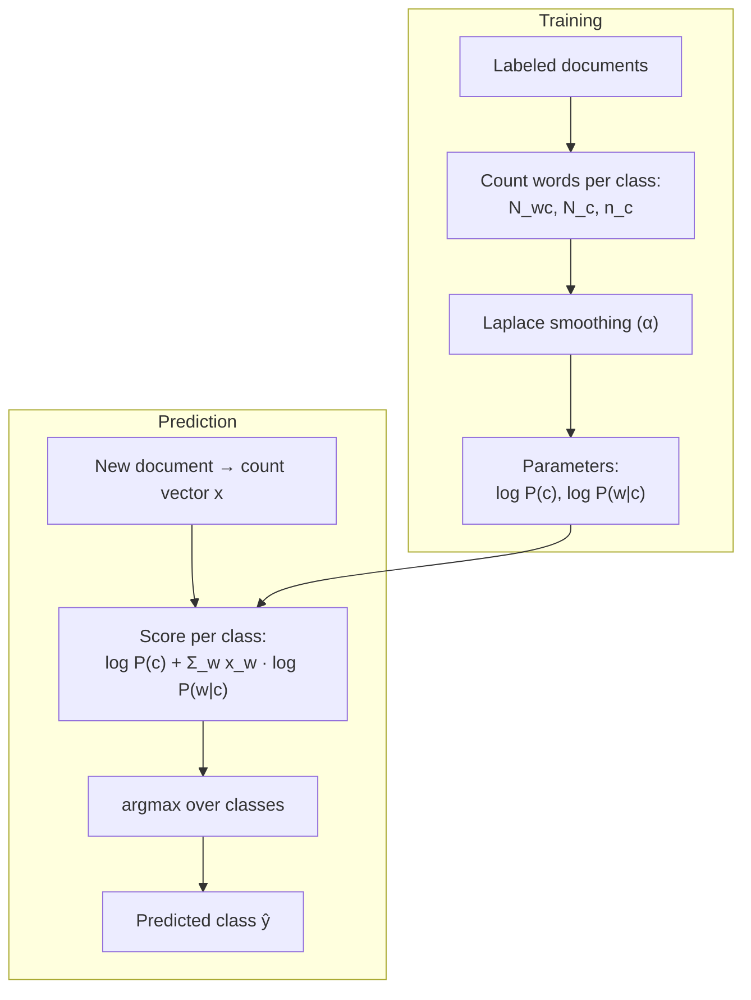
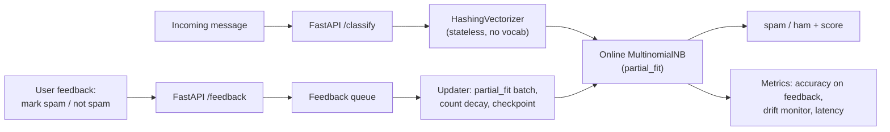

# 1.7 — Naive Bayes

## 1. Overview

**What is it?** Naive Bayes is a family of probabilistic classifiers built on two ingredients: **Bayes' rule**, which turns "probability of the data given the class" into "probability of the class given the data," and a deliberately **naive assumption** that all features are conditionally independent given the class. The assumption is almost always false — words in a sentence obviously depend on each other — yet the resulting classifier is fast, data-efficient, and surprisingly accurate, especially on text.

**Why does it exist?** Estimating the full joint distribution $P(x_1, \dots, x_d \mid y)$ requires an amount of data exponential in $d$. The independence assumption factorizes that joint into $d$ one-dimensional distributions, each of which can be estimated from small data with simple counting. Naive Bayes is the canonical example of trading statistical correctness for statistical *efficiency*.

**What problem does it solve?** Classification — deciding among discrete classes — in settings where features are easy to model per-class: word counts (spam vs. ham), binary indicators (word present or not), or continuous measurements (sensor readings per fault type). It is also the standard first example of a **generative** classifier: it models how the data is *generated* per class, rather than directly modeling the decision boundary like [logistic regression](04-logistic-regression.md).

**Where is it used?** Historically as the engine of spam filters; today as a strong, nearly-free baseline for text classification (sentiment, topic, language ID), a first-pass filter in abuse/fraud pipelines, and a teaching gateway to Bayesian reasoning that reappears throughout ML.

## 2. Learning Objectives

After this chapter you will be able to:

- State Bayes' rule and derive the Naive Bayes decision rule from it, step by step.
- Explain exactly what "conditional independence given the class" means and why it makes estimation tractable.
- Choose correctly among Multinomial, Bernoulli, and Gaussian Naive Bayes for a given feature type.
- Derive the maximum-likelihood estimates for class priors and per-feature likelihoods.
- Explain the zero-probability problem and fix it with Laplace (additive) smoothing.
- Compute predictions in log-space and explain why floating-point underflow forces you to.
- Implement Multinomial and Gaussian NB from scratch in NumPy.
- Position Naive Bayes on the generative-vs-discriminative axis and predict when it beats logistic regression.
- Explain why NB's predicted probabilities are poorly calibrated even when its *decisions* are good.
- Build and evaluate a production-quality text classification baseline with scikit-learn.

## 3. Prerequisites

| Chapter | Why you need it |
|---|---|
| [Probability & Statistics](../phase-0-prerequisites/04-probability-statistics.md) | Bayes' rule, conditional probability, and the Gaussian distribution are the entire foundation of this chapter. |
| [NumPy & Pandas](../phase-0-prerequisites/05-numpy-pandas.md) | The from-scratch implementation is vectorized NumPy counting and matrix products. |
| [ML Fundamentals](01-ml-fundamentals.md) | Train/test methodology, overfitting, and evaluation basics are assumed. |
| [Logistic Regression](04-logistic-regression.md) | NB's discriminative twin; we compare the two throughout. |
| [Evaluation Metrics](14-evaluation-metrics.md) | Precision/recall matter for spam-style problems; calibration is discussed here. |

## 4. Intuition

Think of a doctor triaging a patient. Before any examination, the doctor knows base rates: flu is common in winter, malaria is rare in Norway. That is the **prior**. Then symptoms arrive — fever, cough, headache — and each symptom nudges the diagnosis: fever is common in flu *and* malaria, but a particular rash is almost exclusive to one disease. The doctor mentally multiplies evidence: "How likely would I see *this* combination of symptoms if it were flu? If it were malaria?" and combines that with the base rates. That mental arithmetic *is* Bayes' rule.

The "naive" part is the shortcut: the doctor pretends the symptoms are unrelated once the disease is fixed — as if fever and chills were independent coin flips whose biases depend only on the disease. In reality fever and chills travel together, so this doctor double-counts correlated evidence. And yet the *ranking* of diagnoses usually comes out right, because double-counting inflates the winning diagnosis more than the losers.

An everyday story: a spam filter is a mail-room clerk who has read a million emails. The clerk keeps two tally sheets — one for spam, one for legitimate mail — recording how often each word appears in each pile. A new email arrives containing "free," "winner," and "meeting." The clerk checks: "free" and "winner" are heavily spam-flavored, "meeting" leans legitimate. Multiply the flavor of every word, weigh by how much spam arrives overall, and file the email in the more probable pile. No grammar, no meaning, no word order — just counting. That such a crude clerk stops the vast majority of spam is the enduring surprise of Naive Bayes.

> [!NOTE]
> Naive Bayes treats a document as a **bag of words**: word order is discarded entirely. "dog bites man" and "man bites dog" are identical to the model. Everything about sequence modeling in [Phase 3](../phase-3-nlp-llm/01-tokenization.md) exists to fix this limitation.

## 5. Real-world Motivation

- **Spam filtering.** Naive Bayes was the workhorse of early spam filters — Paul Graham's 2002 essay "A Plan for Spam" popularized Bayesian filtering, and it shipped in Mozilla Thunderbird's junk filter and Apache SpamAssassin's Bayesian subsystem. Modern providers such as **Google** (Gmail) have long since moved to neural models, but Bayesian text filtering was the field's starting point.
- **Baselines everywhere.** Inside companies like **Meta**, **Amazon**, and **Microsoft**, teams building text classifiers (support-ticket routing, review moderation, product categorization) routinely start with an NB or logistic-regression bag-of-words baseline: it trains in seconds on a laptop, establishing the accuracy floor that any expensive transformer must beat to justify its cost.
- **Low-latency / low-resource settings.** NB models are kilobytes in size and predict in microseconds — attractive for on-device filtering, embedded systems, and high-throughput first-pass filters where a heavyweight model would be too slow or expensive.
- **Small labeled datasets.** With a few hundred labeled examples, NB frequently outperforms far more flexible models because its rigid assumptions act as strong regularization — a fact formalized by Ng & Jordan (2001), who showed generative models reach their (higher) asymptotic error *faster* than discriminative ones.

## 6. Mathematical Foundations

### 6.1 Bayes' rule

For class label $y \in \{1, \dots, K\}$ and feature vector $\mathbf{x} = (x_1, \dots, x_d)$:

$$
P(y \mid \mathbf{x}) = \frac{P(\mathbf{x} \mid y)\, P(y)}{P(\mathbf{x})}
$$

- $P(y \mid \mathbf{x})$ — the **posterior**: what we want (probability of class given features).
- $P(\mathbf{x} \mid y)$ — the **likelihood**: how probable these features are under class $y$.
- $P(y)$ — the **prior**: base rate of class $y$.
- $P(\mathbf{x})$ — the **evidence**: a normalizer, identical for every class, hence irrelevant to the argmax.

### 6.2 The naive assumption

Estimating the joint likelihood $P(x_1, \dots, x_d \mid y)$ directly is hopeless: with $d$ binary features it has $2^d$ parameters per class. Naive Bayes assumes **conditional independence given the class**:

$$
P(\mathbf{x} \mid y) = \prod_{j=1}^{d} P(x_j \mid y)
$$

which reduces the parameter count from exponential to linear in $d$. Combining with Bayes' rule and dropping the constant evidence:

$$
P(y \mid \mathbf{x}) \;\propto\; P(y) \prod_{j=1}^{d} P(x_j \mid y)
$$

The decision rule is the maximum a posteriori (MAP) class:

$$
\hat y = \arg\max_{y} \; P(y) \prod_{j=1}^{d} P(x_j \mid y)
$$

### 6.3 Log-space computation

A 500-word email multiplies 500 probabilities each around $10^{-3}$, giving $\sim 10^{-1500}$ — far below the smallest positive float64 ($\approx 10^{-308}$). The product underflows to exactly 0 for *every* class. Since $\log$ is strictly increasing, the argmax is preserved by taking logs:

$$
\hat y = \arg\max_{y} \Big[ \log P(y) + \sum_{j=1}^{d} \log P(x_j \mid y) \Big]
$$

Sums of moderate negative numbers are numerically safe. Every real implementation works in log-space.

### 6.4 The three classic variants

**Multinomial NB** — features are **counts** (e.g., word frequencies in a document). Class-conditional model: a document of class $c$ is generated by drawing words i.i.d. from a class-specific distribution over the vocabulary $V$. The likelihood of word $w$ under class $c$ is estimated by counting:

$$
\hat P(w \mid c) = \frac{N_{wc}}{N_c}, \qquad N_c = \sum_{w' \in V} N_{w'c}
$$

where $N_{wc}$ is the total count of word $w$ across all training documents of class $c$, and $N_c$ is the total word count in class $c$. The score of a document with count vector $\mathbf{x}$ is $\log P(c) + \sum_{w} x_w \log P(w \mid c)$ — a **linear function of the counts**, which is why NB, despite being generative, has a linear decision boundary in count space.

**Bernoulli NB** — features are **binary indicators** ($x_j \in \{0,1\}$: word present or absent). Each feature is a class-conditional coin flip with $P(x_j = 1 \mid c) = \theta_{jc}$, and — crucially — **absence is evidence too**:

$$
P(\mathbf{x} \mid c) = \prod_{j=1}^{d} \theta_{jc}^{\,x_j} (1 - \theta_{jc})^{\,1 - x_j}
$$

Bernoulli NB explicitly penalizes a class when an expected word is missing; Multinomial NB simply ignores absent words. Bernoulli tends to win on short texts (tweets, subject lines), Multinomial on longer documents.

**Gaussian NB** — features are **continuous**. Each feature under each class is modeled as a univariate normal with class- and feature-specific mean $\mu_{jc}$ and variance $\sigma^2_{jc}$:

$$
P(x_j \mid c) = \frac{1}{\sqrt{2\pi \sigma_{jc}^2}} \exp\!\Big(-\frac{(x_j - \mu_{jc})^2}{2\sigma_{jc}^2}\Big)
$$

Fitting = computing the per-class mean and variance of every feature. Note this is a *diagonal-covariance* Gaussian model — independence again.

### 6.5 Laplace (additive) smoothing — derivation of the fix

Suppose the word "unsubscribe" never appears in any training *ham* email. Then $\hat P(\text{unsubscribe} \mid \text{ham}) = 0$, and *any* email containing it gets $P(\text{ham} \mid \mathbf{x}) = 0$ regardless of overwhelming evidence from a thousand other words — one unseen word vetoes the entire class. In log-space, $\log 0 = -\infty$.

The fix: pretend every word was seen $\alpha$ extra times (pseudo-counts):

$$
\hat P(w \mid c) = \frac{N_{wc} + \alpha}{N_c + \alpha |V|}
$$

where $|V|$ is the vocabulary size and $\alpha > 0$ the smoothing constant ($\alpha = 1$ is **Laplace smoothing**; $0 < \alpha < 1$ is **Lidstone smoothing**). The denominator adds $\alpha |V|$ so the probabilities still sum to 1 over the vocabulary:

$$
\sum_{w \in V} \frac{N_{wc} + \alpha}{N_c + \alpha |V|} = \frac{N_c + \alpha |V|}{N_c + \alpha |V|} = 1
$$

Bayesian interpretation: this is exactly the posterior mean of the word distribution under a symmetric Dirichlet prior with concentration $\alpha$ — smoothing is a prior belief that all words are possible.

### 6.6 Class prior estimation

$$
\hat P(c) = \frac{n_c}{n}
$$

where $n_c$ is the number of training documents of class $c$ and $n$ the total. (One can also smooth the prior or set it uniform when the deployment class balance differs from the training set.)

### 6.7 Symbol table

| Symbol | Meaning |
|---|---|
| $y, c$ | class label / a specific class |
| $\mathbf{x}, x_j$ | feature vector / $j$-th feature value |
| $d$ | number of features |
| $K$ | number of classes |
| $P(y)$, $\hat P(c)$ | class prior and its estimate |
| $N_{wc}$ | total count of word $w$ in class-$c$ training docs |
| $N_c$ | total word count in class $c$ |
| $\alpha$ | smoothing pseudo-count |
| $\|V\|$ | vocabulary size |
| $\theta_{jc}$ | Bernoulli presence probability of feature $j$ in class $c$ |
| $\mu_{jc}, \sigma^2_{jc}$ | Gaussian mean/variance of feature $j$ in class $c$ |

## 7. Visual Explanation

Training and prediction data flow:



How evidence accumulates for a two-class spam decision (log-space, so evidence *adds*):

```
 score
   │  log P(spam)  ───┐
   │                  ▼
   │   + log P("free"|spam)      ██████████████   spam total: -12.1
   │   + log P("winner"|spam)
   │   + log P("meeting"|spam)
   │
   │  log P(ham)   ───┐
   │                  ▼
   │   + log P("free"|ham)       █████████        ham total: -15.8
   │   + log P("winner"|ham)
   │   + log P("meeting"|ham)
   └──────────────────────────────────────────►  argmax → SPAM
```

## 8. Algorithm

**Training (Multinomial NB):**

1. For each class $c$: compute the prior $\hat P(c) = n_c / n$.
2. Build the class–word count matrix: $N_{wc}$ = total occurrences of word $w$ in documents of class $c$.
3. Apply smoothing and normalize: $\hat P(w \mid c) = \dfrac{N_{wc} + \alpha}{N_c + \alpha|V|}$.
4. Store $\log \hat P(c)$ and $\log \hat P(w \mid c)$ (a $K \times |V|$ matrix).

**Prediction:**

5. Convert the new document to a count vector $\mathbf{x} \in \mathbb{N}^{|V|}$.
6. For each class $c$, compute $s_c = \log \hat P(c) + \sum_{w} x_w \log \hat P(w \mid c)$ — a single sparse dot product.
7. Return $\arg\max_c s_c$ (softmax the scores if probabilities are needed — with the calibration caveat of Section 15).

```text
PSEUDOCODE — Multinomial Naive Bayes
─────────────────────────────────────
train(docs, labels, α):
    for each class c:
        log_prior[c] = log(count(labels == c) / n)
        N[c, w]      = total count of word w in class-c docs   # K × V
        log_lik[c, w] = log( (N[c,w] + α) / (Σ_w' N[c,w'] + α·V) )

predict(x):                        # x = word-count vector, length V
    for each class c:
        score[c] = log_prior[c] + Σ_w x[w] · log_lik[c, w]
    return argmax_c score[c]
```

## 9. Worked Example

### Tiny example, fully by hand

Training set (4 documents, 2 classes), $\alpha = 1$:

| Doc | Text | Class |
|---|---|---|
| 1 | "buy viagra now" | spam |
| 2 | "cheap viagra buy" | spam |
| 3 | "meeting tomorrow" | ham |
| 4 | "buy lunch tomorrow" | ham |

Vocabulary $V = \{$buy, viagra, now, cheap, meeting, tomorrow, lunch$\}$, so $|V| = 7$.

**Priors:** $\hat P(\text{spam}) = 2/4 = 0.5$, $\hat P(\text{ham}) = 0.5$.

**Word totals:** spam has $N_{\text{spam}} = 6$ words; ham has $N_{\text{ham}} = 5$ words.

**Smoothed likelihoods** (denominators: spam $6 + 7 = 13$, ham $5 + 7 = 12$):

| word | $N_{w,\text{spam}}$ | $\hat P(w\mid\text{spam})$ | $N_{w,\text{ham}}$ | $\hat P(w\mid\text{ham})$ |
|---|---|---|---|---|
| buy | 2 | 3/13 | 1 | 2/12 |
| viagra | 2 | 3/13 | 0 | 1/12 |
| tomorrow | 0 | 1/13 | 2 | 3/12 |
| meeting | 0 | 1/13 | 1 | 2/12 |

**Classify "buy viagra tomorrow":**

$$
P(\text{spam}) \cdot P(\text{buy}\mid \text{s}) \cdot P(\text{viagra}\mid \text{s}) \cdot P(\text{tomorrow}\mid \text{s}) = 0.5 \cdot \tfrac{3}{13} \cdot \tfrac{3}{13} \cdot \tfrac{1}{13} = 0.5 \cdot \tfrac{9}{2197} \approx 2.05 \times 10^{-3}
$$

$$
P(\text{ham}) \cdot P(\text{buy}\mid \text{h}) \cdot P(\text{viagra}\mid \text{h}) \cdot P(\text{tomorrow}\mid \text{h}) = 0.5 \cdot \tfrac{2}{12} \cdot \tfrac{1}{12} \cdot \tfrac{3}{12} = 0.5 \cdot \tfrac{6}{1728} \approx 1.74 \times 10^{-3}
$$

Spam wins, narrowly — "viagra" pushes toward spam, "tomorrow" pushes back toward ham. Normalizing: $P(\text{spam} \mid \mathbf{x}) \approx 2.05 / (2.05 + 1.74) \approx 0.54$. Note that *without* smoothing, $P(\text{viagra} \mid \text{ham})$ would be 0 and ham's score would be annihilated by a single word.

### Realistic example

On the 20 Newsgroups dataset (~18k posts, 20 topics), a `CountVectorizer + MultinomialNB` pipeline trains in ~2 seconds on a laptop and reaches ~85–90% accuracy on held-out data (with headers/footers stripped) — within a few points of logistic regression, at a fraction of the tuning effort. This is the archetypal "strong baseline in 10 lines" result.

## 10. Python from Scratch

Multinomial NB, fully vectorized:

```python
import numpy as np

class MultinomialNB:
    """Multinomial Naive Bayes with Laplace smoothing. Log-space throughout."""

    def __init__(self, alpha=1.0):
        self.alpha = alpha                      # pseudo-count α > 0

    def fit(self, X, y):
        # X: (n, V) matrix of word COUNTS; y: (n,) labels
        X = np.asarray(X, dtype=float)
        y = np.asarray(y)
        self.classes = np.unique(y)             # (K,)
        # Class priors: fraction of documents per class, in log-space
        self.log_prior = np.log(
            np.array([(y == c).mean() for c in self.classes]))      # (K,)
        # N[c, w]: total count of word w over class-c docs, + α smoothing
        counts = np.array(
            [X[y == c].sum(axis=0) for c in self.classes]) + self.alpha  # (K, V)
        # Normalize rows -> P(w|c); denominator = N_c + α·V automatically,
        # because each of the V entries in the row received +α
        self.log_lik = np.log(counts / counts.sum(axis=1, keepdims=True))  # (K, V)
        return self

    def predict_log_proba(self, X):
        # score[i, c] = log P(c) + Σ_w x[i,w]·log P(w|c)  — one matmul
        scores = np.asarray(X, float) @ self.log_lik.T + self.log_prior  # (n, K)
        # log-normalize (log-sum-exp) to get log posteriors
        m = scores.max(axis=1, keepdims=True)             # subtract max: stability
        log_norm = m + np.log(np.exp(scores - m).sum(axis=1, keepdims=True))
        return scores - log_norm                          # rows sum to 1 in prob space

    def predict(self, X):
        scores = np.asarray(X, float) @ self.log_lik.T + self.log_prior
        return self.classes[np.argmax(scores, axis=1)]    # (n,)

# --- Verify against the hand-worked example -------------------------------
vocab = ["buy", "viagra", "now", "cheap", "meeting", "tomorrow", "lunch"]
X = np.array([                       # rows = docs, cols = word counts
    [1, 1, 1, 0, 0, 0, 0],           # "buy viagra now"        spam
    [1, 1, 0, 1, 0, 0, 0],           # "cheap viagra buy"      spam
    [0, 0, 0, 0, 1, 1, 0],           # "meeting tomorrow"      ham
    [1, 0, 0, 0, 0, 1, 1],           # "buy lunch tomorrow"    ham
])
y = np.array(["spam", "spam", "ham", "ham"])
model = MultinomialNB(alpha=1.0).fit(X, y)
query = np.array([[1, 1, 0, 0, 0, 1, 0]])    # "buy viagra tomorrow"
print(model.predict(query))                   # Expected: ['spam']
print(np.exp(model.predict_log_proba(query))) # ≈ [[0.459, 0.541]] (ham, spam)
```

**Complexity:** training is one pass over the data, $O(\text{nnz}(X))$ for sparse counts; prediction is a $(n \times V)(V \times K)$ matrix product.

> [!WARNING]
> **Common bug:** computing `np.log(X @ lik.T)` instead of `X @ np.log(lik).T` — the log must be taken on the *likelihood parameters*, not the score. Another classic: forgetting smoothing entirely, which works fine on the training set and then produces `-inf` scores on any test document containing an unseen (class, word) pair.

Gaussian NB from scratch is even shorter — fit is just per-class means and variances:

```python
class GaussianNB:
    def fit(self, X, y):
        X, y = np.asarray(X, float), np.asarray(y)
        self.classes = np.unique(y)
        self.log_prior = np.log([(y == c).mean() for c in self.classes])
        self.mu  = np.array([X[y == c].mean(axis=0) for c in self.classes])  # (K, d)
        # var smoothing: add tiny ε so zero-variance features don't divide by 0
        self.var = np.array([X[y == c].var(axis=0)  for c in self.classes]) + 1e-9
        return self

    def predict(self, X):
        X = np.asarray(X, float)[:, None, :]           # (n, 1, d) for broadcasting
        # log N(x; μ, σ²) summed over features (independence -> sum of logs)
        ll = -0.5 * (np.log(2 * np.pi * self.var)      # (K, d) broadcast
                     + (X - self.mu) ** 2 / self.var).sum(axis=2)  # (n, K)
        return self.classes[np.argmax(ll + self.log_prior, axis=1)]
```

## 11. Library Implementation

The production-standard text pipeline with scikit-learn:

```python
from sklearn.datasets import fetch_20newsgroups
from sklearn.feature_extraction.text import CountVectorizer
from sklearn.naive_bayes import MultinomialNB
from sklearn.pipeline import Pipeline
from sklearn.model_selection import GridSearchCV
from sklearn.metrics import classification_report

train = fetch_20newsgroups(subset="train", remove=("headers", "footers", "quotes"))
test  = fetch_20newsgroups(subset="test",  remove=("headers", "footers", "quotes"))

pipe = Pipeline([
    # Bag-of-words with unigrams+bigrams; min_df prunes ultra-rare tokens
    ("vec", CountVectorizer(ngram_range=(1, 2), min_df=2)),
    ("nb",  MultinomialNB(alpha=1.0)),       # α = Laplace smoothing
])

# α is the only hyperparameter that matters — tune it on a log grid
grid = GridSearchCV(pipe, {"nb__alpha": [0.01, 0.1, 0.5, 1.0, 2.0]},
                    cv=5, n_jobs=-1)
grid.fit(train.data, train.target)
print(grid.best_params_)                                  # e.g. {'nb__alpha': 0.1}

pred = grid.predict(test.data)
print(classification_report(test.target, pred,
                            target_names=test.target_names))
# Expect ~0.70–0.75 macro-F1 with headers removed; seconds of training time.
```

Line-by-line: `CountVectorizer` builds the vocabulary and produces a **sparse** count matrix (essential — 20 Newsgroups has >100k n-gram features, but each document touches only a few hundred); `MultinomialNB.fit` does the counting of Section 8; `GridSearchCV` cross-validates the smoothing strength. Variants: `BernoulliNB` (pair with `CountVectorizer(binary=True)`), `GaussianNB` for continuous features, and `ComplementNB` — a variant that estimates parameters from each class's *complement*, markedly better on imbalanced text.

## 12. Code Walkthrough

Tracing the from-scratch `MultinomialNB` on the spam example:

| Tensor | Shape | Meaning |
|---|---|---|
| `X` (train) | (4, 7) | Document–word count matrix |
| `y` | (4,) | `["spam","spam","ham","ham"]` |
| `log_prior` | (2,) | `[log 0.5, log 0.5]` for classes `["ham","spam"]` (sorted) |
| `counts` | (2, 7) | Smoothed class–word counts; ham row sums to 12, spam row to 13 |
| `log_lik` | (2, 7) | $\log \hat P(w \mid c)$; e.g. `log_lik[spam, viagra] = log(3/13)` |
| `query` | (1, 7) | Count vector of "buy viagra tomorrow" |
| `scores` | (1, 2) | `[log 0.5 + log(2/12)+log(1/12)+log(3/12), log 0.5 + log(3/13)+log(3/13)+log(1/13)]` ≈ `[-6.356, -6.180]` |
| output | (1,) | `['spam']` — matches Section 9's hand computation ($e^{-6.180} \approx 2.07\times10^{-3}$) |

**Inputs:** count matrix + labels. **Intermediates:** smoothed count matrix, log-parameter matrices. **Outputs:** class labels or log-posteriors. **Expected result:** posterior ≈ (0.46 ham, 0.54 spam), identical to the by-hand numbers up to rounding — a from-scratch implementation should always be validated this way.

## 13. Complexity Analysis

| Phase | Time | Space | Reasoning |
|---|---|---|---|
| Training | $O(\text{nnz}(X))$ ≈ $O(n \cdot \bar{L})$ | $O(K \cdot \|V\|)$ | One pass to accumulate counts; $\bar{L}$ = average document length. Parameters: one number per (class, word). |
| Prediction (per doc) | $O(K \cdot \text{nnz}(\mathbf{x}))$ | $O(K)$ | Sparse dot product of the doc's nonzero counts with each class's log-likelihood row. |
| Gaussian NB training | $O(nd)$ | $O(Kd)$ | One pass for means, one for variances. |

Naive Bayes is among the cheapest classifiers in existence: training is *counting*, there is no iterative optimization, no learning rate, no convergence question. This is a direct payoff of the independence assumption — each parameter has a closed-form estimate.

## 14. Advantages

- **Extremely fast, closed-form training.** Millions of documents train in seconds — no gradient descent. Retraining nightly (or per user, as old spam filters did) is trivial.
- **Data-efficient.** With hundreds (not millions) of labels, NB is often the best model available; its high bias is effective regularization. Ng & Jordan showed generative classifiers approach their asymptote in $O(\log d)$ samples vs. $O(d)$ for discriminative ones.
- **Native high-dimensional sparse support.** A 500k-word vocabulary is no problem: parameters scale linearly and prediction touches only a document's nonzero entries.
- **Online-learnable.** Counts can be incremented per example (`partial_fit` in sklearn), enabling streaming updates — e.g., a spam filter learning from each user click.
- **Interpretable.** $\log P(w \mid \text{spam}) - \log P(w \mid \text{ham})$ ranks every word's spam-ness; you can print the top-20 evidence words for any decision.
- **Multi-class for free.** $K$ classes just mean $K$ count rows — no one-vs-rest wrappers.

## 15. Disadvantages

- **The independence assumption is false**, and correlated features get double-counted. Example: a document containing "San" and "Francisco" is treated as two independent pieces of evidence, over-weighting what is really one signal.
- **Poorly calibrated probabilities.** Because of double-counting, posteriors are pushed toward 0 and 1 — a predicted "99.99% spam" may really be 85%. Decisions (argmax) survive; probabilities don't. Fix with Platt scaling or isotonic regression ([Evaluation Metrics](14-evaluation-metrics.md)) if you need real probabilities.
- **A ceiling on accuracy.** With abundant data, [logistic regression](04-logistic-regression.md) (which learns to *discount* correlated features) and transformer encoders (which model word order) win.
- **Bag-of-words blindness.** Negation ("not good"), sarcasm, and word order are invisible; "not good" and "good, not" are the same document.
- **Gaussian NB assumes per-class normality.** Heavily skewed or multimodal features violate it badly — log-transform or bin such features first.
- **Not a regression method.** NB is classification-only by construction.

## 16. Common Mistakes

- **Skipping smoothing.** One unseen (word, class) pair sends a log-score to $-\infty$. *Fix:* always set $\alpha > 0$; tune it — small corpora often prefer $\alpha < 1$.
- **Multiplying raw probabilities.** Underflow silently zeroes every class score for long documents. *Fix:* always sum logs (Section 6.3).
- **Fitting the vectorizer on train+test.** The vocabulary leaks test-set information. *Fix:* put vectorizer and classifier in one `Pipeline` so `fit` only ever sees training folds.
- **Feeding TF-IDF into MultinomialNB.** It "works" (sklearn allows fractional counts) but breaks the count-generative semantics; results are unpredictable. *Fix:* prefer raw counts for NB, or knowingly treat TF-IDF+NB as a heuristic and validate.
- **Treating NB posteriors as calibrated confidence.** Downstream thresholding on "P > 0.99" behaves badly. *Fix:* calibrate on held-out data before thresholding.
- **Using Gaussian NB on count/binary data** (or Multinomial NB on continuous data). *Fix:* match the variant to the feature type — that choice *is* the modeling step in NB.

## 17. Best Practices

- [ ] Match variant to features: counts → Multinomial, binary presence → Bernoulli, continuous → Gaussian; imbalanced text → ComplementNB.
- [ ] Wrap vectorizer + model in a single sklearn `Pipeline`; cross-validate $\alpha$ on a log grid (0.01–10).
- [ ] Keep matrices sparse end-to-end (`scipy.sparse`); never call `.toarray()` on a big corpus.
- [ ] Strip leakage-prone metadata (email headers, boilerplate signatures) before vectorizing — NB will happily memorize them.
- [ ] For probability consumers, calibrate (Platt/isotonic) and verify with a reliability diagram.
- [ ] Report per-class precision/recall, not just accuracy — spam-type problems are asymmetric ([Evaluation Metrics](14-evaluation-metrics.md)).
- [ ] Use `partial_fit` for streaming/online updates; version the vocabulary with the model artifact.
- [ ] Establish NB as the baseline *before* reaching for transformers; keep it as a latency/cost fallback and a sanity check.

## 18. Optimization Techniques

- **Sparse everything.** `CountVectorizer` → CSR matrices; training and scoring are then proportional to nonzeros, not $n \times |V|$. A 1M-doc corpus with 300 words/doc has ~3×10⁸ nonzeros vs. ~10¹² dense entries.
- **Vocabulary pruning.** `min_df` / `max_features` cut noise words and memory; chi-squared feature selection (`SelectKBest(chi2)`) before NB often *improves* accuracy while shrinking the model.
- **Hashing trick.** `HashingVectorizer` removes the vocabulary dictionary entirely — constant memory, streaming-friendly, at the cost of interpretability.
- **Complement NB.** For skewed class distributions, estimate each class's parameters from all *other* classes' counts — consistently better on imbalanced text (Rennie et al., 2003).
- **Precompute the score matrix.** At serving time, the model is one $(K \times |V|)$ matrix and a $(K,)$ prior vector; scoring a batch is a single sparse–dense matmul — microseconds per document, trivially batchable.
- **Quantization is unnecessary** — the model is already tiny (a few MB even for huge vocabularies) — but float32 halves memory with zero accuracy loss if desired.

## 19. Industry Applications

- **Spam and abuse filtering (production example).** Classic email stacks (SpamAssassin, Thunderbird junk mail) shipped Bayesian filters that updated per-user from "mark as spam" clicks — online NB in production for decades. Modern pipelines still use NB-style filters as cheap first-pass gates before expensive neural scoring.
- **Support-ticket routing.** Helpdesk platforms route incoming tickets ("billing" vs. "technical" vs. "sales") with bag-of-words classifiers; NB delivers instant training on each customer's small labeled history.
- **Language identification.** Character n-gram NB identifies the language of a snippet with high accuracy — for years the standard approach before neural detectors.
- **Sentiment baselines.** IMDB/Yelp-style sentiment tasks: NB (or the NB-SVM hybrid of Wang & Manning, 2012) remains the benchmark row every paper's transformer must beat.
- **Medical triage prototypes.** Symptom-checklist classifiers built on tiny expert-labeled datasets exploit NB's small-data strength (with calibration handled carefully).
- **Real-time content moderation pre-filters.** High-throughput platforms run microsecond NB filters to discard obvious spam/abuse before invoking heavier models — an explicit cost-optimization layer.

## 20. Interview Questions

### Beginner

**Q1. Why is Naive Bayes called "naive"?**
**A.** It assumes all features are conditionally independent given the class — e.g., that "San" and "Francisco" occur independently in a document once you know its topic. The assumption is naive because it's virtually never true, yet the classifier's argmax decisions are often still correct.

**Q2. State Bayes' rule and identify each term.**
**A.** $P(y \mid \mathbf{x}) = P(\mathbf{x} \mid y) P(y) / P(\mathbf{x})$: posterior = likelihood × prior / evidence. The evidence is constant across classes, so classification only needs the numerator.

**Q3. What is Laplace smoothing and why is it needed?**
**A.** Add $\alpha$ pseudo-counts to every (word, class) pair: $\hat P(w\mid c) = (N_{wc}+\alpha)/(N_c + \alpha|V|)$. Without it, any word unseen in a class gives $P(w\mid c) = 0$, which multiplies to zero the entire class posterior — one unseen word vetoes a thousand words of contrary evidence.

**Q4. Why compute in log-space?**
**A.** Multiplying hundreds of small probabilities underflows float64 to 0 (a 500-word doc at ~$10^{-3}$/word gives ~$10^{-1500}$). Log turns products into numerically stable sums and preserves the argmax because log is monotonic.

**Q5. Multinomial vs. Bernoulli NB — the key difference?**
**A.** Multinomial models word *counts* and ignores absent words; Bernoulli models word *presence/absence*, so a missing expected word actively counts as evidence against a class. Bernoulli suits short texts; Multinomial suits longer documents.

### Intermediate

**Q1. Derive the Naive Bayes decision rule from Bayes' theorem.**
**A.** $\hat y = \arg\max_y P(y\mid\mathbf{x}) = \arg\max_y \frac{P(\mathbf{x}\mid y)P(y)}{P(\mathbf{x})}$. Drop $P(\mathbf{x})$ (class-independent), factorize the likelihood by conditional independence: $\hat y = \arg\max_y P(y)\prod_j P(x_j\mid y)$, then take logs: $\hat y = \arg\max_y [\log P(y) + \sum_j \log P(x_j \mid y)]$.

**Q2. Generative vs. discriminative — where does NB sit, and what's the trade-off?**
**A.** NB is generative: it models $P(\mathbf{x}, y) = P(\mathbf{x}\mid y)P(y)$ and derives the posterior. Logistic regression is discriminative: it models $P(y\mid\mathbf{x})$ directly. Ng & Jordan (2001): generative models converge to their asymptotic error faster (better with small data) but that asymptote is higher (worse with big data) because the generative assumptions bias the model.

**Q3. Why are NB's predicted probabilities poorly calibrated even when its accuracy is good?**
**A.** Correlated features are double-counted as independent evidence, so log-scores are over-confident — posteriors pile up near 0 and 1. The *ordering* of classes (hence the argmax) is much more robust than the *magnitude* of the posterior. Fix with post-hoc calibration.

**Q4. NB is generative, yet its decision boundary is linear in count space. Why?**
**A.** The class score is $\log P(c) + \sum_w x_w \log P(w\mid c)$ — an affine function of the count vector $\mathbf{x}$ with weights $\log P(w \mid c)$. The boundary between two classes is where their affine scores are equal: a hyperplane. NB is effectively a linear classifier whose weights are set by counting instead of optimization.

**Q5. Interpret the smoothing constant $\alpha$ Bayesianly.**
**A.** Additive smoothing is the posterior-mean estimate of the word distribution under a symmetric Dirichlet($\alpha$) prior. Larger $\alpha$ = stronger prior pull toward the uniform distribution = more regularization; $\alpha \to 0$ recovers raw maximum likelihood.

### Advanced

**Q1. When exactly is NB's decision rule Bayes-optimal despite violated independence?**
**A.** NB errs only when double-counted correlations flip the *sign* of the log-odds, not merely its magnitude. Domingos & Pazzani (1997) showed NB is optimal under 0-1 loss far more broadly than under squared loss: as long as the true class keeps the largest (mis-estimated) posterior, the decision is unchanged — which explains good accuracy with terrible probability estimates.

**Q2. Your spam NB classifies 500-word emails at 99.9% "confidence" but calibration analysis shows 90% accuracy at that bucket. What's happening and what do you do?**
**A.** Evidence accumulates additively in log-space, so long documents produce extreme scores; correlated words compound the effect. Options: calibrate posteriors (isotonic on a held-out set), down-weight document length (e.g., normalize counts or cap word counts), or use log-count / sublinear TF transforms that shrink repeated-word evidence.

**Q3. How does Complement NB fix the imbalanced-class weakness of Multinomial NB?**
**A.** MNB parameter estimates for a rare class are high-variance (few counts) and its decision skews toward classes with more training tokens. CNB estimates $P(w \mid \bar c)$ from all documents *not* in class $c$ (many counts, stable) and scores by how *poorly* the complement explains the document; combined with weight normalization, it corrects the systematic bias (Rennie et al., 2003).

**Q4. Relate Naive Bayes to language models.**
**A.** Per class, Multinomial NB *is* a unigram language model: it assigns each class a distribution over the vocabulary and scores a document by its likelihood. Classification = picking the language model that best explains the text. Modern neural classifiers can be seen as replacing the unigram class LM with vastly more expressive conditional models — see [GPT Pretraining](../phase-3-nlp-llm/05-gpt-pretraining.md).

**Q5. Derive the maximum-likelihood estimate $\hat P(w\mid c) = N_{wc}/N_c$ for Multinomial NB.**
**A.** The class-$c$ log-likelihood of the data under parameters $\theta_w$ (with $\sum_w \theta_w = 1$) is $\sum_w N_{wc}\log\theta_w$. Maximize with a Lagrange multiplier: $\mathcal{L} = \sum_w N_{wc}\log\theta_w + \lambda(1 - \sum_w\theta_w)$; setting $\partial\mathcal{L}/\partial\theta_w = N_{wc}/\theta_w - \lambda = 0$ gives $\theta_w = N_{wc}/\lambda$, and the constraint yields $\lambda = \sum_w N_{wc} = N_c$, hence $\hat\theta_w = N_{wc}/N_c$.

## 21. Coding Exercises

### Easy

1. **Reproduce the hand example.** Implement the Section 9 spam example in code and confirm posterior ≈ (0.46, 0.54). *Hint: the count matrix is given in Section 10; check intermediate `log_lik` entries against the fractions in the table.*
2. **Smoothing sweep.** On a small text dataset, plot test accuracy vs. $\alpha \in \{0, 0.01, 0.1, 1, 10\}$ (use a tiny $\epsilon$ for the "0" case). *Hint: expect a broad plateau with degradation at both extremes.*

### Medium

1. **Bernoulli NB from scratch.** Implement it with the absence term $\prod_j \theta^{x_j}(1-\theta)^{1-x_j}$ and compare with Multinomial NB on SMS-length texts. *Hint: precompute $\sum_j \log(1-\theta_{jc})$ per class, then correct only the present words — this keeps prediction sparse.*
2. **Spam filter.** Build a full pipeline on the SMS Spam Collection dataset (UCI): vectorize, fit, report precision/recall at several decision thresholds, and print the 20 most spam-indicative tokens by log-odds. *Hint: log-odds = `log_lik[spam] - log_lik[ham]`.*
3. **Calibration study.** Train MNB on 20 Newsgroups, plot a reliability diagram of its posteriors, then wrap in `CalibratedClassifierCV` and plot again. *Hint: `sklearn.calibration.calibration_curve`.*

### Hard

1. **NB vs. logistic regression learning curves.** On 20 Newsgroups, train both on {100, 300, 1k, 3k, 10k} examples and plot test accuracy vs. training size. Verify the Ng–Jordan crossover: NB wins small, LR wins large. *Hint: keep the vectorizer fixed across sizes to isolate the classifier effect.*
2. **Online learning.** Implement `partial_fit`-style streaming NB (updateable count matrices), feed it a shuffled stream, and show accuracy converging to batch training; then simulate concept drift (swap class distributions mid-stream) and add exponential decay to the counts to recover. *Hint: decay = multiply all counts by $\gamma < 1$ each step before adding new ones.*

## 22. Mini Project

**Language detector with character n-grams.**

1. Collect ~1,000 sentences in each of 10 languages (Wikipedia dumps or the Tatoeba dataset).
2. Vectorize with `CountVectorizer(analyzer="char", ngram_range=(1, 3))` — character trigrams capture orthography ("sch" → German, "ção" → Portuguese).
3. Train `MultinomialNB`; evaluate with a confusion matrix — expect near-perfect separation except among close relatives (Spanish/Portuguese, Norwegian/Danish).
4. Test degradation on truncated inputs (30, 10, 5 characters) and plot accuracy vs. input length.
5. Print the most indicative trigrams per language via log-odds; sanity-check them linguistically.

## 23. Medium Project

**IMDB sentiment: NB vs. logistic regression benchmark.**

1. Load the IMDB 50k reviews dataset; split train/test as provided.
2. Build three pipelines: (a) counts + MultinomialNB, (b) binarized counts + BernoulliNB, (c) TF-IDF + LogisticRegression.
3. Cross-validate $\alpha$ (NB) and $C$ (LR); report accuracy and F1 for all three.
4. Produce a feature-importance report: top-25 positive/negative tokens by NB log-odds vs. LR coefficients; discuss where they agree.
5. Error analysis: sample 30 misclassified reviews; categorize failures (negation, sarcasm, mixed sentiment) and quantify which model suffers more from each.
6. Add bigrams to the NB pipeline and measure how much of the negation problem ("not good") is recovered.

## 24. Advanced Project

**Real-time self-improving spam filter service.**

Architecture:



Implementation phases:

1. **Core service:** FastAPI with `/classify` (returns label + calibrated score) and `/feedback` endpoints; `HashingVectorizer` so no vocabulary state needs shipping.
2. **Online learning:** a background worker drains the feedback queue and calls `partial_fit`; apply count decay ($\gamma \approx 0.999$/batch) so the filter tracks drift in spam tactics.
3. **Evaluation loop:** hold out a rolling golden set; recompute precision/recall daily; alert on degradation.
4. **Calibration layer:** periodic isotonic recalibration on recent feedback so the score threshold stays meaningful.
5. **Persistence & rollback:** checkpoint model arrays (they're just count matrices) with versioning; one-command rollback.

Possible improvements: per-user personalized priors layered on a global model (hierarchical smoothing); an NB-then-transformer cascade where NB auto-handles confident cases and escalates the uncertain 5%; adversarial testing with obfuscated tokens ("v1agra") and a character-n-gram fallback channel.

## 25. Summary

- Naive Bayes = Bayes' rule + conditional independence of features given the class; classification is $\arg\max_y [\log P(y) + \sum_j \log P(x_j\mid y)]$.
- The independence assumption cuts parameters from exponential to linear in $d$, making training a closed-form counting pass — no optimization.
- Match the variant to the features: Multinomial for counts, Bernoulli for binary presence (absence counts as evidence), Gaussian for continuous.
- Laplace smoothing $(N_{wc}+\alpha)/(N_c+\alpha|V|)$ prevents a single unseen word from zeroing a class; it's the Dirichlet-prior posterior mean.
- Always compute in log-space: raw products underflow float64 within a few hundred features.
- NB is a generative model with a *linear* decision boundary in count space; its weights come from counting rather than gradient descent.
- Small data favors NB (fast convergence to its asymptote); big data favors logistic regression and neural models (lower asymptote).
- Decisions are robust to the false independence assumption; probabilities are not — calibrate before trusting posteriors.
- In production, NB shines as an instant-training baseline, a microsecond-latency pre-filter, and an online learner (`partial_fit` + count decay).
- Its blindness to word order is the doorway to everything in [Phase 3 NLP](../phase-3-nlp-llm/01-tokenization.md).

## 26. Cheat Sheet

| Formula | Meaning |
|---|---|
| $P(y\mid\mathbf{x}) \propto P(y)\prod_j P(x_j\mid y)$ | NB posterior (evidence dropped) |
| $\hat y = \arg\max_y[\log P(y) + \sum_j \log P(x_j\mid y)]$ | Log-space decision rule |
| $\hat P(w\mid c) = \frac{N_{wc}+\alpha}{N_c+\alpha\|V\|}$ | Smoothed multinomial likelihood |
| $P(\mathbf{x}\mid c)=\prod_j \theta_{jc}^{x_j}(1-\theta_{jc})^{1-x_j}$ | Bernoulli likelihood (absence counts) |
| $P(x_j\mid c) = \mathcal{N}(x_j;\, \mu_{jc}, \sigma^2_{jc})$ | Gaussian per-feature likelihood |

**Key hyperparameters:** `alpha` (smoothing; tune 0.01–10 on log grid, default 1.0), `fit_prior` (learn vs. uniform priors), vectorizer choices (`ngram_range`, `min_df`, `binary=True` for Bernoulli).

**One-liners:** counts→Multinomial, bits→Bernoulli, floats→Gaussian, imbalanced→Complement; always smooth; always log-space; pipeline the vectorizer; calibrate before thresholding.

**Gotchas:** $\alpha=0$ + unseen word = $-\infty$; TF-IDF into MNB is semantically off; NB posteriors near 0/1 are overconfident; Gaussian NB breaks on skewed features (log-transform first); vocabulary fit on test data = leakage.

## 27. Further Reading

**Books**
- Murphy — *Probabilistic Machine Learning: An Introduction*, generative classifiers chapter.
- Manning, Raghavan, Schütze — *Introduction to Information Retrieval*, Ch. 13 (text classification & Naive Bayes) — free online.
- Jurafsky & Martin — *Speech and Language Processing*, Naive Bayes and sentiment chapter — free online.

**Research Papers**
- Ng & Jordan (2001), "On Discriminative vs. Generative Classifiers: A comparison of logistic regression and naive Bayes."
- Domingos & Pazzani (1997), "On the Optimality of the Simple Bayesian Classifier under Zero-One Loss."
- Rennie, Shih, Teevan, Karger (2003), "Tackling the Poor Assumptions of Naive Bayes Text Classifiers" (Complement NB).
- Wang & Manning (2012), "Baselines and Bigrams: Simple, Good Sentiment and Topic Classification" (NB-SVM).

**Documentation**
- scikit-learn Naive Bayes user guide (all variants, `partial_fit`).

**GitHub Repositories**
- `scikit-learn/scikit-learn` (`sklearn/naive_bayes.py` is short and readable — read the source).

**Datasets**
- SMS Spam Collection (UCI), 20 Newsgroups, IMDB 50k reviews, Enron-Spam corpus.

**YouTube/Videos**
- StatQuest, "Naive Bayes, Clearly Explained" and "Gaussian Naive Bayes."

**Blogs**
- Paul Graham, "A Plan for Spam" (2002) — the essay that mainstreamed Bayesian filtering.
