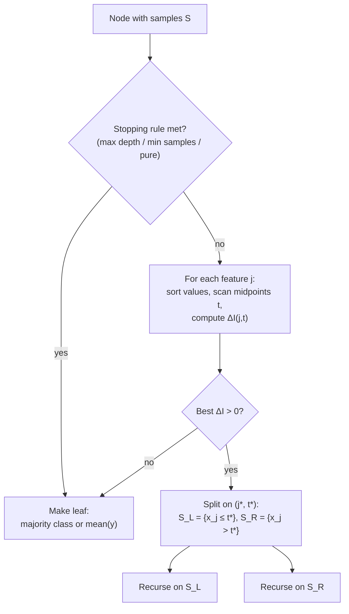
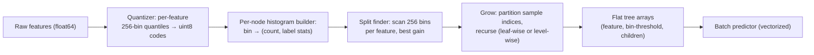

# 1.8 — Decision Trees

## 1. Overview

**What is it?** A decision tree is a predictive model shaped like a flowchart: each internal node asks a yes/no question about one feature ("is age > 30?"), each branch is an answer, and each leaf holds a prediction — a class label for classification or a number for regression. To predict, you drop a sample in at the root and follow the answers down to a leaf.

**Why does it exist?** Trees deliver something rare in machine learning: a model a human can read. They handle non-linear relationships, feature interactions, and mixed data types (numeric + categorical) with no feature scaling, no distributional assumptions, and no manual interaction engineering. Learning an *optimal* tree is NP-complete, so practical algorithms — most importantly **CART** (Classification and Regression Trees, Breiman et al., 1984) — grow trees greedily, one best-split at a time.

**What problem does it solve?** Classification and regression on **tabular data**: the spreadsheets of the world — credit applications, medical records, sensor logs — where features are heterogeneous, partially missing, and interact in messy ways.

**Where is it used?** Standalone wherever interpretability is mandated (credit-decision reason codes, clinical rules). Far more importantly, single trees are the **building blocks** of [Random Forests](09-random-forests.md) and [Gradient Boosting](10-gradient-boosting.md) — the ensembles that have dominated tabular machine learning for two decades. You cannot understand those chapters without this one.

## 2. Learning Objectives

After this chapter you will be able to:

- Describe the anatomy of a decision tree (root, internal nodes, branches, leaves) and how prediction traverses it.
- Define Gini impurity, entropy, and MSE, compute each by hand, and explain when each is used.
- Derive and compute impurity reduction (information gain) for a candidate split.
- Execute the CART algorithm end-to-end: candidate thresholds, best-split search, recursion, stopping.
- Explain why greedy splitting is used and what global optimality it sacrifices.
- Control overfitting via pre-pruning (depth, leaf-size limits) and post-pruning (cost-complexity pruning with $\alpha$).
- Explain strategies for missing values: surrogate splits (CART) and default directions (XGBoost-style).
- Implement a working decision tree from scratch in NumPy and validate it against scikit-learn.
- Analyze training and inference complexity and how histogram-based splitting changes the constants.
- Articulate why trees have high variance — the fact that motivates every ensemble method that follows.

## 3. Prerequisites

| Chapter | Why you need it |
|---|---|
| [Probability & Statistics](../phase-0-prerequisites/04-probability-statistics.md) | Impurity measures are functions of class probabilities; entropy comes from information theory. |
| [NumPy & Pandas](../phase-0-prerequisites/05-numpy-pandas.md) | The from-scratch implementation uses boolean masks, sorting, and vectorized counting. |
| [ML Fundamentals](01-ml-fundamentals.md) | Overfitting, bias–variance, and cross-validation drive every pruning decision here. |
| [Linear Regression](02-linear-regression.md) | Regression trees minimize the same squared error, but piecewise-constant instead of linear. |
| [Evaluation Metrics](14-evaluation-metrics.md) | We evaluate trees with accuracy/F1/MSE defined there. |

## 4. Intuition

Play "twenty questions" with a friend: "Is it alive? Is it bigger than a breadbox? Does it fly?" Each question is chosen to *split the remaining possibilities as cleanly as possible*, and after enough questions you commit to an answer. A decision tree is twenty questions played against a dataset — and training a tree is *learning which questions to ask, in which order*, so that each answer separates the labels as much as possible.

An everyday story: an emergency-room triage nurse doesn't run every test on every patient. She asks a cascade of cheap questions — "Chest pain? Older than 50? Shortness of breath?" — and each answer routes the patient down a different corridor of follow-ups until a triage category is assigned. Notice three things that make this tree-like: the questions are *sequential* (later questions depend on earlier answers — that's how trees capture feature **interactions**); each question is *simple* (one variable, one threshold); and the final decision is *auditable* (the nurse can recite exactly why: "chest pain, over 50, short of breath → category 1"). That auditability is why regulators in finance and medicine like trees.

The training question is: which question comes first? Intuitively, the one whose answer makes the groups **purest** — most dominated by a single label. "Does the email contain the word 'invoice'?" is a great first question for a spam dataset if the yes-group becomes 95% spam and the no-group 90% ham. Impurity measures (next sections) just turn "how mixed is this group?" into a number so the computer can compare questions.

> [!NOTE]
> A tree's decision boundary is made of axis-aligned rectangles — every split is a vertical or horizontal cut in feature space. Smooth diagonal boundaries must be approximated by staircases, which is precisely where linear models beat trees.

## 5. Real-world Motivation

- **Regulated finance.** Credit-scoring systems must produce *reason codes* — human-readable explanations for adverse decisions (required under regulations like the US ECOA/FCRA). Shallow trees and tree-derived rules remain a standard way to satisfy this at banks and fintech lenders.
- **Microsoft Kinect** famously used ensembles of decision trees (random forests) to classify body parts from depth-image pixels in real time on constrained hardware — inference is just a handful of threshold comparisons per pixel (Shotton et al., 2011).
- **The ensemble empire.** The reason every serious ML team cares about tree mechanics: gradient-boosted trees (XGBoost/LightGBM — [next chapters](10-gradient-boosting.md)) power fraud detection at payment companies, ranking and CTR systems at ad platforms, and the majority of winning Kaggle solutions on tabular data. **Microsoft** built LightGBM for its own click-prediction workloads; **Yandex** built CatBoost for search ranking.
- **Medicine.** Clinical decision rules (e.g., variants of pneumonia severity or head-injury rules) are frequently expressed as small trees precisely because clinicians must be able to execute and audit them mentally.
- **Feature discovery.** Teams at companies like Airbnb and Netflix have long used tree ensembles' feature importances as a first lens on which signals matter before investing in deeper models.

## 6. Mathematical Foundations

### 6.1 Setup and notation

A node contains a subset of training samples. For classification with classes $c = 1,\dots,K$, let $p_c$ be the fraction of the node's samples belonging to class $c$ (so $\sum_c p_c = 1$). Let $n$ be the number of samples at the node, and $n_L$, $n_R$ the sample counts sent to the left/right child by a candidate split. A split is a pair $(j, t)$: feature index $j$ and threshold $t$, routing samples with $x_j \le t$ left and $x_j > t$ right.

### 6.2 Impurity measures

**Gini impurity** — the probability that two samples drawn from the node (with replacement) have different labels:

$$
I_G = \sum_{c=1}^{K} p_c (1 - p_c) = 1 - \sum_{c=1}^{K} p_c^2
$$

Pure node ($p_c = 1$ for some $c$): $I_G = 0$. Maximally mixed binary node ($p = 0.5$): $I_G = 0.5$.

**Entropy** — expected information (in bits, if log base 2) needed to identify a sample's label:

$$
I_H = -\sum_{c=1}^{K} p_c \log_2 p_c \qquad (0 \log 0 \equiv 0)
$$

Pure node: 0 bits. Fifty-fifty binary node: 1 bit. Impurity reduction measured with entropy is called **information gain**.

**MSE / variance** (regression) — with node target values $y_i$ and node mean $\bar y = \frac{1}{n}\sum_i y_i$:

$$
I_M = \frac{1}{n}\sum_{i=1}^{n} (y_i - \bar y)^2
$$

A regression leaf predicts $\bar y$, the value minimizing squared error — the same criterion as [linear regression](02-linear-regression.md), but fit as a constant per region.

> [!TIP]
> Gini and entropy are both concave, both zero at purity, both maximal at uniformity, and disagree on the chosen split only a few percent of the time. Gini is the default (no logarithms → slightly faster). Don't burn tuning budget on this choice.

### 6.3 Impurity reduction — the split criterion

The quality of split $(j, t)$ is how much it reduces the *weighted average* child impurity relative to the parent:

$$
\Delta I(j, t) = I(\text{parent}) - \Big(\frac{n_L}{n}\, I(\text{left}) + \frac{n_R}{n}\, I(\text{right})\Big)
$$

The weights $n_L/n$, $n_R/n$ matter: a split producing one perfectly pure child containing 2 samples and one messy child with 998 is nearly worthless, and the weighting encodes that. CART chooses $(j^*, t^*) = \arg\max_{j,t} \Delta I(j,t)$ at every node. Because impurity functions are concave, $\Delta I \ge 0$ always (Jensen's inequality) — splitting never *looks* harmful on training data, which is exactly why trees overfit without external stopping rules.

### 6.4 Candidate thresholds

For a numeric feature with sorted unique values $v_1 < v_2 < \dots$, only midpoints $t = (v_i + v_{i+1})/2$ between *consecutive* values can change the partition — so a feature with $u$ unique values yields $u - 1$ candidate thresholds, not a continuum.

### 6.5 Cost-complexity pruning — derivation

Growing until pure yields a tree that memorizes noise. **Cost-complexity pruning** (a.k.a. weakest-link pruning) fixes this by penalizing size. For a subtree $T$ with leaf set $\tilde T$ (and $|\tilde T|$ leaves), define

$$
R_\alpha(T) = R(T) + \alpha |\tilde T|
$$

where $R(T)$ is the total training error (misclassification or squared error) of the tree's leaves, and $\alpha \ge 0$ is the complexity penalty per leaf. For each internal node $t$, collapsing its subtree $T_t$ into a single leaf becomes worthwhile when the penalty saved equals the error incurred — i.e. at the critical value

$$
\alpha_{\text{eff}}(t) = \frac{R(t) - R(T_t)}{|\tilde T_t| - 1}
$$

where $R(t)$ is the error if node $t$ were a leaf and $R(T_t)$ the error of the full subtree below it. Pruning repeatedly collapses the node with the smallest $\alpha_{\text{eff}}$ (the "weakest link"), producing a nested sequence of subtrees indexed by increasing $\alpha$; cross-validation then picks the best $\alpha$. In scikit-learn this is the `ccp_alpha` parameter.

### 6.6 Missing values

Two production-grade strategies:

- **Surrogate splits (classic CART):** at each node, learn backup splits on *other* features that best mimic the primary split's left/right partition; a sample missing the primary feature is routed by the best surrogate.
- **Default direction (XGBoost-style, and sklearn ≥ 1.3):** during training, try sending all missing-valued samples left, then right; keep whichever direction yields higher gain. Missingness itself becomes informative — often exactly right for real data, where "not recorded" carries meaning.

### 6.7 Symbol table

| Symbol | Meaning |
|---|---|
| $p_c$ | fraction of node samples in class $c$ |
| $K$ | number of classes |
| $n, n_L, n_R$ | sample counts at node / left child / right child |
| $(j, t)$ | split = feature index and threshold |
| $I(\cdot)$ | impurity (Gini $I_G$, entropy $I_H$, or MSE $I_M$) |
| $\Delta I$ | impurity reduction of a split |
| $\bar y$ | mean target at a node (regression leaf prediction) |
| $R(T), \tilde T$ | training error of tree $T$; its set of leaves |
| $\alpha$ | cost-complexity penalty per leaf |

## 7. Visual Explanation

The classic "play tennis" tree — sequential questions, leaves as decisions:

```
              Outlook?
             /   |    \
         Sunny  Overcast  Rain
           |      |         |
      Humidity?  Play      Wind?
       /    \             /    \
     High  Normal      Weak  Strong
       |    |           |      |
      No   Play        Play   No
```

How CART grows a tree (training loop):



What splits do to feature space — axis-aligned rectangles:

```
  x2                                x2
   │  o o o │ x x                    │  o o o │ x x
   │  o o   │  x x      split 2      │  o o   │  x x
   │  o  o  │ x         ────────►    ├────────┤ x        each region
   │  o o   │   x x     (on x2,      │  x x o │   x x    = one leaf
   │        │            left side)  │  x  x  │
   └────────┴─────── x1              └────────┴─────── x1
        split 1 (x1 ≤ t)
```

## 8. Algorithm

**CART (Classification and Regression Trees):**

1. Start at the root with all training samples.
2. **Check stopping rules:** if max depth reached, node has fewer than `min_samples_split` samples, or the node is pure → emit a leaf (majority class, or mean $y$ for regression).
3. **Search for the best split:** for each feature $j$: sort the node's values of feature $j$; for each midpoint $t$ between consecutive unique values, compute $\Delta I(j, t)$.
4. Pick $(j^*, t^*)$ with maximum $\Delta I$. If no split gives $\Delta I > 0$, emit a leaf.
5. Partition samples into $\{x_j \le t^*\}$ (left) and $\{x_j > t^*\}$ (right); **recurse** on each child.
6. **(Optional post-processing)** cost-complexity prune: compute the $\alpha_{\text{eff}}$ sequence, cross-validate $\alpha$, collapse weak links.

```text
PSEUDOCODE — CART
──────────────────
build(S, depth):
    if depth == max_depth or |S| < min_samples_split or pure(S):
        return Leaf(prediction = majority_or_mean(S))
    best_gain, best = 0, None
    for j in features:
        sort S by feature j                      # O(n log n)
        for t in midpoints of consecutive values:
            ΔI = I(S) - (|S_L|/|S|)·I(S_L) - (|S_R|/|S|)·I(S_R)
            if ΔI > best_gain: best_gain, best = ΔI, (j, t)
    if best is None: return Leaf(majority_or_mean(S))
    (j, t) = best
    return Node(j, t, build({x∈S: x_j ≤ t}, depth+1),
                      build({x∈S: x_j > t}, depth+1))

predict(x, node):
    while node is not Leaf:
        node = node.left if x[node.j] ≤ node.t else node.right
    return node.prediction
```

## 9. Worked Example

### Tiny example, fully by hand

Ten loan applicants, two features, binary label (Default?):

| # | Income (k$) | Age | Default |
|---|---|---|---|
| 1 | 25 | 22 | Yes |
| 2 | 30 | 25 | Yes |
| 3 | 35 | 48 | Yes |
| 4 | 40 | 30 | Yes |
| 5 | 45 | 51 | No |
| 6 | 55 | 33 | No |
| 7 | 60 | 45 | No |
| 8 | 70 | 29 | Yes |
| 9 | 80 | 55 | No |
| 10 | 90 | 40 | No |

**Root impurity** (5 Yes, 5 No): $p_{\text{yes}} = 0.5$, so $I_G = 1 - (0.5^2 + 0.5^2) = 0.5$.

**Candidate split: Income ≤ 42.5** (midpoint between 40 and 45):

- Left (samples 1–4): 4 Yes, 0 No → $I_G^L = 1 - (1^2 + 0^2) = 0$.
- Right (samples 5–10): 1 Yes, 5 No → $p_{\text{yes}} = 1/6$, $I_G^R = 1 - \big[(\tfrac{1}{6})^2 + (\tfrac{5}{6})^2\big] = 1 - \tfrac{26}{36} = 0.278$.
- Weighted child impurity: $\tfrac{4}{10}(0) + \tfrac{6}{10}(0.278) = 0.167$.
- **Gain:** $\Delta I = 0.5 - 0.167 = 0.333$.

**Candidate split: Age ≤ 36.5** (between 33 and 40):

- Left (ages 22, 25, 30, 33, 29): 4 Yes, 1 No → $I_G^L = 1 - \big[(\tfrac{4}{5})^2 + (\tfrac{1}{5})^2\big] = 0.32$.
- Right (ages 48, 51, 45, 55, 40): 1 Yes, 4 No → $I_G^R = 0.32$.
- Weighted: $0.5 \cdot 0.32 + 0.5 \cdot 0.32 = 0.32$; **Gain** $= 0.5 - 0.32 = 0.18$.

Income wins (0.333 > 0.18) → root split is **Income ≤ 42.5**. The left child is pure (all default) → leaf "Yes". The right child (1 Yes among 5 No — applicant 8, young with income 70) gets one more split on Age to isolate it. Total tree: depth 2, and every decision is explainable in one sentence.

### Realistic example

On the Titanic dataset (~890 passengers), a depth-3 CART tree learns essentially: *sex = male?* → then for males, *age ≤ ~6?*; for females, *passenger class = 3rd?* — reaching ~80% accuracy with three human-readable rules. Deeper trees gain little test accuracy while training accuracy climbs toward 100%: overfitting made visible.

## 10. Python from Scratch

A complete CART classifier with Gini splitting:

```python
import numpy as np
from collections import Counter

class Node:
    """Internal node (feature, threshold, children) or leaf (value)."""
    def __init__(self, feature=None, threshold=None, left=None, right=None, value=None):
        self.feature, self.threshold = feature, threshold
        self.left, self.right = left, right
        self.value = value                      # non-None => leaf

class DecisionTree:
    def __init__(self, max_depth=5, min_samples_split=2):
        self.max_depth = max_depth
        self.min_samples_split = min_samples_split

    @staticmethod
    def _gini(y):
        # I_G = 1 - Σ p_c²  computed from label counts
        _, cnt = np.unique(y, return_counts=True)
        p = cnt / cnt.sum()
        return 1.0 - (p ** 2).sum()

    def _best_split(self, X, y):
        """Return (feature, threshold, weighted_child_impurity) minimizing impurity."""
        n, d = X.shape
        best = (None, None, np.inf)
        for j in range(d):
            vals = np.unique(X[:, j])                      # sorted unique values
            for t in (vals[:-1] + vals[1:]) / 2:           # midpoint candidates
                mask = X[:, j] <= t
                yl, yr = y[mask], y[~mask]
                if len(yl) == 0 or len(yr) == 0:
                    continue                                # degenerate split
                # weighted average child impurity (lower = better)
                g = (len(yl) * self._gini(yl) + len(yr) * self._gini(yr)) / n
                if g < best[2]:
                    best = (j, t, g)
        return best

    def _build(self, X, y, depth):
        # Stopping rules: depth cap, tiny node, or pure node
        if (depth >= self.max_depth or len(y) < self.min_samples_split
                or len(np.unique(y)) == 1):
            return Node(value=Counter(y).most_common(1)[0][0])
        j, t, g = self._best_split(X, y)
        # No useful split found (e.g., duplicate rows with different labels)
        if j is None or g >= self._gini(y):
            return Node(value=Counter(y).most_common(1)[0][0])
        mask = X[:, j] <= t
        return Node(j, t,
                    self._build(X[mask], y[mask], depth + 1),
                    self._build(X[~mask], y[~mask], depth + 1))

    def fit(self, X, y):
        self.root = self._build(np.asarray(X, float), np.asarray(y), depth=0)
        return self

    def _predict_one(self, x, node):
        while node.value is None:                          # walk to a leaf
            node = node.left if x[node.feature] <= node.threshold else node.right
        return node.value

    def predict(self, X):
        return np.array([self._predict_one(x, self.root)
                         for x in np.asarray(X, float)])

# --- Verify on the hand-worked loan data ----------------------------------
X = np.array([[25,22],[30,25],[35,48],[40,30],[45,51],
              [55,33],[60,45],[70,29],[80,55],[90,40]], float)
y = np.array(["Yes","Yes","Yes","Yes","No","No","No","Yes","No","No"])
tree = DecisionTree(max_depth=2).fit(X, y)
print(tree.root.feature, tree.root.threshold)   # Expected: 0 42.5  (Income ≤ 42.5)
print(tree.predict([[28, 24], [85, 50]]))       # Expected: ['Yes' 'No']
```

**Complexity of this naive version:** the split search re-sorts and re-scans per candidate, costing $O(d \cdot u \cdot n)$ per node ($u$ = unique values). Production implementations sort once per feature and sweep thresholds with *incremental* class counts, giving $O(dn\log n)$ per node — same answer, orders of magnitude faster.

> [!WARNING]
> **Common bug:** using `x[node.feature] < node.threshold` in predict but `<=` in training (or vice versa). Samples exactly at a threshold get routed to different children in training vs. inference, producing rare, maddening prediction mismatches. Keep the comparison operator identical everywhere.

## 11. Library Implementation

```python
from sklearn.datasets import load_breast_cancer
from sklearn.model_selection import train_test_split, cross_val_score
from sklearn.tree import DecisionTreeClassifier, plot_tree, export_text
import matplotlib.pyplot as plt
import numpy as np

X, y = load_breast_cancer(return_X_y=True)
X_tr, X_te, y_tr, y_te = train_test_split(X, y, random_state=42)

clf = DecisionTreeClassifier(
    criterion="gini",         # or "entropy"; rarely changes the result
    max_depth=4,              # pre-pruning: hard depth cap
    min_samples_leaf=10,      # each leaf must keep ≥10 samples (smooths predictions)
    ccp_alpha=0.0,            # cost-complexity pruning strength (post-pruning)
    random_state=42,          # tie-breaking among equal-gain splits
)
clf.fit(X_tr, y_tr)
print(clf.score(X_te, y_te))                    # e.g. ~0.94

# Cost-complexity pruning path: candidate α values and CV selection
path = clf.cost_complexity_pruning_path(X_tr, y_tr)
scores = [cross_val_score(
             DecisionTreeClassifier(ccp_alpha=a, random_state=42),
             X_tr, y_tr, cv=5).mean()
          for a in path.ccp_alphas]
best_alpha = path.ccp_alphas[int(np.argmax(scores))]
print(f"best ccp_alpha = {best_alpha:.5f}")

# Interpretability: draw the tree, or print it as text rules
plot_tree(clf, feature_names=load_breast_cancer().feature_names,
          class_names=["malignant", "benign"], filled=True, fontsize=7)
plt.show()
print(export_text(clf, feature_names=list(load_breast_cancer().feature_names)))
```

Line-by-line: `max_depth` and `min_samples_leaf` are the two pre-pruning knobs that matter most; `cost_complexity_pruning_path` enumerates the weakest-link $\alpha$ sequence from Section 6.5 so you can cross-validate it; `plot_tree`/`export_text` are the interpretability payoff — show these to non-ML stakeholders. Use `DecisionTreeRegressor` (criterion `"squared_error"`) for regression.

## 12. Code Walkthrough

Tracing the from-scratch tree on the loan data:

| Value | Shape / type | Meaning |
|---|---|---|
| `X` | (10, 2) float | Income, Age columns |
| `y` | (10,) str | `"Yes"`/`"No"` labels |
| root `_gini(y)` | scalar | 0.5 (5/5 split) |
| best split at root | tuple | `(0, 42.5, 0.167)` — feature 0 (Income), threshold 42.5, weighted child Gini 0.167 (matches Section 9) |
| `mask` | (10,) bool | `[T,T,T,T,F,F,F,F,F,F]` — 4 samples left |
| left child | `Node(value="Yes")` | Pure leaf, $I_G = 0$ |
| right child | `Node(feature=1, threshold≈34.5)` | Age split isolating applicant 8 |
| `predict([[28,24],[85,50]])` | (2,) | `['Yes', 'No']` |

**Inputs:** float feature matrix, label vector. **Intermediates:** per-node Gini values, boolean partition masks. **Output:** label array. **Expected result:** root split `Income ≤ 42.5` with gain 0.333, identical to the hand computation — if your scratch tree disagrees with your hand math, the bug is usually in the weighting $\frac{n_L}{n}$ or the strictness of the threshold comparison.

## 13. Complexity Analysis

| Operation | Complexity | Reasoning |
|---|---|---|
| Best-split search, one node | $O(d\, n_{\text{node}} \log n_{\text{node}})$ | Sort each of $d$ features ($n\log n$), then one linear sweep with incremental class counts per feature. |
| Full training (balanced tree) | $O(d\, n \log^2 n)$; commonly quoted $O(d\, n\log n)$ | Each of $O(\log n)$ levels processes all $n$ samples across its nodes; with presorting tricks the extra log drops. |
| Training (degenerate/deep tree) | $O(d\, n^2)$ worst case | Each split peels off O(1) samples → $O(n)$ levels. |
| Prediction, one sample | $O(\text{depth})$ = $O(\log n)$ balanced | One comparison per level from root to leaf. |
| Model space | $O(\#\text{nodes})$ ≤ $O(n)$ | A fully grown tree has at most one leaf per sample; pruning shrinks this. |
| Histogram-based training | $O(d \, n)$ binning + $O(d \cdot \text{bins})$ per node | Pre-bin each feature into ≤256 buckets; split search scans bins, not samples — the trick behind LightGBM ([Gradient Boosting](10-gradient-boosting.md)). |

The headline: **inference is nearly free** (a dozen comparisons), which is why tree ensembles with hundreds of trees still serve at millisecond latency.

## 14. Advantages

- **Interpretable.** The model *is* an explanation: "declined because income ≤ 42.5k and age ≤ 34" is a sentence a regulator, doctor, or customer can audit. No other competitive model family offers this so directly.
- **No feature scaling needed.** Splits depend only on value *order*, so standardization is a no-op — unlike [KNN](06-knn.md) or gradient-descent models ([Gradient Descent](03-gradient-descent.md)). Monotone transforms (log, rank) don't change the tree at all.
- **Captures non-linearities and interactions automatically.** "High risk only if young AND low income" emerges naturally from nested splits; a linear model needs a hand-crafted interaction term.
- **Handles mixed and missing data.** Numeric and categorical features coexist; surrogate splits or default directions absorb missing values without imputation pipelines.
- **Fast, cheap inference.** $O(\text{depth})$ comparisons — Kinect ran forests of trees per-pixel in real time on 2010 console hardware.
- **Foundation of the strongest tabular models.** Every hour spent on tree mechanics pays dividends in [Random Forests](09-random-forests.md) and [Gradient Boosting](10-gradient-boosting.md).

## 15. Disadvantages

- **High variance.** Remove 5% of the training data and the greedy search may pick a different root split, changing *the entire tree* below it. This instability is the single most important fact about trees — it is why forests exist.
- **Overfits by default.** Impurity reduction is always ≥ 0, so an unconstrained tree happily grows one leaf per sample, memorizing noise (100% train accuracy, poor test accuracy).
- **Greedy ≠ optimal.** CART optimizes one split at a time; problems like XOR (where no single-feature split helps but pairs of splits solve it perfectly) can defeat the greedy criterion. Finding the globally optimal tree is NP-complete, so this is a deliberate trade.
- **Staircases for linear relationships.** A true relationship $y = 2x$ must be approximated by many piecewise-constant steps; [linear regression](02-linear-regression.md) gets it exactly with one coefficient.
- **Cannot extrapolate.** A regression tree predicts a constant outside the training range — house prices beyond the largest training value all get the same estimate.
- **Split bias toward high-cardinality features.** Features with many unique values offer more candidate thresholds and win splits by chance, distorting both structure and impurity-based importances.

## 16. Common Mistakes

- **Growing unlimited-depth trees** and reporting training accuracy. *Fix:* set `max_depth`/`min_samples_leaf` or tune `ccp_alpha` by cross-validation; always report held-out metrics.
- **Ignoring class imbalance.** With 99% negatives, a root leaf predicting "negative" already scores 99% accuracy and splits look worthless. *Fix:* `class_weight="balanced"`, and evaluate with PR-AUC/F1 ([Evaluation Metrics](14-evaluation-metrics.md)).
- **One-hot encoding high-cardinality categoricals into trees.** A 1000-category feature becomes 1000 near-useless binary features, each splitting off one category. *Fix:* use native categorical support (LightGBM/CatBoost), target encoding, or grouping.
- **Reading feature importance as causality.** Impurity importance says "used for splitting," not "causes the outcome," and is biased toward high-cardinality features. *Fix:* prefer permutation importance ([Random Forests](09-random-forests.md)); never make causal claims from it.
- **Comparing trees trained with different random seeds and over-interpreting the differences.** That's variance, not signal. *Fix:* fix seeds for reproducibility; use ensembles when stability matters.
- **Forgetting that pruning parameters interact.** A tight `max_depth` can make `ccp_alpha` irrelevant and vice versa. *Fix:* tune one pruning mechanism as primary; leave others loose.

## 17. Best Practices

- [ ] Start with a shallow tree (depth 3–5) to *understand the data*; visualize with `plot_tree` before anything else.
- [ ] Tune `min_samples_leaf` (try 5–50) — it's the most effective single overfitting control and smooths leaf estimates.
- [ ] Use `cost_complexity_pruning_path` + cross-validation for principled post-pruning instead of guessing depth.
- [ ] Set `class_weight="balanced"` for skewed classification; check the confusion matrix per class.
- [ ] Keep the tree as an interpretable *artifact*: export text rules into design docs and reviews.
- [ ] For deployment-grade accuracy, graduate to [Random Forests](09-random-forests.md) or [Gradient Boosting](10-gradient-boosting.md) — a single tree is a baseline and an explanation, rarely the final model.
- [ ] Version training data with the model: tree structure is data-sensitive, and reproducing an audited tree requires the exact snapshot.
- [ ] Test threshold-boundary samples explicitly (values exactly at split thresholds) in unit tests of any custom implementation.

## 18. Optimization Techniques

- **Presort once, sweep incrementally.** Sort each feature a single time; evaluate all thresholds in one linear pass by maintaining running class counts — turns the naive $O(u \cdot n)$ scan per feature into $O(n)$.
- **Histogram binning.** Quantize each feature to ≤256 bins up front; split search touches bins instead of samples ($O(\text{bins})$ per feature per node) and data fits in cache as `uint8`. This is the core speed trick of LightGBM and `HistGradientBoosting` — details in [Gradient Boosting](10-gradient-boosting.md).
- **Vectorized impurity sweeps.** In NumPy, compute Gini for *all* thresholds of a feature at once with cumulative sums of one-hot label counts — no Python-level threshold loop.
- **Node-level parallelism.** Split searches across features (and subtree builds) are independent — scikit-learn ensembles parallelize at tree level with `n_jobs`.
- **Model compression for serving.** Flatten the tree into arrays (feature-id, threshold, child indices) for branchless, cache-friendly inference; convert via ONNX or Treelite for optimized runtimes.
- **Prune for latency, not just accuracy.** Every pruned level halves worst-case comparisons; depth caps double as inference-latency guarantees.

## 19. Industry Applications

- **Credit decisioning (production example).** Lenders deploy shallow trees (or tree-derived rule sets) where each leaf maps to an approve/decline decision plus a reason code; model risk teams audit the printed rules line by line — a regulatory workflow that neural networks still struggle to satisfy.
- **Real-time body-part classification — Microsoft Kinect.** Depth-image pixels classified by tree ensembles at 30 fps on console hardware; the published system (Shotton et al., CVPR 2011) is a landmark of trees in production.
- **Fraud triage.** Payment processors express first-line fraud rules as trees over transaction features (amount, country mismatch, velocity) — auditable, millisecond-fast, and easily hot-patched.
- **Clinical decision rules.** Emergency-medicine rules (triage severity, imaging decision rules) are published and taught as small trees, because clinicians must execute them from memory.
- **Churn and marketing analytics.** Analysts fit depth-3 trees to *see* which segments churn ("contract = monthly AND tenure < 6 months"), then hand segments to campaign teams — the tree as an insight tool, not a predictor.
- **As the weak learner inside ensembles.** Every XGBoost/LightGBM deployment — fraud scoring at fintechs, ranking at ad platforms, ETA models at delivery companies — is thousands of CART trees under the hood.

## 20. Interview Questions

### Beginner

**Q1. How does a decision tree make a prediction?**
**A.** Start at the root; at each internal node compare one feature to a threshold and follow the matching branch; at a leaf, output its stored value — the majority class (classification) or the mean of training targets (regression) that reached that leaf.

**Q2. What is Gini impurity and what does $I_G = 0$ mean?**
**A.** $I_G = 1 - \sum_c p_c^2$: the probability two random samples from the node (with replacement) have different labels. $I_G = 0$ means the node is pure — all samples share one class — so it can be a confident leaf.

**Q3. Gini vs. entropy — how do you choose?**
**A.** Both are concave purity measures, zero at purity, maximal at uniform mixing; they select the same split in the vast majority of cases. Gini is the default because it avoids logarithms (marginally faster). This is not a hyperparameter worth tuning hard.

**Q4. Why don't decision trees need feature scaling?**
**A.** A split $x_j \le t$ depends only on the *ordering* of values, not their magnitudes. Any monotone transformation (standardization, log) preserves order, so the learned tree is unchanged — unlike distance- or gradient-based models.

**Q5. Why do unconstrained trees overfit?**
**A.** Impurity reduction is non-negative for every split (concavity + Jensen), so training always "improves" by splitting further, until leaves hold single samples — i.e., the tree memorizes noise. Generalization requires external constraints: depth caps, leaf-size minimums, or pruning.

### Intermediate

**Q1. Walk through cost-complexity pruning.**
**A.** Define $R_\alpha(T) = R(T) + \alpha|\tilde T|$ (training error plus per-leaf penalty). For each internal node compute the critical $\alpha_{\text{eff}} = \frac{R(t) - R(T_t)}{|\tilde T_t| - 1}$ at which collapsing its subtree breaks even; repeatedly collapse the smallest (weakest link), producing a nested subtree sequence; choose $\alpha$ by cross-validation. In sklearn: `ccp_alpha` + `cost_complexity_pruning_path`.

**Q2. How do trees handle missing values?**
**A.** (a) *Surrogate splits* (classic CART): learn backup features whose splits best imitate the primary partition and route missing samples by them. (b) *Learned default direction* (XGBoost, modern sklearn): during training try missing-goes-left vs. missing-goes-right, keep the higher-gain choice — letting missingness itself be predictive. (c) Imputation before training is a fallback but discards the missingness signal.

**Q3. Why is greedy splitting suboptimal? Give a concrete failure.**
**A.** CART evaluates one split at a time, but some structure only pays off after two splits. XOR: with $y = x_1 \oplus x_2$, every single split on $x_1$ or $x_2$ leaves children with 50/50 labels (zero gain), so greedy search sees nothing — even though a depth-2 tree classifies perfectly. Optimal tree construction is NP-complete, so greed is a deliberate trade of optimality for tractability.

**Q4. CART vs. ID3/C4.5?**
**A.** ID3: multi-way categorical splits, entropy/information gain, classification only, no numeric features natively. C4.5: adds numeric thresholds, gain *ratio* (normalizing information gain's bias toward many-valued features), and handles missing values. CART: strictly binary splits, Gini (classification) or MSE (regression), supports regression, and introduces cost-complexity pruning — CART is what scikit-learn and all modern boosting libraries implement.

**Q5. What exactly does a regression tree predict, and why the mean?**
**A.** Each leaf predicts the mean of training targets in that leaf. The mean is the constant $c$ minimizing $\sum_i (y_i - c)^2$ (set the derivative $-2\sum_i(y_i - c) = 0$), matching the MSE split criterion. The prediction surface is piecewise constant over feature-space rectangles.

### Advanced

**Q1. Prove a split can never increase weighted impurity for concave impurity functions.**
**A.** Let impurity $I(p)$ be concave in the class-probability vector $p$. The parent distribution is the mixture $p = \frac{n_L}{n} p_L + \frac{n_R}{n} p_R$. By Jensen's inequality for concave functions, $I(p) \ge \frac{n_L}{n} I(p_L) + \frac{n_R}{n} I(p_R)$, so $\Delta I \ge 0$ always. Consequence: training impurity monotonically decreases with every split — internal criteria can never tell you when to stop, which is why pruning/validation is essential.

**Q2. Why are impurity-based feature importances biased, and toward what?**
**A.** (1) *Cardinality bias:* features with more unique values have more candidate thresholds, hence more chances to achieve a spuriously high gain — random noise with 1000 unique values can out-rank a genuinely predictive binary feature. (2) They're computed on training data, so they inherit overfitting. (3) Correlated features split credit arbitrarily. Permutation importance on held-out data addresses (1) and (2); grouped/conditional importance addresses (3).

**Q3. Derive the optimal split for a regression stump on sorted data in $O(n)$.**
**A.** Sort by the feature. For a threshold after position $k$, the total squared error is $\sum_{i\le k}(y_i - \bar y_L)^2 + \sum_{i>k}(y_i - \bar y_R)^2$. Using $\sum (y_i - \bar y)^2 = \sum y_i^2 - n\bar y^2$, maintain running sums $S_k = \sum_{i \le k} y_i$ and $Q_k = \sum_{i \le k} y_i^2$; then each candidate's error is $\big(Q_k - S_k^2/k\big) + \big((Q_n - Q_k) - (S_n - S_k)^2/(n-k)\big)$ — O(1) per threshold after the sort, O(n) for the sweep.

**Q4. How does the axis-aligned constraint shape a tree's inductive bias, and what are oblique trees?**
**A.** Every split is perpendicular to a feature axis, so decision boundaries are unions of hyper-rectangles: excellent for rule-like, interaction-heavy structure; poor for rotated linear boundaries, which require deep staircases (and the required depth grows as data dimension/rotation worsens). Oblique trees split on linear combinations $\mathbf{w}^\top\mathbf{x} \le t$ (e.g., OC1, or trees with small linear models at nodes), trading interpretability and training cost for geometric flexibility.

**Q5. You deploy a tree and, after retraining on 3% more data, the root split changes and downstream dashboards break. Explain and remediate.**
**A.** This is tree variance: near-tied split gains at the root flip with small data perturbations, and everything below the root changes with it. Remediations: (a) ensemble (forest/boosting) and expose *aggregate* outputs, not structure; (b) if a single auditable tree is required, stabilize with larger `min_samples_leaf`, cross-validated pruning, and champion–challenger evaluation before promoting a retrained tree; (c) pin the structure and refit only leaf values between full reviews.

## 21. Coding Exercises

### Easy

1. **Impurity by hand + code.** Write `gini(y)` and `entropy(y)`; verify on distributions (1.0, 0.0), (0.5, 0.5), (0.9, 0.1) that Gini gives 0, 0.5, 0.18 and entropy gives 0, 1, ≈0.469 bits. *Hint: handle $p=0$ terms as 0 in entropy.*
2. **Best stump.** Write a function that finds the single best split of the Section 9 loan data over both features; confirm it returns Income ≤ 42.5 with gain 0.333. *Hint: reuse midpoints of consecutive sorted unique values.*

### Medium

1. **Add entropy and regression criteria.** Extend the Section 10 class with `criterion="entropy"` and a `DecisionTreeRegressor` variant (MSE splits, mean leaves); validate both against scikit-learn on a synthetic dataset (predictions should match for identical hyperparameters). *Hint: identical tie-breaking is impossible — compare accuracy/MSE, not structure.*
2. **Decision-boundary visualization.** Train trees of depth 1, 3, 10 on `sklearn.datasets.make_moons(noise=0.3)`; plot decision regions over a 2D mesh grid. *Hint: watch rectangles proliferate and start capturing noise at depth 10.*
3. **Pruning study.** On the breast-cancer dataset, plot train and test accuracy vs. `ccp_alpha` along the pruning path; mark the CV-selected $\alpha$. *Hint: `cost_complexity_pruning_path` gives the exact candidate alphas.*

### Hard

1. **Fast split search.** Reimplement `_best_split` to sort once per feature and sweep all thresholds with cumulative class counts ($O(n)$ per feature after sorting); benchmark vs. the naive version on 100k rows and verify identical chosen splits. *Hint: one-hot the labels, then `np.cumsum` down the sorted order gives left-child class counts for every threshold simultaneously.*
2. **Cost-complexity pruning from scratch.** Implement weakest-link pruning on your tree: compute $\alpha_{\text{eff}}$ per internal node, generate the nested subtree sequence, select $\alpha$ by 5-fold CV; compare selected size with sklearn's. *Hint: work bottom-up; after each collapse, recompute $\alpha_{\text{eff}}$ only for ancestors of the collapsed node.*
3. **Categorical splits.** Add native categorical support: for binary classification, sort categories by their positive-class rate and scan contiguous partitions (provably optimal — Breiman 1984); compare against one-hot encoding on a high-cardinality dataset. *Hint: this reduces a $2^{m-1}-1$ subset search to $m-1$ candidates.*

## 22. Mini Project

**Titanic survival tree — an exercise in interpretation.**

1. Load the Titanic dataset (Kaggle or seaborn); keep `sex`, `age`, `pclass`, `fare`, `sibsp`; impute missing ages with the median (note what this throws away — see Section 6.6).
2. Encode `sex` numerically; split train/test 80/20 stratified.
3. Train `DecisionTreeClassifier(max_depth=3, min_samples_leaf=20)`.
4. Plot with `plot_tree` and translate every path from root to leaf into an English sentence ("female + not 3rd class → survived, 95% of 170 samples").
5. Sweep `max_depth` 1–15; plot train vs. test accuracy to expose the overfitting gap.
6. Deliverable: the annotated tree diagram plus a paragraph on which historical facts ("women and children first") the tree rediscovered.

## 23. Medium Project

**Trees vs. ensembles benchmark with honest tuning.**

1. Pick a mid-sized tabular dataset (Adult income ~49k rows, or a Kaggle playground dataset).
2. Build three pipelines: single CART (tuned `max_depth`, `min_samples_leaf`, `ccp_alpha` via `GridSearchCV`), [Random Forest](09-random-forests.md), and [Gradient Boosting](10-gradient-boosting.md) — same CV protocol for all.
3. Report test accuracy/F1 with confidence intervals (5 seeds); measure train time and per-1k-row inference latency.
4. Plot learning curves (performance vs. training size) for all three; note where the single tree plateaus.
5. Compute permutation importance for the forest and compare with the single tree's impurity importances; explain discrepancies (cardinality bias, correlation credit-splitting).
6. Deliverable: a benchmark report recommending which model to ship under (a) an interpretability mandate, (b) a pure-accuracy mandate.

## 24. Advanced Project

**Histogram-based tree learner, built for speed.**

Architecture:



Implementation phases:

1. **Quantization:** compute per-feature quantile bin edges on a sample; encode the dataset as `uint8` (this alone shrinks memory 8× and makes scans cache-friendly).
2. **Histogram split search:** per node, accumulate per-bin label statistics in one pass over the node's samples; scan bins cumulatively for the best Gini/MSE gain — $O(\text{samples})$ build + $O(256 \cdot d)$ search.
3. **Subtraction trick:** a child's histogram = parent's histogram − sibling's histogram; build only the smaller child's histogram directly and subtract for the other (halves histogram work — LightGBM's key optimization).
4. **Benchmark:** against `sklearn.tree.DecisionTreeClassifier` and `HistGradientBoostingClassifier` (single-tree config) on 1M–10M synthetic rows; report wall-time, memory, and accuracy parity.
5. **Serving:** flatten to arrays, implement vectorized batch prediction, and measure rows/second.

Possible improvements: leaf-wise (best-first) growth with a max-leaves budget; parallel histogram construction across features (threads or `numba`); missing-value default directions learned per split; sparse-aware binning. This project *is* the inner loop of [LightGBM](10-gradient-boosting.md) — building it demystifies the next chapter.

## 25. Summary

- A decision tree is a learned flowchart: internal nodes test one feature against a threshold; leaves predict a class (majority) or value (mean).
- CART grows trees greedily, choosing at each node the split $(j, t)$ maximizing impurity reduction $\Delta I = I(\text{parent}) - \frac{n_L}{n}I(L) - \frac{n_R}{n}I(R)$.
- Impurity: Gini $1-\sum p_c^2$ and entropy $-\sum p_c \log p_c$ for classification (near-interchangeable); MSE/variance for regression.
- Concavity of impurity ⇒ every split looks non-harmful on training data ⇒ unconstrained trees memorize noise; control with depth/leaf-size limits and cost-complexity pruning ($\alpha$, cross-validated).
- Missing values are handled natively via surrogate splits or learned default directions — missingness can itself be signal.
- Trees need no feature scaling, capture interactions automatically, and explain themselves — but have high variance, staircase linear relationships, and cannot extrapolate.
- Greedy splitting is a tractability trade: optimal trees are NP-complete, and XOR-style structure defeats one-step-lookahead gain.
- Training is $O(dn\log n)$-ish; prediction is $O(\text{depth})$ — nearly free, which ensembles exploit.
- Histogram binning (≤256 bins per feature) is the modern speed trick, and the bridge to LightGBM.
- The tree's instability is not a footnote — it is the founding motivation of [Random Forests](09-random-forests.md) (average many decorrelated trees) and [Gradient Boosting](10-gradient-boosting.md) (add many small corrective trees).

## 26. Cheat Sheet

| Formula | Meaning |
|---|---|
| $I_G = 1 - \sum_c p_c^2$ | Gini impurity (0 = pure, 0.5 = 50/50 binary) |
| $I_H = -\sum_c p_c \log_2 p_c$ | Entropy in bits (0 = pure, 1 = 50/50 binary) |
| $I_M = \frac{1}{n}\sum_i (y_i - \bar y)^2$ | Regression node impurity (variance) |
| $\Delta I = I(P) - \frac{n_L}{n}I(L) - \frac{n_R}{n}I(R)$ | Split gain (maximize) |
| $R_\alpha(T) = R(T) + \alpha\|\tilde T\|$ | Cost-complexity objective for pruning |
| $\alpha_{\text{eff}} = \frac{R(t)-R(T_t)}{\|\tilde T_t\|-1}$ | Weakest-link critical alpha |

**Key hyperparameters (sklearn):** `max_depth` (try 3–10), `min_samples_leaf` (try 5–50; best single overfitting knob), `ccp_alpha` (via `cost_complexity_pruning_path` + CV), `criterion` (leave at `"gini"`/`"squared_error"`), `class_weight="balanced"` for imbalance.

**One-liners:** no scaling ever needed; visualize before you trust; prune with CV, not vibes; single tree = explanation, ensemble = accuracy; identical `<=` in train and predict.

**Gotchas:** train accuracy 100% is the default, not an achievement; impurity importances inflate high-cardinality features; trees can't extrapolate beyond training range; XOR breaks greedy gain; retraining on slightly different data can restructure the whole tree.

## 27. Further Reading

**Books**
- Breiman, Friedman, Olshen, Stone — *Classification and Regression Trees* (1984): the CART book; pruning and surrogate splits from the source.
- Hastie, Tibshirani, Friedman — *The Elements of Statistical Learning*, Ch. 9.2 (trees) and 10 (boosting context).
- Quinlan — *C4.5: Programs for Machine Learning* (1993).

**Research Papers**
- Quinlan (1986), "Induction of Decision Trees" (ID3).
- Hyafil & Rivest (1976), "Constructing Optimal Binary Decision Trees is NP-Complete."
- Shotton et al. (2011), "Real-Time Human Pose Recognition in Parts from Single Depth Images" (Kinect forests).
- Ke et al. (2017), "LightGBM: A Highly Efficient Gradient Boosting Decision Tree" — the histogram tricks previewed here.

**Documentation**
- scikit-learn user guide: Decision Trees (including the minimal cost-complexity pruning section).

**GitHub Repositories**
- `scikit-learn/scikit-learn` (`sklearn/tree/` — the Cython splitter is instructive), `microsoft/LightGBM`, `interpretml/interpret` (rule-based glass-box models).

**Datasets**
- Titanic (Kaggle), Adult income (UCI), Breast Cancer Wisconsin (sklearn), Play-Tennis toy table (Mitchell).

**YouTube/Videos**
- StatQuest: "Decision and Classification Trees, Clearly Explained" and "How to Prune Regression Trees."
- MIT 6.034 lecture on identification trees.

**Blogs**
- R2D3, "A Visual Introduction to Machine Learning" — the most beautiful decision-tree explainer on the web.
- scikit-learn examples gallery: "Post pruning decision trees with cost complexity pruning."
