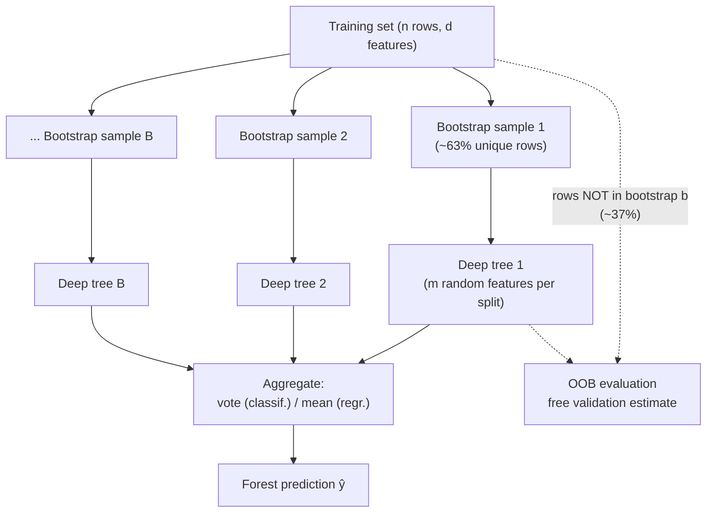
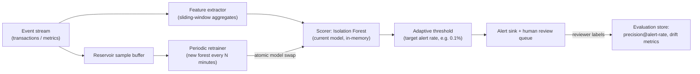

# 1.9 — Random Forests & Bagging

## 1. Overview

**What is it?** A Random Forest is an ensemble of decision trees, each trained on a different bootstrap sample of the rows and forced to consider only a random subset of features at every split. Predictions are aggregated — majority vote for classification, average for regression. Two sources of injected randomness (rows *and* columns) make the trees disagree in useful ways, and averaging their disagreements cancels their individual errors.

**Why does it exist?** [Decision trees](08-decision-trees.md) are high-variance: perturb the data slightly and the whole tree can restructure. Breiman's insight (bagging, 1996; random forests, 2001) was that variance — unlike bias — can be *averaged away*: many noisy, roughly-unbiased estimators, combined, are far more stable than any one of them. The feature subsampling was the second insight: averaging only helps to the extent the trees are *decorrelated*, so deliberately prevent them from all agreeing on the same dominant feature.

**What problem does it solve?** Strong, low-effort predictive performance on tabular data. A Random Forest with default settings is rarely the very best model but is almost always in the top three, is hard to catastrophically misconfigure, provides a free validation estimate (out-of-bag error), and yields useful feature-importance diagnostics.

**Where is it used?** As the reliable workhorse baseline in industry tabular ML; in production systems where robustness beats squeezing out the last 1% (its cousin **Isolation Forest** dominates unsupervised anomaly detection); and famously in Microsoft Kinect's real-time body-part recognition.

## 2. Learning Objectives

After this chapter you will be able to:

- Explain bootstrap sampling and prove that ~63.2% of rows appear in each bootstrap sample.
- Derive the variance-reduction formula $\mathrm{Var}(\bar T) = \rho\sigma^2 + \frac{1-\rho}{B}\sigma^2$ and interpret every term.
- Explain why feature subsampling decorrelates trees and how $m$ (features per split) trades correlation against tree strength.
- Use out-of-bag (OOB) samples as a free, honest validation estimate — and know when OOB is invalid.
- Implement bagging and a Random Forest from scratch on top of a decision tree.
- Distinguish Mean-Decrease-in-Impurity (MDI) from permutation feature importance, including the biases of each.
- Tune the hyperparameters that matter (`n_estimators`, `max_features`, `min_samples_leaf`) and skip the ones that don't.
- Explain why adding more trees never overfits (but also stops helping).
- Compare Random Forests against single trees and against [gradient boosting](10-gradient-boosting.md), and choose correctly.
- Apply forest variants: ExtraTrees and Isolation Forest.

## 3. Prerequisites

| Chapter | Why you need it |
|---|---|
| [Decision Trees](08-decision-trees.md) | The forest's base learner; you must know CART splitting and why single trees have high variance. |
| [Probability & Statistics](../phase-0-prerequisites/04-probability-statistics.md) | Variance of sums, covariance, and correlation drive the entire variance-reduction argument. |
| [ML Fundamentals](01-ml-fundamentals.md) | Bias–variance decomposition and cross-validation frame everything here. |
| [NumPy & Pandas](../phase-0-prerequisites/05-numpy-pandas.md) | Bootstrap indexing and vectorized voting in the from-scratch build. |
| [Evaluation Metrics](14-evaluation-metrics.md) | OOB scores and importance analyses are only meaningful with sound metrics. |

## 4. Intuition

The classic story is the 1906 country-fair ox. Statistician Francis Galton watched ~800 fair-goers guess the weight of an ox. Individual guesses were all over the place — but their *average* came within about 1% of the true weight, beating every cattle expert present. This is the **wisdom of crowds**, and it has fine print that maps exactly onto Random Forests: the crowd must be (1) individually *roughly competent* (guesses centered near the truth — low bias), and (2) *diverse* (errors must point in different directions so they cancel — low correlation). A crowd that all read the same wrong newspaper shares the same error, and averaging doesn't remove shared error.

A Random Forest manufactures such a crowd out of decision trees:

- **Bootstrap sampling** gives each tree a different re-weighted view of the data — different "life experiences," so different mistakes.
- **Feature subsampling** stops every tree from asking the same first question. Without it, one dominant feature (say, `income` in a credit dataset) would sit at the root of *every* tree, making all trees highly correlated — the same-newspaper problem. Hiding `income` from a random two-thirds of split decisions forces some trees to discover the predictive value of `age` or `tenure`, diversifying the committee.
- **Aggregation** is the vote. Individual trees overfit their bootstrap noise, but each tree's idiosyncratic mistakes are outvoted by the majority that didn't make them. Only the *shared signal* survives averaging.

> [!NOTE]
> Averaging attacks **variance**, not **bias**. If every tree is systematically wrong the same way (e.g., all are depth-2 and underfit), the forest is exactly as wrong. That's why forests grow trees deep (low bias, high variance) and let averaging clean up the variance — the mirror image of [boosting](10-gradient-boosting.md), which grows shallow high-bias trees and reduces bias sequentially.

## 5. Real-world Motivation

- **Microsoft Kinect** shipped random forests in a mass-market consumer device: per-pixel body-part classification from depth images at 30 fps (Shotton et al., 2011). Forests were chosen for accuracy *and* because tree inference is branch-cheap enough for real-time console hardware.
- **Baseline culture at tech companies.** Teams at **Airbnb**, **Netflix**, and **Uber** have described using tree-ensemble baselines (forests and GBMs) as the first serious model on tabular problems — churn, pricing, ranking features — before deciding whether deep models are worth the complexity. The forest's near-zero tuning cost makes it the honest yardstick.
- **Anomaly and fraud detection.** Isolation Forest — a forest variant where "easy to isolate = anomalous" — is a production standard for fraud pre-screening and infrastructure anomaly detection, available in every major ML platform (and used in cloud anomaly-detection services).
- **Bioinformatics and finance.** Random forests are ubiquitous where datasets are wide (many features, modest rows) — gene-expression classification, credit risk — because feature subsampling handles $d \gg n$ gracefully and OOB error gives honest estimates without sacrificing scarce data to a validation split.
- **Kaggle history.** Before XGBoost's 2014–2015 takeover, random forests were the competitive default on tabular data; they remain the recommended "first real model" in most practical guides.

## 6. Mathematical Foundations

### 6.1 The bootstrap and the 63.2% fact

A **bootstrap sample** draws $n$ rows from the $n$-row training set *with replacement*. The probability a given row is missed by all $n$ draws:

$$
P(\text{row not drawn}) = \Big(1 - \frac{1}{n}\Big)^{n} \xrightarrow{n \to \infty} e^{-1} \approx 0.368
$$

So each tree trains on ≈ 63.2% unique rows; the remaining ≈ 36.8% are that tree's **out-of-bag (OOB)** rows — unseen data, usable as a free validation set (Section 6.4).

### 6.2 Bagging: the prediction rule

Train trees $T_1, \dots, T_B$ on bootstrap samples $D_1, \dots, D_B$. For input $\mathbf{x}$:

$$
\hat y = \frac{1}{B}\sum_{b=1}^{B} T_b(\mathbf{x}) \quad \text{(regression)}, \qquad
\hat y = \operatorname{mode}\{T_b(\mathbf{x})\}_{b=1}^{B} \quad \text{(classification)}
$$

For classification, averaging the trees' predicted class *probabilities* and taking the argmax ("soft voting") is smoother than hard majority vote and is what scikit-learn does.

### 6.3 Variance reduction — full derivation

Let each tree's prediction at a fixed $\mathbf{x}$ be a random variable (randomness from the bootstrap + feature sampling) with variance $\sigma^2$, and let any two distinct trees have pairwise correlation $\rho$ (equivalently covariance $\rho\sigma^2$). The forest predicts the average $\bar T = \frac{1}{B}\sum_b T_b$. Using $\mathrm{Var}(\sum_b T_b) = \sum_b \mathrm{Var}(T_b) + \sum_{b \ne b'} \mathrm{Cov}(T_b, T_{b'})$:

$$
\mathrm{Var}(\bar T) = \frac{1}{B^2}\Big[ B\sigma^2 + B(B-1)\rho\sigma^2 \Big]
= \frac{\sigma^2}{B} + \frac{B-1}{B}\rho\sigma^2
$$

Rearranged into its standard form:

$$
\boxed{\ \mathrm{Var}(\bar T) = \rho\sigma^2 + \frac{1-\rho}{B}\sigma^2\ }
$$

Read it term by term:

- **Second term** $\frac{1-\rho}{B}\sigma^2 \to 0$ as $B \to \infty$: the part of the variance you can annihilate by adding trees. This is why more trees never hurt.
- **First term** $\rho\sigma^2$: the **irreducible floor**. No number of trees removes variance that all trees *share*. If $\rho = 1$ (identical trees), averaging does nothing; if $\rho = 0$, variance decays as $\sigma^2/B$, the i.i.d. ideal.
- Numerical example: $\sigma^2 = 1$, $B = 500$. With $\rho = 0.6$ (bagging only): $\mathrm{Var} \approx 0.6 + 0.0008 \approx 0.60$. With $\rho = 0.2$ (bagging + feature subsampling): $\mathrm{Var} \approx 0.2 + 0.0016 \approx 0.20$ — a 3× improvement that came entirely from decorrelation, not from more trees.

This equation *is* the design document of the Random Forest: bagging alone leaves $\rho$ high because strong features dominate every tree; **feature subsampling exists to push $\rho$ down**, accepting slightly weaker individual trees (higher $\sigma^2$, slightly higher bias) in exchange. The optimal $m$ balances the two.

### 6.4 Feature subsampling

At **each split** (not each tree), draw a random subset of $m$ of the $d$ features and choose the best split only among them. Standard defaults:

$$
m = \lfloor\sqrt{d}\rfloor \ \ \text{(classification)}, \qquad m = \lfloor d/3 \rfloor \ \ \text{(regression)}
$$

These are empirical rules of thumb, worth tuning: smaller $m$ → less correlation, weaker trees; $m = d$ recovers plain bagging.

### 6.5 Out-of-bag error

For each training row $i$, collect the ~$0.368B$ trees whose bootstrap missed row $i$; aggregate only *their* predictions to get $\hat y_i^{\text{OOB}}$; compare with $y_i$:

$$
\text{OOB error} = \frac{1}{n}\sum_{i=1}^{n} L\big(y_i,\ \hat y_i^{\text{OOB}}\big)
$$

where $L$ is the task loss (0–1 loss, squared error…). Because every OOB prediction comes from trees that never saw the row, this is an honest generalization estimate — asymptotically similar to leave-one-out cross-validation, at zero extra training cost.

> [!WARNING]
> OOB (and bootstrap itself) assumes rows are i.i.d. With time series or grouped data (multiple rows per user), bootstrap samples leak information across the split and OOB error is optimistically biased. Use time-based or group-based validation instead.

### 6.6 Feature importance

**Mean Decrease in Impurity (MDI):** sum, over all splits in all trees that use feature $j$, the impurity reduction $\Delta I$ weighted by the fraction of samples reaching that node; normalize across features. Fast (computed during training) but biased toward high-cardinality features and computed on *training* data.

**Permutation importance:** on held-out (or OOB) data, randomly shuffle column $j$ — destroying its relationship with $y$ while preserving its marginal distribution — and measure the score drop:

$$
\text{PI}_j = S - \mathbb{E}\big[S_{\pi(j)}\big]
$$

where $S$ is the model's score on intact data and $S_{\pi(j)}$ the score with column $j$ permuted (averaged over several shuffles). Slower ($O(d \times \text{repeats})$ extra evaluations) but far less biased. Caveat: with strongly correlated features, permuting one leaves its correlate carrying the signal, understating both — group correlated features or permute them jointly.

### 6.7 Symbol table

| Symbol | Meaning |
|---|---|
| $B$ | number of trees in the forest |
| $T_b(\mathbf{x})$ | prediction of tree $b$ at input $\mathbf{x}$ |
| $D_b$ | bootstrap sample used to train tree $b$ |
| $\sigma^2$ | variance of a single tree's prediction |
| $\rho$ | pairwise correlation between two trees' predictions |
| $m$ | number of features considered at each split |
| $d$ | total number of features |
| $n$ | number of training rows |
| $\hat y_i^{\text{OOB}}$ | OOB prediction for row $i$ (trees not trained on $i$) |
| $\text{PI}_j$ | permutation importance of feature $j$ |

## 7. Visual Explanation

The forest pipeline — two layers of randomness, one aggregation:



Variance vs. number of trees — why more trees plateau instead of overfitting:

```
 Var(forest)
   │▌
   │ ▚          ← (1-ρ)σ²/B  term dying off
   │  ▚
   │   ▚▄
   │     ▀▀▄▄▄
   │          ▀▀▀▀▀▀▀▀▀▀▀▀▀▀  ← floor = ρσ²  (only decorrelation lowers this)
   └──────────────────────────►  B (number of trees)
      10    50    200    500
```

## 8. Algorithm

1. Choose $B$ (number of trees), $m$ (features per split), and tree constraints (usually: grow deep, `min_samples_leaf` small).
2. **For** $b = 1, \dots, B$:
   1. Draw a bootstrap sample $D_b$: $n$ row indices sampled with replacement (record the out-of-bag rows).
   2. Grow a CART tree on $D_b$ with one modification: at every node, sample $m$ features uniformly without replacement and restrict the split search to them.
   3. Grow deep — little or no pruning (bias kept low; variance handled by averaging).
3. **Predict** by aggregating all trees: mean (regression) or probability-average/majority vote (classification).
4. **(Optional)** compute OOB error and permutation importances.

```text
PSEUDOCODE — Random Forest
───────────────────────────
train(X, y, B, m):
    forest = []
    for b in 1..B:                            # embarrassingly parallel
        idx  = sample_with_replacement(1..n, n)
        oob[b] = {1..n} \ set(idx)
        tree = CART(X[idx], y[idx],
                    feature_subset_per_split = m,   # ← the RF twist
                    max_depth = large)
        forest.append(tree)
    return forest

predict(x):
    preds = [T(x) for T in forest]
    return mean(preds)            # regression
           / mode(preds)          # classification
```

## 9. Worked Example

### Tiny example, fully by hand

Five training rows, one feature $x$, regression target $y$, forest of $B = 3$ stumps (depth-1 trees) for hand-computability:

| Row | $x$ | $y$ |
|---|---|---|
| 1 | 1 | 10 |
| 2 | 2 | 12 |
| 3 | 3 | 20 |
| 4 | 4 | 22 |
| 5 | 5 | 30 |

**Bootstrap samples** (drawn with replacement; one concrete realization):

- $D_1 = \{1, 2, 2, 4, 5\}$ → OOB = {3}. Best stump splits at $x \le 2.5$: left mean $= (10+12+12)/3 = 11.33$, right mean $= (22+30)/2 = 26$.
- $D_2 = \{1, 3, 3, 4, 4\}$ → OOB = {2, 5}. Best stump at $x \le 1.5$: left mean $= 10$, right mean $= (20+20+22+22)/4 = 21$.
- $D_3 = \{2, 2, 3, 5, 5\}$ → OOB = {1, 4}. Best stump at $x \le 3.5$: left mean $= (12+12+20)/3 = 14.67$, right mean $= 30$.

**Forest prediction at $x = 3$:** tree 1 → 26 (right of 2.5); tree 2 → 21; tree 3 → 14.67. Average: $(26 + 21 + 14.67)/3 = 20.56$ — close to the true $y_3 = 20$, even though each stump individually is badly off (26, 21, 14.67). Their errors (+6, +1, −5.3) partially cancel: variance reduction in action.

**OOB estimate for row 3:** only tree 1 is OOB for row 3, predicting 26 → OOB squared error contribution $(26 - 20)^2 = 36$. With hundreds of trees, each row gets ~37% of them as OOB voters and the estimate stabilizes.

### Realistic example

On the Adult income dataset (~49k rows, 14 features), a default `RandomForestClassifier(n_estimators=500)` reaches ~86% accuracy with zero tuning, and its OOB score typically lands within ~0.5% of the held-out test accuracy — demonstrating both the "strong default" property and the honesty of OOB estimation.

## 10. Python from Scratch

Building on the `DecisionTree` from [Decision Trees](08-decision-trees.md), extended to per-split feature subsampling:

```python
import numpy as np
from collections import Counter
# Assumes DecisionTree from 08-decision-trees.md, with one modification:
# _best_split samples `max_features` column indices and searches only those.

class RandomForest:
    """Random Forest classifier: bagging + per-split feature subsampling."""

    def __init__(self, n_estimators=100, max_depth=20, max_features="sqrt", seed=0):
        self.n_estimators = n_estimators
        self.max_depth = max_depth
        self.max_features = max_features       # "sqrt" or an int
        self.seed = seed

    def fit(self, X, y):
        X, y = np.asarray(X, float), np.asarray(y)
        n, d = X.shape
        m = int(np.sqrt(d)) if self.max_features == "sqrt" else self.max_features
        rng = np.random.default_rng(self.seed)

        self.trees, self.oob_sets = [], []
        for _ in range(self.n_estimators):
            # Bootstrap: n row indices WITH replacement (~63% unique)
            idx = rng.integers(0, n, size=n)
            oob = np.setdiff1d(np.arange(n), idx)   # ~37% out-of-bag rows
            tree = DecisionTree(max_depth=self.max_depth,
                                max_features=m,      # ← subsample at EVERY split
                                rng=rng)
            tree.fit(X[idx], y[idx])
            self.trees.append(tree)
            self.oob_sets.append(oob)

        # ---- OOB score: each row judged only by trees that never saw it ----
        votes = {i: [] for i in range(n)}
        for tree, oob in zip(self.trees, self.oob_sets):
            if len(oob) == 0:
                continue
            for i, p in zip(oob, tree.predict(X[oob])):
                votes[i].append(p)
        scored = [(i, Counter(v).most_common(1)[0][0])
                  for i, v in votes.items() if v]     # rows with ≥1 OOB vote
        self.oob_score_ = np.mean([y[i] == p for i, p in scored])
        return self

    def predict(self, X):
        X = np.asarray(X, float)
        all_preds = np.array([t.predict(X) for t in self.trees])  # (B, n_test)
        # Majority vote down the tree axis, per test sample
        return np.array([Counter(all_preds[:, i]).most_common(1)[0][0]
                         for i in range(X.shape[0])])
```

Block-by-block: the bootstrap line `rng.integers(0, n, n)` implements sampling with replacement; `setdiff1d` recovers the OOB rows; the crucial forest ingredient is `max_features=m` passed *into the tree*, so the subsampling happens per split, not per tree (per-tree subsampling decorrelates far less). The OOB block aggregates, for each row, votes only from trees whose bootstrap missed it — a from-scratch version of `oob_score_`.

**Complexity:** $B$ × (tree training cost); prediction is $O(B \cdot \text{depth})$ per sample.

> [!WARNING]
> **Common bug:** sampling the feature subset **once per tree** instead of once per split. The forest still runs and scores decently, so the bug hides — but tree correlation stays high and you silently lose several accuracy points. Verify by checking that different nodes of one tree consider different feature subsets.

## 11. Library Implementation

```python
from sklearn.ensemble import RandomForestClassifier
from sklearn.inspection import permutation_importance
from sklearn.model_selection import train_test_split
from sklearn.datasets import fetch_openml
import numpy as np

# Adult income dataset: mixed-type tabular, ~49k rows
X, y = fetch_openml("adult", version=2, return_X_y=True, as_frame=True)
X = X.select_dtypes(exclude="category").fillna(0)   # numeric-only for brevity
X_tr, X_te, y_tr, y_te = train_test_split(X, y, random_state=0)

rf = RandomForestClassifier(
    n_estimators=500,        # more = smoother; plateaus, never overfits
    max_depth=None,          # grow deep: averaging handles the variance
    max_features="sqrt",     # m = √d per split — the decorrelation knob
    min_samples_leaf=1,      # raise to 5–20 for noisy data (smooths leaves)
    oob_score=True,          # free validation estimate from OOB rows
    n_jobs=-1,               # trees are independent -> use all cores
    random_state=42,
)
rf.fit(X_tr, y_tr)

print(f"OOB score : {rf.oob_score_:.4f}")            # e.g. 0.857
print(f"Test score: {rf.score(X_te, y_te):.4f}")     # e.g. 0.860 — OOB ≈ test

# MDI importances: instant but biased (training data, cardinality bias)
mdi = dict(zip(X.columns, rf.feature_importances_))

# Permutation importances: honest, computed on held-out data
pi = permutation_importance(rf, X_te, y_te, n_repeats=10,
                            random_state=0, n_jobs=-1)
for name, imp, std in sorted(zip(X.columns, pi.importances_mean,
                                 pi.importances_std),
                             key=lambda t: -t[1])[:5]:
    print(f"{name:<20} {imp:.4f} ± {std:.4f}")
```

Key lines: `oob_score=True` costs almost nothing and replaces a validation split; `n_jobs=-1` exploits the fact that trees train independently (bagging is embarrassingly parallel — unlike [boosting](10-gradient-boosting.md)); the `permutation_importance` call is the production-grade importance method — always prefer it over `feature_importances_` for decisions that matter. For regression use `RandomForestRegressor` with `max_features≈d/3`.

## 12. Code Walkthrough

Tracing the from-scratch forest on the Section 9 toy data ($B = 3$ stumps):

| Value | Shape / type | Meaning |
|---|---|---|
| `X`, `y` | (5, 1), (5,) | Toy regression rows |
| `idx` (tree 1) | (5,) int | e.g. `[0, 1, 1, 3, 4]` — bootstrap with replacement |
| `oob` (tree 1) | (1,) int | `[2]` — row 3 unseen by tree 1 |
| tree 1 structure | stump | split $x \le 2.5$; leaves 11.33 / 26.0 |
| `all_preds` at $x=3$ | (3, 1) | `[[26.0], [21.0], [14.67]]` — one row per tree |
| forest output | (1,) | mean → `20.56` (matches the hand computation) |
| `oob_score_` inputs | dict of votes | row 3 judged only by tree 1 (prediction 26.0) |

**Inputs:** feature matrix, labels; hyperparameters $B$, $m$, depth. **Intermediates:** per-tree bootstrap indices, OOB sets, per-tree prediction matrix of shape $(B, n_{\text{test}})$. **Outputs:** aggregated predictions + OOB score. **Expected results:** exactly the numbers from Section 9 when the same bootstrap draws are seeded — verify your implementation this way before scaling up.

## 13. Complexity Analysis

| Operation | Complexity | Reasoning |
|---|---|---|
| Training | $O(B \cdot d' \, n \log n)$ with $d' = m$ effective features per split level | Each of $B$ trees costs standard CART training ($O(dn\log n)$-ish, reduced because only $m$ of $d$ features are scanned per node); bootstrap sampling is $O(n)$. |
| Training (wall-clock) | ÷ #cores | Trees are independent — bagging parallelizes perfectly across cores/machines. |
| Prediction | $O(B \cdot \text{depth})$ per sample | Each tree is one root-to-leaf walk; results are then averaged. 500 trees × depth 20 = 10,000 comparisons ≈ microseconds. |
| Model size | $O(B \cdot \#\text{nodes per tree})$ | Deep unpruned trees on big data can have ~$n$ leaves each: 500 trees on 1M rows can reach hundreds of MB — often the binding constraint. |
| OOB scoring | $O(B \cdot n_{\text{oob}} \cdot \text{depth})$ | Each tree predicts its own ~0.37n OOB rows once. |
| Permutation importance | $O(d \cdot R)$ extra forest evaluations | $R$ repeats per feature; each is a full predict pass on the eval set. |

The reasoning to remember: forests trade **memory and inference cost** (×$B$) for **variance** (÷ up to $B$, floored at $\rho\sigma^2$).

## 14. Advantages

- **Excellent accuracy per unit of effort.** Defaults are strong: on most tabular problems a 500-tree forest lands within a few points of a heavily tuned [GBM](10-gradient-boosting.md). Concrete: Adult income, ~86% untuned (Section 9).
- **More trees never overfit.** Test error monotonically plateaus in $B$ (the variance formula has no increasing term in $B$) — you can't ruin a forest by making it bigger, only slower.
- **Free honest validation via OOB.** No data sacrificed to a validation split — decisive on small datasets like medical cohorts of a few hundred patients.
- **Robust to hyperparameters and noise.** Mis-set `max_features` costs a little accuracy, not a catastrophe; label noise in a few bootstraps is outvoted. Compare with boosting, where a bad learning rate can destroy the model.
- **Embarrassingly parallel.** Training scales linearly across cores (`n_jobs=-1`) and across machines (train 50 trees on each of 10 workers, concatenate) — Spark MLlib does exactly this.
- **Built-in diagnostics.** Feature importances (use permutation), OOB error, and per-tree variance give you a data-understanding toolkit, not just predictions.
- **Inherits tree superpowers:** no feature scaling, mixed types, automatic interactions ([Decision Trees](08-decision-trees.md)).

## 15. Disadvantages

- **Big, slow-ish models.** Hundreds of deep trees = hundreds of MB and ×$B$ inference cost vs. one tree. On strict latency/memory budgets (mobile, high-QPS microservices), a distilled model or GBM with fewer, shallower trees wins.
- **Usually second place to gradient boosting.** On most tabular benchmarks a well-tuned XGBoost/LightGBM beats a forest by 1–3 points — forests reduce variance only; boosting also reduces bias.
- **Interpretability lost.** One tree is a readable flowchart; 500 trees are not. You're back to post-hoc explanations (importances, SHAP) rather than the model *being* the explanation.
- **Cannot extrapolate.** Averages of trees are still piecewise-constant: predictions outside the training feature range saturate — bad for trends (e.g., forecasting growing sales).
- **Bootstrap assumes i.i.d. rows.** Time series and grouped data invalidate both the bagging logic and OOB estimates (Section 6.5 warning).
- **MDI importances mislead by default.** The convenient `feature_importances_` attribute carries cardinality bias and training-set optimism; naive consumption leads to wrong feature decisions.

## 16. Common Mistakes

- **Trusting default (MDI) feature importance.** A random ID-like column can rank top-3 by MDI. *Fix:* use `permutation_importance` on held-out data; sanity-check with a deliberately random probe feature.
- **Making trees shallow "to prevent overfitting."** Shallow trees add bias that averaging cannot remove — you get an underfit forest. *Fix:* keep trees deep; control noise with `min_samples_leaf` (5–20), not `max_depth=3`.
- **Tuning `n_estimators` as if it could overfit.** It can't; it only plateaus. *Fix:* set it as large as your compute allows (300–1000) and spend tuning budget on `max_features` and `min_samples_leaf`.
- **Using OOB/bootstrap on time series or grouped rows.** Rows from the same user/time window leak across bags. *Fix:* group-aware or time-based splits; consider block bootstrap.
- **Forgetting `n_jobs=-1`.** Single-core forest training is 8–32× slower for literally zero benefit. *Fix:* always parallelize; also set `random_state` for reproducibility.
- **Comparing forest vs. boosting with unequal tuning effort.** Untuned XGBoost often *loses* to an untuned forest; tuned, it usually wins. *Fix:* equalize tuning budgets when benchmarking.

## 17. Best Practices

- [ ] Start with `n_estimators=500`, `max_features="sqrt"` (classification) or `≈d/3` (regression), `min_samples_leaf=1`, `oob_score=True`, `n_jobs=-1`.
- [ ] Tune, in order of payoff: `min_samples_leaf` (1→20 for noisy data), `max_features` (log-grid around the default), and stop — other knobs rarely matter.
- [ ] Check OOB score ≈ held-out score; a large gap signals non-i.i.d. data (leakage, time structure) — investigate before shipping.
- [ ] Use permutation importance (with repeats and error bars) for any feature decision; cluster correlated features first.
- [ ] Class imbalance: `class_weight="balanced"` or `balanced_subsample`, and threshold on predicted probabilities using PR-analysis ([Evaluation Metrics](14-evaluation-metrics.md)).
- [ ] For memory-bound serving: limit `max_depth` or `min_samples_leaf`, compress with Treelite/ONNX, or distill into a smaller model.
- [ ] Log per-tree seeds and data snapshot hashes — forests are only reproducible if both are pinned.
- [ ] Establish the forest as your tabular baseline; escalate to [gradient boosting](10-gradient-boosting.md) when accuracy justifies the tuning cost.

## 18. Optimization Techniques

- **Parallelism at every level.** Trees across cores (`n_jobs=-1`) and machines; within a tree, split search vectorizes as in [Decision Trees](08-decision-trees.md) §18.
- **Subsample rows per tree (`max_samples`).** Training each tree on e.g. 50% of rows cuts training time ~2× and often costs <0.5% accuracy — more, smaller trees frequently beat fewer, bigger ones at equal compute.
- **ExtraTrees (Extremely Randomized Trees).** Instead of searching the best threshold, draw thresholds *at random* and keep the best random candidate: much faster split search, even lower correlation $\rho$, slightly higher per-tree bias — frequently a net win (`ExtraTreesClassifier`).
- **Early plateau detection.** Track OOB error vs. $B$ and stop adding trees when the curve flattens (usually $B \le 300$ suffices) rather than fixing $B = 2000$ by superstition.
- **Inference compression.** Flatten trees to contiguous arrays; use Treelite/ONNX Runtime or `HummingBird` (trees → tensor ops) for 5–50× serving speedups; quantize thresholds to float32.
- **Distillation.** Train a small tree, GBM, or neural net to mimic the forest's *predicted probabilities* — often retains ~99% of accuracy at 1–5% of the serving cost.
- **Isolation Forest for anomalies.** Reuse the forest machinery unsupervised: random splits isolate anomalies in fewer steps; average path length → anomaly score. Sub-quadratic, production-proven.

## 19. Industry Applications

- **Real-time pose estimation — Microsoft Kinect (production example).** Forests classified every pixel of a depth image into 31 body parts at 30 fps; trained on ~1M synthetic images across a compute cluster — the canonical "forests at consumer scale" deployment.
- **Fraud and abuse pre-screening.** Payment and marketplace platforms run Isolation Forests over transaction/behavior features to surface anomalies for human review or downstream supervised models — unsupervised, so it catches *novel* fraud patterns.
- **Credit risk challengers.** Banks commonly train forest/GBM "challenger" models alongside regulatory scorecards to quantify how much accuracy the interpretable model sacrifices — informing model-risk decisions.
- **Churn, propensity, and pricing baselines.** Consumer companies (streaming, travel, telecom) reach for forests as the first serious model on customer tables; permutation importances then feed feature roadmaps for later, fancier models.
- **Bioinformatics.** Gene-expression classifiers with $d \gg n$ (20k genes, 200 patients) rely on feature subsampling + OOB validation; forests are a de facto standard in that literature.
- **Remote sensing & ecology.** Land-cover classification from satellite bands is dominated by forest classifiers in the GIS toolchain (e.g., Google Earth Engine's built-in classifiers).

## 20. Interview Questions

### Beginner

**Q1. What two sources of randomness does a Random Forest inject, and why both?**
**A.** (1) Bootstrap sampling of rows per tree, (2) random subsets of $m$ features at every split. Bagging alone leaves trees correlated because dominant features head every tree; feature subsampling breaks that, and the variance formula $\rho\sigma^2 + \frac{1-\rho}{B}\sigma^2$ shows decorrelation (smaller $\rho$) is what lowers the achievable floor.

**Q2. What fraction of rows does each tree see, and why?**
**A.** ≈63.2% unique. The chance a row escapes all $n$ draws with replacement is $(1 - 1/n)^n \to e^{-1} \approx 36.8\%$; those escaped rows are the tree's out-of-bag set.

**Q3. What is the OOB error?**
**A.** For each row, aggregate predictions only from trees whose bootstrap excluded it (~37% of trees), then score against the true labels. It's an honest generalization estimate obtained for free, close to cross-validation in practice.

**Q4. Does adding more trees overfit?**
**A.** No. Test error decreases monotonically (in expectation) and plateaus: the only $B$-dependent variance term $\frac{1-\rho}{B}\sigma^2$ shrinks toward zero, and no term grows with $B$. More trees cost only compute and memory.

**Q5. Bagging vs. boosting in one breath?**
**A.** Bagging trains *deep* trees *independently in parallel* on bootstrap samples and *averages* to cut **variance**. Boosting trains *shallow* trees *sequentially*, each fixing the current ensemble's errors, to cut **bias** (see [Gradient Boosting](10-gradient-boosting.md)). Forests are robust and low-tuning; boosting is higher ceiling and higher tuning cost.

### Intermediate

**Q1. Derive the variance of the average of $B$ correlated predictors.**
**A.** With $\mathrm{Var}(T_b) = \sigma^2$ and $\mathrm{Cov}(T_b, T_{b'}) = \rho\sigma^2$: $\mathrm{Var}(\frac{1}{B}\sum T_b) = \frac{1}{B^2}[B\sigma^2 + B(B-1)\rho\sigma^2] = \rho\sigma^2 + \frac{1-\rho}{B}\sigma^2$. As $B\to\infty$ only the correlation floor $\rho\sigma^2$ remains — hence decorrelation is the design goal.

**Q2. Why grow forest trees deep when single deep trees overfit?**
**A.** Averaging removes variance but not bias, so the base learner should be low-bias even at high variance — exactly a deep tree. Shallow (high-bias) trees would give the forest a bias floor no amount of averaging can fix. Boosting makes the opposite choice because its sequential fitting reduces bias.

**Q3. MDI vs. permutation importance — mechanics and biases?**
**A.** MDI sums training-time impurity reductions per feature: free, but biased toward high-cardinality features (more thresholds → more spurious gain) and computed on training data. Permutation importance shuffles one column on held-out data and measures the score drop: honest and model-agnostic, but understates groups of correlated features (the unshuffled correlate covers for the shuffled one) and costs extra forest evaluations.

**Q4. How does `max_features` ($m$) trade off correlation and strength?**
**A.** Small $m$: trees rarely see the same strong features → low $\rho$ (good) but individually weaker/higher-bias trees (bad). Large $m$ (→ $d$): strong trees but high $\rho$ — plain bagging. The optimum balances the two; $\sqrt{d}$ / $d/3$ are empirical sweet spots worth a small grid search.

**Q5. When is the OOB estimate invalid?**
**A.** Whenever rows aren't exchangeable: time series (future leaks into "OOB past"), grouped data (same user in bag and OOB), or after data leakage in features. Symptom: OOB score notably better than a proper time/group-based holdout. Remedy: grouped or temporal validation; block bootstrap for serial data.

### Advanced

**Q1. Why does bagging barely help a linear regression but transform a decision tree?**
**A.** Bagging reduces variance and leaves bias intact, so it helps in proportion to the base learner's *instability*. OLS is a smooth, stable functional of the data — bootstrap perturbations barely move $\hat\beta$, so $\sigma^2$ is tiny and there's little to average away. Trees are discontinuous in the data (one changed row can flip the root split and restructure everything), so $\sigma^2$ is huge and averaging harvests a large improvement. Rule: bag unstable learners.

**Q2. Random Forests average tree *probabilities* or *votes*; why can the forest's decision boundary be smoother than any tree's?**
**A.** Each tree gives a piecewise-constant function on its own rectangle partition. The forest averages $B$ *differently-placed* partitions, so the output takes many small steps rather than a few large ones — an approximation to a smooth surface (in the limit of infinite decorrelated trees, an expectation over random partitions). This is also why soft voting beats hard voting: it preserves the intermediate values that produce the smoothing.

**Q3. Explain how Isolation Forest turns the forest idea into anomaly detection.**
**A.** Build trees with *random* features and *random* thresholds, no labels. Anomalous points, being few and far from dense regions, get isolated (become sole occupants of a leaf) in fewer splits. Score = normalized average path length across trees: short path ⇒ anomaly. It's $O(B \cdot \psi \log \psi)$ on subsamples of size $\psi$ (e.g., 256), making it much cheaper than distance-based detectors, and it inherits the forest's robustness.

**Q4. You observe forest test accuracy plateauing 2 points below tuned LightGBM. Where exactly does the gap come from?**
**A.** From bias. The forest's variance is already averaged to near its floor $\rho\sigma^2$, but its trees are grown i.i.d. — none of them targets the *residual structure* the ensemble still gets wrong. Boosting explicitly fits each new tree to the current errors (functional gradient descent), driving bias down. Forests also lack shrinkage-regularized additive structure, so certain smooth or additive signals are captured less efficiently. If the 2 points matter, switch to boosting; if robustness/tuning-budget matters, stay.

**Q5. How would you distribute Random Forest training over 10 machines, and what statistical subtlety arises?**
**A.** Simplest: each machine trains $B/10$ trees on the full data (or on `max_samples` row subsets) with distinct seeds; concatenate the forests — the model is identical in distribution to single-machine training because trees are i.i.d. given the data. Subtlety arises if the *data* is sharded (each machine only sees its shard): trees then train on non-identical distributions, adding a between-shard component to $\rho$ and bias if shards aren't random (e.g., sharded by region). Fix with random sharding or shard-shuffled bootstraps; Spark MLlib instead distributes *within-tree* split computation to keep each tree trained on all data.

## 21. Coding Exercises

### Easy

1. **The 63.2% fact, empirically.** For $n \in \{10, 100, 10^4\}$, draw bootstrap samples and measure the fraction of unique rows; compare with $1 - (1-1/n)^n$ and the limit $1 - e^{-1}$. *Hint: `len(np.unique(rng.integers(0, n, n))) / n`, averaged over 1,000 draws.*
2. **Vote aggregation.** Given a `(B, n_test)` matrix of per-tree class predictions, implement both hard majority vote and soft probability averaging; construct a case where they disagree. *Hint: three trees with probabilities (0.6, 0.4), (0.6, 0.4), (0.1, 0.9).*

### Medium

1. **Variance-reduction curve.** On a noisy regression dataset, train forests with $B \in \{1, 5, 25, 100, 400\}$; for each $B$, repeat over 20 data resamples and plot the variance of predictions at fixed test points vs. $B$. Overlay the theoretical $\rho\sigma^2 + \frac{1-\rho}{B}\sigma^2$ curve fitted to the endpoints. *Hint: estimate $\sigma^2$ from $B=1$ and the floor from $B=400$.*
2. **OOB from scratch.** Add `oob_score_` to your Section 10 forest and verify it lands within ~1% of a proper held-out score on the Adult dataset. *Hint: rows with zero OOB votes (possible at small $B$) must be excluded, not counted as errors.*
3. **The cardinality-bias trap.** Add two junk features to a real dataset — one random binary, one random with 10,000 unique values — and compare their MDI vs. permutation importances. *Hint: MDI will rank the high-cardinality junk disturbingly high; permutation importance won't.*

### Hard

1. **Permutation importance with correlated features.** Create a dataset where $x_1$ and $x_2$ are 0.95-correlated and jointly predictive; show that permuting either alone understates importance, then implement *grouped* permutation (shuffle both together, preserving their joint rows) and show the group's true importance. *Hint: shuffle row indices once and apply to both columns.*
2. **ExtraTrees from scratch.** Modify your tree's split search to draw one random threshold per candidate feature (uniform between that feature's node-min and node-max) instead of scanning all midpoints; compare accuracy, training time, and inter-tree correlation vs. your standard forest on two datasets. *Hint: estimate correlation as the average pairwise correlation of per-tree OOB predictions.*
3. **Isolation Forest.** Implement it: random subsamples of 256 rows, random feature + random threshold splits, path-length scoring with the standard normalization $c(\psi) = 2H(\psi-1) - 2(\psi-1)/\psi$; benchmark ROC-AUC against `sklearn.ensemble.IsolationForest` on a credit-fraud dataset. *Hint: cap tree height at $\lceil\log_2 \psi\rceil$ and assign truncated paths the expected extension $c(\text{leaf size})$.*

## 22. Mini Project

**Titanic survival with a forest — and honest importances.**

1. Load Titanic; prepare `sex`, `age` (median-impute), `pclass`, `fare`, `sibsp`, `parch`, `embarked` (encoded).
2. Train `RandomForestClassifier(n_estimators=500, oob_score=True, n_jobs=-1, random_state=42)`; record OOB score and test-split accuracy — confirm they agree.
3. Sweep `min_samples_leaf ∈ {1, 5, 10, 25}` and `max_features ∈ {2, 3, "sqrt", None}`; plot the OOB score grid.
4. Compute MDI and permutation importances side by side; note where the rankings disagree and explain why (hint: `fare` has many unique values).
5. Compare against your depth-3 single tree from the [Decision Trees mini project](08-decision-trees.md): accuracy gained vs. interpretability lost — write three sentences taking a position.

## 23. Medium Project

**Home-credit default risk: forest baseline with rigorous validation.**

1. Take the Kaggle "Home Credit Default Risk" main table (~300k rows, significant missingness, heavy class imbalance ~8% positive).
2. Build a preprocessing pipeline: median imputation + missing-indicator columns; frequency-encode high-cardinality categoricals.
3. Train a forest with `class_weight="balanced_subsample"`; evaluate with stratified 5-fold ROC-AUC (accuracy is meaningless at 8% prevalence — see [Evaluation Metrics](14-evaluation-metrics.md)).
4. Verify OOB AUC vs. cross-validated AUC; investigate any gap (this dataset has subtle leakage traps).
5. Produce a permutation-importance report (10 repeats, error bars) on a held-out fold; cluster correlated features (hierarchical clustering on Spearman correlation) and report grouped importances.
6. Deliverables: AUC with confidence intervals, calibration curve of predicted probabilities, and a one-page "which features drive default risk" memo suitable for a non-ML stakeholder.

## 24. Advanced Project

**Streaming anomaly-detection service built on Isolation Forests.**

Architecture:



Implementation phases:

1. **Core detector:** implement (or wrap) Isolation Forest with subsample size 256, $B = 100$; unit-test path-length scoring against sklearn on synthetic blobs + planted anomalies.
2. **Streaming layer:** consume an event stream (simulated Kafka or a replayed fraud dataset); maintain sliding-window features (velocity counts, amount z-scores per entity).
3. **Model lifecycle:** reservoir-sample the stream; retrain a fresh forest every N minutes; atomically swap models; keep the previous model for shadow-scoring comparison.
4. **Adaptive thresholding:** convert scores to alerts targeting a fixed alert budget (e.g., top 0.1%); recalibrate the threshold each window.
5. **Evaluation:** replay a labeled fraud dataset (e.g., the ULB credit-card fraud data) through the pipeline; report precision@alert-rate, detection latency, and score-drift dashboards.

Possible improvements: ensemble the last $k$ models with decayed weights (smooths retraining jumps); per-segment forests (one per merchant category) with a global fallback; SHAP-style per-alert explanations from the supervised challenger; comparison against a supervised [gradient-boosting](10-gradient-boosting.md) model trained on the accumulating reviewer labels.

## 25. Summary

- Random Forest = bagging (bootstrap rows per tree) + random feature subsets at every split + aggregation (vote/mean).
- Each bootstrap contains ≈63.2% unique rows; the other ≈36.8% form the tree's out-of-bag set — a free, honest validation source.
- The governing equation: $\mathrm{Var}(\bar T) = \rho\sigma^2 + \frac{1-\rho}{B}\sigma^2$ — more trees kill the second term; only *decorrelation* lowers the first.
- Feature subsampling exists purely to reduce $\rho$; `max_features` is the knob trading tree strength against correlation.
- Grow trees deep: averaging removes variance but cannot remove bias, so the base learner must be low-bias.
- More trees never overfit — performance plateaus; spend tuning effort on `min_samples_leaf` and `max_features` instead.
- Prefer permutation importance over MDI: MDI is cardinality-biased and training-set-optimistic.
- Bagging assumes i.i.d. rows — OOB and bootstrap are invalid for time series/grouped data without block/group-aware sampling.
- Forests trade memory and ×$B$ inference cost for robustness; distill or compress when serving budgets bite.
- Ceiling check: forests fix variance only; when you need lower bias too, graduate to [Gradient Boosting](10-gradient-boosting.md).

## 26. Cheat Sheet

| Formula | Meaning |
|---|---|
| $(1 - 1/n)^n \to e^{-1} \approx 0.368$ | Fraction of rows OOB per bootstrap |
| $\mathrm{Var}(\bar T) = \rho\sigma^2 + \frac{1-\rho}{B}\sigma^2$ | Forest variance; floor = $\rho\sigma^2$ |
| $m = \sqrt{d}$ (clf) / $d/3$ (regr) | Default features-per-split |
| $\text{OOB} = \frac{1}{n}\sum_i L(y_i, \hat y_i^{\text{OOB}})$ | Free validation estimate |
| $\text{PI}_j = S - \mathbb{E}[S_{\pi(j)}]$ | Permutation importance of feature $j$ |

**Key hyperparameters (sklearn):** `n_estimators=500` (bigger = smoother, never worse), `max_features="sqrt"`, `min_samples_leaf` (raise to 5–20 for noise), `max_samples` (row subsample for speed), `class_weight="balanced_subsample"`, `oob_score=True`, `n_jobs=-1`.

**One-liners:** deep trees + many of them; decorrelation beats replication; OOB ≈ free CV (i.i.d. only); permutation > MDI, always; parallelize or you're wasting cores.

**Gotchas:** feature subset must be redrawn per *split*, not per tree; OOB lies on time series; MDI loves useless high-cardinality columns; forests can't extrapolate beyond the training range; model size (not accuracy) is usually what kills deployments.

## 27. Further Reading

**Books**
- Hastie, Tibshirani, Friedman — *The Elements of Statistical Learning*, Ch. 15 (Random Forests) and 8.7 (bagging).
- Louppe — *Understanding Random Forests* (PhD thesis, freely available) — the deepest single treatment, including importance biases.

**Research Papers**
- Breiman (1996), "Bagging Predictors."
- Breiman (2001), "Random Forests" — the founding paper, including the $\rho, \sigma$ analysis.
- Geurts, Ernst, Wehenkel (2006), "Extremely Randomized Trees."
- Liu, Ting, Zhou (2008), "Isolation Forest."
- Shotton et al. (2011), "Real-Time Human Pose Recognition in Parts from Single Depth Images."
- Strobl et al. (2007), "Bias in Random Forest Variable Importance Measures."

**Documentation**
- scikit-learn user guide: Ensemble methods (forests, ExtraTrees, Isolation Forest) and the permutation-importance guide.

**GitHub Repositories**
- `scikit-learn/scikit-learn` (`sklearn/ensemble/_forest.py`), `dmlc/treelite` (deployment compilation), `microsoft/hummingbird` (trees → tensors).

**Datasets**
- Titanic (Kaggle), Adult income (UCI), Home Credit Default Risk (Kaggle), ULB Credit Card Fraud (Kaggle) for Isolation Forest.

**YouTube/Videos**
- StatQuest: "Random Forests Part 1 & 2" (building, OOB, missing data).
- Abhishek Thakur's practical tree-ensemble walkthroughs.

**Blogs**
- Parr & Turgutlu et al., "Beware Default Random Forest Importances" (explained.ai) — essential reading on the MDI trap.
- Breiman & Cutler's original "Random Forests" documentation pages.
