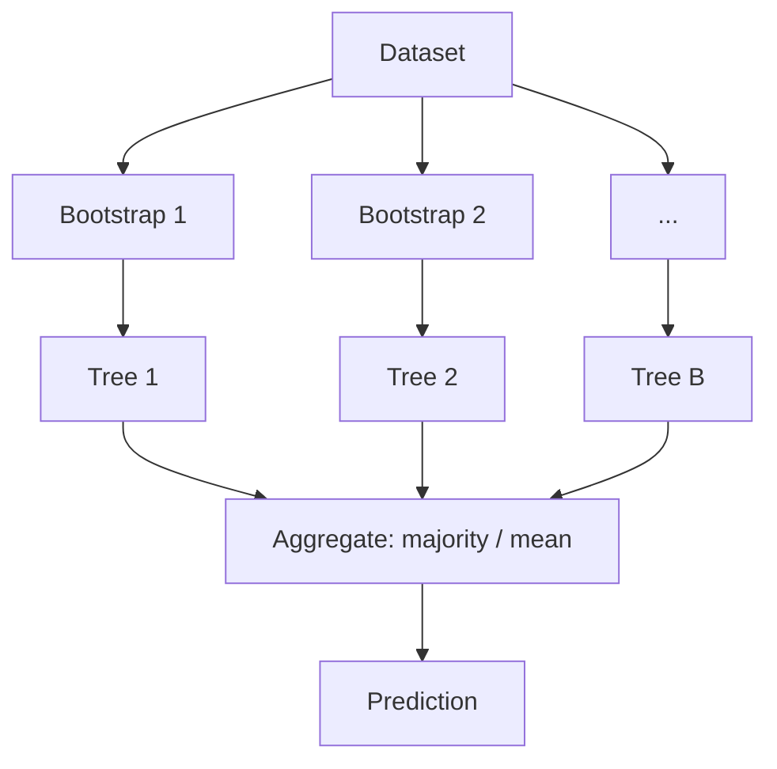

# 1.9 — Random Forests & Bagging

## 1. Intuition first

A single decision tree overfits. Train many trees on **random subsets of rows and columns**, average their predictions → variance drops dramatically without adding bias. That is a Random Forest.

## 2. Why the topic exists

Simple, strong, hard-to-break tabular model. Rarely the best, almost always in the top-3, and requires almost no tuning.

## 3. What problem it solves

Reduces variance of decision trees, provides feature-importance and out-of-bag estimates, no scaling needed, works with mixed features.

## 4. Mathematics

**Bootstrap aggregating (bagging):** for $B$ trees, draw a bootstrap sample of $n$ rows *with replacement*, train tree $T_b$, predict:

$$
\hat y = \frac{1}{B}\sum_{b=1}^B T_b(\mathbf{x}) \quad (\text{regression})
$$

$$
\hat y = \text{mode}\{T_b(\mathbf{x})\} \quad (\text{classification})
$$

**Random subspace / feature bagging:** at each split, sample $m = \sqrt{d}$ (classification) or $d/3$ (regression) features to consider.

Variance reduction (correlated trees):

$$
\text{Var}(\bar T) = \rho \sigma^2 + \tfrac{1 - \rho}{B}\sigma^2
$$

$\rho$ = average correlation between trees. Feature bagging decorrelates → smaller $\rho$ → more variance reduction.

## 5. Every formula explained

- Averaging predictions of $B$ i.i.d. estimators with variance $\sigma^2$ has variance $\sigma^2/B$. If they are correlated with $\rho$, floor is $\rho\sigma^2$ — hence the value of decorrelation.

## 6. Variables

| Symbol | Meaning |
|--------|---------|
| $B$ | number of trees |
| $m$ | features considered per split |
| $\rho$ | correlation between trees |

## 7. Algorithm

1. For $b = 1..B$:
   1. Draw bootstrap sample $D_b$ (n rows with replacement, ~63% unique).
   2. Grow tree on $D_b$: at each split, choose from a random subset of $m$ features.
   3. Grow deep (little / no pruning).
2. Aggregate predictions.

Out-of-bag (OOB) samples (the ~37% not chosen) act as a free validation set.

## 8. Simple example

100 trees on the Iris dataset — each tree slightly different due to bagging. Aggregate → smoother decision boundary than a single tree, higher accuracy.

## 9. Real-world example

- Kinect body-part classification used random forests to segment depth images in real time.
- Feature-importance analysis at Netflix / Airbnb before more complex models.

## 10. Diagram



## 11. Implementation from scratch

```python
import numpy as np
from collections import Counter
from copy import deepcopy
# reuse DecisionTree from 08-decision-trees.md

class RandomForest:
    def __init__(self, n_estimators=100, max_depth=None, max_features="sqrt", seed=0):
        self.n = n_estimators; self.max_depth = max_depth
        self.max_features = max_features; self.seed = seed

    def fit(self, X, y):
        rng = np.random.default_rng(self.seed)
        n, d = X.shape
        self.m = int(np.sqrt(d)) if self.max_features == "sqrt" else d
        self.trees = []
        for _ in range(self.n):
            idx = rng.integers(0, n, n)
            feat_idx = rng.choice(d, self.m, replace=False)
            t = DecisionTree(max_depth=self.max_depth or 20)
            t.fit(X[idx][:, feat_idx], y[idx])
            self.trees.append((t, feat_idx))
        return self

    def predict(self, X):
        votes = np.array([t.predict(X[:, f]) for t, f in self.trees])
        return np.array([Counter(v).most_common(1)[0][0] for v in votes.T])
```

## 12. Implementation using libraries

```python
from sklearn.ensemble import RandomForestClassifier, RandomForestRegressor
m = RandomForestClassifier(
    n_estimators=500, max_depth=None, max_features="sqrt",
    n_jobs=-1, oob_score=True, random_state=42)
m.fit(X_train, y_train)
print(m.oob_score_, m.feature_importances_)
```

## 13. Time complexity

Training: O(B × n log n × d). Embarrassingly parallel across trees.
Prediction: O(B × depth).

## 14. Space complexity

O(B × #nodes-per-tree).

## 15. Advantages

- Strong out-of-the-box performance.
- OOB error acts as free CV.
- Feature importances.
- Parallelizable.

## 16. Disadvantages

- Large models (500 trees × depth 20 nodes).
- Slower inference than a single tree.
- Beaten by gradient boosting on most tabular problems.

## 17. Interview questions

1. Bagging vs Boosting — differences.
2. Why do we sample features at each split?
3. What is the OOB estimate?
4. Bias-variance behavior as $B$ grows?
5. Time complexity of training?
6. Why is Random Forest less interpretable than a single tree?
7. Explain feature importance (Mean Decrease Impurity vs Permutation).
8. Why is feature importance biased toward high-cardinality features?
9. Does adding more trees ever hurt?
10. When would you prefer Random Forest over XGBoost?

## 18. Common mistakes

- Trusting default MDI feature importance.
- Using very shallow trees (defeats the purpose).
- Not using `n_jobs=-1`.
- Reporting OOB when data is time-series (violates independence).

## 19. Optimization techniques

- Permutation importance (`sklearn.inspection.permutation_importance`).
- Extremely Randomized Trees (ExtraTrees) — random thresholds.
- Isolation Forest for anomaly detection.

## 20. Coding exercises

1. Add OOB scoring to the from-scratch implementation.
2. Compute permutation importance.
3. Compare RF vs ExtraTrees on Adult income dataset.
4. Show variance reduction curve as $B$ grows.

## 21. Mini project

Predict Titanic survival with RF + permutation importance analysis.

## 22. Medium project

Kaggle "Home Credit Default Risk" with RF baseline; compute per-feature permutation importance and interpret.

## 23. Advanced project

Implement Isolation Forest for fraud anomaly detection; benchmark against sklearn's implementation.

## 24. Where it is used in industry

Tabular problems, quick baselines, anomaly detection (Isolation Forest), feature importance analysis.

## 25. How companies use it

- Fraud (Isolation Forest).
- Customer churn baselines.
- Feature selection before deep tabular models.

## 26. When NOT to use it

- Need best-possible accuracy → gradient boosting.
- Very high-dim sparse text → LR / transformers.
- Perceptual data → DNNs.
