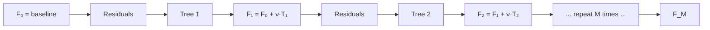

# 1.10 — Gradient Boosting (XGBoost, LightGBM, CatBoost)

## 1. Intuition first

Train a weak learner (shallow tree). Look at where it got things wrong. Train a **second** tree that predicts the **residuals** (errors) of the first. Add it in. Repeat.

That is boosting. Gradient boosting generalizes: each new tree fits the negative gradient of the loss w.r.t. current predictions. XGBoost/LightGBM/CatBoost are ultra-optimized implementations that dominate tabular ML.

## 2. Why the topic exists

Best out-of-the-box tabular performance. Winning entry in the majority of Kaggle tabular competitions for the last decade.

## 3. What problem it solves

State-of-the-art regression/classification on structured / tabular data with mixed types, missing values, and complex interactions.

## 4. Mathematics

### 4.1 Generic gradient boosting

Model = additive: $F_M(\mathbf{x}) = \sum_{m=1}^M \nu f_m(\mathbf{x})$, with learning rate $\nu \in (0, 1]$.

At iteration $m$:

1. Compute pseudo-residuals

$$
r_i^{(m)} = -\left.\frac{\partial \ell(y_i, F(\mathbf{x}_i))}{\partial F(\mathbf{x}_i)}\right|_{F=F_{m-1}}
$$

2. Fit weak learner $f_m$ (usually a shallow tree) to $\{(\mathbf{x}_i, r_i^{(m)})\}$.

3. Update $F_m = F_{m-1} + \nu f_m$.

For MSE loss: $r_i = y_i - F(\mathbf{x}_i)$ → literally fitting residuals.
For BCE: $r_i = y_i - \sigma(F(\mathbf{x}_i))$.

### 4.2 XGBoost's second-order objective

XGBoost uses a 2nd-order Taylor expansion. Regularized objective:

$$
\mathcal{L}^{(t)} = \sum_i \big[g_i f_t(\mathbf{x}_i) + \tfrac{1}{2} h_i f_t(\mathbf{x}_i)^2\big] + \Omega(f_t)
$$

where $g_i, h_i$ are first and second derivatives of loss w.r.t. $F(\mathbf{x}_i)$; $\Omega(f) = \gamma T + \tfrac{1}{2}\lambda \|w\|^2$ regularizes tree size $T$ and leaf weights $w$.

Optimal leaf weight:

$$
w_j^* = -\frac{\sum_{i \in I_j} g_i}{\sum_{i \in I_j} h_i + \lambda}
$$

Split gain:

$$
\text{Gain} = \tfrac{1}{2}\Big[\frac{G_L^2}{H_L+\lambda} + \frac{G_R^2}{H_R+\lambda} - \frac{G^2}{H+\lambda}\Big] - \gamma
$$

## 5. Every formula explained

- $g_i, h_i$: gradient/Hessian per sample → tells the algorithm how much each sample "wants" to move.
- $\lambda$: L2 shrinkage on leaf weights.
- $\gamma$: minimum gain required to make a split — pruning knob.
- Learning rate $\nu$ (also called `eta`, `learning_rate`): shrinks each tree's contribution → more trees needed, better generalization.

## 6. Variables

| Symbol | Meaning |
|--------|---------|
| $F_m$ | ensemble prediction after $m$ trees |
| $f_m$ | $m$-th tree |
| $g_i, h_i$ | 1st, 2nd derivative of loss w.r.t. $F$ |
| $\nu$ | learning rate |
| $\lambda, \gamma$ | regularization terms |
| $T$ | number of leaves |

## 7. Algorithm — GBM (Friedman)

1. Initialize $F_0 = \arg\min_c \sum_i \ell(y_i, c)$ (constant prediction).
2. For $m = 1..M$:
   1. Compute residuals $r_i^{(m)}$.
   2. Fit weak learner $f_m$ to residuals.
   3. Compute step size $\rho_m$ (line search).
   4. Update $F_m = F_{m-1} + \nu \rho_m f_m$.
3. Return $F_M$.

Modern implementations replace step 2.iii with the exact 2nd-order leaf weight formula (XGBoost).

## 8. Simple example

Predict continuous target with a stump-boosting. Tree 1 predicts mean. Tree 2 fits residuals. After 100 trees, predictions are very good.

## 9. Real-world example

- Kaggle: 80%+ of tabular winners use XGBoost or LightGBM.
- CTR / conversion prediction at ad platforms (e.g., Yandex CatBoost).
- Risk scoring at fintechs.

## 10. Diagram



## 11. Implementation from scratch — GBM for regression

```python
import numpy as np
# reuse DecisionTree (regression variant with MSE splits & mean-leaf)

class GBMRegressor:
    def __init__(self, n_estimators=100, max_depth=3, lr=0.1):
        self.n = n_estimators; self.max_depth = max_depth; self.lr = lr
    def fit(self, X, y):
        self.f0 = y.mean()
        F = np.full(len(y), self.f0)
        self.trees = []
        for _ in range(self.n):
            residuals = y - F
            t = DecisionTreeRegressor(max_depth=self.max_depth).fit(X, residuals)
            F = F + self.lr * t.predict(X)
            self.trees.append(t)
        return self
    def predict(self, X):
        return self.f0 + self.lr * sum(t.predict(X) for t in self.trees)
```

For BCE, replace residuals with $y - \sigma(F)$ and interpret $F$ as logit.

## 12. Implementation using libraries

```python
import xgboost as xgb
m = xgb.XGBClassifier(
    n_estimators=1000, max_depth=6, learning_rate=0.05,
    subsample=0.8, colsample_bytree=0.8,
    reg_lambda=1.0, gamma=0.0, tree_method="hist",
    eval_metric="auc", early_stopping_rounds=50)
m.fit(X_train, y_train, eval_set=[(X_val, y_val)], verbose=100)

import lightgbm as lgb
m = lgb.LGBMClassifier(
    n_estimators=2000, num_leaves=31, learning_rate=0.05,
    feature_fraction=0.8, bagging_fraction=0.8, bagging_freq=1,
    reg_lambda=1.0, min_child_samples=20)

import catboost as cb
m = cb.CatBoostClassifier(
    iterations=2000, depth=6, learning_rate=0.05,
    cat_features=cat_cols, eval_metric="AUC", verbose=200)
```

## 13. Time complexity

Training: O(M × n × d × splits). With histogram splits: O(M × n × #bins × d). LightGBM's leaf-wise growth speeds this up further.

## 14. Space complexity

O(#trees × #nodes) for model; O(n × #bins) for histograms during training.

## 15. Advantages

- State-of-the-art tabular accuracy.
- Handles mixed types, missing values, class imbalance (via `scale_pos_weight`).
- Fast in practice (LightGBM/XGBoost).
- Built-in early stopping.

## 16. Disadvantages

- Many hyperparameters.
- Slower to tune than RF.
- Sequential — harder to parallelize than bagging.
- Overfits with too many rounds and no early stopping.

## 17. Interview questions

1. Bagging vs Boosting.
2. Derive XGBoost's leaf-weight formula from the 2nd-order objective.
3. Difference between `learning_rate` and `n_estimators` — trade-off.
4. Why is early stopping essential?
5. Leaf-wise (LightGBM) vs level-wise (XGBoost) growth.
6. How does CatBoost handle categorical features?
7. How is XGBoost's regularization $\gamma$ different from $\lambda$?
8. Why do we shrink each tree's contribution?
9. Feature importance in GBM — how is it computed?
10. Explain the second-order Taylor derivation.

## 18. Common mistakes

- Not using early stopping → overfit.
- Tuning `n_estimators` manually instead of using early stopping.
- Ignoring `scale_pos_weight` / `class_weight` on imbalanced problems.
- Trusting default `max_depth` (often too deep for small data).

## 19. Optimization techniques

- Histogram-based splits.
- GPU training (`tree_method="gpu_hist"`).
- Bayesian hyperparameter optimization (Optuna).
- Feature quantization (bin count).
- Dart (dropout meets multiple additive trees).

## 20. Coding exercises

1. Extend the from-scratch GBM to classification with BCE loss.
2. Implement early stopping.
3. Compare XGBoost, LightGBM, CatBoost on the same dataset.
4. Use Optuna to tune LightGBM on a Kaggle dataset.

## 21. Mini project

Titanic with LightGBM + Optuna hyperparameter tuning; document top hyperparameters.

## 22. Medium project

Reproduce a Kaggle "IEEE-CIS Fraud Detection" baseline with XGBoost; achieve within 5% of top public score.

## 23. Advanced project

Build a stacked ensemble: XGBoost + LightGBM + CatBoost + linear meta-learner; nested CV; produce SHAP explanations and a Streamlit dashboard.

## 24. Where it is used in industry

Fraud, credit, CTR, churn, insurance pricing, marketing propensity, forecasting.

## 25. How companies use it

- **Yandex** built CatBoost for its ranking engine.
- **Microsoft** built LightGBM for click prediction.
- **Uber, Airbnb, DoorDash** rely on GBMs for ETA, pricing, and matching.

## 26. When NOT to use it

- Perceptual data (images/text/audio) — DNNs win.
- Very small data (< 500 rows) — simpler models often better.
- Extremely high-dim sparse — LR or FFM.
