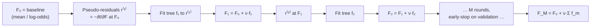
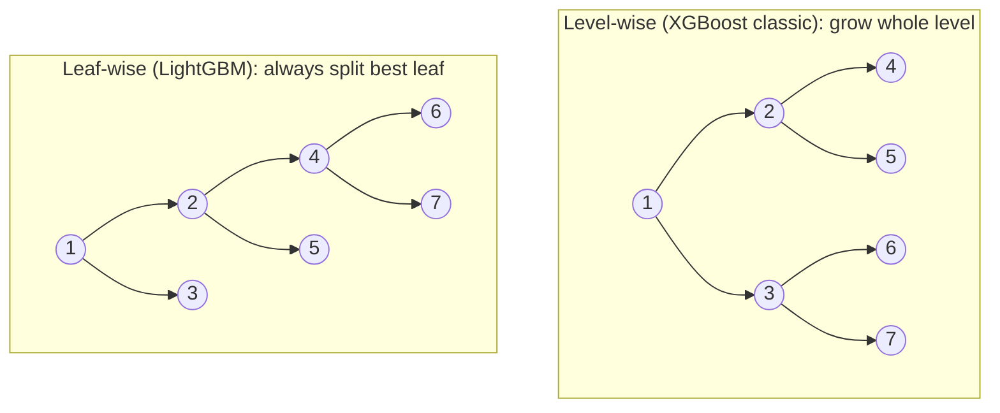
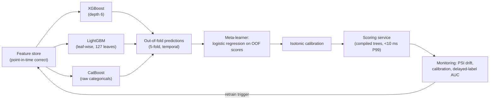

# 1.10 — Gradient Boosting (XGBoost, LightGBM, CatBoost)

## 1. Overview

**What is it?** Gradient boosting builds a strong model as a *sum of many weak ones* — typically shallow [decision trees](08-decision-trees.md) — added one at a time, where each new tree is trained to correct the errors of everything built so far. Formally, each tree fits the **negative gradient of the loss** with respect to the current predictions: boosting is *gradient descent in function space*.

**Why does it exist?** [Random Forests](09-random-forests.md) attack variance by averaging independent trees, but they cannot reduce bias: no tree in the forest targets what the ensemble still gets wrong. Boosting closes that gap by making tree $m$ explicitly responsible for the residual mistakes of trees $1$ through $m-1$. Friedman's Gradient Boosting Machine (2001) unified this for any differentiable loss; XGBoost (2016), LightGBM (2017), and CatBoost (2017) turned it into the fastest, most accurate tabular learners available.

**What problem does it solve?** State-of-the-art regression, classification, and ranking on structured/tabular data — mixed feature types, missing values, complex interactions — at industrial scale.

**Where is it used?** Nearly everywhere tabular prediction pays money: fraud scoring, credit risk, click-through-rate prediction, search ranking, insurance pricing, demand forecasting — and in the majority of winning Kaggle tabular solutions of the past decade. If you learn one classical-ML tool to production depth, make it this one.

## 2. Learning Objectives

After this chapter you will be able to:

- Explain boosting as sequential residual fitting, and precisely how it differs from bagging.
- Derive the pseudo-residual $r_i = -\partial \ell / \partial F(\mathbf{x}_i)$ and show it reduces to plain residuals for squared loss and to $y_i - \sigma(F_i)$ for logistic loss.
- Interpret boosting as gradient descent in function space, with the learning rate $\nu$ as shrinkage.
- Derive XGBoost's second-order Taylor objective and the closed-form optimal leaf weight $w_j^* = -G_j/(H_j + \lambda)$, step by step.
- Derive the split-gain formula and explain the roles of $\lambda$ and $\gamma$.
- Implement a working GBM (regression and binary classification) from scratch in NumPy.
- Use early stopping correctly, and explain the learning-rate/number-of-trees trade-off.
- Contrast XGBoost, LightGBM (histograms, leaf-wise growth, GOSS), and CatBoost (ordered target statistics) and choose between them.
- Tune the hyperparameters that matter, in the right order, with a principled search.
- Diagnose overfitting, leakage, and imbalance issues in boosted models in production.

## 3. Prerequisites

| Chapter | Why you need it |
|---|---|
| [Decision Trees](08-decision-trees.md) | The weak learner; you must know CART splitting and leaf values cold. |
| [Gradient Descent](03-gradient-descent.md) | Boosting *is* gradient descent, just in function space instead of parameter space. |
| [Calculus](../phase-0-prerequisites/03-calculus.md) | First and second derivatives, Taylor expansion — the heart of the XGBoost derivation. |
| [Logistic Regression](04-logistic-regression.md) | Log-loss, the sigmoid, and logits reappear as boosting's classification machinery. |
| [Regularization](05-regularization.md) | $\lambda$ (L2) and $\gamma$ penalties transplant directly into tree objectives. |
| [Random Forests](09-random-forests.md) | The variance-reduction counterpoint; subsampling ideas carry over as stochastic boosting. |

## 4. Intuition

Imagine a golfer playing toward a hole 400 meters away. The first swing (a deliberately modest one) covers most of the distance but lands left of the green. The second swing doesn't restart from the tee — it plays *from where the ball lies*, correcting the remaining error. Each subsequent stroke is smaller, fixing what's left. After a dozen strokes the ball is in the hole. Boosting is exactly this: the first tree makes a coarse prediction, each following tree plays "from where the ensemble lies," predicting the leftover error, and the final prediction is the *sum of all strokes*.

Why deliberately modest swings? A golfer who swings at full power every time overshoots and oscillates. The **learning rate** $\nu$ scales down every tree's contribution to, say, 5–10% — many small careful corrections generalize far better than a few violent ones. This is *shrinkage*, and it's the single most important regularizer in boosting.

An everyday story: a new analyst drafts a sales forecast (tree 1). Their manager reviews it and writes corrections: "you're consistently 20% low on the Southwest region" (tree 2 — trained on the errors). A director reviews *the corrected version* and adds finer notes: "December in retail is still underestimated" (tree 3). Each reviewer only needs to model *what's still wrong*, not the whole problem — which is why each can be simple (a shallow tree), and why order matters: reviewer 3's notes make no sense without reviewers 1 and 2 applied first. Contrast with a [Random Forest](09-random-forests.md), which is a committee of analysts working *independently* and averaging — nobody there reads anyone else's draft.

> [!NOTE]
> Bagging = independent deep trees, averaged, to cut **variance**. Boosting = sequential shallow trees, summed, to cut **bias** (with shrinkage/subsampling managing variance). This one sentence answers a startling fraction of interview questions.

## 5. Real-world Motivation

- **Kaggle dominance.** From roughly 2015 onward, the large majority of winning solutions on tabular competitions used XGBoost or LightGBM — the XGBoost paper itself documented that 17 of 29 Kaggle winning solutions in 2015 used it. A decade later, gradient-boosted trees still routinely beat deep learning on medium-sized tabular data (Grinsztajn et al., 2022).
- **Microsoft** built **LightGBM** to make boosting fast enough for its own large-scale workloads (e.g., click prediction in Bing-scale advertising); it's now the default high-performance GBM across the industry.
- **Yandex** built **CatBoost** for its search-ranking and recommendation systems, where high-cardinality categorical features (queries, URLs, user IDs) dominate — the "ordered target statistics" trick exists because of those production needs.
- **Fintech and banking.** Fraud-scoring and credit-risk models at payment processors and lenders are overwhelmingly gradient-boosted trees: best accuracy on tabular signals, millisecond scoring, and SHAP-based explanations for compliance.
- **Uber, Airbnb, DoorDash, Booking.com** have all publicly described GBM models in ETA prediction, pricing, ranking, and fraud pipelines — the pattern "feature store + boosted trees + calibration" is arguably the most-deployed ML architecture in industry.
- **CERN and the sciences.** Boosted decision trees were a standard classifier in high-energy-physics analyses (including Higgs-search-era pipelines) long before deep learning arrived there.

## 6. Mathematical Foundations

### 6.1 The additive model

The ensemble after $M$ rounds is

$$
F_M(\mathbf{x}) = F_0(\mathbf{x}) + \sum_{m=1}^{M} \nu\, f_m(\mathbf{x})
$$

where $f_m$ is the $m$-th weak learner (a shallow tree), $\nu \in (0, 1]$ is the **learning rate** (shrinkage), and $F_0$ is a constant baseline — the value minimizing the loss with no features at all:

$$
F_0 = \arg\min_{c} \sum_{i=1}^{n} \ell(y_i, c)
$$

For squared loss, $F_0 = \bar y$ (the mean); for log-loss, $F_0 = \log\frac{p}{1-p}$ (the base-rate log-odds).

### 6.2 Gradient boosting = gradient descent in function space

In [gradient descent](03-gradient-descent.md) we update parameters: $\theta \leftarrow \theta - \eta \nabla_\theta L$. Boosting updates the *function itself*. Treat the prediction at each training point, $F(\mathbf{x}_i)$, as a free parameter and differentiate the total loss $\sum_i \ell(y_i, F(\mathbf{x}_i))$ with respect to it. The steepest-descent direction at point $i$ is the **pseudo-residual**:

$$
r_i^{(m)} = -\left.\frac{\partial\, \ell\big(y_i, F(\mathbf{x}_i)\big)}{\partial F(\mathbf{x}_i)}\right|_{F = F_{m-1}}
$$

We can't update each $F(\mathbf{x}_i)$ independently — the model must generalize to unseen $\mathbf{x}$ — so we fit a tree $f_m$ to the pseudo-residuals $\{(\mathbf{x}_i, r_i^{(m)})\}$: the tree is the best *learnable approximation* of the gradient step. Then:

$$
F_m(\mathbf{x}) = F_{m-1}(\mathbf{x}) + \nu\, f_m(\mathbf{x})
$$

**Worked derivatives for the two workhorse losses:**

*Squared loss* $\ell = \frac{1}{2}(y_i - F_i)^2$ (writing $F_i \equiv F(\mathbf{x}_i)$):

$$
r_i = -\frac{\partial \ell}{\partial F_i} = -\big({-(y_i - F_i)}\big) = y_i - F_i
$$

— the pseudo-residual is the literal residual: "fit a tree to the errors."

*Logistic loss* for $y_i \in \{0, 1\}$, with $F_i$ a logit and $p_i = \sigma(F_i) = \frac{1}{1 + e^{-F_i}}$: the loss is $\ell = -[y_i \log p_i + (1 - y_i)\log(1 - p_i)]$. Using $\frac{\partial p_i}{\partial F_i} = p_i(1 - p_i)$ (from [Logistic Regression](04-logistic-regression.md)):

$$
\frac{\partial \ell}{\partial F_i} = -\Big[\frac{y_i}{p_i} - \frac{1 - y_i}{1 - p_i}\Big] p_i(1-p_i) = p_i - y_i
\quad\Rightarrow\quad r_i = y_i - \sigma(F_i)
$$

— again "actual minus predicted," now on the probability scale while the model accumulates on the logit scale. Any differentiable loss works: Huber, quantile (pinball), Poisson, pairwise ranking losses — this generality is Friedman's key contribution.

### 6.3 XGBoost's second-order objective — full derivation

XGBoost improves on first-order GBM in two ways: it uses a **second-order Taylor expansion** of the loss (curvature-aware steps, like Newton's method vs. plain gradient descent) and it builds **regularization into the tree-construction objective itself**.

At round $t$ we seek the tree $f_t$ minimizing

$$
\mathcal{L}^{(t)} = \sum_{i=1}^{n} \ell\big(y_i,\ F_{t-1}(\mathbf{x}_i) + f_t(\mathbf{x}_i)\big) + \Omega(f_t)
$$

**Step 1 — Taylor-expand** $\ell$ around the current prediction $F_{t-1}(\mathbf{x}_i)$, treating $f_t(\mathbf{x}_i)$ as the small increment. Define per-sample gradient and Hessian:

$$
g_i = \frac{\partial\, \ell(y_i, F)}{\partial F}\Big|_{F_{t-1}(\mathbf{x}_i)}, \qquad
h_i = \frac{\partial^2 \ell(y_i, F)}{\partial F^2}\Big|_{F_{t-1}(\mathbf{x}_i)}
$$

(For log-loss: $g_i = p_i - y_i$, $h_i = p_i(1 - p_i)$. For squared loss: $g_i = F_i - y_i$, $h_i = 1$.) Then, dropping the constant $\ell(y_i, F_{t-1})$ terms:

$$
\mathcal{L}^{(t)} \approx \sum_{i=1}^{n} \Big[ g_i f_t(\mathbf{x}_i) + \tfrac{1}{2} h_i f_t(\mathbf{x}_i)^2 \Big] + \Omega(f_t)
$$

**Step 2 — Parameterize the tree.** A tree with $T$ leaves and leaf weights $\mathbf{w} = (w_1, \dots, w_T)$ predicts $f_t(\mathbf{x}) = w_{q(\mathbf{x})}$, where $q(\mathbf{x})$ maps a sample to its leaf. XGBoost's regularizer penalizes both leaf count and weight magnitude:

$$
\Omega(f_t) = \gamma T + \tfrac{1}{2}\lambda \sum_{j=1}^{T} w_j^2
$$

**Step 3 — Group samples by leaf.** Let $I_j = \{i : q(\mathbf{x}_i) = j\}$ be the samples landing in leaf $j$, and define the leaf aggregates $G_j = \sum_{i \in I_j} g_i$ and $H_j = \sum_{i \in I_j} h_i$. The objective becomes a sum of *independent quadratics, one per leaf*:

$$
\mathcal{L}^{(t)} = \sum_{j=1}^{T} \Big[ G_j w_j + \tfrac{1}{2}(H_j + \lambda) w_j^2 \Big] + \gamma T
$$

**Step 4 — Optimal leaf weight.** Each quadratic $G_j w + \frac{1}{2}(H_j+\lambda)w^2$ is minimized where its derivative vanishes: $G_j + (H_j + \lambda) w_j = 0$, giving

$$
\boxed{\ w_j^* = -\frac{G_j}{H_j + \lambda} = -\frac{\sum_{i \in I_j} g_i}{\sum_{i \in I_j} h_i + \lambda}\ }
$$

Interpretation: a **Newton step per leaf** — total gradient over total curvature, with $\lambda$ damping leaves that have little data or low curvature. Substituting $w_j^*$ back gives the best achievable objective for a fixed tree structure:

$$
\mathcal{L}^{(t)}(q) = -\frac{1}{2}\sum_{j=1}^{T} \frac{G_j^2}{H_j + \lambda} + \gamma T
$$

**Step 5 — Split gain.** Splitting a node with aggregates $(G, H)$ into left/right children $(G_L, H_L)$, $(G_R, H_R)$ (where $G = G_L + G_R$, $H = H_L + H_R$) improves the objective by

$$
\boxed{\ \text{Gain} = \frac{1}{2}\Big[\frac{G_L^2}{H_L + \lambda} + \frac{G_R^2}{H_R + \lambda} - \frac{G^2}{H + \lambda}\Big] - \gamma\ }
$$

This *replaces* Gini/entropy from [Decision Trees](08-decision-trees.md): boosted trees split to reduce the (regularized, second-order) *loss*, not label impurity. The $-\gamma$ term is built-in pruning — a split must buy at least $\gamma$ of gain to justify existing.

### 6.4 Stochastic boosting

Friedman (2002) showed that fitting each tree on a random row subsample (`subsample` ≈ 0.5–0.9) reduces overfitting and speeds training — importing bagging's variance reduction into boosting. Column subsampling (`colsample_bytree`) does the same with features, borrowed from [Random Forests](09-random-forests.md).

### 6.5 Symbol table

| Symbol | Meaning |
|---|---|
| $F_m(\mathbf{x})$ | ensemble prediction after $m$ trees (a logit, for classification) |
| $f_m$ | the $m$-th weak learner (shallow tree) |
| $F_0$ | constant baseline prediction |
| $\nu$ | learning rate / shrinkage (`learning_rate`, `eta`) |
| $M$ | number of boosting rounds (`n_estimators`) |
| $\ell(y, F)$ | per-sample differentiable loss |
| $r_i^{(m)}$ | pseudo-residual: negative gradient at sample $i$, round $m$ |
| $g_i, h_i$ | first and second derivatives of $\ell$ w.r.t. $F(\mathbf{x}_i)$ |
| $T, w_j, q(\cdot)$ | leaf count, leaf-$j$ weight, sample→leaf map |
| $I_j, G_j, H_j$ | samples in leaf $j$; their summed gradients and Hessians |
| $\lambda$ | L2 penalty on leaf weights (`reg_lambda`) |
| $\gamma$ | minimum gain to split / per-leaf penalty (`gamma`, `min_split_gain`) |
| $\sigma(\cdot)$ | sigmoid, mapping logits to probabilities |

## 7. Visual Explanation

The boosting loop — each tree feeds on the previous ensemble's errors:



Residual shrinking on a 1-D regression, stroke by stroke:

```
 y                    y − F₁                  y − F₂
 │    ●●                │   ●                    │
 │  ●●  ●●              │ ●   ● ●                │ ●  ●   ●
 │ ●      ●   F₀=ȳ ──── │●──●───●── 0            │──●──●●──● 0
 │●        ●            │  ●    ●                │   ●  ●
 └───────── x           └───────── x             └───────── x
 tree 1 fits this       tree 2 fits this         residuals → noise:
 (large structure)      (finer structure)        stop adding trees
```

Level-wise vs. leaf-wise tree growth (XGBoost's classic mode vs. LightGBM):



Leaf-wise reaches lower loss with the same leaf budget (it spends splits where gain is highest) but grows deep, unbalanced trees — cap `num_leaves` and `min_child_samples` to control it.

## 8. Algorithm

**Gradient Boosting Machine (Friedman), with XGBoost's leaf weights:**

1. Initialize with the best constant: $F_0 = \arg\min_c \sum_i \ell(y_i, c)$.
2. **For** $m = 1, \dots, M$:
   1. Compute per-sample gradients $g_i$ (and, for second-order methods, Hessians $h_i$) at the current predictions $F_{m-1}(\mathbf{x}_i)$.
   2. (Stochastic variant) draw a row subsample and column subsample.
   3. Grow a shallow tree greedily using the split gain $\frac{1}{2}\big[\frac{G_L^2}{H_L+\lambda} + \frac{G_R^2}{H_R+\lambda} - \frac{G^2}{H+\lambda}\big] - \gamma$; stop at `max_depth` / `num_leaves` / `min_child_weight` limits.
   4. Set each leaf's value to $w_j^* = -G_j / (H_j + \lambda)$.
   5. Update: $F_m = F_{m-1} + \nu f_m$.
   6. Evaluate on a validation set; if no improvement for `early_stopping_rounds`, **stop** and keep the best iteration.
3. Output $F_M$; for classification, predict $p = \sigma(F_M(\mathbf{x}))$.

```text
PSEUDOCODE — second-order gradient boosting
────────────────────────────────────────────
F = init_constant(y)                       # mean or log-odds
for m in 1..M:
    g = dℓ/dF(y, F);  h = d²ℓ/dF²(y, F)   # per-sample, O(n)
    tree = grow_tree(X, g, h):
        split criterion: Gain(G_L,H_L,G_R,H_R,λ,γ)
        leaf value:      w* = −ΣG_leaf / (ΣH_leaf + λ)
    F += ν * tree.predict(X)               # shrinkage
    if val_loss hasn't improved in k rounds: break (keep best m)
predict(x) = F0 + ν * Σ_m tree_m(x)        # sigmoid(…) for classification
```

## 9. Worked Example

### Tiny example, fully by hand

Regression with squared loss, five samples, depth-1 trees (stumps), $\nu = 0.5$:

| $i$ | $x$ | $y$ |
|---|---|---|
| 1 | 1 | 10 |
| 2 | 2 | 12 |
| 3 | 3 | 20 |
| 4 | 4 | 22 |
| 5 | 5 | 30 |

**Round 0.** $F_0 = \bar y = (10+12+20+22+30)/5 = 18.8$ for every sample.

**Round 1.** Residuals $r_i = y_i - 18.8$: $(-8.8, -6.8, 1.2, 3.2, 11.2)$. Best stump on the residuals splits at $x \le 2.5$ (verified by checking all midpoints): left leaf mean $= (-8.8 - 6.8)/2 = -7.8$; right leaf mean $= (1.2 + 3.2 + 11.2)/3 = 5.2$. Update with shrinkage:

- $F_1(x \le 2.5) = 18.8 + 0.5(-7.8) = 14.9$
- $F_1(x > 2.5) = 18.8 + 0.5(5.2) = 21.4$

**Round 2.** New residuals $y_i - F_1$: $(-4.9, -2.9, -1.4, 0.6, 8.6)$. Best stump now splits at $x \le 4.5$: left mean $= (-4.9 - 2.9 - 1.4 + 0.6)/4 = -2.15$; right mean $= 8.6$. Update:

- $F_2(x \le 2.5) = 14.9 + 0.5(-2.15) = 13.83$
- $F_2(2.5 < x \le 4.5) = 21.4 + 0.5(-2.15) = 20.33$
- $F_2(x > 4.5) = 21.4 + 0.5(8.6) = 25.7$

Training MSE fell from **51.0** ($F_0$) → **17.9** ($F_1$) → **9.3** ($F_2$), and each round's tree captured structure the previous ensemble missed (first the low-vs-high split, then the $x=5$ outlier). With 100 more stumps the fit becomes near-perfect — which is exactly when a validation set must tell us to stop.

**One XGBoost leaf weight, by hand.** Same round-1 left leaf $\{1, 2\}$, squared loss ⇒ $g_i = F_i - y_i = (8.8, 6.8)$, $h_i = 1$. With $\lambda = 1$:

$$
w^* = -\frac{G}{H + \lambda} = -\frac{8.8 + 6.8}{2 + 1} = -\frac{15.6}{3} = -5.2
$$

versus the unregularized mean $-7.8$: the $\lambda$ shrank a two-sample leaf's step by a third — regularization working exactly as designed.

### Realistic example

On the Kaggle "IEEE-CIS Fraud Detection" dataset (~590k transactions, ~430 features, heavily imbalanced), a LightGBM with `num_leaves=256`, `learning_rate=0.05`, early stopping on a time-based split reaches ~0.94 validation AUC in minutes on a laptop — a result deep tabular models struggle to match without far more engineering.

## 10. Python from Scratch

A GBM supporting both regression (squared loss) and binary classification (log-loss), using scikit-learn's tree only as the weak learner:

```python
import numpy as np
from sklearn.tree import DecisionTreeRegressor   # weak learner only

def sigmoid(z):
    return 1.0 / (1.0 + np.exp(-z))

class GBM:
    """Gradient boosting from scratch. loss ∈ {'squared', 'logistic'}."""

    def __init__(self, n_estimators=100, max_depth=3, lr=0.1,
                 loss="squared", subsample=1.0, seed=0):
        self.M, self.max_depth, self.lr = n_estimators, max_depth, lr
        self.loss, self.subsample, self.seed = loss, subsample, seed

    def _init_F0(self, y):
        if self.loss == "squared":
            return y.mean()                       # argmin_c Σ(y−c)²
        p = np.clip(y.mean(), 1e-6, 1 - 1e-6)     # base rate
        return np.log(p / (1 - p))                # argmin_c Σ logloss = log-odds

    def _neg_gradient(self, y, F):
        if self.loss == "squared":
            return y - F                          # r = y − F  (plain residual)
        return y - sigmoid(F)                     # r = y − σ(F): prob-scale error

    def fit(self, X, y, X_val=None, y_val=None, patience=None):
        X, y = np.asarray(X, float), np.asarray(y, float)
        rng = np.random.default_rng(self.seed)
        self.F0 = self._init_F0(y)
        F = np.full(len(y), self.F0)              # current train predictions
        self.trees, best, since_best = [], np.inf, 0

        for m in range(self.M):
            r = self._neg_gradient(y, F)          # pseudo-residuals, shape (n,)
            # Stochastic boosting: fit this tree on a row subsample
            idx = (rng.choice(len(y), int(self.subsample * len(y)), replace=False)
                   if self.subsample < 1.0 else np.arange(len(y)))
            tree = DecisionTreeRegressor(max_depth=self.max_depth)
            tree.fit(X[idx], r[idx])              # tree approximates −gradient
            F += self.lr * tree.predict(X)        # shrunken functional step
            self.trees.append(tree)

            # ---- early stopping on validation loss ----
            if X_val is not None:
                vl = self._val_loss(X_val, y_val)
                if vl < best - 1e-9:
                    best, since_best, self.best_iter = vl, 0, m + 1
                else:
                    since_best += 1
                    if patience and since_best >= patience:
                        self.trees = self.trees[: self.best_iter]  # keep best prefix
                        break
        return self

    def _raw(self, X):
        out = np.full(len(X), self.F0)
        for t in self.trees:                      # Σ ν·f_m(x): order irrelevant here
            out += self.lr * t.predict(np.asarray(X, float))
        return out

    def _val_loss(self, X, y):
        F = self._raw(X)
        if self.loss == "squared":
            return np.mean((y - F) ** 2)
        p = np.clip(sigmoid(F), 1e-12, 1 - 1e-12)
        return -np.mean(y * np.log(p) + (1 - y) * np.log(1 - p))

    def predict(self, X):
        F = self._raw(X)
        return F if self.loss == "squared" else (sigmoid(F) >= 0.5).astype(int)

    def predict_proba(self, X):
        return sigmoid(self._raw(X))              # classification only

# --- Verify against the hand-worked example --------------------------------
X = np.array([[1], [2], [3], [4], [5]], float)
y = np.array([10, 12, 20, 22, 30], float)
g = GBM(n_estimators=2, max_depth=1, lr=0.5).fit(X, y)
print(g.predict(X))       # Expected ≈ [13.83, 13.83, 20.33, 20.33, 25.7]
```

Block-by-block: `_init_F0` implements $F_0 = \arg\min_c \sum \ell(y_i, c)$; `_neg_gradient` is Section 6.2's derivation in two lines; the fit loop is literally "compute residuals → fit tree to residuals → take a shrunken step"; early stopping keeps the best *prefix* of trees (additive models can be truncated for free). Note that for logistic loss, the *tree* is still a regression tree — it fits real-valued gradients even though the task is classification.

**Complexity:** $M$ × (tree fit on $n \cdot \text{subsample}$ rows) — and inherently sequential across $m$, unlike a forest.

> [!WARNING]
> **Common bug:** forgetting that classification boosting accumulates **logits**, not probabilities. If you initialize $F_0 = \bar y$ (a probability) instead of $\log\frac{\bar y}{1-\bar y}$ (a logit), or apply the sigmoid before adding trees, the model still "sort of works" on balanced data and silently fails on imbalanced data — check that `predict_proba` on the training base rate matches the class prior at $M = 0$.

## 11. Library Implementation

The three production libraries share one mental model; the knobs differ in name:

```python
# ============ XGBoost: second-order, level-wise (or hist) ============
import xgboost as xgb
xgb_clf = xgb.XGBClassifier(
    n_estimators=2000,            # cap; early stopping picks the real M
    learning_rate=0.05,           # ν — pair small ν with large n_estimators
    max_depth=6,                  # level-wise depth cap
    subsample=0.8,                # row subsample per tree (stochastic boosting)
    colsample_bytree=0.8,         # feature subsample per tree
    reg_lambda=1.0,               # λ in the leaf-weight denominator
    gamma=0.0,                    # γ: min gain to split (built-in pruning)
    min_child_weight=1.0,         # min ΣH per leaf — Hessian-aware leaf size
    tree_method="hist",           # histogram splits: the fast path
    eval_metric="auc",
    early_stopping_rounds=100,    # stop when val AUC stalls
)
xgb_clf.fit(X_tr, y_tr, eval_set=[(X_val, y_val)], verbose=200)
print(xgb_clf.best_iteration)     # the M actually used

# ============ LightGBM: histograms + leaf-wise growth ============
import lightgbm as lgb
lgb_clf = lgb.LGBMClassifier(
    n_estimators=4000, learning_rate=0.05,
    num_leaves=63,                # PRIMARY complexity knob (leaf-wise!)
    min_child_samples=20,         # guards deep leaf-wise growth
    subsample=0.8, subsample_freq=1, colsample_bytree=0.8,
    reg_lambda=1.0,
)
lgb_clf.fit(X_tr, y_tr, eval_set=[(X_val, y_val)],
            eval_metric="auc",
            callbacks=[lgb.early_stopping(100), lgb.log_evaluation(200)])

# ============ CatBoost: native categoricals, ordered boosting ============
from catboost import CatBoostClassifier
cb_clf = CatBoostClassifier(
    iterations=4000, learning_rate=0.05, depth=6,
    l2_leaf_reg=3.0,
    cat_features=cat_cols,        # raw string columns — no encoding needed
    eval_metric="AUC",
    early_stopping_rounds=100, verbose=200,
)
cb_clf.fit(X_tr, y_tr, eval_set=(X_val, y_val))
```

What each library does differently:

| | XGBoost | LightGBM | CatBoost |
|---|---|---|---|
| Split search | exact or histogram | histogram (256 bins) | histogram, oblivious trees |
| Growth | level-wise (classic) | **leaf-wise** (best-first) | symmetric (same split per level) |
| Key extras | sparsity-aware default directions for missing values | **GOSS** (keep large-gradient rows, subsample the rest), **EFB** (bundle mutually-exclusive sparse features) | **ordered target statistics** for categoricals; ordered boosting vs. target leakage |
| Complexity knob | `max_depth` | `num_leaves` | `depth` |
| Sweet spot | mature ecosystem, exactness options | **speed** on large data | **high-cardinality categoricals**, strong defaults |

CatBoost's categorical trick deserves one paragraph: naive target encoding (replace category with mean target) leaks the row's own label into its feature. CatBoost computes each row's category statistic using **only rows that precede it in a random permutation** — an "ordered" estimate that behaves like out-of-fold encoding, computed online. That is why it wins on ID-heavy datasets without manual encoding work.

## 12. Code Walkthrough

Tracing the from-scratch `GBM` on the Section 9 data (`n_estimators=2, max_depth=1, lr=0.5`):

| Value | Shape | Meaning |
|---|---|---|
| `X`, `y` | (5, 1), (5,) | Toy regression data |
| `self.F0` | scalar | 18.8 — the target mean |
| `F` after init | (5,) | `[18.8, 18.8, 18.8, 18.8, 18.8]` |
| `r` round 1 | (5,) | `[-8.8, -6.8, 1.2, 3.2, 11.2]` — matches hand math |
| tree 1 | stump | split $x \le 2.5$; leaves $-7.8$ / $+5.2$ |
| `F` after round 1 | (5,) | `[14.9, 14.9, 21.4, 21.4, 21.4]` |
| `r` round 2 | (5,) | `[-4.9, -2.9, -1.4, 0.6, 8.6]` |
| tree 2 | stump | split $x \le 4.5$; leaves $-2.15$ / $+8.6$ |
| `predict(X)` | (5,) | `[13.83, 13.83, 20.33, 20.33, 25.7]` — matches Section 9 |

**Inputs:** features, targets, optional validation pair. **Intermediates:** the evolving prediction vector `F` (the ensemble's state), per-round residual vector, list of fitted stumps. **Output:** raw scores (regression) or probabilities via sigmoid. **Expected result:** exact agreement with the hand computation — three decimals of agreement is your unit test.

## 13. Complexity Analysis

| Operation | Complexity | Reasoning |
|---|---|---|
| Training, exact splits | $O(M \cdot d \cdot n \log n)$ | $M$ sequential rounds; each grows a tree with sorted split scans over (subsampled) rows and columns. |
| Training, histogram splits | $O(n d)$ binning once + $O(M \cdot d \cdot B_{\text{bins}} \cdot \text{nodes})$ | Pre-bin features to ≤256 `uint8` codes; per node, build gradient/Hessian histograms in $O(\text{rows in node})$ then scan $B_{\text{bins}}$ candidates. The histogram **subtraction trick** (child = parent − sibling) halves histogram work. |
| LightGBM GOSS | ~$O$(fraction of rows) per round | Keeps the top-$a$% largest-gradient rows, samples $b$% of the rest (reweighted) — most rows with near-zero gradient contribute nothing to splits anyway. |
| Prediction | $O(M \cdot \text{depth})$ per sample | Sum of $M$ shallow-tree lookups; 1000 trees × depth 6 = 6000 comparisons ≈ tens of microseconds. |
| Model space | $O(M \cdot 2^{\text{depth}})$ nodes | Shallow but numerous trees; typically smaller than a deep-tree forest. |
| Parallelism | within a round only | Rounds are sequential by construction (each needs the previous $F$); parallelism lives inside tree construction (feature-parallel histogram builds, GPU kernels). |

The strategic contrast with [Random Forests](09-random-forests.md): forests parallelize across trees but need deep trees; boosting is sequential across trees but each tree is tiny — in practice histogram-based boosting is usually *faster end to end* at equal accuracy.

## 14. Advantages

- **Best-in-class tabular accuracy.** On mid-sized structured data, tuned GBMs still top rigorous benchmarks against deep models (Grinsztajn et al., 2022) — and Kaggle leaderboards have said so for a decade.
- **Any differentiable loss.** Squared, logistic, Poisson (counts), quantile (prediction intervals), pairwise/LambdaRank (search ranking) — one framework, many tasks. Example: quantile-loss GBMs give delivery-time *ranges*, not just point ETAs.
- **Native missing-value handling.** XGBoost's learned default directions ([Decision Trees](08-decision-trees.md) §6.6) mean no imputation pipeline; missingness itself becomes signal — a real advantage on messy financial data.
- **Built-in regularization arsenal.** $\nu$, $\lambda$, $\gamma$, row/column subsampling, `min_child_weight`, early stopping — overfitting is controllable to a degree forests can't match.
- **Fast, cheap inference.** Thousands of shallow trees score in microseconds; fraud models sit comfortably inside 10 ms payment-authorization budgets.
- **Inherits tree superpowers:** no scaling, mixed types, automatic interactions; plus SHAP values (TreeSHAP is exact and fast for trees) for per-prediction explanations that compliance teams accept.

## 15. Disadvantages

- **Overfits without discipline.** Boosting *will* drive training loss toward zero, memorizing noise; unlike a forest, more rounds eventually hurt validation performance. Early stopping is not optional.
- **Hyperparameter surface is real.** Learning rate, tree complexity, subsampling, and regularizers interact; an untuned GBM can lose to an untuned forest. Budget tuning time (or use CatBoost's stronger defaults).
- **Sequential training.** No across-tree parallelism; wall-clock scaling relies on within-tree tricks and GPUs, and very large $M$ with tiny $\nu$ is slow.
- **Sensitive to label noise and outliers** (especially with squared loss — gradients grow with error size). Mislabeled rows attract ever-larger corrections. Use Huber/quantile losses or stronger subsampling on noisy data.
- **Still can't extrapolate.** Sums of piecewise-constant trees are piecewise-constant: trends beyond the training range flatten — dangerous in forecasting; consider hybrid linear+GBM designs.
- **Wrong tool for perceptual data.** Images, audio, and raw text have local structure that convolution/attention exploit and trees cannot; there, deep learning wins decisively ([Phase 2](../phase-2-deep-learning/01-perceptron-mlp.md)).

## 16. Common Mistakes

- **No early stopping** (or tuning `n_estimators` by hand). *Fix:* set `n_estimators` high, always pass an `eval_set` with `early_stopping_rounds≈50–200`, and read `best_iteration`.
- **Large learning rate to "save time."** $\nu = 0.3$ converges fast and generalizes worse. *Fix:* $\nu \in [0.01, 0.1]$ with a large round cap; the extra minutes buy real accuracy.
- **Random CV on temporal data.** Fraud/CTR/forecast datasets drift; random folds leak the future and inflate AUC by several points. *Fix:* time-based splits mirroring deployment.
- **Naive target encoding of categoricals.** Encoding with full-data target means leaks each row's own label — spectacular validation scores, production collapse. *Fix:* out-of-fold encoding or CatBoost's ordered statistics.
- **Ignoring imbalance.** At 0.2% fraud prevalence, log-loss optimization plus a 0.5 threshold yields a useless model. *Fix:* `scale_pos_weight ≈ n_neg/n_pos`, evaluate PR-AUC, and tune the operating threshold explicitly ([Evaluation Metrics](14-evaluation-metrics.md)).
- **Uncontrolled leaf-wise growth in LightGBM.** `num_leaves=1000` with default `min_child_samples` on 10k rows = memorization. *Fix:* keep `num_leaves` ≤ ~$2^{\text{depth-equivalent}}$ and raise `min_child_samples`; watch the train/val gap.
- **Trusting gain-based feature importance.** Same biases as MDI in forests. *Fix:* permutation importance or SHAP on held-out data.

## 17. Best Practices

- [ ] Baseline first (logistic regression or a forest) so you know what boosting's complexity is buying.
- [ ] Fixed recipe to start: `learning_rate=0.05`, `n_estimators=4000` + early stopping (100 rounds), `max_depth=6` / `num_leaves=63`, `subsample=0.8`, `colsample_bytree=0.8`, `reg_lambda=1`.
- [ ] Tune in order of impact: (1) tree complexity (`num_leaves`/`max_depth`, `min_child_weight`), (2) subsampling pair, (3) regularizers ($\lambda$, $\gamma$), (4) drop $\nu$ and re-early-stop for the final fit. Use Optuna/Bayesian search over grids.
- [ ] Validation must mirror deployment: temporal splits for drifting data, group splits for entity-linked rows.
- [ ] Log `best_iteration`, all params, data-snapshot hash, and the validation curve with the model artifact.
- [ ] Calibrate probabilities (isotonic/Platt on a held-out slice) before feeding thresholds or expected-value decisions downstream.
- [ ] Ship SHAP explanations alongside scores where decisions affect people (credit, fraud) — TreeSHAP is exact for GBMs and cheap.
- [ ] Monitor in production: feature drift, score distribution drift, and delayed-label metrics; schedule retrains before the model goes stale.

## 18. Optimization Techniques

- **Histogram training (`tree_method="hist"`, default in LightGBM).** Bin features to 256 levels once; splits scan bins, not rows — typically 5–20× faster than exact with negligible accuracy change. Lower `max_bin` (63) for another speed notch on huge data.
- **GPU training.** `device="cuda"` (XGBoost) / `device_type="gpu"` (LightGBM): order-of-magnitude speedups on wide million-row datasets; verify accuracy parity since histogram details differ slightly.
- **GOSS and EFB (LightGBM).** Gradient-based one-side sampling drops the mostly-converged small-gradient rows; exclusive feature bundling packs sparse one-hot columns together — together they are why LightGBM eats 100M-row datasets.
- **DART mode.** Dropout applied to trees (randomly mute some previous trees each round) — combats the pattern where late trees only polish early trees' mistakes; occasionally worth trying when plain boosting plateaus.
- **Monotonic constraints.** Enforce "price ↑ ⇒ default risk ↑" style business rules (`monotone_constraints`) — regularizes *and* satisfies model-risk reviewers.
- **Inference optimization.** Truncate to `best_iteration`; compile models with Treelite/ONNX Runtime or use `lleaves` for LightGBM (often 5–20× serving speedups); batch scoring vectorizes across rows.
- **Distributed training.** XGBoost on Spark/Dask/Ray for data that exceeds one machine — data-parallel histogram aggregation keeps the math exact.

## 19. Industry Applications

- **Payment fraud scoring (production example).** Card processors score every authorization in <10 ms with gradient-boosted trees over velocity, device, and merchant features; models retrain frequently against adversarial drift, with `scale_pos_weight` and PR-AUC as the operating metrics and SHAP for analyst review queues.
- **Search and ads ranking.** LambdaMART — gradient boosting with a ranking loss — has been the backbone of learning-to-rank systems (it won the Yahoo! Learning-to-Rank Challenge); **Microsoft** built LightGBM partly for such CTR/ranking workloads, and **Yandex** built CatBoost for its ranking stack.
- **Credit risk.** Lenders deploy GBMs as primary or challenger scorecards: best tabular accuracy plus TreeSHAP reason codes to satisfy explainability obligations.
- **ETA and pricing at marketplaces.** **Uber**, **DoorDash**, and **Booking.com** have described boosted-tree models for arrival-time prediction, dynamic pricing, and conversion modeling — quantile losses provide the uncertainty bands these products show users.
- **Insurance pricing.** Poisson/Tweedie-loss GBMs model claim frequency/severity, replacing GLMs while keeping actuarial interpretability via SHAP and monotonic constraints.
- **Scientific classification.** High-energy physics (signal/background separation at collider experiments) adopted boosted decision trees years before deep learning; the 2014 Higgs Boson Kaggle challenge was won with GBM-centric ensembles and directly motivated XGBoost's rise.

## 20. Interview Questions

### Beginner

**Q1. Explain gradient boosting in two sentences.**
**A.** Build an additive model where each new shallow tree is trained on the negative gradient of the loss with respect to the current ensemble's predictions — for squared loss, literally the residuals. Sum the trees, each scaled by a small learning rate, and stop when validation performance stalls.

**Q2. Bagging vs. boosting?**
**A.** Bagging (forests): deep trees, trained independently in parallel on bootstrap samples, averaged — reduces *variance*; more trees never overfit. Boosting: shallow trees, trained sequentially on the ensemble's current errors, summed — reduces *bias* (and variance via shrinkage/subsampling); more rounds *can* overfit, hence early stopping.

**Q3. What does the learning rate do, and what's its relationship to the number of trees?**
**A.** $\nu$ scales each tree's contribution ($F_m = F_{m-1} + \nu f_m$): smaller steps mean each tree corrects less and more trees are needed, but the trajectory is smoother and generalizes better. Rule of thumb: halving $\nu$ roughly doubles the optimal number of rounds; set $\nu$ small (0.01–0.1) and let early stopping choose $M$.

**Q4. Why is early stopping essential in boosting but pointless in random forests?**
**A.** Boosting's validation loss is U-shaped in rounds: after real structure is learned, further trees fit noise and test error rises. A forest's test error decreases monotonically to a plateau ($\mathrm{Var} = \rho\sigma^2 + \frac{1-\rho}{B}\sigma^2$ has no increasing term), so there's nothing to stop early.

**Q5. Why shallow trees as the weak learner?**
**A.** Boosting reduces bias sequentially, so each learner only needs to be slightly better than chance; depth controls the *interaction order* the model can express (depth $k$ ≈ up to $k$-way feature interactions). Deep trees per round would overfit each gradient step and destroy the slow-learning dynamic that shrinkage creates.

### Intermediate

**Q1. Derive the pseudo-residual for logistic loss.**
**A.** With $p = \sigma(F)$ and $\ell = -[y\log p + (1-y)\log(1-p)]$: $\frac{\partial \ell}{\partial F} = \frac{\partial \ell}{\partial p}\cdot\frac{\partial p}{\partial F} = \big[-\frac{y}{p} + \frac{1-y}{1-p}\big] \cdot p(1-p) = p - y$. Negative gradient: $r = y - \sigma(F)$ — the error on the probability scale, while trees accumulate on the logit scale.

**Q2. Derive XGBoost's optimal leaf weight.**
**A.** Second-order Taylor of the loss gives per-tree objective $\sum_i [g_i f(\mathbf{x}_i) + \frac{1}{2}h_i f(\mathbf{x}_i)^2] + \gamma T + \frac{\lambda}{2}\sum_j w_j^2$. Grouping by leaf ($G_j = \sum_{I_j} g_i$, $H_j = \sum_{I_j} h_i$): $\sum_j [G_j w_j + \frac{1}{2}(H_j + \lambda)w_j^2] + \gamma T$ — independent quadratics. Setting $\frac{d}{dw_j} = G_j + (H_j+\lambda)w_j = 0$ yields $w_j^* = -G_j/(H_j + \lambda)$: a damped Newton step per leaf.

**Q3. What do $\lambda$ and $\gamma$ each control, and how do they differ?**
**A.** $\lambda$ sits in the leaf-weight denominator, shrinking every leaf's step continuously — strongest effect on small-$H$ leaves (few samples / low curvature). $\gamma$ is a discrete structural penalty: a split must achieve gain > $\gamma$ to exist at all, directly pruning tree *shape*. $\lambda$ smooths values; $\gamma$ limits structure.

**Q4. Level-wise vs. leaf-wise growth — trade-offs?**
**A.** Level-wise (classic XGBoost) expands the whole depth frontier: balanced trees, predictable memory, some low-gain splits wasted. Leaf-wise (LightGBM) always splits the current highest-gain leaf: lower loss per leaf budget, but deep lopsided trees that overfit small/noisy data — control with `num_leaves` and `min_child_samples`. On large data leaf-wise usually wins; on small data it needs restraint.

**Q5. How does CatBoost avoid target leakage with categorical features?**
**A.** Plain target encoding uses each row's own label in its category mean — leakage. CatBoost draws a random permutation and encodes each row using target statistics computed *only from preceding rows* ("ordered target statistics"), averaging over several permutations. It's an online, leakage-free analogue of out-of-fold encoding; ordered *boosting* extends the same idea to gradient estimates themselves.

### Advanced

**Q1. In what precise sense is gradient boosting "gradient descent in function space"?**
**A.** Consider the loss functional $L[F] = \sum_i \ell(y_i, F(\mathbf{x}_i))$ over functions $F$. Its Gâteaux derivative at the training points is the vector $(\partial\ell/\partial F(\mathbf{x}_i))_i$; the steepest-descent "direction" is its negation — the pseudo-residuals. Since we may only move within the span of our learner class, we project that direction onto it by *fitting a tree to the residuals* (least-squares projection), then step with size $\nu$. Boosting = projected functional gradient descent; XGBoost upgrades this to (damped, projected) Newton by including the Hessian.

**Q2. Why does the second-order method converge in fewer rounds than first-order GBM?**
**A.** The leaf weight $-G_j/(H_j+\lambda)$ rescales each step by local curvature: samples near probability 0.5 (log-loss Hessian $p(1-p)$ maximal) get conservative steps, near-converged samples ($h \to 0$) don't drag leaf values around. This is Newton vs. plain gradient descent: curvature-corrected steps need no per-round line search and adapt automatically across the loss surface — empirically 2–5× fewer rounds at equal loss for smooth losses.

**Q3. `min_child_weight` in XGBoost is a minimum on $\sum h_i$ per leaf, not on sample count. Why is that smarter?**
**A.** For log-loss, $h_i = p_i(1-p_i)$ measures how much *usable information* sample $i$ still carries: confident samples ($p$ near 0/1) have $h \approx 0$. A leaf with 1000 already-confident samples has tiny $H_j$ — its Newton step $-G_j/(H_j+\lambda)$ would be huge and unstable. Thresholding on $\sum h_i$ blocks statistically fragile leaves regardless of raw counts; for squared loss ($h_i = 1$) it gracefully degenerates to a sample-count minimum.

**Q4. Your GBM's validation AUC is 0.96 offline but 0.89 in production within a month. Give a differential diagnosis.**
**A.** In rough order: (1) *temporal leakage* — random CV on drifting data let the model peek at future patterns; re-validate with time splits. (2) *Feature leakage* — a feature computed post-outcome (e.g., chargeback flags) exists offline but not at scoring time; audit feature timestamps. (3) *Target-encoding leakage* on categoricals. (4) *Genuine drift* — adversarial adaptation in fraud; check score/feature distribution drift and retrain cadence. (5) *Serving skew* — training vs. serving feature pipelines diverge; diff features for identical entities across both paths.

**Q5. Compare how random forests and GBMs would each fail on a dataset with 15% mislabeled targets, and how you'd mitigate for boosting.**
**A.** Forests are relatively robust: each mislabeled row appears in ~63% of bootstraps and its influence is diluted by averaging; deep trees fit it locally, votes wash it out. Boosting is systematically attracted to noise: a mislabeled row keeps a large residual round after round, so successive trees keep spending capacity on it (with exponential-type losses this is severe; log-loss is gentler but still affected). Mitigations: robust losses (Huber for regression, or clipping gradients), stronger row subsampling, higher `min_child_weight`/`min_child_samples` so isolated noisy points can't get private leaves, lower $M$ via aggressive early stopping, and label-cleaning passes (e.g., flag rows with persistently extreme gradients — an effective noisy-label detector).

## 21. Coding Exercises

### Easy

1. **Residual boosting by hand + code.** Reproduce the Section 9 two-round computation in NumPy without any tree library (hard-code the stump search over midpoints); confirm $F_2 = [13.83, 13.83, 20.33, 20.33, 25.7]$. *Hint: reuse the best-stump function from the [Decision Trees exercises](08-decision-trees.md).*
2. **Learning-rate trade-off.** With the Section 10 `GBM` on a synthetic regression task, plot validation MSE vs. rounds for $\nu \in \{0.5, 0.1, 0.02\}$. *Hint: expect the small-ν curves to descend slower but bottom out lower and later.*

### Medium

1. **Classification from scratch.** Verify the `loss="logistic"` path of Section 10's `GBM` on `make_classification`: check that (a) at $M=0$ predicted probability equals the class prior, (b) log-loss decreases monotonically on training data, (c) AUC is within ~2 points of `sklearn.ensemble.GradientBoostingClassifier` with matched settings. *Hint: bug hunt tip — logits vs. probabilities (see Section 10's warning).*
2. **Early stopping done right.** Add early stopping to your GBM and demonstrate the U-curve: train 2000 rounds with $\nu = 0.1$ on a noisy dataset, plot train and validation loss per round, mark `best_iter`. *Hint: use 20% label noise to make the overfitting phase obvious.*
3. **Library shoot-out.** On one mid-sized dataset, benchmark XGBoost, LightGBM, and CatBoost with the Section 17 recipe: report AUC, train time, and best iteration; then add a high-cardinality categorical column and re-run to watch CatBoost's relative gain. *Hint: hold the validation protocol identical across libraries.*

### Hard

1. **XGBoost-style tree from scratch.** Extend your GBM: fit trees directly on $(g_i, h_i)$ pairs using the gain formula $\frac{1}{2}[\frac{G_L^2}{H_L+\lambda} + \frac{G_R^2}{H_R+\lambda} - \frac{G^2}{H+\lambda}] - \gamma$ and leaf weights $-G/(H+\lambda)$; confirm on log-loss data that it reaches a target loss in fewer rounds than your first-order version. *Hint: sort once per feature and sweep cumulative $G, H$ prefix sums — every threshold's gain in one pass.*
2. **Quantile-loss boosting.** Implement pinball loss $\ell_\tau(y, F) = \max(\tau (y-F), (\tau - 1)(y - F))$ with its (sub)gradient; train $\tau \in \{0.1, 0.5, 0.9\}$ models on a delivery-time-style dataset and verify empirical coverage of the 10–90 interval ≈ 80%. *Hint: the negative gradient is $\tau$ if $y > F$ else $\tau - 1$; leaf values should be leaf-wise quantiles, not means, for exactness.*
3. **Ordered target encoding.** Implement CatBoost-style ordered statistics for one categorical column (random permutation, prior-smoothed running means from preceding rows only); compare validation AUC against naive full-data target encoding on a dataset where the categorical has 10k levels, and quantify the leakage gap. *Hint: the naive version will look *better* on random CV and worse on a temporal holdout — demonstrate both.*

## 22. Mini Project

**Titanic with LightGBM and honest tuning.**

1. Prepare Titanic as in the [Decision Trees mini project](08-decision-trees.md); keep a stratified 20% test set untouched.
2. Train a default `LGBMClassifier` with early stopping on a validation fold; record AUC — this is your baseline.
3. Run an Optuna study (50 trials) over `num_leaves` (7–127, log), `min_child_samples` (5–100), `subsample`, `colsample_bytree` (0.5–1.0), `reg_lambda` (1e-3–10, log); objective = 5-fold CV AUC with early stopping inside each fold.
4. Refit the best config on train+val at `learning_rate=0.02` with re-tuned early stopping; evaluate *once* on the test set.
5. Document: best hyperparameters, CV-vs-test AUC gap (your overfitting-to-CV estimate), and TreeSHAP summary plot naming the top-5 features.

## 23. Medium Project

**IEEE-CIS fraud detection: a leaderboard-grade XGBoost baseline.**

1. Download the Kaggle "IEEE-CIS Fraud Detection" data (~590k transactions, 434 features, ~3.5% positives, strong temporal drift).
2. Build a **time-based** validation split (train on earlier months, validate on the last) — document why random CV would lie here.
3. Feature engineering: transaction-amount decimals, time-of-day cyclic features, frequency encoding for high-cardinality IDs, and entity-velocity aggregates (count/mean per card in trailing windows, computed leak-free).
4. Train XGBoost (`tree_method="hist"`, `scale_pos_weight` set from prevalence, early stopping on the temporal fold); target ≥ 0.93 validation AUC.
5. Ablate: re-run without (a) velocity features, (b) `scale_pos_weight`, (c) temporal validation (use random CV) — quantify each effect in a table, and show that (c) *inflates* offline AUC while degrading the honest estimate.
6. Deliverables: reproducible pipeline, ablation table, PR curve with a chosen operating threshold justified by an assumed cost matrix, and SHAP explanations for the top-10 highest-scored transactions.

## 24. Advanced Project

**Production-grade stacked GBM system with monitoring.**

Architecture:



Implementation phases:

1. **Level-0 models:** train the three libraries with individually tuned configs (Optuna, temporal CV); generate strictly out-of-fold predictions to feed the stacker (any in-fold leakage here invalidates everything).
2. **Stacking + calibration:** logistic-regression meta-learner on OOF scores (optionally + a few raw features); isotonic calibration on a held-out slice; verify the stack beats the best single model with a paired bootstrap test.
3. **Serving:** export level-0 models via Treelite/ONNX; benchmark P50/P99 latency at target QPS; truncate each model to its `best_iteration`.
4. **Monitoring:** population-stability index per feature, score-distribution drift, calibration curves on delayed labels, champion–challenger dashboard.
5. **Retraining loop:** scheduled retrain with automatic promotion gates (challenger must beat champion on the rolling temporal holdout).

Possible improvements: add a tabular neural model (e.g., FT-Transformer) as a fourth diverse level-0 member; SHAP-based reason codes in the API response; per-segment meta-learners; adversarial-validation checks (train a classifier to distinguish train vs. serve data — AUC ≫ 0.5 flags drift/skew before it hurts).

## 25. Summary

- Gradient boosting builds $F_M = F_0 + \sum_m \nu f_m$ by sequentially fitting each tree to the negative loss gradient at the current predictions — gradient descent in function space.
- Squared loss ⇒ pseudo-residuals are literal residuals $y - F$; log-loss ⇒ $y - \sigma(F)$, with the ensemble accumulating logits.
- XGBoost's second-order objective yields closed-form leaf weights $w^* = -G/(H+\lambda)$ (a damped Newton step) and the split gain $\frac{1}{2}[\frac{G_L^2}{H_L+\lambda} + \frac{G_R^2}{H_R+\lambda} - \frac{G^2}{H+\lambda}] - \gamma$ — loss-driven splitting replaces impurity.
- $\lambda$ shrinks leaf values (hardest on data-poor leaves); $\gamma$ prunes structure by demanding minimum gain; $\nu$ (shrinkage) is the master regularizer — pair small $\nu$ with many rounds.
- Early stopping on a deployment-faithful validation split is mandatory: boosting's validation loss is U-shaped in rounds.
- Boosting cuts bias where bagging cuts variance: shallow sequential trees vs. deep parallel trees — the two ensemble philosophies are mirror images.
- LightGBM = histograms + leaf-wise growth + GOSS/EFB (speed at scale); CatBoost = ordered target statistics (leakage-free categoricals); XGBoost = the mature, exact-option benchmark.
- Histogram training makes complexity ~$O(M \cdot d \cdot \text{bins})$ per level of trees; inference is microseconds; training is inherently sequential across rounds.
- Biggest real-world failure modes: missing early stopping, temporal leakage in validation, target-encoding leakage, and ignoring class imbalance.
- On tabular data, tuned GBMs remain the accuracy benchmark that any deep model must beat — and the most-deployed ML model family in industry.

## 26. Cheat Sheet

| Formula | Meaning |
|---|---|
| $r_i = -\partial\ell/\partial F_i$ | Pseudo-residual (tree target each round) |
| $r_i = y_i - F_i$ / $y_i - \sigma(F_i)$ | For squared / logistic loss |
| $F_m = F_{m-1} + \nu f_m$ | Shrunken additive update |
| $w_j^* = -\dfrac{G_j}{H_j + \lambda}$ | XGBoost optimal leaf weight (Newton step) |
| $\text{Gain} = \frac{1}{2}\big[\frac{G_L^2}{H_L+\lambda} + \frac{G_R^2}{H_R+\lambda} - \frac{G^2}{H+\lambda}\big] - \gamma$ | Split criterion |
| $g = p - y,\ h = p(1-p)$ | Log-loss gradient/Hessian ($p = \sigma(F)$) |

**Key hyperparameters:** `learning_rate` 0.02–0.1 + early stopping; `max_depth` 4–8 (XGB) / `num_leaves` 31–255 with `min_child_samples` ≥ 20 (LGBM); `subsample`/`colsample_bytree` 0.7–0.9; `reg_lambda` 1–10; `scale_pos_weight` = n_neg/n_pos for imbalance.

**One-liners:** small steps, many trees, stop early; validate like you'll deploy (time splits for drifting data); complexity knob first, regularizers second, ν last; CatBoost for ID-heavy categoricals, LightGBM for raw speed; calibrate before you threshold.

**Gotchas:** boosting overfits with rounds (forests don't); classification accumulates *logits*; naive target encoding = leakage; leaf-wise growth needs `num_leaves` restraint; gain importance inherits MDI's biases — use SHAP/permutation; piecewise-constant trees never extrapolate trends.

## 27. Further Reading

**Books**
- Hastie, Tibshirani, Friedman — *The Elements of Statistical Learning*, Ch. 10 (boosting; the canonical treatment).
- Howard & Gugger — *Deep Learning for Coders* (fastai) Ch. 9, for a pragmatic tabular-ML perspective including GBM baselines.

**Research Papers**
- Friedman (2001), "Greedy Function Approximation: A Gradient Boosting Machine" — the founding paper.
- Friedman (2002), "Stochastic Gradient Boosting."
- Chen & Guestrin (2016), "XGBoost: A Scalable Tree Boosting System."
- Ke et al. (2017), "LightGBM: A Highly Efficient Gradient Boosting Decision Tree" (GOSS, EFB).
- Prokhorenkova et al. (2018), "CatBoost: Unbiased Boosting with Categorical Features."
- Lundberg et al. (2020), "From Local Explanations to Global Understanding with Explainable AI for Trees" (TreeSHAP).
- Grinsztajn, Oyallon, Varoquaux (2022), "Why Do Tree-Based Models Still Outperform Deep Learning on Tabular Data?"

**Documentation**
- XGBoost docs (the "Introduction to Boosted Trees" tutorial walks the same derivation as Section 6.3), LightGBM parameter-tuning guide, CatBoost docs on ordered boosting.

**GitHub Repositories**
- `dmlc/xgboost`, `microsoft/LightGBM`, `catboost/catboost`, `slundberg/shap`, `optuna/optuna`, `siboehm/lleaves` (fast LightGBM inference).

**Datasets**
- Kaggle: IEEE-CIS Fraud Detection, Home Credit Default Risk, Higgs Boson Machine Learning Challenge; UCI Adult income for quick experiments.

**YouTube/Videos**
- StatQuest: "Gradient Boost Parts 1–4" and "XGBoost Parts 1–4" — the best step-by-step derivations on video.

**Blogs**
- The XGBoost "Introduction to Boosted Trees" tutorial page; LightGBM "Features" page (leaf-wise growth, GOSS, EFB explained by the authors); distill-style explainer "Gradient Boosting Interactive Playground" for visual intuition.
