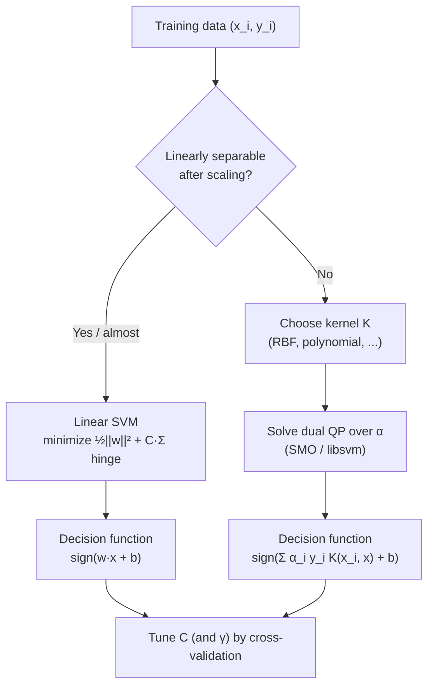
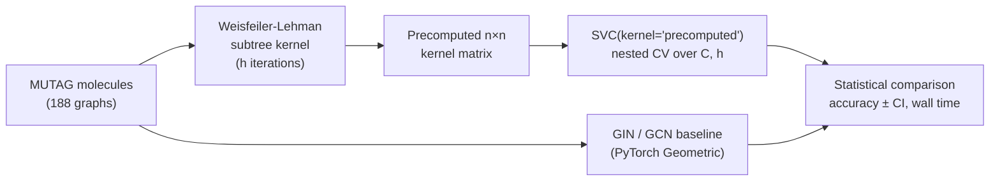

# 1.11 — Support Vector Machines (SVM)

## 1. Overview

**What is it?** A Support Vector Machine is a supervised learning algorithm that finds the decision boundary (a hyperplane) separating two classes with the **largest possible margin** — the widest "no man's land" between the classes. Only the training points closest to the boundary, the **support vectors**, determine where the boundary sits. When the data is not linearly separable, SVMs use the **kernel trick** to implicitly project data into a higher-dimensional space where a linear separator exists.

**Why does it exist?** In the pre-deep-learning era (roughly 1995–2012), SVMs were the most powerful general-purpose classifier available. They come with elegant theory: the training problem is a **convex quadratic program** with a unique global optimum, and the max-margin principle connects directly to statistical learning theory's generalization bounds.

**What problem does it solve?** Binary classification first and foremost, but the framework extends naturally to multi-class classification (one-vs-rest or one-vs-one), regression (Support Vector Regression, SVR), one-class outlier/novelty detection (One-Class SVM), and ranking.

**Where is it used?** Text classification (a linear SVM on TF-IDF features remains one of the strongest baselines in NLP), bioinformatics (kernels over sequences and graphs), anomaly detection, and any small-to-medium tabular dataset where you want a strong, theoretically grounded classifier without a GPU.

## 2. Learning Objectives

After this chapter you will be able to:

- Explain the max-margin principle and why a wider margin tends to generalize better.
- Derive the hard-margin SVM optimization problem from the geometry of margins.
- Extend it to the soft-margin formulation with slack variables and interpret the role of $C$.
- Rewrite the soft-margin problem as unconstrained hinge-loss minimization and compare it to logistic regression.
- Derive the Lagrangian dual and explain why it enables the kernel trick.
- State and use the linear, polynomial, and RBF kernels; explain what $\gamma$ controls.
- Describe how the SMO algorithm solves the dual problem.
- Implement a linear SVM from scratch with sub-gradient descent on the hinge loss.
- Train, tune, and evaluate `SVC` / `LinearSVC` in scikit-learn, including class weighting and probability calibration.
- Identify when an SVM is the right tool and when it is not (e.g., millions of samples with an RBF kernel).
- Answer standard interview questions about primal/dual, support vectors, and kernels.

## 3. Prerequisites

| Chapter | Why you need it |
|---|---|
| [Linear Algebra](../phase-0-prerequisites/02-linear-algebra.md) | Hyperplanes, inner products, norms, and projections are the language of SVMs. |
| [Calculus](../phase-0-prerequisites/03-calculus.md) | Lagrange multipliers and gradients are needed for the dual derivation and training. |
| [ML Fundamentals](01-ml-fundamentals.md) | Train/test splits, overfitting, and the bias–variance trade-off frame why margins matter. |
| [Logistic Regression](04-logistic-regression.md) | The closest sibling model; comparing hinge loss vs log loss is deeply instructive. |
| [Gradient Descent](03-gradient-descent.md) | Our from-scratch implementation trains with (sub-)gradient descent. |
| [Regularization](05-regularization.md) | The $\tfrac{1}{2}\|\mathbf{w}\|^2$ term is exactly L2 regularization; $C$ is its inverse strength. |

## 4. Intuition

Imagine two rival groups of houses on a plain — red houses on one side, blue on the other — and you must build a straight road between them. Many roads would separate the groups, but the *safest* road is the one that stays as far as possible from the nearest house on each side. If a new house is later built near the boundary, the wide buffer means the road probably still separates the groups correctly. That buffer is the **margin**, and the houses closest to the road — the ones that would force you to move it — are the **support vectors**. Every other house could be demolished without changing the road at all.

Now suppose the houses are hopelessly intermingled on the plain — no straight road works. Here is the second key idea: lift the map into 3D. Perhaps red houses sit in a valley and blue houses on the hills; in 3D, a flat sheet at some altitude separates them perfectly. The **kernel trick** performs exactly this lifting, except it never computes the 3D (or 3-million-D) coordinates — it only ever needs *similarities between pairs of houses*, which can be computed cheaply in the original space.

Everyday story: think of a bouncer deciding who enters a club. A lenient rule ("no obvious troublemakers") corresponds to a small $C$: wide margin, a few misclassified people tolerated. A strict rule ("zero mistakes, ever") is a large $C$: the boundary contorts itself to classify every training example correctly, and generalizes worse to tomorrow's crowd.

## 5. Real-world Motivation

- **Text classification.** Before transformers, a linear SVM on TF-IDF or bag-of-words features was the industry-standard text classifier — used for spam filtering, sentiment analysis, and topic routing. It is *still* a strong, cheap baseline that many teams deploy when a 100 ms CPU inference budget matters more than the last 2% of accuracy.
- **Handwritten digit recognition.** SVMs with polynomial/RBF kernels held state-of-the-art results on MNIST-style tasks in the late 1990s and were used in check-reading systems at banks.
- **Face detection.** Early production face detectors combined hand-crafted features (Haar, HOG) with SVM classifiers; the HOG + linear SVM pedestrian detector (Dalal & Triggs, 2005) shipped in many computer-vision products.
- **Bioinformatics.** Research groups classify proteins, gene-expression profiles, and molecular graphs with string and graph kernels — settings with few samples ($n$ in the hundreds) and huge dimensionality, exactly where SVMs shine.
- **Anomaly detection.** One-Class SVM is widely used for novelty detection in manufacturing quality control and network intrusion detection, where you have plenty of "normal" data and almost no labeled anomalies.

## 6. Mathematical Foundations

### 6.1 Geometry of a hyperplane

A hyperplane in $\mathbb{R}^d$ is the set $\{\mathbf{x} : \mathbf{w}^T\mathbf{x} + b = 0\}$, where $\mathbf{w} \in \mathbb{R}^d$ is the normal vector (perpendicular to the plane) and $b \in \mathbb{R}$ is the offset. The signed distance from a point $\mathbf{x}_i$ to the hyperplane is

$$
\text{dist}(\mathbf{x}_i) = \frac{\mathbf{w}^T\mathbf{x}_i + b}{\|\mathbf{w}\|},
$$

where $\|\mathbf{w}\| = \sqrt{\mathbf{w}^T\mathbf{w}}$ is the Euclidean norm. With labels $y_i \in \{-1, +1\}$, the **geometric margin** of point $i$ is $y_i(\mathbf{w}^T\mathbf{x}_i + b)/\|\mathbf{w}\|$ — positive when the point is on the correct side.

### 6.2 Hard-margin SVM

Given a linearly separable training set $\{(\mathbf{x}_i, y_i)\}_{i=1}^n$, we want the hyperplane maximizing the minimum margin. Because scaling $(\mathbf{w}, b)$ by any constant leaves the hyperplane unchanged, we fix the scale by requiring the closest points to satisfy $y_i(\mathbf{w}^T\mathbf{x}_i + b) = 1$. Then the margin width (distance between the two supporting hyperplanes $\mathbf{w}^T\mathbf{x} + b = \pm 1$) is $2/\|\mathbf{w}\|$, and maximizing it is equivalent to:

$$
\min_{\mathbf{w}, b}\; \tfrac{1}{2}\|\mathbf{w}\|^2 \quad \text{s.t.}\quad y_i(\mathbf{w}^T\mathbf{x}_i + b) \ge 1 \;\; \forall i.
$$

(We minimize $\tfrac{1}{2}\|\mathbf{w}\|^2$ instead of maximizing $2/\|\mathbf{w}\|$ because it is a differentiable convex quadratic — same optimum, nicer optimization.)

### 6.3 Soft-margin SVM

Real data is rarely separable. Introduce **slack variables** $\xi_i \ge 0$ measuring how much each point violates the margin:

$$
\min_{\mathbf{w}, b, \boldsymbol\xi}\; \tfrac{1}{2}\|\mathbf{w}\|^2 + C\sum_{i=1}^n \xi_i
\quad \text{s.t.}\quad y_i(\mathbf{w}^T\mathbf{x}_i + b) \ge 1 - \xi_i,\;\; \xi_i \ge 0.
$$

Here $C > 0$ is the **cost of violation**: large $C$ punishes margin violations heavily (narrow margin, low bias, high variance); small $C$ tolerates violations (wide margin, high bias, low variance). Note $\xi_i = 0$ means the point respects the margin; $0 < \xi_i \le 1$ means inside the margin but correctly classified; $\xi_i > 1$ means misclassified.

### 6.4 Hinge-loss form

At the optimum, $\xi_i = \max(0,\, 1 - y_i(\mathbf{w}^T\mathbf{x}_i + b))$ — the smallest slack satisfying both constraints. Substituting gives the equivalent **unconstrained** problem:

$$
J(\mathbf{w}, b) = \tfrac{1}{2}\|\mathbf{w}\|^2 + C\sum_{i=1}^n \max\!\big(0,\, 1 - y_i(\mathbf{w}^T\mathbf{x}_i + b)\big).
$$

The term $\max(0, 1 - y f(\mathbf{x}))$ is the **hinge loss**. Compare with logistic regression's log loss $\log(1 + e^{-y f(\mathbf{x})})$: both penalize points with small or negative margin, but hinge loss is exactly zero for confidently correct points (margin $\ge 1$), which is why only support vectors matter. Hinge loss is convex but non-differentiable at margin $= 1$; we use sub-gradients.

### 6.5 The Lagrangian dual — step by step

Form the Lagrangian of the soft-margin problem with multipliers $\alpha_i \ge 0$ (for the margin constraints) and $\mu_i \ge 0$ (for $\xi_i \ge 0$):

$$
\mathcal{L} = \tfrac{1}{2}\|\mathbf{w}\|^2 + C\sum_i \xi_i - \sum_i \alpha_i\big[y_i(\mathbf{w}^T\mathbf{x}_i + b) - 1 + \xi_i\big] - \sum_i \mu_i \xi_i.
$$

Set derivatives with respect to the primal variables to zero:

$$
\frac{\partial \mathcal{L}}{\partial \mathbf{w}} = 0 \;\Rightarrow\; \mathbf{w} = \sum_i \alpha_i y_i \mathbf{x}_i, \qquad
\frac{\partial \mathcal{L}}{\partial b} = 0 \;\Rightarrow\; \sum_i \alpha_i y_i = 0, \qquad
\frac{\partial \mathcal{L}}{\partial \xi_i} = 0 \;\Rightarrow\; \alpha_i = C - \mu_i.
$$

The last equation with $\mu_i \ge 0$ gives the **box constraint** $0 \le \alpha_i \le C$. Substituting back eliminates $\mathbf{w}, b, \boldsymbol\xi$ and yields the **dual**:

$$
\max_{\boldsymbol\alpha}\; \sum_{i=1}^n \alpha_i - \tfrac{1}{2}\sum_{i,j} \alpha_i \alpha_j y_i y_j \langle \mathbf{x}_i, \mathbf{x}_j \rangle
\quad \text{s.t.}\quad 0 \le \alpha_i \le C,\;\; \sum_i \alpha_i y_i = 0.
$$

The **KKT complementary-slackness conditions** tell us: $\alpha_i = 0$ for points strictly outside the margin; $0 < \alpha_i < C$ for points exactly *on* the margin; $\alpha_i = C$ for margin violators. Points with $\alpha_i > 0$ are the **support vectors** — the only points appearing in the prediction:

$$
f(\mathbf{x}) = \operatorname{sign}\Big(\sum_{i \in SV} \alpha_i y_i \langle \mathbf{x}_i, \mathbf{x} \rangle + b\Big).
$$

### 6.6 The kernel trick

The dual and the prediction depend on the data **only through inner products** $\langle \mathbf{x}_i, \mathbf{x}_j \rangle$. Replace them with a **kernel** $K(\mathbf{x}_i, \mathbf{x}_j) = \langle \phi(\mathbf{x}_i), \phi(\mathbf{x}_j) \rangle$ for some feature map $\phi$ we never compute explicitly:

| Kernel | Formula | Feature space |
|---|---|---|
| Linear | $K = \mathbf{x}^T\mathbf{x}'$ | Original $\mathbb{R}^d$ |
| Polynomial | $K = (\gamma\, \mathbf{x}^T\mathbf{x}' + r)^p$ | All monomials up to degree $p$ |
| RBF (Gaussian) | $K = \exp(-\gamma \|\mathbf{x} - \mathbf{x}'\|^2)$ | Infinite-dimensional |

Here $\gamma > 0$ controls the kernel width for RBF: **large $\gamma$** means each support vector's influence is very local (wiggly boundary, overfitting risk); **small $\gamma$** means broad influence (smooth boundary, underfitting risk). By **Mercer's theorem**, any symmetric positive semi-definite function is a valid kernel.

**Symbol glossary:** $\mathbf{w}$ = normal vector of the hyperplane; $b$ = bias/offset; $y_i$ = label in $\{-1,+1\}$; $\xi_i$ = slack of sample $i$; $C$ = misclassification cost; $\alpha_i, \mu_i$ = Lagrange multipliers; $K$ = kernel; $\gamma, r, p$ = kernel hyperparameters; $\phi$ = implicit feature map; $n$ = number of samples; $d$ = number of features.

## 7. Visual Explanation

```
     x2
      |    o o o
      |   o   o
      |        ★  ← support vector (class o)
      |  ~~~~~~~~~~~~~~~   ← margin boundary  w·x + b = +1
      |  ---------------   ← decision boundary w·x + b = 0
      |  ~~~~~~~~~~~~~~~   ← margin boundary  w·x + b = −1
      |        ★  ← support vector (class x)
      |      x   x  x
      |        x
      +---------------------- x1
      margin width = 2 / ||w||
```



The diagram highlights the practical fork: for (near-)linear problems, solve the primal directly (fast, scales to millions of samples); for non-linear problems, solve the dual with a kernel (expressive, but scales poorly in $n$).

## 8. Algorithm

**Training a kernel SVM with SMO (Sequential Minimal Optimization):**

1. Initialize all dual variables $\alpha_i = 0$ and bias $b = 0$.
2. Scan the training set for a sample that violates the KKT conditions beyond tolerance `tol` (e.g., a point with $\alpha_i = 0$ but margin $< 1$).
3. Pick a second sample heuristically (maximize the step size $|E_1 - E_2|$, where $E_k$ is the prediction error on sample $k$).
4. Solve the 2-variable sub-problem **analytically**: the equality constraint $\sum_i \alpha_i y_i = 0$ ties the two variables together, so the sub-problem is a 1-D quadratic over a box — its optimum is a clipped closed-form expression.
5. Update $b$ from the KKT conditions of the two updated points.
6. Repeat steps 2–5 until no sample violates KKT within `tol`.

**Why two variables at a time?** The equality constraint means you cannot change a single $\alpha_i$ alone; two is the smallest working set, and it admits a closed-form solution — no numerical QP solver needed in the inner loop.

Pseudocode:

```text
Input: kernel matrix K (n×n), labels y, cost C, tolerance tol
alpha ← 0ⁿ ; b ← 0
repeat:
    num_changed ← 0
    for i in 1..n:
        E_i ← f(x_i) − y_i                    # prediction error
        if (y_i·E_i < −tol and alpha_i < C) or (y_i·E_i > tol and alpha_i > 0):
            j ← argmax_j |E_i − E_j|          # second-choice heuristic
            L, H ← box bounds for alpha_j     # from 0 ≤ α ≤ C and Σαy = 0
            eta ← K_ii + K_jj − 2·K_ij        # curvature of 1-D sub-problem
            alpha_j ← clip(alpha_j + y_j(E_i − E_j)/eta, L, H)
            alpha_i ← alpha_i + y_i·y_j·(alpha_j_old − alpha_j)
            update b from KKT on i and j
            num_changed += 1
until num_changed == 0
```

For **linear** SVMs at scale, skip the dual entirely: run (sub-)gradient descent or coordinate descent on the primal hinge-loss objective (this is what `LinearSVC`/liblinear and `SGDClassifier(loss="hinge")` do).

## 9. Worked Example

**Tiny example by hand.** Take three 1-D points: $x_1 = 1, y_1 = -1$; $x_2 = 3, y_2 = +1$; $x_3 = 4, y_3 = +1$. A hard-margin SVM must satisfy $y_i(wx_i + b) \ge 1$ while minimizing $\tfrac{1}{2}w^2$.

By symmetry, the boundary should sit midway between the closest opposite-class points, $x_1 = 1$ and $x_2 = 3$, i.e., at $x = 2$. So we need $w \cdot 2 + b = 0$ and the margin constraints active at $x_1, x_2$: $-(w + b) = 1$ and $3w + b = 1$. Solving: subtract the first (rewritten $w + b = -1$) from the second: $2w = 2 \Rightarrow w = 1,\, b = -2$. Check $x_3$: $y_3(w \cdot 4 + b) = 4 - 2 = 2 \ge 1$ ✓ — so $x_3$ is **not** a support vector ($\alpha_3 = 0$). The margin width is $2/\|w\| = 2$, exactly the gap between $x = 1$ and $x = 3$. Decision rule: $\operatorname{sign}(x - 2)$.

**Realistic example.** On the 20-newsgroups text dataset (~18k documents, ~100k TF-IDF features), a `LinearSVC(C=1.0)` typically reaches ~92% macro-F1 on the 4-class science subset in under 10 seconds on a laptop CPU — dimensionality far exceeds sample count, precisely the regime where max-margin linear models excel. An RBF `SVC` on the same data would take orders of magnitude longer and do no better, because text is already near-linearly separable in TF-IDF space.

## 10. Python from Scratch

A linear soft-margin SVM trained by full-batch sub-gradient descent on the hinge-loss objective. Only NumPy — no ML libraries.

```python
import numpy as np

class LinearSVM:
    """Linear soft-margin SVM via sub-gradient descent on the hinge loss.

    Objective: J(w, b) = 0.5 * ||w||^2 + C * sum_i max(0, 1 - y_i (w.x_i + b))
    """
    def __init__(self, C=1.0, lr=0.01, n_iters=1000):
        self.C = C            # cost of margin violations
        self.lr = lr          # learning rate
        self.n_iters = n_iters

    def fit(self, X, y):
        # X: (n, d) float array; y: (n,) array with values in {-1, +1}
        n, d = X.shape
        self.w = np.zeros(d)  # (d,) weight vector, start at zero
        self.b = 0.0          # scalar bias

        for _ in range(self.n_iters):
            # margins: (n,) — y_i * f(x_i); < 1 means the hinge is "active"
            margins = y * (X @ self.w + self.b)
            mask = margins < 1                      # (n,) bool, violators

            # Sub-gradient of J:
            #   dJ/dw = w - C * sum over violators of (y_i * x_i)
            #   dJ/db =    - C * sum over violators of  y_i
            grad_w = self.w - self.C * (X[mask] * y[mask][:, None]).sum(axis=0)
            grad_b = -self.C * y[mask].sum()

            # Average over n to keep step size dataset-size independent
            self.w -= self.lr * grad_w / n
            self.b -= self.lr * grad_b / n
        return self

    def decision_function(self, X):
        return X @ self.w + self.b                  # (n,) signed scores

    def predict(self, X):
        return np.sign(self.decision_function(X))   # (n,) in {-1, +1}


# --- Demo -------------------------------------------------------------
rng = np.random.default_rng(0)
X_pos = rng.normal(loc=[2, 2], scale=0.7, size=(50, 2))   # class +1 blob
X_neg = rng.normal(loc=[-2, -2], scale=0.7, size=(50, 2)) # class -1 blob
X = np.vstack([X_pos, X_neg])                             # (100, 2)
y = np.array([1] * 50 + [-1] * 50)                        # (100,)

model = LinearSVM(C=1.0, lr=0.1, n_iters=2000).fit(X, y)
acc = (model.predict(X) == y).mean()
print(f"train accuracy = {acc:.3f}")   # expected output: ~1.000 (separable blobs)
print("w =", model.w, " b =", model.b) # w points from -class toward +class
```

- **Complexity:** each iteration is $O(nd)$ for the matrix–vector product, so training is $O(T \cdot n d)$ for $T$ iterations. Memory is $O(nd)$ for the data plus $O(d)$ for parameters.
- **Common bug:** passing labels in $\{0, 1\}$ instead of $\{-1, +1\}$. The hinge loss $\max(0, 1 - y f(x))$ silently produces nonsense with $y = 0$ (every 0-labeled point contributes a constant-slope gradient regardless of correctness). Always map labels with `y = 2*y01 - 1` first.

## 11. Library Implementation

```python
from sklearn.datasets import make_moons
from sklearn.model_selection import train_test_split, GridSearchCV
from sklearn.pipeline import make_pipeline
from sklearn.preprocessing import StandardScaler
from sklearn.svm import SVC, LinearSVC

# Non-linear toy data: two interleaving half-moons — a linear model fails here.
X, y = make_moons(n_samples=500, noise=0.2, random_state=42)
X_tr, X_te, y_tr, y_te = train_test_split(X, y, test_size=0.25, random_state=42)

# ALWAYS scale before an SVM: kernels and margins are distance-based.
pipe = make_pipeline(
    StandardScaler(),                      # zero mean, unit variance per feature
    SVC(kernel="rbf", C=1.0, gamma="scale")  # gamma="scale" = 1/(d * X.var())
)

# Tune C and gamma jointly on a log grid — they interact strongly.
grid = GridSearchCV(
    pipe,
    param_grid={"svc__C": [0.1, 1, 10, 100],
                "svc__gamma": [0.01, 0.1, 1, 10]},
    cv=5, scoring="accuracy", n_jobs=-1,
)
grid.fit(X_tr, y_tr)
print(grid.best_params_)                   # e.g. {'svc__C': 10, 'svc__gamma': 1}
print(f"test accuracy = {grid.score(X_te, y_te):.3f}")  # expected ~0.96-0.98

# Number of support vectors — a rough complexity/overfit indicator.
best_svc = grid.best_estimator_.named_steps["svc"]
print("support vectors per class:", best_svc.n_support_)

# For LARGE, high-dimensional, sparse problems (e.g. text), use LinearSVC:
# it solves the primal/dual with liblinear and scales linearly in n.
lin = LinearSVC(C=1.0, dual="auto")        # dual=False preferred when n >> d
```

Line-by-line notes: `StandardScaler` is inside the pipeline so cross-validation folds are scaled with **train-fold statistics only** (no leakage — see [Feature Engineering](15-feature-engineering.md)). `gamma="scale"` is a sensible data-dependent default. `probability=True` on `SVC` would enable `predict_proba` via internal Platt scaling, but it is expensive (extra 5-fold CV) and slightly biased — prefer wrapping with `CalibratedClassifierCV` when you need calibrated probabilities.

## 12. Code Walkthrough

Inputs, outputs, and intermediate values for the from-scratch `LinearSVM` on the blob demo:

| Tensor | Shape | Meaning |
|---|---|---|
| `X` | (100, 2) | Training features, two 2-D Gaussian blobs |
| `y` | (100,) | Labels in $\{-1, +1\}$ |
| `self.w` | (2,) | Hyperplane normal vector |
| `self.b` | scalar | Hyperplane offset |
| `margins` | (100,) | $y_i(\mathbf{w}^T\mathbf{x}_i + b)$ per sample |
| `mask` | (100,) bool | True where margin < 1 (hinge active) |
| `grad_w` | (2,) | Sub-gradient of $J$ w.r.t. $\mathbf{w}$ |
| `decision_function(X)` | (100,) | Signed distance scores (unnormalized) |
| `predict(X)` | (100,) | Class predictions in $\{-1, +1\}$ |

Expected behavior: in early iterations most points violate the margin (`mask` mostly True) and $\|\mathbf{w}\|$ grows; as training proceeds, `mask.sum()` shrinks to a handful of borderline points — the (approximate) support vectors — and the objective plateaus. With well-separated blobs, final train accuracy is 1.0 and $\mathbf{w}$ points roughly along $(1, 1)$, the direction between the blob centers. In the scikit-learn walkthrough, `n_support_` around 10–25% of the training set on `make_moons` is normal; if it approaches 100%, $\gamma$ or $C$ is badly tuned (boundary memorizes every point).

## 13. Complexity Analysis

- **Kernel SVM training:** solving the dual QP is between $O(n^2 d)$ (computing/caching the kernel matrix dominates) and $O(n^3)$ (worst-case SMO iterations) — the $n \times n$ kernel matrix is why kernel SVMs choke beyond a few $10^5$ samples.
- **Linear SVM training (liblinear / SGD):** effectively $O(T \cdot \bar{n}_{nz})$ where $\bar{n}_{nz}$ is the number of non-zero feature entries — linear in data size, which is why `LinearSVC` handles millions of sparse text documents.
- **Prediction:** kernel SVM is $O(|SV| \cdot d)$ per sample (must evaluate the kernel against every support vector); linear SVM is $O(d)$ — a single dot product.
- **Space:** kernel SVM stores all support vectors, $O(|SV| \cdot d)$, plus optionally an $O(n^2)$ kernel cache during training; linear SVM stores only $\mathbf{w}$, i.e., $O(d)$.

## 14. Advantages

- **Convexity — unique global optimum.** No random-seed lottery: retraining on the same data yields the same model, unlike neural networks.
- **Excellent in high dimensions.** With $d \gg n$ (text TF-IDF, gene expression), the margin acts as built-in regularization; linear SVMs routinely beat more complex models here.
- **Sample-efficient.** Because only support vectors matter, SVMs perform well with hundreds of samples — e.g., medical studies with 200 patients and 5,000 features.
- **Kernel flexibility.** Any similarity function satisfying Mercer's condition works — string kernels for DNA, graph kernels for molecules — without redesigning the algorithm.
- **Sparse solution.** The model is a weighted sum over support vectors only; on clean data this is a small fraction of the training set, keeping inference cheap.

## 15. Disadvantages

- **Poor scaling of kernel SVMs.** $O(n^2)$–$O(n^3)$ training makes RBF SVMs impractical past ~$10^5$ samples; a dataset of 10M rows is simply out of reach without approximations.
- **No native probabilities.** The decision function outputs distances, not calibrated probabilities; Platt scaling adds cost and imperfection. If your downstream system consumes probabilities (e.g., expected-value ranking), logistic regression or gradient boosting is more natural.
- **Scaling-sensitive.** A feature measured in millimeters vs kilometers can single-handedly dominate the RBF distance — unscaled inputs are a silent failure mode.
- **Finicky hyperparameters.** $C$ and $\gamma$ interact: a bad grid can look uniformly mediocre, hiding a sharp optimum elsewhere. Budget for a full log-scale 2-D search.
- **Weak on raw perceptual data.** On images/audio/text-as-characters, deep networks that learn features dominate; SVMs need good features handed to them.

## 16. Common Mistakes

- **Forgetting to scale features.** The single most common SVM bug. Fix: put `StandardScaler` in a `Pipeline` so it is always applied, fold-safe.
- **Using `SVC` on huge datasets when `LinearSVC` suffices.** If a linear kernel is competitive (check first on a subsample), the RBF path wastes hours. Fix: always benchmark the linear kernel first.
- **Ignoring class imbalance.** With a 99:1 ratio, the max-margin solution may classify everything as the majority class. Fix: `class_weight="balanced"` or manual weights.
- **Labels in {0, 1} for hand-rolled hinge loss.** Produces silently wrong gradients. Fix: map to $\{-1, +1\}$.
- **Tuning $C$ and $\gamma$ on the test set.** Classic leakage. Fix: nested cross-validation or a held-out validation split.
- **Trusting `probability=True` blindly.** Platt scaling inside `SVC` uses internal CV and can disagree with `predict`. Fix: use `CalibratedClassifierCV` and check a reliability diagram (see [Evaluation Metrics](14-evaluation-metrics.md)).

## 17. Best Practices

- [ ] Wrap scaler + SVM in a `Pipeline`; never fit preprocessing on the full dataset.
- [ ] Start with `LinearSVC` (or `SGDClassifier(loss="hinge")` for streaming-scale data); escalate to RBF only if a subsample experiment shows a clear non-linear gain.
- [ ] Search $C \in \{10^{-2}, \ldots, 10^{3}\}$ and $\gamma \in \{10^{-3}, \ldots, 10^{1}\}$ on a log grid, then refine around the best cell.
- [ ] Use `class_weight="balanced"` for skewed classes; evaluate with PR-AUC or F1, not accuracy.
- [ ] Monitor `n_support_`: if most training points are support vectors, the model is memorizing — decrease $\gamma$ or $C$.
- [ ] For probability outputs, calibrate with `CalibratedClassifierCV(method="sigmoid")` and validate calibration explicitly.
- [ ] Persist the entire fitted pipeline (scaler + model) as one artifact so training-time and serving-time preprocessing cannot diverge.

## 18. Optimization Techniques

- **Random Fourier Features (RFF).** Approximate the RBF kernel with an explicit random feature map $z(\mathbf{x}) \in \mathbb{R}^D$, then train a *linear* SVM on $z(\mathbf{x})$ — turns $O(n^2)$ kernel training into $O(nD)$ linear training. In scikit-learn: `RBFSampler` + `LinearSVC`.
- **Nyström approximation.** Build a low-rank approximation of the kernel matrix from $m \ll n$ landmark points ($O(nm^2)$); often more accurate than RFF at equal budget. In scikit-learn: `Nystroem`.
- **Shrinking and kernel caching.** libsvm temporarily removes variables at the box bounds ($\alpha_i \in \{0, C\}$) from the working set and caches kernel rows (`cache_size=1000` MB helps a lot on repeated rows).
- **Warm-starting the $C$ path.** When tuning $C$, initialize each solve from the previous solution — the dual solutions vary smoothly with $C$.
- **Vectorization.** In from-scratch code, compute all margins with one matrix–vector product per iteration (as in Section 10) instead of a Python loop — typically a 100× speedup.

## 19. Industry Applications

- **Email spam filtering.** Linear SVMs on bag-of-words/TF-IDF features were core components of production spam filters throughout the 2000s and still serve as fast fallback classifiers.
- **Search and text pipelines.** Query-intent and topic classifiers built on linear SVMs remain in production at many companies because they run in microseconds on CPU.
- **Computer-vision preprocessing (historical/embedded).** HOG + linear SVM pedestrian and face detectors shipped in cameras and automotive systems before CNNs; they still appear on ultra-low-power embedded hardware.
- **Bioinformatics and drug discovery.** Kernel SVMs over sequence and molecular-graph kernels classify proteins and predict compound activity in small-$n$ research settings.
- **Manufacturing and security anomaly detection.** One-Class SVMs flag deviations from normal operating behavior in equipment telemetry and network traffic where labeled anomalies are scarce.

## 20. Interview Questions

### Beginner

- **Q: What is a support vector?**
  **A:** A training point with non-zero dual weight $\alpha_i > 0$ — it lies on the margin boundary or violates the margin. Support vectors are the only points that determine the decision boundary; removing any non-support vector leaves the model unchanged.
- **Q: What does the hyperparameter $C$ control?**
  **A:** The cost of margin violations. Large $C$ → few violations tolerated, narrow margin, risk of overfitting. Small $C$ → wide margin, more violations tolerated, risk of underfitting. It is the inverse of L2 regularization strength.
- **Q: Why do SVMs require feature scaling?**
  **A:** Margins and kernels are computed from Euclidean distances/inner products. A feature with a 1000× larger scale dominates the distance, effectively erasing all other features from the decision.
- **Q: What is the margin, geometrically?**
  **A:** The distance between the two parallel hyperplanes $\mathbf{w}^T\mathbf{x} + b = \pm 1$ touching the closest points of each class; its width is $2/\|\mathbf{w}\|$, so minimizing $\|\mathbf{w}\|$ maximizes the margin.
- **Q: Hinge loss vs logistic loss — key difference?**
  **A:** Hinge loss is exactly zero for points with margin $\ge 1$ (confident correct predictions contribute nothing → sparse support-vector solution); logistic loss is never zero, so every point influences a logistic model, and it yields natural probabilities while hinge does not.

### Intermediate

- **Q: Sketch the derivation of the SVM dual. Why do we care about it?**
  **A:** Form the Lagrangian with multipliers $\alpha_i$ for the margin constraints; setting $\partial\mathcal{L}/\partial\mathbf{w} = 0$ gives $\mathbf{w} = \sum_i \alpha_i y_i \mathbf{x}_i$, and $\partial\mathcal{L}/\partial b = 0$ gives $\sum_i \alpha_i y_i = 0$; substituting back yields a maximization over $\boldsymbol\alpha$ with box constraints $0 \le \alpha_i \le C$. We care because the dual depends on data only through inner products, enabling the kernel trick, and because its solution is sparse.
- **Q: What is the kernel trick, precisely?**
  **A:** Replacing every inner product $\langle \mathbf{x}_i, \mathbf{x}_j \rangle$ in the dual and prediction with $K(\mathbf{x}_i, \mathbf{x}_j) = \langle \phi(\mathbf{x}_i), \phi(\mathbf{x}_j) \rangle$, computing similarity in a high- (even infinite-)dimensional feature space without ever materializing $\phi(\mathbf{x})$. Valid whenever $K$ is symmetric positive semi-definite (Mercer).
- **Q: What do large vs small $\gamma$ do in an RBF SVM?**
  **A:** $\gamma$ is the inverse squared length-scale. Large $\gamma$: each support vector influences only its immediate neighborhood → wiggly boundary, high variance, potentially every point becomes a support vector. Small $\gamma$: influence is broad → boundary approaches linear, high bias.
- **Q: When would you choose SVM over logistic regression?**
  **A:** Small-to-medium $n$ with high $d$ (text, genomics), when you need non-linearity via kernels without manual feature crosses, or when you want the max-margin robustness. Prefer logistic regression when you need well-calibrated probabilities, extreme scale, or coefficient-level interpretability.
- **Q: How does SVM handle multi-class problems?**
  **A:** Natively it is binary. One-vs-rest trains $K$ classifiers (scikit-learn's `LinearSVC` default); one-vs-one trains $K(K-1)/2$ pairwise classifiers and votes (`SVC` default). OvO sub-problems are smaller, which suits kernel SVMs' $O(n^2)$ cost.

### Advanced

- **Q: State the KKT conditions for the soft-margin SVM and what they imply about $\alpha_i$.**
  **A:** Stationarity ($\mathbf{w} = \sum \alpha_i y_i \mathbf{x}_i$, $\sum \alpha_i y_i = 0$, $\alpha_i + \mu_i = C$), primal/dual feasibility, and complementary slackness ($\alpha_i[y_i f(\mathbf{x}_i) - 1 + \xi_i] = 0$, $\mu_i \xi_i = 0$). Consequences: $\alpha_i = 0$ ⇒ margin $\ge 1$ (non-support vector); $0 < \alpha_i < C$ ⇒ margin exactly 1 (on-margin SV, used to compute $b$); $\alpha_i = C$ ⇒ margin $\le 1$ (violator).
- **Q: Why does SMO optimize exactly two variables at a time?**
  **A:** The equality constraint $\sum_i \alpha_i y_i = 0$ makes any single-variable move infeasible. Two variables form the smallest feasible working set, and the resulting 1-D box-constrained quadratic has a closed-form clipped solution — so the inner loop needs no numerical solver.
- **Q: Prove or argue that the RBF kernel corresponds to an infinite-dimensional feature space.**
  **A:** Expand $\exp(-\gamma\|x - x'\|^2) = e^{-\gamma\|x\|^2} e^{-\gamma\|x'\|^2} e^{2\gamma x^T x'}$ and Taylor-expand the last factor: $e^{2\gamma x^T x'} = \sum_{k=0}^{\infty} \frac{(2\gamma)^k (x^T x')^k}{k!}$. Each term $(x^T x')^k$ is a polynomial kernel of degree $k$, so the RBF kernel is a weighted sum of polynomial kernels of *all* degrees — its feature map stacks all monomials, an infinite-dimensional embedding.
- **Q: How do Random Fourier Features approximate an RBF SVM, and what is the trade-off?**
  **A:** Bochner's theorem says a shift-invariant PSD kernel is the Fourier transform of a probability measure; sampling $D$ frequencies $\omega_k \sim \mathcal{N}(0, 2\gamma I)$ gives features $z(\mathbf{x}) = \sqrt{2/D}\,[\cos(\omega_k^T\mathbf{x} + b_k)]_k$ with $\mathbb{E}[z(\mathbf{x})^T z(\mathbf{x}')] = K(\mathbf{x},\mathbf{x}')$. Training becomes linear-time in $n$, at the price of $O(1/\sqrt{D})$ kernel-approximation error — you trade exactness for scalability.
- **Q: Explain One-Class SVM.**
  **A:** An unsupervised variant that finds a small region (or a max-margin hyperplane separating data from the origin in kernel space) containing most training data; the parameter $\nu \in (0,1]$ upper-bounds the fraction of training outliers and lower-bounds the fraction of support vectors. Points falling outside the region at test time are flagged as anomalies/novelties.

## 21. Coding Exercises

### Easy

1. **Label sanity.** Take a $\{0,1\}$-labeled dataset, train the Section 10 `LinearSVM` *without* remapping labels, observe the failure, then fix it with `y = 2*y - 1`. *Hint: print `margins.min()` and `margins.max()` each 100 iterations.*
2. **Scaling ablation.** Train `SVC(kernel="rbf")` on the Wine dataset with and without `StandardScaler`; report both accuracies. *Hint: expect a gap of 10+ points; look at `X.std(axis=0)` to see why.*

### Medium

1. **Decision-boundary atlas.** On `make_moons`, plot RBF-SVM decision boundaries for $\gamma \in \{0.01, 0.1, 1, 10, 100\}$ at fixed $C = 1$; annotate each with `n_support_`. *Hint: `np.meshgrid` + `decision_function` on the grid, then `plt.contourf`.*
2. **Linear SVM vs logistic regression on text.** Compare `LinearSVC` and `LogisticRegression` on 20-newsgroups TF-IDF: accuracy, training time, and sparsity of decisions. *Hint: `sklearn.datasets.fetch_20newsgroups_vectorized` gives you the sparse matrix directly.*
3. **Platt calibration.** Wrap an `SVC` in `CalibratedClassifierCV` and plot reliability diagrams before/after. *Hint: `sklearn.calibration.calibration_curve` with 10 bins.*

### Hard

1. **Soft-margin SVM via cvxpy.** Encode the primal QP in cvxpy, solve, and verify the solution matches `SVC(kernel="linear")` weights to 3 decimals. *Hint: variables `w (d,)`, `b`, `xi (n,)`; constraints `cp.multiply(y, X @ w + b) >= 1 - xi`, `xi >= 0`.*
2. **Simplified SMO.** Implement the simplified SMO algorithm (random second-choice) for a kernel SVM and reproduce `SVC` predictions on a 200-point 2-D dataset. *Hint: follow the pseudocode in Section 8; clip $\alpha_j$ to $[L, H]$ before updating $\alpha_i$.*
3. **RFF at scale.** Implement Random Fourier Features from scratch, train `LinearSVC` on top, and match full RBF-SVC accuracy on 50k samples within 1% while training ≥10× faster. *Hint: $D = 1000$–$2000$ features usually suffices; sample $\omega \sim \mathcal{N}(0, 2\gamma I)$.*

## 22. Mini Project

**Text classifier on 20-newsgroups with `LinearSVC` (target: > 90% F1 on a 4-class subset).**

1. Load the `sci.*` categories of 20-newsgroups with headers/footers/quotes stripped (`remove=("headers", "footers", "quotes")`) to avoid trivial leakage.
2. Build a `Pipeline`: `TfidfVectorizer(sublinear_tf=True, ngram_range=(1,2), min_df=2)` → `LinearSVC(C=1.0)`.
3. Split 80/20 stratified; fit on train.
4. Report per-class precision/recall/F1 with `classification_report` and plot the confusion matrix.
5. Grid-search `C ∈ {0.01, 0.1, 1, 10}` with 5-fold CV; record the F1-vs-$C$ curve.
6. Inspect the 15 most positive/negative coefficients per class — do the top n-grams make semantic sense?
7. Write a 10-line summary: best $C$, final F1, most confused class pair, and one hypothesis why.

## 23. Medium Project

**Face recognition on LFW with HOG features + kernel SVM.**

1. Load `fetch_lfw_people(min_faces_per_person=70)` (~1,300 images, 7 people).
2. Compute HOG descriptors per image (`skimage.feature.hog`, 8×8 cells, 9 orientations); record the feature dimensionality.
3. Baseline A: raw pixels + `LinearSVC`. Baseline B: HOG + `LinearSVC`. Measure the lift from features alone.
4. Main model: HOG + `SVC(kernel="rbf")`, grid over $C \in \{1, 10, 100\}$, $\gamma \in \{10^{-4}, 10^{-3}, 10^{-2}\}$ with stratified 5-fold CV.
5. Use `class_weight="balanced"` (LFW is imbalanced) and evaluate macro-F1, not accuracy.
6. Visualize the top-5 most confidently *misclassified* faces; note failure patterns (pose, lighting).
7. Compare inference latency per image of the RBF model vs the linear model; relate it to `n_support_`.
8. Stretch: replace HOG with PCA-reduced pixels ([PCA](13-pca.md)) and compare — this is the classical "Eigenfaces + SVM" pipeline.

## 24. Advanced Project

**Graph classification with a custom kernel, benchmarked against a GNN on MUTAG.**

*Architecture:*



*Implementation phases:*

1. **Data.** Load MUTAG (via `grakel` datasets or TU-dataset files); each graph is a molecule with node labels (atom types).
2. **Kernel.** Implement the Weisfeiler-Lehman subtree kernel from scratch: iteratively relabel each node with a hash of (its label, sorted neighbor labels) for $h$ iterations; the kernel is the inner product of label-count histograms across iterations. Verify positive semi-definiteness (all eigenvalues of $K \ge -10^{-8}$).
3. **Model.** Train `SVC(kernel="precomputed")` with nested 10-fold CV: inner loop tunes $C$ and $h \in \{1..5\}$, outer loop estimates generalization. Report mean ± std accuracy.
4. **Baseline.** Train a small GIN (3 layers, hidden 64) with the same outer folds; match total tuning budget.
5. **Analysis.** Compare accuracy, variance across folds, wall-clock time, and sample-efficiency (learning curves at 25/50/100% of training data). On 188 graphs, expect the WL-kernel SVM to be highly competitive — small-$n$ is kernel territory.
6. *Possible improvements:* try the shortest-path kernel; combine kernels by averaging; use a Nyström approximation to scale the pipeline to larger TU datasets (NCI1, ~4k graphs); calibrate SVM scores for a virtual-screening ranking use case.

## 25. Summary

- SVMs find the hyperplane maximizing the margin $2/\|\mathbf{w}\|$; only support vectors ($\alpha_i > 0$) determine it.
- Soft margins add slack $\xi_i$ with cost $C$; equivalently, minimize L2-regularized **hinge loss**.
- $C$ trades margin width against violations: large $C$ → variance, small $C$ → bias.
- The **dual** depends on data only via inner products → replace with kernels to get non-linear boundaries without explicit feature maps.
- RBF kernel: $\gamma$ sets locality — large $\gamma$ overfits, small $\gamma$ underfits; tune $C$ and $\gamma$ jointly on a log grid.
- **SMO** solves the dual two variables at a time, each step in closed form.
- Kernel SVM training is $O(n^2)$–$O(n^3)$: superb below ~$10^5$ samples, impractical beyond; linear SVMs (liblinear/SGD) scale linearly.
- Always scale features; always handle class imbalance (`class_weight`); calibrate if you need probabilities.
- Linear SVM on TF-IDF remains one of the best cheap text classifiers in production.
- Approximations (Random Fourier Features, Nyström) recover most RBF accuracy at linear cost.

## 26. Cheat Sheet

| Item | Formula / value |
|---|---|
| Primal (soft margin) | $\min \tfrac{1}{2}\|\mathbf{w}\|^2 + C\sum_i \xi_i$ s.t. $y_i(\mathbf{w}^T\mathbf{x}_i + b) \ge 1 - \xi_i$ |
| Hinge loss | $\max(0,\, 1 - y f(\mathbf{x}))$ |
| Dual | $\max_\alpha \sum_i \alpha_i - \tfrac12 \sum_{ij}\alpha_i\alpha_j y_i y_j K_{ij}$, $0 \le \alpha_i \le C$, $\sum_i \alpha_i y_i = 0$ |
| Prediction | $\operatorname{sign}(\sum_{i \in SV} \alpha_i y_i K(\mathbf{x}_i, \mathbf{x}) + b)$ |
| Margin width | $2/\|\mathbf{w}\|$ |
| RBF kernel | $\exp(-\gamma\|\mathbf{x}-\mathbf{x}'\|^2)$ |

**Defaults / tips:** start `SVC(kernel="rbf", C=1, gamma="scale")`; grid $C \in 10^{[-2,3]}$, $\gamma \in 10^{[-3,1]}$; text → `LinearSVC`; $n > 10^5$ → linear model or kernel approximation; imbalance → `class_weight="balanced"`.

**Gotchas:** unscaled features silently break everything; labels must be $\pm 1$ for hand-rolled hinge loss; `probability=True` is slow and approximate; `n_support_ ≈ n` means you are overfitting.

## 27. Further Reading

- **Books:** *The Elements of Statistical Learning* (Hastie, Tibshirani, Friedman) — Ch. 12; *Pattern Recognition and Machine Learning* (Bishop) — Ch. 7; *Learning with Kernels* (Schölkopf & Smola).
- **Research papers:** Cortes & Vapnik, "Support-Vector Networks" (1995); Platt, "Sequential Minimal Optimization" (1998); Rahimi & Recht, "Random Features for Large-Scale Kernel Machines" (2007); Shervashidze et al., "Weisfeiler-Lehman Graph Kernels" (2011).
- **Documentation:** scikit-learn SVM user guide; the LIBSVM and LIBLINEAR papers/manuals (Chang & Lin; Fan et al.).
- **GitHub repositories:** `cjlin1/libsvm`, `cjlin1/liblinear`, `ysig/GraKeL` (graph kernels).
- **Datasets:** 20-newsgroups, LFW faces, MNIST, MUTAG/TU graph datasets, UCI Wine.
- **Videos:** MIT 6.034 Patrick Winston's SVM lecture ("Support Vector Machines"); Andrew Ng's CS229 lectures on SVMs and kernels.
- **Blogs:** scikit-learn examples gallery (RBF SVM parameters); "Understanding Support Vector Machines" series on distill-style ML blogs; Chris Burges' tutorial "A Tutorial on Support Vector Machines for Pattern Recognition."
