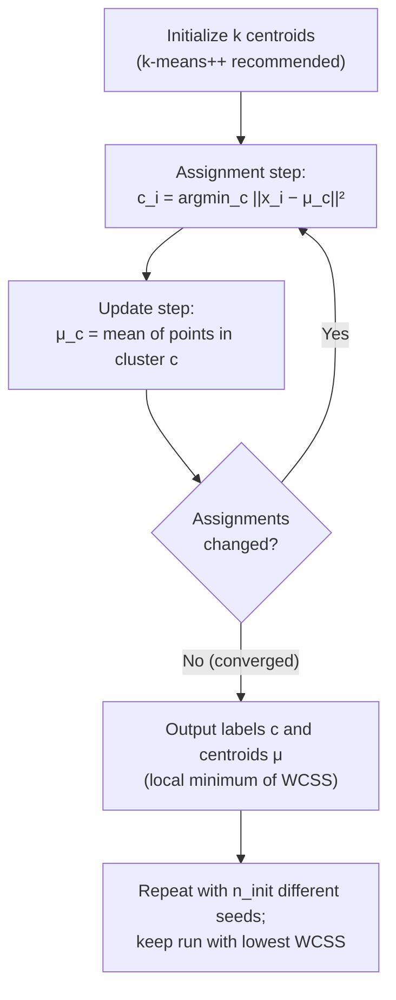
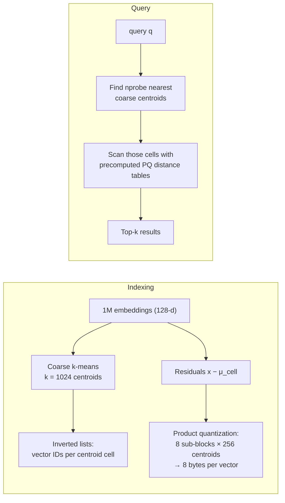

# 1.12 — K-Means Clustering

## 1. Overview

**What is it?** K-Means is the most widely used clustering algorithm: given $n$ unlabeled points and a target number of groups $k$, it partitions the points into $k$ clusters, each represented by its **centroid** (the mean of its members). It alternates two simple steps — assign each point to its nearest centroid, then recompute each centroid as the mean of its assigned points — until nothing changes. This alternating scheme is called **Lloyd's algorithm**.

**Why does it exist?** It is the default first attempt at unsupervised learning: extremely fast, easy to understand, easy to implement, and the workhorse behind **vector quantization** — compressing many vectors into a small "codebook" of representative centroids.

**What problem does it solve?** Discovering group structure in unlabeled data: customer segmentation, image color quantization, document grouping, building coarse indexes for nearest-neighbor search, and initializing more sophisticated models (Gaussian Mixture Models, VQ codebooks).

**Where is it used?** Marketing analytics (personas), image compression, approximate-nearest-neighbor engines like FAISS (the IVF coarse quantizer *is* k-means), embedding compression via product quantization, and countless exploratory-analysis notebooks.

## 2. Learning Objectives

After this chapter you will be able to:

- Define the within-cluster sum of squares (WCSS/inertia) objective and every symbol in it.
- Explain and implement Lloyd's algorithm, and prove it monotonically decreases WCSS.
- Explain why k-means only reaches a **local** optimum and how restarts mitigate this.
- Describe and implement **k-means++** initialization and state its approximation guarantee.
- Choose $k$ using the elbow method, silhouette score, and gap statistic — and know their limits.
- State the implicit assumptions of k-means (spherical, similar-size, similar-density clusters) and predict when it fails.
- Use `KMeans` and `MiniBatchKMeans` in scikit-learn correctly (scaling, `n_init`, `random_state`).
- Implement k-means from scratch in vectorized NumPy, including k-means++ init.
- Analyze the time and space complexity of each step.
- Relate k-means to Gaussian Mixture Models and to vector quantization in ANN indexes.
- Answer standard interview questions on convergence, initialization, and alternatives.

## 3. Prerequisites

| Chapter | Why you need it |
|---|---|
| [Linear Algebra](../phase-0-prerequisites/02-linear-algebra.md) | Distances, norms, and means of vectors are the entire mechanics of k-means. |
| [Probability & Statistics](../phase-0-prerequisites/04-probability-statistics.md) | Variance and expectation underlie WCSS and the GMM connection. |
| [NumPy & Pandas](../phase-0-prerequisites/05-numpy-pandas.md) | The from-scratch implementation relies on broadcasting and vectorized reductions. |
| [ML Fundamentals](01-ml-fundamentals.md) | Supervised vs unsupervised framing; what "no labels" changes about evaluation. |
| [KNN](06-knn.md) | Same distance-based reasoning; k-means assignment is a nearest-neighbor query against centroids. |

## 4. Intuition

Imagine a city planner placing $k$ **pizza delivery depots** to serve thousands of houses. A sensible iterative strategy: (1) each house orders from its nearest depot; (2) each depot then relocates to the center of gravity of the houses it serves, cutting average delivery distance; (3) after moving, some houses are now closer to a different depot, so they switch — and the depots move again. After a few rounds, no house wants to switch and no depot wants to move: the configuration has converged. The depots are centroids, the houses are data points, and total squared delivery distance is the WCSS objective.

The everyday story behind **initialization**: if all $k$ depots start in the same neighborhood, they will end up splitting that neighborhood among themselves while the rest of the city is badly served — a *local* optimum. k-means++ fixes this the way a sensible planner would: place the first depot anywhere, then place each subsequent depot preferentially **far from all existing depots**, so coverage starts spread out.

One more intuition worth internalizing: k-means carves space into **Voronoi cells** — every point belongs to the nearest centroid, so boundaries between clusters are straight lines (hyperplanes) exactly halfway between centroid pairs. This is why k-means loves round blobs and fails on rings, moons, and elongated shapes.

## 5. Real-world Motivation

- **Vector search at scale.** FAISS (open-sourced by Meta) uses k-means as the coarse quantizer of its IVF (inverted file) indexes: a query is compared only against vectors in the few nearest centroid cells, making billion-scale nearest-neighbor search feasible. Product quantization runs k-means again inside vector sub-spaces to compress embeddings 32–64×.
- **Customer segmentation.** Retailers and streaming services cluster users by behavior (recency, frequency, spend, genres watched) to build personas for targeted campaigns — k-means is the standard first pass because centroids are directly interpretable ("cluster 3 = high-frequency, low-basket shoppers").
- **Image and telemetry compression.** Color quantization (reduce an image to a 16-color palette = 16 centroids in RGB space) and codebook compression of sensor streams both are k-means applications shipped in real products.
- **Preprocessing and initialization.** Gaussian Mixture Models, some VQ-VAE codebooks, and spectral-clustering pipelines are commonly initialized from a k-means solution because it is cheap and usually lands near a good basin.

## 6. Mathematical Foundations

### 6.1 The objective

Given data $\mathbf{x}_1, \ldots, \mathbf{x}_n \in \mathbb{R}^d$, an assignment $c_i \in \{1, \ldots, k\}$ for each point, and centroids $\boldsymbol\mu_1, \ldots, \boldsymbol\mu_k \in \mathbb{R}^d$, minimize the **within-cluster sum of squares (WCSS)**, also called *inertia* or *distortion*:

$$
J(c, \boldsymbol\mu) = \sum_{i=1}^{n} \|\mathbf{x}_i - \boldsymbol\mu_{c_i}\|^2 ,
$$

where $\|\cdot\|$ is the Euclidean norm, $c_i$ is the cluster index of point $i$, and $\boldsymbol\mu_{c_i}$ is the centroid of that cluster. Finding the *global* minimum over all partitions is NP-hard even for $k = 2$; Lloyd's algorithm is a fast heuristic.

### 6.2 Lloyd's algorithm as alternating minimization

Fix one block of variables and optimize the other:

**Assignment step** (optimize $c$ with $\boldsymbol\mu$ fixed). For each $i$ independently:

$$
c_i \leftarrow \arg\min_{c \in \{1..k\}} \|\mathbf{x}_i - \boldsymbol\mu_c\|^2 .
$$

This is optimal per point, so it cannot increase $J$.

**Update step** (optimize $\boldsymbol\mu$ with $c$ fixed). For cluster $c$ with member set $S_c = \{i : c_i = c\}$, minimize $\sum_{i \in S_c} \|\mathbf{x}_i - \boldsymbol\mu_c\|^2$. Setting the gradient to zero:

$$
\frac{\partial}{\partial \boldsymbol\mu_c} \sum_{i \in S_c}\|\mathbf{x}_i - \boldsymbol\mu_c\|^2
= -2 \sum_{i \in S_c} (\mathbf{x}_i - \boldsymbol\mu_c) = 0
\;\;\Rightarrow\;\;
\boldsymbol\mu_c = \frac{1}{|S_c|}\sum_{i \in S_c} \mathbf{x}_i .
$$

The mean is the unique minimizer of summed squared Euclidean distance — this is *why* the algorithm uses means (and why swapping in the L1 norm gives k-medians, whose optimal center is the coordinate-wise median).

**Convergence proof sketch.** Each step weakly decreases $J$, $J \ge 0$ is bounded below, and there are finitely many partitions of $n$ points into $k$ groups — so the sequence of $J$ values is non-increasing and must become constant after finitely many iterations. Convergence is to a **local** optimum that depends on initialization.

### 6.3 k-means++ initialization

Choose the first centroid uniformly at random among data points. Then, having chosen centroids $\mathcal{M}$, choose the next centroid to be point $\mathbf{x}$ with probability

$$
P(\mathbf{x}) = \frac{D(\mathbf{x})^2}{\sum_{\mathbf{x}'} D(\mathbf{x}')^2},
\qquad D(\mathbf{x}) = \min_{\boldsymbol\mu \in \mathcal{M}} \|\mathbf{x} - \boldsymbol\mu\| ,
$$

i.e., proportional to squared distance from the nearest already-chosen centroid. Arthur & Vassilvitskii (2007) proved this yields an expected objective within a factor $O(\log k)$ of optimal *before Lloyd even runs* — a strong guarantee that plain random initialization lacks.

### 6.4 Choosing k

- **Elbow method.** Plot WCSS vs $k$; WCSS always decreases with $k$ (at $k = n$ it is 0), so look for the "elbow" where marginal improvement drops. Heuristic and often ambiguous.
- **Silhouette score.** For point $i$, let $a(i)$ = mean distance to points in its own cluster and $b(i)$ = mean distance to points in the *nearest other* cluster. Then

$$
s(i) = \frac{b(i) - a(i)}{\max(a(i),\, b(i))} \in [-1, 1],
$$

  with values near 1 = well-clustered, near 0 = on a boundary, negative = probably misassigned. Choose $k$ maximizing the mean silhouette.
- **Gap statistic.** Compare $\log(\text{WCSS})$ on the data against its expectation under a null (uniform) reference distribution; pick the smallest $k$ whose gap is within one standard error of the maximum.
- **Domain knowledge** often trumps all three (e.g., marketing wants 4–6 actionable personas, not the statistically optimal 11).

**Symbol glossary:** $n$ = number of points; $d$ = dimensionality; $k$ = number of clusters; $c_i$ = cluster index of point $i$; $S_c$ = index set of cluster $c$; $\boldsymbol\mu_c$ = centroid of cluster $c$; $J$ = WCSS objective; $D(\mathbf{x})$ = distance to nearest chosen centroid; $s(i)$ = silhouette of point $i$; $t$ = iteration count.

## 7. Visual Explanation



ASCII sketch of a run on three blobs (`*` = centroid):

```
Iteration 0 (bad init)        Iteration 1                  Converged
  o o                           o o                          o o
 o * o        x x              o * o       x x              o*o        x x
  o o        x x x              o o       x*x x              o o       x*x
                                                *
      * *      + +                  *      + +                        + +
      + + +                       + + +                             +*+ +
       + +                         + +                               + +
(two centroids collided       (centroids spread out;         (each blob owns
 in the same region)           one still migrating)           one centroid)
```

The Voronoi picture to keep in mind: boundaries between clusters are always the perpendicular bisectors between centroid pairs — straight cuts. Any true cluster structure that cannot be captured by straight cuts around single centers (rings, crescents, nested shapes) is invisible to k-means.

## 8. Algorithm

1. **Scale features** (standardize); distances are meaningless across mixed units.
2. **Initialize** $k$ centroids with k-means++ (Section 6.3).
3. **Assignment step:** compute all $n \times k$ squared distances; assign each point to its nearest centroid.
4. **Update step:** recompute each centroid as the mean of its assigned points; if a cluster is empty, re-seed its centroid (e.g., at the point farthest from its current centroid).
5. **Check convergence:** stop when assignments are unchanged, centroid movement < `tol`, or `max_iter` reached.
6. **Restart:** repeat steps 2–5 `n_init` times with different seeds; keep the run with lowest WCSS.

Pseudocode:

```text
Input: X (n×d), k, n_init, max_iter, tol
best_J ← ∞
repeat n_init times:
    μ ← kmeans_plus_plus_init(X, k)            # (k×d)
    for t in 1..max_iter:
        # assignment: D[i,c] = ||x_i − μ_c||²  → labels (n,)
        labels[i] ← argmin_c ||X[i] − μ[c]||²   for all i
        # update: means per cluster
        for c in 1..k:
            if cluster c non-empty: μ_new[c] ← mean(X[labels == c])
            else:                   μ_new[c] ← farthest point from its centroid
        if max_c ||μ_new[c] − μ[c]|| < tol: break
        μ ← μ_new
    J ← Σ_i ||X[i] − μ[labels[i]]||²
    if J < best_J: best_J, best_labels, best_μ ← J, labels, μ
return best_labels, best_μ
```

## 9. Worked Example

**Tiny example by hand.** Six 1-D points $\{1, 2, 3, 8, 9, 10\}$, $k = 2$, initial centroids $\mu_1 = 2$, $\mu_2 = 3$ (a deliberately bad init — both in the left blob).

*Iteration 1 — assign:* point 1 → $\mu_1$ (dist 1 vs 2); point 2 → $\mu_1$ (0 vs 1); points 3, 8, 9, 10 → $\mu_2$ (e.g., point 8: $|8-2|=6 > |8-3|=5$). Clusters: $\{1, 2\}$ and $\{3, 8, 9, 10\}$.
*Iteration 1 — update:* $\mu_1 = (1+2)/2 = 1.5$; $\mu_2 = (3+8+9+10)/4 = 7.5$.
*Iteration 2 — assign:* point 3: $|3-1.5| = 1.5 < |3-7.5| = 4.5$ → switches to cluster 1. Clusters: $\{1,2,3\}$, $\{8,9,10\}$.
*Iteration 2 — update:* $\mu_1 = 2$, $\mu_2 = 9$.
*Iteration 3:* no point switches — converged. Final WCSS $= (1{-}2)^2 + (2{-}2)^2 + (3{-}2)^2 + (8{-}9)^2 + (9{-}9)^2 + (10{-}9)^2 = 4$. Even a bad init recovered the true structure here; in higher dimensions with more clusters, that luck runs out — hence k-means++ and `n_init`.

**Realistic example.** Segmenting 100k e-commerce customers on 12 standardized behavioral features (recency, frequency, monetary value, category shares…): run `KMeans(n_clusters=k, n_init=10)` for $k \in [2, 12]$, plot the silhouette curve, and typically find a maximum around $k = 4$–6. Each centroid vector is then read as a persona: e.g., a cluster with high frequency, low basket value, and high discount-category share is "deal hunters." The clustering itself takes seconds; interpreting and validating the personas takes the actual work.

## 10. Python from Scratch

Fully vectorized NumPy implementation with k-means++ initialization.

```python
import numpy as np

def kmeans_pp_init(X, k, rng):
    """k-means++ seeding: spread initial centroids out."""
    n = len(X)
    centers = np.empty((k, X.shape[1]))
    centers[0] = X[rng.integers(n)]              # first: uniform random point
    # d2[i] = squared distance from x_i to its nearest chosen center
    d2 = ((X - centers[0]) ** 2).sum(axis=1)     # (n,)
    for j in range(1, k):
        probs = d2 / d2.sum()                    # sampling ∝ squared distance
        centers[j] = X[rng.choice(n, p=probs)]
        # keep d2 up to date with the newly added center (O(nd), not O(njd))
        d2 = np.minimum(d2, ((X - centers[j]) ** 2).sum(axis=1))
    return centers

def kmeans(X, k, n_iter=300, tol=1e-6, seed=0):
    """Lloyd's algorithm. Returns labels (n,), centers (k,d), inertia (float)."""
    rng = np.random.default_rng(seed)
    centers = kmeans_pp_init(X, k, rng)          # (k, d)

    for _ in range(n_iter):
        # Pairwise squared distances via ||x||² − 2x·μ + ||μ||²  → (n, k).
        # Avoids the (n, k, d) broadcast tensor: O(nk) memory instead of O(nkd).
        d2 = (
            (X ** 2).sum(1, keepdims=True)       # (n, 1)
            - 2 * X @ centers.T                  # (n, k)
            + (centers ** 2).sum(1)              # (k,)
        )
        labels = d2.argmin(axis=1)               # (n,) nearest-center index

        new_centers = centers.copy()
        for c in range(k):
            members = X[labels == c]
            if len(members):                     # empty-cluster guard
                new_centers[c] = members.mean(axis=0)

        shift = np.linalg.norm(new_centers - centers, axis=1).max()
        centers = new_centers
        if shift < tol:                          # converged
            break

    inertia = d2[np.arange(len(X)), labels].sum()
    return labels, centers, inertia


# --- Demo: three well-separated 2-D blobs ------------------------------
rng = np.random.default_rng(42)
X = np.vstack([rng.normal(m, 0.5, (100, 2)) for m in ([0, 0], [5, 5], [0, 5])])
labels, centers, inertia = kmeans(X, k=3)
print(np.round(centers, 2))   # expected ≈ [[0,0],[5,5],[0,5]] in some order
print(f"inertia = {inertia:.1f}")  # expected ≈ 2·300·0.25 ≈ 150
```

- **Complexity:** each iteration costs $O(nkd)$ time (the `X @ centers.T` product dominates) and $O(nk)$ extra memory for the distance matrix.
- **Common bug:** computing distances with the naive broadcast `X[:, None, :] - centers[None, :, :]` — an $(n, k, d)$ array. At $n = 10^6$, $k = 256$, $d = 128$ that is ~262 GB of RAM. The expansion $\|x\|^2 - 2x\cdot\mu + \|\mu\|^2$ used above gives identical results in $O(nk)$ memory. (Second classic bug: not handling empty clusters, which makes `mean()` return NaN and silently poisons all later iterations.)

## 11. Library Implementation

```python
import numpy as np
from sklearn.cluster import KMeans, MiniBatchKMeans
from sklearn.preprocessing import StandardScaler
from sklearn.metrics import silhouette_score

X_scaled = StandardScaler().fit_transform(X)     # scale FIRST — always

# ---- Standard KMeans ---------------------------------------------------
km = KMeans(
    n_clusters=3,
    init="k-means++",     # default; smart spread-out seeding
    n_init=10,            # 10 restarts, keep lowest-inertia run
    max_iter=300,
    random_state=42,      # reproducibility
).fit(X_scaled)

print(km.labels_[:10])          # (n,) cluster index per sample
print(km.cluster_centers_)      # (k, d) centroids in SCALED space
print(f"{km.inertia_=:.1f}")    # final WCSS
print(f"{km.n_iter_=}")         # Lloyd iterations of the best run

# ---- Choosing k: silhouette sweep ---------------------------------------
for k in range(2, 8):
    lab = KMeans(n_clusters=k, n_init=10, random_state=0).fit_predict(X_scaled)
    print(k, round(silhouette_score(X_scaled, lab), 3))
# expected: silhouette peaks at the true k (here 3), e.g. 0.71

# ---- MiniBatchKMeans: for large n ---------------------------------------
# Each step samples batch_size points, assigns them, and moves centroids by a
# per-centroid decaying learning rate — near-KMeans quality at a fraction of cost.
mbk = MiniBatchKMeans(
    n_clusters=100,
    batch_size=1024,
    n_init=3,
    random_state=0,
).fit(X_scaled)          # use partial_fit(chunk) for streaming data
```

Line-by-line notes: `n_init=10` is the crucial robustness knob — a single run can land in a poor local minimum. `inertia_` values are comparable only across runs with the *same* $k$ and same data scaling. For $n \gtrsim 10^6$ or online settings, `MiniBatchKMeans` trades ~1–3% higher inertia for 10–100× speedups; `partial_fit` lets you stream chunks that never fit in memory. To map cluster centers back to original units, apply `scaler.inverse_transform(km.cluster_centers_)`.

## 12. Code Walkthrough

Shapes and intermediates for the from-scratch run of Section 10 ($n = 300$, $d = 2$, $k = 3$):

| Tensor | Shape | Meaning |
|---|---|---|
| `X` | (300, 2) | Input points, three Gaussian blobs |
| `centers` | (3, 2) | Current centroids |
| `d2` | (300, 3) | Squared distance of each point to each centroid |
| `labels` | (300,) | Index in $\{0,1,2\}$ of the nearest centroid |
| `members` | (~100, 2) | Points currently assigned to one cluster |
| `shift` | scalar | Largest centroid movement this iteration |
| `inertia` | scalar | Final WCSS $J$ |

Expected run: with k-means++ on three well-separated blobs, convergence takes 2–5 iterations; `shift` drops roughly geometrically; recovered centers match the true means $(0,0), (5,5), (0,5)$ to within ~$0.5/\sqrt{100} \approx 0.05$ per coordinate (standard error of a mean of 100 points with $\sigma = 0.5$). If you deliberately use uniform-random init and one restart, roughly 1 run in 5 on this geometry merges two blobs and splits the third — visible as inertia ~3× higher than the good solution, which is exactly what `n_init` protects against.

## 13. Complexity Analysis

- **Time (Lloyd):** $O(t \cdot n k d)$ for $t$ iterations — each iteration computes $nk$ distances at $O(d)$ each; the update step is $O(nd)$. In practice $t$ is small (tens), but worst-case $t$ can be superpolynomial (smoothed analysis explains why this never bites in practice).
- **Time (k-means++ init):** $O(nkd)$ — one pass over the data per chosen centroid, keeping running minimum distances.
- **Time (MiniBatch):** $O(t \cdot b k d)$ with batch size $b \ll n$ — the whole point.
- **Time (Elkan's variant):** uses the triangle inequality to skip most point–centroid distance computations; often 3–5× faster when clusters are well separated (scikit-learn switches automatically for dense data).
- **Space:** $O(nd)$ for the data, $O(kd)$ for centroids, plus $O(nk)$ if the full distance matrix is materialized (avoidable by chunking).

## 14. Advantages

- **Speed and scalability.** Linear per-iteration cost in $n$, $k$, $d$; with MiniBatch or distributed k-means‖, it clusters hundreds of millions of vectors — which is why FAISS uses it for billion-scale index building.
- **Simplicity.** Twenty lines of NumPy; trivially explainable to non-ML stakeholders ("each group is summarized by its average member").
- **Interpretable output.** A centroid is a point in feature space you can read directly: "cluster 2 = customers averaging 9 orders/month, $12 basket" — unlike, say, a spectral embedding.
- **Guaranteed convergence.** WCSS decreases monotonically to a local minimum in finitely many steps — no learning-rate tuning, no divergence.
- **Excellent building block.** Initializes GMMs, builds VQ codebooks, provides coarse partitions for ANN indexes, and serves as a feature-extraction step (distances-to-centroids as features).

## 15. Disadvantages

- **Assumes spherical, equal-variance, similar-size clusters.** Straight Voronoi boundaries cannot separate two concentric rings or interleaved crescents — k-means confidently outputs a wrong partition with no warning.
- **$k$ must be specified.** Real data rarely announces its number of clusters; every method for choosing $k$ is a heuristic.
- **Local optima.** A single bad initialization can merge true clusters or split one across centroids; guarantees exist only in expectation (k-means++) or via restarts.
- **Outlier sensitivity.** Means are dragged by extreme points; one far outlier can hijack a centroid entirely (k-medoids/k-medians are robust alternatives).
- **Every point is forced into a cluster.** No noise concept — background points get assigned somewhere, degrading centroids (DBSCAN has an explicit noise label).
- **Distance concentration in high dimensions.** Beyond a few hundred dimensions, Euclidean distances between all pairs become similar; reduce dimensionality first (see [PCA](13-pca.md)).

## 16. Common Mistakes

- **Skipping feature scaling.** A feature in cents next to one in years means clustering happens on cents alone. Fix: `StandardScaler` (or `RobustScaler` with outliers) before clustering, always.
- **Running once without restarts.** One run = one local optimum. Fix: `n_init=10` (or more for large $k$).
- **Comparing inertia across different $k$** to "prove" a larger $k$ is better — inertia always falls as $k$ grows. Fix: use silhouette or the gap statistic for cross-$k$ comparison.
- **Treating output clusters as ground truth.** k-means partitions *any* data, including pure noise. Fix: check silhouette, visualize (PCA/UMAP projections), and validate against business reality.
- **Clustering raw high-dimensional sparse data** (e.g., 100k-dim TF-IDF) with Euclidean distance. Fix: reduce dimensions first, or use spherical k-means (cosine).
- **Ignoring empty clusters** in from-scratch code — NaN centroids propagate silently. Fix: re-seed empty clusters at far points.

## 17. Best Practices

- [ ] Standardize (or robust-scale) features; consider log-transforming heavy-tailed ones first.
- [ ] Use `init="k-means++"` and `n_init >= 10`; fix `random_state` for reproducibility.
- [ ] Sweep $k$ over a sensible range; report silhouette alongside the elbow plot; sanity-check with a 2-D PCA visualization colored by cluster.
- [ ] For $n > 10^6$, switch to `MiniBatchKMeans` (batch 1024–4096) or subsample for the $k$-sweep, then fit the final model on everything.
- [ ] Profile every cluster after fitting: size, centroid in original units (`scaler.inverse_transform`), and top distinguishing features — a cluster you cannot describe is a cluster you cannot use.
- [ ] Check cluster stability: refit with different seeds/bootstrap samples and measure label agreement (adjusted Rand index); unstable clusters are noise artifacts.
- [ ] Persist the scaler and the fitted model together so new data is assigned in the same space.

## 18. Optimization Techniques

- **MiniBatchKMeans.** Stochastic centroid updates from small batches; near-identical quality at 10–100× less compute. Use `partial_fit` for streams.
- **k-means‖ (scalable k-means++).** Parallel initialization that oversamples candidate centers in $O(\log n)$ rounds instead of $k$ sequential passes — the default in Spark MLlib.
- **Elkan / Hamerly acceleration.** Triangle-inequality bounds skip provably unnecessary distance computations; free speedup in scikit-learn for dense data.
- **Dimensionality reduction first.** PCA to 20–100 components both speeds up ($O(nkd)$ scales with $d$) and improves clustering by stripping noise directions.
- **Product quantization.** Split $d$ dimensions into $m$ sub-blocks, run k-means (e.g., 256 centroids) in each sub-block; a vector is stored as $m$ bytes of centroid IDs — the compression backbone of IVF-PQ ANN indexes.
- **Warm starting.** Initialize from centroids of a run on a 10% subsample; typically cuts full-data iterations by half.

## 19. Industry Applications

- **Approximate nearest-neighbor search.** Meta's FAISS and similar vector engines (used behind embedding-based retrieval and RAG systems) rely on k-means for IVF coarse quantization and PQ compression.
- **Customer analytics.** Segmentation for CRM targeting at retailers, banks, and streaming platforms; centroid profiles feed directly into campaign design.
- **Content and feed organization.** Clustering article/product embeddings to deduplicate near-identical items, group news stories about the same event, and diversify recommendation slates.
- **Imaging and graphics.** Color-palette quantization (GIF/PNG palettes), superpixel pre-segmentation, and texture codebooks (the classical "bag of visual words" pipeline used k-means on SIFT descriptors).
- **Anomaly detection preprocessing.** Points far from every centroid are outlier candidates in telecom fraud and IT-monitoring pipelines.

## 20. Interview Questions

### Beginner

- **Q: Describe Lloyd's algorithm in two sentences.**
  **A:** Alternate between assigning every point to its nearest centroid and recomputing each centroid as the mean of its assigned points. Stop when assignments no longer change.
- **Q: What objective does k-means minimize?**
  **A:** The within-cluster sum of squares $J = \sum_i \|\mathbf{x}_i - \boldsymbol\mu_{c_i}\|^2$ — the total squared Euclidean distance from each point to its cluster's centroid.
- **Q: Why must features be scaled before k-means?**
  **A:** The objective is built on Euclidean distance, which sums squared differences across features; a feature with a much larger numeric range dominates the sum, so clustering effectively happens on that feature alone.
- **Q: Does k-means always converge? To the global optimum?**
  **A:** It always converges (WCSS is non-increasing, bounded below, finitely many partitions) — but only to a *local* optimum that depends on initialization. Restarts and k-means++ mitigate this.
- **Q: What is inertia in scikit-learn?**
  **A:** The final WCSS of the fitted model (`inertia_`) — lower is tighter, but it always decreases with $k$, so it cannot alone choose $k$.

### Intermediate

- **Q: Prove that Lloyd's algorithm never increases WCSS.**
  **A:** The assignment step picks, per point, the centroid minimizing that point's squared distance — so with centroids fixed, $J$ cannot rise. The update step sets each centroid to the mean, the unique minimizer of $\sum_{i \in S_c}\|\mathbf{x}_i - \boldsymbol\mu\|^2$ (gradient $= -2\sum(\mathbf{x}_i - \boldsymbol\mu) = 0$) — so with assignments fixed, $J$ cannot rise either. Both steps weakly decrease a non-negative quantity.
- **Q: How does k-means++ work and what does it guarantee?**
  **A:** First centroid uniform at random; each next centroid sampled with probability proportional to squared distance from the nearest chosen centroid — spreading seeds out while remaining robust to outliers (probabilistic, not "farthest point"). Guarantee: expected initial cost within $O(\log k)$ of the optimal WCSS.
- **Q: Compare k-means and DBSCAN.**
  **A:** k-means needs $k$, assumes convex blob-shaped clusters, assigns every point, and scales as $O(nkd)$. DBSCAN needs density parameters (ε, minPts) instead of $k$, finds arbitrarily shaped clusters, labels sparse points as noise, and struggles with clusters of differing densities. Rings/moons → DBSCAN; large well-separated blobs and codebooks → k-means.
- **Q: How is k-means related to Gaussian Mixture Models?**
  **A:** k-means is the small-variance limit of EM for a GMM with equal spherical covariances ($\Sigma_c = \sigma^2 I$, $\sigma \to 0$): posterior responsibilities become hard 0/1 assignments (E-step → assignment step) and mean updates coincide (M-step → update step). GMMs generalize with soft assignments and per-cluster covariances.
- **Q: What is MiniBatch k-means and when do you use it?**
  **A:** Each iteration samples a small batch, assigns it, and moves the affected centroids toward the batch members with a per-centroid decaying learning rate. Use when $n$ is too large for full Lloyd passes or data arrives as a stream; costs ~1–3% higher inertia.

### Advanced

- **Q: Why is minimizing WCSS exactly NP-hard, yet k-means fast in practice?**
  **A:** The search space of partitions is combinatorial; even $k = 2$ in general dimension is NP-hard. Lloyd's is a local heuristic whose iteration count, though superpolynomial in worst-case constructions, is polynomial under smoothed analysis (tiny random perturbations of any input) — matching the benign instances seen in practice.
- **Q: Explain how Elkan's algorithm accelerates k-means without changing its output.**
  **A:** It maintains lower bounds on each point-to-centroid distance and upper bounds on each point-to-assigned-centroid distance, updated cheaply from centroid movements via the triangle inequality ($d(x, \mu') \ge d(\mu, \mu') - d(x, \mu)$). Whenever the bounds prove the current assignment cannot change, the exact distance computation is skipped — identical results, often 3–5× fewer distance evaluations.
- **Q: Your silhouette curve is flat and low (~0.1) for every k. What do you conclude?**
  **A:** The data likely has no compact cluster structure in this representation: it may be one continuous manifold, need a different distance (cosine for sparse text), need scaling/log-transforms, or need dimensionality reduction first. Do not ship the "best of a bad lot" — validate with visualization and stability analysis before believing any partition.
- **Q: How would you cluster 1 billion 128-d embeddings into 1 million centroids?**
  **A:** The FAISS recipe: train on a manageable subsample (say 100M or less), use k-means‖/k-means++ style parallel init, run MiniBatch or GPU-accelerated Lloyd's with Elkan-style pruning, in float16 where safe; hierarchical two-level clustering (√k top-level, √k within each cell) further cuts the $O(nk)$ assignment cost. Then assign all points in parallel shards.
- **Q: Derive why the coordinate-wise median is optimal for k-medians (L1) while the mean is optimal for k-means (L2).**
  **A:** For L2, $\frac{d}{d\mu}\sum_i(x_i - \mu)^2 = -2\sum_i(x_i - \mu) = 0 \Rightarrow \mu = \bar{x}$. For L1, $\sum_i |x_i - \mu|$ has subgradient $\sum_i \operatorname{sign}(\mu - x_i)$, which is zero when equally many points lie on each side — the median. Since the L1 objective separates per coordinate, the coordinate-wise median is optimal; this is what makes k-medians robust to outliers.

## 21. Coding Exercises

### Easy

1. **Elbow plot.** Fit k-means for $k = 1..10$ on `make_blobs(centers=4)` and plot inertia vs $k$; identify the elbow. *Hint: `KMeans(n_clusters=k).fit(X).inertia_` in a loop; look for where the curve's slope flattens.*
2. **Init comparison.** On the same blobs, compare final inertia over 50 runs of `init="random", n_init=1` vs `init="k-means++", n_init=1` (histogram both). *Hint: vary `random_state`; k-means++'s histogram should be tighter and lower.*

### Medium

1. **Silhouette from scratch.** Implement the silhouette score with NumPy only and match `sklearn.metrics.silhouette_score` to 6 decimals on a 500-point dataset. *Hint: precompute the full (n, n) pairwise distance matrix; $a(i)$ excludes the point itself.*
2. **Color quantization.** Compress a photo to 16 colors: reshape the image to `(n_pixels, 3)`, cluster, replace each pixel with its centroid color, and report the compression ratio. *Hint: fit on a random 10k-pixel subsample for speed, then `predict` all pixels.*
3. **Failure gallery.** Generate `make_moons`, `make_circles`, and anisotropic blobs; show k-means failing on all three and DBSCAN succeeding. *Hint: `X_aniso = X @ [[0.6, -0.6], [-0.4, 0.8]]` creates the anisotropic case.*

### Hard

1. **k-medoids (PAM).** Implement Partitioning Around Medoids: greedy build phase plus swap phase; compare robustness to k-means after injecting 5% extreme outliers. *Hint: medoids must be actual data points; a swap is accepted iff it lowers total distance.*
2. **MiniBatch from scratch.** Implement mini-batch k-means with per-centroid counts $n_c$ and learning rate $\eta_c = 1/n_c$; match sklearn's inertia within 3% on 500k points while running ≥10× faster than your full-batch version. *Hint: update rule $\mu_c \leftarrow (1 - \eta_c)\mu_c + \eta_c x$ per batch member.*
3. **Gap statistic.** Implement the gap statistic with 20 uniform reference datasets and use the one-standard-error rule to choose $k$ on data where the elbow is ambiguous. *Hint: sample references uniformly within the data's bounding box; compare $\log(\text{WCSS})$ curves.*

## 22. Mini Project

**Customer segmentation with actionable personas.**

1. Get a transactions dataset (e.g., UCI "Online Retail"). Aggregate to one row per customer: recency (days since last order), frequency (orders/year), monetary (total spend), average basket size, return rate.
2. Log-transform the heavy-tailed monetary features; standardize everything.
3. Sweep $k = 2..10$ with `n_init=10`; plot inertia and silhouette; pick $k$ (justify in one sentence).
4. Fit the final model; inverse-transform centroids to original units and build a profile table (one row per cluster: size, median recency/frequency/monetary).
5. Name each cluster in plain language ("dormant big-spenders", "weekly regulars", …).
6. Visualize clusters in 2-D PCA space; check they look separated, not arbitrary slices of one cloud.
7. Recommend one concrete marketing action per segment and one metric to A/B-test it with.

## 23. Medium Project

**Semantic clustering of news articles with automatic cluster naming.**

1. Collect ~5k news articles (e.g., the AG News dataset or an RSS scrape).
2. Embed each article with `sentence-transformers` (e.g., `all-MiniLM-L6-v2`, 384-d vectors); L2-normalize so Euclidean k-means ≈ spherical/cosine k-means.
3. Reduce to 50 dimensions with PCA (retain ~90% variance) — faster and less noisy.
4. Sweep $k = 5..40$ using silhouette on a 2k-article subsample; fit the final `KMeans` on all articles.
5. Auto-name each cluster: run TF-IDF over raw texts and take the 5 terms with highest mean TF-IDF among the cluster's articles.
6. Evaluate against the dataset's topic labels with adjusted Rand index and a cluster-vs-topic contingency heatmap.
7. Build a mini "topic explorer": for each cluster show its name, size, and 3 articles nearest the centroid (the most representative stories).
8. Stretch: rerun with `MiniBatchKMeans` on 100k+ articles and compare quality and wall time.

## 24. Advanced Project

**Build an IVF-PQ approximate-nearest-neighbor index from scratch.**

*Architecture:*



*Implementation phases:*

1. **Data.** Use SIFT1M or 1M sentence embeddings; hold out 10k queries with exact brute-force ground truth (this is your recall oracle).
2. **Coarse quantizer.** Train k-means ($k = 1024$) on a 100k subsample with your Section 10 code; build inverted lists mapping each centroid to its member vector IDs.
3. **Product quantizer.** Split each *residual* (vector minus its cell centroid) into 8 sub-vectors of 16 dims; run k-means with 256 centroids per sub-space; encode every vector as 8 uint8 codes (16× compression vs float32).
4. **Query path.** For a query: find the `nprobe` nearest coarse centroids; build the 8×256 table of squared distances from the query's residual sub-vectors to each sub-centroid; score every candidate with 8 table lookups (asymmetric distance computation); return top-k via a heap.
5. **Evaluation.** Plot recall@10 vs queries-per-second for `nprobe` ∈ {1, 4, 16, 64}; compare against brute force and against FAISS's `IndexIVFPQ` with identical parameters.
6. *Possible improvements:* optimized PQ (learned rotation before splitting), residual re-ranking with full-precision vectors for the top-100, hierarchical two-level coarse quantizer, SIMD/numba acceleration of the table-lookup scan, and GPU batch queries.

## 25. Summary

- k-means partitions $n$ points into $k$ clusters minimizing WCSS $J = \sum_i \|\mathbf{x}_i - \boldsymbol\mu_{c_i}\|^2$.
- Lloyd's algorithm alternates optimal assignments and mean updates; each step weakly decreases $J$, guaranteeing convergence — but only to a local optimum.
- The mean is the unique L2 minimizer (that's the "means" in k-means); L1 gives k-medians, actual-point centers give k-medoids.
- k-means++ seeds centroids proportional to squared distance from existing seeds — $O(\log k)$-competitive in expectation; combine with `n_init` restarts.
- Choose $k$ with silhouette, the gap statistic, elbow plots, and domain judgment — never with raw inertia comparisons across $k$.
- Assumptions: spherical, similar-size, similar-density clusters and meaningful Euclidean distance; scale features, reduce dimensions when $d$ is large.
- Failure modes: rings/moons/elongated clusters, outliers hijacking centroids, forced assignment of noise points.
- Per-iteration cost $O(nkd)$; MiniBatch, k-means‖, and Elkan's bounds scale it to web-size data.
- k-means is the backbone of vector quantization: FAISS IVF coarse cells and PQ codebooks are all k-means.
- Always profile and validate clusters (stability, silhouette, human-readable centroid descriptions) before acting on them.

## 26. Cheat Sheet

| Item | Formula |
|---|---|
| Objective (WCSS) | $J = \sum_{i=1}^n \|\mathbf{x}_i - \boldsymbol\mu_{c_i}\|^2$ |
| Assignment | $c_i = \arg\min_c \|\mathbf{x}_i - \boldsymbol\mu_c\|^2$ |
| Update | $\boldsymbol\mu_c = \frac{1}{|S_c|}\sum_{i \in S_c} \mathbf{x}_i$ |
| k-means++ sampling | $P(\mathbf{x}) \propto D(\mathbf{x})^2$ |
| Silhouette | $s(i) = \frac{b(i) - a(i)}{\max(a(i), b(i))}$ |
| Per-iteration cost | $O(nkd)$ |

**Defaults:** `KMeans(n_clusters=k, init="k-means++", n_init=10, random_state=…)`; MiniBatch batch 1024–4096; scale features first; PCA-reduce when $d > $ a few hundred.

**One-liners:** inertia always falls with $k$ — never use it alone to pick $k$; a flat silhouette curve means "no cluster structure", not "pick the max"; empty clusters → re-seed, don't NaN; L2-normalize embeddings to get cosine behavior from Euclidean k-means.

**Gotchas:** unscaled features, single-run local optima, broadcasting an $(n,k,d)$ distance tensor out of memory, trusting clusters that don't survive a re-seed stability check.

## 27. Further Reading

- **Books:** *Pattern Recognition and Machine Learning* (Bishop) — Ch. 9 (k-means & EM); *The Elements of Statistical Learning* (Hastie et al.) — Ch. 14; *Data Clustering: Algorithms and Applications* (Aggarwal & Reddy).
- **Research papers:** Lloyd, "Least Squares Quantization in PCM" (1957/1982); Arthur & Vassilvitskii, "k-means++: The Advantages of Careful Seeding" (2007); Elkan, "Using the Triangle Inequality to Accelerate k-Means" (2003); Sculley, "Web-Scale K-Means Clustering" (2010); Bahmani et al., "Scalable K-Means++" (k-means‖, 2012); Jégou et al., "Product Quantization for Nearest Neighbor Search" (2011).
- **Documentation:** scikit-learn clustering user guide; FAISS wiki (IVF, PQ index docs); Spark MLlib clustering guide.
- **GitHub repositories:** `facebookresearch/faiss`, `scikit-learn/scikit-learn` (`cluster/_kmeans.py` is very readable), `UKPLab/sentence-transformers`.
- **Datasets:** UCI Online Retail, AG News, SIFT1M (ANN benchmarks), MNIST (clustering sanity checks), scikit-learn's `make_blobs`/`make_moons`/`make_circles`.
- **Videos:** StatQuest "K-means clustering"; Andrew Ng's CS229/Coursera clustering lectures; FAISS tutorials from Meta AI engineers.
- **Blogs:** scikit-learn examples gallery ("Demonstration of k-means assumptions" is essential reading); the FAISS wiki articles on choosing an index; Sculley's mini-batch k-means write-ups.
