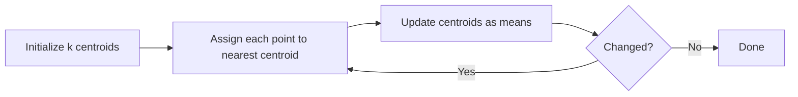

# 1.12 — K-Means Clustering

## 1. Intuition first

Given unlabeled points, group them into $k$ clusters by iteratively:
1. Assigning each point to its nearest cluster center.
2. Re-computing centers as the mean of assigned points.

Repeat until nothing changes.

## 2. Why the topic exists

The default first-shot at unsupervised learning. Extremely fast, easy to understand, and the workhorse of vector quantization / codebook building.

## 3. What problem it solves

Unsupervised grouping of points, customer segmentation, image compression (color quantization), initialization for other algorithms.

## 4. Mathematics

Minimize the within-cluster sum of squares (WCSS):

$$
J(\mathbf{C}, \mathbf{\mu}) = \sum_{i=1}^n \|\mathbf{x}_i - \boldsymbol\mu_{c_i}\|^2
$$

where $c_i \in \{1, \ldots, k\}$ is the assignment and $\boldsymbol\mu_c$ the centroid of cluster $c$.

Alternating optimization (Lloyd's algorithm):

1. **Assignment step:** $c_i = \arg\min_c \|\mathbf{x}_i - \boldsymbol\mu_c\|^2$.
2. **Update step:** $\boldsymbol\mu_c = \frac{1}{|S_c|}\sum_{i \in S_c} \mathbf{x}_i$.

$J$ never increases → converges (to a local minimum).

## 5. Every formula explained

- WCSS = total squared distance from points to their assigned centers → measure of tightness.
- Assignment step reduces $J$ w.r.t. $c$; update step reduces w.r.t. $\mu$; hence overall decreases.

## 6. Variables

| Symbol | Meaning |
|--------|---------|
| $k$ | number of clusters |
| $c_i$ | cluster of point $i$ |
| $\boldsymbol\mu_c$ | centroid of cluster $c$ |
| $S_c$ | set of points in cluster $c$ |

## 7. Algorithm

1. Initialize centroids (k-means++ recommended).
2. Repeat until assignments stop changing (or max iterations):
   1. Assign each point to nearest centroid.
   2. Recompute centroids.

**k-means++ init**: pick first centroid uniformly; sample subsequent centroids with probability proportional to squared distance from nearest already-chosen centroid.

**Choosing k**: elbow method (WCSS vs $k$), silhouette score, gap statistic, domain knowledge.

## 8. Simple example

3 blobs in 2D. Initialize 3 random centers; after ~5 iterations, converges to the true cluster centers.

## 9. Real-world example

- Color-palette reduction in image compression.
- Customer segmentation for marketing.
- Vector quantization for embedding compression (IVF-PQ).

## 10. Diagram

```
Iteration 1                Iteration N
  o o                        o o
    o o    x                   o o    x
  o        (init)            o
       *                          x  (converged)
    x        o                   x        o
```



## 11. Implementation from scratch

```python
import numpy as np

def kmeans(X, k, n_iter=100, seed=0):
    rng = np.random.default_rng(seed)
    # k-means++ init
    centers = [X[rng.integers(len(X))]]
    for _ in range(k - 1):
        d2 = np.min(np.linalg.norm(X[:, None] - np.array(centers)[None], axis=-1) ** 2, axis=1)
        probs = d2 / d2.sum()
        centers.append(X[rng.choice(len(X), p=probs)])
    centers = np.array(centers)

    for _ in range(n_iter):
        d = np.linalg.norm(X[:, None] - centers[None], axis=-1)
        labels = d.argmin(axis=1)
        new_centers = np.array([X[labels == c].mean(axis=0) if (labels == c).any()
                                else centers[c] for c in range(k)])
        if np.allclose(new_centers, centers): break
        centers = new_centers
    return labels, centers
```

## 12. Implementation using libraries

```python
from sklearn.cluster import KMeans, MiniBatchKMeans
km = KMeans(n_clusters=8, init="k-means++", n_init=10, random_state=42).fit(X)
km.labels_, km.cluster_centers_, km.inertia_

mbk = MiniBatchKMeans(n_clusters=100, batch_size=1024).fit(X_big)
```

## 13. Time complexity

O(t × n × k × d) per Lloyd iteration.

## 14. Space complexity

O((n + k) × d).

## 15. Advantages

- Fast, simple, scalable (MiniBatch, K-means||).
- Interpretable centroids.
- Great initialization for other methods (VAE codebook, GMM).

## 16. Disadvantages

- Assumes spherical, equal-variance clusters.
- Must specify $k$.
- Sensitive to initialization & outliers.
- Struggles with non-convex clusters.

## 17. Interview questions

1. Prove that Lloyd's algorithm decreases WCSS every iteration.
2. Difference between k-means and k-medoids.
3. Explain k-means++.
4. How to choose $k$?
5. When does k-means fail? (Elongated / nested / different-density clusters.)
6. K-means vs DBSCAN.
7. How is k-means related to Gaussian Mixture Models?
8. What is the time complexity per iteration?
9. Why do we normalize features?
10. What is Mini-Batch K-Means?

## 18. Common mistakes

- Skipping feature scaling.
- Using WCSS to compare across different $k$ without normalizing.
- Running once without multiple restarts (`n_init`).

## 19. Optimization techniques

- Mini-Batch, K-Means||, elkan (triangle-inequality) acceleration.
- Product quantization for high-dim.
- Warm-start from a subsample.

## 20. Coding exercises

1. Implement silhouette score from scratch.
2. Add DBSCAN and compare on moons/rings data.
3. Compress a photo by K-means color quantization to 16 colors.
4. Implement k-medoids (PAM).

## 21. Mini project

Cluster customer transactions into segments; profile each cluster and recommend a marketing action.

## 22. Medium project

Semantic clustering of news articles: encode with `sentence-transformers`, cluster with KMeans, name each cluster automatically via top-tfidf words.

## 23. Advanced project

Build an IVF-PQ ANN index from scratch (KMeans for coarse clustering + product quantization).

## 24. Where it is used in industry

Customer segmentation, image compression, ANN indexes, feature quantization, anomaly detection preprocessing.

## 25. How companies use it

- Marketing teams to build customer personas.
- Vector DB engines (FAISS-IVF) for large-scale ANN.
- Recommenders for item quantization.

## 26. When NOT to use it

- Non-convex or varying-density clusters — use DBSCAN, HDBSCAN, spectral.
- Categorical features — use k-modes.
- When $k$ has no natural meaning.
