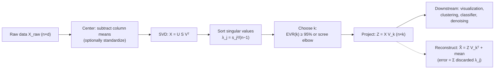
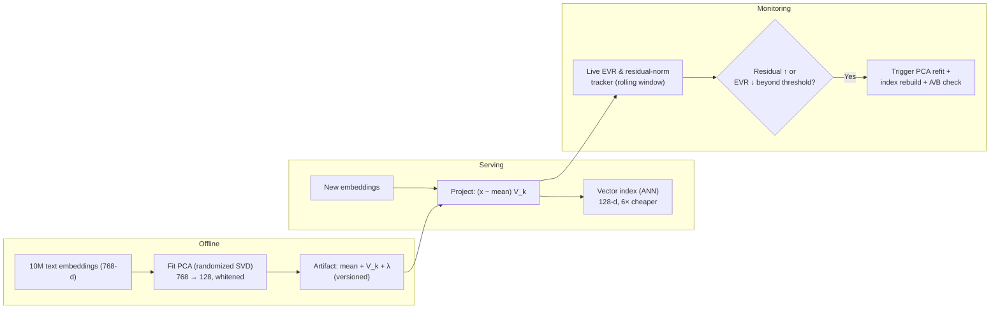

# 1.13 — Principal Component Analysis (PCA)

## 1. Overview

**What is it?** Principal Component Analysis is the fundamental algorithm for **linear dimensionality reduction**. It rotates the coordinate axes of your data so that the first new axis (the first *principal component*) points in the direction of greatest variance, the second captures the next-most variance while being orthogonal to the first, and so on. Keeping only the first $k$ axes compresses $d$-dimensional data into $k$ dimensions with the smallest possible (linear) information loss.

**Why does it exist?** High-dimensional data is expensive to store, slow to process, impossible to visualize, and often mostly redundant — features are correlated, and much of the apparent dimensionality is noise. PCA exposes the true low-dimensional structure: it decorrelates features, ranks directions by importance, and gives a principled recipe for throwing away the rest.

**What problem does it solve?** Unsupervised linear dimensionality reduction and decorrelation: compression, visualization (project to 2-D/3-D), denoising (small components are often noise), and speeding up downstream models by shrinking their input.

**Where is it used?** Everywhere tabular or embedding data gets large: preprocessing before clustering or classification, exploratory 2-D plots, genomics population-structure analysis, face recognition ("Eigenfaces"), latent-factor inspection in recommenders, drift detection, and whitening inputs for optimization-sensitive models.

## 2. Learning Objectives

After this chapter you will be able to:

- Define principal components as orthogonal directions of maximal variance and state the full optimization problem.
- Derive PCA from variance maximization using a Lagrange multiplier, showing why components are eigenvectors of the covariance matrix.
- Explain the equivalent view: PCA minimizes squared reconstruction error over all rank-$k$ linear projections.
- Prove and use the equivalence between covariance eigendecomposition and the SVD of the centered data matrix.
- Compute and interpret explained-variance ratios; choose $k$ via variance thresholds and scree plots.
- Explain why centering is mandatory and when standardization is also needed.
- Implement PCA from scratch with NumPy's SVD, including `transform` and `inverse_transform`.
- Use scikit-learn's `PCA`, `IncrementalPCA`, and `KernelPCA` appropriately.
- Explain whitening and its effect on downstream models.
- Describe kernel PCA and when non-linear manifolds defeat ordinary PCA.
- Analyze the complexity of full, truncated, and randomized SVD.
- Answer interview questions on PCA vs SVD, PCA vs autoencoders, and component interpretation.

## 3. Prerequisites

| Chapter | Why you need it |
|---|---|
| [Linear Algebra](../phase-0-prerequisites/02-linear-algebra.md) | Eigenvectors, eigenvalues, orthogonality, and the SVD are the entire substance of PCA. |
| [Probability & Statistics](../phase-0-prerequisites/04-probability-statistics.md) | Variance, covariance, and covariance matrices define what PCA maximizes. |
| [NumPy & Pandas](../phase-0-prerequisites/05-numpy-pandas.md) | The implementation is a handful of NumPy matrix operations. |
| [Calculus](../phase-0-prerequisites/03-calculus.md) | The variance-maximization derivation uses a Lagrange multiplier. |
| [ML Fundamentals](01-ml-fundamentals.md) | Overfitting and the curse of dimensionality motivate reducing dimensions. |
| [Feature Engineering](15-feature-engineering.md) | Scaling decisions (standardize or not) directly change what PCA finds. |

## 4. Intuition

Photograph a **flying frisbee**. The frisbee is a 3-D object, but almost all of its extent lies in a 2-D plane — the disc itself; its thickness is negligible. If you had to describe each point on the frisbee with only two numbers, you would obviously choose coordinates *within the disc plane*, not two arbitrary axes of the room. PCA finds that disc plane automatically, for any dataset in any dimension: the first two principal components span the plane where the data is widest, and the discarded third direction (the thickness) carries almost nothing.

An everyday story: a teacher records 10 scores per student — five math-related quizzes and five reading-related quizzes. The 10 numbers are heavily correlated: students good at algebra tend to be good at geometry. PCA applied to this data typically discovers two dominant components — one loading on all math quizzes (call it "quantitative ability") and one on all reading quizzes ("verbal ability") — compressing 10 correlated scores into 2 nearly-independent summary axes. Nothing about "math" or "verbal" was told to the algorithm; the correlation structure alone reveals it. (This is essentially how early psychometrics discovered the "g factor.")

The rotation picture is the one to internalize: PCA never distorts the data — it only **rotates** the axes (an orthogonal change of basis) so that variance is sorted along axes in decreasing order. Compression is then just dropping the low-variance tail.

## 5. Real-world Motivation

- **Genomics.** Population-genetics studies routinely reduce hundreds of thousands of SNP features to the top ~10 principal components; the first two PCs of European genotype data famously reproduce the geographic map of Europe. PCs are also included as covariates in genome-wide association studies to correct for population stratification.
- **Face recognition.** The classic "Eigenfaces" method (Turk & Pentland, 1991) represents faces as combinations of principal components of pixel space — a milestone of applied computer vision that shipped in early commercial face-recognition systems.
- **Recommenders and embeddings.** Teams at large tech companies use PCA to compress high-dimensional user/item embeddings before serving, to inspect latent factors, and to visualize embedding spaces; latent-factor models popularized in the Netflix Prize are close mathematical cousins (truncated SVD).
- **Finance.** Yield-curve movements across many maturities are summarized by three PCs universally known as *level, slope, and curvature* — a textbook demonstration that a few components can capture nearly all variance of a complex system.
- **Monitoring and drift detection.** Production ML systems compare the principal subspace of incoming feature data over time; a rotation of the top components is a cheap, sensitive signal that the data distribution has shifted.

## 6. Mathematical Foundations

### 6.1 Setup and centering

Let $X_{\text{raw}} \in \mathbb{R}^{n \times d}$ hold $n$ samples of $d$ features. Compute the mean row $\bar{\mathbf{x}} = \frac{1}{n}\sum_i \mathbf{x}_i$ and center: $X = X_{\text{raw}} - \mathbf{1}\bar{\mathbf{x}}^T$, where $\mathbf{1} \in \mathbb{R}^n$ is the all-ones vector. Centering is mandatory: variance is defined around the mean, and skipping it makes the first "component" point at the data's mean offset instead of its spread.

The **sample covariance matrix** is

$$
\Sigma = \frac{1}{n-1} X^T X \in \mathbb{R}^{d \times d},
$$

symmetric and positive semi-definite; entry $\Sigma_{ab}$ is the covariance between features $a$ and $b$.

### 6.2 Derivation from variance maximization

Find the unit vector $\mathbf{v} \in \mathbb{R}^d$ maximizing the variance of the data projected onto it. The projection of sample $i$ is the scalar $z_i = \mathbf{v}^T\mathbf{x}_i$, and since the data is centered, the projected variance is

$$
\operatorname{Var}(z) = \frac{1}{n-1}\sum_{i=1}^n (\mathbf{v}^T \mathbf{x}_i)^2 = \mathbf{v}^T \Big(\frac{1}{n-1} X^T X\Big) \mathbf{v} = \mathbf{v}^T \Sigma\, \mathbf{v}.
$$

Maximize subject to $\|\mathbf{v}\| = 1$ (otherwise variance grows without bound). Form the Lagrangian with multiplier $\lambda$:

$$
\mathcal{L}(\mathbf{v}, \lambda) = \mathbf{v}^T \Sigma \mathbf{v} - \lambda(\mathbf{v}^T\mathbf{v} - 1),
\qquad
\frac{\partial \mathcal{L}}{\partial \mathbf{v}} = 2\Sigma\mathbf{v} - 2\lambda\mathbf{v} = 0
\;\Rightarrow\;
\Sigma \mathbf{v} = \lambda \mathbf{v}.
$$

So any stationary point is an **eigenvector** of $\Sigma$, and its projected variance is $\mathbf{v}^T\Sigma\mathbf{v} = \lambda \mathbf{v}^T\mathbf{v} = \lambda$ — the eigenvalue itself. The maximizer is therefore the eigenvector with the **largest** eigenvalue. Repeating the argument in the orthogonal complement of already-chosen components shows the $j$-th principal component is the eigenvector with the $j$-th largest eigenvalue. Sort $\lambda_1 \ge \lambda_2 \ge \cdots \ge \lambda_d \ge 0$ with eigenvectors $\mathbf{v}_1, \ldots, \mathbf{v}_d$.

### 6.3 Projection, reconstruction, explained variance

Stack the top-$k$ eigenvectors as columns of $V_k \in \mathbb{R}^{d \times k}$. Then:

$$
Z = X V_k \in \mathbb{R}^{n \times k} \quad \text{(scores / projected data)},
\qquad
\tilde{X} = Z V_k^T + \mathbf{1}\bar{\mathbf{x}}^T \quad \text{(reconstruction)}.
$$

The **minimum-reconstruction-error view**: among *all* rank-$k$ orthogonal projections, $V_k$ minimizes $\|X - X V_k V_k^T\|_F^2$ (Frobenius norm = summed squared entries). Sketch: total variance $\operatorname{tr}(\Sigma) = \sum_j \lambda_j$ splits into variance kept plus variance lost; the error equals $\sum_{j > k} \mathbf{u}_j^T \Sigma \mathbf{u}_j$ over the discarded directions $\mathbf{u}_j$, which is minimized by discarding the smallest-eigenvalue directions. Maximizing kept variance and minimizing reconstruction error are the same problem — a special case of the Eckart–Young theorem.

The **explained variance ratio** of the top $k$ components:

$$
\text{EVR}(k) = \frac{\sum_{j=1}^{k} \lambda_j}{\sum_{j=1}^{d} \lambda_j}.
$$

A common recipe: choose the smallest $k$ with $\text{EVR}(k) \ge 0.95$.

### 6.4 SVD equivalence

The **singular value decomposition** of the centered data matrix is $X = U S V^T$, where $U \in \mathbb{R}^{n \times r}$ and $V \in \mathbb{R}^{d \times r}$ have orthonormal columns, $S = \operatorname{diag}(s_1 \ge \cdots \ge s_r \ge 0)$, and $r = \min(n, d)$. Then

$$
\Sigma = \frac{1}{n-1} X^T X = \frac{1}{n-1} V S U^T U S V^T = V \frac{S^2}{n-1} V^T,
$$

which is exactly the eigendecomposition of $\Sigma$: right singular vectors $V$ = principal components, and

$$
\lambda_j = \frac{s_j^2}{n-1}.
$$

Moreover the scores are $Z = XV = US$ — no covariance matrix needed. In practice **always use the SVD**: it avoids forming $X^TX$ (which squares the condition number, amplifying floating-point error) and avoids the $O(d^2)$ memory of $\Sigma$ when $d$ is large.

### 6.5 Whitening

Whitening rescales each score by its standard deviation: $Z_{\text{white}} = X V_k \Lambda_k^{-1/2}$ where $\Lambda_k = \operatorname{diag}(\lambda_1, \ldots, \lambda_k)$. The result has identity covariance — all directions equally scaled — which helps optimization-sensitive downstream algorithms but deliberately discards the information that some directions mattered more.

### 6.6 Kernel PCA

Ordinary PCA finds linear structure. **Kernel PCA** applies the kernel trick (see [SVM](11-svm.md)): implicitly map data through $\phi$ into a high-dimensional feature space and do PCA there, using only the kernel matrix $K_{ij} = k(\mathbf{x}_i, \mathbf{x}_j)$ (e.g., RBF $k(\mathbf{x}, \mathbf{x}') = \exp(-\gamma\|\mathbf{x}-\mathbf{x}'\|^2)$). Steps: (1) double-center the kernel matrix, $\tilde{K} = (I - \tfrac{1}{n}\mathbf{1}\mathbf{1}^T) K (I - \tfrac{1}{n}\mathbf{1}\mathbf{1}^T)$, which centers the data *in feature space*; (2) eigendecompose $\tilde{K} = A \Lambda A^T$; (3) the $k$-dimensional embedding of point $i$ is row $i$ of $A_k \Lambda_k^{1/2}$. Cost is $O(n^2)$ memory and $O(n^3)$ time — fine for thousands of points, not millions — and there is no exact inverse map back to input space (the "pre-image problem").

**Symbol glossary:** $n$ = samples; $d$ = features; $k$ = kept components; $X$ = centered data $(n \times d)$; $\bar{\mathbf{x}}$ = feature means; $\Sigma$ = covariance $(d \times d)$; $\mathbf{v}_j, \lambda_j$ = $j$-th eigenvector/eigenvalue; $V_k$ = top-$k$ eigenvectors $(d \times k)$; $Z$ = scores $(n \times k)$; $U, S, V$ = SVD factors; $s_j$ = singular values; $\lambda$ (in 6.2) = Lagrange multiplier; $K$ = kernel matrix $(n \times n)$; $\gamma$ = RBF width.

## 7. Visual Explanation

```
Original axes (correlated data)        After PCA rotation
     x2                                     PC2 (small variance)
      |        o                             |
      |      o o                             |   o o o o o o o o
      |    o o                          -----+------------------- PC1
      |  o o                                 |   o o o o o o o    (large
      | o o                                  |                     variance)
      +------------------ x1
   Data lies along a diagonal line     Same points; axes rotated so PC1
   → x1 and x2 are redundant           carries the spread, PC2 mostly noise
```



## 8. Algorithm

1. **Center** the data: subtract each feature's mean (computed on the *training* set). If features have incomparable units, also divide by each feature's standard deviation (this makes PCA operate on the correlation matrix instead of the covariance matrix).
2. **Factorize:** compute the thin SVD $X = USV^T$ (numerically preferred over eigendecomposing $\Sigma$).
3. **Rank:** eigenvalues are $\lambda_j = s_j^2/(n-1)$, already sorted by the SVD.
4. **Choose $k$:** smallest $k$ with cumulative EVR above a threshold (e.g., 0.95), or by scree-plot elbow, or fixed by the application (2 for plots).
5. **Project:** $Z = X V_k$ (equivalently $U_k S_k$).
6. **(Optional) whiten:** divide each score column by $\sqrt{\lambda_j}$.
7. **(Optional) reconstruct:** $\tilde{X} = Z V_k^T + \bar{\mathbf{x}}$; reconstruction MSE equals $\sum_{j>k}\lambda_j$.

Pseudocode:

```text
Input: X_raw (n×d), variance target τ (e.g. 0.95)
mean ← column_means(X_raw)          # (d,)
X ← X_raw − mean                     # center (broadcast over rows)
U, S, Vt ← thin_SVD(X)               # U:(n×r), S:(r,), Vt:(r×d), r=min(n,d)
lam ← S² / (n−1)                     # eigenvalues, descending
evr ← cumsum(lam) / sum(lam)
k ← smallest index with evr[k] ≥ τ
V_k ← first k rows of Vt, transposed # (d×k)
Z ← X @ V_k                          # scores (n×k)
return mean, V_k, lam, Z
# transform(new):  (new − mean) @ V_k
# inverse(Z):      Z @ V_kᵀ + mean
```

## 9. Worked Example

**Tiny example by hand.** Four 2-D points: $(1,1), (2,2), (3,3), (4,4)$ plus a small perturbation on the last: use $(4, 4.2)$ to keep it interesting.

*Center.* Means: $\bar{x}_1 = (1+2+3+4)/4 = 2.5$, $\bar{x}_2 = (1+2+3+4.2)/4 = 2.55$. Centered rows: $(-1.5, -1.55), (-0.5, -0.55), (0.5, 0.45), (1.5, 1.65)$.

*Covariance.* With $n - 1 = 3$:
$\Sigma_{11} = \frac{(-1.5)^2 + (-0.5)^2 + 0.5^2 + 1.5^2}{3} = \frac{5}{3} \approx 1.667$;
$\Sigma_{12} = \frac{(-1.5)(-1.55) + (-0.5)(-0.55) + (0.5)(0.45) + (1.5)(1.65)}{3} = \frac{5.30}{3} \approx 1.767$;
$\Sigma_{22} = \frac{1.55^2 + 0.55^2 + 0.45^2 + 1.65^2}{3} = \frac{5.63}{3} \approx 1.877$.

*Eigenvalues.* Solve $\det(\Sigma - \lambda I) = 0$: $\lambda^2 - (1.667 + 1.877)\lambda + (1.667 \cdot 1.877 - 1.767^2) = 0$, i.e. $\lambda^2 - 3.544\lambda + 0.00593 = 0$, giving $\lambda_1 \approx 3.542$, $\lambda_2 \approx 0.0017$. EVR of one component: $3.542 / 3.544 \approx 99.95\%$ — the data is essentially 1-dimensional, as expected for points hugging the diagonal.

*Eigenvector.* $(\Sigma - \lambda_1 I)\mathbf{v} = 0 \Rightarrow (1.667 - 3.542)v_1 + 1.767 v_2 = 0 \Rightarrow v_2 \approx 1.061 v_1$; normalized $\mathbf{v}_1 \approx (0.686, 0.728)$ — the diagonal direction, slightly tilted toward $x_2$ because of the extra $0.2$. Projecting each centered point onto $\mathbf{v}_1$ gives the 1-D compressed representation; reconstruction error is $\lambda_2 \approx 0.0017$ per the theory.

**Realistic example.** MNIST digits: each image is a 784-dimensional pixel vector. PCA finds that ~150 components explain 95% of the variance — a 5× compression — and a 2-D PCA plot already partially separates 0s, 1s, and other digit groups. Training a logistic-regression classifier on 150 PCs instead of 784 pixels runs ~5× faster with essentially the same accuracy, and reconstructing images from 50 components yields recognizable but smoothed digits (the discarded components carry stroke-level noise).

## 10. Python from Scratch

```python
import numpy as np

class PCA:
    """PCA via thin SVD of the centered data matrix. No ML libraries."""

    def __init__(self, n_components):
        self.k = n_components

    def fit(self, X):
        X = np.asarray(X, dtype=float)            # (n, d)
        self.mean_ = X.mean(axis=0)               # (d,) training means
        Xc = X - self.mean_                       # center (broadcast rows)

        # Thin SVD: Xc = U @ diag(S) @ Vt
        #   U:(n,r)  S:(r,)  Vt:(r,d),  r = min(n,d); S is sorted descending.
        U, S, Vt = np.linalg.svd(Xc, full_matrices=False)

        self.components_ = Vt[: self.k]           # (k, d) principal axes
        self.singular_values_ = S[: self.k]       # (k,)

        var = S ** 2 / (len(X) - 1)               # (r,) eigenvalues λ_j
        self.explained_variance_ = var[: self.k]
        self.explained_variance_ratio_ = var[: self.k] / var.sum()
        return self

    def transform(self, X):
        # Project NEW data with the TRAINING mean — never re-center on test data.
        return (np.asarray(X, float) - self.mean_) @ self.components_.T  # (n, k)

    def inverse_transform(self, Z):
        # Map scores back to input space (lossy if k < d).
        return Z @ self.components_ + self.mean_                          # (n, d)


# --- Demo: pancake data, 3-D points that are really 2-D ----------------
rng = np.random.default_rng(0)
n = 500
flat = rng.normal(size=(n, 2)) * [3.0, 1.0]       # wide 2-D pancake
noise = rng.normal(scale=0.05, size=(n, 1))       # tiny thickness
X3 = np.hstack([flat, noise])                     # (500, 3)
# Rotate into a random 3-D orientation so no raw axis is "the answer".
Q, _ = np.linalg.qr(rng.normal(size=(3, 3)))      # random orthogonal matrix
X3 = X3 @ Q.T

pca = PCA(n_components=2).fit(X3)
print(np.round(pca.explained_variance_ratio_, 4))
# expected ≈ [0.90, 0.10] — and their sum ≈ 0.9997: the 3rd axis is noise.

Z = pca.transform(X3)                             # (500, 2) compressed
X_rec = pca.inverse_transform(Z)                  # (500, 3) reconstruction
print(f"reconstruction MSE = {((X3 - X_rec) ** 2).mean():.6f}")
# expected ≈ 0.05²·(1/3) ≈ 0.0008 — the discarded thickness variance.
```

- **Complexity:** thin SVD of an $n \times d$ matrix costs $O(\min(nd^2, n^2 d))$ time and $O(nd)$ memory; `transform` is one $(n \times d)(d \times k)$ product, $O(ndk)$.
- **Common bug:** forgetting `self.mean_` at transform time (or re-computing the mean on test data). Both silently shift test projections relative to training projections; the second also leaks test-set statistics. The rule: **fit statistics on train, reuse everywhere** — same principle as scalers in [Feature Engineering](15-feature-engineering.md). (A subtler gotcha: SVD signs are arbitrary — your components may be the negative of another library's. Compare with `np.abs` or align signs first.)

## 11. Library Implementation

```python
import numpy as np
from sklearn.decomposition import PCA, IncrementalPCA, KernelPCA
from sklearn.pipeline import make_pipeline
from sklearn.preprocessing import StandardScaler
from sklearn.linear_model import LogisticRegression

# ---- Standard PCA: keep 95% of variance --------------------------------
pca = PCA(n_components=0.95, svd_solver="full")   # float in (0,1) → EVR target
Z = pca.fit_transform(X)                          # centers internally
print(pca.n_components_)                          # k actually chosen
print(pca.explained_variance_ratio_.cumsum())     # monotone → ends ≥ 0.95

# ---- Standardize first when units differ -------------------------------
# Without scaling, a feature measured in large units dominates the variance
# and PCA just finds THAT feature. Pipeline keeps it leakage-free under CV.
clf = make_pipeline(StandardScaler(), PCA(n_components=50),
                    LogisticRegression(max_iter=1000))
clf.fit(X_train, y_train)                          # PCA fit on train folds only

# ---- Randomized solver: large data, small k ----------------------------
pca_fast = PCA(n_components=50, svd_solver="randomized", random_state=0)
# O(n·d·k) instead of O(n·d·min(n,d)) — the right choice when k << d.

# ---- IncrementalPCA: data does not fit in memory ------------------------
ipca = IncrementalPCA(n_components=50, batch_size=1000)
for chunk in np.array_split(X_big, 100):           # or stream from disk
    ipca.partial_fit(chunk)                        # updates mean & components

# ---- KernelPCA: non-linear manifolds ------------------------------------
kpca = KernelPCA(n_components=2, kernel="rbf", gamma=0.1,
                 fit_inverse_transform=True)       # learn approximate pre-image
Z_nl = kpca.fit_transform(X)                       # O(n²) memory, O(n³) time
```

Line-by-line notes: passing a float to `n_components` makes scikit-learn pick $k$ automatically from cumulative EVR. `PCA` centers the data itself but does **not** scale — add `StandardScaler` when units differ. `svd_solver="randomized"` (auto-chosen for large inputs) implements Halko et al.'s randomized SVD. `KernelPCA`'s `fit_inverse_transform=True` learns a regression-based approximate pre-image, since no exact inverse exists.

## 12. Code Walkthrough

Shapes and intermediates for the from-scratch pancake demo ($n = 500$, $d = 3$, $k = 2$):

| Tensor | Shape | Meaning |
|---|---|---|
| `X3` | (500, 3) | Input: rotated pancake (2 real dims + tiny noise dim) |
| `self.mean_` | (3,) | Per-feature training means |
| `Xc` | (500, 3) | Centered data |
| `U` | (500, 3) | Left singular vectors (normalized score directions) |
| `S` | (3,) | Singular values, descending |
| `Vt` | (3, 3) | Right singular vectors as rows; rows 0–1 = kept components |
| `self.components_` | (2, 3) | Principal axes spanning the pancake plane |
| `Z` | (500, 2) | Compressed representation (scores) |
| `X_rec` | (500, 3) | Rank-2 reconstruction |

Expected results: `explained_variance_ratio_` ≈ `[0.90, 0.10]` (the pancake was 3× wider along one in-plane axis than the other), summing to ≈ 0.9997; the residual ≈ 0.0003 is the noise thickness. Reconstruction MSE ≈ $\sigma_{\text{noise}}^2/3 \approx 8 \times 10^{-4}$ — exactly $\sum_{j>k}\lambda_j / d$, confirming the theory numerically. The recovered `components_` rows span the same plane as the original pancake even after the random rotation `Q`: verify with `np.abs(pca.components_ @ Q[:, :2])` being close to an orthogonal 2×2 matrix.

## 13. Complexity Analysis

- **Full/thin SVD:** $O(\min(nd^2, n^2d))$ time — cubic-ish in the smaller dimension, from the underlying bidiagonalization; memory $O(nd)$.
- **Covariance route:** forming $\Sigma$ costs $O(nd^2)$ plus $O(d^3)$ for its eigendecomposition and $O(d^2)$ memory — attractive only when $d \ll n$ and $d$ is small; numerically worse (squares the condition number).
- **Randomized SVD:** $O(ndk)$ time with a small oversampling constant — the practical choice when $k \ll \min(n, d)$; a few power iterations sharpen accuracy on slowly decaying spectra.
- **IncrementalPCA:** $O(ndk)$ total across batches with only $O(bd + dk)$ resident memory for batch size $b$ — the out-of-core option.
- **Kernel PCA:** $O(n^2)$ memory for the kernel matrix and $O(n^3)$ time for its eigendecomposition — caps practical $n$ at a few tens of thousands.
- **Transform (all variants):** $O(ndk)$ for $n$ points — one matrix multiply.

## 14. Advantages

- **Optimal linear compression.** Provably minimal reconstruction error among all rank-$k$ linear maps (Eckart–Young) — e.g., 784-pixel MNIST → 150 dims at 95% variance retained.
- **Deterministic and hyperparameter-light.** Unlike t-SNE/UMAP/autoencoders, PCA has essentially one knob ($k$) and always returns the same answer — ideal for reproducible pipelines.
- **Decorrelates features.** Scores have diagonal covariance, which helps regression stability with collinear inputs (compare [Regularization](05-regularization.md)'s treatment of multicollinearity).
- **Denoises.** Small components are dominated by noise; truncating them can *improve* downstream accuracy — routinely observed on genomics and spectroscopy data.
- **Fast at scale.** Randomized and incremental variants handle millions of rows; transform is a single matrix multiply, trivially cheap at serving time.
- **A superb diagnostic.** Two lines of code give a 2-D map of any embedding or tabular dataset — often the first plot an ML engineer makes.

## 15. Disadvantages

- **Strictly linear.** A Swiss-roll manifold or concentric rings have low intrinsic dimension but PCA cannot unroll them — the best linear plane slices through the structure. Use kernel PCA, UMAP, t-SNE, or autoencoders.
- **Variance ≠ relevance.** PCA is unsupervised; the discriminative direction for your labels may hide in component 47. A classifier on top-$k$ PCs can lose crucial signal (supervised alternatives: LDA, PLS).
- **Scaling-sensitive.** Change a feature from meters to millimeters and the "principal" directions change completely; the standardize-or-not decision materially alters results.
- **Reduced interpretability.** Each PC is a weighted mix of all original features ("0.3·age − 0.5·income + …"), hard to explain to stakeholders; sparse PCA trades variance for interpretable loadings.
- **Sensitive to outliers.** Variance is a squared quantity; a handful of extreme rows can hijack the top components (robust PCA decomposes into low-rank + sparse-outlier parts).
- **Mean/rotation drift.** In production, components fitted on last year's data may misrepresent this year's — the projection silently degrades unless monitored.

## 16. Common Mistakes

- **Not centering** (when implementing by hand — libraries do it for you). The first component then chases the mean offset. Fix: always subtract training means.
- **Fitting PCA on the full dataset before the train/test split.** Test-set statistics leak into the components — inflated evaluation. Fix: put PCA inside a `Pipeline` so CV refits it per fold.
- **Ignoring the scaling question.** Covariance PCA on mixed-unit features = the biggest-unit feature wins. Fix: standardize when units differ; keep raw scale only when features share units and their variance differences are meaningful (e.g., pixels).
- **Choosing $k$ by gut.** Fix: plot cumulative EVR and the scree curve; justify the threshold.
- **Interpreting component signs.** Eigenvector signs are arbitrary ($\mathbf{v}$ and $-\mathbf{v}$ are both valid); "PC1 is positively correlated with income" may flip on refit. Fix: fix a sign convention (e.g., largest-magnitude loading positive) before interpreting.
- **Using PCA for feature *selection*.** PCA builds new features; it does not tell you which original columns to drop. Fix: use mutual information, permutation importance, or L1 for selection.
- **Running t-SNE/UMAP conclusions through PCA logic.** Those methods do not preserve global distances or variance; PCA does (linearly). Know which tool made your picture.

## 17. Best Practices

- [ ] Put `StandardScaler` (if units differ) and `PCA` inside one `Pipeline`; fit only on training folds.
- [ ] Report cumulative EVR at your chosen $k$, and keep the scree plot in the experiment log.
- [ ] Use `svd_solver="randomized"` for $d$ or $n$ in the tens of thousands with small $k$; `IncrementalPCA` when data exceeds RAM.
- [ ] Persist the fitted PCA (means + components) with the model artifact; serving must project with training statistics.
- [ ] Sanity-check reconstructions: `inverse_transform(transform(X))` error should match $\sum_{j>k}\lambda_j$; a mismatch means a centering/scaling bug.
- [ ] Monitor in production: track EVR of live data projected on training components; a drop signals distribution drift.
- [ ] Before interpreting loadings, stabilize signs and check loading stability across bootstrap refits.
- [ ] For visualization narratives, prefer PCA when global structure/axes matter, UMAP/t-SNE when local neighborhoods matter — and say which you used.

## 18. Optimization Techniques

- **Randomized SVD** (Halko–Martinsson–Tropp): project onto a random $k{+}p$-dimensional sketch, orthogonalize, and solve a tiny SVD — $O(ndk)$; add 2–4 power iterations when the spectrum decays slowly. This is scikit-learn's `svd_solver="randomized"`.
- **Incremental / out-of-core PCA:** update means and a truncated basis batch-by-batch (`partial_fit`); constant memory regardless of $n$.
- **Sparse PCA:** add an L1 penalty on loadings so each component touches few features — interpretability at some variance cost.
- **Kernel approximations for kernel PCA:** Nyström landmarks or Random Fourier Features (see [SVM](11-svm.md) §18) reduce the $O(n^3)$ eigendecomposition to linear-time approximate embeddings.
- **GPU execution:** PCA is pure matrix algebra; `torch.pca_lowrank` or cuML's PCA runs the same computation on GPU for large embedding matrices.
- **Precision management:** compute the SVD in float64 even if data ships in float32 — small singular values are easily swamped by rounding; cast scores back down afterwards.

## 19. Industry Applications

- **Genomics & biotech.** PC plots and PC covariates are standard in every large genotype study (1000 Genomes, UK Biobank analyses); consumer-genetics ancestry reports rest on the same math.
- **Face and image processing.** Eigenfaces powered early commercial face recognition; PCA remains a common embedding-compression and denoising step in vision pipelines.
- **Recommenders.** Truncated SVD of interaction matrices (the Netflix Prize workhorse) and PCA compression of learned embeddings before ANN serving are both routine at large streaming and e-commerce platforms.
- **Quantitative finance.** Level/slope/curvature yield-curve factors, statistical-arbitrage factor models, and risk decompositions are PCA applications running daily at banks and funds.
- **Manufacturing & monitoring.** Multivariate statistical process control projects sensor streams onto principal subspaces and alarms on residuals (e.g., Hotelling's $T^2$ and Q charts) — deployed across chemical and semiconductor plants.
- **ML infrastructure.** Vector databases and retrieval systems use PCA (or its cousin OPQ) to shrink embeddings before product quantization — see the IVF-PQ project in [K-Means](12-kmeans.md).

## 20. Interview Questions

### Beginner

- **Q: What does PCA do, in one sentence?**
  **A:** It rotates the data to a new orthogonal basis ordered by variance and keeps the top $k$ directions, giving the best possible $k$-dimensional linear compression.
- **Q: What is an eigenvalue in the PCA context?**
  **A:** The variance of the data along the corresponding eigenvector (principal component); the sum of all eigenvalues is the total variance.
- **Q: Why must data be centered before PCA?**
  **A:** Variance and covariance are defined about the mean. Without centering, the leading singular vector points from the origin toward the data mean — an artifact of offset, not spread.
- **Q: How do you choose the number of components?**
  **A:** Cumulative explained-variance thresholds (e.g., 95%), the scree-plot elbow, downstream cross-validated performance, or the application's needs (2 for plotting).
- **Q: Is PCA supervised or unsupervised?**
  **A:** Unsupervised — it never sees labels, so its directions maximize variance, not class separability (LDA is the supervised analogue).

### Intermediate

- **Q: Derive why principal components are eigenvectors of the covariance matrix.**
  **A:** Maximize projected variance $\mathbf{v}^T\Sigma\mathbf{v}$ subject to $\|\mathbf{v}\| = 1$; the Lagrangian $\mathbf{v}^T\Sigma\mathbf{v} - \lambda(\mathbf{v}^T\mathbf{v} - 1)$ has stationarity condition $\Sigma\mathbf{v} = \lambda\mathbf{v}$, so candidates are eigenvectors, each attaining variance $\lambda$; the top eigenvector wins, and subsequent components repeat the argument orthogonally.
- **Q: Exactly how are PCA and SVD related?**
  **A:** For centered $X = USV^T$: right singular vectors $V$ are the principal components, eigenvalues are $\lambda_j = s_j^2/(n-1)$, and scores are $XV = US$. SVD is preferred numerically because it avoids forming $X^TX$, which squares the condition number.
- **Q: When do you standardize before PCA, and what changes?**
  **A:** Standardize when features have different units or wildly different scales; PCA then diagonalizes the *correlation* matrix rather than the covariance matrix. Without it, high-variance (large-unit) features dominate the components regardless of informativeness.
- **Q: What is whitening and when is it useful/harmful?**
  **A:** Rescaling scores by $1/\sqrt{\lambda_j}$ so the output has identity covariance. Useful for algorithms assuming isotropic inputs (some ICA, distance-based methods, certain optimizers); harmful when the variance ranking itself is signal, and it amplifies noise in tiny-eigenvalue directions.
- **Q: PCA vs linear autoencoder?**
  **A:** A linear autoencoder with MSE loss and a $k$-unit bottleneck learns the same subspace as PCA (though not necessarily the orthonormal ordered basis). Nonlinear autoencoders generalize PCA to curved manifolds at the cost of convexity, determinism, and interpretability.

### Advanced

- **Q: State the Eckart–Young theorem and its role in PCA.**
  **A:** The best rank-$k$ approximation to a matrix $X$ in Frobenius (or spectral) norm is the truncated SVD $X_k = U_k S_k V_k^T$, with error $\sum_{j>k} s_j^2$ (Frobenius²). PCA's reconstruction optimality is exactly this theorem applied to the centered data matrix.
- **Q: Why is eigendecomposing the covariance matrix numerically inferior to SVD on the data?**
  **A:** Forming $X^TX$ squares the condition number ($\kappa(X^TX) = \kappa(X)^2$), so small singular values fall below machine precision and their directions are computed inaccurately; the SVD works directly on $X$ and resolves them stably.
- **Q: Sketch randomized SVD and why it works.**
  **A:** Multiply $Y = X\Omega$ with a random Gaussian $\Omega \in \mathbb{R}^{d \times (k+p)}$; with high probability $Y$'s range captures the top-$k$ left singular subspace (random vectors are almost surely non-orthogonal to it, and top directions amplify most). Orthogonalize $Y = QR$, form the small matrix $B = Q^TX$, take its exact SVD, and lift back. Cost $O(ndk)$; power iterations $(XX^T)^qY$ sharpen separation when singular values decay slowly.
- **Q: Walk through kernel PCA, including why the kernel matrix must be double-centered.**
  **A:** PCA in feature space needs centered features $\tilde\phi(\mathbf{x}_i) = \phi(\mathbf{x}_i) - \frac{1}{n}\sum_l \phi(\mathbf{x}_l)$; we can't compute $\phi$ but inner products of centered features expand into $\tilde{K} = K - \mathbf{1}_nK/n - K\mathbf{1}_n/n + \mathbf{1}_nK\mathbf{1}_n/n^2$ — the double-centering. Eigendecompose $\tilde{K} = A\Lambda A^T$; embeddings are $A_k\Lambda_k^{1/2}$. New points use the centered cross-kernel; there is no exact pre-image back in input space.
- **Q: Your top-2 PC scatter plot shows clean class separation, but a classifier on the top-50 PCs underperforms raw features. Explain.**
  **A:** PCA ranks by variance, not label relevance. The plot shows classes *happen* to vary along high-variance directions, but part of the discriminative signal evidently lives in the discarded low-variance components (e.g., subtle feature differences). Remedies: increase $k$, use supervised reduction (LDA/PLS), or skip reduction and regularize instead.

## 21. Coding Exercises

### Easy

1. **PCA = SVD, numerically.** Fit your from-scratch PCA and `sklearn.decomposition.PCA` on the same data; show components match up to sign and EVRs match to 10 decimals. *Hint: compare `np.abs(a) - np.abs(b)` or align signs via the largest-magnitude loading.*
2. **Scree and cumulative-EVR plots.** For the digits dataset (`load_digits`), plot eigenvalues and cumulative EVR; report $k$ for 90%, 95%, 99% variance. *Hint: `PCA().fit(X).explained_variance_ratio_.cumsum()`.*

### Medium

1. **Eigenfaces reconstruction curve.** On LFW faces, plot reconstruction MSE vs $k \in \{10, 25, 50, 100, 200\}$ and display one face reconstructed at each $k$. *Hint: `inverse_transform(transform(x))`; use `imshow` on the reshaped vector.*
2. **Scaling ablation.** Run PCA on a mixed-unit dataset (e.g., California housing) with and without standardization; compare the top component's loadings. *Hint: without scaling, expect one large-unit feature to carry ~all of PC1.*
3. **PCA vs t-SNE/UMAP.** Project MNIST (subsample 5k) to 2-D with all three; discuss which preserves global structure vs local neighborhoods. *Hint: color by digit label; measure trustworthiness with `sklearn.manifold.trustworthiness`.*

### Hard

1. **Kernel PCA from scratch.** Implement RBF kernel PCA with double-centering; unroll `make_swiss_roll` and show ordinary PCA failing on the same data. *Hint: $\tilde{K} = HKH$ with $H = I - \frac{1}{n}\mathbf{1}\mathbf{1}^T$; scale eigenvectors by $1/\sqrt{\lambda}$ before embedding.*
2. **Randomized SVD from scratch.** Implement Halko-style randomized SVD with oversampling $p = 10$ and $q \in \{0, 2\}$ power iterations; benchmark accuracy (top-$k$ singular values vs exact) and speed on a 50,000 × 2,000 matrix. *Hint: re-orthogonalize with QR between power iterations for stability.*
3. **Streaming PCA.** Implement Oja's rule ($\mathbf{v} \leftarrow \mathbf{v} + \eta\, \mathbf{x}(\mathbf{x}^T\mathbf{v})$, renormalize) for the top component of a stream; show convergence to the batch answer and study the effect of $\eta$. *Hint: decay $\eta_t = c/t$; measure $|\cos\angle(\mathbf{v}_t, \mathbf{v}^*)|$ over time.*

## 22. Mini Project

**Eigenfaces: face recognition with PCA features.**

1. Load `fetch_lfw_people(min_faces_per_person=70, resize=0.4)` — ~1,300 grayscale faces, 7 identities.
2. Split 75/25 stratified; fit `PCA(n_components=150, whiten=True)` on training images only.
3. Visualize the mean face and the top-16 eigenfaces as images (reshape components to the image grid).
4. Plot cumulative EVR; note $k$ at 90% and 95%.
5. Train a KNN classifier ([KNN](06-knn.md)) on the 150-d PCA scores; evaluate accuracy and per-class F1 ([Evaluation Metrics](14-evaluation-metrics.md)).
6. Repeat with $k \in \{25, 50, 100, 150, 250\}$; plot accuracy vs $k$ — find the sweet spot between too little signal and too much noise.
7. Show 5 test faces alongside their rank-150 reconstructions; comment on what information the kept subspace preserves (identity, lighting, pose?).

## 23. Medium Project

**PCA for high-dimensional genomics-style classification.**

1. Take a high-dimensional, low-sample dataset (e.g., a public gene-expression set with ~200 samples × ~20,000 features, or simulate one with a low-rank + noise structure).
2. Baseline A: L2-regularized logistic regression on all features (inside a scaling pipeline).
3. Baseline B: `PCA(n_components=…) → LogisticRegression` pipeline; sweep $k \in \{2, 5, 10, 20, 50, 100\}$ with 5-fold stratified CV.
4. Guard against leakage: verify PCA is refit inside every fold (use `Pipeline`; demonstrate the inflated score you get if you fit PCA on the full data first — quantify the gap).
5. Plot CV AUC vs $k$ and vs the L2 baseline; identify where PCA denoising helps and where it destroys discriminative signal.
6. Visualize the top-2 PC scores colored by class; overlay the loading vector of the most class-correlated PC and list its top-20 genes/features.
7. Write up: when did dimensionality reduction beat regularization alone, and what does that imply about the data's intrinsic rank?

## 24. Advanced Project

**Embedding-compression service with drift monitoring.**

*Architecture:*



*Implementation phases:*

1. **Data & baseline.** Embed a large corpus (e.g., 1–10M Wikipedia passages) with a sentence-transformer (768-d). Build a brute-force retrieval ground truth on 10k held-out queries (recall@10).
2. **Compression.** Fit randomized-SVD PCA to 128, 64, and 32 dims (fit on a 1M-row sample; float64 SVD). Measure retrieval recall@10 and index memory at each $k$; chart the quality–cost frontier.
3. **Serving path.** Package mean + components as a versioned artifact; implement a `project()` function and verify train/serve parity (same input → bit-identical output across offline and service code).
4. **Monitoring.** For each traffic window compute mean residual norm $\|x - V_kV_k^Tx\|$ and live EVR against the training components; alert on sustained shifts (this catches upstream embedding-model changes and domain drift).
5. **Refit workflow.** On alert: refit PCA on recent data, rebuild the index offline, and A/B compare retrieval metrics before switching.
6. *Possible improvements:* replace plain PCA with OPQ (learned rotation) before product quantization; per-tenant PCA for multi-domain corpora; incremental PCA to refresh components without full refits; evaluate whitening's effect on cosine-similarity retrieval (it can hurt — measure, don't assume).

## 25. Summary

- PCA finds orthogonal directions of maximal variance; components are eigenvectors of the covariance matrix $\Sigma = \frac{1}{n-1}X^TX$, eigenvalues are the variances along them.
- Two equivalent views: maximize kept variance ⇔ minimize squared reconstruction error (Eckart–Young).
- Compute via SVD of the centered data, not covariance eigendecomposition: $V$ = components, $\lambda_j = s_j^2/(n-1)$, scores $= US = XV$.
- Explained-variance ratio guides choosing $k$ (e.g., 95% cumulative); scree plots reveal the noise floor.
- Center always; standardize when units differ (correlation-matrix PCA); fit statistics on training data only.
- Whitening equalizes score variances — useful for isotropy-assuming algorithms, destructive when variance ranking is signal.
- Kernel PCA lifts the method to non-linear manifolds via double-centered kernel matrices — at $O(n^2)$ memory / $O(n^3)$ time.
- Complexity: full SVD $O(\min(nd^2, n^2d))$; randomized SVD $O(ndk)$; incremental PCA streams with constant memory.
- Great for compression, decorrelation, denoising, visualization; wrong for feature selection, non-linear structure, and label-aware reduction.
- In production: version the mean+components artifact, guarantee train/serve parity, and monitor residual norms for drift.

## 26. Cheat Sheet

| Item | Formula |
|---|---|
| Covariance | $\Sigma = \frac{1}{n-1}X^TX$ (X centered) |
| Component condition | $\Sigma\mathbf{v}_j = \lambda_j\mathbf{v}_j$, $\lambda_1 \ge \cdots \ge \lambda_d$ |
| SVD link | $X = USV^T$, $\lambda_j = s_j^2/(n-1)$, scores $Z = XV_k = U_kS_k$ |
| Projection / reconstruction | $Z = XV_k$; $\tilde{X} = ZV_k^T + \bar{\mathbf{x}}$ |
| Explained variance ratio | $\text{EVR}(k) = \sum_{j\le k}\lambda_j / \sum_j \lambda_j$ |
| Reconstruction MSE | $\sum_{j>k}\lambda_j$ |
| Whitening | $Z_w = XV_k\Lambda_k^{-1/2}$ |

**Defaults:** `PCA(n_components=0.95)` for auto-$k$; `svd_solver="randomized"` when $k \ll d$; `IncrementalPCA` beyond RAM; standardize mixed-unit features; float64 for the factorization.

**One-liners:** eigenvector signs are arbitrary — fix a convention before interpreting; PCA inside the `Pipeline`, or you leak; variance kept ≠ signal kept; SVD on data beats eig on covariance, always.

**Gotchas:** forgetting the training mean at transform time; comparing components across libraries without sign alignment; whitening before cosine-similarity retrieval; reading a t-SNE plot as if it were PCA.

## 27. Further Reading

- **Books:** *Pattern Recognition and Machine Learning* (Bishop) — Ch. 12; *The Elements of Statistical Learning* (Hastie et al.) — §14.5; Jolliffe, *Principal Component Analysis* (the reference monograph); *Mathematics for Machine Learning* (Deisenroth et al.) — Ch. 10 is a superb free derivation.
- **Research papers:** Pearson, "On Lines and Planes of Closest Fit" (1901); Hotelling (1933); Turk & Pentland, "Eigenfaces for Recognition" (1991); Schölkopf, Smola & Müller, "Nonlinear Component Analysis as a Kernel Eigenvalue Problem" (1998); Halko, Martinsson & Tropp, "Finding Structure with Randomness" (2011); Candès et al., "Robust Principal Component Analysis?" (2011).
- **Documentation:** scikit-learn decomposition user guide (`PCA`, `IncrementalPCA`, `KernelPCA`, `TruncatedSVD`); NumPy `linalg.svd` docs; PyTorch `torch.pca_lowrank`.
- **GitHub repositories:** `scikit-learn/scikit-learn` (`decomposition/_pca.py`), `facebookresearch/faiss` (PCA/OPQ pre-transforms), `lmcinnes/umap` (for contrast with non-linear methods).
- **Datasets:** LFW faces, MNIST/`load_digits`, 1000 Genomes (population PCs), scikit-learn's `make_swiss_roll` for kernel-PCA demos.
- **Videos:** StatQuest "PCA Step-by-Step"; 3Blue1Brown's eigenvectors episode (visual foundation); Gilbert Strang's MIT 18.065 lectures on SVD and PCA.
- **Blogs:** "A Tutorial on Principal Component Analysis" (Shlens); scikit-learn examples gallery (eigenfaces, incremental PCA); distill-style visual PCA explainers.
