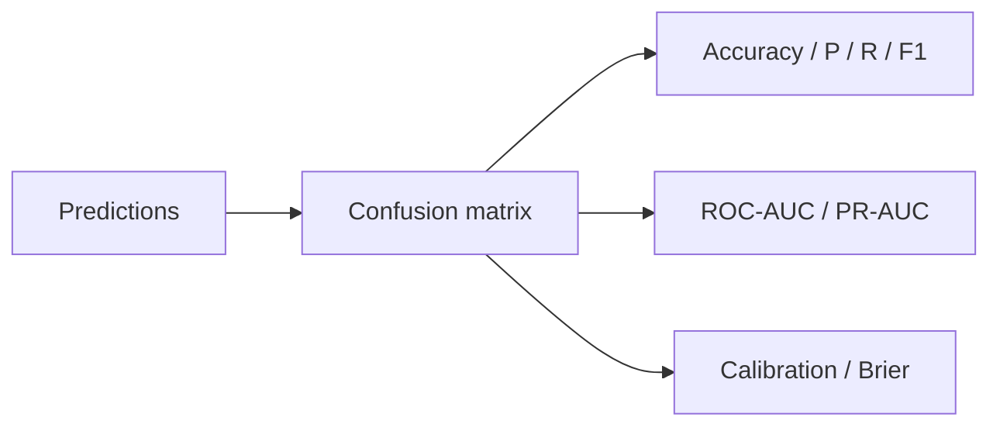

# 1.14 — Model Evaluation & Metrics

## 1. Intuition first

You cannot optimize what you cannot measure. **Choosing the right metric is the most important design decision in an ML project.** A high-accuracy fraud model that never catches fraudsters is worthless — you needed recall (or precision-at-k, or expected value).

## 2. Why the topic exists

- Different problems have different costs of errors.
- Class imbalance turns accuracy into a bad metric.
- Business goals rarely align with vanilla ML metrics; you must translate.

## 3. What problem it solves

Provides objective, comparable measures of model quality; drives selection, tuning, and monitoring.

## 4. Mathematics

### 4.1 Classification metrics

Confusion matrix:

| | Pred + | Pred – |
|---|---|---|
| Actual + | TP | FN |
| Actual – | FP | TN |

- Accuracy: $(TP + TN) / (TP+TN+FP+FN)$.
- Precision: $TP / (TP + FP)$ — "of predicted positives, how many are correct".
- Recall / Sensitivity: $TP / (TP + FN)$ — "of true positives, how many did we catch".
- Specificity: $TN / (TN + FP)$.
- F1: harmonic mean of precision & recall. $F_1 = \tfrac{2PR}{P+R}$; $F_\beta$ weights recall by $\beta^2$.
- ROC-AUC: area under ROC (TPR vs FPR) — probability model ranks a random positive above a random negative.
- PR-AUC: better than ROC for imbalanced problems.
- Log loss (BCE): mean $-y\log \hat p - (1-y)\log(1-\hat p)$.
- Brier score: mean squared error on probabilities.
- Calibration: reliability diagrams; ECE (Expected Calibration Error).
- Matthews Correlation Coefficient: robust to imbalance.

### 4.2 Multi-class

- Macro-averaged (unweighted mean per class), Micro-averaged (global counts), Weighted-averaged.
- Cohen's kappa.
- Confusion-matrix heatmaps.

### 4.3 Regression metrics

- MSE, RMSE, MAE, MAPE, sMAPE.
- $R^2 = 1 - \tfrac{SS_{\text{res}}}{SS_{\text{tot}}}$.
- Median absolute error (robust to outliers).
- Pinball loss (quantile regression).

### 4.4 Ranking / recommendation

- Precision@k, Recall@k.
- MAP@k (mean average precision).
- NDCG (normalized discounted cumulative gain).
- MRR (mean reciprocal rank).

### 4.5 NLP / generation

- BLEU, ROUGE, METEOR, chrF (n-gram overlap).
- BERTScore, COMET (embedding-based).
- Perplexity for LMs.
- Human eval (Elo, side-by-side).

### 4.6 Multi-label / detection

- IoU (Intersection over Union).
- mAP at IoU thresholds (COCO metric).

## 5. Every formula explained

- Precision measures cleanliness of positive predictions; recall measures coverage.
- F1 balances them via harmonic mean (punishes lopsidedness).
- ROC-AUC is threshold-independent: given all thresholds, how well can we rank?
- Log loss penalizes confident wrong predictions heavily.
- $R^2$ compares residual sum of squares vs total variance; 1.0 = perfect, 0 = mean prediction, negative = worse than mean.

## 6. Variables

Standard confusion-matrix notation; $\hat p$ = predicted probability; $y$ = true label.

## 7. Algorithm — choosing a metric

1. Identify the business decision the model drives.
2. Estimate cost of FN and FP separately.
3. Pick a metric aligned with these costs (e.g. recall @ FPR ≤ 1%, expected value).
4. Add a secondary metric (calibration, fairness).
5. Fix the operating threshold or aggregation strategy.

## 8. Simple example

Cancer screener: FN (missed cancer) is far worse than FP (extra biopsy). Use recall @ high threshold, monitor with precision.

## 9. Real-world example

- Netflix: NDCG@10 on ranked recommendations.
- YouTube: watch-time weighted precision.
- Spam: precision at chosen FP quota (users hate blocked good mail).

## 10. Diagram

```
        Predicted +   Predicted -
Actual + | TP (hit) | FN (miss) |
Actual - | FP (fake)| TN (safe) |
```



## 11. Implementation from scratch

```python
import numpy as np

def confusion(y, yhat):
    tp = ((yhat == 1) & (y == 1)).sum()
    tn = ((yhat == 0) & (y == 0)).sum()
    fp = ((yhat == 1) & (y == 0)).sum()
    fn = ((yhat == 0) & (y == 1)).sum()
    return tp, fp, fn, tn

def precision(y, yhat):
    tp, fp, *_ = confusion(y, yhat); return tp / max(tp + fp, 1)
def recall(y, yhat):
    tp, _, fn, _ = confusion(y, yhat); return tp / max(tp + fn, 1)
def f1(y, yhat):
    p, r = precision(y, yhat), recall(y, yhat); return 2 * p * r / max(p + r, 1e-12)

def roc_auc(y, scores):
    order = np.argsort(-scores)
    y = y[order]
    tpr, fpr, thresh = [], [], []
    P, N = y.sum(), (1 - y).sum()
    tp = fp = 0
    for yi in y:
        if yi == 1: tp += 1
        else: fp += 1
        tpr.append(tp / P); fpr.append(fp / N)
    return np.trapz(tpr, fpr)
```

## 12. Implementation using libraries

```python
from sklearn.metrics import (accuracy_score, precision_recall_fscore_support,
                             roc_auc_score, average_precision_score, log_loss,
                             confusion_matrix, classification_report, brier_score_loss)
```

## 13. Time complexity

Metric computation is O(n) or O(n log n) (sorting for AUC).

## 14. Space complexity

O(n).

## 15. Advantages

Objective decision-making. Enables model comparison. Enables monitoring in production.

## 16. Disadvantages

Wrong metric → wrong model. Metrics can be gamed (Goodhart's law).

## 17. Interview questions

1. Precision vs Recall — trade-off?
2. When is accuracy misleading?
3. ROC-AUC vs PR-AUC?
4. What is calibration?
5. Explain macro vs micro averaging.
6. Difference between MSE and MAE — when to use which?
7. What is NDCG?
8. Why is BLEU criticized?
9. Explain expected value framing for imbalanced classification.
10. How do you monitor a live model?

## 18. Common mistakes

- Reporting accuracy on 99:1 imbalanced data.
- Not fixing a threshold when comparing precision/recall.
- Comparing models trained on different splits.
- Overfitting to public leaderboard metric.
- Ignoring fairness / subgroup metrics.

## 19. Optimization techniques

- Choose metric before modeling.
- Add bootstrapped confidence intervals.
- Include subgroup / fairness slicing.
- Cost-sensitive learning when costs are known.

## 20. Coding exercises

1. Implement ROC and PR curves from scratch.
2. Implement ECE and reliability plots.
3. Compute NDCG@10 on synthetic ranking data.
4. Bootstrap 95% CI for AUC.

## 21. Mini project

Given a fraud detection dataset, decide on a metric based on assumed FN=$1000 and FP=$20 costs.

## 22. Medium project

Build an evaluation dashboard for a binary classifier: ROC/PR curves, calibration plot, threshold slider, business-value plot.

## 23. Advanced project

Design an evaluation framework for an LLM assistant that combines automatic (BLEU, ROUGE, BERTScore), heuristic (regex safety), and pairwise LLM-as-judge scores with agreement analysis.

## 24. Where it is used in industry

Every product-facing ML system, always monitored on business + ML metrics.

## 25. How companies use it

- Netflix engagement lift instead of RMSE on ratings.
- YouTube long-term watch time.
- Uber ETA MAPE, cancellation rate.

## 26. When NOT to use it

There is never a "not-to-use" for evaluation — but avoid choosing metrics purely for leaderboard optics; align with business.
