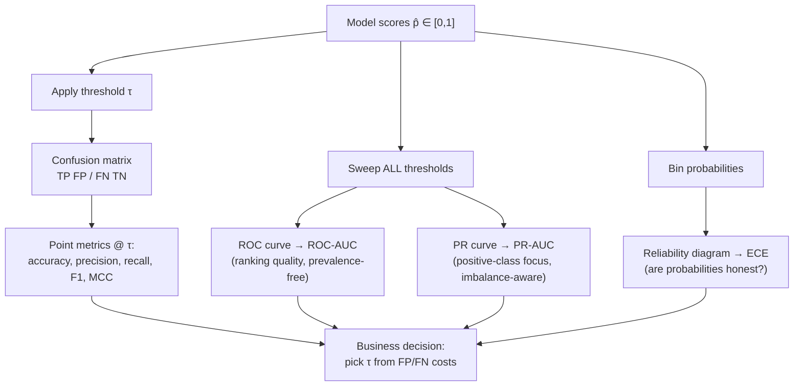
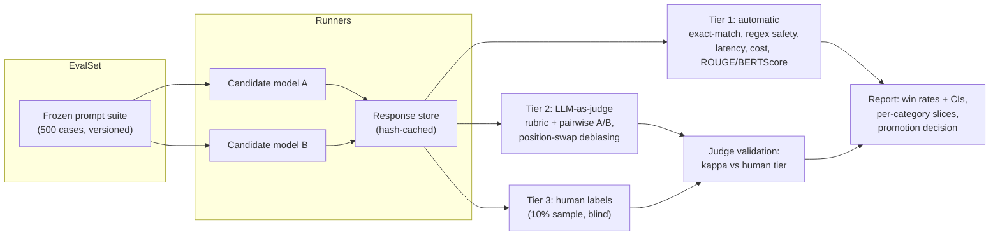

# 1.14 — Model Evaluation & Metrics

## 1. Overview

**What is it?** Model evaluation is the discipline of measuring how good a model actually is — with numbers you can trust, compare, and monitor. Metrics are the specific measuring instruments: precision, recall, F1, ROC-AUC, RMSE, NDCG, BLEU, and dozens more, each answering a *different* question about model behavior.

**Why does it exist?** You cannot optimize what you cannot measure — and worse, you *will* optimize whatever you do measure, even if it is the wrong thing (Goodhart's law). Different problems have different costs of errors: a missed cancer diagnosis is not symmetric with an unnecessary biopsy; a blocked legitimate email is not symmetric with one spam message slipping through. Class imbalance can make accuracy an actively misleading number. Choosing the right metric is arguably the single most important design decision in an ML project.

**What problem does it solve?** It provides objective, comparable measures of model quality that drive model selection, hyperparameter tuning, threshold setting, go/no-go launch decisions, and production monitoring.

**Where is it used?** Everywhere, always. Every experiment log, every A/B test, every model card, every leaderboard, every production dashboard is built on the metrics in this chapter.

## 2. Learning Objectives

After this chapter you will be able to:

- Construct and read a confusion matrix, and derive accuracy, precision, recall, specificity, and F1 from it.
- Explain the precision–recall trade-off and choose an operating threshold aligned with error costs.
- Define ROC and PR curves, compute their AUCs, and articulate when PR-AUC beats ROC-AUC.
- Interpret ROC-AUC probabilistically (ranking interpretation) and implement it from scratch.
- Measure probability quality with log loss, Brier score, reliability diagrams, and Expected Calibration Error.
- Apply macro/micro/weighted averaging correctly in multi-class settings.
- Select regression metrics (MSE, RMSE, MAE, MAPE, $R^2$, pinball loss) to match the error structure you care about.
- Compute ranking metrics — Precision@k, MAP, MRR, NDCG — and explain their use in recommenders and search.
- Describe NLP/generation metrics (BLEU, ROUGE, perplexity, BERTScore) and their known failure modes.
- Attach uncertainty to any metric with bootstrap confidence intervals.
- Design a metric suite for a business problem, including subgroup slicing and guardrail metrics.
- Avoid classic evaluation traps: imbalance, leakage across splits, threshold cherry-picking, leaderboard overfitting.

## 3. Prerequisites

| Chapter | Why you need it |
|---|---|
| [Probability & Statistics](../phase-0-prerequisites/04-probability-statistics.md) | Expectations, conditional probability, and sampling variance underlie every metric and its confidence interval. |
| [ML Fundamentals](01-ml-fundamentals.md) | Train/validation/test splits and overfitting define *what data* metrics may be computed on. |
| [Logistic Regression](04-logistic-regression.md) | Produces the predicted probabilities that log loss, ROC, and calibration all consume. |
| [Linear Regression](02-linear-regression.md) | Source of the residuals that MSE/MAE/$R^2$ summarize. |
| [NumPy & Pandas](../phase-0-prerequisites/05-numpy-pandas.md) | All from-scratch metric code is vectorized NumPy. |

## 4. Intuition

Think of a **smoke detector**. Two distinct failure modes exist: it stays silent during a fire (a **false negative** — catastrophic) or it shrieks when you make toast (a **false positive** — annoying). You can tune its sensitivity: maximally sensitive means it catches every fire but screams daily (perfect recall, terrible precision); maximally insensitive means it never bothers you and also never warns you (the reverse). No single "accuracy" number captures this trade-off — you need *two* numbers, and a decision about which failure hurts more. Every binary classifier is a smoke detector with a sensitivity knob (the threshold), and precision/recall are the two gauges on it.

An everyday story about **imbalance**: a security guard at a quiet warehouse can "achieve 99.9% accuracy" by declaring, every night, that no burglary is happening — because burglaries are rare. The guard is useless, and the accuracy number hides it completely. Rare-event problems (fraud, disease, defects) need metrics that focus on the rare class: recall, precision, PR-AUC.

And one about **calibration**: a weather forecaster who says "70% chance of rain" should be right on about 70% of such days. A forecaster who says 70% but is right 95% of the time is *useful but miscalibrated* — you can't take their numbers at face value for decisions. Classifiers have the same issue: a model can rank perfectly (great AUC) while its probability values are systematically off.

## 5. Real-world Motivation

- **Netflix** famously found that the metric of its Prize competition (RMSE on star ratings) did not translate into better user experience; the company shifted evaluation toward ranking quality and engagement outcomes for its recommender systems — a canonical lesson that offline metric choice must match the product decision.
- **YouTube** publicly documented moving its recommender objective from click-through rate to expected watch time, because clicks rewarded clickbait thumbnails — a live example of Goodhart's law and metric redesign.
- **Medical AI.** Screening models are evaluated at operating points like "sensitivity ≥ 95% at acceptable specificity" because regulators and clinicians reason in terms of missed diagnoses per thousand patients, not abstract AUC alone.
- **Spam and abuse teams** at email providers operate under strict false-positive budgets: blocking a legitimate invoice email is far costlier than letting one spam through, so models are evaluated at precision ≥ some bar, then recall is maximized subject to it.
- **Search and e-commerce** (Google, Amazon, Airbnb) evaluate rankers offline with NDCG/MRR before any online A/B test — offline metrics are the cheap filter that decides which few models earn expensive live traffic.

## 6. Mathematical Foundations

### 6.1 The confusion matrix

For binary classification with predictions $\hat{y}_i \in \{0, 1\}$ and true labels $y_i \in \{0, 1\}$:

| | Predicted + | Predicted − |
|---|---|---|
| **Actual +** | TP (true positive) | FN (false negative) |
| **Actual −** | FP (false positive) | TN (true negative) |

All threshold-based classification metrics are functions of these four counts.

### 6.2 Core classification metrics

$$
\text{Accuracy} = \frac{TP + TN}{TP + TN + FP + FN}
$$

$$
\text{Precision} = \frac{TP}{TP + FP}
\qquad
\text{Recall (Sensitivity, TPR)} = \frac{TP}{TP + FN}
\qquad
\text{Specificity (TNR)} = \frac{TN}{TN + FP}
$$

Precision answers "of the alarms I raised, how many were real?"; recall answers "of the real events, how many did I catch?". The **F1 score** is their harmonic mean:

$$
F_1 = \frac{2\,P\,R}{P + R},
\qquad
F_\beta = \frac{(1+\beta^2)\,P\,R}{\beta^2 P + R},
$$

where $P$ = precision, $R$ = recall, and $\beta$ weights recall $\beta$ times as important as precision ($F_2$ recall-heavy, $F_{0.5}$ precision-heavy). The harmonic mean punishes imbalance: $P = 1.0, R = 0.1$ gives $F_1 \approx 0.18$, not $0.55$ — you cannot buy a good F1 with one lopsided component.

**Matthews Correlation Coefficient (MCC)** uses all four cells and stays honest under imbalance:

$$
\text{MCC} = \frac{TP \cdot TN - FP \cdot FN}{\sqrt{(TP{+}FP)(TP{+}FN)(TN{+}FP)(TN{+}FN)}} \in [-1, 1].
$$

### 6.3 Threshold-free metrics: ROC and PR curves

A probabilistic classifier outputs scores $\hat{p}_i \in [0, 1]$; sweeping a threshold $\tau$ traces curves:

- **ROC curve:** TPR (recall) vs FPR $= FP/(FP + TN)$ across all $\tau$. **ROC-AUC** — the area under it — has an exact probabilistic meaning:

$$
\text{ROC-AUC} = P(\hat{p}_{i} > \hat{p}_{j} \mid y_i = 1,\, y_j = 0),
$$

the probability that a random positive is scored above a random negative. 0.5 = random ranking, 1.0 = perfect ranking. It is invariant to any monotone rescaling of scores and to class prevalence.

- **PR curve:** precision vs recall across all $\tau$; **PR-AUC** (≈ average precision, $AP = \sum_t (R_t - R_{t-1}) P_t$) *does* depend on prevalence. With 0.1% positives, a model can post ROC-AUC 0.95 while its precision at useful recall is 2% — the huge TN count flatters FPR. **Rule: with heavy imbalance and a focus on the positive class, look at the PR curve.** The PR baseline for a random classifier equals the positive rate, not 0.5.

### 6.4 Probability quality: log loss, Brier, calibration

$$
\text{LogLoss} = -\frac{1}{n}\sum_{i=1}^{n}\big[y_i \log \hat{p}_i + (1 - y_i)\log(1 - \hat{p}_i)\big],
\qquad
\text{Brier} = \frac{1}{n}\sum_{i=1}^{n} (\hat{p}_i - y_i)^2 .
$$

Log loss penalizes confident errors unboundedly ($\hat{p} = 0.999$ on a negative costs $\approx 6.9$ nats); Brier is bounded and decomposes into calibration + refinement terms. Both are **proper scoring rules**: they are minimized in expectation by predicting the true probability, so optimizing them cannot reward dishonest probabilities.

**Calibration** asks: among samples with $\hat{p} \approx 0.7$, do ~70% turn out positive? A **reliability diagram** bins predictions and plots mean predicted probability vs empirical positive rate per bin; the **Expected Calibration Error** summarizes it:

$$
\text{ECE} = \sum_{b=1}^{B} \frac{n_b}{n}\,\big|\text{acc}(b) - \text{conf}(b)\big|,
$$

where $B$ = number of bins, $n_b$ = samples in bin $b$, $\text{conf}(b)$ = mean $\hat{p}$ in the bin, $\text{acc}(b)$ = empirical positive rate in the bin. Fix miscalibration post hoc with **Platt scaling** (fit a logistic regression on scores) or **isotonic regression** (fit a monotone step function), always on held-out data.

### 6.5 Multi-class averaging

With $K$ classes, compute per-class precision/recall/F1 by one-vs-rest, then aggregate:

- **Macro:** unweighted mean over classes — every class counts equally; small classes can dominate your attention (usually what you want under imbalance).
- **Micro:** pool all TP/FP/FN counts globally, then compute the metric — every *sample* counts equally; for single-label multi-class, micro-F1 = accuracy.
- **Weighted:** macro weighted by class support — a compromise that can hide minority-class failure.

**Cohen's kappa** corrects agreement for chance: $\kappa = (p_o - p_e)/(1 - p_e)$ with $p_o$ = observed accuracy and $p_e$ = accuracy expected from the marginal label distributions.

### 6.6 Regression metrics

$$
\text{MSE} = \frac{1}{n}\sum_i (y_i - \hat{y}_i)^2,
\quad
\text{RMSE} = \sqrt{\text{MSE}},
\quad
\text{MAE} = \frac{1}{n}\sum_i |y_i - \hat{y}_i|,
$$

$$
R^2 = 1 - \frac{\sum_i (y_i - \hat{y}_i)^2}{\sum_i (y_i - \bar{y})^2},
\qquad
\text{MAPE} = \frac{100}{n}\sum_i \left|\frac{y_i - \hat{y}_i}{y_i}\right| .
$$

RMSE is in target units and (being squared-error-based) is minimized by the conditional **mean**, making it outlier-sensitive; MAE is minimized by the conditional **median**, hence robust. $R^2$ compares against the predict-the-mean baseline: 1 = perfect, 0 = no better than the mean, negative = worse than the mean (yes, that happens on test data). MAPE explodes when $y_i \approx 0$ and asymmetrically punishes over-prediction; sMAPE and MASE are common fixes in forecasting. **Pinball (quantile) loss** $L_q(y, \hat{y}) = \max\big(q(y - \hat{y}),\, (q-1)(y - \hat{y})\big)$ trains and evaluates quantile predictions (e.g., a P90 delivery-time estimate).

### 6.7 Ranking metrics

For a query with ranked results and binary/graded relevance:

- **Precision@k / Recall@k:** fraction of the top-$k$ that is relevant / fraction of all relevant items retrieved in the top-$k$.
- **MRR:** mean over queries of $1/\text{rank of first relevant result}$ — right metric when one correct hit suffices (question answering, navigation).
- **MAP:** mean over queries of average precision (the PR-AUC of each query's ranking).
- **NDCG@k:** with graded relevance $rel_j$ at position $j$:

$$
\text{DCG@k} = \sum_{j=1}^{k} \frac{2^{rel_j} - 1}{\log_2(j + 1)},
\qquad
\text{NDCG@k} = \frac{\text{DCG@k}}{\text{IDCG@k}},
$$

where IDCG is the DCG of the ideal (perfectly sorted) ranking, so NDCG $\in [0, 1]$. The log discount encodes that position 1 matters far more than position 10 — matching measured user attention.

### 6.8 NLP and generation metrics

- **BLEU:** geometric mean of modified n-gram precisions (n = 1..4) × a brevity penalty — the classic machine-translation metric; criticized because paraphrases score 0 and correlation with human judgment is loose.
- **ROUGE-N / ROUGE-L:** n-gram (and longest-common-subsequence) *recall* against references — standard for summarization.
- **Perplexity:** $\exp$ of average negative log-likelihood per token — intrinsic language-model quality; incomparable across different tokenizers.
- **BERTScore / COMET / LLM-as-judge:** embedding- or model-based semantic similarity; better correlation with humans, at the cost of dependence on the judging model.
- **IoU / mAP:** for detection tasks — intersection-over-union of boxes, mean average precision across classes and IoU thresholds (the COCO protocol).

**Symbol glossary:** $y_i$ = true label/value; $\hat{y}_i$ = predicted label/value; $\hat{p}_i$ = predicted probability; $\tau$ = decision threshold; $P, R$ = precision, recall; $\beta$ = recall weight in $F_\beta$; $B, n_b$ = calibration bins and bin counts; $K$ = number of classes; $\bar{y}$ = mean of true values; $q$ = quantile level; $rel_j$ = graded relevance at rank $j$.

## 7. Visual Explanation



```
ROC space                              PR space (1% positives)
TPR                                    Precision
1.0 |        ____----''  perfect ↖    1.0 |\
    |    _--'                          |  \  good model
    | _-'   good model                 |   \_
    |/  ..·· random (diag)             |     '--.___
    |·.·                               | random = 0.01 (positive rate)
0.0 +--------------- FPR         0.0   +------------------ Recall
    0               1.0                0                  1.0
Same model, two very different pictures under heavy imbalance.
```

## 8. Algorithm

**Choosing and operating a metric suite:**

1. **State the decision** the model drives (block the transaction? show the ad? page the doctor?).
2. **Price the errors:** estimate the cost of a false negative and a false positive separately (dollars, minutes, risk). If costs are unknowable, at least rank them.
3. **Pick the primary metric** aligned with those costs: e.g., "recall at FPR ≤ 1%", PR-AUC for rare positives, RMSE vs MAE depending on outlier tolerance, NDCG@k for ranked lists.
4. **Add guardrail metrics:** calibration (if probabilities feed decisions), latency, subgroup/fairness slices, and a business proxy.
5. **Fix the evaluation protocol:** data split (stratified; time-based for temporal data), threshold-selection procedure (on validation, never test), and bootstrap CIs.
6. **Evaluate, then freeze:** compare models only under the identical protocol; report CIs; resist re-picking thresholds after seeing test results.
7. **Monitor in production:** track the same metrics on live (possibly delayed-label) data, plus input-drift signals.

Pseudocode for threshold selection under explicit costs:

```text
Input: validation scores p̂, labels y, costs c_FN, c_FP
best_τ, best_cost ← None, +∞
for τ in sorted(unique(p̂)):
    ŷ ← (p̂ ≥ τ)
    cost ← c_FN · FN(y, ŷ) + c_FP · FP(y, ŷ)
    if cost < best_cost: best_τ, best_cost ← τ, cost
return best_τ        # then report test metrics at this FROZEN τ
```

## 9. Worked Example

**Tiny example by hand.** A fraud model scores 10 transactions; 3 are truly fraudulent (marked ✱):

| ID | 1✱ | 2 | 3✱ | 4 | 5 | 6✱ | 7 | 8 | 9 | 10 |
|---|---|---|---|---|---|---|---|---|---|---|
| score | .95 | .90 | .80 | .60 | .55 | .50 | .40 | .30 | .20 | .10 |

*At threshold $\tau = 0.5$:* predicted positive = {1,2,3,4,5,6}. TP = 3 (IDs 1,3,6), FP = 3 (2,4,5), FN = 0, TN = 4.
Precision $= 3/6 = 0.50$; Recall $= 3/3 = 1.00$; $F_1 = 2(0.5)(1.0)/1.5 = 0.667$; Accuracy $= 7/10 = 0.70$.

*At $\tau = 0.85$:* predicted positive = {1,2}. TP = 1, FP = 1, FN = 2, TN = 6. Precision $= 0.50$, Recall $= 0.33$, $F_1 = 0.40$. Raising the threshold here did **not** raise precision — worth noticing: precision is not monotone in $\tau$.

*ROC-AUC by the ranking definition:* count positive–negative pairs ordered correctly. Pairs total $= 3 \times 7 = 21$. ID 1 (0.95) beats all 7 negatives; ID 3 (0.80) beats 6 (loses to ID 2's 0.90); ID 6 (0.50) beats 4 (loses to 2, 4, 5). AUC $= (7 + 6 + 4)/21 = 17/21 \approx 0.810$.

**Realistic example.** A credit-card fraud dataset with 0.17% positives (the classic ULB Kaggle set): a model reaches ROC-AUC 0.97 — sounds superb — while PR-AUC is ~0.75 and precision at 90% recall is ~40%, i.e., at the operating point that catches 9 of 10 frauds, six of ten alerts are false. The ROC number alone would have massively oversold the model; the PR analysis tells the analyst team what their alert queue will actually look like.

## 10. Python from Scratch

```python
import numpy as np

def confusion(y, yhat):
    """4 counts from binary labels/predictions (arrays of 0/1)."""
    tp = int(((yhat == 1) & (y == 1)).sum())
    fp = int(((yhat == 1) & (y == 0)).sum())
    fn = int(((yhat == 0) & (y == 1)).sum())
    tn = int(((yhat == 0) & (y == 0)).sum())
    return tp, fp, fn, tn

def precision_recall_f1(y, yhat):
    tp, fp, fn, _ = confusion(y, yhat)
    p = tp / (tp + fp) if tp + fp else 0.0   # guard: no positive predictions
    r = tp / (tp + fn) if tp + fn else 0.0   # guard: no positive labels
    f1 = 2 * p * r / (p + r) if p + r else 0.0
    return p, r, f1

def roc_auc(y, scores):
    """AUC via the rank formula: O(n log n), exact, tie-aware.
    AUC = (sum of positive ranks − n_pos(n_pos+1)/2) / (n_pos · n_neg)."""
    order = np.argsort(scores)                    # ascending
    ranks = np.empty(len(y), dtype=float)
    ranks[order] = np.arange(1, len(y) + 1)       # 1-based ranks
    # average ranks over tied scores so ties count half (proper AUC treatment)
    for s in np.unique(scores):
        m = scores == s
        ranks[m] = ranks[m].mean()
    n_pos, n_neg = int(y.sum()), int((1 - y).sum())
    return (ranks[y == 1].sum() - n_pos * (n_pos + 1) / 2) / (n_pos * n_neg)

def expected_calibration_error(y, p, n_bins=10):
    """ECE with equal-width bins: Σ (n_b/n)·|acc(b) − conf(b)|."""
    bins = np.clip((p * n_bins).astype(int), 0, n_bins - 1)  # bin index per sample
    ece = 0.0
    for b in range(n_bins):
        m = bins == b
        if m.any():
            ece += m.mean() * abs(y[m].mean() - p[m].mean())
    return ece

# --- Demo on the hand-worked example -----------------------------------
y      = np.array([1, 0, 1, 0, 0, 1, 0, 0, 0, 0])
scores = np.array([.95, .90, .80, .60, .55, .50, .40, .30, .20, .10])

p, r, f1 = precision_recall_f1(y, (scores >= 0.5).astype(int))
print(f"P={p:.3f} R={r:.3f} F1={f1:.3f}")   # expected: P=0.500 R=1.000 F1=0.667
print(f"AUC={roc_auc(y, scores):.4f}")      # expected: 0.8095  (= 17/21)
print(f"ECE={expected_calibration_error(y, scores):.3f}")
```

- **Complexity:** confusion-matrix metrics are $O(n)$; the rank-based AUC is $O(n \log n)$ (one sort); ECE is $O(n)$.
- **Common bug:** computing AUC with a naive double loop over all positive–negative pairs — $O(n^2)$, unusable at $n = 10^6$ — or forgetting tie handling, which biases AUC when scores are quantized (e.g., tree-model outputs with few distinct values). The rank formula above fixes both. Another classic: division by zero in precision when the model predicts no positives — return 0 (or NaN with a warning), never let it crash a training loop silently.

## 11. Library Implementation

```python
import numpy as np
from sklearn.metrics import (
    accuracy_score, precision_recall_fscore_support, confusion_matrix,
    classification_report, roc_auc_score, average_precision_score,
    roc_curve, precision_recall_curve, log_loss, brier_score_loss,
    mean_squared_error, mean_absolute_error, r2_score, ndcg_score,
)
from sklearn.calibration import calibration_curve, CalibratedClassifierCV

# y_true: (n,) int labels; y_prob: (n,) predicted P(y=1); y_pred = y_prob >= τ
y_pred = (y_prob >= 0.5).astype(int)

# ---- Point metrics at a fixed threshold --------------------------------
print(confusion_matrix(y_true, y_pred))            # rows=actual, cols=predicted
p, r, f, _ = precision_recall_fscore_support(
    y_true, y_pred, average="binary")              # binary → positive class only
print(classification_report(y_true, y_pred))       # per-class + macro/weighted

# ---- Threshold-free: ranking quality ------------------------------------
print(roc_auc_score(y_true, y_prob))               # NOTE: pass PROBABILITIES,
print(average_precision_score(y_true, y_prob))     # not thresholded labels!
fpr, tpr, thr = roc_curve(y_true, y_prob)          # arrays for plotting
prec, rec, thr_pr = precision_recall_curve(y_true, y_prob)

# ---- Probability quality -------------------------------------------------
print(log_loss(y_true, y_prob))                    # proper scoring rule
print(brier_score_loss(y_true, y_prob))            # MSE on probabilities
frac_pos, mean_pred = calibration_curve(y_true, y_prob, n_bins=10)
# plot mean_pred vs frac_pos: on-diagonal = calibrated

# ---- Fixing calibration --------------------------------------------------
calibrated = CalibratedClassifierCV(base_model, method="isotonic", cv=5)
calibrated.fit(X_train, y_train)                   # wraps model + calibrator

# ---- Regression -----------------------------------------------------------
rmse = mean_squared_error(y_reg, y_reg_pred, squared=False)
mae  = mean_absolute_error(y_reg, y_reg_pred)
r2   = r2_score(y_reg, y_reg_pred)

# ---- Ranking (graded relevance) -------------------------------------------
# ndcg_score expects shape (n_queries, n_items) for both args
print(ndcg_score(true_relevance, predicted_scores, k=10))
```

Line-by-line notes: the single most common misuse is passing **thresholded predictions** to `roc_auc_score` — it silently computes a one-point "AUC" that is meaningless; always pass scores/probabilities. `average="binary"` reports only the positive class; use `"macro"` for imbalanced multi-class. `classification_report` is the fastest way to spot a collapsed minority class. `CalibratedClassifierCV` must calibrate on data the base model didn't train on — the `cv` argument handles that internally.

## 12. Code Walkthrough

Inputs, intermediates, and outputs for the from-scratch demo of Section 10:

| Tensor | Shape | Meaning |
|---|---|---|
| `y` | (10,) | True binary labels (3 positives) |
| `scores` | (10,) | Model scores in $[0, 1]$ |
| `yhat` | (10,) | Thresholded predictions at $\tau = 0.5$ |
| `(tp, fp, fn, tn)` | 4 scalars | Confusion counts: (3, 3, 0, 4) |
| `ranks` | (10,) | 1-based ranks of scores (tie-averaged) |
| `bins` | (10,) | Calibration bin index (0–9) per sample |
| outputs | scalars | P = 0.500, R = 1.000, F1 = 0.667, AUC = 0.8095 |

Expected results trace exactly to the hand computation in Section 9: the confusion counts match, and AUC $= 17/21 = 0.8095\ldots$ because the rank formula counts the same 17 correctly ordered positive–negative pairs. A useful self-check for any metric implementation: run it against `sklearn.metrics` on 1,000 random datasets (`np.random.rand` scores, random labels) and assert agreement to $10^{-10}$ — five lines that have caught countless off-by-one and tie-handling bugs.

## 13. Complexity Analysis

- **Confusion-matrix metrics (accuracy, P, R, F1, MCC):** $O(n)$ time, $O(1)$ extra space — one pass of boolean reductions.
- **ROC / PR curves and AUCs:** $O(n \log n)$ time for the sort, $O(n)$ space for the curve points; the sweep over thresholds after sorting is linear.
- **Log loss, Brier, ECE:** $O(n)$ time, $O(B)$ space for ECE's bins.
- **NDCG@k per query:** $O(m \log m)$ for a list of $m$ items (sorting to build the ideal ranking); total across $Q$ queries: $O(Qm\log m)$.
- **Bootstrap confidence intervals:** multiply any metric's cost by the number of resamples $B_{\text{boot}}$ (typically 1,000) — still cheap because metrics are linear-ish scans; vectorize by drawing index matrices.
- **BLEU/ROUGE:** linear in tokens with hashmap n-gram counting; BERTScore costs a forward pass of the scoring model per text pair — dominant by orders of magnitude.

## 14. Advantages

- **Objective comparison.** A shared metric turns "model A feels better" into "A beats B by 2.3 PR-AUC points with non-overlapping bootstrap CIs" — the basis of every credible ML claim.
- **Threshold-free model assessment.** ROC/PR-AUC evaluate the scorer independently of the operating point, letting you defer the business threshold decision — e.g., ship one fraud model and let each market pick its own precision/recall balance.
- **Cost alignment.** Metrics like $F_\beta$, recall@FPR, and expected-cost make asymmetric error prices explicit — a cancer screener tuned for $F_2$ encodes "missing cancer is worse" directly in the number.
- **Probability accountability.** Proper scoring rules and ECE make "the model said 80%" a testable claim — essential when probabilities feed pricing, triage, or bidding systems.
- **Monitoring backbone.** The same metrics computed on live traffic detect degradation: an AUC drop of 0.03 week-over-week catches silent upstream data breakage long before revenue dashboards do.

## 15. Disadvantages

- **Wrong metric → wrong model, confidently.** Optimizing accuracy on 99:1 data reliably produces the useless always-negative classifier; every downstream decision inherits the error.
- **Goodhart's law.** Any metric under optimization pressure stops measuring what it did: click-through models learn clickbait; BLEU-tuned translators learn safe boilerplate. Guardrail metrics are mandatory, not optional.
- **Single numbers hide structure.** An overall F1 of 0.85 can coexist with F1 = 0.30 on one demographic subgroup or one product category — aggregate metrics *must* be sliced.
- **Offline ≠ online.** Offline ranking metrics assume logged data reflects what users would do under the new model (it doesn't — position bias, feedback loops); A/B tests remain the ground truth for product impact.
- **Generation metrics are weak proxies.** BLEU/ROUGE correlate loosely with human judgment; two summaries with equal ROUGE can differ enormously in factuality. Human or model-based evaluation is still needed for generative systems.
- **Statistical noise.** On a 500-sample test set, an AUC difference of 0.02 is often within resampling noise — comparisons without confidence intervals are anecdotes.

## 16. Common Mistakes

- **Reporting accuracy on imbalanced data.** Fix: always report the confusion matrix plus PR-AUC/F1/MCC; state the base rate next to every accuracy figure.
- **Passing hard labels to `roc_auc_score`.** Produces a fake AUC from a single operating point. Fix: pass probabilities/scores.
- **Tuning the threshold on the test set.** That's leakage — test numbers become optimistically biased. Fix: choose $\tau$ on validation, freeze it, report test metrics once.
- **Comparing models across different splits or preprocessing.** Fix: one frozen evaluation protocol (same folds, same test set, same label definitions) for all candidates.
- **Ignoring calibration when consuming probabilities.** A great-AUC model can be badly miscalibrated after class re-weighting or boosting. Fix: reliability diagram + ECE; recalibrate if needed.
- **Averaging blindly in multi-class.** Weighted-F1 can look fine while a rare class scores zero. Fix: inspect the per-class report; prefer macro when minority classes matter.
- **Using MAPE with near-zero targets** (division blow-up) or RMSE with heavy-tailed targets (a few outliers dominate). Fix: match the metric to the error distribution — sMAPE/MASE, MAE, or quantile loss.
- **Overfitting the public leaderboard.** Dozens of submissions against one test set is multiple testing. Fix: trust local CV; submit sparingly.

## 17. Best Practices

- [ ] Write the metric definition, split protocol, and threshold rule *before* training anything; keep it in the experiment doc.
- [ ] Report every headline metric with a 95% bootstrap CI; never claim a win inside overlapping intervals.
- [ ] Always show the confusion matrix and base rate alongside derived metrics.
- [ ] Slice metrics by key segments (geography, device, demographic, time period); alert on worst-slice regressions, not just the average.
- [ ] For temporal data, evaluate on a strictly later time window — random splits flatter models via leakage.
- [ ] Pair the primary metric with guardrails: calibration, latency, worst-slice score, and a business proxy.
- [ ] Version evaluation code and datasets like model code; a metric change is a breaking change.
- [ ] In production, monitor score distributions and delayed-label metrics; set alert thresholds from historical variance, not gut feel.
- [ ] For generative systems, combine automatic metrics with periodic human (or carefully validated LLM-judge) evaluation and agreement checks.

## 18. Optimization Techniques

- **Vectorized bootstrap.** Draw a $(B_{\text{boot}}, n)$ index matrix once and compute all resampled metrics with NumPy fancy indexing — 1,000 AUC resamples on $10^6$ rows in seconds instead of a Python loop's minutes.
- **Rank-based AUC.** The formula in Section 10 replaces the $O(n^2)$ pair count with one $O(n \log n)$ sort — mandatory at scale.
- **Streaming/online metrics.** Maintain running confusion counts (and reservoir samples for quantiles) to compute metrics over infinite prediction streams with $O(1)$ memory — the standard pattern inside monitoring agents.
- **Threshold sweeps from sorted scores.** Computing precision/recall at all $n$ thresholds is one cumulative-sum pass after sorting — never re-threshold in a loop.
- **Caching for expensive metrics.** BERTScore/LLM-judge evaluations should be memoized by (model-version, text-pair) hash; evaluation sets are re-scored constantly during development.
- **Approximate metrics during training.** Evaluate on a fixed stratified subsample every epoch and the full set only at checkpoints — same decisions, fraction of the cost.

## 19. Industry Applications

- **Recommenders and search.** Netflix, Amazon, Airbnb, and Spotify gate ranker changes on offline NDCG/MRR/MAP improvements before online A/B tests measure engagement and revenue directly.
- **Ads and auctions.** Click/conversion predictors at Google and Meta are evaluated on log loss and **calibration** above all — miscalibrated probabilities systematically misprice billions of auction bids.
- **Fraud and risk.** Banks and processors (e.g., Stripe-style systems) operate at precision/recall points tied to fraud losses vs manual-review costs; PR curves and expected-cost analyses are the daily language of these teams.
- **Medical AI.** FDA submissions for diagnostic models report sensitivity/specificity at pre-registered operating points with confidence intervals — regulatory-grade evaluation discipline.
- **Autonomous driving.** Perception stacks (Tesla, Waymo) are tracked on mAP/IoU per object class, with long-tail slicing (night, rain, occlusion) because average metrics hide exactly the cases that matter.
- **LLM products.** OpenAI, Anthropic, and Google evaluate models on benchmark suites plus human preference rates and pairwise win rates — and the known gaming of public benchmarks is Goodhart's law playing out in real time.

## 20. Interview Questions

### Beginner

- **Q: Explain precision and recall to a non-technical stakeholder.**
  **A:** Of all the alarms the system raised, precision is the fraction that were real (few embarrassing false alarms = high precision). Of all the real events that happened, recall is the fraction we caught (few missed events = high recall). Tightening one usually loosens the other.
- **Q: When is accuracy misleading?**
  **A:** Under class imbalance. With 1% positives, predicting "negative" always yields 99% accuracy and zero usefulness. Check the base rate; use precision/recall/F1/PR-AUC instead.
- **Q: What is a false positive vs a false negative? Give a case where each is worse.**
  **A:** FP = predicted positive, actually negative; FN = predicted negative, actually positive. FN worse: cancer screening (a missed tumor). FP worse: spam filtering (a blocked job offer).
- **Q: What does ROC-AUC = 0.5 mean? And 1.0?**
  **A:** 0.5 = the model ranks a random positive above a random negative half the time — no better than chance. 1.0 = every positive is scored above every negative — perfect separation (at *some* threshold).
- **Q: RMSE vs MAE — when would you prefer each?**
  **A:** RMSE (squared errors) punishes large errors disproportionately and targets the conditional mean — choose it when big misses are disproportionately costly. MAE treats errors linearly, targets the median, and is robust to outliers — choose it for heavy-tailed targets like income or delivery time.

### Intermediate

- **Q: ROC-AUC vs PR-AUC — why does imbalance change the picture?**
  **A:** FPR's denominator is all negatives, so with millions of negatives, thousands of false positives barely move FPR and the ROC looks great. Precision's denominator is *predicted positives*, so those same false positives crush it. When positives are rare and are what you act on, the PR curve reflects operational reality; note its random baseline is the positive rate, not 0.5.
- **Q: What is calibration and how do you measure and fix it?**
  **A:** Calibration means predicted probabilities match empirical frequencies (of "70%" predictions, ~70% are positive). Measure with reliability diagrams and ECE; also log loss/Brier as proper scoring rules. Fix post hoc with Platt scaling (parametric sigmoid) or isotonic regression (non-parametric, needs more data), fitted on held-out predictions.
- **Q: Macro vs micro averaging — a concrete case where they diverge?**
  **A:** Three classes with supports 980/10/10 and per-class F1 of 0.99/0.20/0.20: micro-F1 ≈ 0.97 (dominated by the big class), macro-F1 = 0.46 (each class equal). Micro answers "how do we do per sample?"; macro answers "how do we do per class?" — under imbalance report macro (or per-class).
- **Q: Why are log loss and Brier called proper scoring rules, and why does that matter?**
  **A:** A scoring rule is proper if the expected score is optimized by reporting the true probability — honesty is the best policy under the metric. This matters because optimizing an improper rule can reward hedged or distorted probabilities; proper rules make probability estimates trustworthy inputs for downstream expected-value decisions.
- **Q: How would you pick the classification threshold for a fraud model where an FN costs \$1,000 and an FP costs \$20 of review time?**
  **A:** Minimize expected cost $c_{FN} \cdot FN(\tau) + c_{FP} \cdot FP(\tau)$ over thresholds on validation data. Equivalently, with calibrated probabilities, flag when $\hat{p} \cdot 1000 > (1-\hat{p}) \cdot 20$, i.e. $\hat{p} > 20/1020 \approx 0.0196$ — a strikingly low threshold, which is exactly why fraud systems review far more than they confirm.

### Advanced

- **Q: Prove or explain why ROC-AUC equals the probability a random positive outranks a random negative.**
  **A:** The ROC plots TPR($\tau$) against FPR($\tau$). Writing AUC $= \int_0^1 \text{TPR}\, d\text{FPR}$ and substituting the threshold parameterization gives $\int P(\hat{p}_+ > \tau)\, dP(\hat{p}_- > \tau) = P(\hat{p}_+ > \hat{p}_-)$, the Mann–Whitney U statistic normalized by $n_+ n_-$. This is why AUC is a pure ranking measure, invariant to monotone score transforms.
- **Q: Your model's AUC is stable but production alerts have doubled. What happened and what do you check?**
  **A:** AUC is prevalence- and threshold-independent, so ranking may be fine while (a) the positive base rate rose, (b) the score distribution drifted so the frozen threshold now sits elsewhere on the curve, or (c) upstream features shifted the calibration. Check score-distribution drift (PSI/KL vs training), live prevalence estimates, and a reliability plot on delayed labels; likely fix is threshold re-selection or recalibration, not retraining.
- **Q: Design an evaluation for an LLM customer-support assistant.**
  **A:** Layered suite: (1) automatic — exact-match/containment on retrievable facts, regex safety checks, latency and cost; (2) model-based — an LLM judge with a rubric (accuracy, helpfulness, tone), validated against periodic human labels via agreement (Cohen's kappa) and audited for judge bias (position, verbosity); (3) pairwise win rates against the incumbent on a frozen prompt set with bootstrap CIs; (4) online guardrails — escalation rate, resolution rate, CSAT. No single number; a dashboard with a promotion rule.
- **Q: Why do offline ranking metrics sometimes fail to predict A/B outcomes, and what mitigates it?**
  **A:** Logged data is biased by the old policy (position bias: users click what was shown high), so NDCG on logs evaluates conformity with the old ranker as much as quality; feedback loops and novelty effects also break offline/online correlation. Mitigations: inverse-propensity-scored (counterfactual) metrics, interleaving experiments, exploration traffic for unbiased logging, and treating offline metrics as pre-filters, not verdicts.
- **Q: How do you compare two models statistically on the same test set?**
  **A:** Use *paired* tests since predictions share samples: bootstrap the metric *difference* (resample rows, recompute both, get a CI on Δ), or McNemar's test for paired classification decisions, or a permutation test on per-sample losses. Report the CI on the difference; overlapping individual CIs do not settle it — the paired difference is tighter.

## 21. Coding Exercises

### Easy

1. **Metric battery.** Implement accuracy, precision, recall, specificity, F1, and MCC from raw confusion counts; verify all against `sklearn.metrics` on 100 random datasets. *Hint: watch every zero-denominator case (no predicted positives, single-class labels).*
2. **The imbalance trap.** Create a 99:1 dataset, fit a trivial always-negative "model", and print its accuracy, F1, and PR-AUC side by side. *Hint: `average_precision_score` with constant scores lands near the positive rate.*

### Medium

1. **Curves from scratch.** Compute the full ROC and PR curves from sorted scores with cumulative sums (no per-threshold loop); overlay against `roc_curve`/`precision_recall_curve` plots. *Hint: after sorting descending, `np.cumsum(y_sorted)` gives TP at every cut.*
2. **Reliability + ECE.** Train logistic regression and a random forest on the same data; plot reliability diagrams, compute ECE for both, then fix the worse one with isotonic regression. *Hint: forests are typically over-confident near 0 and 1; calibrate on a held-out split.*
3. **NDCG@10.** Implement DCG/IDCG/NDCG for graded relevance and validate against `sklearn.metrics.ndcg_score` on synthetic query sets. *Hint: sort by predicted score for DCG, by true relevance for IDCG; mind the $2^{rel}-1$ numerator.*

### Hard

1. **Bootstrap everything.** Implement a generic `bootstrap_ci(metric_fn, y, scores, B=1000)` returning percentile CIs; produce a forest plot of AUC CIs vs test-set sizes {200, 1k, 10k, 100k}. *Hint: vectorize with a `(B, n)` index matrix; watch resamples that drop one class entirely.*
2. **Paired model comparison.** Implement a paired bootstrap and McNemar's test for two classifiers on one test set; simulate models with a true 0.01 AUC gap and chart detection power vs sample size. *Hint: resample *indices* once per replicate and evaluate both models on the same rows.*
3. **Counterfactual ranking evaluation.** Simulate a logging policy with position bias, then show that naive NDCG mis-ranks two candidate policies while inverse-propensity-weighted NDCG ranks them correctly. *Hint: model click probability as relevance × position-propensity; IPS divides by the logged propensity.*

## 22. Mini Project

**Cost-aware fraud-metric selection.**

1. Load the Kaggle credit-card fraud dataset (284,807 transactions, 0.17% fraud) or simulate an equivalent.
2. Train a baseline logistic regression and a gradient-boosted model ([Gradient Boosting](10-gradient-boosting.md)) with a stratified split.
3. Report accuracy, ROC-AUC, PR-AUC, and the confusion matrix at $\tau = 0.5$ for both; write two sentences on which numbers mislead and why.
4. Using costs FN = \$1,000 and FP = \$20, sweep thresholds on validation to minimize expected cost; report the chosen $\tau$, the implied precision/recall, and total cost on the test set.
5. Plot expected cost vs threshold; mark the accuracy-optimal, F1-optimal, and cost-optimal thresholds — they will differ substantially.
6. Add a reliability diagram; recalibrate with isotonic regression and show whether the cost-optimal decision changes.
7. Deliverable: a one-page "metric decision memo" recommending the metric, threshold, and monitoring plan.

## 23. Medium Project

**Interactive evaluation dashboard for a binary classifier.**

1. Train any probabilistic classifier on a mid-size imbalanced dataset (e.g., adult-income or a churn dataset).
2. Build a dashboard (Streamlit or Plotly Dash) with: ROC curve, PR curve, reliability diagram, score-distribution histograms per class, and a live confusion matrix.
3. Add a **threshold slider** that updates the confusion matrix, precision, recall, F1, and expected cost (user-editable FP/FN costs) in real time.
4. Add a **subgroup panel**: metric table sliced by a chosen categorical feature, highlighting the worst slice.
5. Add bootstrap 95% CIs to the headline metrics (precompute resamples for responsiveness).
6. Add a "model comparison" mode: load two score files, overlay curves, and show the paired-bootstrap CI of the AUC difference.
7. Stretch: a drift tab that compares this week's vs last week's score distribution with a PSI statistic and flags shifts.

## 24. Advanced Project

**Evaluation framework for an LLM assistant (automatic + judge + human).**

*Architecture:*



*Implementation phases:*

1. **Eval set.** Curate ~500 prompts across categories (factual QA, reasoning, refusal-required, formatting); attach reference answers or checkable assertions where possible; version the file.
2. **Tier 1 — automatic.** Implement exact-match/containment checks, regex safety screens, JSON-validity checks, latency and token-cost capture; plus ROUGE-L and BERTScore against references where they exist.
3. **Tier 2 — LLM-as-judge.** Rubric-scored single-response grading and pairwise A/B comparisons; control position bias by swapping order and averaging; cache all judge calls by content hash.
4. **Tier 3 — human anchor.** Collect blind human ratings on a 10% stratified sample; compute judge–human agreement (Cohen's kappa, Spearman) and only trust judge verdicts in categories where agreement clears a pre-set bar.
5. **Statistics.** Pairwise win rates with bootstrap CIs per category; a promotion rule like "overall win rate CI above 50% and no category regresses beyond its guardrail."
6. **Reporting.** Auto-generated model-comparison report; regression tracking across model versions.
7. *Possible improvements:* Elo-style continuous leaderboard across many candidates; adversarial prompt generation to grow the suite where models disagree; cost-aware routing evaluation (quality per dollar); drift-aware refresh of the prompt suite.

## 25. Summary

- The metric *is* the objective: choose it from error costs before modeling, or the model will optimize the wrong thing (Goodhart's law).
- Everything threshold-based derives from the confusion matrix; always show it plus the base rate.
- Precision = purity of alarms; recall = coverage of true events; F1/F$_\beta$ trade them explicitly; MCC stays honest under imbalance.
- ROC-AUC measures pure ranking (prob. a positive outranks a negative); PR-AUC reflects operational reality when positives are rare.
- Log loss and Brier are proper scoring rules; calibration (reliability diagrams, ECE) makes probabilities trustworthy — recalibrate with Platt/isotonic on held-out data.
- Multi-class: macro (per-class fairness) vs micro (per-sample) vs weighted — the choice changes conclusions; read per-class reports.
- Regression: RMSE ↔ mean/outlier-sensitive; MAE ↔ median/robust; $R^2$ vs the mean baseline; pinball loss for quantiles; beware MAPE near zero.
- Ranking: Precision@k, MRR (first hit), MAP, NDCG (graded, position-discounted) — the vocabulary of search and recommenders.
- Generation metrics (BLEU/ROUGE/perplexity/BERTScore) are weak proxies; layered eval with human/judge validation is the production standard.
- Thresholds are chosen on validation and frozen; test metrics are computed once; every headline number deserves a bootstrap CI and subgroup slices.
- The same metric suite, computed on live traffic, is your production monitoring system.

## 26. Cheat Sheet

| Metric | Formula | Use when |
|---|---|---|
| Precision | $TP/(TP{+}FP)$ | False alarms are costly |
| Recall | $TP/(TP{+}FN)$ | Misses are costly |
| F1 / F$_\beta$ | $\frac{(1+\beta^2)PR}{\beta^2 P + R}$ | Need one P/R trade-off number |
| ROC-AUC | $P(\hat p_+ > \hat p_-)$ | Ranking quality, balanced-ish data |
| PR-AUC | area of P vs R | Rare positives you act on |
| Log loss | $-\overline{y\log\hat p + (1{-}y)\log(1{-}\hat p)}$ | Probability quality (proper) |
| ECE | $\sum_b \frac{n_b}{n}|acc_b - conf_b|$ | Calibration check |
| RMSE / MAE | $\sqrt{\overline{(y-\hat y)^2}}$ / $\overline{|y-\hat y|}$ | Mean-sensitive / robust regression |
| $R^2$ | $1 - SS_{res}/SS_{tot}$ | vs mean baseline |
| NDCG@k | $DCG@k / IDCG@k$ | Graded ranking |
| MRR | $\overline{1/\text{rank}_{first}}$ | One right answer suffices |

**One-liners:** pass *scores* (not labels) to AUC; PR random baseline = positive rate; micro-F1 = accuracy for single-label multi-class; choose $\tau$ on validation, freeze, report once; no CI → no claim.

**Gotchas:** accuracy on imbalanced data; MAPE near $y=0$; weighted-F1 hiding a dead minority class; comparing metrics across different test sets; leaderboard overfitting; judge-LLM position bias.

## 27. Further Reading

- **Books:** *The Elements of Statistical Learning* (Hastie et al.) — Ch. 7 (model assessment); *Evaluating Machine Learning Models* (Alice Zheng, O'Reilly); *Machine Learning Design Patterns* (Lakshmanan et al.) — evaluation and monitoring patterns.
- **Research papers:** Davis & Goadrich, "The Relationship Between Precision-Recall and ROC Curves" (2006); Guo et al., "On Calibration of Modern Neural Networks" (2017); Niculescu-Mizil & Caruana, "Predicting Good Probabilities with Supervised Learning" (2005); Papineni et al., "BLEU" (2002); Lin, "ROUGE" (2004); Zhang et al., "BERTScore" (2020); Järvelin & Kekäläinen, "Cumulated Gain-Based Evaluation of IR Techniques" (NDCG, 2002).
- **Documentation:** scikit-learn "Model evaluation" user guide (encyclopedic); scikit-learn calibration guide; HuggingFace `evaluate` library docs.
- **GitHub repositories:** `scikit-learn/scikit-learn` (`sklearn/metrics`), `huggingface/evaluate`, `EleutherAI/lm-evaluation-harness`, `confident-ai/deepeval`.
- **Datasets:** Kaggle Credit Card Fraud (imbalance), Adult income (subgroup slicing), MS MARCO (ranking), CNN/DailyMail (summarization metrics), MT-Bench / Chatbot Arena data (LLM evaluation).
- **Videos:** StatQuest — confusion matrix, ROC/AUC, and sensitivity/specificity episodes; Andrew Ng's "ML in production" evaluation lectures (MLOps specialization).
- **Blogs:** Google's "Machine Learning Crash Course" classification-metrics units; the scikit-learn examples gallery on calibration; Netflix and YouTube engineering-blog posts on recommendation metrics; Chip Huyen's writing on ML system evaluation and monitoring.
