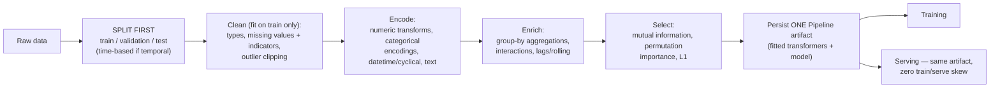
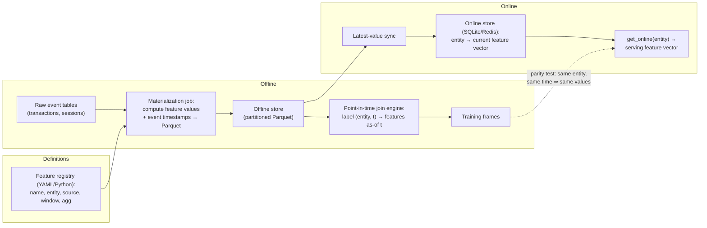

# 1.15 — Feature Engineering

## 1. Overview

**What is it?** Feature engineering is the craft of transforming raw, messy data into informative, well-scaled, leakage-free inputs that a model can actually learn from. It spans scaling and transforming numerics, encoding categoricals, extracting signal from dates and text, building aggregations and interactions, handling missing values and outliers — and packaging all of it into reproducible pipelines.

**Why does it exist?** Models can only learn what your features expose. A linear model cannot discover that traffic peaks at 8 a.m. and 6 p.m. from a raw integer `hour` column — but hand it $\sin/\cos$ cyclical features and it can. On tabular data, thoughtful features routinely matter *more than model choice*: a logistic regression with excellent features beats a gradient-boosted forest with lazy ones far more often than beginners expect.

**What problem does it solve?** It improves signal-to-noise, encodes domain knowledge the data alone doesn't reveal, normalizes scales so distance- and regularization-based models behave, expresses non-linear relationships in linear-model-friendly form, and — done properly — prevents the most expensive bug in applied ML: **data leakage**.

**Where is it used?** Every production ML system with tabular components: credit scoring, fraud detection, demand forecasting, recommendations, ads, pricing, ETA prediction. Even deep-learning products need engineered contextual features around their learned representations.

## 2. Learning Objectives

After this chapter you will be able to:

- Explain why feature quality dominates model choice on tabular problems.
- Choose the right numeric transform: standardization, min-max, robust scaling, log/Box-Cox/Yeo-Johnson, quantile transforms, and binning.
- Encode categoricals correctly: one-hot, ordinal, frequency, hashing, and out-of-fold **target encoding** — and know when each fails.
- Extract calendar features and build **cyclical** $\sin/\cos$ encodings for time-of-day/week/year.
- Build group-by aggregations, interaction features, and time-series lag/rolling features without peeking into the future.
- Define data leakage precisely, name its main variants, and audit a pipeline for it.
- Handle missing values (simple, model-based, indicator flags) and outliers (winsorizing, robust scaling).
- Implement transformers with the fit/transform contract from scratch and understand why the contract exists.
- Assemble scikit-learn `Pipeline` + `ColumnTransformer` preprocessing that is identical at train and serving time.
- Apply basic feature selection (filter, wrapper, embedded) and know when it's worth the effort.
- Explain what a feature store is and the train/serve-skew problem it solves.
- Diagnose and fix the classic leakage bugs in interviews and in real codebases.

## 3. Prerequisites

| Chapter | Why you need it |
|---|---|
| [NumPy & Pandas](../phase-0-prerequisites/05-numpy-pandas.md) | Group-bys, joins, datetime handling, and vectorized transforms are the daily tools here. |
| [Probability & Statistics](../phase-0-prerequisites/04-probability-statistics.md) | Means, medians, quantiles, and skew drive every scaling and imputation choice. |
| [ML Fundamentals](01-ml-fundamentals.md) | Train/test discipline and overfitting explain *why* leakage is fatal. |
| [Linear Regression](02-linear-regression.md) | The model whose limitations (linearity, scale sensitivity) most features exist to fix. |
| [Regularization](05-regularization.md) | Scaling is mandatory before L1/L2 penalties; L1 doubles as embedded feature selection. |
| [Evaluation Metrics](14-evaluation-metrics.md) | You judge every engineered feature by validated metric lift, nothing else. |

## 4. Intuition

A model is like a **chef**, and features are the ingredients you hand over. Give a world-class chef unwashed vegetables still in the crate ("raw database columns") and dinner will be mediocre. Give a decent chef cleaned, chopped, measured ingredients — plus a note that the guest is allergic to nuts (domain knowledge) — and dinner is excellent. Feature engineering is the prep kitchen: the model's ceiling is set before training ever starts.

An everyday story about **representation**: ask someone "is 23:50 close to 00:10?" — obviously yes, twenty minutes apart. But represented as raw numbers, 23.83 and 0.17 look maximally far apart, and a distance-based model like [KNN](06-knn.md) treats them that way. Map the hour onto a clock face — literally the point $(\sin, \cos)$ of the hour angle — and midnight's neighbors become close again. Nothing about the *data* changed; only its representation did, and the model went from blind to sighted.

And the cautionary tale of **leakage**: a student who memorizes the answer key scores 100% on the practice exam and fails the real one. A model whose features secretly contain the answer — a "days_until_churn" column, a scaler fitted on test rows, a target encoding computed on the row's own label — posts spectacular validation scores and collapses in production. Leakage is not an exotic bug; it is the *default outcome* of careless feature work, which is why disciplined pipelines are the core skill of this chapter.

## 5. Real-world Motivation

- **Uber** built its Michelangelo ML platform around feature pipelines, and its ETA models lean on engineered features like rolling median trip durations per zone and time-of-day effects; the company's public engineering posts credit feature quality and feature-store consistency as central to prediction quality.
- **Airbnb** developed Zipline, its feature-management framework, because teams kept re-implementing (and subtly disagreeing on) features like "host response rate over the last 30 days" — the train/serve-skew problem at organizational scale.
- **Netflix and Meta** engineer contextual features (device, time-of-day, session recency aggregates) around learned embeddings in their recommenders — deep learning did not eliminate tabular feature work, it surrounded it.
- **Kaggle competitions** on tabular data are won overwhelmingly on feature engineering: the TalkingData ad-fraud competition's top solutions were dominated by clever group-by count/aggregation features, with the model itself (gradient boosting) being table stakes.
- **Credit scoring** at banks worldwide runs on engineered ratios and aggregates (utilization, payment-history windows, inquiry counts) feeding regulated, interpretable models — feature engineering *is* the modeling in that industry.

## 6. Mathematical Foundations

Feature engineering is a toolbox rather than one theorem; the math is a set of small, precise transforms. Every symbol: $x$ = a raw feature value, $z$ = its transformed value, $\mu$ = training-set mean, $\sigma$ = training-set standard deviation, $x_{(q)}$ = the $q$-th quantile, $T$ = the period of a cyclical variable, $y$ = the target, $n_c$ = count of rows in category $c$, $m$ = smoothing strength.

### 6.1 Numeric scaling

**Standardization (z-score):**

$$
z = \frac{x - \mu}{\sigma}
$$

centers to mean 0, variance 1. Required by distance-based models (KNN, [SVM](11-svm.md), [K-Means](12-kmeans.md)), [PCA](13-pca.md), and anything with L1/L2 penalties (a penalty $\lambda\sum_j w_j^2$ is only fair if features share a scale). Tree models are scale-invariant and don't need it.

**Min-max scaling:** $z = (x - x_{\min})/(x_{\max} - x_{\min}) \in [0, 1]$ — useful for bounded inputs (e.g., pixel intensities, neural-net inputs) but fragile: one extreme value squashes everything else.

**Robust scaling:** $z = (x - \text{median})/(x_{(0.75)} - x_{(0.25)})$ — replaces mean/std with median/IQR so outliers can't dominate the statistics.

**Log-family transforms for skew:** $z = \log(1 + x)$ compresses heavy right tails (income, prices, counts). **Box-Cox** generalizes with parameter $\lambda$: $z = (x^\lambda - 1)/\lambda$ for $\lambda \ne 0$, $\log x$ at $\lambda = 0$ (requires $x > 0$); **Yeo-Johnson** extends this to zero/negative values. **Quantile transformation** maps values through the empirical CDF to a uniform (or then through the inverse normal CDF to a Gaussian) — maximal skew-flattening, at the cost of distorting distances.

**Binning:** discretize into intervals — equal-width, equal-frequency (quantile), or supervised (tree-based split points). Buys robustness and lets linear models fit step functions, at the cost of losing within-bin resolution.

### 6.2 Categorical encodings

**One-hot:** category $c$ out of $K$ becomes a $K$-dimensional indicator vector. Safe and interpretable; explodes memory/dimensionality when $K$ is large (a `user_id` with $10^6$ levels → $10^6$ columns).

**Ordinal:** map categories to integers — only when a true order exists (`small < medium < large`); otherwise you fabricate a fake geometry the model will happily exploit.

**Frequency/count encoding:** replace $c$ with its training-set count $n_c$ — one column, surprisingly effective with tree models when popularity itself is informative.

**Hashing trick:** $z = h(c) \bmod D$ maps arbitrary vocabulary into $D$ fixed buckets — constant memory, handles unseen categories natively, but collisions merge unrelated categories irreversibly.

**Target (mean) encoding** replaces category $c$ with a smoothed estimate of the target mean within it:

$$
\text{TE}(c) = \frac{n_c \,\bar{y}_c + m\, \bar{y}}{n_c + m},
$$

where $\bar{y}_c$ = mean target in category $c$, $\bar{y}$ = global mean target, and $m$ = smoothing strength (rare categories shrink toward the global mean; $m$ is the "pseudo-count" of prior faith). This is the single most powerful high-cardinality encoding **and** the single most dangerous leakage source: computed naively, each row's own label contaminates its feature. The cure is **out-of-fold (OOF) encoding**: split training data into $K$ folds; each row's encoding is computed only from the *other* folds' rows; test data uses statistics from all training rows. Learned **embeddings** (Phase 2+) generalize this idea into dense trainable vectors.

### 6.3 Datetime and cyclical features

From a timestamp extract: year, month, day, hour, weekday, `is_weekend`, `is_holiday`, `days_since_event`, `days_until_deadline`. For periodic components with period $T$ (24 hours, 7 days, 12 months):

$$
z_{\sin} = \sin\!\Big(\frac{2\pi t}{T}\Big),
\qquad
z_{\cos} = \cos\!\Big(\frac{2\pi t}{T}\Big).
$$

Two coordinates are needed because one alone is ambiguous ($\sin$ maps 3 a.m. and 9 a.m. to the same value); together they place each time uniquely on a circle, making 23:59 and 00:01 near-neighbors, as they should be.

### 6.4 Aggregations, interactions, time series

**Group-by aggregations:** for entity $e$ (user, merchant, zip code), compute $\text{mean}/\text{std}/\min/\max/\text{count}$ of some value over $e$'s history — e.g., `user_avg_order_value`, `merchant_txn_count_30d`. These "profile" features are the workhorses of fraud, credit, and recommendation systems.

**Interactions:** products or crosses of features — polynomial features $x_1 x_2, x_1^2$ let linear models express curvature; categorical crosses (`city × device_type`) capture combination effects. Dimensionality grows combinatorially; use domain sense or L1 selection.

**Time-series features:** lag features $x_{t-1}, x_{t-7}$; rolling statistics $\text{mean}(x_{t-7..t-1})$; expanding means. The iron rule: at prediction time $t$, a feature may use only information with timestamp $< t$ (strictly, less than the time the prediction must be made). Violating this — e.g., a rolling window centered on $t$ — is **temporal leakage**.

### 6.5 Missing values and outliers

Imputation: mean/median/mode (simple, biased toward the center), KNN imputation (use similar rows), iterative/MICE (model each feature from the others). Always consider adding a **missingness indicator** column — *that a value is missing* is often signal itself (an unreported income says something). Outliers: **winsorize** (clip at, say, the 1st/99th training percentiles), use robust scalers, or flag with isolation forests; never silently drop rows in production paths.

### 6.6 Data leakage, precisely

Leakage = any information available to the model during training that will **not** be legitimately available at prediction time. The taxonomy worth memorizing:

1. **Target leakage:** a feature is a proxy for (or consequence of) the label — e.g., `num_late_fees` when predicting default *before* granting the loan.
2. **Train/test contamination:** statistics (means for scaling, target encodings, imputation values, selected features) computed on data that includes validation/test rows.
3. **Temporal leakage:** features built from the future relative to prediction time.
4. **Group leakage:** near-duplicate entities (same patient, same user) split across train and test, letting the model memorize instead of generalize.

The defense is structural, not vigilance: **fit every statistic inside the training fold only**, which is exactly what the `Pipeline` abstraction enforces.

## 7. Visual Explanation



```
Cyclical encoding: why sin/cos            Raw hour (linear axis):
        cos                               0 1 2 ... 22 23
         |    23h . 0h                    |________________|
     22h .       |     . 1h               ^                ^
         .       |     .                  00:10 and 23:50 look
   ------+-------+-----+---- sin          maximally FAR apart
         .       |     .
     18h .       |     . 6h               On the circle: they are
          .      |    .                   correctly ADJACENT.
            12h  .
```

## 8. Algorithm

A disciplined feature-engineering workflow:

1. **Split first.** Create train/validation/test (time-based for temporal data, grouped for repeated entities) before computing *any* statistic.
2. **Explore (train only).** `describe()`, histograms, missingness map, target correlations, cardinality counts per categorical.
3. **Fix types.** Parse dates, coerce numerics, normalize category strings.
4. **Handle missing values.** Choose imputation per column; add indicator columns where missingness may be informative.
5. **Handle outliers.** Winsorize at train-set percentiles or switch to robust scaling.
6. **Encode categoricals.** Low cardinality → one-hot; high cardinality → OOF target encoding, frequency, or hashing.
7. **Transform numerics.** Log/Yeo-Johnson skewed ones; standardize for scale-sensitive models.
8. **Engineer datetime.** Calendar parts, cyclical pairs, time-since/until features.
9. **Aggregate and interact.** Group-by profiles per entity, domain-motivated ratios and crosses, past-only lags/rollings.
10. **Select.** Drop near-zero-variance and highly redundant features; rank by mutual information or permutation importance; keep the model honest and fast.
11. **Pipeline it.** Express steps 4–10 as fitted transformers inside a `Pipeline`/`ColumnTransformer`; cross-validate the *whole* pipeline.
12. **Persist and verify.** Save one artifact; assert train-time and serve-time transforms produce identical outputs on the same input.

Pseudocode for the crucial OOF target encoding:

```text
Input: train rows (x_cat, y), K folds, smoothing m
global_mean ← mean(y over all train rows)
for each fold k:
    stats_k ← per-category (count n_c, mean ȳ_c) computed on train MINUS fold k
    for each row i in fold k:
        c ← x_cat[i]
        TE[i] ← (n_c·ȳ_c + m·global_mean) / (n_c + m)   # from stats_k
                 (global_mean if c unseen in stats_k)
final_stats ← per-category stats on ALL train rows       # for test/serving
return TE (train feature), final_stats (transform for new data)
```

## 9. Worked Example

**Tiny example by hand — OOF target encoding.** Six training rows, feature `city`, binary target `clicked`, 2 folds, smoothing $m = 2$:

| row | city | clicked | fold |
|---|---|---|---|
| 1 | NY | 1 | A |
| 2 | NY | 0 | A |
| 3 | SF | 1 | A |
| 4 | NY | 1 | B |
| 5 | SF | 0 | B |
| 6 | SF | 0 | B |

Global mean $\bar{y} = 3/6 = 0.5$.

*Encoding fold A rows (statistics from fold B only):* fold B has NY: $n = 1, \bar{y}_{NY} = 1$; SF: $n = 2, \bar{y}_{SF} = 0$.
Row 1 & 2 (NY): $\text{TE} = \frac{1(1) + 2(0.5)}{1 + 2} = \frac{2}{3} \approx 0.667$. Row 3 (SF): $\text{TE} = \frac{2(0) + 2(0.5)}{2 + 2} = 0.25$.

*Encoding fold B rows (statistics from fold A only):* fold A has NY: $n = 2, \bar{y} = 0.5$; SF: $n = 1, \bar{y} = 1$.
Row 4 (NY): $\frac{2(0.5) + 2(0.5)}{4} = 0.5$. Rows 5, 6 (SF): $\frac{1(1) + 2(0.5)}{3} = \frac{2}{3} \approx 0.667$.

Notice row 3 (an SF click) received 0.25 while rows 5–6 (SF non-clicks) received 0.667 — each row's own label never touched its feature, which is the whole point. The *naive* encoding would give every SF row $\frac{1}{3}$ and every NY row $\frac{2}{3}$, quietly injecting each label into its own feature; with high-cardinality categories (many $n_c = 1$) the naive version essentially *is* the label, and validation scores become fiction.

**Realistic example.** Bike-share demand prediction: the raw data is little more than timestamp, weather, and count. Engineering `hour_sin/hour_cos`, `is_working_day`, `temp × hour` interaction, and a 3-hour rolling mean of demand typically cuts a linear model's RMSE by 30–50% versus raw columns — no model change at all. The same pattern repeats across ETA, sales-forecasting, and load-prediction problems: the calendar and recent history carry most of the signal, but only if you *express* them.

## 10. Python from Scratch

A minimal transformer framework with the fit/transform contract, plus a leakage-safe OOF target encoder. NumPy only.

```python
import numpy as np

class StandardScaler:
    """fit() LEARNS statistics (train only); transform() APPLIES them anywhere.
    This split is the entire defense against train/test contamination."""
    def fit(self, X, y=None):
        self.mean_ = X.mean(axis=0)              # (d,) train means
        self.std_ = X.std(axis=0) + 1e-8         # (d,) train stds (+eps: no /0)
        return self
    def transform(self, X):
        return (X - self.mean_) / self.std_      # same math for train/val/test

class Pipeline:
    """Chain transformers + final steps; fit runs fit+transform sequentially."""
    def __init__(self, steps):
        self.steps = steps                        # list of (name, transformer)
    def fit(self, X, y=None):
        for _, step in self.steps:
            X = step.fit(X, y).transform(X)       # each step fits on the
        return self                               # OUTPUT of the previous one
    def transform(self, X):
        for _, step in self.steps:
            X = step.transform(X)                 # apply-only: no re-fitting
        return X

class OOFTargetEncoder:
    """Out-of-fold target encoding for one categorical column (int codes)."""
    def __init__(self, n_folds=5, smoothing=10.0, seed=0):
        self.k, self.m, self.seed = n_folds, smoothing, seed

    def fit_transform_train(self, cats, y):
        # cats: (n,) int category codes; y: (n,) float/int targets
        n = len(cats)
        rng = np.random.default_rng(self.seed)
        fold = rng.integers(0, self.k, size=n)    # (n,) random fold ids
        self.global_mean_ = y.mean()
        out = np.full(n, self.global_mean_)       # default for unseen cats

        for f in range(self.k):
            tr = fold != f                        # rows OUTSIDE fold f
            # per-category count and mean, computed on out-of-fold rows only
            counts = np.bincount(cats[tr])
            sums = np.bincount(cats[tr], weights=y[tr])
            means = sums / np.maximum(counts, 1)
            te = (counts * means + self.m * self.global_mean_) / (counts + self.m)
            in_f = fold == f
            seen = cats[in_f] < len(te)           # guard: cat absent out-of-fold
            idx = np.where(in_f)[0][seen]
            out[idx] = te[cats[idx]]
        # final statistics on ALL train rows — used for val/test/serving
        counts = np.bincount(cats); sums = np.bincount(cats, weights=y)
        means = sums / np.maximum(counts, 1)
        self.te_ = (counts * means + self.m * self.global_mean_) / (counts + self.m)
        return out

    def transform(self, cats):                    # for NEW data: no labels used
        out = np.full(len(cats), self.global_mean_)
        seen = cats < len(self.te_)
        out[seen] = self.te_[cats[seen]]
        return out


# --- Demo: naive vs OOF encoding on pure-noise high-cardinality data ----
rng = np.random.default_rng(1)
n = 2000
cats = rng.integers(0, 1000, size=n)             # 1000 categories, ~2 rows each
y = rng.integers(0, 2, size=n).astype(float)     # target is PURE NOISE

enc = OOFTargetEncoder(smoothing=10.0)
te_oof = enc.fit_transform_train(cats, y)
print(f"corr(OOF TE, y)   = {np.corrcoef(te_oof, y)[0,1]:+.3f}")   # ≈ 0.00 ✓

# naive: each row's own label leaks into its feature
counts = np.bincount(cats); sums = np.bincount(cats, weights=y)
te_naive = (sums / np.maximum(counts, 1))[cats]
print(f"corr(naive TE, y) = {np.corrcoef(te_naive, y)[0,1]:+.3f}") # ≈ 0.7 !!
```

- **Expected output:** the OOF encoding of a pure-noise target correlates ~0.00 with the target (honest); the naive encoding correlates ~0.7 — a fake feature that would dominate any model and evaporate in production.
- **Complexity:** OOF encoding is $O(K \cdot n)$ with `bincount`; scaling is $O(nd)$.
- **Common bug:** calling `fit` (or `fit_transform`) on validation/test data. The `Pipeline.transform` path above deliberately has no fitting — mirror that structure and the bug becomes unrepresentable. A second classic: forgetting the unseen-category fallback (`global_mean_`), which crashes or mis-encodes new categories at serving time.

## 11. Library Implementation

```python
import pandas as pd
from sklearn.compose import ColumnTransformer
from sklearn.pipeline import Pipeline
from sklearn.preprocessing import (StandardScaler, OneHotEncoder,
                                   FunctionTransformer)
from sklearn.impute import SimpleImputer
from sklearn.model_selection import cross_val_score
from sklearn.linear_model import LogisticRegression
import numpy as np

num_cols = ["age", "income", "txn_amount"]
cat_cols = ["city", "device"]           # low cardinality → one-hot
hour_col = ["hour"]                     # cyclical

def cyclical_hour(X):
    """(n,1) hour 0–23 → (n,2) sin/cos on the 24h circle."""
    h = np.asarray(X, float)
    return np.hstack([np.sin(2 * np.pi * h / 24), np.cos(2 * np.pi * h / 24)])

pre = ColumnTransformer([
    # numeric: median-impute (robust to skew) then standardize
    ("num", Pipeline([
        ("impute", SimpleImputer(strategy="median", add_indicator=True)),
        ("scale", StandardScaler()),
    ]), num_cols),
    # categorical: constant-impute then one-hot; unseen categories → all-zeros
    ("cat", Pipeline([
        ("impute", SimpleImputer(strategy="constant", fill_value="missing")),
        ("onehot", OneHotEncoder(handle_unknown="ignore", min_frequency=20)),
    ]), cat_cols),
    # datetime: stateless cyclical transform
    ("cyc", FunctionTransformer(cyclical_hour), hour_col),
], remainder="drop")                    # explicit: unlisted columns excluded

clf = Pipeline([
    ("features", pre),
    ("model", LogisticRegression(max_iter=1000)),
])

# THE payoff: cross_val_score refits the ENTIRE pipeline per fold, so every
# imputer mean, scaler std, and one-hot vocabulary is learned fold-locally.
scores = cross_val_score(clf, X_df, y, cv=5, scoring="roc_auc")
print(scores.mean(), scores.std())

clf.fit(X_df, y)                        # final fit on all training data
# Persist ONE artifact — preprocessing + model travel together:
# joblib.dump(clf, "model.joblib"); serving calls clf.predict_proba(raw_df)
```

Line-by-line notes: `add_indicator=True` appends missingness-flag columns automatically. `handle_unknown="ignore"` makes unseen serving-time categories encode as all-zeros instead of crashing. `min_frequency=20` pools rare categories into an "infrequent" bucket, containing dimensionality. For genuine high-cardinality columns, add the `category_encoders` package: `TargetEncoder(smoothing=10)` — and note that inside a scikit-learn `Pipeline` under cross-validation it is fitted per fold, which is precisely the OOF discipline of Section 10. `remainder="drop"` is a deliberate safety default: new mystery columns can't silently enter the model.

## 12. Code Walkthrough

Shapes through the library pipeline for a batch of $n = 1{,}000$ raw rows:

| Tensor / object | Shape | Meaning |
|---|---|---|
| `X_df` | (1000, 6) | Raw dataframe: 3 numeric, 2 categorical, 1 hour column |
| after `num` imputer | (1000, 3 + n_missing_cols) | Median-filled numerics + missingness indicators |
| after `num` scaler | same | Standardized (train-fold means/stds) |
| after `cat` one-hot | (1000, ~K₁+K₂) | Sparse 0/1 indicators, rare levels pooled |
| after `cyc` | (1000, 2) | `hour_sin`, `hour_cos` on the unit circle |
| `pre.transform(X_df)` | (1000, d′) | Horizontal concat of the three blocks |
| `model` output | (1000,) / (1000, 2) | Predictions / class probabilities |

Expected results: `pre.get_feature_names_out()` enumerates the final columns — inspect it once per project; mystery columns found here have prevented many production incidents. On the OOF demo of Section 10, the headline numbers to remember: **naive target encoding manufactures ~0.7 correlation out of pure noise; OOF encoding reports the truth (~0.0)**. And a pipeline-vs-no-pipeline experiment on small datasets typically shows scale-first-then-split inflating CV AUC by several points relative to the honest fold-local version — the size of the lie you'd have shipped.

## 13. Complexity Analysis

- **Scaling / imputation / cyclical transforms:** $O(nd)$ time, $O(d)$ state — one pass to fit statistics, one to apply.
- **One-hot encoding:** $O(n)$ with sparse outputs; memory $O(\text{nnz}) = O(n \cdot \#\text{cat cols})$ sparse, but $O(nK)$ if you densify — the classic OOM trigger.
- **OOF target encoding:** $O(K_{\text{folds}} \cdot n)$ with bincount/group-by; state is $O(\#\text{categories})$.
- **Group-by aggregations:** $O(n \log n)$ (sort-based) or $O(n)$ (hash-based) per aggregation; rolling-window stats are $O(n)$ per column with monotonic-deque/prefix-sum tricks.
- **KNN / iterative (MICE) imputation:** $O(n^2 d)$ / several modeling passes per feature — reserve for small-to-medium data.
- **Feature selection:** filter methods (mutual information) $O(nd)$; wrapper methods (RFE) multiply full training cost by the number of eliminations — use sparingly.
- **Space:** the fitted-pipeline artifact is tiny ($O(d + \#\text{categories})$); the transformed matrix dominates, so prefer sparse representations end-to-end for high-cardinality data.

## 14. Advantages

- **Largest accuracy lever on tabular data.** Kaggle-winning solutions and industry post-mortems agree: a day of feature work routinely beats a month of hyperparameter tuning — e.g., adding group-by count features took TalkingData solutions from mid-pack to medal range.
- **Encodes domain knowledge the data can't reveal alone.** "Distance to nearest metro station" is one engineered column, yet no amount of training extracts it from raw latitude/longitude with a linear model.
- **Enables simple, cheap, interpretable models.** A logistic regression with strong features can match a boosted forest while serving in microseconds and satisfying credit-regulation explainability requirements.
- **Reduces data requirements.** Good representations shrink the hypothesis space; the model learns from thousands of rows what raw features would need millions to express.
- **Pipelines make correctness structural.** Once transforms live inside a fitted pipeline artifact, leakage and train/serve skew become hard to write rather than hard to avoid.

## 15. Disadvantages

- **Manual and slow.** Each feature is a hypothesis needing design, implementation, and validation; a rich feature set is weeks of skilled work with no guarantee of lift.
- **The leakage minefield.** Target encoding, aggregations, and time features all contain built-in footguns; a single leaked feature invalidates every experiment that included it — often discovered only after a production launch flops.
- **Maintenance burden.** Every feature is code with an upstream dependency; schema changes and source deprecations break features silently (the drifting-feature problem that feature stores exist to manage).
- **Doesn't transfer.** Features tuned for gradient boosting (e.g., raw ordinals, count encodings) may do nothing for a neural net, and vice versa; feature work is partly model-specific.
- **Obsolete for raw perceptual data.** For images, audio, and free text, learned representations (CNNs, transformers — Phase 2/3) decisively beat hand-crafted features; manual pixel/spectrogram features are a dead end there.
- **Combinatorial temptation.** Auto-generating thousands of interactions invites spurious correlations and multiple-testing overfitting; more features is not more signal.

## 16. Common Mistakes

- **Fitting any statistic before the split** — scaler means, imputation values, target encodings, vocabulary, even "which features to keep." Fix: split first; put everything in a `Pipeline`; let CV refit per fold.
- **Naive target encoding.** The Section 10 demo shows it fabricating signal from noise. Fix: out-of-fold encoding with smoothing, always.
- **Future-looking time features.** Rolling means centered on $t$, aggregations over the full history including post-prediction rows. Fix: end every window at $t - 1$; validate with a strictly-later test period.
- **One-hot on high-cardinality columns.** $10^5$ categories → memory blow-up and useless singleton indicators. Fix: target/frequency/hashing encoding, or `min_frequency` pooling.
- **Forgetting the unseen-category path.** Serving crashes on a new city name. Fix: `handle_unknown="ignore"` / global-mean fallback; test it explicitly.
- **Dropping missingness information.** Imputing and discarding the fact of missingness throws away signal. Fix: `add_indicator=True`.
- **Recomputing features differently at serving time.** Two implementations (training SQL vs serving Python) drift apart — train/serve skew. Fix: one artifact, one code path; add a parity test.
- **Ordinal-encoding unordered categories** and letting the model exploit fictitious order. Fix: ordinal only for genuinely ordered levels.

## 17. Best Practices

- [ ] Split first (time-based for temporal, grouped for repeated entities); freeze the test set.
- [ ] Express every transform as a fitted `Pipeline`/`ColumnTransformer` step; cross-validate the whole pipeline, never pre-transformed matrices.
- [ ] Keep a feature registry: name, definition, source columns, owner, and the validated metric lift that justified keeping it.
- [ ] Add missingness indicators; winsorize at train percentiles; log-transform heavy tails before scaling.
- [ ] For every time feature, write down the "as-of" rule (what was knowable at prediction time) and enforce point-in-time joins.
- [ ] Test serving parity: assert `pipeline.transform(sample)` in the service equals the training-time output byte-for-byte.
- [ ] Run a leakage audit before believing any great result: feature-target correlations that look too good, per-feature permutation importance, and a "train on shuffled labels" sanity check (real signal should vanish).
- [ ] Prefer a few domain-motivated features over thousands of auto-generated ones; prune with permutation importance.
- [ ] Version pipeline artifacts alongside models; a feature change is a model change.
- [ ] Monitor feature distributions in production (PSI/KS vs training) — feature drift is the most common silent killer.

## 18. Optimization Techniques

- **Vectorize and batch.** Replace row-wise `apply` with vectorized pandas/NumPy ops and `groupby().agg()` — 10–100× speedups; for bigger-than-RAM data, use Polars or DuckDB for the aggregation layer.
- **Cache computed features.** Persist expensive aggregations to Parquet keyed by (entity, as-of-date); recompute incrementally, not from scratch — this is a proto-feature-store.
- **Feature stores (Feast, Tecton, Vertex AI Feature Store).** Centralize definitions, guarantee **point-in-time correct joins** for training, and serve the same values online — the industrial solution to train/serve skew and duplicated feature logic.
- **Sparse end-to-end.** Keep one-hot/hashing outputs in CSR matrices through the model (`LogisticRegression`, `LinearSVC`, boosting libraries all accept sparse) — memory drops by orders of magnitude.
- **Reduce cardinality before encoding.** Pool rare levels (`min_frequency`), hash to fixed buckets, or hierarchize (city → region) — smaller, denser, more general features.
- **Automated feature generation, used judiciously.** Featuretools (deep feature synthesis) and similar AutoFE tools enumerate aggregation candidates; treat their output as *hypotheses* to prune with permutation importance, not as a finished feature set.
- **Downcast dtypes.** `float64 → float32`, `object → category` halves-to-quarters memory before any modeling starts.

## 19. Industry Applications

- **Ride-hailing and delivery (Uber, DoorDash).** ETA and dispatch models consume rolling per-zone travel-time aggregates, driver-history profiles, and calendar/cyclical features served from feature platforms like Michelangelo's feature store (Palette).
- **Marketplaces (Airbnb, Amazon).** Pricing and ranking models rely on engineered listing/product profiles — review velocities, host response aggregates, distance-to-landmark features; Airbnb's Zipline/Chronon exists to manage exactly this feature lifecycle.
- **Fraud and payments (banks, Stripe-class processors).** Velocity features (transactions per card per hour), deviation-from-profile ratios, and merchant aggregates are the backbone; almost all of them are group-by aggregations with strict as-of semantics.
- **Credit scoring.** Regulated scorecards are built from engineered ratios (utilization, debt-to-income, payment-history windows) precisely because features must be individually explainable to regulators and customers.
- **Forecasting (retail, energy).** Demand models at grocery chains and grid operators run on lags, rolling statistics, holiday calendars, weather joins, and cyclical seasonality encodings — feature engineering is most of the modeling.
- **Recommenders (Netflix, Meta, Spotify).** Contextual tabular features (device, session recency, time-of-day, interaction counts) are engineered around learned embeddings; the feature-store pattern (e.g., Meta's internal systems, open-source Feast) keeps them consistent between training and online inference.

## 20. Interview Questions

### Beginner

- **Q: Why do we scale features, and which models need it?**
  **A:** Scale-sensitive models combine features through distances or penalized weights: KNN, K-Means, SVM, PCA, and regularized linear models all let a large-unit feature dominate. Standardization puts features on comparable footing. Tree-based models split on thresholds and are scale-invariant.
- **Q: What is data leakage? Give three examples.**
  **A:** Training-time access to information unavailable at prediction time. Examples: (1) a feature that's a consequence of the label (`refund_issued` when predicting fraud); (2) fitting a scaler or target encoding on data including test rows; (3) rolling features that include future values relative to prediction time.
- **Q: Why sin/cos for hour-of-day instead of the raw integer?**
  **A:** Raw hour makes 23 and 0 maximally distant though they're 1 hour apart. $\sin(2\pi h/24), \cos(2\pi h/24)$ place hours on a circle, restoring true adjacency; two coordinates are needed because either alone maps two different hours to one value.
- **Q: One-hot vs ordinal encoding — when is each correct?**
  **A:** Ordinal only when categories have a real order (shirt sizes, education levels) — the integer distances become model-visible geometry. One-hot for unordered categories; it adds $K$ columns but fabricates no order.
- **Q: How do you handle missing values?**
  **A:** Understand *why* they're missing first. Then: median/mode imputation for a baseline, model-based (KNN/iterative) when relationships matter, and almost always an added indicator column — missingness itself is frequently predictive.

### Intermediate

- **Q: Explain target encoding and exactly how leakage arises. How is it prevented?**
  **A:** Replace category $c$ with a smoothed mean of the target within $c$: $(n_c\bar{y}_c + m\bar{y})/(n_c + m)$. Computed naively on all training rows, each row's own label enters its own feature — for rare categories the feature nearly *equals* the label, so validation wildly overestimates. Prevention: out-of-fold encoding (each row encoded from other folds' statistics), smoothing toward the global mean, and full-train statistics applied to test/serving only.
- **Q: Why must preprocessing live inside the cross-validation loop?**
  **A:** Any statistic fitted on the full training set before CV (scaler means, encodings, selected features) has seen the validation folds, contaminating them; scores become optimistically biased — sometimes by several AUC points on small data. A `Pipeline` inside `cross_val_score` refits everything per fold, keeping each validation fold genuinely unseen.
- **Q: Design leakage-free features for churn prediction as of time $t$.**
  **A:** Define the prediction time explicitly, then build features only from data timestamped $< t$: activity counts over trailing windows $(t-30d, t)$, tenure, support tickets before $t$, payment history before $t$. Label = churn in $(t, t+30d)$. Validate on a strictly later time slice. Forbid any post-$t$ field (cancellation reason, final NPS survey).
- **Q: You have a 500k-level `merchant_id` column. Encoding options and trade-offs?**
  **A:** One-hot is out (memory, singleton levels). Options: OOF target encoding (most signal, needs leakage discipline), frequency encoding (cheap popularity proxy), hashing (fixed memory, handles new merchants, suffers collisions), learned embeddings (best with deep models, needs training data), and hierarchical pooling (merchant → category). Often: target + frequency together, rare levels pooled.
- **Q: Filter vs wrapper vs embedded feature selection?**
  **A:** Filter: rank features by a model-free statistic (mutual information, correlation) — fast, ignores interactions. Wrapper: search subsets by retraining the model (RFE) — captures interactions, expensive, overfits the validation signal if unchecked. Embedded: selection happens inside training (L1 zeroing coefficients, tree importances) — good default. In practice: filter to prune the absurd, embedded/permutation importance for the final call.

### Advanced

- **Q: Your model gets 0.98 validation AUC and 0.62 in production. Walk through your audit.**
  **A:** This gap screams leakage or skew. (1) Rank features by importance; interrogate the top ones for target proximity and as-of correctness. (2) Check split design: temporal data with a random split leaks the future; duplicate entities across folds leak identity. (3) Check every fitted statistic's provenance (scalers, encoders, imputers, feature selection) — full-data fits contaminate. (4) Compare training vs serving feature values for the same entities (train/serve skew). (5) Retrain with the suspect feature(s) ablated and with a proper time-based split; the honest number is the one that survives.
- **Q: What is a point-in-time correct join, and why do feature stores make it a first-class primitive?**
  **A:** When building training rows for (entity, event-time $t$) labels, each feature must be joined at its value *as of* $t$ — the latest snapshot before $t$, not today's value. Naive joins against current feature tables silently inject the future into training (a customer's "current balance" reflects post-event behavior). Feature stores log feature values with timestamps and execute as-of joins automatically, which is most of their training-side value; the serving side then guarantees the same definitions online.
- **Q: When can feature *scaling choice* change model predictions rather than just optimization speed?**
  **A:** Whenever the objective or geometry is scale-dependent: L1/L2-regularized models penalize weights whose meaning depends on feature scale (rescaling one feature changes which solution minimizes the penalized loss); distance-based methods (KNN, K-Means, RBF-kernel SVM) change neighborhoods; PCA changes directions of maximal variance entirely. For unregularized OLS or tree models, scaling changes nothing but conditioning.
- **Q: How would you detect that an individual feature has begun to drift or rot in production?**
  **A:** Per-feature monitoring against a training reference: PSI or KS statistics on distributions, null-rate and cardinality tracking, and — with delayed labels — per-feature permutation importance over time. Alert on sustained shifts; complement with a canary model retrained regularly whose divergence from the production model localizes the drifting inputs. Root causes are usually upstream schema/ETL changes, not user behavior.
- **Q: Neural nets learn features — why does tabular ML still reward manual feature engineering?**
  **A:** Tabular columns are heterogeneous, uncalibrated, and low-sample relative to their interaction space; there's no local smoothness prior (like image translation invariance) for architectures to exploit, which is why boosted trees plus engineered features still match or beat deep models on most tabular benchmarks (see Grinsztajn et al., 2022). Manual features inject domain priors that data volume can't replace: as-of ratios, entity aggregates, cyclical time. Deep tabular models help most when data is huge or when embeddings of high-cardinality IDs matter — and even then, engineered contextual features surround them.

## 21. Coding Exercises

### Easy

1. **Skew repair.** Take a heavy-tailed feature (e.g., simulated incomes `np.random.lognormal(10, 1, 10000)`); plot histograms raw, after `log1p`, and after `QuantileTransformer`; compare a linear model's fit on each. *Hint: skew shows in `scipy.stats.skew`; aim near 0.*
2. **Cyclical payoff.** Fit linear regression predicting synthetic daily-traffic data from (a) raw hour and (b) `hour_sin/hour_cos`; compare RMSE. *Hint: generate traffic as a sum of two Gaussian bumps at 8 h and 18 h plus noise.*

### Medium

1. **OOF target encoder.** Implement out-of-fold target encoding with smoothing as a class with `fit_transform_train`/`transform`; demonstrate on pure-noise targets that the naive version fabricates correlation while yours doesn't. *Hint: Section 10 is your specification — write it before peeking.*
2. **Leakage hunt.** Take a pipeline that (a) scales on the full dataset before splitting, (b) target-encodes naively, and (c) selects features using all rows — quantify the inflated CV score of each sin separately, then fix all three. *Hint: run each variant 20 times on small resamples so the inflation is visible above noise.*
3. **ColumnTransformer build-out.** Construct a full preprocessing pipeline for a mixed dataset (numeric + low-card categorical + high-card categorical + timestamp) and verify `get_feature_names_out()` matches your expectations. *Hint: wrap the datetime expansion in a `FunctionTransformer` with `feature_names_out` provided.*

### Hard

1. **Point-in-time features.** Given a transactions table and labeled events at various times, build "sum/count of transactions in the trailing 7/30 days as of each label time" using only past rows; write a test proving no future row contributes. *Hint: sort by time and use `pd.merge_asof` or a two-pointer sweep.*
2. **Rolling features at scale.** Compute 7-day rolling mean/std per entity for 10M rows within a memory budget; compare naive `groupby().rolling()` against a sorted single-pass implementation. *Hint: prefix sums per entity give O(1) window queries.*
3. **Mini feature store.** Implement a `FeatureStore` class that registers feature definitions, materializes them to Parquet with timestamps, and serves point-in-time correct training joins plus latest-value online lookups; include a train/serve parity test. *Hint: the API is three methods — `register`, `get_training_frame(entity_times)`, `get_online(entity)`.*

## 22. Mini Project

**Bike-sharing demand: beat the raw-feature baseline by 30%.**

1. Load the UCI/Kaggle Bike Sharing dataset (hourly rentals with weather and calendar fields).
2. Split **by time**: train on the first ~18 months, test on the final months.
3. Baseline: gradient-boosted trees (or random forest) on raw columns; record test RMSE.
4. Engineer ~20 features: cyclical hour/weekday/month pairs, `is_rush_hour`, `is_working_day`, temperature × hour interaction, weather-severity ordinal, lag-1/lag-24 demand, 3h and 24h rolling means (past-only!).
5. Rebuild the model on engineered features inside a single `Pipeline`; compare RMSE — target ≥ 30% improvement.
6. Run permutation importance; write one sentence per top-10 feature explaining *why* it plausibly helps.
7. Deliberately break one thing — make the rolling mean centered instead of trailing — and document how much the (leaky) test score improves, as a leakage object lesson.

## 23. Medium Project

**Home Credit-style multi-table aggregation features.**

1. Use the Kaggle Home Credit Default Risk data (main application table + bureau, previous-application, installments tables) or any multi-table credit dataset.
2. Establish a main-table-only baseline (gradient boosting, AUC on a stratified split).
3. Engineer aggregation features joining each side table to the application: counts, means, maxima, trends (e.g., `bureau_active_credit_count`, `prev_app_refusal_rate`, `installment_late_ratio`, utilization ratios).
4. Maintain a feature document: for every feature — definition, motivation, and measured AUC delta when added (ablation).
5. Enforce leakage discipline: all statistics computed within `Pipeline`-managed folds; verify no side-table row postdates the application decision.
6. Apply OOF target encoding to high-cardinality categoricals (occupation, organization type); compare against frequency encoding.
7. Prune with permutation importance to a final ≤ 60-feature model; report baseline vs final AUC and the top-15 features.
8. Stretch: measure how much of the total lift came from the *top 5* features alone — the usual answer (most of it) is the lesson.

## 24. Advanced Project

**Build a miniature feature store with point-in-time training joins and online serving.**

*Architecture:*



*Implementation phases:*

1. **Registry.** Define features declaratively: entity key, source table, aggregation (sum/count/mean), window (7d/30d/lifetime). Parse into executable specs.
2. **Materialization.** A batch job computes each feature over event data, storing (entity, feature, value, event_timestamp) rows to partitioned Parquet; support incremental runs (only new events).
3. **Point-in-time joins.** Given labels as (entity, label_time) pairs, assemble the training frame where each feature takes its most recent value *strictly before* label_time (`merge_asof` per feature group). Property-test it: inject a future event and assert it never appears in any training row.
4. **Online path.** Sync latest values into a key-value store; expose `get_online(entity)` returning the serving vector with per-feature freshness timestamps.
5. **Parity and monitoring.** A test harness replays historical timestamps through both paths and asserts equality; add PSI-based drift reports comparing serving distributions to the training frame.
6. **Integration.** Train a fraud-style classifier on the training frames; serve it behind a small API that fetches features from the online store — end-to-end, one feature codebase.
7. *Possible improvements:* streaming updates (consume an event queue instead of batch), feature versioning with backfills, TTL/freshness SLAs with alerting, a web UI over the registry, and benchmarking against Feast on the same definitions.

## 25. Summary

- Features set the model's ceiling: on tabular problems, representation beats architecture — invest accordingly.
- Scale-sensitive models (distance-based, regularized linear, PCA) need standardized inputs; trees don't. Log/Yeo-Johnson tames skew; robust/quantile scaling tames outliers.
- Categoricals: one-hot for low cardinality; OOF target encoding (smoothed) for high cardinality; frequency and hashing as cheap alternatives; ordinal only for true order.
- Cyclical time belongs on a circle: $\sin(2\pi t/T), \cos(2\pi t/T)$ — both coordinates, or the encoding is ambiguous.
- Group-by aggregations ("entity profiles") and past-only lags/rollings are the workhorse features of fraud, credit, and forecasting systems.
- Missingness is often signal — impute *and* add indicator flags; winsorize at train percentiles rather than dropping rows.
- Leakage taxonomy: target leakage, train/test contamination, temporal leakage, group leakage. The defense is structural: split first, fit statistics per fold, point-in-time joins.
- Naive target encoding fabricates signal from pure noise (~0.7 fake correlation in this chapter's demo); out-of-fold encoding reports the truth.
- One `Pipeline`/`ColumnTransformer` artifact = identical train and serving transforms = no skew; cross-validate the pipeline, never pre-transformed data.
- Feature stores industrialize the pattern: registered definitions, point-in-time correct training joins, and consistent online serving.
- Select features with embedded methods and permutation importance; a small set of justified features beats thousands of auto-generated ones.
- Monitor feature distributions in production — feature drift, not model decay, is the usual silent failure.

## 26. Cheat Sheet

| Transform | Formula / call | Use when |
|---|---|---|
| Standardize | $z = (x-\mu)/\sigma$ | Distance/regularized models |
| Robust scale | $(x - \text{med})/\text{IQR}$ | Outliers present |
| Log1p | $\log(1+x)$ | Right-skewed counts/amounts |
| Cyclical | $\sin, \cos(2\pi t/T)$ | Hour/weekday/month |
| One-hot | `OneHotEncoder(handle_unknown="ignore")` | Cardinality ≲ 50 |
| Target enc. | $\frac{n_c\bar y_c + m\bar y}{n_c+m}$, OOF | High cardinality + labels |
| Frequency enc. | $x \to n_c$ | Popularity is signal |
| Missing flag | `add_indicator=True` | Missingness informative |
| Winsorize | clip at train P1/P99 | Heavy tails |
| Lag/rolling | window ending at $t{-}1$ | Time series |

**Defaults:** median imputation + indicators; `StandardScaler` for linear/distance models; `min_frequency` pooling of rare levels; OOF folds $K=5$, smoothing $m \approx 10$; time-based splits for anything temporal.

**One-liners:** split before any statistic; every `fit` happens inside the pipeline; windows end at $t-1$; unseen categories need a fallback path; a feature you can't explain is a feature you can't debug.

**Gotchas:** naive target encoding; scaler fitted pre-split; centered rolling windows; one-hot memory blow-ups; ordinal-encoding unordered categories; train/serve implementations drifting apart; duplicate entities straddling folds.

## 27. Further Reading

- **Books:** *Feature Engineering for Machine Learning* (Zheng & Casari, O'Reilly); *Feature Engineering and Selection* (Kuhn & Johnson — free online); *Designing Machine Learning Systems* (Chip Huyen) — feature and data-distribution chapters; *The Kaggle Book* (Banachewicz & Massaron) for competition-grade technique.
- **Research papers:** Micci-Barreca, "A Preprocessing Scheme for High-Cardinality Categorical Attributes" (target encoding, 2001); Kaufman et al., "Leakage in Data Mining" (2012); Grinsztajn et al., "Why Do Tree-Based Models Still Outperform Deep Learning on Tabular Data?" (2022); Kanter & Veeramachaneni, "Deep Feature Synthesis" (Featuretools, 2015).
- **Documentation:** scikit-learn user guide — preprocessing, impute, compose (`Pipeline`, `ColumnTransformer`); `category_encoders` docs; Feast documentation (feature-store concepts, point-in-time joins).
- **GitHub repositories:** `feast-dev/feast`, `scikit-learn-contrib/category_encoders`, `alteryx/featuretools`, `pola-rs/polars` (fast aggregation layer).
- **Datasets:** UCI/Kaggle Bike Sharing, Home Credit Default Risk, TalkingData AdTracking Fraud, IEEE-CIS Fraud Detection — all classic feature-engineering playgrounds.
- **Videos:** Kaggle Grandmaster feature-engineering talks (e.g., KaggleDaysSF sessions); "How to Win a Data Science Competition" course lectures on mean encodings; Feast/Tecton feature-store conference talks (apply() conference archives).
- **Blogs:** Uber Engineering on Michelangelo and its Palette feature store; Airbnb Engineering on Zipline/Chronon; the Kaggle winners' solution write-ups for TalkingData and Home Credit; Netflix TechBlog posts on ML infrastructure and feature consistency.
