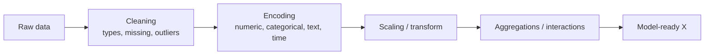

# 1.15 — Feature Engineering

## 1. Intuition first

Models can only learn what your features expose. Turning raw data into informative, well-scaled, leakage-free features is what separates 50th-percentile ML engineers from top-decile ones. This is often *more* important than model choice.

## 2. Why the topic exists

- Bridges the gap between raw messy data and model-ready inputs.
- Encodes domain knowledge.
- Enables simple models to match complex ones on tabular data.

## 3. What problem it solves

Improves signal-to-noise, handles missing values, normalizes scale, expresses non-linear relationships, prevents leakage.

## 4. Mathematics / Techniques (not one formula)

### 4.1 Handling numerics
- Log / Box-Cox / Yeo-Johnson for skewed distributions.
- Standardization: $z = (x - \mu)/\sigma$.
- Min-max scaling.
- Robust scaling (median / IQR).
- Quantile transformation (uniform / normal).
- Binning (equal-width, equal-frequency, decision-tree binning).

### 4.2 Categorical
- One-hot encoding.
- Ordinal encoding (only when order is meaningful).
- Target / mean encoding with k-fold to avoid leakage.
- Frequency / count encoding.
- Hashing trick (fixed vocab for huge cardinality).
- Embeddings (learned).

### 4.3 Datetime
- Extract year/month/day/hour/weekday/is_weekend/is_holiday.
- Cyclical encoding: $\sin(2\pi t/T)$, $\cos(2\pi t/T)$.
- Time since / time until reference event.

### 4.4 Text
- TF-IDF, character n-grams.
- Hashed n-grams.
- Pretrained embeddings (Phase 3).

### 4.5 Interactions & aggregations
- Polynomial features.
- Cross features (categorical × categorical).
- Group-by aggregations (mean/std/min/max per user/product/day).
- Lag features and rolling stats for time series.

### 4.6 Missing values
- Drop / mean / median / mode.
- Model-based imputation (KNN, MICE, iterative).
- Missingness indicator feature.

### 4.7 Outliers
- Winsorization (clip at 1st/99th percentiles).
- Robust scaler.
- Isolation Forest to flag.

## 5. Every formula explained

- Standardization centers and scales — required for distance/regularized models.
- Cyclical sin/cos preserves "23:59 close to 00:00".
- Mean target encoding replaces category by group mean of target — must use out-of-fold to avoid leakage.

## 6. Variables

Context-dependent.

## 7. Algorithm — a disciplined FE workflow

1. **Split first**, then compute any statistic on train only.
2. Understand data via EDA (`describe`, histograms, missingness map).
3. Fix data types, parse dates.
4. Handle missing values (with indicator).
5. Encode categoricals appropriately.
6. Scale numerics.
7. Engineer aggregations & interactions.
8. Add domain features.
9. Feature selection (mutual information, permutation importance, L1).
10. Persist a scikit-learn Pipeline / ColumnTransformer so train/serve stays consistent.

## 8. Simple example

`hour_of_day` → sin/cos pair. Now a linear model can learn that traffic peaks at 8 and 18.

## 9. Real-world example

- Airbnb: "distance to nearest metro" + "reviews per month" + "host response time" beat raw features.
- Uber: rolling 7-day median trip duration per zone → strong ETA feature.
- Kaggle "TalkingData Fraud": target-encoded aggregations dominated.

## 10. Diagram



## 11. Implementation from scratch — a mini `Pipeline`

```python
class Pipeline:
    def __init__(self, steps):
        self.steps = steps
    def fit(self, X, y=None):
        for name, step in self.steps:
            step.fit(X, y); X = step.transform(X)
        return self
    def transform(self, X):
        for _, step in self.steps:
            X = step.transform(X)
        return X

class StandardScaler:
    def fit(self, X, y=None):
        self.mean_ = X.mean(0); self.std_ = X.std(0) + 1e-8; return self
    def transform(self, X):
        return (X - self.mean_) / self.std_
```

## 12. Implementation using libraries

```python
from sklearn.compose import ColumnTransformer
from sklearn.pipeline import Pipeline
from sklearn.preprocessing import StandardScaler, OneHotEncoder
from sklearn.impute import SimpleImputer
from category_encoders import TargetEncoder

num_cols = ["age", "income"]; cat_cols = ["city"]; te_cols = ["merchant"]
pre = ColumnTransformer([
    ("num", Pipeline([("imp", SimpleImputer(strategy="median")),
                      ("sc", StandardScaler())]), num_cols),
    ("cat", OneHotEncoder(handle_unknown="ignore"), cat_cols),
    ("te", TargetEncoder(cv=5, smoothing=10), te_cols),
])
```

## 13. Time complexity

Depends. Pre-computed statistics (mean/std) O(n). Target encoding with k-fold O(kn). Aggregations by group O(n log n).

## 14. Space complexity

Same order as data plus feature expansion.

## 15. Advantages

- Massive lift in tabular performance.
- Encodes knowledge.
- Enables simpler, faster models.

## 16. Disadvantages

- Manual, time-consuming.
- Easy to leak information.
- Model-specific optimizations may not transfer.

## 17. Interview questions

1. Explain data leakage; give three examples.
2. Why standardize before regularization?
3. Target encoding — how do you prevent leakage?
4. Cyclical encoding for time features — why sin/cos?
5. When would you use frequency encoding vs one-hot?
6. Feature crosses — what and why?
7. How do lag features work? What are the pitfalls?
8. Robust vs standard scaler.
9. When is feature selection worth it?
10. Difference between filter, wrapper, embedded selection.

## 18. Common mistakes

- Fitting scaler on full data before split.
- Target encoding without out-of-fold.
- Forgetting to persist encoders for inference.
- Using future-only aggregations (leakage in time series).
- One-hot exploding memory for high-cardinality features.

## 19. Optimization techniques

- Use `sklearn.pipeline` + `ColumnTransformer` religiously.
- Feature store (Feast) for consistent train/serve.
- Automatic feature engineering (Featuretools, TabPFN, AutoFE).
- Cache computed features (Parquet / feature store).

## 20. Coding exercises

1. Implement out-of-fold target encoding.
2. Detect and fix a leakage bug in a provided notebook.
3. Build a `ColumnTransformer` that handles numeric/categorical/time.
4. Add rolling 7-day mean features to a time-series dataset.

## 21. Mini project

Kaggle Bike-Sharing demand: build 20 well-engineered features, beat a random forest baseline by 30%.

## 22. Medium project

Home Credit Default Risk: aggregate features across previous applications, bureau data, credit-card balances; document each engineered feature and its motivation.

## 23. Advanced project

Build a feature store from scratch: a Python service that stores computed features in Parquet, offers point-in-time correct joins, and integrates with a training pipeline.

## 24. Where it is used in industry

Every production ML system uses careful feature engineering, even those built on top of deep learning (for tabular components, contextual features, etc.).

## 25. How companies use it

- **Uber Michelangelo**, **Airbnb Zipline**, **Feast** are feature-store platforms.
- **Kaggle Grandmasters** often win on feature engineering, not model choice.

## 26. When NOT to use it

- End-to-end deep-learning on raw perceptual data (images, audio, text) — the network learns features.
- Very early prototyping — start with basic features first, add complexity only when justified.
