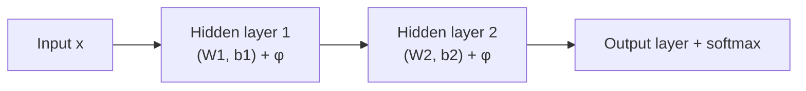

# 2.1 — Perceptron & Multi-Layer Perceptron (MLP)

## 1. Intuition first

A perceptron is a single neuron: weighted sum of inputs → activation → output. Stack neurons in a layer → a **layer**. Stack layers → an **MLP** (aka feed-forward neural network). With just one hidden layer and enough neurons, an MLP can approximate any continuous function (Universal Approximation Theorem). Depth trades width for representational compactness.

## 2. Why the topic exists

Linear models can't learn non-linear boundaries. Perceptrons introduced the idea of a **learnable** neuron; MLPs stacked them and, once we could train them with backprop, they became the foundation of deep learning.

## 3. What problem it solves

Learn non-linear mappings from inputs to outputs for classification and regression on any vectorized data.

## 4. Mathematics

### 4.1 A single neuron

$$
z = \mathbf{w}^T \mathbf{x} + b, \quad a = \phi(z)
$$

$\phi$ is an activation (sigmoid, tanh, ReLU, …).

### 4.2 A layer

$$
\mathbf{a}^{(l)} = \phi\big(W^{(l)} \mathbf{a}^{(l-1)} + \mathbf{b}^{(l)}\big)
$$

$W^{(l)} \in \mathbb{R}^{d_l \times d_{l-1}}$, $\mathbf{b}^{(l)} \in \mathbb{R}^{d_l}$.

### 4.3 Universal Approximation Theorem

For any continuous $f: [0,1]^d \to \mathbb{R}$ and $\epsilon > 0$, there exists a 1-hidden-layer MLP $\hat f$ with enough units such that $\|f - \hat f\|_\infty < \epsilon$.

### 4.4 Classification head

- Binary: sigmoid + BCE.
- Multi-class: softmax + cross-entropy.

## 5. Every formula explained

- Neuron = affine transform + non-linearity.
- Depth composes non-linear transforms, exponentially increasing expressive power.
- UAT justifies "networks can approximate anything" but says nothing about how easy that is to learn.

## 6. Variables

| Symbol | Meaning |
|--------|---------|
| $\mathbf{a}^{(l)}$ | activation at layer $l$ |
| $W^{(l)}$ | weight matrix at layer $l$ |
| $\mathbf{b}^{(l)}$ | bias at layer $l$ |
| $\phi$ | activation function |

## 7. Algorithm — forward pass of an MLP

Input $\mathbf{x} = \mathbf{a}^{(0)}$. For $l = 1..L$:

$$
\mathbf{z}^{(l)} = W^{(l)} \mathbf{a}^{(l-1)} + \mathbf{b}^{(l)}, \quad \mathbf{a}^{(l)} = \phi_l(\mathbf{z}^{(l)})
$$

Output = $\mathbf{a}^{(L)}$.

## 8. Simple example

XOR — a perceptron cannot solve it (not linearly separable). A 2-hidden-unit MLP with tanh + sigmoid solves it perfectly.

## 9. Real-world example

- Tabular deep-learning baselines (TabNet, MLP + entity embeddings).
- Recommender towers (two-tower architectures).
- Every classification head at the tip of a CNN or transformer.

## 10. Diagram

```
   x1 ─┐   ┌── h1 ─┐   ┌── ŷ
   x2 ─┼──►│       ├──►│
   x3 ─┘   └── h2 ─┘   └── ŷ
        W(1)          W(2)
```



## 11. Implementation from scratch — 2-layer MLP for MNIST

```python
import numpy as np

def relu(z): return np.maximum(0, z)
def relu_deriv(z): return (z > 0).astype(float)
def softmax(z):
    z = z - z.max(axis=1, keepdims=True)
    e = np.exp(z); return e / e.sum(axis=1, keepdims=True)

class MLP:
    def __init__(self, sizes, lr=0.1, seed=0):
        rng = np.random.default_rng(seed)
        self.W = [rng.normal(scale=np.sqrt(2 / a), size=(a, b))
                  for a, b in zip(sizes[:-1], sizes[1:])]        # He init
        self.b = [np.zeros(b) for b in sizes[1:]]
        self.lr = lr

    def forward(self, X):
        self.a = [X]; self.z = []
        for i, (W, b) in enumerate(zip(self.W, self.b)):
            z = self.a[-1] @ W + b
            a = softmax(z) if i == len(self.W) - 1 else relu(z)
            self.z.append(z); self.a.append(a)
        return self.a[-1]

    def backward(self, Y):                      # Y: one-hot
        m = Y.shape[0]
        dz = (self.a[-1] - Y) / m               # softmax + CE gradient
        for i in reversed(range(len(self.W))):
            dW = self.a[i].T @ dz
            db = dz.sum(axis=0)
            if i > 0:
                dz = dz @ self.W[i].T * relu_deriv(self.z[i - 1])
            self.W[i] -= self.lr * dW
            self.b[i] -= self.lr * db

    def fit(self, X, Y, epochs=20, batch=64):
        for _ in range(epochs):
            idx = np.random.permutation(len(X))
            for s in range(0, len(X), batch):
                b_idx = idx[s:s+batch]
                self.forward(X[b_idx]); self.backward(Y[b_idx])
```

## 12. Implementation using libraries

```python
import torch, torch.nn as nn, torch.nn.functional as F

class MLP(nn.Module):
    def __init__(self, in_dim, hidden, out_dim):
        super().__init__()
        self.net = nn.Sequential(
            nn.Linear(in_dim, hidden), nn.ReLU(),
            nn.Linear(hidden, hidden), nn.ReLU(),
            nn.Linear(hidden, out_dim),
        )
    def forward(self, x): return self.net(x)
```

## 13. Time complexity

Forward for one layer: O(B × d_in × d_out). Whole net: sum of layer costs.

## 14. Space complexity

Parameters O(sum d_l × d_{l-1}). Activations (kept for backprop) O(B × sum d_l).

## 15. Advantages

- Universal approximator.
- Simple to code and train.
- Good baseline for tabular deep learning.

## 16. Disadvantages

- No inductive bias for images/sequences (CNN/RNN/Transformer do better).
- Prone to overfitting without regularization.
- Sensitive to initialization and LR.

## 17. Interview questions

1. Why can't a single perceptron learn XOR?
2. State and interpret the Universal Approximation Theorem.
3. Why do we need non-linear activations?
4. Explain the difference between MLP, CNN, RNN inductive biases.
5. Compute #parameters in an MLP with sizes [784, 128, 10].
6. Why He / Xavier initialization?
7. Explain softmax + cross-entropy gradient.
8. How does depth vs width trade off?
9. Why do gradients vanish in deep MLPs with sigmoid?
10. Why is bias usually initialized to zero?

## 18. Common mistakes

- Using sigmoid everywhere → vanishing gradients.
- Not standardizing inputs.
- Applying softmax then log manually (numerical issues → use `log_softmax`).
- Forgetting `model.train()` / `model.eval()` toggles.

## 19. Optimization techniques

- Batch normalization / layer normalization.
- Skip connections (Phase 2.10).
- Adam / weight decay.
- Learning-rate schedules.

## 20. Coding exercises

1. Extend the from-scratch MLP to arbitrary depths.
2. Train on MNIST to > 97% test accuracy.
3. Compare tanh vs ReLU vs GELU on Fashion-MNIST.
4. Implement gradient checking against numerical grad.
5. Add L2 regularization.

## 21. Mini project

MLP on tabular Titanic dataset with entity embeddings for categoricals.

## 22. Medium project

Deep & Cross Network on Criteo click log; compare to LightGBM.

## 23. Advanced project

Neural additive model (NAM) — MLP per feature summed → interpretable deep model; benchmark on OpenML datasets.

## 24. Where it is used in industry

Classification heads, recommenders, MLPs on tabular features in NN pipelines, mixers in vision (MLP-Mixer).

## 25. How companies use it

- YouTube ranking towers.
- Netflix recommenders.
- Every deep-learning classification head.

## 26. When NOT to use it

- Raw images/audio/text without appropriate inductive bias — use CNN/RNN/Transformer.
- Very small tabular data — trees beat NNs.
