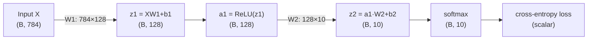
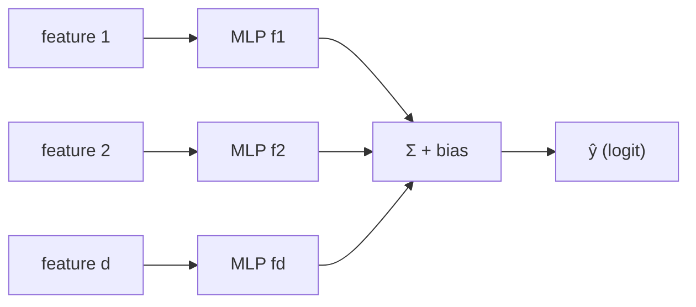

# 2.1 — Perceptron & Multi-Layer Perceptron (MLP)

## 1. Overview

**What is it?** The perceptron is the simplest possible artificial neuron: it computes a weighted sum of its inputs, adds a bias, and passes the result through a non-linear function. A **Multi-Layer Perceptron (MLP)** — also called a feed-forward neural network or fully-connected network — stacks many of these neurons into layers, and stacks layers on top of each other, so that the output of one layer becomes the input of the next.

**Why does it exist?** Linear models such as [Linear Regression](../phase-1-classical-ml/02-linear-regression.md) and [Logistic Regression](../phase-1-classical-ml/04-logistic-regression.md) can only draw straight decision boundaries (hyperplanes). Many real problems — recognizing digits, ranking videos, detecting fraud — require curved, complicated boundaries. The perceptron introduced the idea of a *learnable neuron*; the MLP composed neurons into a machine that can, in principle, approximate *any* continuous function.

**What problem does it solve?** The MLP learns non-linear mappings from fixed-size input vectors to outputs, for both classification and regression, purely from examples. It is the atomic building block from which almost every modern architecture is assembled.

**Where is it used?** Everywhere. The classification "head" at the end of a CNN or a transformer is an MLP. Every transformer block contains an MLP (the feed-forward sub-layer). Recommender systems, tabular deep learning, and two-tower retrieval models are built almost entirely of MLPs.

## 2. Learning Objectives

After this chapter you will be able to:

- Define a perceptron mathematically and explain each symbol in $z = \mathbf{w}^\top\mathbf{x} + b$, $a = \phi(z)$.
- Explain, with a picture, why a single perceptron cannot solve XOR.
- Write down the forward pass of an $L$-layer MLP in matrix form, with correct tensor shapes.
- State the Universal Approximation Theorem and, just as importantly, explain what it does *not* guarantee.
- Count the exact number of parameters of any MLP given its layer sizes.
- Explain why non-linear activations are necessary (and prove that without them, depth collapses).
- Choose sensible weight initializations (Xavier/Glorot vs He/Kaiming) and explain the variance argument behind them.
- Implement an MLP from scratch in NumPy, including mini-batch training.
- Implement the same MLP in PyTorch using `nn.Sequential` / `nn.Module`.
- Reason about the compute and memory cost of a forward pass.
- Recognize when an MLP is the right tool and when a CNN/RNN/Transformer's inductive bias is needed.

## 3. Prerequisites

| Chapter | Why you need it |
|---------|-----------------|
| [Linear Algebra](../phase-0-prerequisites/02-linear-algebra.md) | Matrix–vector products are the entire forward pass. |
| [Calculus](../phase-0-prerequisites/03-calculus.md) | Derivatives and the chain rule prepare you for training (next chapter). |
| [Probability & Statistics](../phase-0-prerequisites/04-probability-statistics.md) | Softmax outputs are probability distributions; initialization arguments use variance. |
| [Gradient Descent](../phase-1-classical-ml/03-gradient-descent.md) | MLPs are trained with (stochastic) gradient descent. |
| [Logistic Regression](../phase-1-classical-ml/04-logistic-regression.md) | A logistic regression *is* a single sigmoid neuron — the MLP generalizes it. |

Training the MLP (computing gradients) is covered in the next chapter, [Backpropagation](02-backpropagation.md); the non-linearities are studied in depth in [Activation Functions](03-activations.md).

## 4. Intuition

Think of a single neuron as a **tiny voting committee member**. It looks at all the input features, weighs each one by how much it cares about it (the weights $\mathbf{w}$), adds a personal predisposition (the bias $b$), and then decides how strongly to "fire" (the activation $\phi$). One committee member can only make simple, one-directional judgments — "the more of feature 1 and the less of feature 3, the more I fire."

Now imagine a whole **panel of committee members** (a layer), each specialized in detecting a different pattern. Their combined opinions form a new, richer description of the input. Feed that description to a *second* panel, and it can detect *patterns of patterns*. Stack a few panels and you get judgments of remarkable sophistication — that stacking is exactly what an MLP is.

An everyday story: suppose you're judging whether a house is a good buy. One friend only looks at price per square meter. Another only looks at commute time. Another at school quality. Individually, each friend's rule is a simple threshold — a straight-line judgment. But if you then ask a *second* set of friends to combine the first friends' verdicts ("if the price-friend is happy AND the commute-friend is happy, OR the school-friend is ecstatic…"), the combined rule can carve out arbitrarily complicated regions of "good houses." A single friend is a perceptron; the whole gossip chain is an MLP.

The crucial ingredient is the **non-linearity** $\phi$. If every friend just reported a weighted sum without any thresholding or squashing, the entire chain of friends would collapse into one big weighted sum — one friend would suffice, and you'd be back to a linear model.

## 5. Real-world Motivation

- **Google/YouTube** ranking and recommendation systems famously use deep feed-forward towers on top of embedded features (the "Deep" part of Wide & Deep learning, published by Google in 2016; YouTube's 2016 recommendations paper describes an MLP-based candidate-ranking network).
- **Meta** uses MLPs over embeddings in its DLRM (Deep Learning Recommendation Model) for ads ranking — an open-sourced architecture that is mostly embeddings plus MLPs.
- **OpenAI's GPT models** contain an MLP inside every transformer block; roughly two-thirds of a GPT-style model's parameters live in these feed-forward layers.
- **Netflix** and **Amazon** use neural rankers where dense feature vectors flow through fully-connected layers.
- **Tesla's** perception stack ends in fully-connected heads that convert learned image features into class scores and regression targets.

The point: even though the MLP is the "oldest" deep architecture (perceptron: Rosenblatt, 1958), it never left production — it just moved to the top (heads) and inside (feed-forward sub-layers) of larger models.

## 6. Mathematical Foundations

### 6.1 A single neuron (perceptron)

$$
z = \mathbf{w}^\top \mathbf{x} + b, \qquad a = \phi(z)
$$

- $\mathbf{x} \in \mathbb{R}^{d}$ — input vector with $d$ features.
- $\mathbf{w} \in \mathbb{R}^{d}$ — learnable weight vector (one weight per feature).
- $b \in \mathbb{R}$ — learnable bias (shifts the decision threshold).
- $z \in \mathbb{R}$ — the **pre-activation** (or logit).
- $\phi$ — a non-linear **activation function** (sigmoid, tanh, ReLU, …; see [Activation Functions](03-activations.md)).
- $a \in \mathbb{R}$ — the neuron's output, its **activation**.

Rosenblatt's original 1958 perceptron used a hard step function $\phi(z) = \mathbb{1}[z \ge 0]$ and a simple mistake-driven update rule. The **perceptron convergence theorem** guarantees that if the data are linearly separable, this rule finds a separating hyperplane in finitely many updates. If the data are *not* separable (like XOR), it never converges — which is precisely why we need more layers.

### 6.2 A layer

Stack $d_l$ neurons that all read the same input. Their weight vectors become the rows of a matrix:

$$
\mathbf{a}^{(l)} = \phi\!\big(W^{(l)} \mathbf{a}^{(l-1)} + \mathbf{b}^{(l)}\big)
$$

- $\mathbf{a}^{(l-1)} \in \mathbb{R}^{d_{l-1}}$ — activations of the previous layer (with $\mathbf{a}^{(0)} = \mathbf{x}$).
- $W^{(l)} \in \mathbb{R}^{d_l \times d_{l-1}}$ — weight matrix; row $i$ holds the weights of neuron $i$.
- $\mathbf{b}^{(l)} \in \mathbb{R}^{d_l}$ — bias vector.
- $\phi$ applied element-wise.

In practice we process a **mini-batch** of $B$ examples at once by stacking inputs as rows of $X \in \mathbb{R}^{B \times d_0}$ and writing $A^{(l)} = \phi(A^{(l-1)} W^{(l)\top} + \mathbf{b}^{(l)})$ (frameworks store $W$ so that the code reads `A @ W + b` with $W \in \mathbb{R}^{d_{l-1}\times d_l}$).

### 6.3 Why non-linearity is essential (one-line proof)

Suppose $\phi$ is the identity. Then

$$
\mathbf{a}^{(2)} = W^{(2)}\big(W^{(1)}\mathbf{x} + \mathbf{b}^{(1)}\big) + \mathbf{b}^{(2)} = \underbrace{W^{(2)}W^{(1)}}_{\tilde W}\mathbf{x} + \underbrace{W^{(2)}\mathbf{b}^{(1)} + \mathbf{b}^{(2)}}_{\tilde{\mathbf{b}}}
$$

— a single linear layer $\tilde W \mathbf{x} + \tilde{\mathbf{b}}$. Depth without non-linearity buys nothing.

### 6.4 Universal Approximation Theorem (UAT)

**Statement (Cybenko 1989, Hornik 1991).** Let $f : [0,1]^d \to \mathbb{R}$ be continuous and let $\epsilon > 0$. Then there exists a one-hidden-layer MLP $\hat f(\mathbf{x}) = \sum_{i=1}^{N} v_i\, \phi(\mathbf{w}_i^\top \mathbf{x} + b_i)$, with $\phi$ any non-constant, bounded, continuous activation (later extended to ReLU), such that

$$
\sup_{\mathbf{x} \in [0,1]^d} \big| f(\mathbf{x}) - \hat f(\mathbf{x}) \big| < \epsilon .
$$

Here $N$ is the number of hidden units, $v_i$ the output weights, and $\mathbf{w}_i, b_i$ the hidden-unit parameters.

> [!WARNING]
> The UAT says a wide-enough network *exists*. It says nothing about (1) how large $N$ must be (it can be exponential in $d$), (2) whether gradient descent will *find* those weights, or (3) whether the network will *generalize* from finite data. Depth matters in practice because deep networks can represent certain functions with exponentially fewer units than shallow ones (depth–width trade-off).

### 6.5 Output heads

- **Regression**: identity output, trained with MSE/MAE (see [Loss Functions](04-loss-functions.md)).
- **Binary classification**: a single sigmoid unit $\hat p = \sigma(z)$, trained with binary cross-entropy.
- **Multi-class classification** over $K$ classes: softmax over $K$ logits,

$$
\hat p_k = \frac{e^{z_k}}{\sum_{j=1}^{K} e^{z_j}},
$$

trained with cross-entropy.

### 6.6 Parameter counting

Layer $l$ has $d_l \times d_{l-1}$ weights plus $d_l$ biases:

$$
\#\text{params} = \sum_{l=1}^{L} d_l (d_{l-1} + 1).
$$

Example — sizes $[784, 128, 10]$: $128 \times 785 + 10 \times 129 = 100{,}480 + 1{,}290 = 101{,}770$ parameters.

### 6.7 Initialization: the variance argument

If weights are too large, activations/gradients explode with depth; too small, they vanish. Requiring $\mathrm{Var}(z_i) \approx \mathrm{Var}(x_j)$ layer-to-layer gives:

- **Xavier/Glorot** (for tanh/sigmoid): $\mathrm{Var}(w) = \frac{2}{d_{in} + d_{out}}$.
- **He/Kaiming** (for ReLU, which zeroes half its inputs, halving the variance): $\mathrm{Var}(w) = \frac{2}{d_{in}}$.

Biases are initialized to zero: there is no symmetry to break in biases, and zero is a neutral starting threshold. Weights **must not** be all zero — every neuron in a layer would then compute the same function and receive the same gradient forever ("symmetry problem").

## 7. Visual Explanation

Network view (an MLP with a 2-unit hidden layer):

```
   x1 ─┐   ┌── h1 ─┐
   x2 ─┼──►│       ├──► ŷ
   x3 ─┘   └── h2 ─┘
        W(1),b(1)   W(2),b(2)
```

Data-flow view with shapes for a batch of $B$ MNIST images:



And the XOR picture — no single straight line separates the classes, but one hidden layer creates a bent boundary:

```
  x2
   1 │  ●(0,1)=1    ○(1,1)=0        ● = class 1, ○ = class 0
     │                              No single line separates ● from ○.
   0 │  ○(0,0)=0    ●(1,0)=1        Two hidden units ≈ two lines,
     └──────────────── x1           combined by the output neuron.
        0          1
```

## 8. Algorithm

**Forward pass of an $L$-layer MLP:**

1. Set $\mathbf{a}^{(0)} = \mathbf{x}$ (or $A^{(0)} = X$ for a batch).
2. For each layer $l = 1, \dots, L$:
   a. Compute pre-activation $\mathbf{z}^{(l)} = W^{(l)}\mathbf{a}^{(l-1)} + \mathbf{b}^{(l)}$.
   b. Compute activation $\mathbf{a}^{(l)} = \phi_l(\mathbf{z}^{(l)})$ (hidden layers: ReLU/GELU; output layer: identity/sigmoid/softmax).
3. Return $\mathbf{a}^{(L)}$ as the prediction; if training, feed it to the loss.

```text
PSEUDOCODE: forward(X)
  A ← X                          # (B, d0)
  for l in 1..L:
      Z[l] ← A @ W[l] + b[l]     # (B, d_l)  affine transform
      A    ← phi_l(Z[l])         # (B, d_l)  elementwise non-linearity
  return A                       # predictions
```

Training = forward pass → loss → [backpropagation](02-backpropagation.md) → parameter update via [an optimizer](05-optimizers.md). This chapter focuses on the forward machinery; the training code below uses the softmax-cross-entropy gradient as a black box that Chapter 2.2 derives.

## 9. Worked Example

### 9.1 Tiny example by hand: solving XOR

Take a 2–2–1 network, hidden activation = ReLU, output = identity (threshold at 0.5). Use these weights:

$$
W^{(1)} = \begin{pmatrix} 1 & 1 \\ 1 & 1 \end{pmatrix},\quad
\mathbf{b}^{(1)} = \begin{pmatrix} 0 \\ -1 \end{pmatrix},\quad
W^{(2)} = \begin{pmatrix} 1 & -2 \end{pmatrix},\quad b^{(2)} = 0 .
$$

Hidden unit 1 computes $\mathrm{ReLU}(x_1 + x_2)$; hidden unit 2 computes $\mathrm{ReLU}(x_1 + x_2 - 1)$. Then output $= h_1 - 2h_2$:

| $x_1$ | $x_2$ | $h_1 = \mathrm{ReLU}(x_1{+}x_2)$ | $h_2 = \mathrm{ReLU}(x_1{+}x_2{-}1)$ | $\hat y = h_1 - 2h_2$ | XOR |
|------|------|------|------|------|-----|
| 0 | 0 | 0 | 0 | 0 | 0 |
| 0 | 1 | 1 | 0 | 1 | 1 |
| 1 | 0 | 1 | 0 | 1 | 1 |
| 1 | 1 | 2 | 1 | 0 | 0 |

A perfect solution with 9 parameters — something no single perceptron can do, because XOR's positive examples cannot be separated from the negatives by any single hyperplane (Minsky & Papert, 1969).

### 9.2 Realistic example: MNIST digit classification

Scale to a $[784, 128, 10]$ network on MNIST (70,000 grayscale $28{\times}28$ images). Flatten each image to 784 values in $[0,1]$, run the forward pass, apply softmax, and train with cross-entropy. This 101,770-parameter model reaches roughly **97–98% test accuracy** after ~20 epochs — the code in Sections 10–11 does exactly this.

## 10. Python from Scratch

A complete NumPy MLP with He initialization, mini-batch SGD, and an arbitrary list of layer sizes. (The `backward` method uses the softmax+CE gradient $\hat{\mathbf p} - \mathbf y$, derived in [Backpropagation](02-backpropagation.md).)

```python
import numpy as np

def relu(z):                       # elementwise max(0, z)
    return np.maximum(0, z)

def relu_deriv(z):                 # subgradient: 1 where z>0, else 0
    return (z > 0).astype(float)

def softmax(z):
    z = z - z.max(axis=1, keepdims=True)   # subtract row max: prevents exp overflow
    e = np.exp(z)
    return e / e.sum(axis=1, keepdims=True)  # rows sum to 1 → probabilities

class MLP:
    def __init__(self, sizes, lr=0.1, seed=0):
        # sizes = [d0, d1, ..., dL], e.g. [784, 128, 10]
        rng = np.random.default_rng(seed)
        # He init: std = sqrt(2 / fan_in), correct scale for ReLU layers
        self.W = [rng.normal(scale=np.sqrt(2 / a), size=(a, b))
                  for a, b in zip(sizes[:-1], sizes[1:])]
        self.b = [np.zeros(b) for b in sizes[1:]]   # biases start at zero
        self.lr = lr

    def forward(self, X):
        # X: (B, d0). Cache all z and a for the backward pass.
        self.a = [X]; self.z = []
        for i, (W, b) in enumerate(zip(self.W, self.b)):
            z = self.a[-1] @ W + b                  # (B, d_i) @ (d_i, d_{i+1}) -> (B, d_{i+1})
            a = softmax(z) if i == len(self.W) - 1 else relu(z)
            self.z.append(z); self.a.append(a)
        return self.a[-1]                           # (B, K) class probabilities

    def backward(self, Y):
        # Y: one-hot targets, (B, K). Uses softmax+CE shortcut: dL/dz_L = (p - y)/B
        m = Y.shape[0]
        dz = (self.a[-1] - Y) / m
        for i in reversed(range(len(self.W))):
            dW = self.a[i].T @ dz                   # (d_i, B) @ (B, d_{i+1})
            db = dz.sum(axis=0)
            if i > 0:                               # propagate error to previous layer
                dz = dz @ self.W[i].T * relu_deriv(self.z[i - 1])
            self.W[i] -= self.lr * dW               # SGD update
            self.b[i] -= self.lr * db

    def fit(self, X, Y, epochs=20, batch=64):
        for _ in range(epochs):
            idx = np.random.permutation(len(X))     # reshuffle every epoch
            for s in range(0, len(X), batch):
                b_idx = idx[s:s + batch]
                self.forward(X[b_idx])
                self.backward(Y[b_idx])

# Usage sketch (X_train scaled to [0,1], Y_train one-hot):
# net = MLP([784, 128, 10]); net.fit(X_train, Y_train)
# acc = (net.forward(X_test).argmax(1) == y_test).mean()   # expect ≈ 0.97
```

**Expected output**: test accuracy around 0.97 on MNIST after 20 epochs.

> [!WARNING]
> **Common bug**: forgetting the max-subtraction in `softmax`. With logits around 700, `np.exp` overflows to `inf`, probabilities become `nan`, and the loss silently becomes `nan` a few steps into training.

## 11. Library Implementation

The same model in PyTorch, with a full training loop:

```python
import torch
import torch.nn as nn

class MLP(nn.Module):
    def __init__(self, in_dim=784, hidden=128, out_dim=10):
        super().__init__()
        self.net = nn.Sequential(
            nn.Linear(in_dim, hidden),   # W1 (784→128) + b1; Kaiming-uniform init by default
            nn.ReLU(),                   # non-linearity between layers
            nn.Linear(hidden, out_dim),  # W2 (128→10) + b2 — outputs raw LOGITS
        )

    def forward(self, x):                # x: (B, 784)
        return self.net(x)               # (B, 10) logits — no softmax here!

model = MLP()
opt = torch.optim.SGD(model.parameters(), lr=0.1)
loss_fn = nn.CrossEntropyLoss()          # applies log-softmax internally

for epoch in range(20):
    for xb, yb in train_loader:          # xb: (B, 784), yb: (B,) integer labels
        opt.zero_grad()                  # clear old gradients (they accumulate otherwise)
        loss = loss_fn(model(xb), yb)    # forward + loss
        loss.backward()                  # autograd computes all gradients
        opt.step()                       # SGD parameter update
```

- `nn.Linear(a, b)` stores $W \in \mathbb{R}^{b \times a}$ and $b \in \mathbb{R}^{b}$, computing `x @ W.T + b`.
- `nn.CrossEntropyLoss` expects **raw logits**, not softmaxed probabilities — it fuses `log_softmax` + NLL for numerical stability.
- `opt.zero_grad()` is mandatory each step; PyTorch *accumulates* gradients by design.

## 12. Code Walkthrough

Tracing one batch of 64 MNIST images through the network:

| Tensor | Shape | Meaning |
|--------|-------|---------|
| `X` | (64, 784) | 64 flattened images, pixel values in [0, 1] |
| `W1` | (784, 128) | first-layer weights (100,352 params) |
| `b1` | (128,) | first-layer biases |
| `z1 = X @ W1 + b1` | (64, 128) | pre-activations; `b1` broadcast over rows |
| `a1 = relu(z1)` | (64, 128) | hidden features; ≈50% of entries are exactly 0 at init |
| `W2` | (128, 10) | output weights (1,280 params) |
| `z2 = a1 @ W2 + b2` | (64, 10) | logits, one score per class |
| `p = softmax(z2)` | (64, 10) | each row a probability distribution (sums to 1) |
| loss | () scalar | mean cross-entropy over the batch |

**Expected behavior**: at initialization, logits are near zero, so probabilities are ≈0.1 each and loss ≈ $-\ln(0.1) \approx 2.30$. If your initial loss is far from 2.30 on a 10-class problem, your init or loss wiring is wrong — a cheap and powerful sanity check.

## 13. Complexity Analysis

**Time (forward pass).** Layer $l$ performs a $(B \times d_{l-1}) \cdot (d_{l-1} \times d_l)$ matrix multiply: $O(B\, d_{l-1} d_l)$ multiply-adds. Total: $O\!\big(B \sum_l d_{l-1} d_l\big)$ — for the MNIST net, $64 \times (784{\cdot}128 + 128{\cdot}10) \approx 6.5$M multiply-adds per batch. Backward costs roughly 2× forward (see [Backpropagation](02-backpropagation.md)).

**Space.** Parameters: $O(\sum_l d_l(d_{l-1}+1))$. Activations kept for backprop: $O(B \sum_l d_l)$ — this term, not the parameters, dominates GPU memory for large batches, which is why memory scales linearly with batch size.

## 14. Advantages

- **Universal approximation**: with enough units, an MLP can fit any continuous function — e.g., an MLP fits arbitrary feature-interaction effects in ads click-through models that a linear model provably cannot.
- **Simplicity**: ~50 lines of NumPy give a working image classifier; the PyTorch version is 10 lines.
- **Speed on hardware**: the forward pass is dense matrix multiplication, the single operation GPUs/TPUs are best at.
- **Composability**: MLPs slot in anywhere — the feed-forward block in every transformer, the projection heads in contrastive learning (SimCLR), the towers in two-tower retrieval.
- **Strong tabular baseline**: an MLP with entity embeddings for categorical features is competitive on many tabular tasks and is the standard deep baseline.

## 15. Disadvantages

- **No spatial/sequential inductive bias**: an MLP on raw pixels must relearn that nearby pixels are related, at every position; a CNN ([Chapter 2.7](07-cnn.md)) gets this for free via weight sharing. On CIFAR-10, an MLP plateaus around ~55–60% while a small CNN exceeds 85%.
- **Parameter explosion on high-dimensional inputs**: a single hidden layer of 1,000 units on a $224{\times}224{\times}3$ image needs ~150M weights in the first layer alone.
- **Overfitting**: with more parameters than data points, MLPs memorize noise unless regularized ([Regularization for Deep Learning](06-regularization-dl.md)).
- **Sensitive to initialization and learning rate**: bad init → vanishing/exploding signals; too-high LR with ReLU → dead units and NaNs.
- **Often loses to gradient-boosted trees on small/medium tabular data** — on datasets with a few thousand rows, XGBoost/LightGBM typically win with far less tuning.

## 16. Common Mistakes

- **Forgetting the non-linearity** between `nn.Linear` layers → the network silently collapses to a linear model (Section 6.3). *Fix*: always interleave activations; verify by checking the model can overfit a tiny non-linear dataset like XOR.
- **Not standardizing inputs**: features with scale 1e4 next to features with scale 1e-2 create a badly conditioned loss surface. *Fix*: standardize to zero mean/unit variance (or [0,1] for pixels).
- **Applying softmax before `nn.CrossEntropyLoss`**: double softmax squashes logits and wrecks training. *Fix*: pass raw logits; the loss handles log-softmax internally.
- **Initializing all weights to zero (or the same constant)**: all neurons in a layer stay identical forever. *Fix*: random init (He/Xavier).
- **Forgetting `model.train()` / `model.eval()`** when using dropout or batch norm → inconsistent behavior between training and evaluation.
- **Wrong shape order**: writing `W @ x` where the code expects `x @ W` — always assert shapes in early development.

## 17. Best Practices

- [ ] Standardize/normalize inputs; for images, scale to [0, 1] or normalize per channel.
- [ ] Use He init with ReLU-family activations, Xavier with tanh/sigmoid.
- [ ] Verify the initial loss ≈ $\ln K$ for $K$-class classification before training.
- [ ] Overfit a single batch first — if the model cannot reach ~0 loss on 64 examples, there is a bug.
- [ ] Start with 1–3 hidden layers and widths in the 64–1024 range; go deeper only with normalization and skip connections ([ResNets](07-cnn.md)).
- [ ] Use `nn.CrossEntropyLoss` / `nn.BCEWithLogitsLoss` on logits — never hand-rolled `log(softmax(...))`.
- [ ] Add weight decay and/or dropout when validation loss diverges from training loss.
- [ ] Log train *and* validation curves from step one.

## 18. Optimization Techniques

- **Batching / vectorization**: never loop over examples in Python; one $(B, d)$ matmul is orders of magnitude faster than $B$ vector ops.
- **Mixed precision** (`torch.autocast`): fp16/bf16 matmuls roughly double throughput on modern GPUs with negligible accuracy change for MLPs.
- **Normalization layers**: BatchNorm/LayerNorm between layers stabilize deep MLPs and allow higher learning rates.
- **Better optimizers and schedules**: Adam/AdamW plus cosine or step LR decay — see [Optimizers](05-optimizers.md).
- **Fused kernels**: `torch.compile` fuses Linear+ReLU chains, cutting memory traffic.
- **Quantization / pruning** for deployment: int8 quantization typically shrinks an MLP 4× with <1% accuracy loss; magnitude pruning can remove 80–90% of weights of over-parameterized MLPs.

## 19. Industry Applications

- **Ads & recommendations**: Google's Wide & Deep (Play Store recommendations), Meta's DLRM (ads ranking), YouTube's two-tower retrieval + MLP ranker — all fundamentally embedding + MLP systems serving billions of requests daily.
- **Transformers/LLMs**: every transformer block in GPT, LLaMA, or BERT contains a position-wise MLP; in a typical decoder these feed-forward layers hold ~2/3 of all parameters.
- **Vision heads**: classification/regression heads on ResNets, ViTs, and detection models (e.g., box-regression heads) are small MLPs.
- **Tabular ML in production**: fraud scoring, credit risk, churn prediction at banks and fintechs frequently deploy MLPs over engineered features, often alongside gradient boosting.
- **MLP-only vision research**: Google's MLP-Mixer showed that a carefully arranged pure-MLP model can be competitive on ImageNet.

## 20. Interview Questions

### Beginner

**Q: Why can't a single perceptron learn XOR?**
A: A perceptron's decision boundary is a single hyperplane ($\mathbf{w}^\top\mathbf{x}+b = 0$). XOR's positive points (0,1),(1,0) and negative points (0,0),(1,1) are not linearly separable — no line puts the positives on one side and negatives on the other. A hidden layer creates intermediate features that make the problem separable.

**Q: Why do we need non-linear activation functions?**
A: Composing linear maps yields a linear map: $W^{(2)}(W^{(1)}\mathbf{x}+\mathbf{b}^{(1)})+\mathbf{b}^{(2)}$ is again affine. Without non-linearities, any depth collapses to a single linear layer and can only represent linear functions.

**Q: How many parameters does an MLP with sizes [784, 128, 10] have?**
A: $128\times784 + 128 + 10\times128 + 10 = 100{,}352 + 128 + 1{,}280 + 10 = 101{,}770$. General formula: $\sum_l d_l(d_{l-1}+1)$.

**Q: What is the difference between the pre-activation $z$ and the activation $a$?**
A: $z = W\mathbf{a}_{prev} + \mathbf{b}$ is the affine output ("logit"); $a = \phi(z)$ applies the non-linearity. Backprop needs both cached: $\phi'$ is evaluated at $z$, and $a$ multiplies into weight gradients.

**Q: Why is the bias initialized to zero but the weights randomly?**
A: Identical weights would make all neurons in a layer compute identical outputs and receive identical gradients — they'd never differentiate (symmetry problem). Biases don't cause symmetry (weights already differ), so zero is a safe neutral start.

### Intermediate

**Q: State the Universal Approximation Theorem and one thing it does NOT guarantee.**
A: For any continuous $f$ on a compact set and any $\epsilon>0$, a one-hidden-layer MLP with enough units approximates $f$ within $\epsilon$ uniformly. It does not guarantee that the required width is practical (may be exponential), that SGD finds those weights, or that the network generalizes from finite data.

**Q: Why He initialization for ReLU but Xavier for tanh?**
A: Both aim to preserve activation variance across layers. ReLU zeroes half its input distribution, halving output variance, so its weights need variance $2/d_{in}$ to compensate. Tanh is roughly identity near 0, so the symmetric $2/(d_{in}+d_{out})$ suffices.

**Q: Your 10-class classifier's initial loss is 6.9 instead of ~2.3. What's wrong?**
A: $-\ln(1/10) \approx 2.30$ is the expected loss for uniform predictions. 6.9 ≈ $-\ln(1/1000)$ suggests logits are far from uniform — usually oversized init weights, unnormalized inputs, or applying softmax twice.

**Q: Depth vs width — why prefer deep networks?**
A: Certain functions (e.g., highly compositional or oscillatory ones) require exponentially many units in a shallow net but only polynomially many in a deep one; depth builds features hierarchically (edges → parts → objects). But deeper nets are harder to optimize, motivating normalization and residual connections.

**Q: Where do MLPs appear inside a transformer?**
A: Every block has a position-wise feed-forward network — typically Linear($d\to 4d$) → GELU → Linear($4d\to d$) — applied independently at each token position; these layers contain the majority of the model's parameters.

### Advanced

**Q: Prove that an MLP with linear activations has the same expressive power regardless of depth.**
A: By induction: $\mathbf{a}^{(l)} = W^{(l)}\mathbf{a}^{(l-1)}+\mathbf{b}^{(l)}$; substituting the affine form of $\mathbf{a}^{(l-1)}$ yields another affine function of $\mathbf{x}$ with effective weight $\prod_l W^{(l)}$ (in order) and a composed bias. Hence any depth-$L$ linear MLP equals some 1-layer affine map. (Note: optimization *dynamics* of deep linear nets still differ — a subtle research point.)

**Q: An MLP on 224×224×3 images with hidden width 4096 — what's the first-layer parameter count and why is this problematic?**
A: $150{,}528 \times 4096 \approx 616$M weights in one layer — more than an entire ResNet-50 (25M). No weight sharing means each pixel position learns independently, wasting capacity and data; CNNs solve this with convolutions.

**Q: How does the number of linear regions of a ReLU MLP grow with depth?**
A: A ReLU network computes a piecewise-linear function. Results by Montúfar et al. (2014) show the maximal number of linear regions grows polynomially in width but *exponentially* in depth — a formal expressivity argument for deep over shallow.

**Q: When would you still choose gradient boosting over an MLP for tabular data?**
A: Small-to-medium datasets (< ~100k rows), heterogeneous features with meaningful raw scales, need for fast CPU training and strong out-of-the-box performance. MLPs shine with very large data, multimodal inputs, embeddings for high-cardinality categoricals, or when the tabular model must be co-trained with other neural components.

**Q: Why does an MLP's memory during training scale with batch size, when parameters don't?**
A: Backprop must cache every layer's activations $A^{(l)} \in \mathbb{R}^{B\times d_l}$ from the forward pass to compute weight gradients $A^{(l-1)\top}\delta^{(l)}$. Activation memory is $O(B\sum_l d_l)$, linear in $B$, while parameter memory is constant.

## 21. Coding Exercises

### Easy

1. **Parameter counter.** Write `count_params(sizes)` returning the exact parameter count of an MLP; verify against PyTorch's `sum(p.numel() for p in model.parameters())`. *Hint*: $\sum_l d_l(d_{l-1}+1)$.
2. **Linear collapse demo.** Build a 5-layer MLP with identity activations and show numerically that it computes the same function as a single `nn.Linear`. *Hint*: multiply out the weight matrices.

### Medium

1. **Arbitrary-depth NumPy MLP.** Extend the Section-10 class to any list of sizes and any activation per layer; train on MNIST to > 97% test accuracy. *Hint*: keep `z`/`a` caches as lists; watch the He-init `fan_in` per layer.
2. **Gradient check.** Verify your `backward` against numerical gradients $\frac{f(\theta+\varepsilon)-f(\theta-\varepsilon)}{2\varepsilon}$ on a tiny network. *Hint*: use $\varepsilon = 10^{-5}$ and float64; relative error should be < 1e-6.
3. **Activation comparison.** Train identical MLPs on Fashion-MNIST with tanh, ReLU, GELU; plot loss curves. *Hint*: fix the seed and change only the activation.

### Hard

1. **Entity embeddings.** Implement an MLP for a mixed categorical/numerical tabular dataset where each categorical feature gets a learned embedding; compare against one-hot encoding. *Hint*: `nn.Embedding` per column, concatenate with numeric features.
2. **Linear-region counter.** For a small 2-input ReLU MLP, count the linear regions empirically by sampling activation patterns on a dense grid, and observe the growth as you add depth. *Hint*: each region corresponds to a distinct binary on/off pattern of all hidden units.

## 22. Mini Project

**Titanic survival with an MLP + entity embeddings.**

1. Load the Titanic dataset (Kaggle/seaborn); split 80/20 train/validation.
2. Standardize numerical features (age, fare); map categoricals (sex, embarked, pclass) to integer codes.
3. Build a PyTorch model: one `nn.Embedding` (dim 4–8) per categorical column, concatenated with numeric features, followed by Linear(→64) → ReLU → Linear(→32) → ReLU → Linear(→1).
4. Train with `BCEWithLogitsLoss` and Adam (lr = 1e-3) for ~50 epochs; log train/val loss.
5. Compare validation accuracy against logistic regression; aim for ≥ 80%.
6. Ablate: remove the embeddings (one-hot instead) and report the difference.

## 23. Medium Project

**Click-through-rate model on the Criteo dataset.**

1. Download a Criteo sample (e.g., the Kaggle Display Advertising Challenge subset); it has 13 numeric + 26 high-cardinality categorical features.
2. Hash categorical values into a fixed vocabulary (e.g., $10^5$ buckets per feature) and log-transform the numeric features.
3. Implement a Deep & Cross Network style model: an embedding layer per categorical feature, a deep MLP tower (e.g., 1024→512→256), and a cross layer that models explicit feature interactions.
4. Train with `BCEWithLogitsLoss`; evaluate with AUC and log-loss on a held-out day.
5. Benchmark against LightGBM on the same features; report AUC, training time, and model size.
6. Experiment with embedding dimension (8/16/32) and dropout; document the trade-offs.

## 24. Advanced Project

**Neural Additive Model (NAM) — interpretable deep learning for tabular data.**

Architecture: instead of one big MLP over all features, train one small MLP $f_j$ *per feature* and sum the outputs:

$$
\hat y = \beta_0 + \sum_{j=1}^{d} f_j(x_j)
$$

so each feature's learned contribution can be plotted as a 1-D curve — GAM-style interpretability with neural flexibility.



Implementation phases:

1. **Core model**: a `FeatureNet` module (e.g., 1→64→64→1 with ExU or ReLU units) and a `NAM` module that applies one per feature and sums.
2. **Training**: binary tasks (e.g., adult-income, credit datasets from OpenML) with BCE, feature dropout, and output-penalty regularization as in the NAM paper (Agarwal et al., 2021).
3. **Evaluation**: compare AUC against logistic regression, XGBoost, and a standard MLP on 3–5 OpenML datasets.
4. **Interpretability**: plot each $f_j$ over its feature's range; sanity-check the shapes against domain knowledge.
5. **Improvements**: add pairwise interaction nets $f_{jk}(x_j, x_k)$ (NA²M), ensemble multiple seeds for smoother curves, and quantify curve stability across runs.

## 25. Summary

- A perceptron computes $\phi(\mathbf{w}^\top\mathbf{x}+b)$; it can only represent linear decision boundaries.
- An MLP stacks layers of neurons: alternating affine transforms and elementwise non-linearities.
- Without non-linearities, any depth collapses into a single affine map — activations are what create expressive power.
- The Universal Approximation Theorem guarantees existence of a good shallow network, not learnability, efficiency, or generalization.
- Depth beats width for compositional functions: deep ReLU nets carve exponentially more linear regions per parameter.
- Parameter count: $\sum_l d_l(d_{l-1}+1)$; activation memory during training scales with batch size.
- Initialize with He (ReLU) or Xavier (tanh) to preserve signal variance; never initialize weights identically.
- Match the output head to the task: identity for regression, sigmoid for binary, softmax for multi-class — and feed logits (not probabilities) to the loss.
- Initial loss for $K$ classes should be ≈ $\ln K$ — a free sanity check.
- MLPs power production systems as ranking towers, transformer feed-forward blocks, and classification heads; they lack spatial/sequential inductive bias, so prefer CNNs/Transformers for raw images/sequences.

## 26. Cheat Sheet

| Item | Formula / Value |
|------|-----------------|
| Neuron | $a = \phi(\mathbf{w}^\top\mathbf{x} + b)$ |
| Layer (batch) | $A^{(l)} = \phi(A^{(l-1)}W^{(l)} + \mathbf{b}^{(l)})$ |
| Params | $\sum_l d_l(d_{l-1}+1)$ |
| Forward FLOPs | $\approx 2B\sum_l d_{l-1}d_l$ |
| He init | $w \sim \mathcal N(0,\, 2/d_{in})$ — use with ReLU |
| Xavier init | $w \sim \mathcal N(0,\, 2/(d_{in}+d_{out}))$ — use with tanh |
| Initial CE loss | $\ln K$ (e.g., 2.30 for 10 classes) |

**Defaults that work**: 1–3 hidden layers, width 128–1024, ReLU/GELU, He init, Adam lr 1e-3 (or SGD 0.1 with schedule), batch 32–256, standardize inputs.

**One-liners**: overfit one batch first · logits into the loss, never probabilities · loss ≈ ln K at init or it's a bug · no activation between the last Linear and CrossEntropyLoss.

**Gotchas**: missing activation = linear model · zero weight init = frozen symmetric neurons · unscaled inputs = miserable conditioning · softmax before CrossEntropyLoss = double softmax.

## 27. Further Reading

**Books**
- *Deep Learning* — Goodfellow, Bengio, Courville (Ch. 6: Deep Feedforward Networks).
- *Neural Networks and Deep Learning* — Michael Nielsen (free online; superb MLP/MNIST walkthrough).
- *Dive into Deep Learning* (d2l.ai) — Ch. 4/5 on MLPs, with runnable code.

**Research Papers**
- Rosenblatt (1958), "The Perceptron: A Probabilistic Model for Information Storage and Organization in the Brain."
- Minsky & Papert (1969), *Perceptrons* (the XOR limitation).
- Cybenko (1989), "Approximation by Superpositions of a Sigmoidal Function"; Hornik (1991) extension.
- Glorot & Bengio (2010), "Understanding the Difficulty of Training Deep Feedforward Neural Networks" (Xavier init).
- He et al. (2015), "Delving Deep into Rectifiers" (He init).
- Montúfar et al. (2014), "On the Number of Linear Regions of Deep Neural Networks."
- Cheng et al. (2016), "Wide & Deep Learning for Recommender Systems"; Naumov et al. (2019), "DLRM."
- Tolstikhin et al. (2021), "MLP-Mixer: An All-MLP Architecture for Vision."
- Agarwal et al. (2021), "Neural Additive Models."

**Documentation**
- PyTorch: `nn.Linear`, `nn.Sequential`, `nn.init` docs.

**GitHub Repositories**
- `pytorch/examples` (MNIST MLP baseline) · `karpathy/nn-zero-to-hero` · `facebookresearch/dlrm`.

**Datasets**
- MNIST, Fashion-MNIST, Titanic (Kaggle), Criteo Display Advertising, OpenML tabular suites.

**YouTube/Videos**
- 3Blue1Brown, "But what is a neural network?" (Neural Networks series).
- Andrej Karpathy, "Neural Networks: Zero to Hero."
- Stanford CS231n lectures on neural networks.

**Blogs**
- Chris Olah, "Neural Networks, Manifolds, and Topology."
- distill.pub articles on neural network visualization.
