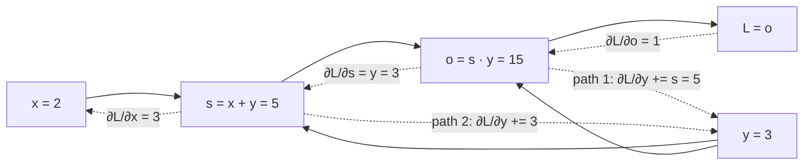
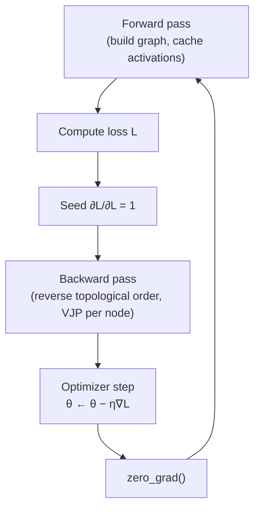
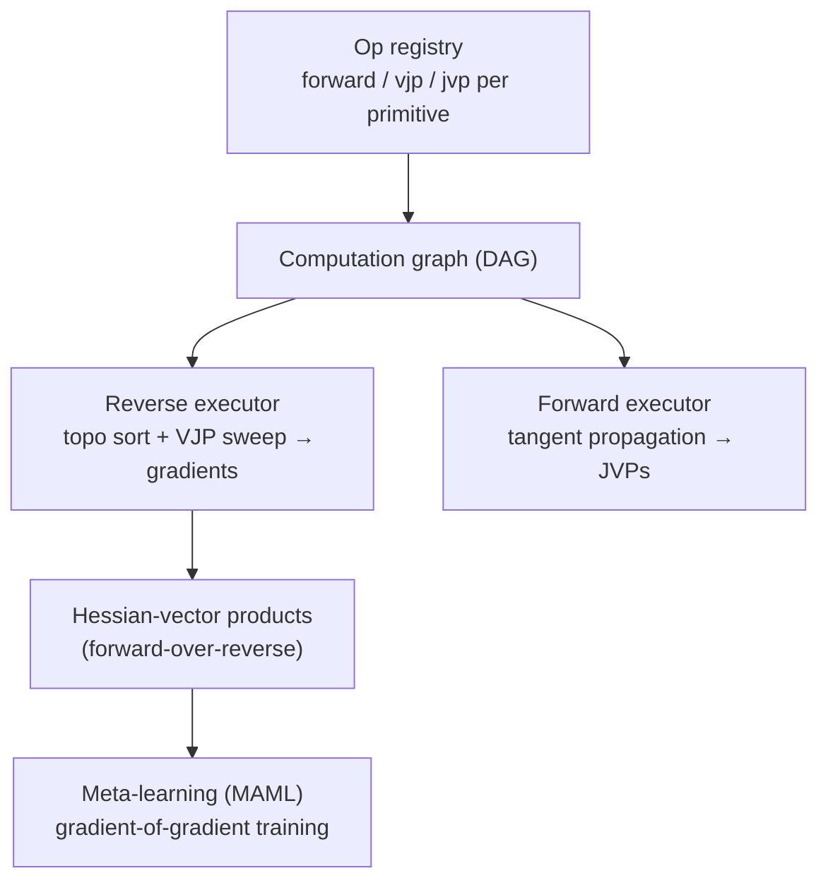

# 2.2 — Backpropagation

## 1. Overview

**What is it?** Backpropagation ("backprop") is an algorithm that computes the gradient of a scalar loss with respect to *every* parameter of a neural network, exactly, in a single backward sweep through the network's computation graph. It is the chain rule from calculus, organized so that intermediate results are computed once and reused everywhere.

**Why does it exist?** Training a network means adjusting parameters to reduce a loss, and [gradient descent](../phase-1-classical-ml/03-gradient-descent.md) needs the gradient. A modern model has millions to billions of parameters. Estimating each partial derivative numerically would require one extra forward pass *per parameter* — utterly infeasible. Backprop delivers all of them for roughly the cost of two forward passes.

**What problem does it solve?** Efficient, exact gradient computation for any model built from differentiable operations — MLPs, CNNs, transformers, diffusion models, anything expressible as a computation graph.

**Where is it used?** Every gradient step of every neural network ever trained: your MNIST toy model, AlphaFold, Stable Diffusion, and GPT-4 alike. PyTorch, TensorFlow, and JAX are, at their core, industrial-strength backprop engines (reverse-mode automatic differentiation) with GPU kernels attached.

## 2. Learning Objectives

After this chapter you will be able to:

- State the chain rule in scalar, vector, and Jacobian form, defining every symbol.
- Explain what a vector–Jacobian product (VJP) is and why reverse-mode autodiff is a sequence of VJPs.
- Explain why reverse mode (not forward mode) is the right choice when the output is a scalar loss and inputs number in the millions.
- Derive, step by step, the backprop equations for a fully-connected network: the error signals $\boldsymbol\delta^{(l)}$ and the parameter gradients $\nabla_{W^{(l)}}L$, $\nabla_{\mathbf b^{(l)}}L$.
- Derive the softmax + cross-entropy shortcut $\partial L/\partial \mathbf z = \hat{\mathbf p} - \mathbf y$ from first principles.
- Hand-compute a full forward and backward pass on a small computation graph, including gradient accumulation across multiple paths.
- Build a micrograd-style reverse-mode autodiff engine in pure Python and use it to train a network.
- Use PyTorch autograd correctly: `requires_grad`, `backward()`, `zero_grad()`, `detach()`, `no_grad()`.
- Verify any gradient implementation with numerical gradient checking.
- Analyze the time and memory costs of backprop and explain gradient checkpointing.
- Diagnose vanishing/exploding gradients and apply clipping.
- Answer interview questions on autodiff internals with confidence.

## 3. Prerequisites

| Chapter | Why you need it |
|---------|-----------------|
| [Calculus](../phase-0-prerequisites/03-calculus.md) | The chain rule and partial derivatives *are* backprop. |
| [Linear Algebra](../phase-0-prerequisites/02-linear-algebra.md) | Jacobians, transposes, and matrix products appear in every equation. |
| [Gradient Descent](../phase-1-classical-ml/03-gradient-descent.md) | Backprop computes the gradient that gradient descent consumes. |
| [Perceptron & MLP](01-perceptron-mlp.md) | We differentiate exactly the forward pass defined there. |
| [Logistic Regression](../phase-1-classical-ml/04-logistic-regression.md) | The BCE gradient $\sigma(z)-y$ is the 1-D warm-up for the softmax shortcut here. |

The activations we differentiate through are catalogued in [Activation Functions](03-activations.md); the losses that seed the backward pass are in [Loss Functions](04-loss-functions.md); what we do with the gradients is in [Optimizers](05-optimizers.md).

## 4. Intuition

Backprop is fundamentally **blame assignment**. The loss says "you were wrong by this much," and backprop distributes that blame backward to every weight in the network, in exact proportion to how much each weight contributed to the error.

**Analogy — the factory audit.** Imagine a factory where raw materials pass through many workstations to become a product, and today's product is defective. An auditor starts at the final station and asks: "how much did *your* step change the defect?" That station answers, and passes the question upstream — but crucially, each upstream station only needs to know *how much its immediate output mattered*, which the downstream station has already computed. No station ever recomputes the whole factory's behavior; each multiplies the incoming "blame" by its own local sensitivity and passes it on. One sweep from the shipping dock back to the loading dock, and every station knows its responsibility. That single sweep is the backward pass; each station's "local sensitivity" is a local derivative; multiplying incoming blame by local sensitivity is the chain rule.

**Everyday story — the salary chain.** Your take-home pay depends on your bonus, your bonus depends on your team's revenue, and revenue depends on hours worked. If you want to know "how much does one extra hour change my take-home pay?", you don't rerun the whole economy. You multiply three local rates: (pay per bonus-dollar) × (bonus-dollars per revenue-dollar) × (revenue per hour). Chain rule. Backprop just does this for graphs with millions of chained quantities — and when a quantity influences the result through *several* paths (like a weight reused in multiple places, or $y$ appearing twice in $(x+y)\cdot y$), it **adds** the contributions from all paths.

Two facts make backprop efficient rather than merely correct: (1) each node's blame is computed **once** and reused by everything upstream of it, and (2) blame flows in **reverse topological order**, so by the time we reach any node, everything it feeds into has already reported.

## 5. Real-world Motivation

- **Every training run at every AI lab** is a loop of forward pass → loss → backprop → update. When OpenAI trains a GPT model across thousands of GPUs, each GPU executes backprop on its shard; frameworks like PyTorch FSDP and DeepSpeed are engineering around backprop's memory and communication patterns.
- **Meta built PyTorch** — now the dominant research framework — essentially around a flexible, define-by-run backprop engine (autograd). **Google built TensorFlow and JAX** around the same core capability.
- **Tesla's Autopilot networks** and **Netflix's recommendation models** are trained by backprop like everything else; what differs across companies is data and architecture, not the gradient algorithm.
- Backprop's *memory* behavior drives real infrastructure decisions: gradient checkpointing, activation offloading, and mixed-precision training exist because storing activations for the backward pass is the dominant memory cost of training large models — a topic that directly shapes GPU procurement budgets.

Understanding backprop deeply is what separates engineers who can *debug* training (NaNs, silent gradient bugs, memory blow-ups) from those who can only call `.backward()` and hope.

## 6. Mathematical Foundations

### 6.1 Chain rule — single variable

For $y = f(g(x))$:

$$
\frac{dy}{dx} = f'(g(x)) \cdot g'(x)
$$

- $x$ — input scalar; $g$ — inner function; $f$ — outer function.
- Read: sensitivity of $y$ to $x$ = (sensitivity of $y$ to the intermediate) × (sensitivity of the intermediate to $x$).

### 6.2 Chain rule — multiple paths (total derivative)

If $x$ influences $L$ through several intermediates $u_1,\dots,u_k$:

$$
\frac{\partial L}{\partial x} = \sum_{i=1}^{k} \frac{\partial L}{\partial u_i}\,\frac{\partial u_i}{\partial x}
$$

This **sum over paths** is why autodiff engines *accumulate* (`+=`) into gradients rather than assigning.

### 6.3 Chain rule — vectors and Jacobians

Let $\mathbf y = f(\mathbf x)$ with $\mathbf x \in \mathbb R^n$, $\mathbf y \in \mathbb R^m$, and a scalar loss $L = g(\mathbf y)$. The **Jacobian** of $f$ is

$$
J = \frac{\partial \mathbf y}{\partial \mathbf x} \in \mathbb R^{m \times n}, \qquad J_{ij} = \frac{\partial y_i}{\partial x_j}.
$$

Then the gradient of $L$ with respect to $\mathbf x$ is

$$
\frac{\partial L}{\partial \mathbf x} = J^\top \frac{\partial L}{\partial \mathbf y}.
$$

- $\partial L/\partial \mathbf y \in \mathbb R^m$ — the incoming ("upstream") gradient.
- $J^\top(\partial L/\partial \mathbf y) \in \mathbb R^n$ — the outgoing ("downstream") gradient.

This matrix–vector product is called a **vector–Jacobian product (VJP)**. The key efficiency insight: we never *materialize* $J$ (which can be enormous — for a Linear layer mapping $\mathbb R^{B\times n} \to \mathbb R^{B\times m}$ the full Jacobian has $B^2nm$ entries); each operation implements its VJP directly with cheap formulas.

**Reverse mode vs forward mode.** Forward mode propagates Jacobian–*vector* products (JVPs) from inputs toward outputs: one pass per *input* direction. Reverse mode propagates VJPs from outputs toward inputs: one pass per *output*. Training has one scalar output (the loss) and millions of inputs (parameters) — reverse mode computes the entire gradient in **one** backward pass, while forward mode would need millions. That asymmetry is the entire reason deep learning uses reverse mode. (Forward mode wins in the opposite regime — few inputs, many outputs — and for Hessian-vector products the two are composed.)

### 6.4 Backprop through an MLP — full derivation

Setup, from [Chapter 2.1](01-perceptron-mlp.md): for layers $l = 1,\dots,L$,

$$
\mathbf z^{(l)} = W^{(l)} \mathbf a^{(l-1)} + \mathbf b^{(l)}, \qquad \mathbf a^{(l)} = \phi(\mathbf z^{(l)}), \qquad \mathbf a^{(0)} = \mathbf x,
$$

with loss $L(\mathbf a^{(L)}, \mathbf y)$. Symbols: $W^{(l)} \in \mathbb R^{d_l \times d_{l-1}}$ weights, $\mathbf b^{(l)} \in \mathbb R^{d_l}$ biases, $\mathbf z^{(l)}$ pre-activations, $\mathbf a^{(l)}$ activations, $\phi$ elementwise non-linearity, $\mathbf y$ the target.

Define the **error signal** at layer $l$:

$$
\boldsymbol\delta^{(l)} \;=\; \frac{\partial L}{\partial \mathbf z^{(l)}} \in \mathbb R^{d_l}.
$$

**Step 1 — output layer.** By the chain rule through $\mathbf a^{(L)} = \phi(\mathbf z^{(L)})$, and since $\phi$ acts elementwise (diagonal Jacobian):

$$
\boldsymbol\delta^{(L)} = \frac{\partial L}{\partial \mathbf a^{(L)}} \odot \phi'(\mathbf z^{(L)}),
$$

where $\odot$ is elementwise multiplication and $\phi'$ is evaluated at the pre-activation.

**Step 2 — recurrence between layers.** How does $L$ depend on $\mathbf z^{(l)}$? Only through $\mathbf z^{(l+1)} = W^{(l+1)}\phi(\mathbf z^{(l)}) + \mathbf b^{(l+1)}$. Component-wise:

$$
\delta^{(l)}_j = \sum_i \frac{\partial L}{\partial z^{(l+1)}_i} \frac{\partial z^{(l+1)}_i}{\partial z^{(l)}_j}
= \sum_i \delta^{(l+1)}_i \, W^{(l+1)}_{ij} \, \phi'(z^{(l)}_j),
$$

because $\partial z_i^{(l+1)}/\partial a_j^{(l)} = W^{(l+1)}_{ij}$ and $\partial a_j^{(l)}/\partial z_j^{(l)} = \phi'(z_j^{(l)})$. In matrix form:

$$
\boxed{\;\boldsymbol\delta^{(l)} = \big(W^{(l+1)}\big)^\top \boldsymbol\delta^{(l+1)} \odot \phi'(\mathbf z^{(l)})\;}
$$

Note the **transpose**: forward multiplies by $W$, backward multiplies by $W^\top$ — the VJP of a linear map.

**Step 3 — parameter gradients.** Since $z^{(l)}_i = \sum_j W^{(l)}_{ij} a^{(l-1)}_j + b^{(l)}_i$:

$$
\frac{\partial L}{\partial W^{(l)}_{ij}} = \delta^{(l)}_i\, a^{(l-1)}_j
\quad\Longrightarrow\quad
\boxed{\;\nabla_{W^{(l)}} L = \boldsymbol\delta^{(l)} \big(\mathbf a^{(l-1)}\big)^\top, \qquad \nabla_{\mathbf b^{(l)}} L = \boldsymbol\delta^{(l)}\;}
$$

An outer product: error at layer $l$ times activation from layer $l-1$. This is why the forward pass must **cache** every $\mathbf a^{(l)}$ and $\mathbf z^{(l)}$ — the source of backprop's memory cost. For a batch of $B$ examples stored as rows, the same equations read $\Delta^{(l)} = \Delta^{(l+1)} W^{(l+1)} \odot \phi'(Z^{(l)})$ and $\nabla_{W^{(l)}}L = \Delta^{(l)\top} A^{(l-1)}$ (with gradients summed over the batch automatically by the matmul).

### 6.5 The softmax + cross-entropy shortcut

For logits $\mathbf z \in \mathbb R^K$, softmax probabilities and cross-entropy with one-hot target $\mathbf y$ (with $y_c = 1$ for the true class $c$):

$$
\hat p_k = \frac{e^{z_k}}{\sum_j e^{z_j}}, \qquad L = -\sum_k y_k \log \hat p_k = -\log \hat p_c .
$$

Differentiate $L = -z_c + \log\sum_j e^{z_j}$ directly:

$$
\frac{\partial L}{\partial z_k} = -\,\mathbb 1[k=c] + \frac{e^{z_k}}{\sum_j e^{z_j}} = \hat p_k - y_k .
$$

$$
\boxed{\;\frac{\partial L}{\partial \mathbf z} = \hat{\mathbf p} - \mathbf y\;}
$$

The messy softmax Jacobian ($\partial \hat p_i/\partial z_k = \hat p_i(\mathbb 1[i{=}k] - \hat p_k)$) and the $-1/\hat p_c$ from the log **cancel perfectly**, leaving "probabilities minus targets" — numerically stable, one subtraction, and the reason frameworks fuse softmax with cross-entropy (`nn.CrossEntropyLoss`). The binary case gives the same shape: $\partial L/\partial z = \sigma(z) - y$.

### 6.6 Why not numerical differentiation?

The central-difference estimate $\frac{\partial L}{\partial \theta_i} \approx \frac{L(\theta + \varepsilon e_i) - L(\theta - \varepsilon e_i)}{2\varepsilon}$ needs **2 forward passes per parameter**: a 100M-parameter model would need 200M forward passes per training step, and float rounding limits accuracy to ~$10^{-8}$ at best. Numerical gradients are still invaluable — as a *test* for analytic gradients on tiny models (Section 17).

## 7. Visual Explanation

Forward values flow left-to-right; gradients flow right-to-left along the same edges, for $f(x,y) = (x+y)\cdot y$ at $x{=}2, y{=}3$:



Note how $y$ receives gradient from **two paths** (it feeds both the add and the multiply): $\partial L/\partial y = 5 + 3 = 8$.

The layer-level picture for an MLP — every forward arrow has a mirror-image backward arrow:

```
 forward:   a⁰ ──W¹──► z¹ ──φ──► a¹ ──W²──► z² ──φ──► a² ──► L
                                                              │
 backward:  δ¹ ◄──(W²)ᵀδ²⊙φ'── δ² ◄─────── ∂L/∂a² ⊙ φ' ◄──────┘

 grads:     ∇W¹ = δ¹(a⁰)ᵀ        ∇W² = δ²(a¹)ᵀ      (outer products)
```

And the training loop that wraps it all:



## 8. Algorithm

**Reverse-mode automatic differentiation:**

1. **Forward pass**: evaluate the network. Record every operation and its inputs as a node in a directed acyclic graph (DAG); cache values needed by derivatives (activations, pre-activations).
2. **Compute the loss** $L$ (the single scalar sink of the graph).
3. **Seed** the output gradient: $\partial L/\partial L = 1$.
4. **Topologically sort** the graph and traverse it in **reverse** order, so every node is processed only after all nodes it feeds into.
5. For each node, call its **backward rule (VJP)**: take the node's accumulated output gradient, multiply by each local derivative, and **add** (`+=`) the result into each input's gradient.
6. When the sweep reaches the leaves (parameters and inputs), `.grad` holds the full gradient. Hand it to the [optimizer](05-optimizers.md).

```text
PSEUDOCODE: backward(loss_node)
  topo ← []                                # topological order
  visit(v):                                # DFS post-order
      if v not seen:
          mark v seen
          for child in v.inputs: visit(child)
          topo.append(v)
  visit(loss_node)

  for v in graph: v.grad ← 0               # zero all gradients
  loss_node.grad ← 1                       # seed

  for v in reversed(topo):                 # reverse topological order
      for (input, local_deriv) in v.vjp_rules:
          input.grad += local_deriv(v.grad)   # accumulate, don't assign
```

Why reverse topological order is essential: a node's outgoing gradient is only correct once *all* of its downstream consumers have deposited their contributions. Processing in reverse topo order guarantees that.

## 9. Worked Example

### 9.1 Tiny graph, fully by hand

$f(x, y) = (x + y)\cdot y$ at $x = 2$, $y = 3$.

**Forward:** $s = x + y = 5$; $\;o = s \cdot y = 15$.

**Backward** (seed $\partial L/\partial o = 1$):

| Step | Rule | Computation | Result |
|------|------|-------------|--------|
| ∂L/∂s | multiply node: $\partial o/\partial s = y$ | $1 \times 3$ | 3 |
| ∂L/∂y (path via mul) | $\partial o/\partial y = s$ | $1 \times 5$ | +5 |
| ∂L/∂x | add node: $\partial s/\partial x = 1$ | $3 \times 1$ | 3 |
| ∂L/∂y (path via add) | $\partial s/\partial y = 1$ | $3 \times 1$ | +3 |
| **Total ∂L/∂y** | sum of both paths | $5 + 3$ | **8** |

Check analytically: $f = xy + y^2$, so $\partial f/\partial x = y = 3$ ✓ and $\partial f/\partial y = x + 2y = 8$ ✓.

### 9.2 One neuron with sigmoid + BCE, by hand

$z = wx + b$, $\hat p = \sigma(z)$, $L = -[y\log\hat p + (1-y)\log(1-\hat p)]$, with $w = 0.5$, $x = 2$, $b = -1$, $y = 1$.

**Forward:** $z = 0.5\cdot 2 - 1 = 0$; $\hat p = \sigma(0) = 0.5$; $L = -\log 0.5 \approx 0.693$.

**Backward:** using the shortcut $\partial L/\partial z = \hat p - y = 0.5 - 1 = -0.5$. Then $\partial L/\partial w = (\partial L/\partial z)\, x = -0.5 \cdot 2 = -1.0$ and $\partial L/\partial b = -0.5$. Gradient descent will *increase* $w$ and $b$ (negative gradients), pushing $\hat p$ toward the target 1 — exactly the right direction.

### 9.3 Realistic scale

For the $[784, 128, 10]$ MNIST MLP of [Chapter 2.1](01-perceptron-mlp.md) with batch 64, one backward pass computes all 101,770 partial derivatives using two matmuls per layer (one for $\nabla W$, one to propagate $\Delta$) — about twice the forward cost, a few milliseconds on CPU. Numerical differentiation on the same model would need 203,540 forward passes *per step*.

## 10. Python from Scratch

A micrograd-style reverse-mode autodiff engine (after Karpathy's `micrograd`): every `Tensor` holds a value, a gradient, and a closure that knows how to push its gradient to its parents.

```python
import math

class Tensor:
    """Scalar-valued autodiff node. data: value; grad: dL/d(this node)."""
    def __init__(self, data, _children=()):
        self.data = data
        self.grad = 0.0                    # accumulated gradient, starts at 0
        self._prev = set(_children)        # parent nodes in the graph
        self._backward = lambda: None      # VJP closure, set by the op that made us

    def __add__(self, other):
        other = other if isinstance(other, Tensor) else Tensor(other)
        out = Tensor(self.data + other.data, (self, other))
        def _bw():
            # d(a+b)/da = 1, d(a+b)/db = 1 → pass upstream grad through unchanged
            self.grad  += out.grad
            other.grad += out.grad
        out._backward = _bw
        return out

    def __mul__(self, other):
        other = other if isinstance(other, Tensor) else Tensor(other)
        out = Tensor(self.data * other.data, (self, other))
        def _bw():
            # d(ab)/da = b, d(ab)/db = a → each side gets the OTHER's value
            self.grad  += other.data * out.grad
            other.grad += self.data  * out.grad
        out._backward = _bw
        return out

    def __pow__(self, k):                  # k is a plain number
        out = Tensor(self.data ** k, (self,))
        def _bw():
            self.grad += k * (self.data ** (k - 1)) * out.grad
        out._backward = _bw
        return out

    def relu(self):
        out = Tensor(max(0.0, self.data), (self,))
        def _bw():
            # subgradient: pass grad only where the input was positive
            self.grad += (self.data > 0) * out.grad
        out._backward = _bw
        return out

    def tanh(self):
        t = math.tanh(self.data)
        out = Tensor(t, (self,))
        def _bw():
            self.grad += (1 - t * t) * out.grad   # d tanh/dz = 1 − tanh²
        out._backward = _bw
        return out

    # convenience: subtraction/negation/right-ops
    def __neg__(self):        return self * -1
    def __sub__(self, other): return self + (-other)
    def __radd__(self, other): return self + other
    def __rmul__(self, other): return self * other

    def backward(self):
        # 1) topological sort by DFS post-order
        topo, seen = [], set()
        def build(v):
            if v not in seen:
                seen.add(v)
                for child in v._prev:
                    build(child)
                topo.append(v)
        build(self)
        # 2) seed and sweep in reverse topological order
        self.grad = 1.0
        for v in reversed(topo):
            v._backward()

# --- verify against the hand-worked example of Section 9.1 ---
x, y = Tensor(2.0), Tensor(3.0)
L = (x + y) * y
L.backward()
print(x.grad, y.grad)          # expected output: 3.0 8.0
```

Design points worth internalizing:

- **`+=`, never `=`**: a node used by several consumers must *sum* their contributions (Section 6.2). Using `=` is the classic autodiff bug — gradients from all but the last consumer silently vanish.
- **Closures capture forward values**: `_bw` for `mul` needs `other.data`; for `tanh` it needs `t`. This *is* the activation caching that makes backprop memory-hungry.
- **Topological sort before sweeping** guarantees each node fires only after all its consumers have deposited gradient.

A neuron/MLP on top of this engine is a few lines:

```python
import random

class Neuron:
    def __init__(self, n_in):
        self.w = [Tensor(random.uniform(-1, 1)) for _ in range(n_in)]
        self.b = Tensor(0.0)
    def __call__(self, x):                 # x: list[Tensor], length n_in
        z = sum((wi * xi for wi, xi in zip(self.w, x)), self.b)
        return z.tanh()
    def parameters(self):
        return self.w + [self.b]

class Layer:
    def __init__(self, n_in, n_out):
        self.neurons = [Neuron(n_in) for _ in range(n_out)]
    def __call__(self, x):
        return [n(x) for n in self.neurons]
    def parameters(self):
        return [p for n in self.neurons for p in n.parameters()]

class MLP:
    def __init__(self, sizes):             # e.g. MLP([2, 4, 1])
        self.layers = [Layer(a, b) for a, b in zip(sizes[:-1], sizes[1:])]
    def __call__(self, x):
        for layer in self.layers:
            x = layer(x)
        return x[0] if len(x) == 1 else x
    def parameters(self):
        return [p for l in self.layers for p in l.parameters()]

# Training loop: fit XOR
net = MLP([2, 4, 1])
data = [([0,0],0), ([0,1],1), ([1,0],1), ([1,1],0)]
for step in range(500):
    loss = sum(((net([Tensor(a), Tensor(b)]) - t) ** 2 for (a, b), t in data), Tensor(0.0))
    for p in net.parameters():
        p.grad = 0.0                       # zero_grad — grads ACCUMULATE otherwise
    loss.backward()
    for p in net.parameters():
        p.data -= 0.1 * p.grad             # plain SGD step
# expected: loss falls from ~1.0 to < 0.01; net([1,0]) ≈ 0.97, net([1,1]) ≈ 0.03
```

Complexity: this scalar engine creates one Python object per operation — fine for teaching, ~1000× too slow for real work. Real frameworks apply the identical algorithm to whole tensors with fused GPU kernels.

> [!WARNING]
> **Common bug**: forgetting to zero gradients between steps. Because backward *accumulates*, skipping `p.grad = 0.0` makes each step apply the sum of all past gradients — the loss jumps around or diverges, with no error message.

## 11. Library Implementation

PyTorch autograd — the same algorithm, industrial strength:

```python
import torch

# --- reproduce Section 9.1 ---
x = torch.tensor(2.0, requires_grad=True)   # leaf node: autograd will fill x.grad
y = torch.tensor(3.0, requires_grad=True)
L = (x + y) * y                             # graph is recorded during the forward pass
L.backward()                                # reverse sweep, seeded with dL/dL = 1
print(x.grad, y.grad)                       # tensor(3.) tensor(8.)  — matches by-hand

# --- the standard training-step pattern ---
model = torch.nn.Sequential(
    torch.nn.Linear(784, 128), torch.nn.ReLU(), torch.nn.Linear(128, 10))
opt = torch.optim.SGD(model.parameters(), lr=0.1)
loss_fn = torch.nn.CrossEntropyLoss()       # fused log-softmax + NLL: uses the p−y shortcut

xb, yb = torch.randn(64, 784), torch.randint(0, 10, (64,))
opt.zero_grad()                             # clear accumulated grads from last step
loss = loss_fn(model(xb), yb)               # forward: graph built on the fly
loss.backward()                             # backward: fills p.grad for every parameter
opt.step()                                  # gradient descent update

# --- the control surface you must know ---
with torch.no_grad():                       # inference: skip graph building (saves memory/time)
    preds = model(xb)

h = model[0](xb)
frozen = h.detach()                         # cuts the graph: no gradient flows through `frozen`

loss2 = loss_fn(model(xb), yb)
loss2.backward()                            # without zero_grad, p.grad now holds the SUM
```

Line-by-line notes: `requires_grad=True` marks leaves whose `.grad` should be populated; every op on such tensors appends a node holding a `grad_fn` (the VJP). `backward()` runs exactly the topo-sort-and-sweep of Section 8. `no_grad()` disables recording (use for eval — big memory savings). `detach()` returns a view sharing data but severed from the graph (used for target networks in RL, stop-gradient in self-supervised learning, truncating BPTT).

## 12. Code Walkthrough

Tracing the batch training step above through one Linear→ReLU→Linear network:

| Tensor | Shape | Meaning |
|--------|-------|---------|
| `xb` | (64, 784) | input batch |
| `W1.grad` | (128, 784) | filled by backward: $\Delta^{(1)\top} A^{(0)}$ |
| `z1` | (64, 128) | pre-activations, cached by autograd for ReLU's backward |
| `a1` | (64, 128) | ReLU outputs, cached for the second Linear's backward |
| `logits` | (64, 10) | raw scores into the loss |
| `loss` | () | scalar; the only node we seed |
| `dlogits` (internal) | (64, 10) | $(\hat P - Y)/64$ — the softmax+CE shortcut |
| `W2.grad` | (10, 128) | `dlogits.T @ a1` |
| `da1` (internal) | (64, 128) | `dlogits @ W2`, then masked by `z1 > 0` |
| `b1.grad`, `b2.grad` | (128,), (10,) | column-sums of the respective deltas |

**Expected results**: after `backward()`, every `p.grad` is non-`None` and `p.grad.shape == p.shape`; the loss at init is ≈ 2.30 (= ln 10); calling `backward()` twice without `retain_graph=True` raises a runtime error, because intermediate buffers are freed after the first sweep — a deliberate memory optimization.

## 13. Complexity Analysis

**Time.** Each forward op has a backward VJP of comparable cost. A Linear layer's forward is one matmul ($O(B\,d_{in}d_{out})$); its backward is **two** matmuls (input gradient `dZ @ W.T` and weight gradient `dZ.T @ A`). So backward ≈ 2× forward, and a full training step (fwd + bwd) ≈ 3× a forward pass. This constant-factor bound — total gradient cost proportional to function cost, independent of parameter count — is the celebrated *cheap gradient principle* of reverse-mode autodiff (Baur–Strassen). Compare: numerical differentiation is $O(P)$ forward passes for $P$ parameters.

**Space.** The backward pass needs the forward activations, so memory is $O(\text{sum of all activation sizes}) = O(B \sum_l d_l)$ plus parameters and their gradients. Activation memory scales linearly with batch size and depth, and dominates for large models — doubling the batch roughly doubles training memory even though parameters are unchanged. **Gradient checkpointing** stores activations only every $k$ layers and recomputes the rest during backward: memory drops to $O(\sqrt{N})$ of activations (with optimal checkpoint spacing over $N$ layers) at the price of ~one extra forward pass (~33% more compute).

## 14. Advantages

- **Exact gradients** (to float precision) — unlike finite differences, no truncation error; training signals are as clean as the arithmetic allows.
- **Cost independent of parameter count**: the full gradient of a 175B-parameter model costs the same small multiple of a forward pass as a 1,000-parameter model. This single property is what makes billion-parameter training possible at all.
- **Fully automatic and composable**: you write only the forward pass; autograd differentiates any composition of supported ops — including control flow in define-by-run frameworks. Researchers can invent architectures without ever deriving gradients by hand.
- **Generic**: the same engine differentiates CNNs, transformers, physics simulators, and differentiable renderers.
- **Higher-order gradients for free** (grad-of-grad), enabling meta-learning (MAML), penalizing gradient norms (WGAN-GP), and Hessian-vector products.

## 15. Disadvantages

- **Memory-hungry**: caching activations for the backward pass dominates training memory; long sequences and deep nets can exhaust GPU RAM even at batch size 1 (hence checkpointing, offloading, and activation recomputation engineering).
- **Vanishing/exploding gradients**: the recurrence $\boldsymbol\delta^{(l)} = W^{(l+1)\top}\boldsymbol\delta^{(l+1)} \odot \phi'$ multiplies many factors; if their scale is consistently < 1 the signal decays exponentially with depth (sigmoid's $\phi' \le 0.25$ is a chief culprit — see [Activations](03-activations.md)); if > 1, it explodes (NaNs). Mitigations: careful init, normalization, residual connections, gradient clipping.
- **Requires differentiability**: sampling discrete tokens, argmax, sorting, and RL reward signals break the chain; workarounds (REINFORCE/policy gradients, Gumbel-softmax, straight-through estimators) add bias or variance.
- **Silent wrong-gradient bugs**: a hand-written backward with a wrong sign trains poorly but doesn't crash — the failure mode is "mysteriously mediocre," which is why gradient checking matters.
- **Sequential across depth**: the backward sweep can't start until the forward finishes, and layer $l$'s backward needs layer $l{+}1$'s — a constraint that pipeline-parallel training systems must schedule around.

## 16. Common Mistakes

- **Forgetting `optimizer.zero_grad()`** → gradients accumulate across steps and training destabilizes. *Avoid*: make `zero_grad → forward → backward → step` a fixed ritual (or use `set_to_none=True` for speed).
- **Assigning instead of accumulating** in a hand-rolled engine (`grad =` vs `grad +=`) → multi-path nodes (shared weights, residual connections) get wrong gradients. *Avoid*: gradient-check against numerical derivatives on a graph where a variable is used twice.
- **In-place operations on tensors needed for backward** (e.g., `x += 1` on a saved activation) → PyTorch raises "a variable needed for gradient computation has been modified by an inplace operation." *Avoid*: prefer out-of-place ops inside `forward`.
- **Detaching (or `no_grad`) somewhere gradient must flow** → part of the model silently stops learning. *Avoid*: after one step, assert every trainable parameter has a non-`None`, non-zero `.grad`.
- **Confusing `p` with `p.grad`** when writing manual updates, or updating params without `no_grad` (which records the update into the graph). *Avoid*: use an optimizer, or wrap manual updates in `torch.no_grad()`.
- **Evaluating $\phi'$ at the activation instead of the pre-activation** in manual backprop (e.g., using $a$ where $z$ is needed for ReLU's mask). *Avoid*: cache and use $\mathbf z^{(l)}$; gradient-check.
- **Calling `backward()` twice** on the same graph without `retain_graph=True` → runtime error, because buffers are freed after the first sweep.

## 17. Best Practices

- [ ] **Gradient-check every custom backward**: compare against central differences with $\varepsilon = 10^{-5}$ in float64; require relative error $\frac{|g_{analytic} - g_{numeric}|}{|g_{analytic}| + |g_{numeric}| + 10^{-8}} < 10^{-6}$.
- [ ] Use the fixed step ritual: `opt.zero_grad(set_to_none=True)` → forward → `loss.backward()` → (optional clip) → `opt.step()`.
- [ ] Monitor the **global gradient norm** every step; log it. Spikes predict divergence before the loss shows it.
- [ ] Clip gradients (`torch.nn.utils.clip_grad_norm_(params, 1.0)`) for RNNs, transformers, and any run showing spikes.
- [ ] Wrap all evaluation in `torch.no_grad()` (or `torch.inference_mode()`) — big memory and speed win.
- [ ] Use fused losses (`CrossEntropyLoss`, `BCEWithLogitsLoss`) rather than composing softmax/sigmoid + log by hand — they implement the stable shortcuts of Section 6.5.
- [ ] For debugging autograd flow: `loss.backward(); [print(n, p.grad.norm()) for n, p in model.named_parameters()]` — zero norms reveal detached or dead branches.
- [ ] Enable anomaly detection (`torch.autograd.set_detect_anomaly(True)`) only while hunting NaNs — it is very slow.

## 18. Optimization Techniques

- **Gradient checkpointing** (`torch.utils.checkpoint`): recompute activations during backward instead of storing them — ~$\sqrt N$ memory for ~33% extra compute; standard for training LLMs and long sequences.
- **Mixed precision + loss scaling** (`torch.autocast` + `GradScaler`): compute forward/backward in fp16/bf16 for ~2× throughput; the loss is scaled up before backward so small fp16 gradients don't underflow to zero, then unscaled before the step.
- **Gradient accumulation**: run $k$ micro-batch backward passes before one optimizer step to simulate a $k\times$ larger batch within fixed memory (exploits the accumulation semantics of `.grad`).
- **Gradient clipping**: rescale the global gradient norm to a maximum (typically 1.0) to tame explosions.
- **Fused kernels / `torch.compile`**: fuse elementwise chains and their backwards into single GPU kernels (fused LayerNorm, FlashAttention's recompute-in-backward strategy), cutting memory traffic.
- **Activation offloading**: stash cached activations in CPU RAM and prefetch them for backward — trades PCIe bandwidth for GPU memory in very large models.

## 19. Industry Applications

- **Framework cores**: PyTorch autograd (Meta), TensorFlow/JAX (Google) — reverse-mode autodiff engines used by essentially the entire industry; their design is this chapter's algorithm plus a decade of kernel engineering.
- **LLM training at scale**: OpenAI, Anthropic, Meta, and Google train frontier models with data/tensor/pipeline parallelism, all of which are strategies for distributing *this* backward pass; ZeRO/FSDP shard gradients and optimizer state, and pipeline schedules (GPipe, 1F1B) interleave micro-batch forwards and backwards.
- **FlashAttention** (now standard in LLM stacks) is fundamentally a backprop-aware optimization: it avoids storing the attention matrix by recomputing it during backward.
- **Differentiable everything**: gradient-based learning through physics simulators (robotics at NVIDIA/DeepMind), differentiable rendering (3D reconstruction), and neural ODEs all work by supplying custom VJPs to the same machinery.
- **RLHF pipelines** backpropagate through reward and policy models; the "stop-gradient" (`detach`) placements in such pipelines are load-bearing design decisions.

## 20. Interview Questions

### Beginner

**Q: What is backpropagation in one sentence, and what does it output?**
A: It is the chain rule applied over a computation graph in reverse topological order, reusing intermediate results; it outputs $\partial L/\partial \theta$ for every parameter $\theta$ in one backward sweep.

**Q: Why not compute gradients numerically with finite differences?**
A: Finite differences need ~2 forward passes *per parameter* — $O(P)$ passes for $P$ parameters versus backprop's fixed ~2× one forward pass — and they suffer floating-point truncation error. They remain useful only as a correctness test on tiny models.

**Q: Why must the forward pass cache activations?**
A: Backward rules need forward values: the weight gradient is $\boldsymbol\delta^{(l)}(\mathbf a^{(l-1)})^\top$ (needs $\mathbf a^{(l-1)}$) and activation derivatives like ReLU's mask are evaluated at $\mathbf z^{(l)}$. This caching is why training memory scales with batch size and depth.

**Q: What does `optimizer.zero_grad()` do and why is it needed?**
A: It clears `.grad` on all parameters. Autograd *accumulates* gradients (`+=`) so that multi-path contributions and gradient accumulation work; without zeroing, each step would apply the sum of all previous gradients.

**Q: In the graph $L = (x+y)\cdot y$, why does $y$'s gradient have two terms?**
A: $y$ influences $L$ through two paths (directly into the multiply, and through the sum $s = x+y$). The total derivative sums path contributions: $\partial L/\partial y = s + y$.

### Intermediate

**Q: Derive the softmax + cross-entropy gradient.**
A: With $L = -z_c + \log\sum_j e^{z_j}$, differentiate: $\partial L/\partial z_k = -\mathbb 1[k{=}c] + e^{z_k}/\sum_j e^{z_j} = \hat p_k - y_k$. The softmax Jacobian and the $\log$'s reciprocal cancel exactly, leaving $\hat{\mathbf p} - \mathbf y$ — stable and cheap, which is why frameworks fuse the two ops.

**Q: What is a vector–Jacobian product and why don't frameworks materialize Jacobians?**
A: For $\mathbf y = f(\mathbf x)$, the VJP maps an upstream gradient $\mathbf v = \partial L/\partial\mathbf y$ to $J^\top\mathbf v = \partial L/\partial\mathbf x$ without forming $J$. Full Jacobians are enormous (a batched Linear layer's Jacobian has $B^2 d_{in} d_{out}$ entries) yet each VJP has a cheap closed form (e.g., `v @ W` for a linear map), so materializing $J$ would be pure waste.

**Q: Forward-mode vs reverse-mode autodiff — when is each preferable?**
A: Forward mode propagates JVPs input→output, costing one pass per input direction; reverse mode propagates VJPs output→input, one pass per output. With $n$ inputs and $m$ outputs, forward mode wins when $n \ll m$; reverse wins when $m \ll n$. Training (scalar loss, millions of parameters) is the extreme $m = 1$ case, hence reverse mode. Composing them gives efficient Hessian-vector products.

**Q: Why does backprop traverse the graph in reverse topological order?**
A: A node's gradient is complete only after every consumer has added its contribution. Reverse topological order guarantees all consumers are processed first; any other order would propagate partial (wrong) gradients.

**Q: What does `detach()` do, and name two legitimate uses.**
A: It returns a tensor sharing storage but cut out of the graph — gradients stop there. Uses: target networks in DQN (don't backprop through the bootstrap target), stop-gradient branches in self-supervised methods like BYOL/SimSiam, truncating backprop-through-time, freezing a pretrained encoder's contribution.

**Q: Batch size doubles. What happens to training memory and why?**
A: Activation memory — the dominant term — doubles, since every cached activation has a batch dimension. Parameter and gradient memory are unchanged. This is why out-of-memory errors are usually fixed by reducing batch size or enabling gradient checkpointing.

### Advanced

**Q: Explain gradient checkpointing and its optimal trade-off.**
A: Instead of caching all $N$ layers' activations, store checkpoints every ~$\sqrt N$ layers and recompute intermediate activations from the nearest checkpoint during backward. Memory falls from $O(N)$ to $O(\sqrt N)$ activations at the cost of roughly one extra forward pass (~33% compute). Used ubiquitously in LLM training; a recursive variant achieves $O(\log N)$ memory for more recompute.

**Q: Why do gradients vanish or explode, mechanistically, and what are the fixes?**
A: The backward recurrence multiplies per-layer factors $W^{(l)\top}(\cdot)\odot\phi'$; the delta norm scales like a product of these factors' spectral scales. Consistently < 1 (e.g., sigmoid, $\phi' \le 0.25$) → exponential decay; > 1 → explosion. Fixes: variance-preserving init (Xavier/He), ReLU-family activations, normalization layers, residual connections (which add an identity path making the local Jacobian $I + \partial F/\partial x$), and gradient clipping for the exploding side.

**Q: How would you differentiate through a non-differentiable operation like sampling a discrete category?**
A: Options: (1) REINFORCE/score-function estimator — unbiased but high variance: $\nabla_\theta \mathbb E[f] = \mathbb E[f \nabla_\theta \log p_\theta]$; (2) Gumbel-softmax — a temperature-controlled continuous relaxation, biased but low variance; (3) straight-through estimator — use the discrete op forward and pretend it's identity backward (used for quantization in VQ-VAE). The choice is a bias/variance trade-off.

**Q: Your custom layer trains but converges to worse loss than the built-in version. How do you find the bug?**
A: Suspect a wrong-but-plausible gradient. Gradient-check: compute central differences $\frac{f(\theta + \varepsilon e_i) - f(\theta - \varepsilon e_i)}{2\varepsilon}$ in float64 on a tiny instance and compare each analytic component with relative error tolerance ~$10^{-6}$. Typical culprits: missing term from one path, $\phi'$ at the wrong argument, dropped transpose, wrong sign, or missing $1/B$ batch normalization of the loss.

**Q: How does backprop interact with pipeline parallelism in large-model training?**
A: The backward of stage $k$ needs both stage $k$'s cached activations and the gradient from stage $k{+}1$, so backward flows in reverse across devices. Naive scheduling leaves "bubbles" of idle time; schedules like GPipe (micro-batching) and 1F1B interleave forwards and backwards of different micro-batches to keep all stages busy, and activation memory per stage constrains how many micro-batches can be in flight.

**Q: Prove (informally) the cheap gradient principle: gradient cost ≤ constant × function cost.**
A: Every primitive op with cost $c$ has a VJP with cost $O(c)$ (adds, multiplies, and matmuls all have same-order backward rules). The backward sweep visits each graph node exactly once, applying its VJP. Hence total backward cost ≤ (max VJP-to-op ratio) × forward cost — a small constant, empirically ~2–3, independent of the number of parameters (Baur–Strassen theorem for arithmetic circuits).

## 21. Coding Exercises

### Easy

1. **Extend the engine.** Add `exp`, `log`, and `sigmoid` to the Section-10 `Tensor` class with correct backward closures; verify each against `torch.autograd`. *Hint*: for `log`, the VJP is `self.grad += (1/self.data) * out.grad`.
2. **Two-path check.** Using your engine, compute $\partial L/\partial x$ for $L = x \cdot x$ and confirm it returns $2x$, not $x$. *Hint*: this fails if you wrote `grad =` instead of `grad +=`.

### Medium

1. **Manual 3-layer backprop.** Implement forward and backward for a `[4, 8, 8, 3]` MLP in NumPy without any autodiff, following the boxed equations of Section 6.4; gradient-check every parameter. *Hint*: keep a table of shapes; `dW[l] = delta[l].T @ a[l-1]` in batch convention.
2. **Softmax+CE identity as a unit test.** Numerically verify that the gradient of `-log softmax(z)[c]` w.r.t. `z` equals `softmax(z) - onehot(c)` for random `z`, and that the fused version is stable at `z = [1000, 0, -1000]` while the naive composition NaNs. *Hint*: implement `log_softmax` via the max-subtraction trick.
3. **Gradient accumulation equivalence.** Show empirically that 4 backward passes on batches of 16 (without zeroing) produce the same parameter gradients as 1 backward on a batch of 64 (with mean-reduced loss scaled appropriately). *Hint*: divide each micro-batch loss by the number of accumulation steps.

### Hard

1. **Vector-valued micrograd.** Upgrade the engine to NumPy arrays with `matmul`, broadcasting `add`, `relu`, and `softmax_cross_entropy`; handle broadcasting in backward by summing gradients over broadcast dimensions. Train an MLP on a sklearn digits dataset. *Hint*: the backward of broadcasting is `unbroadcast(grad, original_shape)` — sum over the expanded axes.
2. **Checkpointing by hand.** Implement gradient checkpointing for a 20-layer NumPy MLP: store activations only every 5 layers and recompute the rest in backward; verify gradients match the vanilla implementation and measure the memory/compute trade-off. *Hint*: recompute forward segments from the nearest stored checkpoint just-in-time in the reverse sweep.

## 22. Mini Project

**Train MNIST with your own autodiff engine.**

1. Complete the vectorized (NumPy-array) engine from the Hard exercise: `matmul`, `add` with broadcasting, `relu`, and a fused `softmax_cross_entropy` node using the $\hat{\mathbf p}-\mathbf y$ shortcut.
2. Build a `[784, 128, 10]` MLP whose parameters are engine tensors.
3. Write the training loop: zero grads → forward → loss → `backward()` → SGD update; train for 10 epochs, batch 64, lr 0.1.
4. Gradient-check a random subset of 20 parameters against central differences before the first epoch.
5. Track train/test accuracy per epoch; target > 96% test accuracy.
6. Cross-validate the whole run against an identical PyTorch model with identical init and data order — loss curves should match to several decimal places.

## 23. Medium Project

**Grow the engine into a mini-framework and train a CNN.**

1. Add ops: `conv2d` (implement via im2col so backward reduces to matmuls), `maxpool2d`, `reshape`, `layernorm`, and `dropout` (respecting train/eval mode).
2. Derive and implement each backward; gradient-check every op in isolation on small random inputs (float64).
3. Add a `Module`/`Parameter` abstraction and an SGD-with-momentum optimizer.
4. Train a small CNN (Conv-ReLU-Pool ×2 → FC) on CIFAR-10; target ≥ 65% test accuracy.
5. Profile: measure the forward:backward time ratio (expect ≈ 1:2) and the memory occupied by cached activations as a function of batch size.
6. Write a report explaining the two hardest backward derivations (conv and layernorm are the usual winners).

## 24. Advanced Project

**Dual-mode autodiff engine (forward + reverse) with meta-learning application.**

Architecture: a single op registry where each primitive registers three functions — `forward`, `vjp` (reverse mode), and `jvp` (forward mode) — plus two executors over the same graph representation:



Implementation phases:

1. **Core**: graph representation, op registry, reverse executor (this chapter's algorithm), forward executor (propagate tangents alongside values).
2. **Validation**: for random functions, verify (a) reverse gradients against numerical differences, (b) JVP·v against directional numerical derivatives, and (c) the identity $\mathbf v^\top(J\mathbf u)$ = $(\mathbf J^\top\mathbf v)^\top\mathbf u$ connecting the two modes.
3. **Higher-order**: make the reverse sweep itself differentiable (build graph nodes during backward), enabling grad-of-grad; implement Hessian-vector products via forward-over-reverse and check against explicit small Hessians.
4. **Application**: implement MAML on sine-wave regression — inner-loop SGD steps whose gradients are differentiated in the outer loop; show the meta-trained initialization adapts in 1–5 steps versus a plain initialization.
5. **Possible improvements**: memory-efficient higher-order via checkpointing; a `vmap`-style batched transform; comparison benchmarks against `torch.func.jvp/vjp/grad`.

## 25. Summary

- Backprop = the chain rule + caching + reverse topological order; it computes exact gradients for all parameters in one sweep costing ~2× a forward pass.
- Reverse mode wins for training because there is one scalar output and millions of inputs; each node applies a cheap VJP instead of materializing Jacobians.
- Multi-path dependencies **sum**: autodiff engines must accumulate (`+=`) gradients, never assign.
- The MLP equations: $\boldsymbol\delta^{(L)} = \nabla_{\mathbf a}L \odot \phi'(\mathbf z^{(L)})$; $\boldsymbol\delta^{(l)} = W^{(l+1)\top}\boldsymbol\delta^{(l+1)} \odot \phi'(\mathbf z^{(l)})$; $\nabla_W L = \boldsymbol\delta\,\mathbf a_{prev}^\top$; $\nabla_{\mathbf b} L = \boldsymbol\delta$.
- Softmax + cross-entropy collapses to $\hat{\mathbf p} - \mathbf y$ — derive it once, remember it forever; frameworks fuse it for stability.
- Memory, not compute, is backprop's bottleneck: cached activations scale with batch × depth; gradient checkpointing trades ~33% compute for ~$\sqrt N$ memory.
- Vanishing/exploding gradients come from the multiplicative backward recurrence; counter with good init, ReLU-family activations, normalization, residuals, and clipping.
- The training ritual is invariant: `zero_grad` → forward → loss → `backward` → (clip) → `step`.
- `detach`/`no_grad` cut the graph deliberately; misplaced, they silently freeze learning.
- Always gradient-check hand-written backwards — wrong gradients train "mysteriously badly," not loudly.

## 26. Cheat Sheet

| Item | Formula |
|------|---------|
| Chain rule (vector) | $\partial L/\partial \mathbf x = J^\top\, \partial L/\partial \mathbf y$ (a VJP) |
| Output-layer delta | $\boldsymbol\delta^{(L)} = \nabla_{\mathbf a^{(L)}}L \odot \phi'(\mathbf z^{(L)})$ |
| Layer recurrence | $\boldsymbol\delta^{(l)} = (W^{(l+1)})^\top\boldsymbol\delta^{(l+1)} \odot \phi'(\mathbf z^{(l)})$ |
| Weight gradient | $\nabla_{W^{(l)}}L = \boldsymbol\delta^{(l)}(\mathbf a^{(l-1)})^\top$ |
| Bias gradient | $\nabla_{\mathbf b^{(l)}}L = \boldsymbol\delta^{(l)}$ |
| Softmax + CE | $\partial L/\partial\mathbf z = \hat{\mathbf p} - \mathbf y$ |
| Sigmoid + BCE | $\partial L/\partial z = \sigma(z) - y$ |
| Gradient check | $\frac{f(\theta+\varepsilon)-f(\theta-\varepsilon)}{2\varepsilon}$, $\varepsilon{=}10^{-5}$, float64, rel-err < 1e-6 |

**Costs**: backward ≈ 2× forward compute; activation memory $O(B\sum_l d_l)$; checkpointing → $O(\sqrt N)$ memory, +~33% compute.

**One-liners**: seed with 1 · sweep in reverse topo order · accumulate, never assign · $\phi'$ at the *pre*-activation · fused losses over hand-rolled log-softmax · clip norm at 1.0 when in doubt.

**Gotchas**: missing `zero_grad` · in-place ops on saved tensors · `detach` in the gradient path · `backward()` twice without `retain_graph` · `.grad` is `None` for non-leaf tensors unless you call `retain_grad()`.

## 27. Further Reading

**Books**
- *Deep Learning* — Goodfellow, Bengio, Courville (Ch. 6.5: Back-Propagation and Other Differentiation Algorithms).
- *Neural Networks and Deep Learning* — Michael Nielsen (Ch. 2 is the classic gentle backprop derivation).
- *Evaluating Derivatives* — Griewank & Walther (the rigorous autodiff reference).

**Research Papers**
- Rumelhart, Hinton & Williams (1986), "Learning Representations by Back-Propagating Errors."
- Baydin et al. (2018), "Automatic Differentiation in Machine Learning: A Survey."
- Chen et al. (2016), "Training Deep Nets with Sublinear Memory Cost" (gradient checkpointing).
- Griewank (2012), "Who Invented the Reverse Mode of Differentiation?" (history incl. Linnainmaa 1970).
- Dao et al. (2022), "FlashAttention" (backprop-aware recomputation in practice).
- Finn et al. (2017), "Model-Agnostic Meta-Learning" (gradients of gradients).

**Documentation**
- PyTorch: Autograd Mechanics notes; `torch.autograd`, `torch.utils.checkpoint`, `torch.func` docs.
- JAX: "The Autodiff Cookbook."

**GitHub Repositories**
- `karpathy/micrograd` (the ~100-line engine this chapter's Section 10 follows).
- `karpathy/nn-zero-to-hero` (video + code walkthroughs).
- `mattjj/autodidact` (a pedagogical JAX-like autodiff).
- `geohot/tinygrad` (a small but serious tensor autodiff framework).

**Datasets**
- MNIST / Fashion-MNIST (mini project), CIFAR-10 (medium project).

**YouTube/Videos**
- Andrej Karpathy, "The spelled-out intro to neural networks and backpropagation: building micrograd."
- 3Blue1Brown, "What is backpropagation really doing?" (Neural Networks series, Ch. 3–4).
- Stanford CS231n, Lecture on Backpropagation.

**Blogs**
- Chris Olah, "Calculus on Computational Graphs: Backpropagation."
- CS231n course notes, "Backpropagation, Intuitions."
