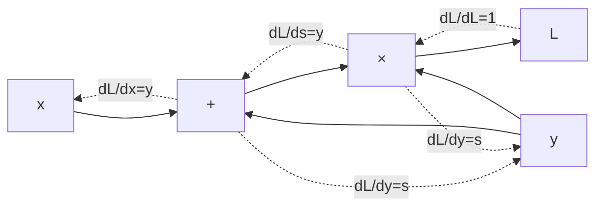

# 2.2 — Backpropagation

## 1. Intuition first

Backprop = the chain rule, applied efficiently on a computation graph. You compute the loss forward layer-by-layer, then propagate the gradient of the loss **backward** through each operation, reusing intermediate results. Every deep-learning framework is a really good backprop engine.

## 2. Why the topic exists

Training a deep net requires derivatives of a scalar loss w.r.t. millions of parameters. Naive numerical differentiation costs O(#params) forward passes → infeasible. Backprop computes all gradients in one backward pass — cost ~ 2× a forward pass.

## 3. What problem it solves

Efficient exact gradient computation for arbitrary differentiable models.

## 4. Mathematics

### 4.1 Chain rule (single variable)

$$
\frac{d}{dx} f(g(x)) = f'(g(x)) \cdot g'(x)
$$

### 4.2 Chain rule (vector Jacobians)

For $\mathbf{y} = f(\mathbf{x})$ and $L = g(\mathbf{y})$:

$$
\frac{\partial L}{\partial \mathbf{x}} = \left(\frac{\partial \mathbf{y}}{\partial \mathbf{x}}\right)^T \frac{\partial L}{\partial \mathbf{y}}
$$

i.e. vector-Jacobian product (VJP). Backprop = repeated VJP.

### 4.3 Backprop through an MLP

Given forward pass $\mathbf{z}^{(l)} = W^{(l)} \mathbf{a}^{(l-1)} + \mathbf{b}^{(l)},\ \mathbf{a}^{(l)} = \phi(\mathbf{z}^{(l)})$, and loss $L$:

- $\boldsymbol\delta^{(L)} = \nabla_{\mathbf{a}^{(L)}} L \odot \phi'(\mathbf{z}^{(L)})$ (output layer).
- For $l = L-1, \ldots, 1$:
  $\boldsymbol\delta^{(l)} = (W^{(l+1)})^T \boldsymbol\delta^{(l+1)} \odot \phi'(\mathbf{z}^{(l)})$.
- Parameter gradients:
  $\nabla_{W^{(l)}} L = \boldsymbol\delta^{(l)} (\mathbf{a}^{(l-1)})^T$,
  $\nabla_{\mathbf{b}^{(l)}} L = \boldsymbol\delta^{(l)}$.

### 4.4 Softmax + cross-entropy shortcut

For softmax output $\hat{\mathbf{p}}$ and one-hot target $\mathbf{y}$:

$$
\frac{\partial L}{\partial \mathbf{z}^{(L)}} = \hat{\mathbf{p}} - \mathbf{y}
$$

Beautifully cancels the $1/(1-p)$ terms.

## 5. Every formula explained

- $\boldsymbol\delta^{(l)}$ = "error signal" at layer $l$. Multiply by transposed next-layer weights to send it backward.
- $\odot$ is elementwise. $\phi'$ evaluated at pre-activation.
- Reverse-mode autodiff = topological order + accumulate gradients.

## 6. Variables

| Symbol | Meaning |
|--------|---------|
| $\boldsymbol\delta^{(l)}$ | error at layer $l$ |
| $\mathbf{z}^{(l)}$ | pre-activation |
| $\mathbf{a}^{(l)}$ | post-activation |
| $W, b$ | parameters |

## 7. Algorithm

1. **Build graph** during forward pass (framework does this).
2. **Compute loss** $L$.
3. **Seed** $\partial L / \partial L = 1$.
4. **Traverse graph in reverse topological order**: for each node, use its `_backward` to add contributions to parent gradients.
5. **Update parameters** via optimizer.

## 8. Simple example

$f(x, y) = (x + y) \cdot y$. Forward: $s = x + y,\ o = s \cdot y$.

Backward with seed $\partial L / \partial o = 1$:
- $\partial o / \partial s = y,\ \partial o / \partial y = s \implies \partial L/\partial s = y,\ \partial L/\partial y = s$.
- $\partial L/\partial x = \partial L/\partial s \cdot 1 = y$.
- Combining path contributions to $y$: $\partial L / \partial y = s + y$.

## 9. Real-world example

Every gradient step of every neural network — from your MNIST toy MLP to GPT-4 training on a supercomputer — is a backprop pass.

## 10. Diagram



## 11. Implementation from scratch — mini reverse-mode autodiff

```python
import math

class Tensor:
    def __init__(self, data, _children=()):
        self.data = data; self.grad = 0.0
        self._prev = _children; self._backward = lambda: None

    def __add__(self, other):
        other = other if isinstance(other, Tensor) else Tensor(other)
        out = Tensor(self.data + other.data, (self, other))
        def _bw():
            self.grad += out.grad
            other.grad += out.grad
        out._backward = _bw
        return out

    def __mul__(self, other):
        other = other if isinstance(other, Tensor) else Tensor(other)
        out = Tensor(self.data * other.data, (self, other))
        def _bw():
            self.grad += other.data * out.grad
            other.grad += self.data * out.grad
        out._backward = _bw
        return out

    def relu(self):
        out = Tensor(max(0.0, self.data), (self,))
        def _bw():
            self.grad += (self.data > 0) * out.grad
        out._backward = _bw
        return out

    def backward(self):
        topo, seen = [], set()
        def build(v):
            if v in seen: return
            seen.add(v)
            for c in v._prev: build(c)
            topo.append(v)
        build(self)
        self.grad = 1.0
        for v in reversed(topo):
            v._backward()
```

## 12. Implementation using libraries

```python
import torch
x = torch.tensor([1.0, 2.0], requires_grad=True)
y = torch.tensor([3.0, 4.0], requires_grad=True)
L = ((x + y) * y).sum()
L.backward()
print(x.grad, y.grad)
```

## 13. Time complexity

Backward = O(forward). Autodiff cost ≈ 2–3× forward.

## 14. Space complexity

Must store activations of every op → O(#activations). Gradient checkpointing trades compute for memory.

## 15. Advantages

- Exact gradients.
- Efficient — enables training billion-parameter models.
- Framework-provided → user only writes forward pass.

## 16. Disadvantages

- Memory-heavy (activation storage).
- Numerical issues (vanishing/exploding gradients).
- Non-differentiable ops need special tricks.

## 17. Interview questions

1. Explain reverse-mode autodiff.
2. Why not use numerical differentiation?
3. Derive the softmax + CE gradient.
4. Difference between forward-mode and reverse-mode?
5. Why does backprop use *reverse* topological order?
6. Explain gradient checkpointing.
7. What happens to memory when batch size doubles?
8. Why can gradients explode? How do we handle it?
9. What is a "detach" call for in PyTorch?
10. How does autograd know when to accumulate gradients?

## 18. Common mistakes

- In-place ops on tensors needed for backward.
- Forgetting `optimizer.zero_grad()`.
- Detaching a tensor that still needs gradient flow.
- Confusing `.grad` for the parameter tensor vs its gradient.

## 19. Optimization techniques

- Gradient checkpointing (trade time for memory).
- Mixed precision + loss scaling.
- Gradient clipping (`clip_grad_norm_`).
- Fused kernels (LayerNorm, softmax, attention).

## 20. Coding exercises

1. Extend `micrograd`-style `Tensor` to support `matmul`, `tanh`, `exp`, `log`.
2. Gradient-check a custom layer.
3. Implement backprop for a 3-layer MLP manually (no framework).
4. Reproduce the softmax + CE identity in a unit test.

## 21. Mini project

Train an MLP on MNIST using only your from-scratch autodiff.

## 22. Medium project

Add broadcasting, `matmul`, `softmax`, `layernorm` to your tiny autodiff engine; train a small CNN.

## 23. Advanced project

Implement forward- and reverse-mode autodiff side-by-side; write a JVP/VJP-based engine and use it for meta-learning (gradient of gradient) on a small problem.

## 24. Where it is used in industry

Every gradient-based ML training run.

## 25. How companies use it

- PyTorch, TensorFlow, JAX are backprop engines.
- Distributed training frameworks build on top of them.

## 26. When NOT to use it

- Objectives that are non-differentiable (RL rewards, discrete choices) — combine with policy gradients or straight-through estimators.
