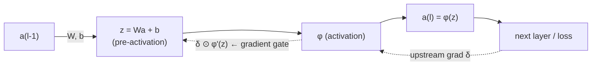
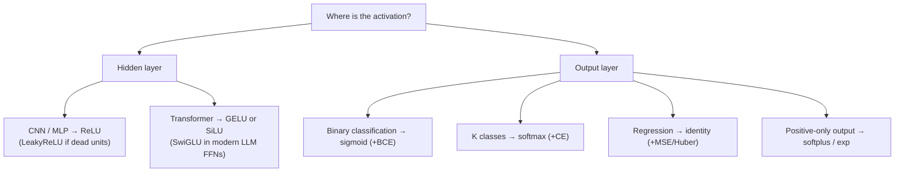
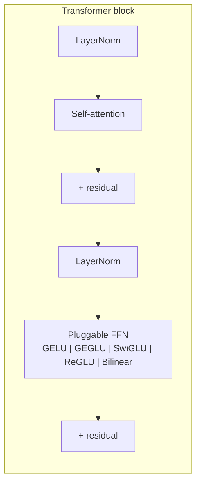

# 2.3 — Activation Functions

## 1. Overview

**What is it?** An activation function is the non-linear function $\phi$ applied elementwise to a layer's pre-activations: $a = \phi(z)$. It is the smallest component of a neural network, yet the one that gives the whole system its power.

**Why does it exist?** As proved in [Perceptron & MLP](01-perceptron-mlp.md), a stack of purely linear layers collapses into a single linear layer. The activation function "breaks" linearity so that depth actually buys expressive power — it is the ingredient the Universal Approximation Theorem requires.

**What problem does it solve?** Three problems at once: (1) it enables networks to represent curved decision boundaries and non-linear functions; (2) chosen well, it keeps gradients healthy during [backpropagation](02-backpropagation.md) (avoiding vanishing/exploding signals); (3) at the output layer, it maps raw scores into the range the task needs — probabilities in $(0,1)$, a distribution over classes, or unbounded regression values.

**Where is it used?** Between every pair of layers in every neural network. The specific choice is an architectural signature: ReLU defined the CNN era (AlexNet, ResNet), GELU defines BERT and GPT, SiLU/SwiGLU define LLaMA-class LLMs, and softmax sits at the output of essentially every classifier — and inside every attention layer.

## 2. Learning Objectives

After this chapter you will be able to:

- Explain precisely why deep networks need non-linear activations (and reproduce the collapse proof).
- Write the formula, derivative, and output range of sigmoid, tanh, ReLU, LeakyReLU, PReLU, ELU, Softplus, GELU, SiLU/Swish, Mish, and softmax.
- Derive the derivatives $\sigma'(z) = \sigma(z)(1-\sigma(z))$ and $\tanh'(z) = 1 - \tanh^2(z)$ from scratch.
- Explain the vanishing-gradient problem mechanistically and quantify sigmoid's role in it ($\sigma' \le 0.25$).
- Explain the dying-ReLU problem, detect it in a real network, and know four fixes.
- Explain what GELU and SiLU improve over ReLU, and what gated activations (GLU, GEGLU, SwiGLU) add on top.
- Implement a numerically stable softmax and explain why the max-subtraction trick works.
- Match output activations to losses (sigmoid ↔ BCE, softmax ↔ CE, identity ↔ MSE) and know why mismatches fail.
- Pair initialization schemes with activations (He ↔ ReLU, Xavier ↔ tanh).
- Choose the right activation for CNN, transformer, and output-head contexts, with justification.

## 3. Prerequisites

| Chapter | Why you need it |
|---------|-----------------|
| [Calculus](../phase-0-prerequisites/03-calculus.md) | Every activation's usefulness is judged by its derivative. |
| [Probability & Statistics](../phase-0-prerequisites/04-probability-statistics.md) | Softmax outputs distributions; GELU is defined via the Gaussian CDF. |
| [Logistic Regression](../phase-1-classical-ml/04-logistic-regression.md) | Sigmoid was introduced there as the link function. |
| [Perceptron & MLP](01-perceptron-mlp.md) | Activations are the $\phi$ in the forward pass defined there. |
| [Backpropagation](02-backpropagation.md) | Gradients flow *through* $\phi'(z)$; activation choice determines gradient health. |

Losses that must match the output activation are covered in [Loss Functions](04-loss-functions.md).

## 4. Intuition

An activation function is a **decision about how a neuron responds** to its total input. A linear response ("output exactly what you receive") makes the neuron boring — infinitely many boring neurons combine into one boring neuron. Interesting responses — saturating, thresholding, gating — make combinations interesting.

**Analogy — the dimmer switch vs. the light switch.** A plain wire (identity) passes any signal unchanged. A light switch (the step function) is decisive but brutal: it gives no hint how *close* you were to flipping it, which is fatal for learning-by-gradient — the derivative is zero everywhere. A dimmer switch (sigmoid) responds smoothly, so you can feel which direction to turn it — but at both extremes it stops responding (saturation). ReLU is a one-way valve: shut below zero, wide open above, with a perfectly consistent response when open.

**Everyday story.** Think of employees reacting to workload. A "sigmoid employee" is responsive in the normal range but numb at the extremes — overwhelmed or idle, extra pressure changes nothing (vanished gradient: management can't tell what would help). A "ReLU employee" ignores everything below their threshold and then responds one-for-one — efficient, but if they get pushed far below threshold, they may disengage permanently and never respond again (a dead neuron). A "GELU employee" is like the ReLU one but with a soft, probabilistic ramp near the threshold — small inputs *sometimes* get through, so management always gets some feedback about near-threshold behavior.

The art of activation design is exactly this trade-off: be non-linear enough to matter, but keep the derivative informative over as much of the input range as possible.

## 5. Real-world Motivation

- **AlexNet (2012)** attributed much of its training speed to replacing tanh with **ReLU** — the paper reports ~6× faster convergence on CIFAR-10 — kicking off the deep-learning era. **ResNet** and most CNNs since standardize on ReLU.
- **Google's BERT** and **OpenAI's GPT** series use **GELU** in their feed-forward blocks; it has become the default transformer activation.
- **Meta's LLaMA**, **Mistral**, and **DeepSeek** models use **SwiGLU** (a gated SiLU variant), following Shazeer's 2020 finding that GLU variants improve transformer quality at equal compute; Google's **PaLM** used SwiGLU too.
- **Google's EfficientNet** and later mobile/vision models use **SiLU/Swish**, which Google discovered via automated search ("Searching for Activation Functions," 2017). **MobileNet** uses **ReLU6** (ReLU clipped at 6) because bounded ranges quantize well on phone hardware — an activation choice driven purely by deployment constraints.
- **Softmax** is unavoidable: it converts logits to probabilities in every production classifier and forms the attention weights inside every transformer serving at Google, OpenAI, and Meta.

The pattern: activation choices are cheap to change and measurably move training speed, final quality, and deployability — which is why labs keep iterating on them.

## 6. Mathematical Foundations

### 6.1 The zoo, with derivatives

Throughout, $z \in \mathbb R$ is the pre-activation, $\alpha$ a (fixed or learned) negative-slope/scale parameter, $\sigma$ the logistic sigmoid, and $\Phi$ the standard normal CDF.

| Name | Formula $\phi(z)$ | Derivative $\phi'(z)$ | Range | Notes |
|------|-------------------|------------------------|-------|-------|
| Sigmoid | $\sigma(z) = \dfrac{1}{1+e^{-z}}$ | $\sigma(z)(1-\sigma(z))$ | $(0,1)$ | max slope 0.25; saturates; not zero-centered |
| Tanh | $\dfrac{e^z - e^{-z}}{e^z + e^{-z}}$ | $1 - \tanh^2(z)$ | $(-1,1)$ | zero-centered; still saturates; $\tanh(z) = 2\sigma(2z) - 1$ |
| ReLU | $\max(0, z)$ | $\mathbb 1[z > 0]$ | $[0,\infty)$ | cheap; no saturation for $z>0$; can "die" |
| LeakyReLU | $\max(\alpha z, z)$, $\alpha \approx 0.01$ | $1$ if $z>0$ else $\alpha$ | $\mathbb R$ | small negative slope prevents death |
| PReLU | LeakyReLU with **learnable** $\alpha$ | $1$ or $\alpha$ | $\mathbb R$ | $\alpha$ trained by backprop (He et al., 2015) |
| ELU | $z$ if $z>0$ else $\alpha(e^z - 1)$ | $1$ if $z>0$ else $\phi(z) + \alpha$ | $(-\alpha,\infty)$ | smooth; pushes mean activations toward 0 |
| Softplus | $\log(1 + e^z)$ | $\sigma(z)$ | $(0,\infty)$ | smooth ReLU; used for positive outputs (e.g., variances) |
| GELU | $z\,\Phi(z)$ | $\Phi(z) + z\,\varphi(z)$, $\varphi$ = normal PDF | $\approx(-0.17,\infty)$ | transformer default; smooth, non-monotonic dip |
| SiLU / Swish | $z\,\sigma(z)$ | $\sigma(z)\big(1 + z(1-\sigma(z))\big)$ | $\approx(-0.28,\infty)$ | found by neural search; very close to GELU |
| Mish | $z\tanh(\mathrm{softplus}(z))$ | (composite) | $\approx(-0.31,\infty)$ | used in YOLOv4-era detectors |
| Softmax | $\dfrac{e^{z_i}}{\sum_j e^{z_j}}$ | Jacobian $\hat p_i(\mathbb 1[i{=}j]-\hat p_j)$ | probability simplex | vector-valued; multi-class output & attention |

### 6.2 Two derivations you must know

**Sigmoid.** Write $\sigma(z) = (1+e^{-z})^{-1}$ and differentiate with the chain rule:

$$
\sigma'(z) = -(1+e^{-z})^{-2}\cdot(-e^{-z}) = \frac{e^{-z}}{(1+e^{-z})^2}
= \underbrace{\frac{1}{1+e^{-z}}}_{\sigma(z)}\cdot \underbrace{\frac{e^{-z}}{1+e^{-z}}}_{1-\sigma(z)} = \sigma(z)\big(1-\sigma(z)\big).
$$

Maximum at $z=0$: $\sigma'(0) = 0.5 \times 0.5 = \mathbf{0.25}$.

**Tanh.** From $\tanh z = \frac{\sinh z}{\cosh z}$ and the quotient rule with $\sinh' = \cosh$, $\cosh' = \sinh$:

$$
\tanh'(z) = \frac{\cosh^2 z - \sinh^2 z}{\cosh^2 z} = 1 - \tanh^2(z), \qquad \tanh'(0) = 1.
$$

### 6.3 Vanishing gradients, quantified

Backprop multiplies $\phi'(\mathbf z^{(l)})$ into the error signal at *every* layer ([Chapter 2.2](02-backpropagation.md)):

$$
\boldsymbol\delta^{(l)} = \big(W^{(l+1)}\big)^\top \boldsymbol\delta^{(l+1)} \odot \phi'(\mathbf z^{(l)}).
$$

With sigmoid, $\phi' \le 0.25$ everywhere, so through $L$ layers the gradient magnitude carries a factor $\le 0.25^L$: after just 10 layers, $\le 10^{-6}$. Early layers receive essentially no learning signal — the **vanishing gradient problem** that stalled deep learning through the 1990s–2000s. Tanh is better ($\phi' \le 1$, and $=1$ at the center) but still saturates for $|z| \gtrsim 2.5$. ReLU's derivative is exactly 1 on the active half — the gradient passes through unattenuated — which, together with He initialization, is what first made 10+-layer networks trainable.

### 6.4 Dying ReLU

If a neuron's pre-activation is negative for **every** input in the data distribution, then $\phi'(z) = 0$ always, so its incoming weights receive zero gradient — the neuron can never recover: it is **dead**. Typical cause: a large gradient step (high learning rate) knocks the bias very negative. In badly tuned runs, 20–50% of units can die. Fixes: LeakyReLU/PReLU/ELU/GELU (non-zero gradient for $z<0$), lower learning rate, batch normalization, and slightly positive bias init (e.g., 0.01).

### 6.5 GELU, SiLU, and gating

**GELU** (Hendrycks & Gimpel, 2016): $\text{GELU}(z) = z\,\Phi(z) = z\,\Pr(Z \le z)$, $Z \sim \mathcal N(0,1)$. Interpretation: a *stochastic* gate that keeps input $z$ with probability $\Phi(z)$, taken in expectation — a smooth, probabilistic ReLU. Common tanh approximation: $0.5z\big(1 + \tanh[\sqrt{2/\pi}(z + 0.044715 z^3)]\big)$.

**SiLU/Swish**: $z\,\sigma(z)$ — same shape, logistic gate instead of Gaussian; the two differ by at most a few percent anywhere.

**Gated Linear Units** decouple the *signal* from the *gate* with two separate projections:

$$
\mathrm{GLU}(\mathbf x) = (W\mathbf x + \mathbf b) \odot \sigma(V\mathbf x + \mathbf c), \qquad
\mathrm{SwiGLU}(\mathbf x) = (W\mathbf x) \odot \mathrm{SiLU}(V\mathbf x),
$$

where $W, V$ are separate weight matrices ($\mathbf b, \mathbf c$ biases, often omitted). In a transformer feed-forward block, SwiGLU replaces `Linear → GELU → Linear` with `(Linear ⊙ SiLU(Linear)) → Linear`; the hidden width is usually scaled by 2/3 to keep the parameter count equal (three matrices instead of two).

### 6.6 Softmax and numerical stability

$$
\mathrm{softmax}(\mathbf z)_i = \frac{e^{z_i}}{\sum_{j=1}^{K} e^{z_j}}, \qquad
\frac{\partial\,\hat p_i}{\partial z_j} = \hat p_i(\mathbb 1[i{=}j] - \hat p_j).
$$

Softmax is invariant to adding a constant to all logits: $\mathrm{softmax}(\mathbf z + c) = \mathrm{softmax}(\mathbf z)$ (the $e^c$ cancels). Choosing $c = -\max_i z_i$ makes every exponent $\le 0$, preventing overflow — the standard implementation trick. A **temperature** $T$ generalizes it: $\mathrm{softmax}(\mathbf z / T)$ — $T \to 0$ approaches argmax (one-hot), $T \to \infty$ approaches uniform; used in LLM sampling and knowledge distillation. Note softmax with 2 classes reduces exactly to a sigmoid on the logit difference: $\mathrm{softmax}([z_1,z_2])_1 = \sigma(z_1 - z_2)$.

## 7. Visual Explanation

Shapes of the main activations (x-axis: $z$; y-axis: $\phi(z)$):

```
  ReLU              LeakyReLU          Sigmoid             Tanh                GELU
      │   /             │   /            1│    ____          1│    ____            │    /
      │  /              │  /              │   /               │   /                │   /
      │ /               │ /               │  /                │  /                 │  /
──────┼/─────      ─────┼/─────       ────┼/────────     ─────┼/──────        ─────┼/─────
     /│              _/ │               _/│0              _  /│                 ‿_/│
      │           ~~    │            __/  │             -1|__/                     │ (small dip < 0)
```

Where the activation sits in the layer, and what flows backward through it:



Decision guide for choosing an activation:



## 8. Algorithm

Choosing and wiring activations is a small design procedure:

1. **Hidden layers**: start with ReLU for CNNs/MLPs; GELU or SiLU for transformers; SwiGLU if you are building a modern LLM-style feed-forward block.
2. **Match initialization**: He/Kaiming init for the ReLU family, Xavier/Glorot for tanh/sigmoid ([Chapter 2.1](01-perceptron-mlp.md), Section 6.7).
3. **Output layer**: choose by task — sigmoid (binary), softmax (multi-class), identity (regression) — and pair with the matching loss from [Loss Functions](04-loss-functions.md), using the fused logits form (`BCEWithLogitsLoss`, `CrossEntropyLoss`).
4. **Monitor gradient health**: track per-layer gradient norms and the fraction of zero activations; if early-layer gradients are ~0 or many units are dead, switch to a leaky/smooth variant or lower the learning rate.
5. **Only then micro-optimize**: A/B test GELU vs ReLU vs SiLU — gains are real but usually single-digit percent.

```text
PSEUDOCODE: forward through activation (elementwise)
  # z: tensor of any shape
  relu:     a[i] = max(0, z[i])
  leaky:    a[i] = z[i] if z[i] > 0 else alpha * z[i]
  gelu:     a[i] = z[i] * Phi(z[i])
  softmax over last axis:
      m    = max(z)              # stability shift
      e[i] = exp(z[i] - m)
      a[i] = e[i] / sum(e)       # rows sum to 1

  backward: dz[i] = da[i] * phi'(z[i])     # elementwise gate on the gradient
```

## 9. Worked Example

### 9.1 By hand: one neuron, three activations

Let $z = 2.0$ and upstream gradient $\partial L/\partial a = 1.0$. Compute output and the gradient passed back, $\partial L/\partial z = \phi'(z)$:

| Activation | $\phi(2.0)$ | $\phi'(2.0)$ | Gradient passed back |
|------------|-------------|--------------|----------------------|
| Sigmoid | $\sigma(2) = 0.881$ | $0.881 \times 0.119 = 0.105$ | 0.105 |
| Tanh | $0.964$ | $1 - 0.964^2 = 0.071$ | 0.071 |
| ReLU | $2.0$ | $1$ | 1.0 |

Now repeat at $z = -2.0$: sigmoid passes $0.105$, tanh $0.071$, ReLU passes **0** — the two failure modes in one table. Stack 10 sigmoid layers with $|z| \approx 2$ everywhere and the end-to-end gradient factor is $\approx 0.105^{10} \approx 1.6\times 10^{-10}$: vanished.

### 9.2 By hand: stable softmax

Logits $\mathbf z = [3, 1, 0.2]$. Shift by $\max = 3$: $[0, -2, -2.8]$. Exponentiate: $[1, 0.135, 0.061]$. Sum $= 1.196$. Probabilities: $[0.836, 0.113, 0.051]$ — sums to 1.000. Now try $\mathbf z = [1000, 999, 998]$ *without* the shift: $e^{1000}$ overflows to `inf`, giving `nan`; *with* the shift it becomes $[0,-1,-2] \to [0.665, 0.245, 0.090]$. Same answer as the mathematical definition, no overflow.

### 9.3 Realistic scale

Train the same $[784, 256, 256, 10]$ MLP on MNIST three times, changing only the hidden activation: sigmoid converges slowest and plateaus lower; tanh is decent; ReLU reaches the same accuracy as tanh in roughly half the epochs. On a small transformer (e.g., TinyShakespeare), swapping ReLU → GELU in the feed-forward blocks typically lowers validation loss by a small but consistent margin — the same reason BERT/GPT chose it.

## 10. Python from Scratch

All the major activations, their derivatives, and a quick numerical check — NumPy only:

```python
import numpy as np

# ---------- activations ----------
def sigmoid(z):
    # stable piecewise form: never exponentiates a large positive number
    out = np.empty_like(z)
    pos = z >= 0
    out[pos]  = 1.0 / (1.0 + np.exp(-z[pos]))
    ez = np.exp(z[~pos])                # z<0 → exp(z) is safe (≤1)
    out[~pos] = ez / (1.0 + ez)
    return out

def tanh(z):        return np.tanh(z)
def relu(z):        return np.maximum(0.0, z)
def leaky_relu(z, a=0.01): return np.where(z > 0, z, a * z)
def elu(z, a=1.0):  return np.where(z > 0, z, a * (np.exp(z) - 1))
def softplus(z):    return np.log1p(np.exp(-np.abs(z))) + np.maximum(z, 0)  # stable
def silu(z):        return z * sigmoid(z)
def gelu(z):        # tanh approximation used by GPT-2/BERT
    return 0.5 * z * (1 + np.tanh(np.sqrt(2/np.pi) * (z + 0.044715 * z**3)))

def softmax(z, axis=-1):
    z = z - z.max(axis=axis, keepdims=True)   # shift-invariance → no overflow
    e = np.exp(z)
    return e / e.sum(axis=axis, keepdims=True)

# ---------- derivatives (for backprop) ----------
def d_sigmoid(z):   s = sigmoid(z); return s * (1 - s)
def d_tanh(z):      t = np.tanh(z); return 1 - t * t
def d_relu(z):      return (z > 0).astype(z.dtype)
def d_leaky(z, a=0.01): return np.where(z > 0, 1.0, a)
def d_silu(z):      s = sigmoid(z); return s * (1 + z * (1 - s))

# ---------- numerical check: derivative correctness ----------
z0, eps = np.array([0.7]), 1e-6
num = (silu(z0 + eps) - silu(z0 - eps)) / (2 * eps)   # central difference
assert np.allclose(num, d_silu(z0), atol=1e-5)        # passes
print(float(num), float(d_silu(z0)))    # expected: 0.8836... 0.8836...
```

Block-by-block: the stable `sigmoid` avoids computing `exp(-z)` for very negative `z` (which overflows); `softplus` uses the identity $\log(1{+}e^z) = \max(z,0) + \log(1{+}e^{-|z|})$; `softmax` subtracts the row max (Section 6.6); the final block verifies an analytic derivative against a central difference — a habit you should apply to every derivative you ever write. All functions are $O(n)$ elementwise on input size $n$.

> [!WARNING]
> **Common bug**: computing sigmoid as `1/(1+np.exp(-z))` directly. For `z = -1000`, `np.exp(1000)` overflows to `inf` with a `RuntimeWarning`, yielding 0.0 — silently correct-looking here, but the same pattern in softplus/BCE produces `inf − inf = nan`.

## 11. Library Implementation

PyTorch offers each activation as a module (for `nn.Sequential`) and a functional (for custom `forward`):

```python
import torch
import torch.nn as nn
import torch.nn.functional as F

# --- module style: composable in Sequential ---
mlp = nn.Sequential(
    nn.Linear(784, 256), nn.ReLU(),              # CNN/MLP default
    nn.Linear(256, 256), nn.GELU(),              # transformer default
    nn.Linear(256, 10),                          # raw logits out — no softmax here!
)

# --- functional style: inside a custom forward ---
x = torch.randn(64, 256)
h = F.silu(x)                                    # SiLU / Swish
h = F.leaky_relu(x, negative_slope=0.01)         # LeakyReLU
p = F.softmax(x, dim=-1)                         # ONLY for inference/attention —
log_p = F.log_softmax(x, dim=-1)                 # for losses, use log_softmax / fused CE

# --- learnable and gated variants ---
prelu = nn.PReLU(num_parameters=1)               # learnable negative slope α
class SwiGLU(nn.Module):
    """LLaMA-style gated feed-forward: (xW ⊙ SiLU(xV)) W_out."""
    def __init__(self, d, hidden):
        super().__init__()
        self.w = nn.Linear(d, hidden, bias=False)   # signal projection
        self.v = nn.Linear(d, hidden, bias=False)   # gate projection
        self.out = nn.Linear(hidden, d, bias=False)
    def forward(self, x):                           # x: (B, T, d)
        return self.out(self.w(x) * F.silu(self.v(x)))  # (B, T, d)
```

Key lines: the last `Linear` emits **logits** because `nn.CrossEntropyLoss` applies `log_softmax` internally — adding your own softmax is the classic double-softmax bug; `nn.PReLU` registers $\alpha$ as a trainable parameter updated by backprop; `SwiGLU` uses three matrices, so frameworks shrink `hidden` to $\tfrac{2}{3}\cdot 4d$ to match the parameter count of a standard $4d$ FFN.

## 12. Code Walkthrough

Tracing the `SwiGLU` block above with LLaMA-like sizes:

| Tensor | Shape | Meaning |
|--------|-------|---------|
| `x` | (B, T, 4096) | token representations (batch B, sequence length T) |
| `self.w(x)` | (B, T, 11008) | signal branch (11008 ≈ 2/3 × 4 × 4096, rounded) |
| `self.v(x)` | (B, T, 11008) | gate branch pre-activation |
| `F.silu(self.v(x))` | (B, T, 11008) | gate values, mostly in (−0.28, ∞) |
| product | (B, T, 11008) | gated signal — elements with negative gate pre-activations are suppressed |
| `self.out(...)` | (B, T, 4096) | back to model width |

**Expected results**: output shape equals input shape; with standard init the output's standard deviation is comparable to the input's. Quick health probes on any ReLU network: `(h == 0).float().mean()` per layer — ≈ 0.5 at init is normal; > 0.9 that *stays* high across training batches means dying units. For softmax: every row of `p` sums to 1 within 1e-6, and `p.max()` near 1.0 at initialization signals over-confident (too-large) logits.

## 13. Complexity Analysis

**Time.** All scalar activations are $O(n)$ elementwise for $n$ activations — a handful of flops each (ReLU: one comparison; GELU: a tanh + polynomial, maybe 10×  more flops than ReLU but still negligible next to the $O(n \cdot d)$ matmuls that surround it). Softmax is $O(n)$ per row but requires **three passes** (max, exp-sum, divide), which makes it memory-bandwidth-bound; this is why fused softmax kernels and FlashAttention (which never materializes the full attention softmax) matter at scale. In practice activations are fused into the preceding matmul kernel and cost approximately nothing.

**Space.** Output same shape as input: $O(n)$. For backprop, either the input $z$ or the output $a$ must be cached per activation (ReLU can recompute its mask from the output; GELU needs its input) — part of the activation-memory bill analyzed in [Backpropagation](02-backpropagation.md), Section 13.

## 14. Advantages

Per family, with concrete evidence:

- **ReLU** — computationally trivial and gradient-preserving on its active half; the switch from tanh to ReLU was reported by AlexNet to speed convergence ~6×, and it remains the CNN default a decade later.
- **LeakyReLU / PReLU / ELU** — keep a gradient path for negative inputs, eliminating dead units; PReLU was a component of the first model to surpass human-level top-5 error on ImageNet classification (He et al., 2015).
- **GELU / SiLU** — smooth everywhere (no derivative discontinuity at 0), slightly better loss in transformers; adopted by BERT, GPT-2/3, ViT (GELU) and EfficientNet (SiLU).
- **SwiGLU / gated units** — the gate lets the network modulate information flow input-dependently; Shazeer (2020) showed GLU variants beat GELU FFNs at equal compute, hence LLaMA/PaLM/Mistral adoption.
- **Sigmoid / softmax at the output** — map logits to calibrated probability spaces that plug directly into likelihood-based losses ([Loss Functions](04-loss-functions.md)) and business thresholds.

## 15. Disadvantages

- **Sigmoid (hidden layers)**: saturates on both sides with $\phi' \le 0.25$ → vanishing gradients (Section 6.3); outputs not zero-centered → all-positive activations bias downstream gradient directions. Effectively obsolete as a hidden activation.
- **Tanh**: zero-centered but still saturating; the historical LSTM/RNN choice, superseded elsewhere.
- **ReLU**: dead units (Section 6.4); unbounded positive side can produce large activations with high learning rates → NaNs; non-differentiable at 0 (harmless in practice — frameworks pick a subgradient).
- **GELU/SiLU**: more expensive than ReLU (relevant on CPUs/edge devices); non-monotonic dip below zero complicates some theoretical analyses.
- **SwiGLU**: three projections instead of two → more memory traffic and code complexity; benefits shrink for small models.
- **Softmax**: overflows without max-subtraction; saturates when one logit dominates (near-zero gradients on over-confident predictions); its $O(K)$ normalization over huge vocabularies (e.g., 100k+ tokens) is a genuine serving cost in LLMs.

## 16. Common Mistakes

- **Applying softmax before `nn.CrossEntropyLoss`** — the loss already applies log-softmax; doubling it squashes gradients and caps achievable accuracy. *Avoid*: pass raw logits; if you need probabilities for inspection, compute them separately.
- **Sigmoid output for unbounded regression targets** — the model can never predict outside $(0,1)$. *Avoid*: identity output for regression (or scale targets deliberately).
- **Hidden-layer sigmoids in deep nets** — vanishing gradients by construction. *Avoid*: ReLU/GELU family in hidden layers; sigmoids only at binary outputs or in gates.
- **ReLU + aggressive learning rate** — one large update makes pre-activations permanently negative (dead units) or activations explode to NaN. *Avoid*: warmup, moderate LR, monitor the dead fraction.
- **Wrong `dim` in `F.softmax`** — softmaxing over the batch dimension instead of classes produces garbage that still "runs". *Avoid*: always pass `dim=` explicitly; assert `p.sum(-1) ≈ 1`.
- **Init/activation mismatch** — Xavier with ReLU halves signal variance per layer; deep nets stall. *Avoid*: He init with ReLU-family, Xavier with tanh ([Chapter 2.1](01-perceptron-mlp.md)).
- **Numerically naive formulas** — `1/(1+exp(-z))`, `log(softmax(z))`, `log(1+exp(z))` all overflow for large $|z|$. *Avoid*: stable forms — `log_softmax`, `softplus` via the $\max(z,0)$ identity, fused losses.

## 17. Best Practices

- [ ] Defaults: **ReLU** for CNNs/MLPs, **GELU/SiLU** for transformers, **SwiGLU** for LLM-style FFNs.
- [ ] Output activations by task: sigmoid ↔ binary + `BCEWithLogitsLoss`; softmax ↔ multi-class + `CrossEntropyLoss` (both fused — feed logits); identity ↔ regression.
- [ ] Pair init with activation: He ↔ ReLU family, Xavier ↔ tanh/sigmoid.
- [ ] Log per-layer statistics: fraction of zero (ReLU) activations, activation means/stds, gradient norms — dead layers and saturation are visible long before the loss curve shows them.
- [ ] Use `log_softmax` + NLL (or fused CE) rather than `log(softmax(...))` — always.
- [ ] Place activations *after* normalization layers in the standard pattern (Linear/Conv → Norm → Activation), and never insert an extra activation between the final Linear and the loss.
- [ ] For quantized/edge deployment prefer bounded, cheap activations (ReLU6, hard-swish) — this is why MobileNet uses them.
- [ ] Changing activation? Change one thing at a time and A/B with fixed seeds — activation effects are real but small enough to be confounded by everything else.

## 18. Optimization Techniques

- **Kernel fusion**: activations are memory-bound; fusing them into the preceding matmul/conv kernel (automatic with `torch.compile`, cuDNN epilogues) removes an entire read-write round trip.
- **Cheap approximations**: the tanh-approximate GELU and **hard-swish** ($z \cdot \mathrm{ReLU6}(z{+}3)/6$) replace transcendentals with piecewise arithmetic — MobileNetV3's choice for phones.
- **Quantization-friendly choices**: bounded activations (ReLU6) keep int8 quantization ranges tight; unbounded GELU tails cost quantization precision.
- **Recompute-in-backward**: ReLU's backward needs only a 1-bit mask; frameworks store the mask (or recompute from the output) instead of the full input — a micro-example of the checkpointing idea from [Backpropagation](02-backpropagation.md).
- **Fused/online softmax**: computing max, sum, and normalization in one streaming pass (the "online softmax" trick) underlies FlashAttention and fused CE kernels — essential when the softmax axis is a 100k-token vocabulary.
- **Vectorization**: implement custom activations with elementwise tensor ops (never Python loops); one `torch.where` beats a per-element loop by orders of magnitude.

## 19. Industry Applications

- **Vision**: ReLU in ResNet/YOLO-family production detectors; SiLU in EfficientNet and YOLOv5+; ReLU6/hard-swish in MobileNets running on billions of phones (Google's on-device vision).
- **Language**: GELU in BERT (Google Search query understanding since 2019) and the GPT series; SwiGLU in LLaMA (Meta), PaLM (Google), Mistral, DeepSeek — i.e., inside virtually every frontier LLM's feed-forward blocks.
- **Attention itself**: softmax computes attention weights in every transformer inference at OpenAI/Anthropic/Google — so much so that dedicated fused-softmax kernels (FlashAttention) became standard infrastructure.
- **Speech & recommenders**: sigmoid gates inside LSTMs powered Google's production speech recognition and Translate for years; sigmoid output heads produce click probabilities in ads/recommendation stacks at Meta and Google (paired with BCE).
- **Edge/embedded**: Tesla-style automotive perception and mobile ML pipelines choose quantization-friendly activations, trading a little accuracy for int8 deployability.

## 20. Interview Questions

### Beginner

**Q: Why do neural networks need non-linear activations at all?**
A: Composing affine maps yields an affine map: $W_2(W_1x + b_1) + b_2 = (W_2W_1)x + (W_2b_1 + b_2)$. Without non-linearity, any depth collapses to one linear layer, capable only of linear decision boundaries. The non-linearity is what makes depth add expressive power.

**Q: Why is sigmoid a poor choice for hidden layers in deep networks?**
A: Its derivative $\sigma(z)(1-\sigma(z))$ peaks at 0.25 and vanishes for $|z|$ large. Backprop multiplies one such factor per layer, so gradients shrink at least as $0.25^L$ — early layers stop learning (vanishing gradients). It is also not zero-centered, biasing gradient directions.

**Q: What is the dying-ReLU problem?**
A: If a unit's pre-activation is negative for all inputs, ReLU outputs 0 and its derivative is 0, so its weights get zero gradient and can never change — permanently dead. Usually caused by a large LR update; fixed by LeakyReLU/ELU/GELU, lower LR, or normalization.

**Q: Why doesn't anyone use the step function as an activation?**
A: Its derivative is zero everywhere (and undefined at 0), so backprop receives no signal about how to adjust weights — gradient-based learning is impossible. Sigmoid was historically its differentiable replacement.

**Q: When are softmax and sigmoid equivalent?**
A: For two classes: $\mathrm{softmax}([z_1, z_2])_1 = 1/(1+e^{-(z_1-z_2)}) = \sigma(z_1 - z_2)$. Binary classification with a single sigmoid logit is exactly 2-class softmax on the logit difference.

### Intermediate

**Q: Derive the derivative of tanh and compare its gradient behavior with sigmoid.**
A: $\tanh' = 1 - \tanh^2$, so $\tanh'(0) = 1$ versus sigmoid's 0.25 — tanh is zero-centered and passes full gradient at the origin, which is why it beat sigmoid historically. But it still saturates ($\tanh' \to 0$ for $|z| \gtrsim 2.5$), so very deep tanh nets still vanish.

**Q: What is GELU, intuitively and formally, and why do transformers prefer it?**
A: $\text{GELU}(z) = z\Phi(z)$ — the expectation of a stochastic gate that keeps $z$ with probability $\Phi(z)$. It behaves like a smooth ReLU: fully open for large positive $z$, closed for large negative $z$, with a soft probabilistic ramp (and a small non-monotonic dip) near zero. Empirically it gives slightly better losses in transformers (BERT/GPT adopted it), plausibly due to smoothness and non-zero gradients for small negative inputs.

**Q: Explain SwiGLU and why LLaMA-class models use it.**
A: $\mathrm{SwiGLU}(x) = (Wx) \odot \mathrm{SiLU}(Vx)$: one projection carries the signal, a second projection (through SiLU) computes an input-dependent gate. Shazeer (2020) showed GLU-variant FFNs outperform GELU FFNs at matched compute; hidden width is scaled by 2/3 to offset the third matrix. LLaMA, PaLM, and Mistral adopted it on that evidence.

**Q: Why must softmax subtract the max before exponentiating?**
A: Softmax is shift-invariant ($e^c$ cancels in the ratio), so subtracting $\max_i z_i$ changes nothing mathematically but makes all exponents $\le 0$, so $e^{z_i - m} \in (0,1]$ — no overflow. Without it, any logit ≳ 89 (float32) overflows `exp` to `inf`, producing `nan` probabilities.

**Q: Why does the output activation have to match the loss function?**
A: Losses are derived as negative log-likelihoods of specific output distributions: BCE assumes a Bernoulli parameterized by a sigmoid, CE a categorical parameterized by softmax, MSE a Gaussian mean with identity output. Mismatches break the probabilistic interpretation and the clean gradients (e.g., sigmoid + MSE has gradient $(\hat p - y)\,\sigma'(z)$ which vanishes when the model is confidently wrong, while sigmoid + BCE gives $\hat p - y$).

### Advanced

**Q: Quantify how activation choice interacts with initialization.**
A: Variance-preserving init requires $\mathrm{Var}(w) = 1/(d_{in}\,\mathbb E[\phi'(z)^2 + \ldots])$ in effect: tanh is ≈ identity near 0, giving Xavier's $2/(d_{in}{+}d_{out})$; ReLU zeroes half the (symmetric) input distribution, halving output variance, so He compensates with $2/d_{in}$. Using Xavier with ReLU shrinks signal by $\sqrt{1/2}$ per layer — after 20 layers, a factor ~1000 — stalling training. GELU/SiLU are ReLU-like and use He/fan-in scaling.

**Q: The gradient of softmax saturates for a confident prediction. Explain, and connect to label smoothing.**
A: When one logit dominates, $\hat{\mathbf p}$ is nearly one-hot; through cross-entropy the logit gradient $\hat{\mathbf p} - \mathbf y$ is near zero — correct-and-confident examples stop contributing. That's desirable at convergence but encourages ever-growing logits (overconfidence). Label smoothing replaces the one-hot target with $(1-\epsilon)\mathbf y + \epsilon/K$, keeping a small persistent gradient that bounds logit growth and improves calibration (see [Loss Functions](04-loss-functions.md)).

**Q: How would you detect and fix dying ReLUs in a production training run?**
A: Instrument per-layer: fraction of units whose activation is zero across an entire evaluation batch, tracked over training. At init ~50% zeros per *example* is normal; units at 100% zeros across *all* inputs, persisting across checkpoints, are dead. Fixes in order of preference: reduce LR / add warmup; add or fix normalization layers; switch to LeakyReLU/GELU; check for bad init or unnormalized inputs pushing pre-activations far negative.

**Q: Softmax over a 128k-token vocabulary is a serving bottleneck. What are the options?**
A: (1) Fused/online softmax kernels — one streaming pass for max/sum; (2) for sampling, you need the normalizer, but top-k/top-p can work on logits with partial sorting; (3) training-side alternatives: sampled softmax, noise-contrastive estimation, hierarchical softmax, or adaptive softmax that spends capacity on frequent tokens; (4) chunked log-softmax + CE fusion (e.g., chunked cross-entropy in modern LLM stacks) to avoid materializing the (B·T, 128k) probability tensor.

**Q: ReLU is non-differentiable at 0. Why doesn't this break gradient descent?**
A: Pre-activations hit exactly 0.0 with probability ~0 in continuous arithmetic, and frameworks assign a valid *subgradient* (any value in [0,1]; PyTorch uses 0). Convergence theory for subgradient methods covers this; empirically it has never mattered. The same argument covers LeakyReLU's kink and max-pooling's ties.

## 21. Coding Exercises

### Easy

1. **Plot the zoo.** Plot sigmoid, tanh, ReLU, LeakyReLU, ELU, GELU, SiLU and their derivatives on $[-5, 5]$ in a 2-row grid. *Hint*: derivatives can be computed numerically with central differences to double-check your analytic forms.
2. **Stable softmax.** Implement softmax with and without max-subtraction; find the smallest logit magnitude where the naive version returns `nan` in float32. *Hint*: `np.float32(89)` is close to the boundary since $e^{89} \approx 4.5\times10^{38}$.

### Medium

1. **Dead-unit monitor.** Train an MLP on Fashion-MNIST with LR ∈ {0.01, 0.1, 1.0}; after each epoch, log the fraction of hidden units that output zero for an entire validation batch. Show that high LR kills units and LeakyReLU rescues them. *Hint*: register a forward hook that accumulates `(h == 0).all(dim=0)`.
2. **Gradient-flow experiment.** Build 20-layer MLPs with sigmoid/tanh/ReLU, do one backward pass at init, and plot per-layer gradient norms on a log scale. *Hint*: expect a straight line with slope ≈ log(0.25) for sigmoid.
3. **Verify the softmax+CE identity.** Show numerically that autograd's gradient of `F.cross_entropy(z, y)` w.r.t. `z` equals `softmax(z) - onehot(y)` (divided by batch size). *Hint*: `z.grad` after `loss.backward()`; mind the mean reduction.

### Hard

1. **SwiGLU vs GELU transformer.** In a small GPT-style model on TinyShakespeare, implement three FFN variants — GELU (4d), SwiGLU (2/3·4d), GEGLU (2/3·4d) — with matched parameter counts, and compare validation loss over 3 seeds. *Hint*: hidden = int(2/3 · 4 · d / multiple) · multiple, rounded to a multiple of 64 for kernel efficiency.
2. **Learnable activation.** Implement PReLU from scratch as an `nn.Module` with a per-channel learnable $\alpha$ (custom forward + autograd-verified backward via `gradcheck`), and inspect the learned $\alpha$ distribution after training a small CNN. *Hint*: `torch.autograd.gradcheck` on float64 inputs.

## 22. Mini Project

**Activation ablation on MNIST.**

1. Fix an MLP `[784, 256, 256, 10]`, SGD (lr = 0.1), batch 64, 15 epochs, and a fixed seed.
2. Train 6 variants changing only the hidden activation: sigmoid, tanh, ReLU, LeakyReLU(0.01), GELU, SiLU.
3. Record per-epoch train/test accuracy, wall-clock time, and per-layer gradient norms at epochs 1/5/15.
4. Repeat with 3 seeds; plot mean ± std learning curves on one figure.
5. Write up: which converges fastest, which reaches the best accuracy, and how the gradient-norm plots explain the sigmoid result.
6. Bonus: repeat with He vs Xavier init to see the activation-init interaction.

## 23. Medium Project

**Reproduce the spirit of "Searching for Activation Functions" (Ramachandran et al., 2017) on CIFAR-10.**

1. Implement a ResNet-20 baseline for CIFAR-10 with standard training (SGD + momentum, cosine schedule, augmentation); verify ~91% test accuracy with ReLU.
2. Parameterize the activation as a search space of unary/binary compositions (e.g., $z\cdot\sigma(\beta z)$ with learnable $\beta$, $\max(z, \sigma(z))$, $\cos(z) - z$, …).
3. Run random search over ~20 candidates with a shortened training budget (20 epochs) to rank them.
4. Retrain the top 3 with the full budget and 3 seeds; compare against ReLU/Swish/GELU baselines.
5. Analyze: plot each winner's shape and derivative; relate observed training stability to saturation regions and negative-side slopes.
6. Report compute cost honestly — activation search is cheap per-candidate but multiplies training runs.

## 24. Advanced Project

**Gated FFN library + benchmark in a mini-transformer.**

Architecture: a decoder-only transformer (~10M params: 6 layers, d = 384, 6 heads) on TinyShakespeare or TinyStories, with a pluggable feed-forward block:



Implementation phases:

1. **FFN zoo**: implement `GELU-FFN`, `ReGLU`, `GEGLU`, `SwiGLU`, and `Bilinear` (no non-linearity on the gate) behind a common interface with parameter-count matching (2/3 rule for gated variants).
2. **Training harness**: identical data pipeline, LR schedule, and seeds; log validation loss, tokens/sec, and peak memory for each variant.
3. **Benchmark**: 3 seeds × 5 variants; report mean ± std final validation loss and a compute-quality frontier plot.
4. **Kernel-level study**: measure the runtime overhead of the third projection; try `torch.compile` and quantify fusion gains.
5. **Possible improvements**: add per-layer activation mixing (learn a softmax-weighted combination of activations); test length generalization; scale to a 50M-param model on OpenWebText subset to check whether small-scale rankings hold.

## 25. Summary

- Activations are the source of a network's non-linearity; without them depth collapses to a single affine map.
- Judge every activation by its **derivative**: backprop multiplies $\phi'(z)$ into the gradient at every layer.
- Sigmoid ($\phi' \le 0.25$) and tanh saturate → vanishing gradients in deep stacks; they survive only as output units and gates.
- ReLU passes gradient 1 on its active half — the fix that enabled deep CNNs — but units can die permanently; LeakyReLU/PReLU/ELU keep a negative-side gradient.
- GELU ($z\Phi(z)$) and SiLU ($z\sigma(z)$) are smooth ReLU-like gates; GELU is the BERT/GPT default.
- Gated units (SwiGLU = signal ⊙ SiLU(gate)) beat plain FFN activations at matched compute and power LLaMA-class LLMs.
- Softmax maps logits to a probability simplex; always implement with max-subtraction, and never place it before `CrossEntropyLoss`.
- Match output activation to loss (sigmoid↔BCE, softmax↔CE, identity↔MSE) and init to activation (He↔ReLU, Xavier↔tanh).
- Activations are computationally free next to matmuls; their costs are memory-bandwidth and quantization-friendliness (ReLU6/hard-swish for edge).
- Monitor dead-unit fractions and per-layer gradient norms — activation pathologies are visible in instrumentation before they show in the loss.

## 26. Cheat Sheet

| Activation | $\phi(z)$ | $\phi'(z)$ | Use |
|-----------|-----------|------------|-----|
| Sigmoid | $1/(1+e^{-z})$ | $\sigma(1-\sigma)$, max 0.25 | binary output, gates |
| Tanh | $\tanh z$ | $1-\tanh^2 z$, max 1 | RNN cells, legacy |
| ReLU | $\max(0,z)$ | $\mathbb 1[z>0]$ | CNN/MLP hidden default |
| LeakyReLU | $\max(\alpha z, z)$ | 1 or $\alpha$ | dead-unit fix |
| ELU | $z$ / $\alpha(e^z{-}1)$ | 1 / $\phi{+}\alpha$ | smooth negatives |
| GELU | $z\Phi(z)$ | $\Phi(z)+z\varphi(z)$ | transformer default |
| SiLU | $z\sigma(z)$ | $\sigma(1+z(1-\sigma))$ | EfficientNet, LLMs |
| SwiGLU | $(Wx)\odot\mathrm{SiLU}(Vx)$ | — | LLM FFNs (2/3 width rule) |
| Softmax | $e^{z_i}/\sum_j e^{z_j}$ | $\hat p_i(\mathbb 1[i{=}j]{-}\hat p_j)$ | multi-class, attention |

**Defaults**: hidden — ReLU (CNN/MLP), GELU/SiLU (transformer), SwiGLU (LLM FFN); output — sigmoid/softmax/identity by task; init — He for ReLU-family, Xavier for tanh.

**One-liners**: logits into fused losses, never probabilities · subtract the max before `exp` · $\phi'$ is evaluated at the pre-activation · ~50% zeros at init is normal for ReLU, ~100% forever is death.

**Gotchas**: double softmax before CE · sigmoid on regression outputs · `F.softmax` on the wrong `dim` · Xavier+ReLU variance decay · naive `log(softmax(z))` overflow.

## 27. Further Reading

**Books**
- *Deep Learning* — Goodfellow, Bengio, Courville (Ch. 6.3: Hidden Units).
- *Dive into Deep Learning* (d2l.ai) — activation function sections with runnable comparisons.

**Research Papers**
- Nair & Hinton (2010), "Rectified Linear Units Improve Restricted Boltzmann Machines."
- Krizhevsky et al. (2012), "ImageNet Classification with Deep CNNs" (AlexNet; ReLU speedup).
- Maas et al. (2013), "Rectifier Nonlinearities Improve Neural Network Acoustic Models" (LeakyReLU).
- He et al. (2015), "Delving Deep into Rectifiers" (PReLU + He init).
- Clevert et al. (2015), "Fast and Accurate Deep Network Learning by ELUs."
- Hendrycks & Gimpel (2016), "Gaussian Error Linear Units (GELUs)."
- Ramachandran et al. (2017), "Searching for Activation Functions" (Swish).
- Shazeer (2020), "GLU Variants Improve Transformer" (SwiGLU/GEGLU).
- Misra (2019), "Mish: A Self Regularized Non-Monotonic Activation Function."

**Documentation**
- PyTorch: `torch.nn` non-linear activations; `torch.nn.functional`.

**GitHub Repositories**
- `karpathy/nanoGPT` (GELU FFN in a minimal transformer) · `meta-llama/llama` (SwiGLU in production code) · `pytorch/pytorch` (activation kernel implementations).

**Datasets**
- MNIST / Fashion-MNIST (ablations), CIFAR-10 (medium project), TinyShakespeare / TinyStories (transformer projects).

**YouTube/Videos**
- Andrej Karpathy, "Building makemore" series (activation statistics, saturation, dead neurons — outstanding practical treatment).
- Stanford CS231n, lecture on activation functions and initialization.

**Blogs**
- CS231n course notes, "Neural Networks Part 1: Setting up the Architecture."
- distill.pub and lilianweng.github.io posts touching activation choices in modern architectures.
