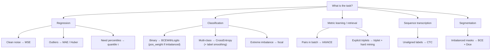
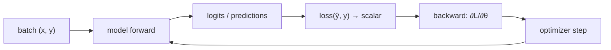
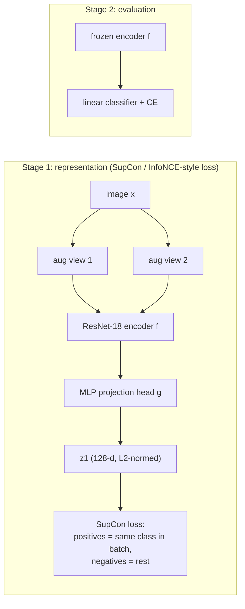

# 2.4 — Loss Functions

## 1. Overview

**What is it?** A loss function converts a model's predictions and the ground-truth targets into a single scalar number that measures "how wrong" the model currently is. Training a neural network means minimizing that scalar with [gradient descent](../phase-1-classical-ml/03-gradient-descent.md) via [backpropagation](02-backpropagation.md).

**Why does it exist?** Gradient-based optimization needs a differentiable objective. The loss *is* the objective: it defines what "wrong" looks like, and therefore what the model will learn to do. Choose the wrong loss and no architecture, optimizer, or dataset size will save you — the model will faithfully optimize the wrong thing.

**What problem does it solve?** It translates a task (regress a price, classify an image, rank documents, align embeddings, transcribe speech) into a differentiable function of the model's outputs. Most standard losses are not arbitrary: they arise as **negative log-likelihoods** of a probabilistic model of the data, so choosing a loss is really choosing your assumptions about the noise and structure of the task.

**Where is it used?** Every training run, without exception. Beyond the defaults, loss *design* is a core research and production skill: focal loss unlocked one-stage object detection, InfoNCE unlocked CLIP-style multimodal pretraining, and next-token cross-entropy (plus KL-regularized preference losses) trains every modern LLM.

## 2. Learning Objectives

After this chapter you will be able to:

- Explain the role of the loss in the training loop and its relationship to maximum likelihood estimation (MLE).
- Derive MSE from Gaussian MLE and MAE from Laplace MLE, and explain what each implies about outliers.
- Choose among MSE, MAE, Huber, and quantile (pinball) loss for regression, with justification.
- Derive binary cross-entropy from the Bernoulli likelihood and show its logit gradient is $\sigma(z) - y$.
- Explain why cross-entropy beats MSE for classification (gradient behavior, probabilistic grounding).
- Implement numerically stable losses (`BCEWithLogits`, log-sum-exp) and explain the instability they prevent.
- Explain focal loss, label smoothing, and class weighting as responses to imbalance and overconfidence.
- Write and reason about contrastive objectives: triplet loss and InfoNCE (the CLIP/SimCLR loss), including the role of temperature.
- Describe what CTC loss solves (alignment-free sequence transcription) and what Dice/IoU losses solve (segmentation imbalance).
- Define KL divergence and its uses in distillation, VAEs, and RLHF regularization.
- Diagnose training failures caused by loss misconfiguration (wrong reduction, missing `pos_weight`, double sigmoid).
- Design a composite loss for a multi-task system and balance its terms.

## 3. Prerequisites

| Chapter | Why you need it |
|---------|-----------------|
| [Probability & Statistics](../phase-0-prerequisites/04-probability-statistics.md) | Losses are negative log-likelihoods; KL divergence and MLE live here. |
| [Calculus](../phase-0-prerequisites/03-calculus.md) | Loss gradients seed the backward pass. |
| [Gradient Descent](../phase-1-classical-ml/03-gradient-descent.md) | The loss is what gradient descent minimizes. |
| [Logistic Regression](../phase-1-classical-ml/04-logistic-regression.md) | BCE was introduced there; this chapter generalizes it. |
| [Backpropagation](02-backpropagation.md) | The softmax+CE shortcut $\hat{\mathbf p}-\mathbf y$ is derived there and used everywhere here. |
| [Activation Functions](03-activations.md) | Output activations must match losses (sigmoid↔BCE, softmax↔CE). |

Evaluation *metrics* (accuracy, AUC, F1) — which are related to but distinct from losses — are covered in [Evaluation Metrics](../phase-1-classical-ml/14-evaluation-metrics.md).

## 4. Intuition

The loss is the model's **grading rubric**. Neural networks are relentless rubric-optimizers: they learn exactly what the rubric rewards, including its loopholes. If the rubric says "big errors are catastrophically bad" (MSE squares errors), the model becomes obsessed with the worst cases — including outliers that may just be data-entry mistakes. If it says "all errors count the same per unit" (MAE), the model calmly aims for the median and lets rare extreme cases miss.

**Analogy — grading exams.** Three teachers grade the same essay-length answers. Teacher MSE deducts the *square* of every point missed: students play ultra-safe, terrified of one disastrous answer. Teacher MAE deducts points linearly: students accept an occasional bad answer if their typical answer is solid. Teacher Huber deducts quadratically for small misses (encouraging precision) but linearly beyond a threshold (not letting a single disaster dominate the grade). Same students, same answers — different rubric, different learned behavior.

**Everyday story — the delivery app.** You predict delivery times. Most orders take 25–35 minutes, but occasionally a courier's motorbike breaks down and an order takes 3 hours. Trained with MSE, your model inflates *every* estimate by several minutes, because one 3-hour outlier squared outweighs hundreds of accurate predictions. Trained with MAE or Huber, the model predicts the typical case well and treats breakdowns as the anomalies they are. And if the business asks "give me a time you'll beat 90% of the time," that's not a mean or a median — it's the 90th percentile, and there is a loss precisely for it (quantile loss with $\tau = 0.9$).

The deepest intuition: **most losses are disguised probability statements.** Minimizing MSE = assuming Gaussian noise and maximizing likelihood. Minimizing cross-entropy = maximizing the likelihood of the true labels under your predicted distribution. When you pick a loss, you are declaring a belief about how your data was generated.

## 5. Real-world Motivation

- **Meta (FAIR)** invented **focal loss** for RetinaNet (2017) because one-stage detectors drowned in easy background examples; downweighting easy examples let a single-stage detector match two-stage accuracy. Focal loss remains standard in production detection stacks.
- **OpenAI's CLIP** was trained on 400M image–text pairs with a symmetric **InfoNCE** contrastive loss — the loss design, more than the architecture, is what made web-scale multimodal pretraining work. The same family (NT-Xent) powers Google's SimCLR self-supervised vision models.
- **Every LLM** — GPT (OpenAI), LLaMA (Meta), Gemini (Google) — is pretrained with token-level **cross-entropy** (next-token prediction), typically with label smoothing in earlier seq2seq systems; alignment stages (RLHF/DPO) add **KL-divergence** terms to keep the tuned model close to the base model.
- **Google's** production speech systems historically used **CTC loss** to train transcription models without frame-level alignments; **label smoothing** shipped in Inception and became standard in vision and machine translation.
- **Amazon's** demand forecasting (e.g., the DeepAR line of work) and retail forecasting systems widely use **quantile loss** because inventory decisions need "P90 demand," not average demand.
- **Netflix, Google, Microsoft** ranking systems use pairwise/listwise ranking losses (LambdaRank lineage) because the business metric is ordering quality, not pointwise accuracy.

## 6. Mathematical Foundations

Notation used throughout: $y$ = target, $\hat y$ = predicted value, $z$ = logit (pre-activation), $\hat p$ = predicted probability, $n$/$B$ = number of examples, $K$ = number of classes, $\sigma$ = sigmoid, $\tau$ = quantile level or temperature (context-dependent), $\gamma$ = focal exponent, $m$ = margin, $\epsilon$ = smoothing constant.

### 6.1 Regression losses

**MSE (L2).**

$$
L_{\mathrm{MSE}} = \frac{1}{n}\sum_{i=1}^{n}(y_i - \hat y_i)^2, \qquad \frac{\partial L}{\partial \hat y_i} = \frac{2}{n}(\hat y_i - y_i).
$$

*Derivation from Gaussian MLE*: assume $y_i = \hat y_i + \varepsilon_i$, $\varepsilon_i \sim \mathcal N(0, \sigma^2)$. The negative log-likelihood is

$$
-\log \prod_i \frac{1}{\sqrt{2\pi}\sigma} e^{-\frac{(y_i-\hat y_i)^2}{2\sigma^2}}
= \frac{1}{2\sigma^2}\sum_i (y_i - \hat y_i)^2 + \text{const},
$$

so minimizing MSE = maximizing likelihood under Gaussian noise. The minimizer of expected MSE is the **conditional mean** $\mathbb E[y\mid x]$. Squaring makes outliers dominate: one error of 10 costs as much as one hundred errors of 1.

**MAE (L1).**

$$
L_{\mathrm{MAE}} = \frac{1}{n}\sum_i |y_i - \hat y_i|, \qquad \frac{\partial L}{\partial \hat y_i} = \frac{1}{n}\,\mathrm{sign}(\hat y_i - y_i).
$$

The Laplace-noise MLE; its minimizer is the **conditional median** — hence robustness to outliers. Drawback: constant gradient magnitude even near the optimum (harder fine convergence), and non-differentiable at 0.

**Huber** (smooth blend, threshold $\delta$):

$$
L_\delta(r) = \begin{cases} \tfrac{1}{2}r^2 & |r| \le \delta \\ \delta\big(|r| - \tfrac{1}{2}\delta\big) & |r| > \delta \end{cases}, \qquad r = y - \hat y.
$$

Quadratic (MSE-like) for small residuals, linear (MAE-like) beyond $\delta$: precise near the target, robust far away. PyTorch's `SmoothL1Loss` is the $\delta{=}1$ variant used for bounding-box regression.

**Quantile (pinball) loss** for quantile $\tau \in (0,1)$:

$$
L_\tau(y, \hat y) = \max\big(\tau\,(y-\hat y),\; (\tau - 1)(y - \hat y)\big).
$$

Asymmetric: for $\tau = 0.9$, under-prediction costs 9× more than over-prediction, so the minimizer is the 90th percentile of $y \mid x$. Train several $\tau$'s to get prediction intervals (probabilistic forecasting).

**Log-cosh**: $\sum_i \log\cosh(\hat y_i - y_i)$ — behaves like MSE near 0 and MAE far away, but is twice-differentiable everywhere (a smooth Huber).

### 6.2 Classification losses

**Binary cross-entropy (BCE).** Model $y \sim \mathrm{Bernoulli}(\hat p)$ with $\hat p = \sigma(z)$. The negative log-likelihood of one example:

$$
L_{\mathrm{BCE}} = -\big[y\log\hat p + (1-y)\log(1-\hat p)\big], \qquad \frac{\partial L}{\partial z} = \hat p - y = \sigma(z) - y .
$$

The gradient derivation: $\partial L/\partial \hat p = -y/\hat p + (1-y)/(1-\hat p)$, and $\partial\hat p/\partial z = \hat p(1-\hat p)$; the product telescopes to $\hat p - y$. Clean, never-vanishing-when-wrong — the reason BCE beats MSE for classification (with sigmoid + MSE, the $\sigma'(z)$ factor kills the gradient exactly when the model is confidently wrong).

**Numerical stability.** Computing $\log(\sigma(z))$ naively overflows. The fused form used by `BCEWithLogitsLoss`:

$$
L(z, y) = \max(z, 0) - yz + \log\big(1 + e^{-|z|}\big),
$$

which never exponentiates a positive number. Always prefer the `WithLogits` variant.

**Categorical cross-entropy (CE).** For one-hot target $\mathbf y$ and softmax probabilities $\hat{\mathbf p}$:

$$
L_{\mathrm{CE}} = -\sum_{k=1}^{K} y_k \log \hat p_k = -\log\hat p_c, \qquad \frac{\partial L}{\partial \mathbf z} = \hat{\mathbf p} - \mathbf y,
$$

the shortcut derived in [Backpropagation](02-backpropagation.md) §6.5. This is exactly the token-level loss of LLM pretraining (averaged over positions).

**Label smoothing.** Replace the one-hot target with $\tilde{\mathbf y} = (1-\epsilon)\mathbf y + \epsilon/K$ (typical $\epsilon = 0.1$):

$$
L_{\mathrm{LS}} = -(1-\epsilon)\log\hat p_c - \frac{\epsilon}{K}\sum_k \log\hat p_k .
$$

Prevents logits from growing without bound, improves calibration and generalization (Inception, transformers for MT).

**Focal loss** (Lin et al., 2017). Let $p_t = \hat p$ if $y{=}1$ else $1-\hat p$:

$$
L_{\mathrm{focal}} = -(1 - p_t)^{\gamma}\,\log p_t, \qquad \gamma \approx 2 .
$$

The modulating factor $(1-p_t)^\gamma$ downweights well-classified examples: at $p_t = 0.9$ and $\gamma{=}2$, the weight is 0.01 — a 100× reduction — so training focuses on hard examples. Built for extreme foreground/background imbalance in detection; often combined with a class-balance weight $\alpha_t$.

**Hinge loss** (SVM heritage): $\max(0, 1 - y\hat y)$ with $y \in \{-1, +1\}$ — max-margin, zero gradient once the margin is satisfied; see [SVM](../phase-1-classical-ml/11-svm.md).

### 6.3 Metric-learning / contrastive losses

**Triplet loss.** For anchor $a$, positive $p$ (same class), negative $n$ (different class), embedding distance $d$:

$$
L = \max\big(0,\; d(a,p) - d(a,n) + m\big),
$$

with margin $m$. Pulls positives closer than negatives by at least $m$; requires careful **negative mining** (random negatives quickly become too easy; semi-hard mining as in FaceNet).

**InfoNCE / NT-Xent** (SimCLR, CLIP). For a batch of $N$ paired embeddings $(\mathbf u_i, \mathbf v_i)$ (e.g., image and its caption), L2-normalized, with similarity $s_{ij} = \mathbf u_i^\top \mathbf v_j / \tau$:

$$
L_i = -\log \frac{e^{s_{ii}}}{\sum_{j=1}^{N} e^{s_{ij}}} .
$$

A softmax cross-entropy where the "classes" are the other batch elements: match each item with its true partner against $N{-}1$ in-batch negatives. Temperature $\tau$ (≈ 0.05–0.1) sharpens the distribution and controls how much hard negatives are emphasized. CLIP uses the symmetric sum (images→texts and texts→images) with a *learned* temperature. Larger batches = more negatives = better representations, which is why contrastive pretraining uses huge batches.

### 6.4 Sequence and structured losses

**CTC (Connectionist Temporal Classification).** Speech/OCR emit $T$ frames but the transcript has $U \ll T$ tokens with unknown alignment. CTC adds a *blank* symbol and defines the label's probability as the sum over **all alignments** $\pi$ that collapse (dedupe + remove blanks) to the target $\mathbf y$:

$$
L_{\mathrm{CTC}} = -\log \sum_{\pi \in \mathcal B^{-1}(\mathbf y)} \prod_{t=1}^{T} p(\pi_t \mid \mathbf x),
$$

computed tractably in $O(T\,U)$ by a forward–backward dynamic program. It removes the need for hand-aligned data — the historical enabler of end-to-end speech recognition.

**Dice loss** (segmentation). With per-pixel predictions $p_i \in [0,1]$ and ground truth $g_i \in \{0,1\}$:

$$
L_{\mathrm{Dice}} = 1 - \frac{2\sum_i p_i g_i + \varepsilon}{\sum_i p_i + \sum_i g_i + \varepsilon},
$$

a differentiable relaxation of $1 - $ F1 overlap. Robust to extreme class imbalance (a tumor occupying 0.1% of pixels barely moves per-pixel BCE but dominates Dice). Common production recipe: **BCE + Dice**. IoU/Jaccard loss is the analogous relaxation of intersection-over-union; GIoU/DIoU variants serve bounding-box regression.

### 6.5 Distribution-matching losses

**KL divergence.** For distributions $P$ (reference/target) and $Q$ (model):

$$
D_{\mathrm{KL}}(P\,\|\,Q) = \sum_x P(x)\,\log\frac{P(x)}{Q(x)} \;\ge 0,\quad =0 \iff P = Q .
$$

Asymmetric: forward KL ($P$ = data) is mean-seeking; reverse KL is mode-seeking. Relationship to CE: $H(P, Q) = H(P) + D_{\mathrm{KL}}(P\|Q)$ — minimizing cross-entropy w.r.t. $Q$ *is* minimizing KL. Uses: **knowledge distillation** (student matches teacher's temperature-softened distribution), **VAE** regularization ($D_{\mathrm{KL}}(q(z|x)\,\|\,\mathcal N(0,I))$, [Autoencoders](11-autoencoders.md)), and **RLHF/DPO** penalties keeping a tuned LLM near its reference model. Adversarial (GAN) losses, which pit a generator against a discriminator, are covered in [GANs](12-gan.md).

## 7. Visual Explanation

Loss vs residual for the regression family, and loss vs $p_t$ for the classification family:

```
 Regression: L(r), r = y − ŷ            Classification: L(p_t)
                                          │
  L │ MSE: r²      MAE: |r|              4│\  CE = −log p_t
    │   \    ∙    /                       │ \
    │    \   ∙   /      Huber:            │  \        focal (γ=2):
    │     \  ∙  /       parabola core,   2│   \       (1−p_t)²·CE — flattened
    │      \ ∙ /        linear arms       │    \___   for easy examples
    │       \∙/                           │        ‾‾──__
    └────────┴──────── r                 0└──────────────── p_t
             0                             0      0.5      1
```

Choosing a loss is a decision tree:



And where the loss sits in the training loop — it is the *seed* of backprop:



## 8. Algorithm

**Selecting and wiring a loss:**

1. **Identify the output type** and its natural noise/probability model: continuous value (Gaussian → MSE; Laplace → MAE), probability (Bernoulli → BCE), category (categorical → CE), set overlap (Dice), ordering (ranking losses), embedding geometry (contrastive).
2. **Audit the data**: outliers → robust losses (Huber/MAE); class imbalance → `pos_weight`, class weights, focal, or Dice; label noise → label smoothing.
3. **Use the numerically stable fused variant** operating on logits (`BCEWithLogitsLoss`, `CrossEntropyLoss`), never hand-composed sigmoid/softmax + log.
4. **Check the reduction** (`mean` vs `sum`): it rescales the gradient and therefore the effective learning rate; `mean` is the default that keeps LR comparable across batch sizes.
5. **Sanity-check at init**: CE should start near $\ln K$; BCE near $\ln 2 \approx 0.693$ for balanced data.
6. **For composite losses**, weight the terms so their gradient magnitudes are comparable; tune or learn the weights (Section 18).

```text
PSEUDOCODE: one training step with a stable loss
  z  = model(x)                       # logits — NO output activation
  L  = loss_with_logits(z, y)         # fused, stable; 'mean' reduction
  assert isfinite(L)                  # catch NaN/inf immediately
  zero_grad(); L.backward()           # seeds backprop with ∂L/∂z
  clip_grad_norm(params, 1.0)         # optional insurance
  optimizer.step()
```

## 9. Worked Example

### 9.1 By hand: MSE vs MAE under an outlier

Targets $y = [10, 12, 11, 50]$ (the 50 is a data glitch); candidate constant predictions $\hat y = 12$ vs $\hat y = 20$:

| Prediction | MSE $= \frac{1}{4}\sum r^2$ | MAE $= \frac{1}{4}\sum\lvert r\rvert$ |
|---|---|---|
| $\hat y = 12$ (near the typical value) | $(4 + 0 + 1 + 1444)/4 = 362.25$ | $(2+0+1+38)/4 = 10.25$ |
| $\hat y = 20$ (dragged toward outlier) | $(100+64+81+900)/4 = 286.25$ | $(10+8+9+30)/4 = 14.25$ |

MSE *prefers* the distorted prediction 20 (286 < 362) — the squared outlier dominates. MAE prefers 12 (10.25 < 14.25), staying with the typical data. One tiny table, the entire robustness story.

### 9.2 By hand: BCE gradient

$y = 1$, logit $z = -2$ (model leans wrong): $\hat p = \sigma(-2) = 0.119$, so $L = -\log 0.119 = 2.13$ and $\partial L/\partial z = \hat p - y = -0.881$ — a large corrective push. Now $z = +4$ (confidently right): $\hat p = 0.982$, $L = 0.018$, gradient $-0.018$ — nearly done, nearly no push. The gradient magnitude *is* the error. Compare sigmoid + MSE at $z = -2$: gradient $= 2(\hat p - y)\hat p(1-\hat p) = 2(-0.881)(0.105) = -0.185$ — almost 5× weaker exactly when the model most needs correcting.

### 9.3 By hand: focal reweighting

Two positives with $\hat p = 0.9$ (easy) and $\hat p = 0.1$ (hard), $\gamma = 2$:

| Example | BCE $=-\log \hat p$ | Focal $=(1-\hat p)^2 \cdot$ BCE | Hard/easy ratio |
|---|---|---|---|
| easy ($\hat p = 0.9$) | 0.105 | $0.01 \times 0.105 = 0.00105$ | BCE: 22× |
| hard ($\hat p = 0.1$) | 2.303 | $0.81 \times 2.303 = 1.865$ | focal: **1776×** |

With 1000 easy backgrounds per hard object (a detector's reality), BCE's total is dominated by the easy pile; focal's is dominated by the hard example — that reweighting is why RetinaNet worked.

### 9.4 Realistic scale

An LLM pretraining step is exactly Section 6.2's CE, applied at every token position: logits of shape (batch × sequence, vocab) against next-token targets, mean-reduced. GPT-class models report progress in this loss (or its exponential, perplexity); a drop from 3.0 to 2.9 nats/token is a meaningful capability improvement at scale.

## 10. Python from Scratch

The essential zoo in NumPy, with stability handled properly:

```python
import numpy as np

# ---------- regression ----------
def mse(y, p):  return ((y - p) ** 2).mean()
def mae(y, p):  return np.abs(y - p).mean()

def huber(y, p, delta=1.0):
    r = y - p
    a = np.abs(r)
    quad = 0.5 * r**2                      # used where |r| <= delta
    lin  = delta * (a - 0.5 * delta)       # used where |r| >  delta
    return np.where(a <= delta, quad, lin).mean()

def quantile(y, p, tau=0.9):
    r = y - p                              # under-prediction → r > 0 costs tau·r
    return np.maximum(tau * r, (tau - 1) * r).mean()

# ---------- classification (on LOGITS, stable) ----------
def bce_with_logits(y, z):
    # max(z,0) − y·z + log(1 + exp(−|z|)) : never exponentiates a positive number
    return (np.maximum(z, 0) - y * z + np.log1p(np.exp(-np.abs(z)))).mean()

def cross_entropy(z, labels):
    # z: (n, K) logits; labels: (n,) integer classes
    z = z - z.max(axis=1, keepdims=True)             # log-sum-exp shift
    log_p = z - np.log(np.exp(z).sum(axis=1, keepdims=True))
    return -log_p[np.arange(len(labels)), labels].mean()

def label_smoothing_ce(z, labels, eps=0.1):
    z = z - z.max(axis=1, keepdims=True)
    log_p = z - np.log(np.exp(z).sum(axis=1, keepdims=True))
    n, K = z.shape
    nll     = -log_p[np.arange(n), labels]           # weight (1−eps) on true class
    uniform = -log_p.mean(axis=1)                    # weight eps spread over all K
    return ((1 - eps) * nll + eps * uniform).mean()

def focal(y, p, gamma=2.0, eps=1e-7):
    p  = np.clip(p, eps, 1 - eps)                    # guard log(0)
    pt = np.where(y == 1, p, 1 - p)                  # prob. assigned to the true class
    return (-(1 - pt) ** gamma * np.log(pt)).mean()

# ---------- contrastive ----------
def info_nce(u, v, temp=0.07):
    # u, v: (n, d) L2-normalized paired embeddings (u[i] matches v[i])
    s = u @ v.T / temp                               # (n, n) similarity matrix
    s = s - s.max(axis=1, keepdims=True)             # stability shift
    log_p = s - np.log(np.exp(s).sum(axis=1, keepdims=True))
    return -log_p[np.arange(len(u)), np.arange(len(u))].mean()  # diagonal = positives

# ---------- distribution ----------
def kl_div(p, q, eps=1e-12):
    p, q = np.clip(p, eps, 1), np.clip(q, eps, 1)
    return (p * (np.log(p) - np.log(q))).sum(axis=-1).mean()

# quick check: CE at init ≈ ln K
z = np.zeros((8, 10)); labels = np.arange(8) % 10
print(cross_entropy(z, labels))          # expected: 2.302585 (= ln 10)
```

Block notes: every classification loss takes **logits** and does the log-sum-exp shift internally — the from-scratch analogue of `WithLogits`; `focal` clips probabilities to dodge $\log 0$; `info_nce` is literally `cross_entropy` on a similarity matrix whose correct "class" for row $i$ is column $i$. All are $O(n)$ per example ($O(nK)$ for CE over $K$ classes, $O(n^2 d)$ for InfoNCE's similarity matrix). 

> [!WARNING]
> **Common bug**: implementing BCE as `-(y*np.log(p) + (1-y)*np.log(1-p))` on probabilities from a saturated sigmoid. When `p` rounds to exactly 1.0 in float32, `log(1-p)` = `log(0)` = `-inf`, and one example NaNs the whole batch. The logits form above cannot produce this.

## 11. Library Implementation

PyTorch's loss layer, with the flags that matter in production:

```python
import torch
import torch.nn as nn
import torch.nn.functional as F

# ---------- regression ----------
mse   = nn.MSELoss()                       # mean reduction by default
mae   = nn.L1Loss()
huber = nn.HuberLoss(delta=1.0)            # SmoothL1Loss = Huber with delta=1

# ---------- binary classification: ALWAYS the logits version ----------
bce = nn.BCEWithLogitsLoss(
    pos_weight=torch.tensor([5.0]))        # 5× weight on positives → fixes 1:5 imbalance
z, y = torch.randn(16, 1), torch.randint(0, 2, (16, 1)).float()
loss = bce(z, y)                           # stable log-sum-exp inside

# ---------- multi-class ----------
ce = nn.CrossEntropyLoss(
    label_smoothing=0.1,                   # smoothed targets, built in
    weight=None,                           # optional per-class weights (K,)
    ignore_index=-100)                     # skip padding positions (seq models)
logits  = torch.randn(16, 10)              # raw logits — no softmax!
targets = torch.randint(0, 10, (16,))      # integer class labels, NOT one-hot
loss = ce(logits, targets)                 # ≈ 2.4 at random init (ln 10 + smoothing)

# ---------- LLM-style next-token loss ----------
B, T, V = 4, 128, 50257
lm_logits  = torch.randn(B, T, V)
lm_targets = torch.randint(0, V, (B, T))
lm_loss = F.cross_entropy(                 # flatten positions into the batch dim
    lm_logits.view(B * T, V), lm_targets.view(B * T), ignore_index=-100)

# ---------- metric / sequence / distribution ----------
triplet = nn.TripletMarginLoss(margin=1.0)     # (anchor, positive, negative) embeddings
ctc     = nn.CTCLoss(blank=0)                  # log-probs (T, B, C) + unaligned targets
kl      = nn.KLDivLoss(reduction="batchmean")  # expects log-probs as input, probs as target
student_logp = F.log_softmax(logits / 2.0, dim=-1)      # temperature-softened
teacher_p    = F.softmax(torch.randn(16, 10) / 2.0, dim=-1)
distill = kl(student_logp, teacher_p)          # knowledge-distillation term
```

Key lines: `pos_weight` multiplies the positive-class term — the one-flag fix for imbalance; `CrossEntropyLoss` wants **integer labels and raw logits** (it fuses log-softmax + NLL); `ignore_index` masks padding so it contributes zero loss and zero gradient; `KLDivLoss` expects **log**-probabilities for the input distribution and probabilities for the target — the single most misused signature in PyTorch losses.

## 12. Code Walkthrough

Tracing the LLM-style loss above:

| Tensor | Shape | Meaning |
|--------|-------|---------|
| `lm_logits` | (4, 128, 50257) | per-position vocabulary scores |
| `lm_logits.view(B*T, V)` | (512, 50257) | positions flattened into a batch of 512 "examples" |
| `lm_targets.view(B*T)` | (512,) | next-token index per position; `-100` where padded |
| internal `log_softmax` | (512, 50257) | stable log-probabilities |
| gathered NLL | (512,) | $-\log\hat p_{\text{target}}$ per position |
| `lm_loss` | () | mean over non-ignored positions |

**Expected results**: at random init, `lm_loss` ≈ $\ln 50257 \approx 10.8$; a well-trained small GPT reaches ~3.0 on TinyShakespeare-class data. During the backward pass, the gradient at the logits is $(\hat{\mathbf p} - \mathbf y)/N_{\text{valid}}$ — verify with `lm_logits.retain_grad()`. For the BCE example: initial loss ≈ 0.693 ($\ln 2$); with `pos_weight=5`, positive examples contribute 5× the gradient, so expect recall to rise and precision to fall — the intended trade.

## 13. Complexity Analysis

**Time.** Elementwise losses (MSE/MAE/Huber/BCE) are $O(n)$ for $n$ predictions. Softmax CE is $O(nK)$ — for LLMs with $K \sim 10^5$, computing the loss over (B·T) positions is a *material* fraction of step time and memory, motivating fused/chunked CE kernels. InfoNCE costs $O(N^2 d)$ for the batch similarity matrix ($N$ = batch size, $d$ = embedding dim) — quadratic in batch, which is the price of in-batch negatives. CTC's forward–backward is $O(T \cdot U)$ per sequence ($T$ frames, $U$ target length).

**Space.** Reductions leave $O(1)$ outputs, but backward needs the per-element intermediates: CE keeps the (n, K) log-prob tensor — for a (4, 4096, 128k) LLM batch in fp32, the probability tensor alone is ~8 GB, which is exactly why chunked-CE implementations exist. InfoNCE stores the $O(N^2)$ similarity matrix.

## 14. Advantages

(Of understanding and choosing losses deliberately — with concrete wins:)

- **Correct probabilistic grounding** → calibrated outputs: BCE/CE-trained classifiers output usable probabilities, which downstream thresholding and business logic depend on (ads pCTR systems are consumed *as probabilities*).
- **Robustness on demand**: switching MSE → Huber for delivery-time or house-price regression contains outlier damage without discarding data.
- **Imbalance is fixable in the loss**: `pos_weight`, focal, and Dice rescue tasks (fraud at 1:10,000, tumors at 0.1% of pixels) that are hopeless under vanilla BCE.
- **Task-shaped objectives**: quantile loss gives Amazon-style P90 forecasts; InfoNCE turns unlabeled pairs into representations (CLIP, SimCLR); CTC removes the need for aligned transcripts entirely.
- **Regularization for free**: label smoothing costs one flag and reliably improves calibration and generalization in vision and MT.
- **Cheap to iterate**: changing the loss changes no architecture and adds ~zero compute — the highest-leverage/lowest-cost knob in the training stack.

## 15. Disadvantages

- **Loss–metric mismatch**: you optimize CE but ship accuracy/F1/AUC/NDCG; the proxy can diverge from the goal (a model can lower CE by improving confidence on already-correct examples while F1 stalls). Ranking metrics are non-differentiable, forcing surrogate losses whose gap is real.
- **Robust losses discard signal**: MAE's constant gradient slows fine convergence near the optimum; a badly chosen Huber $\delta$ behaves like the worse of both parents.
- **Focal loss adds hyperparameters** ($\gamma$, $\alpha$) and can *underweight* genuinely informative easy examples early in training; it also degrades calibration.
- **Contrastive losses demand batch/mining engineering**: InfoNCE quality tracks the number of negatives (hence 32k batches for CLIP); triplet loss collapses without hard-negative mining.
- **Composite losses fight each other**: multi-task terms with mismatched scales let one task's gradient drown the others; weights need tuning or uncertainty-based learning.
- **Numerical traps everywhere**: log(0), exp overflow, wrong reduction silently rescaling the learning rate — losses fail quietly, not loudly.

## 16. Common Mistakes

- **Applying sigmoid before `BCEWithLogitsLoss`** (double sigmoid) or **softmax before `CrossEntropyLoss`** (double softmax) — training limps but doesn't crash. *Avoid*: model outputs raw logits; the fused loss owns the activation.
- **MSE for classification** — gradient $(\hat p - y)\sigma'(z)$ vanishes on confidently wrong predictions, plus no probabilistic meaning. *Avoid*: CE/BCE, full stop.
- **Ignoring class imbalance** — 99% negatives → the model predicts "negative" everywhere and BCE looks fine. *Avoid*: `pos_weight`/class weights/focal; monitor per-class recall, not just loss.
- **`reduction='sum'` with a LR tuned for `'mean'`** — the gradient scales by batch size; doubling the batch doubles the effective LR and can diverge. *Avoid*: stick with `mean` unless you know why.
- **Forgetting `ignore_index` on padded sequences** — the model learns to predict padding tokens beautifully. *Avoid*: mask padding in every sequence loss.
- **`KLDivLoss` fed probabilities instead of log-probabilities** — silently wrong values. *Avoid*: `F.log_softmax` on the input side; read the signature twice.
- **`log(softmax(z))` or unclamped `log(p)`** — `-inf`/NaN on saturated outputs. *Avoid*: fused/stable forms; `assert torch.isfinite(loss)` in the training loop.
- **Triplet training with random negatives only** — loss goes to ~0 while embeddings stay mediocre (all triplets satisfied trivially). *Avoid*: semi-hard/hard mining, or switch to InfoNCE with big batches.

## 17. Best Practices

- [ ] Output **logits** from the model; use fused stable losses (`BCEWithLogitsLoss`, `CrossEntropyLoss`).
- [ ] Verify initial loss: $\ln K$ for K-class CE, $\ln 2$ for balanced BCE — deviations mean wiring bugs.
- [ ] Audit label balance before choosing: imbalance → `pos_weight` → focal → Dice (in escalating order of intervention).
- [ ] Match regression loss to noise: plot the residual histogram; heavy tails → Huber/MAE; need intervals → quantile.
- [ ] Use `label_smoothing=0.1` as a cheap default for large-scale multi-class training.
- [ ] Mask padding (`ignore_index=-100`) in all sequence losses.
- [ ] Track the *business metric* alongside the loss on validation — divergence between them is a design smell.
- [ ] `assert torch.isfinite(loss)` every step; log per-task loss components separately in composite objectives.
- [ ] For contrastive training: L2-normalize embeddings, tune (or learn) temperature, and maximize effective batch size.
- [ ] Unit-test custom losses: analytic gradient vs `torch.autograd.gradcheck`, plus known-value tests (e.g., CE of uniform logits = $\ln K$).

## 18. Optimization Techniques

- **Loss scaling for mixed precision**: in fp16, small gradients underflow; scale the loss up before backward and unscale before the step (`torch.cuda.amp.GradScaler`) — mandatory for fp16 training.
- **Fused/chunked cross-entropy**: fuse log-softmax + gather + reduction into one kernel, or compute CE over vocabulary chunks to avoid materializing (B·T, V) probability tensors — standard in LLM stacks (e.g., chunked CE in modern trainers).
- **Multi-task weighting**: balance $L = \sum_k w_k L_k$ by (a) normalizing gradient magnitudes, (b) uncertainty weighting (Kendall & Gal, 2018): $L = \sum_k \frac{1}{2\sigma_k^2} L_k + \log\sigma_k$ with learned $\sigma_k$, or (c) GradNorm-style dynamic tuning.
- **Curriculum on the loss**: warm up with the stable term (e.g., BCE) before enabling the aggressive one (focal, adversarial) to avoid early collapse.
- **In-batch negatives + cross-device gathering**: for InfoNCE, all-gather embeddings across GPUs to multiply negatives without extra forward passes (how CLIP reaches ~32k effective batch).
- **Label smoothing + logit penalties** as overconfidence control: cheaper than temperature-scaling post-hoc when calibration matters.
- **Reduction discipline**: prefer `mean`; when accumulating gradients over micro-batches, divide each micro-batch loss by the accumulation count to preserve scale.

## 19. Industry Applications

- **LLM pretraining and alignment** (OpenAI, Meta, Google, Anthropic): token-level CE at trillion-token scale; RLHF/DPO objectives add KL-to-reference penalties so the aligned model doesn't drift from the pretrained one.
- **Object detection** (Meta's RetinaNet lineage; production AV/robotics perception): focal loss for classification + Smooth L1/GIoU for boxes remains the standard head recipe.
- **Multimodal retrieval and search** (OpenAI CLIP, Google ALIGN): symmetric InfoNCE over web-scale image–text pairs; the same loss family powers text-embedding models behind semantic search and RAG systems.
- **Speech and OCR** (Google, Amazon, Microsoft): CTC (and its successors like RNN-T, a related alignment-summing loss) trains transcription without frame alignments.
- **Medical and satellite segmentation** (hospital ML vendors, mapping teams): BCE + Dice hybrids handle sub-percent foreground ratios in tumor and land-cover masks.
- **Forecasting and inventory** (Amazon's DeepAR-style systems): quantile losses produce the P10/P50/P90 curves that purchasing decisions actually consume.
- **Face/identity systems**: FaceNet's triplet loss with semi-hard mining defined modern face embeddings; successors (ArcFace's margin-softmax) are refined classification losses.

## 20. Interview Questions

### Beginner

**Q: What is a loss function and how does it differ from an evaluation metric?**
A: The loss is the differentiable scalar objective the optimizer minimizes during training; the metric (accuracy, F1, AUC) is what stakeholders judge, and is often non-differentiable. We optimize a loss as a *surrogate* for the metric — e.g., CE as a surrogate for accuracy — and must monitor both, since they can diverge.

**Q: Why not use MSE for classification?**
A: Two reasons. (1) Gradient: with a sigmoid output, $\partial L_{MSE}/\partial z = 2(\hat p - y)\,\hat p(1-\hat p)$ — the $\sigma'$ factor vanishes when the model is confidently *wrong*, exactly when learning is most needed; BCE's gradient $\hat p - y$ never does. (2) Probabilistic: BCE is the Bernoulli negative log-likelihood, giving outputs a calibrated meaning; MSE assumes Gaussian noise on a 0/1 variable, which is wrong.

**Q: When would you choose MAE or Huber over MSE?**
A: When residuals have outliers/heavy tails. MSE's squaring lets one outlier dominate the fit (it targets the conditional mean); MAE targets the median and is robust but has constant gradients that slow fine convergence; Huber interpolates — quadratic within $\delta$, linear beyond — giving precision on clean data and robustness on outliers.

**Q: What does `BCEWithLogitsLoss` do that sigmoid + `BCELoss` doesn't?**
A: It fuses the sigmoid and the log into the stable form $\max(z,0) - yz + \log(1+e^{-|z|})$, which never overflows or hits $\log(0)$. Separately, a saturated sigmoid ($p = 1.0$ in float) makes $\log(1-p) = -\infty$ → NaN loss.

**Q: What is label smoothing and why use it?**
A: Replace the one-hot target with $(1-\epsilon)\mathbf y + \epsilon/K$. The model is never asked for infinite logits, which bounds logit growth, improves calibration, and typically improves generalization; standard in vision (Inception) and MT transformers with $\epsilon = 0.1$.

### Intermediate

**Q: Derive BCE from maximum likelihood.**
A: Model $y \sim \mathrm{Bernoulli}(\hat p)$: $P(y|\hat p) = \hat p^y (1-\hat p)^{1-y}$. The negative log-likelihood over the dataset is $-\sum_i [y_i\log\hat p_i + (1-y_i)\log(1-\hat p_i)]$ — exactly BCE. So minimizing BCE = maximizing the probability of the observed labels; the same argument gives categorical CE from the multinomial likelihood.

**Q: Explain focal loss: formula, mechanism, hyperparameters.**
A: $L = -\alpha_t(1-p_t)^\gamma \log p_t$, where $p_t$ is the probability assigned to the true class. The factor $(1-p_t)^\gamma$ downweights easy examples — at $p_t{=}0.9,\gamma{=}2$ the weight is 0.01 — so a flood of easy negatives (detection backgrounds, ~1000:1) can't drown the rare hard positives. $\gamma$ (typically 2) controls focusing strength; $\alpha_t$ adds class balancing. Introduced for RetinaNet, where it let one-stage detectors match two-stage accuracy.

**Q: What's the difference between triplet loss and InfoNCE?**
A: Triplet compares one positive against **one** negative per update with a margin: $\max(0, d_{ap} - d_{an} + m)$ — needs explicit mining to find informative negatives. InfoNCE is a softmax CE of one positive against **all in-batch negatives**: $-\log\frac{e^{s_{ii}/\tau}}{\sum_j e^{s_{ij}/\tau}}$ — every batch element is a negative for every other, giving thousands of "free" negatives and smoother optimization; temperature $\tau$ modulates hard-negative emphasis. Modern contrastive systems (SimCLR, CLIP) use InfoNCE.

**Q: What problem does CTC loss solve and how?**
A: Sequence transcription where input length $T$ (audio frames) ≫ output length $U$ (characters) with unknown alignment. CTC introduces a blank token and maximizes the total probability of *all* frame-level alignments that collapse to the target string, summed by a forward–backward dynamic program in $O(TU)$. This removes the need for hand-aligned training data — the enabler of end-to-end speech and OCR.

**Q: Why does the choice of `reduction` (mean vs sum) matter?**
A: The gradient scales with the reduction: `sum` makes the gradient $B$ times larger than `mean`, so the effective learning rate silently multiplies by batch size — change batch size and training diverges or crawls. `mean` decouples LR from batch size and is the sane default; `sum` needs deliberate LR compensation.

**Q: How is KL divergence used in knowledge distillation?**
A: The student minimizes $D_{KL}(p_{teacher}^{(T)} \| p_{student}^{(T)})$ between temperature-softened distributions ($T \approx 2$–4), usually mixed with hard-label CE. The softened teacher distribution carries "dark knowledge" — relative probabilities among wrong classes — that hard labels lack; gradients are scaled by $T^2$ to keep magnitudes comparable.

### Advanced

**Q: Forward vs reverse KL — when does each matter?**
A: $D_{KL}(P\|Q)$ (forward, expectation under data $P$) punishes $Q$ for assigning low mass where $P$ has mass → **mean-seeking/mode-covering** (used in MLE: CE is forward KL up to a constant). $D_{KL}(Q\|P)$ (reverse, expectation under the model) punishes $Q$ for putting mass where $P$ has none → **mode-seeking** (variational inference, RLHF penalties where we want the policy to stay within the reference model's support). The asymmetry changes learned behavior qualitatively in multimodal targets.

**Q: Your segmentation target occupies 0.2% of pixels. Compare BCE, weighted BCE, focal, and Dice.**
A: Plain BCE: the 99.8% background dominates; predicting "all background" scores ~0.002 loss — useless. Weighted BCE (`pos_weight≈500`): rebalances but is sensitive to the weight and can explode gradients on noisy positives. Focal: downweights easy background adaptively without a huge fixed weight, but adds $\gamma$ tuning and hurts calibration. Dice: directly optimizes overlap, inherently scale-invariant to class ratio, but has unstable gradients when the predicted mask is near-empty ($\varepsilon$ smoothing needed) and is noisier per-batch. Production answer: **BCE (or focal) + Dice**, summed — the BCE term stabilizes early training, Dice drives the overlap metric.

**Q: Why does InfoNCE need large batches, and how do systems like CLIP get them?**
A: The denominator's negatives define the discrimination task; with few negatives the task is too easy and representations underfit — the InfoNCE bound on mutual information is capped at $\log N$. CLIP used an effective batch ≈ 32k via data parallelism with all-gathered embeddings (each GPU computes similarities against all other GPUs' embeddings); memory-efficient variants (gradient caching) or negative queues (MoCo) approximate large-$N$ without giant batches.

**Q: Design the loss for a model that must output a delivery-time distribution, not a point estimate.**
A: Options: (1) **quantile regression** — predict $\{q_{0.1}, q_{0.5}, q_{0.9}\}$ heads, each with pinball loss (enforce monotonicity architecturally or by penalty); (2) **parametric NLL** — predict $(\mu, \sigma)$ of a Gaussian/log-normal and minimize its negative log-likelihood (heteroscedastic regression), where the learned $\sigma$ also downweights noisy examples; (3) mixture density networks for multimodality. Choose (1) when the business needs specific percentiles (SLAs), (2) when a parametric form is credible; evaluate with CRPS or pinball on held-out data.

**Q: In DPO/RLHF, why is the KL term to the reference model essential?**
A: The reward model (or preference data) is an imperfect proxy learned from limited comparisons; unconstrained maximization finds its exploits ("reward hacking") — degenerate, high-reward-but-bad text. The KL penalty $\beta\, D_{KL}(\pi \| \pi_{ref})$ anchors the policy to the pretrained distribution, trading proxy-reward gains against distributional drift; $\beta$ tunes that trade-off, and DPO bakes the same constraint into a closed-form classification-style loss on preference pairs.

**Q: A custom loss trains but the metric is worse than the baseline's. Diagnose.**
A: Check in order: (1) gradient correctness — `gradcheck` on float64; (2) scale — compare gradient-norm contribution vs the old loss (effective LR shift), retune LR; (3) reduction/masking — padding leaking into the loss; (4) numerical range — clamps/eps silently flattening gradients; (5) loss–metric alignment — the new loss may genuinely optimize something else (e.g., better calibration but worse top-1); log both loss and metric on the *same* validation slice and A/B with fixed seeds.

## 21. Coding Exercises

### Easy

1. **BCE gradient identity.** Show numerically (via `torch.autograd`) that $\partial L_{BCE}/\partial z = \sigma(z) - y$ for random $z, y$. *Hint*: `z.grad` after `backward()`; remember the `mean` reduction divides by $n$.
2. **Loss landscapes.** Plot MSE, MAE, Huber ($\delta \in \{0.5, 1, 2\}$), and log-cosh as functions of the residual on $[-4, 4]$, plus their derivatives. *Hint*: the derivative plot makes the "robustness = bounded gradient" story obvious.

### Medium

1. **Label smoothing from scratch.** Implement smoothed CE manually (no `label_smoothing` flag) and verify it matches `nn.CrossEntropyLoss(label_smoothing=0.1)` to 1e-6. Then train with/without on CIFAR-10 and compare test accuracy *and* calibration (ECE). *Hint*: the smoothed loss = $(1-\epsilon)\cdot\text{NLL} + \epsilon\cdot(\text{mean NLL over all classes})$.
2. **Focal-loss imbalance rescue.** Build a 100:1 imbalanced binary dataset (e.g., subsample MNIST digit 0 vs rest); train identical MLPs with BCE, weighted BCE, and focal ($\gamma \in \{1,2,5\}$); report precision/recall/PR-AUC. *Hint*: judge with PR curves — accuracy is meaningless at 100:1.
3. **Quantile forecaster.** Train a 3-head quantile model ($\tau = 0.1/0.5/0.9$) on a univariate time series (electricity/traffic); verify empirical coverage: ~80% of test targets should fall inside [q10, q90]. *Hint*: pinball loss per head, summed; check for quantile crossing.

### Hard

1. **CTC by hand.** Implement CTC's forward algorithm (dynamic program over the blank-extended target) in NumPy for tiny sequences; verify the loss and its gradient against `nn.CTCLoss` with `gradcheck`-style numerics. *Hint*: work in log-space with log-sum-exp; the DP table has shape (T, 2U+1).
2. **Chunked cross-entropy.** For a (B·T, V) = (8192, 128000) logits tensor, implement CE that processes the vocabulary in chunks so the full probability tensor is never materialized; verify equality with `F.cross_entropy` and measure peak memory. *Hint*: log-sum-exp accumulates across chunks: track running max and running sum.

## 22. Mini Project

**Robust regression bake-off: delivery-time prediction with outliers.**

1. Take a regression dataset (California housing, or a synthetic delivery-time set) and inject outliers into 5% of training targets (multiply by 5–10×).
2. Train the same MLP four times: MSE, MAE, Huber ($\delta{=}1$), log-cosh — identical seeds, LR, epochs.
3. Evaluate on a *clean* test set with both RMSE and MAE; also record each model's error on the outlier subset.
4. Plot residual histograms per loss; observe MSE's shifted center vs MAE/Huber's clean center.
5. Sweep Huber's $\delta$ over {0.1, 0.5, 1, 3, 10} and plot test MAE vs $\delta$ — watch it interpolate between the MAE and MSE results.
6. Write a half-page recommendation: which loss for this pipeline, and why.

## 23. Medium Project

**Multi-task learning with uncertainty-weighted losses.**

1. Pick a dataset with two heads' worth of labels — e.g., NYU Depth V2 (depth regression + semantic segmentation) or a synthetic pair (digit class + rotation angle on rotated MNIST).
2. Build a shared encoder with two task heads; losses: CE (segmentation/classification) + Huber or L1 (regression).
3. Baseline A: equal weights ($L = L_1 + L_2$). Baseline B: manual grid over $w \in \{0.1, 1, 10\}$.
4. Implement uncertainty weighting (Kendall & Gal 2018): $L = \frac{1}{2\sigma_1^2}L_1 + \frac{1}{2\sigma_2^2}L_2 + \log\sigma_1 + \log\sigma_2$ with learnable $\log\sigma_k$; confirm the $\sigma_k$ converge to sensible scales.
5. Compare all three on per-task validation metrics; also log per-task gradient norms on the shared trunk to visualize task competition.
6. Stretch: add GradNorm-style dynamic weighting and compare.

## 24. Advanced Project

**Supervised contrastive learning (SupCon) pipeline on CIFAR-100.**

Architecture: two-stage training — contrastive representation learning, then a linear classifier:



Implementation phases:

1. **Data & augmentation**: SimCLR-style augmentation stack (crop, flip, color jitter, grayscale); each image yields two views.
2. **Loss**: implement the SupCon loss (Khosla et al., 2020) — an InfoNCE generalization where *all* same-class samples in the batch are positives: $L_i = \frac{-1}{|P(i)|}\sum_{p\in P(i)} \log\frac{e^{z_i\cdot z_p/\tau}}{\sum_{a\neq i} e^{z_i\cdot z_a/\tau}}$. Unit-test: with one positive per anchor it must reduce to InfoNCE.
3. **Training**: ResNet-18 + 2-layer projection head, batch ≥ 512 (use gradient accumulation if memory-bound), $\tau = 0.1$, cosine LR, ~200 epochs.
4. **Evaluation**: freeze the encoder, train a linear probe with CE; compare top-1 against (a) end-to-end CE training and (b) self-supervised SimCLR (positives = other view only).
5. **Analysis**: t-SNE/UMAP the embeddings; sweep $\tau \in \{0.05, 0.1, 0.5\}$ and batch size; measure the effect of removing the projection head.
6. **Possible improvements**: memory bank / MoCo-style queue to decouple negatives from batch size; mixed-precision + loss scaling; transfer evaluation on CIFAR-10 to test representation generality.

## 25. Summary

- The loss defines the objective; the model becomes whatever the loss rewards — architecture cannot compensate for a mis-specified objective.
- Most classic losses are negative log-likelihoods: MSE ↔ Gaussian noise (mean), MAE ↔ Laplace (median), BCE ↔ Bernoulli, CE ↔ categorical — choosing a loss = declaring a noise model.
- Regression: MSE for clean data, MAE/Huber for outliers, quantile (pinball) for percentiles and intervals.
- Classification: CE/BCE on **logits** via fused stable implementations; the gradients are the beautiful $\hat p - y$ family.
- Imbalance toolkit, in escalating order: `pos_weight`/class weights → focal loss → Dice (segmentation).
- Label smoothing ($\epsilon{=}0.1$) is a near-free regularizer that also fixes overconfidence.
- Contrastive learning: triplet (one negative, needs mining) vs InfoNCE (all in-batch negatives, temperature-controlled) — InfoNCE trained CLIP and SimCLR.
- CTC sums over all alignments via dynamic programming — transcription without aligned labels.
- KL divergence glues distributions together: distillation, VAEs, and the reference-model anchor in RLHF/DPO.
- Watch the plumbing: reduction scale, `ignore_index`, log-of-zero, `KLDivLoss`'s log-input convention — loss bugs fail silently.
- Composite losses need gradient-scale balancing (manual, uncertainty-based, or GradNorm).
- Always monitor the true evaluation metric next to the loss; they are allies, not synonyms.

## 26. Cheat Sheet

| Loss | Formula | Gradient (wrt logit/pred) | Use |
|------|---------|---------------------------|-----|
| MSE | $\frac1n\sum(y-\hat y)^2$ | $\frac2n(\hat y - y)$ | clean regression (mean) |
| MAE | $\frac1n\sum\lvert y-\hat y\rvert$ | $\frac1n\,\mathrm{sign}(\hat y - y)$ | robust regression (median) |
| Huber | quad ≤ δ, linear > δ | clipped residual | outliers + precision |
| Quantile | $\max(\tau r, (\tau{-}1)r)$ | $-\tau$ or $1{-}\tau$ | percentiles / intervals |
| BCE (logits) | $\max(z,0){-}yz{+}\log(1{+}e^{-\lvert z\rvert})$ | $\sigma(z)-y$ | binary classification |
| CE | $-\log\hat p_c$ | $\hat{\mathbf p}-\mathbf y$ | multi-class, LLM tokens |
| Focal | $-(1{-}p_t)^\gamma\log p_t$ | damped $\hat p - y$ | extreme imbalance |
| Triplet | $\max(0, d_{ap}{-}d_{an}{+}m)$ | margin-active only | metric learning |
| InfoNCE | $-\log\frac{e^{s_{ii}/\tau}}{\sum_j e^{s_{ij}/\tau}}$ | softmax-CE form | contrastive (CLIP/SimCLR) |
| Dice | $1-\frac{2\sum pg+\varepsilon}{\sum p+\sum g+\varepsilon}$ | overlap-driven | imbalanced segmentation |
| KL | $\sum P\log\frac{P}{Q}$ | $-P/Q$ (wrt $Q$) | distillation, VAE, RLHF |

**Defaults**: `CrossEntropyLoss(label_smoothing=0.1)` for multi-class · `BCEWithLogitsLoss(pos_weight=…)` for imbalanced binary · `HuberLoss(delta=1)` for messy regression · $\gamma{=}2$ for focal · $\tau{\approx}0.07$–0.1 and big batches for InfoNCE · `reduction='mean'`.

**One-liners**: logits in, fused loss on · initial CE ≈ ln K · residual histogram before choosing a regression loss · PR-AUC (not accuracy) under imbalance · mask the padding.

**Gotchas**: double sigmoid/softmax · `sum` reduction rescaling your LR · `KLDivLoss` wants log-probs as input · `log(0)` from saturated probabilities · triplet loss at zero ≠ good embeddings (mining!).

## 27. Further Reading

**Books**
- *Deep Learning* — Goodfellow, Bengio, Courville (Ch. 5.5 & 6.2: MLE and output units/losses).
- *Pattern Recognition and Machine Learning* — Bishop (Ch. 1.5–2: decision theory, loss/noise-model correspondence).
- *Probabilistic Machine Learning* — Kevin Murphy (loss functions as likelihoods, calibrated forecasting).

**Research Papers**
- Lin et al. (2017), "Focal Loss for Dense Object Detection" (RetinaNet).
- Szegedy et al. (2016), "Rethinking the Inception Architecture" (label smoothing); Müller et al. (2019), "When Does Label Smoothing Help?"
- Schroff et al. (2015), "FaceNet" (triplet loss + semi-hard mining).
- Oord et al. (2018), "Representation Learning with Contrastive Predictive Coding" (InfoNCE); Chen et al. (2020), "SimCLR"; Radford et al. (2021), "CLIP"; Khosla et al. (2020), "Supervised Contrastive Learning."
- Graves et al. (2006), "Connectionist Temporal Classification."
- Milletari et al. (2016), "V-Net" (Dice loss).
- Hinton et al. (2015), "Distilling the Knowledge in a Neural Network."
- Kendall, Gal & Cipolla (2018), "Multi-Task Learning Using Uncertainty to Weigh Losses."
- Koenker & Bassett (1978), "Regression Quantiles"; Salinas et al. (2020), "DeepAR."
- Rafailov et al. (2023), "Direct Preference Optimization."

**Documentation**
- PyTorch: `torch.nn` loss functions reference (read every constructor flag: `reduction`, `weight`, `pos_weight`, `ignore_index`, `label_smoothing`).

**GitHub Repositories**
- `facebookresearch/detectron2` (focal + box losses in production form) · `openai/CLIP` (symmetric InfoNCE with learned temperature) · `google-research/simclr` · `HobbitLong/SupContrast` (SupCon reference implementation).

**Datasets**
- California Housing (robust regression), CIFAR-10/100 (classification/contrastive), COCO (detection/segmentation losses), LibriSpeech (CTC), electricity/traffic forecasting sets (quantile).

**YouTube/Videos**
- Andrej Karpathy, "Let's build GPT" (cross-entropy in LLM training, hands-on).
- Stanford CS231n, lectures on loss functions and softmax/SVM losses.
- Yannic Kilcher paper walkthroughs: focal loss, CLIP, DPO.

**Blogs**
- CS231n notes, "Linear Classification: Softmax vs SVM losses."
- Lilian Weng, "Contrastive Representation Learning."
- Sebastian Raschka's posts on losses, label smoothing, and LLM training objectives.
