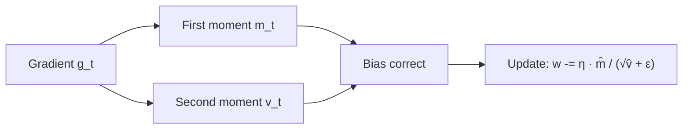

# 2.5 — Optimizers (SGD → Adam → Lion)

## 1. Intuition first
Plain SGD is like walking blindfolded. Momentum gives you memory. Adaptive learning rates (RMSProp, Adam) give each parameter its own step size based on gradient history.

## 2. Why the topic exists
Different losses have different curvature. Ill-conditioned bowls stall SGD; noisy gradients confuse it. Better optimizers converge faster, more robustly, with less tuning.

## 3. What problem it solves
Faster, more stable convergence over huge, non-convex landscapes.

## 4. Mathematics — the important ones

### SGD
$w_{t+1} = w_t - \eta g_t$.

### Momentum (Polyak)
$v_{t+1} = \mu v_t + g_t$; $w_{t+1} = w_t - \eta v_{t+1}$.

### Nesterov
Look ahead: $\hat w = w_t - \eta \mu v_t$; compute grad at $\hat w$; then update.

### AdaGrad
$G_t = G_{t-1} + g_t^2$; $w_{t+1} = w_t - \frac{\eta}{\sqrt{G_t}+\epsilon} g_t$. Per-parameter rate; monotonically decreases.

### RMSProp
$E_t = \rho E_{t-1} + (1-\rho) g_t^2$; $w_{t+1} = w_t - \frac{\eta}{\sqrt{E_t}+\epsilon} g_t$. Fixes AdaGrad's ever-shrinking rate.

### Adam
Combine momentum + RMSProp:

$m_t = \beta_1 m_{t-1} + (1-\beta_1) g_t$
$v_t = \beta_2 v_{t-1} + (1-\beta_2) g_t^2$
Bias-correct: $\hat m_t = m_t/(1-\beta_1^t)$, $\hat v_t = v_t/(1-\beta_2^t)$.
$w_{t+1} = w_t - \eta \hat m_t / (\sqrt{\hat v_t}+\epsilon)$.

Defaults: $\eta=1\!\text{e}{-3}$, $\beta_1=0.9$, $\beta_2=0.999$, $\epsilon=10^{-8}$.

### AdamW
Decouple weight decay: $w_{t+1} = w_t - \eta(\hat m_t/(\sqrt{\hat v_t}+\epsilon) + \lambda w_t)$. **Standard for transformers.**

### LAMB / Adafactor
Layer-wise adaptive rates (LAMB) and memory-lite version of Adam (Adafactor). Used in large-scale training.

### Lion
Sign-based: $u_t = \text{sign}(\beta_1 m_{t-1} + (1-\beta_1) g_t)$; $w_{t+1} = w_t - \eta u_t$; $m_t = \beta_2 m_{t-1} + (1-\beta_2) g_t$. Memory-lite, competitive with AdamW.

## 5. Every formula explained
- Momentum accumulates gradient direction → smooths noise, accelerates along consistent directions.
- Bias correction in Adam avoids underestimating early updates (since $m_0=v_0=0$).
- Weight decay ≠ L2 in Adam because L2 gets divided by $\sqrt{\hat v}$; AdamW fixes this.

## 6. Variables
$g_t$ gradient; $m_t, v_t$ momentum estimates; $\beta_1, \beta_2$ decay rates; $\epsilon$ numerical constant; $\eta$ LR; $\lambda$ weight decay.

## 7. Algorithm — Adam step-by-step
1. Compute gradient $g_t$.
2. Update $m_t$ and $v_t$.
3. Bias-correct.
4. Update parameters.

## 8. Simple example
Elongated quadratic bowl: SGD zig-zags; momentum flies along the long axis; Adam matches.

## 9. Real-world example
- GPT/BERT/LLaMA all trained with AdamW.
- Vision Transformers use AdamW + cosine + warmup.
- Some LLM shops experiment with Lion for memory savings.

## 10. Diagram


## 11. Implementation from scratch
```python
import numpy as np

class Adam:
    def __init__(self, params_shape, lr=1e-3, b1=0.9, b2=0.999, eps=1e-8, wd=0.0):
        self.lr, self.b1, self.b2, self.eps, self.wd = lr, b1, b2, eps, wd
        self.m = np.zeros(params_shape); self.v = np.zeros(params_shape); self.t = 0
    def step(self, w, g):
        self.t += 1
        self.m = self.b1 * self.m + (1 - self.b1) * g
        self.v = self.b2 * self.v + (1 - self.b2) * (g ** 2)
        m_hat = self.m / (1 - self.b1 ** self.t)
        v_hat = self.v / (1 - self.b2 ** self.t)
        return w - self.lr * (m_hat / (np.sqrt(v_hat) + self.eps) + self.wd * w)
```

## 12. Implementation using libraries
```python
import torch
torch.optim.SGD(params, lr=0.1, momentum=0.9, nesterov=True, weight_decay=1e-4)
torch.optim.Adam(params, lr=3e-4)
torch.optim.AdamW(params, lr=3e-4, weight_decay=0.1)
```

## 13. Time complexity
O(#params) per step.

## 14. Space complexity
- SGD: 1× params.
- Momentum: 2×.
- Adam: 3×.
- Adafactor / Lion: closer to 1–2×.

## 15. Advantages
Faster convergence; less LR tuning; better generalization when combined with schedules.

## 16. Disadvantages
Adam uses more memory; sometimes generalizes worse than tuned SGD-momentum (see "Marginal Value of Adaptive Gradient Methods").

## 17. Interview questions
1. Explain momentum intuitively.
2. Adam vs SGD — pros and cons.
3. What is bias correction in Adam and why?
4. AdamW vs Adam with L2 regularization.
5. What is LAMB? Why for large batches?
6. Warmup — what problem does it solve?
7. When would you use SGD instead of Adam?
8. Explain cosine annealing.
9. Effect of large batches on generalization (linear scaling rule).
10. What is gradient centralization?

## 18. Common mistakes
- Using Adam LR with SGD or vice versa.
- Not clipping gradients in RNN training.
- Setting weight_decay in Adam expecting L2 behavior — use AdamW.
- No warmup for transformers.

## 19. Optimization techniques
Layer-wise LR (llrd), gradient accumulation, gradient centralization, sharpness-aware minimization (SAM).

## 20. Coding exercises
1. Implement momentum, Nesterov, AdaGrad, RMSProp, Adam, AdamW from scratch.
2. Benchmark on MLP + CIFAR-10.
3. Reproduce Adam's bias-correction effect (train with vs without).
4. Implement Lion and compare with AdamW.

## 21. Mini project
Optimizer showdown on Fashion-MNIST — accuracy vs epoch for six optimizers.

## 22. Medium project
Reproduce "SAM" (Sharpness-Aware Minimization) on CIFAR-10 with WideResNet.

## 23. Advanced project
Implement Adafactor + gradient accumulation to train a 100M-parameter transformer on a single 24GB GPU.

## 24. Where it is used in industry
Every DL training run.

## 25. How companies use it
LLMs: AdamW, cosine, warmup; CV: SGD-momentum or AdamW; RL: often SGD-momentum or Adam.

## 26. When NOT to use it
- Convex problems with cheap Hessian → L-BFGS.
- Ultra-small models where SGD alone is fine.
