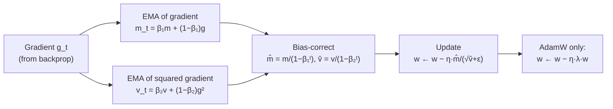
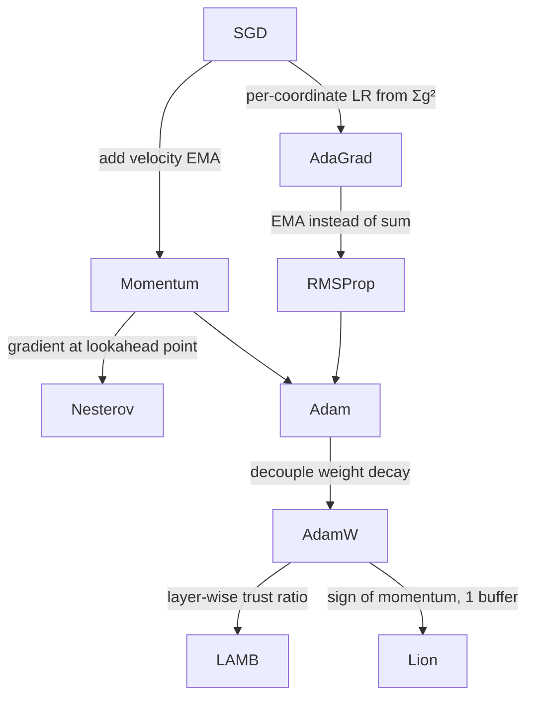

# 2.5 — Optimizers (SGD → Adam → Lion)

## 1. Overview

**What is it?** An optimizer is the algorithm that updates a neural network's parameters using the gradients computed by [backpropagation](02-backpropagation.md). Every training loop you will ever write ends with an optimizer step: `loss.backward(); optimizer.step()`.

**Why does it exist?** Plain gradient descent — subtract the gradient times a learning rate — works, but slowly and fragilely on the huge, non-convex, ill-conditioned loss landscapes of deep networks. A family of increasingly clever update rules (momentum, Nesterov, AdaGrad, RMSProp, Adam, AdamW, LAMB, Lion) exists to converge faster, more stably, and with less hyperparameter babysitting.

**What problem does it solve?** Three concrete pathologies of plain SGD: (1) *ill-conditioning* — the loss curves sharply in some directions and gently in others, forcing a tiny learning rate and zig-zag trajectories; (2) *gradient noise* — mini-batch gradients are noisy estimates of the true gradient; (3) *scale heterogeneity* — different parameters (embedding rows vs. output weights) want very different step sizes.

**Where is it used?** Everywhere. GPT-class language models are trained with AdamW; classic CNNs with SGD + momentum; large-batch pretraining with LAMB; memory-constrained runs increasingly with Lion or Adafactor. Choosing and tuning the optimizer is one of the highest-leverage decisions in any training run.

## 2. Learning Objectives

After this chapter you will be able to:

- Write the exact update rule for SGD, momentum, Nesterov momentum, AdaGrad, RMSProp, Adam, AdamW, LAMB, and Lion, and define every symbol in each.
- Derive Adam's bias-correction terms $\hat m_t = m_t/(1-\beta_1^t)$ and $\hat v_t = v_t/(1-\beta_2^t)$ from first principles.
- Explain *why* momentum accelerates convergence on ill-conditioned quadratics.
- Explain why weight decay and L2 regularization are equivalent for SGD but **not** for Adam, and why AdamW fixes this.
- Implement Adam, AdamW, and Lion from scratch in NumPy and verify them against PyTorch.
- Choose sensible default learning rates and schedules (warmup, cosine decay) for a new project.
- Compute the per-step memory footprint of each optimizer and pick one for a memory-constrained GPU.
- Diagnose common training failures (loss divergence, plateaus, "loss goes down then explodes") in terms of optimizer settings.
- Explain the linear scaling rule for large-batch training and why LAMB exists.
- Answer standard interview questions on adaptive optimizers with confidence.

## 3. Prerequisites

| Chapter | Why you need it |
|---|---|
| [Calculus for ML](../phase-0-prerequisites/03-calculus.md) | Gradients, partial derivatives, and the chain rule are the raw material every optimizer consumes. |
| [Gradient Descent](../phase-1-classical-ml/03-gradient-descent.md) | This chapter builds directly on vanilla batch/mini-batch/stochastic gradient descent and learning-rate intuition. |
| [Backpropagation](02-backpropagation.md) | Backprop produces the gradient vector $g_t$; optimizers decide what to do with it. |
| [Loss Functions](04-loss-functions.md) | The loss landscape being optimized determines which optimizer behaviors matter. |

## 4. Intuition

Imagine hiking down a foggy mountain to reach the valley floor. **Plain SGD** is a hiker who, at every step, looks only at the slope directly under their feet and takes a fixed-length step downhill. On a smooth slope this works. But in a long, narrow canyon (an *ill-conditioned* loss surface), the steepest direction points at the canyon *walls*, not along the canyon floor — so the hiker bounces from wall to wall, making painfully slow progress along the actual valley.

**Momentum** gives the hiker a heavy ball to roll instead of walking. The ball accumulates velocity: side-to-side bounces cancel out (they alternate direction), while the consistent downhill-along-the-canyon component adds up. The ball flies down the canyon floor.

**Adaptive methods** (AdaGrad, RMSProp, Adam) give each *coordinate* its own step size. Think of a marketing team allocating budget: channels that historically produced huge, noisy signals get cautious small adjustments; channels with faint, rare signals get amplified adjustments so they aren't ignored. In neural networks, rarely-updated parameters (like embedding rows for rare words) receive proportionally larger steps, and frequently-hammered parameters receive smaller ones.

An everyday story: think of learning to cook. Early on, every dish teaches you a lot, so you make big changes to your technique (large effective steps). For techniques you've practiced a thousand times (dicing onions), you make only tiny refinements. Adam formalizes exactly this: step size shrinks for parameters with a long history of large gradients.

## 5. Real-world Motivation

- **OpenAI** trained the GPT series with Adam/AdamW; the GPT-3 paper explicitly reports Adam with $\beta_1=0.9$, $\beta_2=0.95$, gradient clipping at 1.0, warmup, and cosine decay. Getting these settings wrong at that scale wastes millions of dollars of compute.
- **Google** introduced LAMB specifically to train BERT with batch size 32k, cutting BERT pretraining from days to ~76 minutes on a TPU pod.
- **Meta**'s LLaMA models are trained with AdamW plus cosine schedules — the de-facto recipe for open LLMs.
- **Google Brain / DeepMind** discovered Lion via program search ("Symbolic Discovery of Optimization Algorithms", 2023); it matches AdamW on vision and language tasks while storing only one moment buffer, halving optimizer memory.
- **Vision teams everywhere** (e.g., torchvision reference training recipes) still use SGD + momentum for ResNets because, well-tuned, it generalizes slightly better than Adam on classic CNN benchmarks.

At industrial scale, the optimizer determines convergence speed (compute cost), memory footprint (which GPUs you can use), and final quality. It is not a detail.

## 6. Mathematical Foundations

Throughout, $w_t \in \mathbb{R}^d$ is the parameter vector at step $t$, $g_t = \nabla_w \mathcal{L}(w_t)$ is the mini-batch gradient, $\eta$ is the learning rate, and all vector operations ($g_t^2$, $\sqrt{\cdot}$, division) are elementwise.

### 6.1 SGD

$$w_{t+1} = w_t - \eta\, g_t$$

One hyperparameter, no state. Convergence on ill-conditioned problems is limited by the *condition number* $\kappa = \lambda_{\max}/\lambda_{\min}$ (ratio of largest to smallest curvature): the largest stable $\eta$ is set by $\lambda_{\max}$, but progress along the flattest direction is proportional to $\eta \lambda_{\min}$, so SGD needs $O(\kappa)$ iterations.

### 6.2 Momentum (Polyak's heavy ball)

$$v_{t+1} = \mu\, v_t + g_t, \qquad w_{t+1} = w_t - \eta\, v_{t+1}$$

where $v_t$ is the *velocity* (initialized to 0) and $\mu \in [0,1)$ is the momentum coefficient (typically 0.9). Unrolling the recursion:

$$v_{t+1} = \sum_{k=0}^{t} \mu^{k} g_{t-k},$$

an exponentially-weighted sum of past gradients with effective horizon $\approx 1/(1-\mu)$ steps (10 steps for $\mu=0.9$). Components of the gradient that alternate sign cancel; consistent components accumulate up to a factor $1/(1-\mu)$. On quadratics, optimal momentum improves the iteration count from $O(\kappa)$ to $O(\sqrt{\kappa})$ — a provable, often dramatic speedup.

### 6.3 Nesterov Accelerated Gradient (NAG)

Look ahead before measuring the slope: evaluate the gradient at the *anticipated* position $w_t - \eta \mu v_t$, not at $w_t$:

$$v_{t+1} = \mu\, v_t + \nabla_w \mathcal{L}(w_t - \eta\, \mu\, v_t), \qquad w_{t+1} = w_t - \eta\, v_{t+1}$$

The lookahead acts as a correction: if momentum is about to overshoot, the gradient at the lookahead point already points back, damping oscillation. NAG achieves the optimal $O(\sqrt{\kappa})$ rate for smooth convex problems.

### 6.4 AdaGrad

$$G_t = G_{t-1} + g_t^2, \qquad w_{t+1} = w_t - \frac{\eta}{\sqrt{G_t} + \epsilon}\, g_t$$

$G_t \in \mathbb{R}^d$ accumulates squared gradients per coordinate; $\epsilon \approx 10^{-8}$ prevents division by zero. Parameters with historically large gradients get small steps, and vice versa — great for sparse features. Fatal flaw: $G_t$ grows monotonically, so the effective learning rate $\eta/\sqrt{G_t}$ decays to zero and training stalls.

### 6.5 RMSProp

Replace the sum with an exponential moving average (EMA):

$$E_t = \rho\, E_{t-1} + (1-\rho)\, g_t^2, \qquad w_{t+1} = w_t - \frac{\eta}{\sqrt{E_t} + \epsilon}\, g_t$$

with decay $\rho \approx 0.99$. $E_t$ estimates the *recent* mean-squared gradient, so the effective learning rate adapts but never irreversibly collapses.

### 6.6 Adam — with the bias-correction derivation

Adam (Kingma & Ba, 2015) combines momentum (first moment) with RMSProp (second moment):

$$m_t = \beta_1 m_{t-1} + (1-\beta_1) g_t, \qquad v_t = \beta_2 v_{t-1} + (1-\beta_2) g_t^2$$

$$\hat m_t = \frac{m_t}{1-\beta_1^t}, \qquad \hat v_t = \frac{v_t}{1-\beta_2^t}, \qquad w_{t+1} = w_t - \eta\, \frac{\hat m_t}{\sqrt{\hat v_t} + \epsilon}$$

Defaults: $\eta = 10^{-3}$, $\beta_1=0.9$, $\beta_2=0.999$, $\epsilon=10^{-8}$.

**Why bias correction?** Unroll the first-moment recursion with $m_0 = 0$:

$$m_t = (1-\beta_1) \sum_{k=1}^{t} \beta_1^{\,t-k}\, g_k.$$

Assume the gradients are stationary with expectation $\mathbb{E}[g_k] = g$ (a reasonable local approximation). Take expectations:

$$\mathbb{E}[m_t] = (1-\beta_1)\, g \sum_{k=1}^{t} \beta_1^{\,t-k} = (1-\beta_1)\, g\, \frac{1-\beta_1^t}{1-\beta_1} = g\,(1-\beta_1^t).$$

So $m_t$ *underestimates* the true mean gradient by exactly the factor $(1-\beta_1^t)$ — the "missing mass" from initializing at zero. Dividing by $(1-\beta_1^t)$ makes $\hat m_t$ unbiased: $\mathbb{E}[\hat m_t] = g$. The identical argument with $\beta_2$ and $g_k^2$ gives $\hat v_t = v_t/(1-\beta_2^t)$.

The correction matters most early: at $t=1$, $m_1 = (1-\beta_1) g_1 = 0.1\, g_1$, a 10× underestimate; without correction the first-moment signal is tiny while $\sqrt{v_1}$ is also tiny, producing erratic early steps. As $t \to \infty$, $\beta^t \to 0$ and the correction vanishes.

### 6.7 AdamW — decoupled weight decay

For SGD, adding L2 regularization $\frac{\lambda}{2}\|w\|^2$ to the loss is *identical* to shrinking weights each step ("weight decay"): the gradient gains a $\lambda w$ term, and $w_{t+1} = w_t - \eta(g_t + \lambda w_t) = (1-\eta\lambda)w_t - \eta g_t$. For Adam this equivalence **breaks**: the $\lambda w$ term is folded into $m_t$ and then *divided by* $\sqrt{\hat v_t}$, so parameters with large gradient history get *less* regularization — exactly backwards. AdamW (Loshchilov & Hutter, 2019) decouples the decay from the adaptive machinery:

$$w_{t+1} = w_t - \eta \left( \frac{\hat m_t}{\sqrt{\hat v_t} + \epsilon} + \lambda\, w_t \right)$$

Here $\lambda$ acts uniformly on every parameter. **AdamW is the standard optimizer for transformers**, typically with $\lambda \in [0.01, 0.1]$ and decay *disabled* for biases and normalization parameters.

### 6.8 LAMB — layer-wise adaptation for huge batches

With batch size 32k, Adam's uniform learning rate destabilizes some layers before others learn. LAMB (You et al., 2020) rescales each layer's Adam update by a *trust ratio*:

$$w^{(\ell)}_{t+1} = w^{(\ell)}_t - \eta\, \frac{\|w^{(\ell)}_t\|}{\|u^{(\ell)}_t\|}\, u^{(\ell)}_t, \qquad u^{(\ell)}_t = \frac{\hat m^{(\ell)}_t}{\sqrt{\hat v^{(\ell)}_t}+\epsilon} + \lambda w^{(\ell)}_t$$

where $\ell$ indexes layers. The step for each layer is proportional to that layer's weight norm — no layer takes a step large relative to its own scale. (Adafactor, similarly aimed at scale, factorizes $v_t$ into row/column statistics to save memory.)

### 6.9 Lion — sign-based updates

$$u_t = \operatorname{sign}\!\big(\beta_1 m_{t-1} + (1-\beta_1) g_t\big), \qquad w_{t+1} = w_t - \eta\,(u_t + \lambda w_t), \qquad m_t = \beta_2 m_{t-1} + (1-\beta_2) g_t$$

Every coordinate moves by exactly $\pm\eta$ (plus decay). Only **one** state buffer $m_t$ is stored (vs. Adam's two). Because the update magnitude is fixed at $\eta$ regardless of gradient scale (Adam's is roughly $\eta$ too, after normalization, but noisier), Lion typically wants a **3–10× smaller learning rate and 3–10× larger weight decay** than AdamW. Defaults from the paper: $\beta_1=0.9$, $\beta_2=0.99$.

> [!NOTE]
> A useful mental model: Adam ≈ "sign of the gradient, smoothed" — since $\hat m_t/\sqrt{\hat v_t} \approx \pm 1$ when gradient sign is consistent. Lion takes this literally.

## 7. Visual Explanation

Data flow of one Adam step:



Trajectories on an ill-conditioned bowl $\mathcal{L}(w) = \tfrac12(w_1^2 + 25\,w_2^2)$:

```
      SGD (zig-zags across the steep axis)      Momentum / Adam (glides along the valley)
  w2 ↑  \    /\    /\                        w2 ↑  ~~~
      \  \  /  \  /  \                            \___
       \  \/    \/    •  ← minimum                    \______•  ← minimum
        +----------------→ w1                       +----------------→ w1
```

How the family relates:



## 8. Algorithm

One training step with AdamW (the production workhorse):

1. Sample a mini-batch; run the forward pass; compute the loss.
2. Backpropagate to obtain $g_t$ for every parameter tensor.
3. (Optional but standard for transformers) clip the global gradient norm to a threshold, e.g. 1.0.
4. Update the first moment: $m_t \leftarrow \beta_1 m_{t-1} + (1-\beta_1) g_t$.
5. Update the second moment: $v_t \leftarrow \beta_2 v_{t-1} + (1-\beta_2) g_t^2$.
6. Bias-correct: $\hat m_t = m_t/(1-\beta_1^t)$, $\hat v_t = v_t/(1-\beta_2^t)$.
7. Apply the adaptive step: $w \leftarrow w - \eta_t\, \hat m_t / (\sqrt{\hat v_t} + \epsilon)$.
8. Apply decoupled decay: $w \leftarrow w - \eta_t\, \lambda\, w$ (skip biases and norm parameters).
9. Advance the learning-rate schedule to get $\eta_{t+1}$ (warmup, then cosine decay).

```text
# Pseudocode: AdamW
initialize m ← 0, v ← 0, t ← 0
for each training step:
    g ← ∇L(w)                      # backprop
    g ← clip_global_norm(g, 1.0)   # optional
    t ← t + 1
    m ← β1·m + (1−β1)·g
    v ← β2·v + (1−β2)·g⊙g
    m̂ ← m / (1 − β1^t)
    v̂ ← v / (1 − β2^t)
    w ← w − η_t · ( m̂ / (sqrt(v̂) + ε) + λ·w )
```

## 9. Worked Example

**Tiny example by hand.** Minimize $\mathcal{L}(w) = w^2$ starting at $w_0 = 1$, so $g_t = 2w_t$. Use Adam with $\eta=0.1$, $\beta_1=0.9$, $\beta_2=0.999$, $\epsilon=10^{-8}$.

*Step 1* ($t=1$): $g_1 = 2.0$.
- $m_1 = 0.9\cdot 0 + 0.1 \cdot 2.0 = 0.2$; $v_1 = 0.999\cdot 0 + 0.001\cdot 4.0 = 0.004$.
- Bias-correct: $\hat m_1 = 0.2/(1-0.9) = 2.0$; $\hat v_1 = 0.004/(1-0.999) = 4.0$.
- Update: $w_1 = 1 - 0.1 \cdot 2.0/(\sqrt{4.0}) = 1 - 0.1 = 0.9$.

Notice the corrected step is exactly $\eta \cdot \text{sign-ish}(g)$: the raw $m_1=0.2$ would have produced a step 10× too small — this is bias correction working.

*Step 2* ($t=2$): $g_2 = 1.8$.
- $m_2 = 0.9\cdot 0.2 + 0.1\cdot 1.8 = 0.36$; $v_2 = 0.999\cdot 0.004 + 0.001\cdot 3.24 = 0.007236$.
- $\hat m_2 = 0.36/(1-0.81) = 1.8947$; $\hat v_2 = 0.007236/(1-0.998001) = 3.6198$.
- $w_2 = 0.9 - 0.1\cdot 1.8947/\sqrt{3.6198} = 0.9 - 0.0996 = 0.8004$.

Each Adam step has magnitude ≈ $\eta$, independent of the gradient's raw scale — the signature of adaptive normalization.

**Realistic example.** Train a 2-layer MLP on Fashion-MNIST for 5 epochs. Typical outcome (batch 128): SGD with $\eta=0.01$ reaches ~85% test accuracy; SGD + momentum 0.9 reaches ~88%; Adam with $\eta=10^{-3}$ reaches ~89% and gets there in roughly half as many steps. Same model, same data, same budget — the optimizer alone moves the result.

## 10. Python from Scratch

A complete, verifiable NumPy implementation of the three optimizers you will actually use, sharing one interface.

```python
import numpy as np

class SGDMomentum:
    """SGD with (optionally Nesterov) momentum. State: 1 buffer per param."""
    def __init__(self, lr=0.01, mu=0.9, nesterov=False):
        self.lr, self.mu, self.nesterov = lr, mu, nesterov
        self.v = {}                                    # velocity per parameter id

    def step(self, params, grads):
        for k in params:
            v = self.v.get(k, np.zeros_like(params[k]))
            v = self.mu * v + grads[k]                 # accumulate velocity
            if self.nesterov:                          # lookahead correction:
                update = grads[k] + self.mu * v        # grad + momentum-of-future
            else:
                update = v
            params[k] -= self.lr * update
            self.v[k] = v

class AdamW:
    """Adam with decoupled weight decay. State: 2 buffers per param."""
    def __init__(self, lr=1e-3, b1=0.9, b2=0.999, eps=1e-8, wd=0.01):
        self.lr, self.b1, self.b2, self.eps, self.wd = lr, b1, b2, eps, wd
        self.m, self.v, self.t = {}, {}, 0

    def step(self, params, grads):
        self.t += 1                                    # shared step counter
        for k in params:
            m = self.m.get(k, np.zeros_like(params[k]))
            v = self.v.get(k, np.zeros_like(params[k]))
            m = self.b1 * m + (1 - self.b1) * grads[k]        # 1st moment EMA
            v = self.b2 * v + (1 - self.b2) * grads[k] ** 2   # 2nd moment EMA
            m_hat = m / (1 - self.b1 ** self.t)               # bias correction
            v_hat = v / (1 - self.b2 ** self.t)
            # adaptive step + DECOUPLED decay (not mixed into m/v):
            params[k] -= self.lr * (m_hat / (np.sqrt(v_hat) + self.eps)
                                    + self.wd * params[k])
            self.m[k], self.v[k] = m, v

class Lion:
    """Sign-of-momentum optimizer. State: 1 buffer per param (half of Adam)."""
    def __init__(self, lr=1e-4, b1=0.9, b2=0.99, wd=0.1):
        self.lr, self.b1, self.b2, self.wd = lr, b1, b2, wd   # note: lr ~10x smaller,
        self.m = {}                                           # wd ~10x larger than AdamW

    def step(self, params, grads):
        for k in params:
            m = self.m.get(k, np.zeros_like(params[k]))
            update = np.sign(self.b1 * m + (1 - self.b1) * grads[k])  # interpolate, then sign
            params[k] -= self.lr * (update + self.wd * params[k])
            self.m[k] = self.b2 * m + (1 - self.b2) * grads[k]        # momentum uses b2

# --- sanity check on the ill-conditioned bowl L(w) = 0.5*(w1^2 + 25*w2^2) ---
def loss_grad(w):
    return np.array([w[0], 25.0 * w[1]])                      # analytic gradient

for name, opt in [("sgd", SGDMomentum(lr=0.03, mu=0.0)),
                  ("momentum", SGDMomentum(lr=0.03, mu=0.9)),
                  ("adamw", AdamW(lr=0.1, wd=0.0))]:
    p = {"w": np.array([10.0, 1.0])}
    for _ in range(100):
        opt.step(p, {"w": loss_grad(p["w"])})
    print(name, p["w"])
# Expected: plain SGD is still far from 0 on w1 (slow axis);
# momentum and AdamW land near [0, 0] within ~100 steps.
```

Cost per step: one elementwise pass over all parameters — $O(d)$ time. A common bug to watch for: forgetting that `self.t` must be **shared across all parameter tensors** and incremented once per step; incrementing it per-tensor makes the bias correction wrong for every tensor after the first.

## 11. Library Implementation

PyTorch ships all of these; the entire art is choosing arguments.

```python
import torch

model = torch.nn.Linear(784, 10)      # any nn.Module

# Classic CV recipe: SGD + Nesterov momentum + mild coupled weight decay.
opt = torch.optim.SGD(model.parameters(), lr=0.1, momentum=0.9,
                      nesterov=True, weight_decay=1e-4)

# Transformer recipe: AdamW, no decay on biases/norms (two param groups).
decay, no_decay = [], []
for n, p in model.named_parameters():
    (no_decay if p.ndim <= 1 else decay).append(p)   # 1-D tensors = biases/norm scales
opt = torch.optim.AdamW([{"params": decay, "weight_decay": 0.1},
                         {"params": no_decay, "weight_decay": 0.0}],
                        lr=3e-4, betas=(0.9, 0.95))  # GPT-style betas

# Warmup + cosine schedule: LR ramps linearly for 1k steps, then cosine-decays.
sched = torch.optim.lr_scheduler.SequentialLR(
    opt,
    [torch.optim.lr_scheduler.LinearLR(opt, start_factor=0.01, total_iters=1000),
     torch.optim.lr_scheduler.CosineAnnealingLR(opt, T_max=99_000)],
    milestones=[1000])

# The canonical loop:
for x, y in ...:
    opt.zero_grad(set_to_none=True)                  # free grad memory, don't just zero
    loss = torch.nn.functional.cross_entropy(model(x), y)
    loss.backward()                                  # populates .grad
    torch.nn.utils.clip_grad_norm_(model.parameters(), 1.0)  # AFTER backward, BEFORE step
    opt.step()
    sched.step()                                     # per-step (not per-epoch) here
```

Line-by-line notes: `zero_grad(set_to_none=True)` releases gradient tensors instead of filling zeros (faster, less memory); the two param groups implement the "no decay on 1-D parameters" convention; clipping must sit between `backward()` and `step()` or it silently does nothing useful. Common bug: calling `sched.step()` per epoch while configuring it in units of steps (or vice versa) — the LR curve is then 100–1000× off.

## 12. Code Walkthrough

Inputs, outputs, and state for the AdamW step on a concrete model (2-layer MLP, batch 128, MNIST):

| Tensor | Shape | Meaning |
|---|---|---|
| `x` | (128, 784) | Input mini-batch |
| `loss` | () — scalar | Cross-entropy averaged over the batch |
| `W1.grad` | (784, 256) | Gradient $g_t$ for layer-1 weights |
| `opt.m["W1"]` | (784, 256) | First-moment EMA (same shape as the parameter) |
| `opt.v["W1"]` | (784, 256) | Second-moment EMA |
| `m_hat / (sqrt(v_hat)+eps)` | (784, 256) | Normalized update; entries are $\approx \pm 1$ once moments warm up |
| `W1` (after step) | (784, 256) | Updated in place |

Expected intermediate values: on step 1, `m_hat` equals the raw gradient exactly (bias correction cancels the $(1-\beta_1)$ factor), and each parameter moves by almost exactly $\pm\eta$. After a few hundred steps the normalized update develops magnitudes below 1 wherever gradient sign flips frequently (noise suppression). Expected result on MNIST: loss drops from ~2.30 (that's $\ln 10$, the random-guess baseline — check this!) to below 0.3 within one epoch with `lr=1e-3`.

## 13. Complexity Analysis

- **Time:** every optimizer here is $O(d)$ per step, where $d$ is the number of parameters — a handful of elementwise multiply/add/sqrt operations per parameter. In practice the optimizer step is memory-bandwidth-bound and negligible next to the forward/backward passes ($O(d \cdot \text{batch})$ FLOPs for dense layers).
- **Space (optimizer state, in multiples of parameter memory):**

| Optimizer | Extra state | Total (fp32 params + state) |
|---|---|---|
| SGD | 0 | 1× |
| SGD + momentum | $v$ | 2× |
| RMSProp | $E$ | 2× |
| Adam / AdamW | $m$, $v$ | 3× |
| Lion | $m$ | 2× |
| Adafactor | factored $v$ (row+col vectors) | ≈1× + tiny |

For a 7B-parameter model in fp32, Adam state alone is 56 GB — this is why Adafactor, Lion, and 8-bit optimizer states (bitsandbytes) exist, and why mixed-precision training keeps fp32 *master* weights plus moments while compute runs in bf16.

## 14. Advantages

- **Momentum: provably faster on ill-conditioned problems.** On a quadratic with condition number $\kappa$, iterations drop from $O(\kappa)$ to $O(\sqrt{\kappa})$ — e.g., training ResNet-50 with momentum 0.9 vs. 0.0 at the same LR converges visibly faster in the first epochs.
- **Adaptive LR: almost no per-problem tuning.** Adam at `3e-4` is a famously reliable first guess across MLPs, CNNs, and transformers; plain SGD's usable LR can vary by 100× across problems.
- **Adaptivity rescues sparse/rare parameters.** Embedding rows for rare tokens receive few, small accumulated $v$ values and hence relatively large steps — critical for NLP models with 50k+ vocabularies.
- **AdamW: regularization that actually regularizes.** Decoupled decay restored weight decay's effectiveness for transformers; it is part of why ViT and BERT fine-tuning recipes are so robust.
- **Lion/Adafactor: memory headroom.** Halving optimizer state can be the difference between fitting a model on one 24 GB GPU or needing two.

## 15. Disadvantages

- **Adam can generalize worse than tuned SGD + momentum** on classic vision benchmarks ("The Marginal Value of Adaptive Gradient Methods", Wilson et al., 2017). Well-tuned SGD often wins by ~0.5–1% top-1 on ImageNet CNNs.
- **Memory:** Adam triples parameter-related memory; at LLM scale this dominates GPU budgets.
- **$\epsilon$ sensitivity:** with very small $\hat v$, the update $\hat m/(\sqrt{\hat v}+\epsilon)$ can be enormous; some models (e.g., certain RL setups) need $\epsilon=10^{-5}$ instead of $10^{-8}$.
- **Failure case — no warmup on transformers:** in the first steps $\hat v$ is estimated from a handful of noisy gradients; full-size LR at $t\approx 0$ routinely diverges deep transformers. Warmup exists precisely for this.
- **Failure case — Lion with AdamW's LR:** since every coordinate moves a full $\pm\eta$, reusing AdamW's learning rate overshoots badly; loss explodes within hundreds of steps.
- **Sign methods discard magnitude information**, which can hurt on problems where gradient magnitude is genuinely informative (small batches, high noise).

## 16. Common Mistakes

- **Reusing a learning rate across optimizer families.** SGD LRs (0.01–0.1) are ~30–100× larger than Adam LRs (1e-4–3e-3), and Lion wants another 3–10× below Adam. Always retune LR when switching.
- **Using `weight_decay` in `torch.optim.Adam` and expecting true weight decay.** That argument implements *L2-into-gradient*, which Adam mangles (§6.7). Use `AdamW`.
- **Applying weight decay to biases and LayerNorm/BatchNorm parameters.** These 1-D parameters set scales/shifts; decaying them hurts. Use param groups.
- **Skipping warmup for transformers.** Symptom: loss NaNs within the first few hundred steps at an otherwise reasonable LR.
- **Not clipping gradients in RNN/transformer training.** One rare bad batch produces a huge gradient that poisons $m$ and $v$ for thousands of steps.
- **Forgetting to save optimizer state in checkpoints.** Resuming Adam with fresh $m=v=0$ but old parameters causes a loss spike (bias correction restarts, second-moment history is lost).
- **Calling `scheduler.step()` at the wrong granularity** (epoch vs. step), silently making the LR schedule nonsense.

## 17. Best Practices

A production checklist:

- [ ] Default to **AdamW** (`lr=3e-4`, `betas=(0.9, 0.999)` or `(0.9, 0.95)` for LLMs, `weight_decay=0.01–0.1`).
- [ ] Use **two parameter groups**: decay on matrices, no decay on biases/norms/embedding gains.
- [ ] Add **linear warmup** (1–5% of total steps) then **cosine decay** to ~10% of peak LR.
- [ ] **Clip global grad norm** at 1.0 for anything with attention or recurrence.
- [ ] Run a short **LR range test** (sweep LR over 2–3 orders of magnitude for a few hundred steps; pick just below where loss diverges).
- [ ] When scaling batch size by $k$, scale LR by $k$ (linear scaling rule) and re-warmup; beyond batch ~8–32k, consider LAMB.
- [ ] Checkpoint **optimizer state with the model**, and log the LR every step.
- [ ] For memory-tight runs: try Lion, Adafactor, or 8-bit Adam **before** shrinking the model.

## 18. Optimization Techniques

- **Gradient accumulation:** simulate large batches by summing gradients over $k$ micro-batches before one `step()` — remember to divide the loss by $k$.
- **Mixed precision (bf16/fp16 compute, fp32 master weights and moments):** halves activation/gradient memory; with fp16 use a loss scaler to avoid gradient underflow.
- **Fused optimizer kernels** (`fused=True` in recent PyTorch AdamW, or Apex): one kernel for all tensors instead of thousands of tiny launches — meaningful speedups for models with many small parameters.
- **8-bit optimizer states** (bitsandbytes `Adam8bit`): quantize $m, v$ to 8 bits with block-wise scaling; ~4× state-memory reduction at negligible quality cost.
- **Layer-wise LR decay (LLRD)** for fine-tuning: multiply LR by ~0.9 per layer from top to bottom so pretrained lower layers move less.
- **Sharpness-Aware Minimization (SAM):** an inner ascent step finds a worst-case nearby point; the outer step descends from there — flatter minima, better generalization, at 2× compute.
- **ZeRO/FSDP sharding:** partition optimizer states across data-parallel workers so each GPU stores only $1/N$ of $m, v$ — how trillion-parameter training fits at all.

## 19. Industry Applications

- **LLM pretraining (OpenAI GPT, Meta LLaMA, Mistral):** AdamW, $\beta_2 = 0.95$, warmup + cosine, grad-clip 1.0, decoupled decay ~0.1 — the recipe reported in nearly every open technical report.
- **Large-batch pretraining (Google BERT-in-76-minutes):** LAMB at batch 32k on TPU pods.
- **Vision production models (torchvision, Tesla-style perception CNN backbones):** SGD + momentum with cosine or step decay remains competitive and memory-cheap.
- **Google/DeepMind research and vision-language models:** Lion validated on ViT, diffusion models, and language modeling with equal-or-better quality at half the optimizer memory.
- **Memory-constrained fine-tuning everywhere (HuggingFace ecosystem):** Adafactor and 8-bit Adam are default choices for fitting T5/LLM fine-tunes on single GPUs.

## 20. Interview Questions

### Beginner

- **Q: What does an optimizer do in a training loop?**
  A: It consumes the gradients computed by backpropagation and applies an update rule to the parameters, e.g. $w \leftarrow w - \eta g$ for SGD. It owns any state needed for the rule (velocity, moment estimates) and the learning rate.
- **Q: Explain momentum intuitively.**
  A: It keeps an exponentially-decaying running average of past gradients (a "velocity") and steps along that. Oscillating gradient components cancel; consistent components accumulate, so it smooths noise and accelerates along persistent descent directions.
- **Q: Why is the learning rate the most important hyperparameter?**
  A: Too large → divergence or bouncing around the minimum; too small → wasted compute and possible trapping in poor regions. Every other hyperparameter's effect is conditioned on LR being in the right range.
- **Q: What is the difference between batch, mini-batch, and stochastic gradient descent?**
  A: The number of examples used per gradient estimate: all data (exact but slow), a small batch (noisy but cheap and parallel — the standard), or one example (very noisy). See [Gradient Descent](../phase-1-classical-ml/03-gradient-descent.md).
- **Q: What happens if the learning rate for Adam is set to a typical SGD value like 0.1?**
  A: Since Adam's normalized update has magnitude ≈ 1 per coordinate, LR≈step size; 0.1 per coordinate per step is enormous for most nets and training typically diverges. Adam LRs live around 1e-4 to 3e-3.

### Intermediate

- **Q: Derive why Adam needs bias correction.**
  A: With $m_0=0$, unrolling gives $m_t = (1-\beta_1)\sum_k \beta_1^{t-k} g_k$; under a locally-constant gradient assumption, $\mathbb{E}[m_t] = g(1-\beta_1^t)$, an underestimate by factor $(1-\beta_1^t)$. Dividing by that factor makes the estimate unbiased; the effect is large early ($t$ small) and vanishes as $t$ grows.
- **Q: AdamW vs. Adam-with-L2 — what actually differs?**
  A: In Adam, an L2 gradient term $\lambda w$ enters $m_t$ and gets divided by $\sqrt{\hat v_t}$, so high-gradient parameters are under-regularized. AdamW applies $-\eta\lambda w$ directly to the weights, outside the adaptive normalization, restoring uniform decay. Empirically this significantly improves transformer regularization.
- **Q: What problem does warmup solve?**
  A: Early in training, $\hat v_t$ is estimated from very few samples, so the effective per-coordinate LR is unreliable (and often too large); also early gradients in deep nets are poorly scaled. Ramping LR from ~0 lets the moment estimates stabilize before full-size steps are taken.
- **Q: When would you pick SGD + momentum over Adam?**
  A: Classic CNN vision tasks with a well-known recipe, memory-constrained settings, or when squeezing the last fraction of a percent of generalization — tuned SGD often generalizes slightly better there. Adam wins on transformers, sparse gradients, and anything where tuning budget is limited.
- **Q: State the linear scaling rule and its limit.**
  A: When multiplying batch size by $k$, multiply LR by $k$ (gradient noise scales down, so bigger steps are safe), combined with warmup. It breaks down at very large batches (LR would exceed curvature limits), which motivates layer-wise methods like LAMB.

### Advanced

- **Q: Why does LAMB's trust ratio $\|w\|/\|u\|$ stabilize large-batch training?**
  A: It makes each layer's *relative* update $\|\Delta w\|/\|w\|$ equal to $\eta$, regardless of how gradient scales differ across layers. At huge batch sizes, a global LR that is safe for the most sensitive layer starves the rest; per-layer normalization removes this bottleneck.
- **Q: Adam's update is scale-invariant in the gradient. Prove it and give one consequence.**
  A: Multiply all gradients by $c$: $m_t \to c\,m_t$, $v_t \to c^2 v_t$, so $\hat m_t/\sqrt{\hat v_t}$ is unchanged. Consequence: loss rescaling (e.g., sum vs. mean reduction) doesn't change Adam trajectories (up to $\epsilon$ effects) — but it *does* change SGD, a classic source of "same code, different optimizer, different behavior" confusion.
- **Q: Why can Lion use ~half the memory of AdamW, and what compensating hyperparameter changes are required?**
  A: Lion stores only one momentum buffer (no second moment) because the sign operation replaces magnitude normalization. Since every coordinate moves exactly $\eta$, the LR must drop ~3–10× vs. AdamW and weight decay rise correspondingly to keep the decay-to-update ratio similar.
- **Q: What happens to Adam when $\epsilon$ is increased from 1e-8 to 1e-3, and when might you want that?**
  A: The update tends toward $\eta \hat m_t/\epsilon$ for coordinates with tiny $\hat v$, i.e. Adam interpolates toward (scaled) SGD-with-momentum; adaptivity is muted. Useful when second-moment estimates are unreliable/noisy — some RL and speech recipes deliberately use large $\epsilon$.
- **Q: Your loss curve shows a sudden spike mid-training that slowly recovers. Give optimizer-related hypotheses.**
  A: (1) A rare bad batch produced a huge gradient without clipping, contaminating $m$ and (persistently) $v$; (2) checkpoint resume dropped optimizer state; (3) LR schedule discontinuity (restart); (4) fp16 overflow before loss-scaler adjustment. Check grad-norm logs and clip; verify optimizer state is checkpointed.

## 21. Coding Exercises

### Easy

1. Implement momentum and Nesterov momentum as NumPy classes with the interface from §10; verify on $\mathcal{L}(w)=\tfrac12 w^\top \mathrm{diag}(1,25)\, w$ that momentum reaches $\|w\|<10^{-3}$ in fewer steps than plain SGD. *Hint: reuse the `SGDMomentum` skeleton; count steps to convergence.*
2. Plot the Adam bias-correction factors $1/(1-\beta^t)$ for $\beta \in \{0.9, 0.999\}$ over $t = 1..2000$. *Hint: note how long the $\beta_2$ correction stays far from 1 — this is why early $\hat v$ is fragile.*

### Medium

1. Implement AdaGrad and RMSProp; train a small MLP on MNIST with each and plot loss curves; demonstrate AdaGrad's stall on a long run. *Hint: track the effective LR $\eta/\sqrt{G_t}$ of one parameter over time.*
2. Reproduce the bias-correction ablation: train the same model with Adam and with Adam-without-correction (use $m_t, v_t$ raw) at the same LR; compare the first 500 steps. *Hint: the uncorrected version takes near-zero steps early or behaves erratically depending on $\epsilon$.*
3. Verify your NumPy AdamW against `torch.optim.AdamW` to 6 decimal places on identical parameters/gradients for 100 steps. *Hint: fix seeds and feed both the same synthetic gradient sequence.*

### Hard

1. Implement Lion and benchmark against AdamW on CIFAR-10 with a small CNN, sweeping LR ∈ {1e-5, 3e-5, 1e-4, 3e-4} for Lion and {1e-4, 3e-4, 1e-3} for AdamW; report best-of-sweep accuracy and optimizer memory. *Hint: measure state memory as bytes of buffers you allocate.*
2. Implement gradient accumulation + AdamW so batch-4096 training runs on a GPU that fits only batch-256; verify the loss trajectory matches true batch-4096 on a toy problem. *Hint: watch out for BatchNorm — it sees micro-batches, not the effective batch.*
3. Implement a minimal SAM wrapper around SGD (ascent step of radius $\rho$, then descent) and reproduce a generalization gap vs. plain SGD on CIFAR-10. *Hint: you need two forward/backward passes per step.*

## 22. Mini Project

**Optimizer showdown on Fashion-MNIST.** Compare six optimizers under identical conditions.

1. Build a fixed 3-layer MLP (784→256→128→10) in PyTorch; freeze the random seed and initialization.
2. Train it separately with SGD, SGD+momentum, Nesterov, RMSProp, Adam, and AdamW for 15 epochs each, batch 128.
3. For each optimizer, run a mini LR sweep (3 values spanning 10×) and keep the best.
4. Log per-epoch train loss, test accuracy, and wall-clock time to a CSV.
5. Plot accuracy-vs-epoch for all six on one figure; make a table of best test accuracy and time-to-85%.
6. Write a short conclusion: which optimizer won at equal epochs, which at equal wall-clock, and how sensitive each was to LR.

## 23. Medium Project

**Reproduce Sharpness-Aware Minimization (SAM) on CIFAR-10.**

1. Implement a WideResNet-16-8 (or use an existing implementation) with standard augmentation (crop + flip).
2. Train baseline: SGD + momentum 0.9, LR 0.1, cosine schedule, weight decay 5e-4, 200 epochs.
3. Implement SAM: compute gradient, take an ascent step $w + \rho\, g/\|g\|$ with $\rho = 0.05$, recompute the gradient there, restore $w$, and step with the second gradient.
4. Train the SAM run with the same base optimizer and budget (note: 2× forward/backward cost).
5. Compare final test accuracy (expect roughly +0.5–1.0% for SAM) and visualize loss-landscape sharpness via random-direction perturbation plots.
6. Ablate $\rho \in \{0.01, 0.05, 0.1, 0.2\}$ and report the sensitivity.

## 24. Advanced Project

**Train a 100M-parameter transformer on a single 24 GB GPU using memory-efficient optimization.**

Architecture: a 12-layer GPT-style decoder (d_model 768, 12 heads — see [Transformer](10-transformer.md)) on a public text corpus (e.g., OpenWebText subset), tokenized per [Tokenization](../phase-3-nlp-llm/01-tokenization.md).


Implementation phases:

1. **Baseline audit:** attempt AdamW fp32 and record the out-of-memory point; compute the memory ledger (params + grads + Adam state + activations).
2. **Mixed precision:** switch to bf16 autocast with fp32 master weights; re-measure.
3. **Memory-efficient state:** swap in Adafactor (or bitsandbytes 8-bit AdamW); confirm ≥2× state-memory savings.
4. **Gradient accumulation + activation checkpointing:** reach effective batch ≈ 0.5M tokens; verify throughput (tokens/sec) at each stage.
5. **Schedule + stability:** warmup 2k steps, cosine decay, grad-clip 1.0; train to a target validation perplexity and plot the loss curve.
6. **Report:** table of memory/throughput/perplexity per configuration.

Possible improvements: try Lion for a further state reduction; add FSDP across 2 GPUs and show optimizer-state sharding; experiment with $\beta_2 = 0.95$ vs. 0.999 for stability at long horizons.

## 25. Summary

- Optimizers turn backprop's gradients into parameter updates; the choice materially affects speed, memory, and final quality.
- Momentum averages past gradients, canceling oscillations and accelerating consistent directions — $O(\sqrt{\kappa})$ vs. $O(\kappa)$ on quadratics.
- Nesterov evaluates the gradient at a lookahead point, adding a self-correcting damping term.
- AdaGrad gives per-parameter learning rates from accumulated squared gradients but decays to zero; RMSProp fixes this with an EMA.
- Adam = momentum (first moment) + RMSProp (second moment) + bias correction; the correction exactly cancels the zero-initialization underestimate $(1-\beta^t)$.
- Weight decay ≠ L2 under Adam; AdamW decouples decay and is the transformer standard.
- LAMB normalizes updates per layer for huge-batch training; Lion signs the momentum and halves optimizer memory (retune LR ↓ and decay ↑).
- Memory: SGD 1×, momentum/Lion 2×, Adam 3× parameter memory — decisive at LLM scale.
- Production recipe: AdamW + param groups (no decay on 1-D params) + warmup + cosine + grad-clip 1.0.
- Always retune the learning rate when changing optimizer family; never reuse across families.

## 26. Cheat Sheet

| Optimizer | Update rule (core) | State | Typical LR |
|---|---|---|---|
| SGD | $w \mathrel{-}= \eta g$ | — | 0.01–0.1 |
| Momentum | $v = \mu v + g;\ w \mathrel{-}= \eta v$ | 1× | 0.01–0.1, $\mu=0.9$ |
| Nesterov | grad at $w - \eta\mu v$ | 1× | same as momentum |
| AdaGrad | $w \mathrel{-}= \eta g/\sqrt{\Sigma g^2}$ | 1× | 0.01 |
| RMSProp | EMA of $g^2$ in denominator | 1× | 1e-3, $\rho=0.99$ |
| Adam | $\hat m/(\sqrt{\hat v}+\epsilon)$ | 2× | 1e-4–3e-3 |
| AdamW | Adam + decoupled $\eta\lambda w$ | 2× | 3e-4, $\lambda$=0.01–0.1 |
| LAMB | AdamW × trust ratio $\|w\|/\|u\|$ | 2× | large-batch only |
| Lion | $\eta\,\mathrm{sign}(\beta_1 m + (1{-}\beta_1)g)$ | 1× | AdamW LR ÷ 3–10 |

**Defaults that just work:** AdamW `lr=3e-4, betas=(0.9,0.999), wd=0.01`, warmup 1–5%, cosine decay, clip 1.0.
**One-liners:** Adam step size ≈ LR per coordinate • bias correction matters only early • no decay on biases/norms • retune LR when switching optimizers.
**Gotchas:** `Adam(weight_decay=…)` is L2, not decay → use AdamW • checkpoint optimizer state • `sched.step()` granularity • Lion at AdamW's LR diverges.

## 27. Further Reading

- **Books:** *Deep Learning* (Goodfellow, Bengio, Courville), Ch. 8 "Optimization for Training Deep Models"; *Dive into Deep Learning* (d2l.ai), optimization chapters.
- **Research Papers:** Kingma & Ba, "Adam: A Method for Stochastic Optimization" (2015); Loshchilov & Hutter, "Decoupled Weight Decay Regularization" (AdamW, 2019); Sutskever et al., "On the importance of initialization and momentum in deep learning" (2013); Duchi et al., "Adaptive Subgradient Methods" (AdaGrad, 2011); You et al., "Large Batch Optimization for Deep Learning: Training BERT in 76 minutes" (LAMB, 2020); Chen et al., "Symbolic Discovery of Optimization Algorithms" (Lion, 2023); Wilson et al., "The Marginal Value of Adaptive Gradient Methods" (2017); Foret et al., "Sharpness-Aware Minimization" (2021); Shazeer & Stern, "Adafactor" (2018); Goyal et al., "Accurate, Large Minibatch SGD" (linear scaling rule, 2017).
- **Documentation:** PyTorch `torch.optim` docs; bitsandbytes 8-bit optimizer docs.
- **GitHub Repositories:** `pytorch/pytorch` (optimizer sources are readable reference implementations); `google/automl` (Lion); `davda54/sam` (SAM in PyTorch); `TimDettmers/bitsandbytes`.
- **Datasets:** MNIST / Fashion-MNIST (fast benchmarks); CIFAR-10/100 (standard optimizer-comparison testbed).
- **YouTube/Videos:** Andrej Karpathy's "Neural Networks: Zero to Hero" series (optimization segments); Stanford CS231n lectures on optimization.
- **Blogs:** Sebastian Ruder, "An overview of gradient descent optimization algorithms"; Distill.pub, "Why Momentum Really Works".
