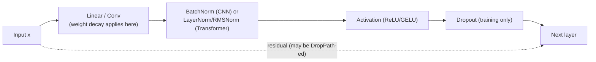
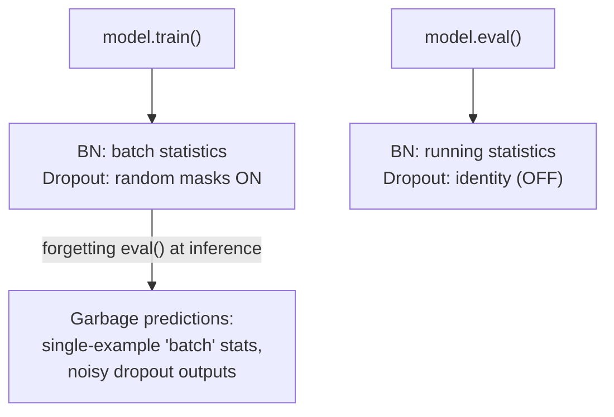
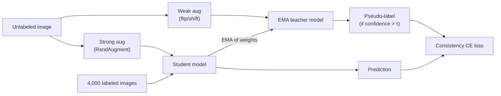

# 2.6 — Deep-Learning Regularization (Dropout, BatchNorm, LayerNorm, Weight Decay, Data Aug)

## 1. Overview

**What is it?** Regularization is the collection of techniques — weight decay, dropout, normalization layers (BatchNorm, LayerNorm, RMSNorm), label smoothing, data augmentation, stochastic depth, early stopping — that stop an over-parameterized neural network from merely memorizing its training set and force it to learn patterns that *generalize*.

**Why does it exist?** Modern networks have millions to billions of parameters, often far more than training examples. Unregularized, such a model can drive training loss to zero by memorizing labels (it will happily fit *random* labels, as Zhang et al. famously showed) while test error stays terrible. Regularization is the counterweight.

**What problem does it solve?** It reduces the gap between training and test performance (variance reduction), stabilizes and accelerates training (normalization), and effectively enlarges the dataset (augmentation). Normalization in particular is also an *enabler*: without BatchNorm/LayerNorm, very deep CNNs and transformers are hard or impossible to train at all.

**Where is it used?** Every serious training pipeline. Transformers are defined around LayerNorm/RMSNorm; ResNets around BatchNorm; every vision recipe leans on augmentation; every LLM pretraining run uses weight decay and often dropout.

## 2. Learning Objectives

After this chapter you will be able to:

- Explain overfitting in terms of the bias–variance decomposition and identify it from loss curves.
- Write and derive the exact math of L2 regularization / weight decay and explain the AdamW subtlety.
- Implement inverted dropout correctly, including the $1/(1-p)$ scaling, and explain the ensemble interpretation.
- Derive BatchNorm's forward pass, explain the role of $\gamma, \beta$, and describe train-vs-inference behavior (running statistics).
- Contrast BatchNorm, LayerNorm, GroupNorm, InstanceNorm, and RMSNorm along the "which axes are normalized" dimension, and pick the right one for a given architecture.
- Write the label-smoothing target distribution and explain what it does to logits and calibration.
- Design a data-augmentation policy (crop/flip/color, MixUp, CutMix, RandAugment) appropriate to a task.
- Explain stochastic depth / DropPath and where modern architectures (ViT, ConvNeXt) apply it.
- Implement BatchNorm and LayerNorm from scratch in NumPy, including running statistics.
- Debug the classic `model.eval()` failure and other normalization pitfalls.
- Combine multiple regularizers into a sensible production recipe without over-regularizing.

## 3. Prerequisites

| Chapter | Why you need it |
|---|---|
| [Probability & Statistics](../phase-0-prerequisites/04-probability-statistics.md) | Mean, variance, and expectation are the language of normalization and dropout. |
| [Classical Regularization (L1/L2)](../phase-1-classical-ml/05-regularization.md) | Weight decay is the deep-learning continuation of ridge regression ideas. |
| [Backpropagation](02-backpropagation.md) | Every technique here must be differentiable (or handled at the graph level) to train. |
| [Loss Functions](04-loss-functions.md) | Label smoothing modifies the cross-entropy target introduced there. |
| [Optimizers](05-optimizers.md) | Weight decay interacts with the optimizer (AdamW's decoupling). |

## 4. Intuition

Think of a student preparing for an exam. A student with a photographic memory can memorize every past paper — perfect scores on practice, disaster on the real exam with fresh questions. That's an over-parameterized network overfitting. Regularization is a set of study rules that force *understanding*:

- **Weight decay** is "prefer simple explanations": every parameter pays rent proportional to its size, so the model keeps only weights that earn their keep. Like packing for a hike where every gram costs you — you take only what's demonstrably useful.
- **Dropout** is "study with random pages torn out": each practice session, a random half of your notes vanishes, so no single fact can be a crutch; knowledge must be redundant and distributed. Equivalently, it's like a sports team practicing with random players benched — no play can depend on one superstar.
- **Normalization** is a thermostat between floors of a building: each layer receives inputs at a predictable temperature (zero mean, unit variance) no matter what the layers below just did, so every layer can learn under stable conditions.
- **Data augmentation** is showing the student the same concept in many disguises — the same cat photo cropped, flipped, recolored — so they learn "cat", not "this exact grid of pixels".
- **Label smoothing** is a teacher saying "be confident, not *certain*": target 90% instead of 100%, leaving room for doubt.
- **Stochastic depth** is randomly skipping whole floors of the building during practice so the elevator (the residual connection) must carry usable signal on its own.

## 5. Real-world Motivation

- **Google** introduced Batch Normalization (Ioffe & Szegedy, 2015) to accelerate Inception training; it became the ingredient that made **ResNet-152** trainable and is baked into virtually every production CNN since.
- **Transformers at OpenAI, Google, and Meta** are structurally dependent on LayerNorm: the original Transformer, BERT, and GPT all place LayerNorm around every sublayer. **Meta's LLaMA** family switched to **RMSNorm** for a few percent throughput gain at billion-parameter scale — at that scale, a cheaper norm is real money.
- **Label smoothing** (0.1) shipped in Google's Inception-v3 and remains in standard ImageNet and machine-translation recipes.
- **Data augmentation is the single biggest regularizer in production vision**: Tesla's perception stack, Google Photos classifiers, and every Kaggle-winning vision model rely on aggressive augmentation (RandAugment, MixUp, CutMix) rather than more labels, because labels are expensive and augmentations are free.
- **Stochastic depth** is part of the official training recipes of ViT, Swin, ConvNeXt, and EfficientNet — modern SOTA vision models do not train to reported accuracy without it.

## 6. Mathematical Foundations

Notation: $x \in \mathbb{R}^d$ is a layer input, $B$ is batch size, $\eta$ the learning rate, $\mathcal{L}$ the loss, $\odot$ elementwise product.

### 6.1 Weight decay (L2)

Add a penalty to the loss: $\mathcal{L}_{\text{reg}}(w) = \mathcal{L}(w) + \frac{\lambda}{2}\|w\|_2^2$, with strength $\lambda > 0$. The gradient gains $\lambda w$, so the SGD step becomes

$$w_{t+1} = w_t - \eta(\nabla\mathcal{L} + \lambda w_t) = (1 - \eta\lambda)\, w_t - \eta \nabla\mathcal{L},$$

i.e. weights are multiplicatively shrunk by $(1-\eta\lambda)$ each step — hence "decay". For SGD, L2-penalty and decay are identical; for Adam they are **not** (the penalty term gets divided by $\sqrt{\hat v}$), which is why [AdamW](05-optimizers.md) applies decay directly to weights. Bayesian view: L2 is a zero-mean Gaussian prior on weights; the penalty is the negative log-prior.

### 6.2 Dropout

During training, sample an independent mask $m_j \sim \text{Bernoulli}(1-p)$ for each unit $j$ (keep probability $1-p$) and use *inverted dropout*:

$$\tilde x = \frac{m \odot x}{1-p}.$$

The $1/(1-p)$ scaling makes the expectation match the clean activation: $\mathbb{E}[\tilde x_j] = \frac{(1-p)\,x_j}{1-p} = x_j$, so **at inference you simply use the full network unchanged**. Interpretation: each mask defines one of $2^N$ subnetworks sharing weights; training with dropout approximately trains this exponential ensemble, and inference approximates averaging it. Dropout also prevents *co-adaptation* — a unit cannot rely on a specific partner unit that might vanish.

### 6.3 Batch Normalization

For each feature (channel), over a mini-batch $\{x_1,\dots,x_B\}$:

$$\mu_B = \frac{1}{B}\sum_{i=1}^B x_i, \qquad \sigma_B^2 = \frac{1}{B}\sum_{i=1}^B (x_i - \mu_B)^2$$

$$\hat x_i = \frac{x_i - \mu_B}{\sqrt{\sigma_B^2 + \epsilon}}, \qquad y_i = \gamma\, \hat x_i + \beta$$

where $\epsilon \approx 10^{-5}$ guards against division by zero, and $\gamma, \beta \in \mathbb{R}^d$ are *learnable* scale and shift restoring the layer's expressive power (the network can even undo the normalization if that's optimal: set $\gamma = \sigma_B$, $\beta = \mu_B$). For a conv feature map of shape $(N, C, H, W)$, statistics are computed per channel over the $N \times H \times W$ axis.

**Inference:** batch statistics are unavailable/meaningless for a single example, so BN uses running averages tracked during training:

$$\mu_{\text{run}} \leftarrow (1-\alpha)\,\mu_{\text{run}} + \alpha\,\mu_B, \qquad \sigma^2_{\text{run}} \leftarrow (1-\alpha)\,\sigma^2_{\text{run}} + \alpha\,\sigma_B^2$$

with momentum $\alpha \approx 0.1$. **Backward pass subtlety:** because $\mu_B$ and $\sigma_B^2$ depend on every $x_i$, the gradient couples examples in the batch:

$$\frac{\partial \mathcal{L}}{\partial x_i} = \frac{\gamma}{\sqrt{\sigma_B^2+\epsilon}} \left( \frac{\partial \mathcal{L}}{\partial y_i} - \frac{1}{B}\sum_j \frac{\partial \mathcal{L}}{\partial y_j} - \frac{\hat x_i}{B} \sum_j \frac{\partial \mathcal{L}}{\partial y_j}\hat x_j \right).$$

Why it works: originally attributed to reducing "internal covariate shift"; the modern view (Santurkar et al., 2018) is that BN *smooths the loss landscape* (reduces the Lipschitz constant of loss and gradients), permitting larger learning rates. The batch-dependent noise in $\mu_B, \sigma_B$ is also itself a regularizer.

### 6.4 Layer Normalization

Normalize across the **features of one example** instead of across the batch. For $x \in \mathbb{R}^d$ (e.g., one token's embedding):

$$\mu = \frac{1}{d}\sum_{j=1}^d x_j, \qquad \sigma^2 = \frac{1}{d}\sum_{j=1}^d (x_j - \mu)^2, \qquad y = \gamma \odot \frac{x-\mu}{\sqrt{\sigma^2+\epsilon}} + \beta.$$

No batch dependence → identical behavior at train and test, works with batch size 1, works on variable-length sequences. **Standard in Transformers** (see [Transformer](10-transformer.md)), where each token position is normalized independently.

### 6.5 The normalization family

| Norm | Axes averaged (input $N,C,H,W$) | Typical use |
|---|---|---|
| BatchNorm | $N, H, W$ per channel | CNNs with batch ≥ 16 |
| LayerNorm | $C$ (features) per position | Transformers, RNNs |
| InstanceNorm | $H, W$ per sample per channel | Style transfer |
| GroupNorm | $H, W$ + channel groups per sample | Detection/segmentation with tiny batches |
| RMSNorm | like LN but no mean subtraction | LLaMA-style LLMs |

**RMSNorm** drops the mean-centering and the shift:

$$y = \gamma \odot \frac{x}{\text{RMS}(x)}, \qquad \text{RMS}(x) = \sqrt{\frac{1}{d}\sum_j x_j^2 + \epsilon}.$$

Fewer operations and reductions, empirically equal quality — hence its adoption in LLaMA, Mistral, and most recent LLMs.

### 6.6 Label smoothing

Replace the one-hot target $y \in \{0,1\}^K$ with a smoothed distribution, for smoothing strength $\varepsilon$ (typically 0.1) over $K$ classes:

$$\tilde y_k = (1-\varepsilon)\,\mathbb{1}[k = c] + \frac{\varepsilon}{K}.$$

Cross-entropy against $\tilde y$ penalizes the model for pushing the correct-class logit infinitely above the rest; optimal logit gaps become finite. Effects: better calibration, less overconfidence, small but consistent accuracy gains; slight downside: class clusters become tighter, which can hurt distillation.

### 6.7 Data augmentation

Formally, we train on $(T(x), y)$ where $T$ is a random label-preserving transform — this expresses an *invariance prior*: $f(T(x)) \approx f(x)$. Standard vision menu: random crop, horizontal flip, color jitter; automated policies: RandAugment, TrivialAugment. Two important label-*mixing* variants:

- **MixUp:** $\tilde x = \lambda x_i + (1-\lambda)x_j$, $\tilde y = \lambda y_i + (1-\lambda)y_j$, $\lambda \sim \text{Beta}(\alpha,\alpha)$ — trains the model to behave linearly between examples.
- **CutMix:** paste a random rectangle from image $j$ into image $i$; mix labels by area ratio.

For NLP: back-translation, synonym replacement, word/token dropout.

### 6.8 Stochastic depth / DropPath

For a residual block $y = x + F(x)$, during training randomly drop the *entire branch*:

$$y = x + b\,F(x), \qquad b \sim \text{Bernoulli}(1 - p_\ell),$$

with survival probability decreasing linearly with depth $\ell$ (deep blocks dropped more often). At inference, use $y = x + (1-p_\ell)F(x)$ or (in the common "DropPath at sample level" implementation with inverted scaling during training) simply $y = x + F(x)$. It shortens the expected gradient path and regularizes — used in EfficientNet, ViT, Swin, ConvNeXt.

### 6.9 Early stopping

Monitor validation loss; stop (or restore the best checkpoint) when it hasn't improved for a *patience* of $k$ evaluations. For linear models this is approximately equivalent to L2 regularization with $\lambda \propto 1/(\eta t)$ — fewer steps means the weights stayed closer to their (small) initialization.

## 7. Visual Explanation

Where each technique lives in a block:



Which axes each norm reduces over, for an activation tensor $(N, C, H{\times}W)$:

```
            features/channels C →
  batch    ┌──────────────────────┐      BatchNorm: average DOWN each column (over N, and H,W)
   N       │  · · · · · · · · · · │      LayerNorm: average ACROSS each row (over C)
   ↓       │  · · · · · · · · · · │      InstanceNorm: per row AND per channel (over H,W only)
           │  · · · · · · · · · · │      GroupNorm: LayerNorm within channel groups
           └──────────────────────┘      RMSNorm: LayerNorm without mean subtraction
```

Train vs. inference behavior — the classic trap:



## 8. Algorithm

Assembling a regularized training step (CNN example):

1. Sample a mini-batch; apply data augmentation to each example (crop, flip, color jitter; optionally MixUp/CutMix on the batch).
2. Forward pass: each Conv → **BatchNorm** (batch stats; update running stats) → ReLU; residual branches pass through **DropPath** masks; fully-connected head applies **Dropout**.
3. Compute cross-entropy against **label-smoothed** targets.
4. Backward pass through all of the above (dropout/DropPath masks are constants of the graph).
5. Optimizer step with **decoupled weight decay** on weight matrices only (not biases/norm parameters).
6. Periodically evaluate with `model.eval()` (running BN stats, dropout off) and apply **early stopping** on validation loss.

```text
# Pseudocode: inverted dropout + BN training step
for each batch (X, y):
    X ← augment(X)                                # crop/flip/jitter [+ MixUp]
    for each layer:
        z ← conv(X)
        μ, σ² ← batch_stats(z);  update_running(μ, σ²)
        ẑ ← (z − μ)/sqrt(σ² + ε);  z ← γ·ẑ + β
        z ← relu(z)
        if training: mask ~ Bernoulli(1−p);  z ← z·mask/(1−p)
    ŷ ← head(z)
    ỹ ← (1−ε_ls)·onehot(y) + ε_ls/K               # label smoothing
    loss ← cross_entropy(ŷ, ỹ)
    backprop; AdamW step (decay on weights only)
```

## 9. Worked Example

**Tiny BatchNorm by hand.** One feature, batch of 4: $x = [1, 2, 3, 6]$, $\gamma = 2$, $\beta = 1$, $\epsilon \approx 0$.

- Mean: $\mu_B = (1+2+3+6)/4 = 3$.
- Variance: $\sigma_B^2 = \frac{(1{-}3)^2 + (2{-}3)^2 + (3{-}3)^2 + (6{-}3)^2}{4} = \frac{4+1+0+9}{4} = 3.5$.
- Normalize: $\hat x = (x - 3)/\sqrt{3.5} = [-1.069, -0.535, 0, 1.604]$.
- Scale/shift: $y = 2\hat x + 1 = [-1.138, -0.069, 1.0, 4.207]$.

Check: $\hat x$ has mean 0 and variance 1 (up to rounding) — regardless of the input's original scale.

**Tiny dropout by hand.** $x = [4, 8, 2, 6]$, $p = 0.5$, sampled mask $m = [1, 0, 1, 1]$. Inverted dropout: $\tilde x = x \odot m / 0.5 = [8, 0, 4, 12]$. Expected value per unit: $0.5 \cdot (x_j/0.5) + 0.5 \cdot 0 = x_j$ — matches the clean activation, so inference needs no rescaling.

**Label smoothing by hand.** $K = 4$, true class $c = 2$, $\varepsilon = 0.1$: $\tilde y = [0.025, 0.925, 0.025, 0.025]$ (with class indexing from 1). The model is now *penalized* for putting probability 1.0 on class 2.

**Realistic example.** A 3-layer MLP on MNIST (no regularization) reaches ~98.2% test accuracy but with train accuracy 100% and a visible generalization gap. Adding Dropout(0.5) on hidden layers plus weight decay 1e-4 typically closes ~0.3–0.5 points of that gap; adding BatchNorm additionally lets you triple the learning rate and converge in half the epochs.

## 10. Python from Scratch

NumPy implementations with the training/inference distinction made explicit.

```python
import numpy as np

def dropout_forward(x, p, training=True, rng=None):
    """Inverted dropout. Returns (output, mask). Mask needed for backward."""
    if not training or p == 0.0:
        return x, None                              # inference: identity
    rng = rng or np.random.default_rng()
    mask = (rng.random(x.shape) > p) / (1.0 - p)    # keep with prob 1-p, pre-scale
    return x * mask, mask

def dropout_backward(dout, mask):
    return dout if mask is None else dout * mask    # same mask, same scaling


class BatchNorm1d:
    """BN over axis 0 (batch) for input of shape (B, D)."""
    def __init__(self, d, momentum=0.1, eps=1e-5):
        self.gamma = np.ones(d)                     # learnable scale
        self.beta = np.zeros(d)                     # learnable shift
        self.run_mean = np.zeros(d)                 # inference statistics
        self.run_var = np.ones(d)
        self.momentum, self.eps = momentum, eps
        self.cache = None                           # saved for backward

    def forward(self, x, training=True):
        if training:
            mu = x.mean(axis=0)                     # (D,) batch mean
            var = x.var(axis=0)                     # (D,) biased batch variance
            # EMA update of running stats (PyTorch convention):
            self.run_mean = (1 - self.momentum) * self.run_mean + self.momentum * mu
            self.run_var = (1 - self.momentum) * self.run_var + self.momentum * var
        else:
            mu, var = self.run_mean, self.run_var   # frozen statistics
        inv_std = 1.0 / np.sqrt(var + self.eps)
        x_hat = (x - mu) * inv_std
        self.cache = (x_hat, inv_std)
        return self.gamma * x_hat + self.beta

    def backward(self, dout):
        """Full BN backward — note the batch coupling terms."""
        x_hat, inv_std = self.cache
        B = dout.shape[0]
        self.dgamma = (dout * x_hat).sum(axis=0)
        self.dbeta = dout.sum(axis=0)
        dxhat = dout * self.gamma
        # dL/dx couples all examples via mu and var:
        return inv_std / B * (B * dxhat
                              - dxhat.sum(axis=0)
                              - x_hat * (dxhat * x_hat).sum(axis=0))


def layer_norm(x, gamma, beta, eps=1e-5):
    """LN over the LAST axis: works for (B, D) or (B, T, D)."""
    mu = x.mean(axis=-1, keepdims=True)
    var = x.var(axis=-1, keepdims=True)
    return gamma * (x - mu) / np.sqrt(var + eps) + beta

def rms_norm(x, gamma, eps=1e-6):
    """LLaMA-style: no mean subtraction, no shift."""
    rms = np.sqrt((x ** 2).mean(axis=-1, keepdims=True) + eps)
    return gamma * x / rms

# --- sanity checks ---
x = np.random.randn(64, 16) * 5 + 3                 # wild scale on purpose
bn = BatchNorm1d(16)
y = bn.forward(x, training=True)
print(y.mean(0).round(6), y.var(0).round(6))        # expected: ~0 and ~1 per feature
xd, m = dropout_forward(x, p=0.5, training=True)
print(x.mean(), xd.mean())                          # expected: approximately equal
```

Complexity: all operations are elementwise plus per-axis reductions — $O(BD)$ time, $O(D)$ extra state for BN. **Common bug demonstrated by this code:** using `training=True` at inference. Run `bn.forward(x[:1], training=True)` — the "batch" variance of a single example per feature is 0, `inv_std` explodes toward $1/\sqrt{\epsilon}$, and outputs are garbage. This is exactly what forgetting `model.eval()` does in PyTorch.

## 11. Library Implementation

Everything in this chapter is one line each in PyTorch; the craft is placement and configuration.

```python
import torch
import torch.nn as nn

class RegularizedBlock(nn.Module):
    """Conv → BN → ReLU → Dropout, the canonical CNN ordering."""
    def __init__(self, c_in, c_out, p_drop=0.1):
        super().__init__()
        self.conv = nn.Conv2d(c_in, c_out, 3, padding=1, bias=False)  # BN has β; conv bias redundant
        self.bn = nn.BatchNorm2d(c_out)          # per-channel stats over (N, H, W)
        self.drop = nn.Dropout2d(p_drop)          # drops whole channels (spatial dropout)
    def forward(self, x):
        return self.drop(torch.relu(self.bn(self.conv(x))))

# Transformer-side norms:
ln = nn.LayerNorm(768)                             # normalizes the last dim (d_model)
rms = nn.RMSNorm(4096)                             # LLaMA-style (PyTorch ≥ 2.4)

# Label smoothing is a loss argument:
criterion = nn.CrossEntropyLoss(label_smoothing=0.1)

# Weight decay via AdamW, excluding 1-D params (biases, norm scales):
decay = [p for p in model.parameters() if p.ndim > 1]
no_decay = [p for p in model.parameters() if p.ndim <= 1]
opt = torch.optim.AdamW([{"params": decay, "weight_decay": 0.05},
                         {"params": no_decay, "weight_decay": 0.0}], lr=3e-4)

# Data augmentation lives in the dataloader transform:
from torchvision import transforms
train_tf = transforms.Compose([
    transforms.RandomCrop(32, padding=4),          # translation invariance
    transforms.RandomHorizontalFlip(),             # mirror invariance
    transforms.RandAugment(),                      # learned augmentation policy
    transforms.ToTensor(),
    transforms.Normalize((0.4914, 0.4822, 0.4465), (0.247, 0.243, 0.261)),
])

# THE critical two lines — mode switching:
model.train()   # BN uses batch stats, dropout active
model.eval()    # BN uses running stats, dropout = identity
```

Notes: `bias=False` on a conv followed by BN — BN's $\beta$ makes the conv bias a wasted parameter; `Dropout2d` zeroes entire feature maps, which regularizes convs far better than pixel-wise dropout; normalization statistics in `Normalize` must match how the (pre)training data was normalized. **Common bug:** computing validation metrics without `model.eval()` — accuracy silently drops several points and varies with validation batch size.

## 12. Code Walkthrough

Tracing `RegularizedBlock` with CIFAR-10-sized input, batch 128, `c_in=3, c_out=64`:

| Tensor | Shape | Meaning |
|---|---|---|
| `x` | (128, 3, 32, 32) | Augmented input batch |
| `self.conv(x)` | (128, 64, 32, 32) | 64 feature maps, padding preserves 32×32 |
| BN `μ_B`, `σ²_B` | (64,) | One mean/var per channel over 128·32·32 = 131,072 values |
| `bn.running_mean` | (64,) | EMA of batch means (used only in eval) |
| after `relu` | (128, 64, 32, 32) | Non-negative activations |
| `Dropout2d` mask | (128, 64, 1, 1) | Per-(sample, channel) keep/drop, broadcast over H×W |
| output | (128, 64, 32, 32) | Surviving channels scaled by 1/(1−p) |

Expected values: after BN (train mode), each channel of the pre-ReLU tensor has mean ≈ $\beta$ = 0 and std ≈ $\gamma$ = 1; after ReLU, roughly half the entries are zero; with `p_drop=0.1`, about 10% of the 128×64 channel slices are zeroed and survivors are ×(1/0.9). In eval mode the output is deterministic: identical input → identical output.

## 13. Complexity Analysis

- **Time:** every technique here is $O(n)$ in the number of activations $n$ — elementwise multiplies (dropout, $\gamma/\beta$), per-axis reductions (means/variances), or index shuffling (augmentation). None changes the asymptotic cost of the network; BN/LN add roughly 2 reduction passes + 2 elementwise passes per layer. In wall-clock terms, normalization reductions can be a noticeable fraction of a transformer step, which is exactly why RMSNorm (one reduction instead of two, no shift) was adopted for LLaMA.
- **Space:** dropout stores one mask per layer per batch for backward, $O(n)$. BN stores $\hat x$ and inverse std for backward plus $O(C)$ running statistics per layer. Label smoothing and weight decay are $O(1)$ extra. Data augmentation costs CPU time in the dataloader, not GPU memory — pipeline it with workers.

## 14. Advantages

- **Closes the generalization gap.** Dropout(0.5) on the fully-connected head was worth about 1–2% test error on ImageNet-era CNNs (AlexNet ablations); weight decay is worth ~1% top-1 on a typical ResNet-50 recipe.
- **Normalization enables depth and speed.** BN was the difference between "can't train 50 layers" and ResNet-152; it also allows 5–10× larger learning rates, cutting epochs-to-converge (Inception trained ~14× faster in the BN paper's headline result).
- **Batch-size independence (LN/GN/RMSNorm).** LayerNorm behaves identically at batch 1 and batch 4096 — non-negotiable for autoregressive LLM inference where batch composition varies.
- **Augmentation is free data.** RandAugment + MixUp + CutMix is worth several points of ImageNet top-1 versus crop/flip only — equivalent to collecting millions of extra labeled images, at zero labeling cost.
- **Label smoothing improves calibration.** Confidence scores become usable for downstream thresholding (e.g., routing uncertain cases to humans in medical triage).
- **Stochastic depth allows very deep training.** The original paper trained a 1202-layer ResNet on CIFAR; ViT/ConvNeXt recipes rely on DropPath rates of 0.1–0.5 to avoid overfitting.

## 15. Disadvantages

- **BN fails with small batches:** at batch size ≤ 8, batch statistics are so noisy that accuracy degrades several points; at batch 1 (variance 0) it is undefined behavior. Use GroupNorm/LayerNorm instead.
- **BN's train/test mismatch is a chronic bug source:** running stats can drift from batch stats (especially with distribution shift or short fine-tuning), causing eval-time regressions. Distributed training needs SyncBatchNorm or per-GPU stats diverge.
- **Dropout slows convergence** (noisier gradients) and interacts badly with BN when placed before it (dropout shifts the variance BN then mis-estimates). Modern CNNs mostly drop dropout in conv trunks.
- **Over-augmentation destroys labels:** aggressive cropping can cut the object out of the frame; color jitter can invert the meaning of class-defining colors (traffic lights!). The model then underfits or learns noise.
- **Label smoothing hurts distillation** (Müller et al., 2019): smoothed teachers give less informative dark knowledge to students.
- **Too many regularizers compound into underfitting:** high weight decay + heavy dropout + strong augmentation + small model = training loss plateaus far above zero. Regularization strength must scale with model capacity and data size.

## 16. Common Mistakes

- **Forgetting `model.eval()` at inference.** BN uses single-example "batch" stats and dropout keeps firing → noisy, batch-size-dependent, often terrible predictions. Fix: `model.eval()` + `torch.no_grad()` in every eval/serve path; make it a code-review checklist item.
- **Forgetting `model.train()` after evaluation** mid-training — the opposite bug: BN running stats freeze and dropout silently stays off for the rest of training.
- **Applying weight decay to biases and norm parameters.** These control shifts/scales, not complexity; decaying them degrades accuracy. Use parameter groups (§11).
- **Dropout immediately before the softmax/output layer** — you're randomly deleting the evidence the classifier needs; place dropout on hidden representations.
- **Dropout before BN** in the same block — BN estimates variance on dropout-distorted activations, then serves clean activations at test time with mismatched statistics. Order: Norm → Activation → Dropout.
- **Using `weight_decay` in plain `Adam` and expecting decoupled decay** — that's L2-in-gradient; use AdamW (details in [Optimizers](05-optimizers.md)).
- **Reusing train-set augmentation on the validation set** — validation must use deterministic transforms (resize/center-crop/normalize only), or metrics are noisy and pessimistic.
- **Fine-tuning with frozen-everything except BN in train mode** — running stats update toward the new domain while weights can't adapt; either put BN in eval mode when frozen or unfreeze it deliberately.

## 17. Best Practices

Production checklist:

- [ ] **CNNs:** Conv(bias=False) → BN → ReLU; weight decay 1e-4–5e-4 (SGD) or 0.05 (AdamW); crop+flip minimum, RandAugment + MixUp/CutMix for full recipes; no dropout in the conv trunk, optional Dropout(0.1–0.3) on the head.
- [ ] **Transformers:** pre-norm LayerNorm (or RMSNorm) before each sublayer; dropout 0.1 on attention weights and residual branches (0.0 for very large models with abundant data); weight decay 0.01–0.1 excluding 1-D params; label smoothing 0.1 for classification/MT.
- [ ] **Tiny batches (detection/segmentation, huge inputs):** GroupNorm(32) instead of BN.
- [ ] **Always:** hold out a validation set, apply early stopping with patience, checkpoint the best model.
- [ ] **Tune one regularizer at a time**; regularization strengths interact (adding strong augmentation usually means reducing dropout).
- [ ] **Scale regularization with data**: more data → less regularization; bigger model on the same data → more regularization; DropPath rate should grow with model depth (ViT-B ~0.1, ViT-L ~0.4 style).
- [ ] **Verify eval determinism** in CI: the same input must give bit-identical output twice in eval mode.

## 18. Optimization Techniques

- **Fused norm kernels:** BN/LN folded into surrounding ops (cuDNN, `torch.compile`, FlashAttention-style fused residual+LN) remove memory round-trips — norms are bandwidth-bound.
- **BN folding for inference:** since BN in eval is an affine transform, fold $\gamma, \beta, \mu_{\text{run}}, \sigma_{\text{run}}$ into the preceding conv's weights and bias — zero inference cost. Standard in TensorRT/ONNX export.
- **RMSNorm instead of LayerNorm** in LLMs: one reduction and no shift, a few percent end-to-end throughput at scale.
- **GPU-side augmentation** (Kornia, DALI, torchvision v2 on tensors): moves crop/flip/jitter off the CPU when the dataloader is the bottleneck.
- **Checkpointing interplay:** with activation checkpointing, dropout masks must be re-generated deterministically on recompute — PyTorch handles this via RNG state stashing; be careful with custom dropout.
- **Mixed precision:** keep norm statistics accumulation in fp32 (PyTorch does by default) — fp16 variance underflows on small values.
- **Ghost BatchNorm:** compute BN over fixed-size virtual sub-batches when training with very large batches, recovering the regularizing noise of small-batch statistics.

## 19. Industry Applications

- **Google:** BatchNorm originated in Google's Inception line and label smoothing in Inception-v3; both are still in Google's production vision recipes and TPU reference models.
- **Meta:** LLaMA models use RMSNorm + AdamW weight decay 0.1; ConvNeXt (Meta AI) training hinges on stochastic depth + RandAugment + MixUp/CutMix + label smoothing — the full modern regularization stack in one recipe.
- **OpenAI:** GPT-style models use pre-norm LayerNorm and weight decay; dropout was used in earlier GPT generations and reduced/removed as data scale grew — a live example of scaling regularization down as data scales up.
- **Tesla / autonomous perception:** heavy geometric and photometric augmentation simulates weather, lighting, and camera variation that would be prohibitively expensive to collect.
- **Medical imaging (e.g., U-Net-based products):** small datasets make augmentation (elastic deformations, intensity shifts) and GroupNorm (tiny batches on huge volumes) the difference between a usable and unusable model.
- **Netflix/Amazon recommender and ranking models:** dropout and L2 on embedding-heavy models control overfitting to sparse user-item interactions.

## 20. Interview Questions

### Beginner

- **Q: What is overfitting and how does regularization address it?**
  A: Overfitting is low training error with high test error — the model has fit dataset-specific noise. Regularization constrains capacity (weight decay), injects noise (dropout, augmentation), or stabilizes optimization (normalization) so the model prefers patterns that hold beyond the training set.
- **Q: Why do we scale surviving units by $1/(1-p)$ in dropout?**
  A: So the *expected* activation during training equals the clean activation: $\mathbb{E}[m x/(1-p)] = x$. Then inference can use the full network unchanged, with no test-time rescaling.
- **Q: What do $\gamma$ and $\beta$ do in BatchNorm?**
  A: They are learnable per-channel scale and shift applied after normalization, restoring expressiveness — the layer can represent any mean/variance the network finds useful, including undoing the normalization entirely.
- **Q: What changes between `model.train()` and `model.eval()`?**
  A: BN switches from batch statistics to stored running statistics, and dropout switches from random masking to the identity. Forgetting `eval()` at inference is the single most common deep-learning bug.
- **Q: What is early stopping?**
  A: Halting training (or restoring the best checkpoint) when validation loss stops improving for a patience window — an implicit regularizer roughly equivalent to limiting the distance weights travel from initialization.

### Intermediate

- **Q: Compare BatchNorm, LayerNorm, GroupNorm, InstanceNorm.**
  A: They differ in the axes statistics are computed over (for $N,C,H,W$): BN per channel over $(N,H,W)$ — batch-dependent, best for CNNs with decent batches; LN per sample over features — batch-independent, standard in transformers; GN per sample over channel groups — CNNs with tiny batches; IN per sample per channel over $(H,W)$ — style transfer, where per-image contrast should be removed.
- **Q: Why do transformers use LayerNorm rather than BatchNorm?**
  A: Sequences vary in length and batches mix positions, making batch statistics ill-defined and noisy across token positions; autoregressive inference runs at batch/token granularity where batch stats don't exist; and LN's train/test consistency removes running-stat drift. LN normalizes each token's feature vector independently, which fits the token-wise computation model.
- **Q: What is internal covariate shift, and is it really why BN works?**
  A: It's the change in a layer's input distribution as upstream layers update, the original motivation for BN. Later work (Santurkar et al., 2018) showed BN helps even when shift is artificially reinjected; the better explanation is that BN smooths the optimization landscape (bounds loss/gradient Lipschitz constants), enabling larger learning rates.
- **Q: How does MixUp regularize, and what does the loss look like?**
  A: Train on convex combinations $\tilde x = \lambda x_i + (1-\lambda) x_j$ with correspondingly mixed targets; the loss is $\lambda\,\text{CE}(\hat y, y_i) + (1-\lambda)\,\text{CE}(\hat y, y_j)$. It enforces linear behavior between training points, smoothing decision boundaries and improving calibration and robustness.
- **Q: Why is weight decay usually not applied to biases and normalization parameters?**
  A: Those 1-D parameters set offsets and scales rather than contributing to model complexity in the "many interacting weights" sense; shrinking them biases activations toward zero mean/unit scale regardless of what the data needs, hurting accuracy with no generalization benefit.

### Advanced

- **Q: Derive why the BN backward pass couples examples in a batch, and name one practical consequence.**
  A: $\hat x_i$ depends on $\mu_B$ and $\sigma_B^2$, which are functions of every $x_j$; differentiating gives $\partial\mathcal{L}/\partial x_i$ terms containing batch-wide sums $\sum_j \partial\mathcal{L}/\partial y_j$ and $\sum_j (\partial\mathcal{L}/\partial y_j)\hat x_j$ (§6.3). Consequences: per-example gradients aren't independent (a problem for differential privacy's per-sample gradient clipping), and information can leak across examples in a batch (an issue for some contrastive/metric-learning setups).
- **Q: Pre-norm vs. post-norm transformers — what's the difference and why did pre-norm win?**
  A: Post-norm (original Transformer) applies LN *after* the residual add: $x' = \text{LN}(x + F(x))$; pre-norm applies it *inside* the branch: $x' = x + F(\text{LN}(x))$. Pre-norm leaves an identity path from output to input, so gradients reach early layers unattenuated, making deep stacks trainable without carefully-tuned warmup; post-norm can be slightly stronger when it trains, but is brittle at depth. GPT-2 onward and most LLMs are pre-norm.
- **Q: Why does RMSNorm work despite dropping mean subtraction?**
  A: The dominant benefit of LN is controlling the *scale* of activations (re-scaling invariance); re-centering contributes little empirically (Zhang & Sennrich, 2019). Dropping the mean removes one reduction and one broadcast per call, which matters at LLM scale, with quality on par with LN.
- **Q: How does label smoothing change the optimal logits, and why can it hurt knowledge distillation?**
  A: With smoothing $\varepsilon$, the optimum is a finite logit gap $\log\frac{(1-\varepsilon)(K-1)}{\varepsilon}$ between the true class and the rest, rather than an infinite one — capping confidence. It collapses within-class structure ("dark knowledge") in the non-target probabilities, which is precisely the signal a distillation student learns from, so smoothed teachers distill worse.
- **Q: Explain stochastic depth's expected-depth argument.**
  A: With survival probabilities $p_\ell$ decaying linearly with depth, the expected number of active residual blocks is $\sum_\ell p_\ell$ — e.g., a 110-layer ResNet trains as an ensemble of much shallower networks (expected depth ≈ 3/4 of full), shortening gradient paths and reducing coadaptation, while the full depth is used at inference (with branch outputs scaled by $p_\ell$).

## 21. Coding Exercises

### Easy

1. Extend the NumPy `BatchNorm1d` from §10 with the backward pass and verify it against a finite-difference numerical gradient. *Hint: perturb one input element by ±1e-5 and compare loss deltas.*
2. Demonstrate the `eval()` bug: train a small BN network on MNIST, then evaluate the same 1,000 images with batch sizes 1, 8, and 256 in *train* mode; report the accuracy differences. *Hint: eval-mode accuracy should be identical across batch sizes; train-mode won't be.*

### Medium

1. Implement MixUp and CutMix as batch-level collate functions and train a small CNN on CIFAR-10 with each; compare test accuracy and confidence calibration (reliability diagrams). *Hint: `np.random.beta(alpha, alpha)`; for CutMix, the label mix ratio is the pasted area fraction.*
2. Ablate label smoothing $\varepsilon \in \{0, 0.05, 0.1, 0.2\}$ on CIFAR-10; report accuracy and expected calibration error. *Hint: `nn.CrossEntropyLoss(label_smoothing=...)`.*
3. Reproduce the BN-vs-GroupNorm small-batch experiment: train ResNet-20 at batch sizes {2, 8, 32, 128} with each norm; plot accuracy vs. batch size. *Hint: keep LR × batch scaling consistent (linear scaling rule).*

### Hard

1. Implement BN folding: take a trained Conv-BN network, fold each BN into the preceding conv's weights/bias, delete the BN layers, and verify outputs match to 1e-5 in eval mode. *Hint: $W' = W \cdot \gamma/\sqrt{\sigma^2_{\text{run}}+\epsilon}$ per output channel; adjust bias with $\mu_{\text{run}}, \beta$.*
2. Implement stochastic depth (sample-level DropPath) for a ResNet and reproduce its benefit on CIFAR-10 at depth 110 vs. a no-DropPath baseline. *Hint: linearly decay survival from 1.0 (first block) to 0.5 (last).*
3. Implement Ghost BatchNorm (statistics over virtual sub-batches of 32 inside a 1024 batch) and show it recovers small-batch regularization at large batch size. *Hint: reshape to (num_ghost, ghost_size, C, H, W) and normalize per ghost batch.*

## 22. Mini Project

**BatchNorm and augmentation ablation on CIFAR-10.**

1. Implement (or import) ResNet-20 and a no-BN variant of the same architecture (replace BN with identity; add biases back to convs).
2. Define two data pipelines: "plain" (normalize only) and "standard aug" (random crop with padding 4 + horizontal flip + normalize).
3. Train the four combinations {BN, no-BN} × {plain, aug} with identical budgets (SGD + momentum, cosine schedule, 100 epochs) — for no-BN, expect to need a ~10× lower LR to remain stable; record that too.
4. Log train/test accuracy curves for all four runs to one plot.
5. Write up: how much accuracy does BN contribute, how much does augmentation contribute, and how do they interact? Include the maximum stable LR you found with and without BN.

## 23. Medium Project

**Augmentation-strength study with RandAugment on CIFAR-100.**

1. Train a WideResNet-28-10 baseline with crop+flip only; record test accuracy.
2. Sweep RandAugment magnitude $M \in \{3, 6, 9, 12, 15\}$ (fixed $N=2$ ops) with identical training budgets.
3. Add MixUp ($\alpha=0.2$) to the best RandAugment setting; then CutMix; then both alternating.
4. For each run record: test accuracy, training loss at convergence (proxy for underfitting), and expected calibration error.
5. Produce an "augmentation strength vs. accuracy" curve and identify the over-regularization point where training loss stays high and test accuracy declines.
6. Repeat the best setting at 10% of the training data to show how the optimal augmentation strength shifts when data is scarce.

## 24. Advanced Project

**Semi-supervised CIFAR-10 with consistency regularization (Mean Teacher / FixMatch-style).**

Regularization ideas become *learning signal* when labels are scarce: consistency under augmentation is enforced on unlabeled data.



Implementation phases:

1. **Supervised baseline:** WideResNet-28-2 on 4,000 labeled CIFAR-10 images (400/class) with the full regularization stack; expect ~80–85%.
2. **Teacher–student loop:** maintain an EMA copy of the student (decay 0.999); weakly augment unlabeled images for the teacher, strongly augment for the student.
3. **Consistency loss:** cross-entropy between the student's prediction on the strong view and the teacher's confident pseudo-label (threshold τ = 0.95) on the weak view; total loss = supervised CE + λ · consistency.
4. **Full run:** train on 4,000 labeled + 46,000 unlabeled; target ≥ 93% test accuracy (FixMatch-level is ~95%).
5. **Ablations:** remove strong augmentation (expect collapse of the benefit); vary τ; vary EMA decay.

Possible improvements: distribution alignment of pseudo-label class frequencies; curriculum thresholding (FlexMatch); replace EMA teacher with weight averaging (SWA) at the end for a final boost.

## 25. Summary

- Over-parameterized networks can memorize training data; regularization is why they generalize anyway.
- Weight decay multiplicatively shrinks weights each step; identical to L2 for SGD, different under Adam — use AdamW, and never decay biases/norm parameters.
- Inverted dropout zeroes units with probability $p$ and scales survivors by $1/(1-p)$, so inference uses the unchanged full network; it trains an implicit ensemble of $2^N$ subnetworks.
- BatchNorm normalizes per channel over the batch, learns $\gamma, \beta$, and swaps to running statistics at inference — the source of the `model.eval()` bug class.
- BN's real benefit is a smoother loss landscape allowing larger learning rates, not just "covariate shift" reduction.
- LayerNorm normalizes each example's features independently — batch-size-proof and the transformer standard; RMSNorm drops mean-centering for cheaper, equally good normalization (LLaMA).
- Label smoothing ($\varepsilon \approx 0.1$) caps the optimal logit gap, improving calibration; it slightly harms distillation.
- Data augmentation encodes invariance priors and is the biggest single regularizer in vision; MixUp/CutMix mix inputs *and* labels.
- Stochastic depth randomly drops entire residual branches, training an ensemble of shallower nets — required by modern ViT/ConvNeXt recipes.
- Regularizers compound: tune them jointly, scale them up with model size and down with dataset size, and watch training loss for underfitting.

## 26. Cheat Sheet

| Technique | Formula / rule | Default |
|---|---|---|
| Weight decay | $w \leftarrow (1-\eta\lambda)w - \eta\nabla\mathcal{L}$ | 1e-4 (SGD), 0.01–0.1 (AdamW) |
| Dropout | $\tilde x = m \odot x/(1-p)$, train only | 0.1 (transformer), 0.5 (MLP head) |
| BatchNorm | $\gamma\frac{x-\mu_B}{\sqrt{\sigma_B^2+\epsilon}}+\beta$; running stats at eval | momentum 0.1, ε 1e-5 |
| LayerNorm | same, stats over last dim per sample | ε 1e-5 |
| RMSNorm | $\gamma\, x/\text{RMS}(x)$ | LLM default |
| Label smoothing | $\tilde y = (1-\varepsilon)\,\text{onehot} + \varepsilon/K$ | ε = 0.1 |
| MixUp | $\lambda x_i + (1-\lambda)x_j$, mixed loss | α = 0.2 |
| DropPath | $y = x + b\,F(x)$, $b\sim\text{Bern}(1-p_\ell)$ | 0.1 (small) → 0.4 (large models) |

**Placement:** Conv → BN → ReLU (→ Dropout2d) • Transformer: pre-norm LN, dropout on attention + residuals • never dropout right before the output layer.
**One-liners:** `model.eval()` before every inference • no decay on 1-D params • validation transforms are deterministic • more data ⇒ less regularization.
**Gotchas:** BN + batch ≤ 8 → use GroupNorm • dropout before BN corrupts statistics • BN running stats drift when fine-tuning frozen backbones • fp16 variance underflow — keep norm stats in fp32.

## 27. Further Reading

- **Books:** *Deep Learning* (Goodfellow, Bengio, Courville), Ch. 7 "Regularization for Deep Learning"; *Dive into Deep Learning* (d2l.ai), dropout and batch-norm chapters.
- **Research Papers:** Srivastava et al., "Dropout: A Simple Way to Prevent Neural Networks from Overfitting" (2014); Ioffe & Szegedy, "Batch Normalization" (2015); Ba, Kiros & Hinton, "Layer Normalization" (2016); Wu & He, "Group Normalization" (2018); Zhang & Sennrich, "Root Mean Square Layer Normalization" (2019); Santurkar et al., "How Does Batch Normalization Help Optimization?" (2018); Szegedy et al., "Rethinking the Inception Architecture" (label smoothing, 2016); Müller et al., "When Does Label Smoothing Help?" (2019); Zhang et al., "mixup: Beyond Empirical Risk Minimization" (2018); Yun et al., "CutMix" (2019); Cubuk et al., "RandAugment" (2020); Huang et al., "Deep Networks with Stochastic Depth" (2016); Zhang et al., "Understanding Deep Learning Requires Rethinking Generalization" (2017); Sohn et al., "FixMatch" (2020).
- **Documentation:** PyTorch docs for `nn.Dropout`, `nn.BatchNorm2d`, `nn.LayerNorm`, `nn.RMSNorm`; torchvision transforms v2 documentation.
- **GitHub Repositories:** `pytorch/vision` (reference training recipes with the full regularization stack); `facebookresearch/ConvNeXt` (modern recipe example); `google-research/fixmatch`.
- **Datasets:** CIFAR-10/100 (regularization ablations), MNIST/Fashion-MNIST (quick experiments), ImageNet (full-recipe validation).
- **YouTube/Videos:** Stanford CS231n lectures on regularization and normalization; Andrej Karpathy's "makemore" series (BatchNorm deep dive).
- **Blogs:** distill.pub and lilianweng.github.io posts on regularization and data augmentation; the PyTorch blog's "How to train state-of-the-art models using torchvision's latest primitives".
