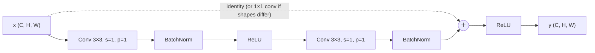
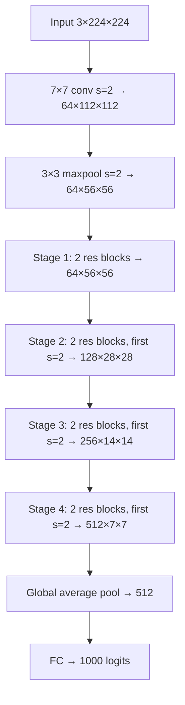
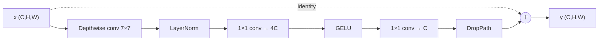

# 2.7 — Convolutional Neural Networks (CNN)

## 1. Overview

**What is it?** A Convolutional Neural Network is a neural network whose core operation is *convolution*: sliding a small learnable filter across an input (typically an image), computing a local dot product at every position. Stacked convolutional layers, interleaved with nonlinearities, normalization, and downsampling, build a hierarchy of features — edges, then textures, then object parts, then whole objects.

**Why does it exist?** A fully-connected [MLP](01-perceptron-mlp.md) on a 224×224×3 image needs 150,528 weights *per neuron* in the first layer and treats pixel (0,0) and pixel (100,100) as unrelated inputs. CNNs exploit two facts about images: **locality** (nearby pixels are correlated) and **translation equivariance** (a cat is a cat wherever it appears). Weight sharing across positions collapses millions of parameters into a few hundred per filter and bakes in the right inductive bias.

**What problem does it solve?** Learning from grid-structured data with spatial (or temporal) structure: image classification, object detection, segmentation, video, audio spectrograms, and 1D signals like ECG traces and DNA sequences.

**Where is it used?** AlexNet's 2012 ImageNet win started the modern deep-learning era; ResNet (2015) made 100+-layer training routine; today CNN backbones power photo search, medical imaging, autonomous-driving perception, OCR, and content moderation — and remain the efficiency champion even where [transformers](10-transformer.md) compete on accuracy.

## 2. Learning Objectives

After this chapter you will be able to:

- Write the 2D convolution (cross-correlation) equation for multi-channel inputs and define every index.
- Apply the output-shape formula $\lfloor (H + 2p - k)/s \rfloor + 1$ instantly, including dilated kernels.
- Count parameters and multiply–accumulate operations (FLOPs) for any convolutional layer.
- Explain and compute receptive-field growth across stacked, strided, and dilated convolutions.
- Explain max/average/global-average pooling and their effect on invariance and shape.
- Derive why residual connections ($y = F(x) + x$) fix the degradation problem and how gradients flow through them.
- Decompose a standard convolution into depthwise + pointwise parts and compute the ~$k^2$× cost savings.
- Explain dilated (atrous) convolution and where it beats pooling for dense prediction.
- Implement convolution three ways: naive loops, `im2col` + matrix multiply, and PyTorch `nn.Conv2d`.
- Build and train a ResNet-style CIFAR-10 classifier to >90% accuracy.
- Diagnose classic CNN bugs: shape mismatches, channel-order (HWC vs. CHW) errors, missing input normalization.
- Choose between CNNs and vision transformers for a given data/compute budget.

## 3. Prerequisites

| Chapter | Why you need it |
|---|---|
| [Linear Algebra](../phase-0-prerequisites/02-linear-algebra.md) | Convolution is batched dot products; `im2col` turns it into one big matrix multiply. |
| [Calculus](../phase-0-prerequisites/03-calculus.md) | Backprop through convolution uses the chain rule over shared weights. |
| [Perceptron & MLP](01-perceptron-mlp.md) | A CNN is an MLP with locality and weight sharing imposed; the head is literally an MLP. |
| [Backpropagation](02-backpropagation.md) | Training convolutions is standard backprop; gradients of shared weights sum over positions. |
| [Activations](03-activations.md) | ReLU/GELU sit after every conv layer. |
| [Optimizers](05-optimizers.md) | SGD + momentum and AdamW recipes referenced throughout. |
| [DL Regularization](06-regularization-dl.md) | BatchNorm and augmentation are structural parts of every modern CNN. |

## 4. Intuition

Imagine you're looking for your friend in a stadium crowd photo. You don't memorize the entire photo; you carry a small mental template — "red jacket, glasses" — and *slide it* over every region of the image, scoring each patch for how well it matches. That sliding template is a convolutional filter, and the grid of match scores it produces is a **feature map**.

Now imagine a company's document-processing mailroom. The first clerk only flags simple things: "there's a vertical line here", "a dark-to-light edge there". Their flags go to a second clerk who combines them: "vertical line + horizontal line meeting = corner". A third clerk combines corners and curves into "this looks like the letter A". No clerk sees the whole document at high resolution — each summarizes local patterns for the next — yet the chain ends with document-level understanding. That's a CNN's feature hierarchy: edges → textures → parts → objects, with each layer's "clerks" (filters) seeing a progressively larger effective region of the original image (the **receptive field**).

Two more everyday anchors:

- **Weight sharing** is like one quality inspector checking every bottle on a conveyor belt with the same checklist, instead of hiring a separate inspector per bottle position. Massively fewer "employees" (parameters), and a defect is caught no matter *where* on the belt it appears (translation equivariance).
- **Pooling** is summarizing a paragraph with its most important sentence: you keep the strongest signal in each neighborhood and discard exactly *where* in the neighborhood it occurred — a little positional amnesia that buys robustness to small shifts.

## 5. Real-world Motivation

- **Google Photos** recognizes faces, objects, and scenes in billions of images with CNN-based classifiers; Google's Inception family (GoogLeNet, Inception-v3) was designed for exactly this scale-vs-accuracy trade-off.
- **Tesla**'s Autopilot perception historically ran ResNet-style ("RegNet") convolutional backbones over multiple cameras, feeding per-camera CNN features into downstream fusion (later, transformer-based) heads — convolutions do the heavy pixel lifting.
- **Meta** uses CNN-based systems in content-moderation pipelines to flag policy-violating images and video at upload time, where per-image inference cost matters enormously — the efficiency motivation behind depthwise-separable designs.
- **Medical imaging** products (e.g., FDA-cleared triage tools from companies like Aidoc) run U-Net-style convolutional segmenters over CT/MRI volumes to flag hemorrhages and emboli.
- **Mobile vision everywhere:** Google's MobileNet line (depthwise-separable convolutions) was created so on-device features — portrait mode, live translation of text in the camera — run in real time within a phone's power budget.
- **Microsoft** Research's ResNet won ImageNet 2015 and its residual trick escaped vision entirely: transformers, and therefore every modern LLM, are built on residual connections.

## 6. Mathematical Foundations

### 6.1 2D convolution (cross-correlation, really)

For a single-channel input $X \in \mathbb{R}^{H\times W}$ and kernel $K \in \mathbb{R}^{k\times k}$:

$$(X \star K)_{i,j} = \sum_{u=0}^{k-1}\sum_{v=0}^{k-1} X_{i+u,\, j+v}\; K_{u,v}$$

where $(i,j)$ indexes the output position and $(u,v)$ the kernel offset. Strictly, this is *cross-correlation*; true convolution flips the kernel ($X_{i-u, j-v}$). Deep-learning libraries implement cross-correlation and call it convolution — since $K$ is *learned*, the flip is irrelevant (the network would just learn the flipped kernel).

**Multi-channel, multi-filter.** Real layers map $C_{in}$ input channels to $C_{out}$ output channels. With input $X \in \mathbb{R}^{C_{in}\times H\times W}$ and weights $W \in \mathbb{R}^{C_{out}\times C_{in}\times k\times k}$, bias $b \in \mathbb{R}^{C_{out}}$:

$$Y_{o,i,j} = b_o + \sum_{c=0}^{C_{in}-1}\sum_{u=0}^{k-1}\sum_{v=0}^{k-1} X_{c,\; si+u-p,\; sj+v-p}\; W_{o,c,u,v}$$

with stride $s$ and zero-padding $p$ (out-of-range indices read as 0). Each output channel $o$ is one 3D filter's response summed across *all* input channels: a filter detects a pattern *jointly* in space and channel content.

**Parameter count:** $C_{out}(C_{in}k^2 + 1)$. A 3×3 conv from 64 to 128 channels has $128(64 \cdot 9 + 1) = 73{,}856$ parameters — regardless of image size. A fully-connected layer between the same 56×56 feature maps would need $\sim 4 \times 10^{10}$.

### 6.2 Output-shape formula

$$H_{out} = \left\lfloor \frac{H_{in} + 2p - d\,(k-1) - 1}{s} \right\rfloor + 1$$

where $d$ is dilation (=1 for ordinary conv, giving the familiar $\lfloor (H+2p-k)/s\rfloor + 1$). Same formula for width. Memorize the three staple cases for $k=3, d=1$:

| Configuration | Effect |
|---|---|
| $k=3, p=1, s=1$ | "same" — size preserved |
| $k=3, p=1, s=2$ | halves spatial size (downsampling) |
| $k=1, p=0, s=1$ | 1×1 conv — size preserved, mixes channels only |

### 6.3 Pooling

- **Max pooling** ($k{\times}k$, usually $2{\times}2$, $s=2$): output is the max of each window — keeps the strongest activation, discards its exact position (local translation invariance). Backward pass routes the gradient only to the argmax element.
- **Average pooling:** window mean; gradient distributes uniformly.
- **Global average pooling (GAP):** average each channel's entire $H{\times}W$ map to a single number, giving a $(C,)$ vector. Replaces giant flatten+FC blocks (ResNet: GAP then one FC), works at any input resolution, and adds zero parameters.

Pooling has **no learnable parameters**. The same shape formula applies. Modern trend: many architectures replace pooling with stride-2 convolutions (learned downsampling), keeping only GAP at the end.

### 6.4 Receptive field

The receptive field (RF) of a unit is the region of the *input image* that can influence it. For a stack of layers with kernel sizes $k_\ell$ and strides $s_\ell$:

$$RF = 1 + \sum_{\ell=1}^{L} (k_\ell - 1) \prod_{m=1}^{\ell-1} s_m$$

Consequences: stacking stride-1 3×3 convs grows the RF *linearly* (+2 per layer); any stride-2 layer *doubles* the growth rate of everything after it. Two stacked 3×3 convs see 5×5 with $2 \times 9C^2 = 18C^2$ weights vs. a single 5×5's $25C^2$ — the same RF, fewer parameters, and an extra nonlinearity. This "small kernels, more depth" principle is VGG's core insight and remains the default.

### 6.5 Residual connections (ResNet)

Plain deep stacks suffer the **degradation problem**: a 56-layer plain CNN gets *worse training error* than a 20-layer one — not overfitting, but an optimization failure (deep identity-ish mappings are hard to learn through stacks of nonlinear layers). ResNet reformulates each block to learn a *residual* $F(x)$ relative to identity:

$$y = F(x; W) + x$$

If the optimal mapping is near identity, the block only needs $F \approx 0$ — easy (just drive weights toward zero). The gradient tells the deeper story. For a chain of $n$ residual blocks $x_{\ell+1} = x_\ell + F(x_\ell)$:

$$\frac{\partial \mathcal{L}}{\partial x_\ell} = \frac{\partial \mathcal{L}}{\partial x_n} \prod_{m=\ell}^{n-1}\left( I + \frac{\partial F(x_m)}{\partial x_m} \right) = \frac{\partial \mathcal{L}}{\partial x_n}\left( I + \text{cross terms} \right)$$

Expanding the product, one term is exactly $I$: **gradient reaches every layer undiminished through the identity path**, no matter the depth — vanishing gradients through the multiplicative chain can no longer kill learning. When $F$ changes shape (stride-2 or channel growth), the skip uses a 1×1 stride-matched conv projection.

### 6.6 Depthwise-separable convolution

Factor a standard conv into two cheap steps:

1. **Depthwise:** one $k{\times}k$ filter *per input channel*, no channel mixing — cost $C\,k^2\,H W$ MACs.
2. **Pointwise:** a $1{\times}1$ conv mixing channels $C_{in} \to C_{out}$ — cost $C_{in} C_{out} H W$ MACs.

Cost ratio vs. standard conv:

$$\frac{C_{in}k^2 HW + C_{in}C_{out}HW}{C_{in}C_{out}k^2 HW} = \frac{1}{C_{out}} + \frac{1}{k^2} \approx \frac{1}{9} \text{ for } k=3,\ C_{out} \gg 9.$$

An ~8–9× reduction in compute and parameters for a modest accuracy cost — the foundation of MobileNet, EfficientNet, and ConvNeXt's design.

### 6.7 Dilated (atrous) convolution

Insert $d-1$ zeros between kernel taps: the kernel samples positions $\{0, d, 2d, \dots\}$, covering an *effective* extent of $d(k-1)+1$ with only $k^2$ weights. A stack with dilations 1, 2, 4, 8 grows the receptive field **exponentially** with depth at constant cost and — crucially — **without downsampling**, preserving full resolution for dense prediction (semantic segmentation: DeepLab; audio generation: WaveNet). Beware "gridding" artifacts when stacking equal dilations: sawtooth schedules (1,2,5,1,2,5) mitigate.

### 6.8 Transposed convolution (upsampling)

Where stride-2 conv maps $H \to \sim H/2$, transposed conv maps $H \to \sim 2H$ with learnable weights: $H_{out} = (H_{in}-1)s - 2p + k$. Used by U-Net decoders and GAN generators (see [Autoencoders](11-autoencoders.md), [GANs](12-gan.md)). Checkerboard artifacts when $k$ is not divisible by $s$ have made "nearest-neighbor upsample + ordinary conv" a popular safer alternative.

### 6.9 `im2col`: convolution as matrix multiplication

Extract every $k{\times}k{\times}C_{in}$ input patch into a column of a matrix $X_{col} \in \mathbb{R}^{(C_{in}k^2) \times (H_{out}W_{out})}$, and flatten weights to $W_{row} \in \mathbb{R}^{C_{out} \times (C_{in}k^2)}$. Then the entire convolution is one GEMM:

$$Y = W_{row}\, X_{col} \in \mathbb{R}^{C_{out} \times (H_{out}W_{out})}$$

Same arithmetic, but expressed as dense matrix multiply, where GPUs and BLAS libraries are near peak efficiency. Cost: $X_{col}$ replicates each input pixel up to $k^2$ times ($k^2\times$ memory blow-up). Production libraries (cuDNN) choose among im2col-GEMM, FFT-based, and Winograd algorithms per layer shape.

### 6.10 Backpropagation through convolution (sketch)

Given upstream gradient $\partial\mathcal{L}/\partial Y$: the weight gradient is a convolution of the input with the upstream gradient, *summed over all positions* (weight sharing ⇒ gradients add); the input gradient is a "full" convolution of the upstream gradient with the *180°-rotated* kernel. In the im2col view both are just the two GEMM transposes: $\partial W = \partial Y \cdot X_{col}^\top$ and $\partial X_{col} = W^\top \partial Y$.

## 7. Visual Explanation

A residual block, the atom of modern CNNs:



A full classification network as a shape pipeline (ResNet-18 flavor, ImageNet):



Convolution mechanics in ASCII — a 3×3 kernel at one output position (stride 1, no padding):

```
 Input (5×5)                 Kernel (3×3)         Output (3×3)
 ┌───────────────┐
 │ 1  2  0  1  3 │           ┌─────────┐          ┌──────────┐
 │ 0 [1  1  2] 1 │           │ 1  0 −1 │          │ ·  ·  ·  │
 │ 2 [0  2  1] 0 │    ⋆      │ 1  0 −1 │    =     │ · (r) ·  │
 │ 1 [1  0  0] 2 │           │ 1  0 −1 │          │ ·  ·  ·  │
 │ 3  0  1  2  1 │           └─────────┘          └──────────┘
 └───────────────┘
 r = 1·1+1·0+2·(−1) + 0·1+2·0+1·(−1) + 1·1+0·0+0·(−1) = −1−1+1 = −1
 (this kernel is a vertical-edge detector: left column positive, right negative)
```

Receptive-field growth (each output pixel "sees" a widening cone of input):

```
 layer 3:            [•]           RF 7×7
 layer 2:          [• • •]         RF 5×5
 layer 1:        [• • • • •]       RF 3×3
 input:        [• • • • • • •]
```

## 8. Algorithm

Forward pass of one convolutional layer, and the canonical block recipe.

**Convolution layer (stride $s$, padding $p$):**

1. Zero-pad the input spatially by $p$ on all sides.
2. Compute $H_{out} = \lfloor (H + 2p - k)/s \rfloor + 1$ (same for $W_{out}$); allocate output $(N, C_{out}, H_{out}, W_{out})$.
3. For every image $n$, output channel $o$, and output position $(i,j)$: extract the input patch of shape $(C_{in}, k, k)$ starting at $(si, sj)$, take its dot product with filter $W_o$, add $b_o$.
4. (In practice) realize steps 3 as im2col + one GEMM, or let cuDNN pick the algorithm.

**Canonical CNN stage (repeat per stage, doubling channels while halving resolution):**

1. Conv 3×3 → BatchNorm → ReLU.
2. Conv 3×3 → BatchNorm.
3. Add the residual (identity, or 1×1 stride-matched projection) → ReLU.
4. First block of each new stage uses stride 2 to downsample.
5. Finish the network with GAP → fully-connected → logits.

```text
# Pseudocode: conv2d forward via im2col
pad X to X_p                                  # (N, C_in, H+2p, W+2p)
X_col ← im2col(X_p, k, s)                     # (N, C_in·k², H_out·W_out)
W_row ← reshape(W, (C_out, C_in·k²))
for n in 1..N:                                # batched GEMM in practice
    Y[n] ← W_row @ X_col[n] + b               # (C_out, H_out·W_out)
reshape Y to (N, C_out, H_out, W_out)
```

## 9. Worked Example

**Tiny example fully by hand.** Input 4×4 (one channel), kernel 2×2, stride 1, no padding.

$$X = \begin{pmatrix} 1 & 2 & 0 & 1 \\ 3 & 1 & 1 & 0 \\ 0 & 2 & 2 & 1 \\ 1 & 0 & 1 & 3 \end{pmatrix}, \qquad K = \begin{pmatrix} 1 & 0 \\ 0 & -1 \end{pmatrix}$$

Output size: $(4 + 0 - 2)/1 + 1 = 3$, so $Y \in \mathbb{R}^{3\times 3}$. Each entry is (top-left of patch) − (bottom-right of patch):

- $Y_{0,0} = 1 - 1 = 0$; $\quad Y_{0,1} = 2 - 1 = 1$; $\quad Y_{0,2} = 0 - 0 = 0$
- $Y_{1,0} = 3 - 2 = 1$; $\quad Y_{1,1} = 1 - 2 = -1$; $\ \ Y_{1,2} = 1 - 1 = 0$
- $Y_{2,0} = 0 - 0 = 0$; $\quad Y_{2,1} = 2 - 1 = 1$; $\quad Y_{2,2} = 2 - 3 = -1$

$$Y = \begin{pmatrix} 0 & 1 & 0 \\ 1 & -1 & 0 \\ 0 & 1 & -1 \end{pmatrix}$$

Now **max-pool** $Y$ with a 2×2 window, stride 1: each entry is the max of a 2×2 patch of $Y$, giving $\begin{pmatrix}1 & 1\\ 1 & 1\end{pmatrix}$ — the strong responses survive; their exact positions are forgotten.

**Shape/parameter drill (realistic).** ResNet-18's first stage on ImageNet: input 3×224×224 → 7×7 conv, 64 filters, $s=2$, $p=3$: $H_{out} = \lfloor(224 + 6 - 7)/2\rfloor + 1 = 112$ → 64×112×112. Parameters: $64(3\cdot 49 + 1) = 9{,}472$. MACs: $9{,}408 \times 112 \times 112 \approx 1.18 \times 10^8$ — one layer, a tenth of a GFLOP.

**Realistic training example.** LeNet-style CNN (two conv/pool stages + two FC layers) trains to ~99% on MNIST in under a minute on a laptop GPU; the ResNet-20 you'll build in §22 reaches >91% on CIFAR-10 in ~30 GPU-minutes. Compare: a same-parameter-count MLP plateaus near 55% on CIFAR-10 — locality and weight sharing are worth ~35 accuracy points.

## 10. Python from Scratch

Naive convolution (readable), im2col convolution (fast), and a correctness check.

```python
import numpy as np

def conv2d_naive(x, W, b, stride=1, pad=0):
    """Direct 4-loop convolution. x: (N,C_in,H,W), W: (C_out,C_in,kH,kW), b: (C_out,)"""
    N, C_in, H, Wd = x.shape
    C_out, _, kH, kW = W.shape
    x_p = np.pad(x, ((0, 0), (0, 0), (pad, pad), (pad, pad)))   # zero-pad H and W only
    Ho = (H + 2 * pad - kH) // stride + 1                       # output-shape formula
    Wo = (Wd + 2 * pad - kW) // stride + 1
    out = np.zeros((N, C_out, Ho, Wo))
    for n in range(N):                       # image in batch
        for o in range(C_out):               # output channel (one filter)
            for i in range(Ho):              # output row
                for j in range(Wo):          # output col
                    patch = x_p[n, :, i*stride:i*stride+kH, j*stride:j*stride+kW]
                    out[n, o, i, j] = np.sum(patch * W[o]) + b[o]   # local dot product
    return out


def im2col(x, kH, kW, stride=1, pad=0):
    """Unfold patches into columns: (N, C·kH·kW, Ho·Wo)."""
    N, C, H, Wd = x.shape
    x_p = np.pad(x, ((0, 0), (0, 0), (pad, pad), (pad, pad)))
    Ho = (H + 2 * pad - kH) // stride + 1
    Wo = (Wd + 2 * pad - kW) // stride + 1
    cols = np.zeros((N, C * kH * kW, Ho * Wo))
    idx = 0
    for i in range(Ho):
        for j in range(Wo):
            patch = x_p[:, :, i*stride:i*stride+kH, j*stride:j*stride+kW]
            cols[:, :, idx] = patch.reshape(N, -1)     # flatten (C,kH,kW) per image
            idx += 1
    return cols, Ho, Wo


def conv2d_im2col(x, W, b, stride=1, pad=0):
    """Convolution as ONE matmul per image — how real libraries do it."""
    N = x.shape[0]
    C_out, C_in, kH, kW = W.shape
    cols, Ho, Wo = im2col(x, kH, kW, stride, pad)      # (N, C_in·k², Ho·Wo)
    W_row = W.reshape(C_out, -1)                       # (C_out, C_in·k²)
    out = W_row @ cols + b[:, None]                    # broadcast: (N, C_out, Ho·Wo)
    return out.reshape(N, C_out, Ho, Wo)


def maxpool2d(x, k=2, stride=2):
    """Max pooling; also returns argmax mask needed for the backward pass."""
    N, C, H, Wd = x.shape
    Ho, Wo = (H - k) // stride + 1, (Wd - k) // stride + 1
    out = np.zeros((N, C, Ho, Wo))
    for i in range(Ho):
        for j in range(Wo):
            out[:, :, i, j] = x[:, :, i*stride:i*stride+k, j*stride:j*stride+k].max(axis=(2, 3))
    return out

# --- correctness check: both implementations must agree ---
rng = np.random.default_rng(0)
x = rng.standard_normal((2, 3, 8, 8))                  # batch 2, RGB, 8×8
W = rng.standard_normal((4, 3, 3, 3)) * 0.1            # 4 filters of 3×3
b = np.zeros(4)
y1 = conv2d_naive(x, W, b, stride=1, pad=1)
y2 = conv2d_im2col(x, W, b, stride=1, pad=1)
print(y1.shape, np.abs(y1 - y2).max())                 # expected: (2, 4, 8, 8)  ~1e-15
```

Both versions compute identical arithmetic; the naive loop is $O(N\,C_{out}C_{in}H_oW_ok^2)$ with terrible constants (Python loops), while im2col does the same FLOPs inside one optimized BLAS call at the price of a $k^2\times$ memory blow-up for `cols`. **Common bug:** in `im2col`, mixing up the patch flatten order (`C,kH,kW` vs `kH,kW,C`) — shapes still match, results are silently wrong. Always verify against the naive version, exactly as done above.

## 11. Library Implementation

A complete ResNet-style CIFAR-10 model in PyTorch, with the padding/stride/projection logic spelled out.

```python
import torch
import torch.nn as nn
import torch.nn.functional as F

class BasicBlock(nn.Module):
    """ResNet basic block: two 3×3 convs + identity (or projected) skip."""
    def __init__(self, c_in, c_out, stride=1):
        super().__init__()
        # bias=False everywhere: BatchNorm's β makes conv bias redundant.
        self.c1 = nn.Conv2d(c_in, c_out, 3, stride=stride, padding=1, bias=False)
        self.b1 = nn.BatchNorm2d(c_out)
        self.c2 = nn.Conv2d(c_out, c_out, 3, stride=1, padding=1, bias=False)
        self.b2 = nn.BatchNorm2d(c_out)
        # Skip path must match shape: 1×1 conv when stride≠1 or channels change.
        if stride != 1 or c_in != c_out:
            self.short = nn.Sequential(nn.Conv2d(c_in, c_out, 1, stride, bias=False),
                                       nn.BatchNorm2d(c_out))
        else:
            self.short = nn.Identity()

    def forward(self, x):
        y = F.relu(self.b1(self.c1(x)))       # conv → BN → ReLU
        y = self.b2(self.c2(y))               # conv → BN (no ReLU before the add!)
        return F.relu(y + self.short(x))      # residual add, then final ReLU

class ResNet20(nn.Module):
    """3 stages × 3 blocks, 16→32→64 channels — the classic CIFAR ResNet."""
    def __init__(self, num_classes=10):
        super().__init__()
        self.stem = nn.Sequential(nn.Conv2d(3, 16, 3, 1, 1, bias=False),
                                  nn.BatchNorm2d(16), nn.ReLU())
        self.stage1 = self._stage(16, 16, stride=1)   # 32×32 spatial
        self.stage2 = self._stage(16, 32, stride=2)   # 16×16
        self.stage3 = self._stage(32, 64, stride=2)   # 8×8
        self.head = nn.Linear(64, num_classes)

    def _stage(self, c_in, c_out, stride):
        return nn.Sequential(BasicBlock(c_in, c_out, stride),
                             BasicBlock(c_out, c_out), BasicBlock(c_out, c_out))

    def forward(self, x):                      # x: (N, 3, 32, 32)
        h = self.stage3(self.stage2(self.stage1(self.stem(x))))
        h = F.adaptive_avg_pool2d(h, 1).flatten(1)    # GAP: (N, 64, 8, 8) → (N, 64)
        return self.head(h)                           # logits (N, 10)

model = ResNet20()
print(sum(p.numel() for p in model.parameters()))     # expected: ~272k parameters

# For real applications: transfer learning from a pretrained backbone.
from torchvision import models
backbone = models.resnet18(weights=models.ResNet18_Weights.IMAGENET1K_V1)
backbone.fc = nn.Linear(backbone.fc.in_features, 10)  # swap the 1000-way head
# CRITICAL: inputs must be normalized with ImageNet mean/std, matching pretraining.
```

Training recipe that reaches >91% on CIFAR-10: SGD momentum 0.9, LR 0.1, weight decay 5e-4, cosine schedule, 200 epochs, random-crop(32, pad=4) + horizontal-flip augmentation (see [Optimizers](05-optimizers.md) and [DL Regularization](06-regularization-dl.md)). **Common bug:** feeding OpenCV images (H, W, C in BGR) straight into PyTorch (expects C, H, W in RGB) — the model trains, badly; convert with `img[:, :, ::-1].transpose(2, 0, 1)`.

## 12. Code Walkthrough

Shape trace of `ResNet20` on one CIFAR-10 batch:

| Tensor | Shape | Meaning |
|---|---|---|
| `x` | (128, 3, 32, 32) | Input batch, normalized RGB |
| after `stem` | (128, 16, 32, 32) | 16 feature maps, spatial size preserved (k=3, p=1, s=1) |
| after `stage1` | (128, 16, 32, 32) | 3 residual blocks, identity skips |
| after `stage2` | (128, 32, 16, 16) | First block: s=2 halves H,W; 1×1 projection on skip |
| after `stage3` | (128, 64, 8, 8) | Same pattern; RF now covers the whole 32×32 image |
| after GAP | (128, 64) | Per-channel spatial mean |
| `logits` | (128, 10) | One score per class |

Expected results: untrained, `logits.std()` ≈ small and loss ≈ $\ln 10 \approx 2.303$ (always sanity-check this); after epoch 1 with the recipe above, train accuracy ≈ 45–55%; final test accuracy ≥ 91%. Inputs: images normalized per-channel with dataset mean/std. Intermediate check worth automating: run a 1×3×32×32 dummy tensor through the model at construction time — shape errors surface immediately instead of mid-training.

## 13. Complexity Analysis

**Time (per conv layer):** each of the $H_{out}W_{out}$ output positions of each of the $C_{out}$ filters computes a $C_{in}k^2$ dot product:

$$\text{MACs} = N \cdot C_{out} \cdot H_{out} \cdot W_{out} \cdot C_{in} \cdot k^2$$

For ResNet-50 on 224×224 input this totals ≈ 4.1 GFLOPs per image. Depthwise-separable layers divide the bound by $\approx (1/C_{out} + 1/k^2)^{-1} \approx 9$ for $k=3$. FFT-based convolution achieves $O(HW \log HW)$ per channel pair (wins only for large kernels); Winograd reduces 3×3 conv multiplications ~2.25× and is what cuDNN often actually runs.

**Space:** weights $O(C_{out}C_{in}k^2)$ per layer — independent of resolution (the whole point vs. FC layers). Activations $O(N \cdot C \cdot H \cdot W)$ per layer *dominate* training memory because backprop must keep every layer's output; this is why batch size, not parameter count, usually limits CNN training memory, and why gradient checkpointing (§18) trades compute for memory. im2col temporarily inflates input memory by $k^2$×.

## 14. Advantages

- **Parameter efficiency:** a 3×3×64→128 conv layer has 74k parameters wherever it's applied; the equivalent dense layer at 56×56 resolution would need tens of billions. Concretely, ResNet-18 (11.7M params) crushes any trainable-size MLP on ImageNet.
- **Translation equivariance built in:** shift the input, the feature map shifts with it — the network need not re-learn "cat at top-left" and "cat at bottom-right" separately, which is why CNNs generalize from far less data than MLPs (CIFAR-10: ~90% vs. ~55% at equal parameters).
- **Hierarchical features transfer:** layer-1 filters converge to Gabor-like edge detectors on nearly any natural-image task, so ImageNet-pretrained backbones fine-tune to medical/satellite/retail domains with hundreds, not millions, of labels.
- **Hardware-friendly:** convolution = GEMM (via im2col/Winograd), sitting exactly in the GPU/TPU sweet spot; edge NPUs in phones have dedicated conv engines — real-time MobileNet inference on a phone draws milliwatts.
- **Resolution-flexible:** all-conv + GAP networks run at any input size — one trained model serves 224² thumbnails and 1024² scans (with recalibrated expectations, but no retraining).
- **Strong at small data scale:** CNN inductive biases beat [vision transformers](../phase-4-cv/01-image-classification.md) when training data is limited (ViT needs large-scale pretraining or heavy augmentation to match).

## 15. Disadvantages

- **Limited long-range modeling:** the receptive field grows slowly (linearly per stride-1 layer), and *effective* RF is smaller still (Gaussian-weighted); relating an object at the top-left to one at the bottom-right takes many layers. Transformers' attention connects any two positions in one step — the reason detection/segmentation heads went hybrid.
- **Equivariant, not invariant, and only to translation:** rotations, scale changes, and viewpoint shifts are *not* handled by the architecture — augmentation must paper over them, and fails for extreme cases (upside-down inputs).
- **Fixed grid assumption:** CNNs need regular grids; point clouds, graphs, and irregularly-sampled data need other machinery (graph neural networks).
- **Aliasing and shift-instability at stride boundaries:** a 1-pixel input shift can change stride-2 downsampling results — small adversarial or even benign shifts measurably change logits (motivating anti-aliased pooling).
- **Failure case — texture bias:** ImageNet-trained CNNs classify by texture more than shape (a cat-shaped image with elephant texture is called an elephant); this hurts robustness to distribution shift.
- **Failure case — tiny objects after heavy downsampling:** a 12-pixel pedestrian is 0.75 pixels at 1/16 resolution; detection architectures need feature pyramids precisely to fight this.

## 16. Common Mistakes

- **Losing spatial size unintentionally.** Forgetting `padding=1` on 3×3 convs shrinks maps by 2 per layer; ten layers eat 20 pixels and a 32×32 CIFAR image nearly vanishes. Fix: default to "same" padding $p = k//2$; assert expected shapes in a dummy forward pass.
- **Channel-order confusion.** OpenCV gives (H, W, C) BGR; PyTorch wants (N, C, H, W) RGB; matplotlib wants (H, W, C) RGB again. Symptom: mysterious low accuracy or swapped-color visualizations. Fix: one conversion utility, used everywhere, unit-tested.
- **Skipping pretrained-model input normalization.** torchvision's pretrained weights expect mean (0.485, 0.456, 0.406), std (0.229, 0.224, 0.225); raw [0,1] inputs cost you many accuracy points silently.
- **Flatten-dimension mismatch into the FC head.** Hard-coding `nn.Linear(64*8*8, …)` breaks the moment input resolution changes. Fix: GAP (`adaptive_avg_pool2d(h, 1)`) or `nn.LazyLinear`.
- **ReLU before the residual add.** Applying ReLU to $F(x)$ before adding $x$ restricts the residual branch to non-negative corrections; the standard block adds first, then activates.
- **Aggressive dropout on conv feature maps.** Pixel-wise dropout barely regularizes convs (neighbors are correlated) and hurts; use augmentation, weight decay, and (if needed) `Dropout2d` or stochastic depth — see [DL Regularization](06-regularization-dl.md).
- **Training from scratch on 500 images.** Transfer learning first; scratch training on tiny datasets is almost always the wrong call.

## 17. Best Practices

Production checklist:

- [ ] Start from a **pretrained backbone** (ResNet-50 / ConvNeXt / EfficientNet) unless you have ≥100k labeled images or a truly non-natural domain.
- [ ] Follow the **canonical stage design**: 3×3 convs, BN, ReLU/GELU; double channels when halving resolution; residual connections beyond ~10 layers; GAP head.
- [ ] `bias=False` on convs followed by BatchNorm.
- [ ] Standard augmentation floor: random-resized-crop + horizontal flip; add RandAugment/MixUp/CutMix for full recipes.
- [ ] Verify the **data pipeline visually**: plot a batch *after* augmentation and normalization (un-normalize for display) before any training run.
- [ ] Overfit a **single batch** to near-zero loss as a smoke test of the training loop.
- [ ] Track initial loss ≈ $\ln(\text{num classes})$; deviations mean a bug (wrong labels, wrong reduction, missing softmax assumptions).
- [ ] Budget with a **FLOPs/params table** per candidate architecture before training; measure real latency on the deployment device, not the training GPU.
- [ ] Freeze-then-unfreeze for fine-tuning: train the new head first (backbone frozen, BN in eval mode), then unfreeze with a 10× lower backbone LR.

## 18. Optimization Techniques

- **Mixed precision (bf16/fp16):** convs on tensor cores run 2–4× faster; use `torch.autocast`. Essentially free accuracy-wise for CNNs.
- **channels_last memory format:** `model.to(memory_format=torch.channels_last)` aligns tensors with tensor-core-friendly NHWC layout — commonly +10–30% throughput on Ampere+ GPUs.
- **`torch.compile` / graph fusion:** fuses conv+BN+ReLU chains, removing memory round-trips.
- **BN folding for inference:** merge BatchNorm affine parameters into conv weights at export (see [DL Regularization](06-regularization-dl.md)) — zero-cost normalization in production.
- **Quantization:** int8 post-training quantization of CNNs typically loses <1% accuracy while cutting latency and model size ~4× (TensorRT, ONNX Runtime, tflite).
- **Pruning:** structured channel pruning removes whole filters (real speedups, unlike unstructured sparsity on GPUs); classic pipelines prune 30–50% of ResNet channels with ~1 point accuracy cost after fine-tuning.
- **Gradient checkpointing:** recompute activations in backward to cut activation memory ~√depth-fold — lets you double batch size or input resolution.
- **Architecture-level efficiency:** depthwise-separable convs (§6.6), group convolutions, and squeeze-and-excitation give better accuracy-per-FLOP; pick MobileNet/EfficientNet-lite families for edge targets.
- **Deployment compilers:** TensorRT / Core ML / TVM select per-layer algorithms (Winograd vs. GEMM vs. FFT) and fuse aggressively — export via ONNX and benchmark.

## 19. Industry Applications

- **Google Photos / Google Lens:** CNN classifiers and embedding models for object, face, and text-in-image recognition across billions of user photos.
- **Tesla Autopilot:** convolutional backbones (RegNets) process eight camera streams in real time on in-car hardware; their outputs feed BEV fusion and planning — a canonical latency-constrained production CNN deployment.
- **Meta:** image-understanding CNNs in content moderation and accessibility (automatic alt-text) pipelines operating at feed scale.
- **Medical imaging:** U-Net-style convolutional segmenters (see [Segmentation](../phase-4-cv/03-segmentation.md)) in FDA-cleared products for stroke and hemorrhage triage (e.g., Aidoc, Viz.ai); the U-Net paper itself came from biomedical segmentation.
- **Amazon:** "Just Walk Out" cashierless stores rely on multi-camera CNN perception for person and product tracking; Amazon Rekognition sells CNN-based vision as an API.
- **Microsoft:** Azure Computer Vision OCR uses convolutional text detectors/recognizers; Office Lens document cleanup is CNN-driven.
- **Detection/segmentation stacks:** YOLO-family detectors and Mask R-CNN (both CNN-backboned — see [Object Detection](../phase-4-cv/02-object-detection.md)) run in retail analytics, industrial inspection, and sports broadcasting.

## 20. Interview Questions

### Beginner

- **Q: Give the output-size formula for a convolution and compute one example.**
  A: $H_{out} = \lfloor(H + 2p - k)/s\rfloor + 1$. Example: 32×32 input, $k=3$, $p=1$, $s=2$ → $\lfloor(32+2-3)/2\rfloor+1 = \lfloor 15.5\rfloor + 1 = 16$.
- **Q: Why do CNNs use far fewer parameters than MLPs on images?**
  A: Weight sharing — one $k{\times}k{\times}C_{in}$ filter is reused at every spatial position — plus local connectivity. Parameter count depends only on kernel size and channel counts, not image resolution.
- **Q: What does max pooling do, and what is its gradient?**
  A: It outputs the maximum of each window, downsampling the map and adding local translation invariance. The gradient flows only to the element that was the max; all others receive zero.
- **Q: What is a feature map?**
  A: The 2D grid of one filter's responses across all spatial positions — high values mark where the filter's pattern occurs in the input.
- **Q: What is global average pooling and why did it replace flatten+FC?**
  A: It averages each channel over all spatial positions, producing one value per channel. It has zero parameters, works at any input resolution, and removes the giant, overfit-prone FC layers of AlexNet/VGG-era heads.

### Intermediate

- **Q: Why is convolution translation *equivariant* but not *invariant*, and where does (approximate) invariance come from?**
  A: Equivariance: shifting the input shifts the feature map correspondingly — $f(T x) = T f(x)$. Invariance ($f(Tx) = f(x)$) is built up gradually by pooling and striding (discarding position locally) and completed by global average pooling.
- **Q: Two stacked 3×3 convs vs. one 5×5 conv — compare.**
  A: Same 5×5 receptive field; parameters $2\cdot 9C^2 = 18C^2$ vs. $25C^2$ (28% fewer); an extra nonlinearity between them increases expressiveness. This is why VGG-and-later designs use only small kernels.
- **Q: Derive the compute saving of a depthwise-separable conv.**
  A: Standard: $C_{in}C_{out}k^2HW$ MACs. Separable: depthwise $C_{in}k^2HW$ + pointwise $C_{in}C_{out}HW$. Ratio $= 1/C_{out} + 1/k^2 \approx 1/9$ for $k=3$ and large $C_{out}$ — roughly 9× cheaper.
- **Q: What is a 1×1 convolution for?**
  A: It's a per-pixel fully-connected layer across channels: used to reduce/expand channel dimension (bottlenecks), mix information after depthwise convs, add nonlinearity cheaply, and project residual skips when shapes change.
- **Q: What problem do residual connections solve — overfitting or optimization?**
  A: Optimization. Plain 56-layer nets had *higher training error* than 20-layer ones (degradation, not overfitting). The identity path makes near-identity mappings trivial to represent and gives gradients an unattenuated route to early layers.
- **Q: How does im2col make convolution fast, and what does it cost?**
  A: It unrolls every input patch into a matrix column so the whole layer becomes one dense GEMM, which BLAS/cuDNN execute near hardware peak. Cost: the patch matrix duplicates each pixel up to $k^2$ times — a $k^2\times$ transient memory increase.

### Advanced

- **Q: Show mathematically why gradients don't vanish through residual chains.**
  A: For $x_{\ell+1} = x_\ell + F(x_\ell)$, the Jacobian chain is $\prod_m (I + \partial F/\partial x_m)$; expanding, one additive term is exactly $I$, so $\partial\mathcal{L}/\partial x_\ell$ contains $\partial\mathcal{L}/\partial x_n$ *unmultiplied* by any weight matrices. Depth adds terms rather than multiplying factors — contrast a plain net's product of Jacobians whose norms compound exponentially.
- **Q: Compare effective vs. theoretical receptive field.**
  A: The theoretical RF ($1 + \sum(k_\ell - 1)\prod s_m$) bounds which inputs *can* influence a unit; the effective RF (Luo et al., 2016) — the gradient magnitude as a function of input position — is approximately Gaussian and much smaller, growing as $O(\sqrt{L})$ for stacked convs. Practical consequence: nominal "covers the whole image" claims overstate real context; dilations, attention, or deeper stacks are needed for genuinely long-range dependencies.
- **Q: How do dilated convolutions grow the receptive field, and what artifact must you manage?**
  A: A dilation-$d$ kernel samples inputs $d$ apart, giving effective extent $d(k-1)+1$ at unchanged parameter/FLOP cost; exponentially increasing schedules (1,2,4,8…) grow RF exponentially with depth without downsampling — key for segmentation (DeepLab) and WaveNet. Artifact: "gridding" — with repeated equal dilations, adjacent outputs see disjoint input lattices; fix with sawtooth dilation schedules or hybrid blocks.
- **Q: Your stride-2 downsampling makes predictions flip under 1-pixel input shifts. Why, and what helps?**
  A: Striding subsamples without a proper low-pass filter, so high-frequency content aliases: the sampled lattice sees different phases of the signal under shift. Anti-aliased downsampling (blur-then-stride, Zhang 2019), average pooling before stride, or higher-resolution heads mitigate.
- **Q: When would you still choose a CNN over a ViT today?**
  A: Small/medium datasets without large-scale pretraining (CNN inductive biases win), tight edge-latency/power budgets (dedicated conv hardware, int8-friendly), variable input resolutions, and dense-prediction tasks where hierarchical multi-scale features are natural. ViTs win with abundant pretraining data/compute and when global context dominates. Hybrids (ConvNeXt, or conv-stem ViTs) often take both benefits.

## 21. Coding Exercises

### Easy

1. Write a function that, given input shape, kernel, stride, padding, and dilation, returns the conv output shape; unit-test it against `nn.Conv2d` on ten random configurations. *Hint: the general formula in §6.2; watch the floor.*
2. Hand-craft 3×3 kernels for vertical edges, horizontal edges, and blur; apply them to a real photo with your `conv2d_naive` and visualize the feature maps. *Hint: Sobel kernels; normalize outputs for display.*

### Medium

1. Implement `im2col` and `col2im`, then write the full backward pass for convolution (input, weight, and bias gradients) and verify against `torch.autograd` to 1e-6. *Hint: $\partial W = \partial Y \cdot X_{col}^\top$; `col2im` scatter-adds overlapping patches.*
2. Build ResNet-20 (from §11) and train it on CIFAR-10 to >90% test accuracy with the standard recipe; then remove the skip connections and show the accuracy drop at equal budget. *Hint: keep everything else identical for a fair ablation.*
3. Visualize the first-layer filters of a pretrained ResNet-18 as small RGB images, and plot feature maps from layers 1, 2, and 4 for one input photo. *Hint: `model.conv1.weight` is (64, 3, 7, 7); normalize per-filter for display.*

### Hard

1. Implement depthwise-separable convolution from scratch (NumPy), verify against `nn.Conv2d(groups=C_in)` + 1×1 conv, and measure the FLOP ratio empirically on a MobileNet-style block. *Hint: depthwise = grouped conv with one group per channel.*
2. Implement a receptive-field calculator that walks an arbitrary sequential architecture and reports theoretical RF per layer; validate by gradient probing (backprop from one output pixel, measure the nonzero input region). *Hint: the RF recursion composes $(k_\ell, s_\ell)$ pairs; gradient probing reveals the *effective* RF too.*
3. Add Squeeze-and-Excitation blocks to your ResNet-20 and measure the accuracy/FLOPs trade-off; then channel-prune 30% of filters by BN-γ magnitude and fine-tune to recover accuracy. *Hint: SE = GAP → FC → sigmoid → channel-wise rescale.*

## 22. Mini Project

**CIFAR-10 classifier from scratch, done right.**

1. Set up the data pipeline: CIFAR-10 with random crop (pad 4), horizontal flip, and per-channel normalization; deterministic transforms for the test set; visualize one augmented batch.
2. Implement ResNet-20 exactly as in §11; assert the shape trace of §12 with a dummy input.
3. Smoke-test: overfit a single batch of 128 images to ~100% accuracy within a few hundred steps.
4. Train the full recipe: SGD momentum 0.9, LR 0.1, weight decay 5e-4, cosine annealing, 200 epochs, batch 128; log train/test accuracy every epoch.
5. Target: ≥ 92% test accuracy. Plot loss/accuracy curves and a confusion matrix; inspect the 20 most-confident errors.
6. Ablate one ingredient at a time (no augmentation / no BN / no residuals / no schedule) for 50-epoch runs and build a table attributing accuracy to each component.

## 23. Medium Project

**Transfer learning for fine-grained classification (bird species or your own dataset).**

1. Assemble a dataset of ~50–200 classes with a few hundred images each (e.g., CUB-200 birds); split train/val/test by *image source* to avoid leakage.
2. Load ImageNet-pretrained ResNet-50; replace the head; verify preprocessing matches pretraining normalization.
3. Phase 1 — linear probe: freeze the backbone (BatchNorm in eval mode), train only the head; record accuracy.
4. Phase 2 — fine-tune: unfreeze with discriminative LRs (head 1e-3, backbone 1e-4, AdamW), MixUp α=0.2, label smoothing 0.1, cosine schedule, ~30 epochs.
5. Add test-time augmentation (average logits over 5 crops/flips) and measure the gain.
6. Analysis: per-class accuracy, Grad-CAM visualizations of what the model attends to on correct vs. incorrect predictions, and an error taxonomy (background bias? pose? similar species?).
7. Stretch: swap the backbone for ConvNeXt-Tiny and compare accuracy, latency, and fine-tuning stability.

## 24. Advanced Project

**Modern-CNN reproduction and efficiency study: ConvNeXt-Tiny vs. ViT-Tiny on ImageNet-100.**

Architecture under study — a ConvNeXt block modernizes the ResNet block with a depthwise 7×7, LayerNorm, and an inverted MLP:



Implementation phases:

1. **Data:** build ImageNet-100 (100-class subset); training pipeline with RandAugment, MixUp, CutMix, random erasing; deterministic eval pipeline.
2. **Models:** implement ConvNeXt-Tiny from the paper (stage depths 3-3-9-3, widths 96-192-384-768, stochastic depth 0.1); take ViT-Tiny from timm as the comparison.
3. **Training:** identical modern recipe for both — AdamW (lr 4e-3, wd 0.05), cosine + 20-epoch warmup, label smoothing 0.1, EMA of weights, 300 epochs, mixed precision, channels_last.
4. **Evaluation:** top-1/top-5, FLOPs and parameter counts, training throughput (img/s), and inference latency at batch 1 and 64 on GPU and CPU.
5. **Efficiency pass:** export both to ONNX; int8-quantize the ConvNeXt with TensorRT/ONNX Runtime; report the accuracy/latency Pareto table.
6. **Report:** which model wins at equal compute, at equal data, and at edge-latency constraints; relate findings to the inductive-bias discussion in §15.

Possible improvements: add a knowledge-distillation phase (big teacher → tiny student); test robustness on corrupted validation sets (ImageNet-C-style); try progressive resizing (train at 160², fine-tune at 224²) to cut training cost ~30%.

## 25. Summary

- Convolution = a small learned filter slid over the input, computing local dot products; libraries actually implement cross-correlation (the learned-kernel flip is irrelevant).
- Locality + weight sharing give translation equivariance and collapse parameter counts from billions (dense) to thousands (conv) per layer.
- Output shape: $\lfloor(H + 2p - d(k-1) - 1)/s\rfloor + 1$; the three staples are same-size (k3 p1 s1), halving (k3 p1 s2), and channel-mixing (1×1).
- Layer cost: $N C_{out} H_{out} W_{out} C_{in} k^2$ MACs; activation memory, not weights, dominates training memory.
- Receptive fields grow linearly through stride-1 stacks and multiplicatively past strided layers; effective RF is smaller than theoretical.
- Pooling (and striding) trade positional precision for invariance and compute; GAP replaces giant FC heads.
- Residual connections $y = F(x)+x$ fix the degradation problem: the identity term in the Jacobian product carries gradients to any depth — the single most exported idea from CNNs (transformers inherit it).
- Depthwise-separable convolution cuts cost ≈ $k^2$-fold (MobileNet/EfficientNet); dilated convolution grows RF exponentially at full resolution (DeepLab/WaveNet).
- im2col turns convolution into one GEMM — the reason convs run near hardware peak; verify custom kernels against a naive loop.
- Canonical design: [3×3 conv → BN → ReLU] blocks, double channels when halving resolution, residuals, GAP head; pretrained backbones before scratch training.
- CNNs still win on small data, edge latency, and dense prediction; transformers win with massive pretraining — and hybrids like ConvNeXt blur the line.

## 26. Cheat Sheet

| Item | Formula |
|---|---|
| Output size | $\lfloor(H + 2p - d(k-1) - 1)/s\rfloor + 1$ |
| "Same" padding | $p = k//2$ (odd $k$, $s=1$, $d=1$) |
| Parameters / layer | $C_{out}(C_{in}k^2 + 1)$ |
| MACs / layer | $C_{out} H_{out} W_{out} C_{in} k^2$ |
| Receptive field | $1 + \sum_\ell (k_\ell - 1)\prod_{m<\ell} s_m$ |
| Separable saving | $1/C_{out} + 1/k^2$ (≈ 1/9 for k=3) |
| Transposed conv out | $(H-1)s - 2p + k$ |
| Residual block | $y = \text{ReLU}(F(x) + x)$ |

**Defaults:** 3×3, pad 1; stride-2 to downsample; BN after conv (`bias=False`); GAP head; SGD-momentum 0.9 + wd 5e-4 or AdamW 4e-3/0.05; crop+flip minimum augmentation.
**One-liners:** initial CE loss ≈ ln(classes) • overfit one batch first • dummy-forward to catch shape bugs • pretrained > scratch below ~100k images.
**Gotchas:** HWC/BGR vs CHW/RGB • missing ImageNet normalization on pretrained backbones • ReLU before the residual add • hard-coded flatten sizes • pixel dropout on conv maps.

## 27. Further Reading

- **Books:** *Deep Learning* (Goodfellow, Bengio, Courville), Ch. 9 "Convolutional Networks"; *Dive into Deep Learning* (d2l.ai), CNN and modern-CNN chapters.
- **Research Papers:** LeCun et al., "Gradient-Based Learning Applied to Document Recognition" (LeNet, 1998); Krizhevsky et al., "ImageNet Classification with Deep CNNs" (AlexNet, 2012); Simonyan & Zisserman, "Very Deep Convolutional Networks" (VGG, 2015); He et al., "Deep Residual Learning" (ResNet, 2016) and "Identity Mappings in Deep Residual Networks" (2016); Howard et al., "MobileNets" (2017); Sandler et al., "MobileNetV2" (2018); Tan & Le, "EfficientNet" (2019); Yu & Koltun, "Multi-Scale Context Aggregation by Dilated Convolutions" (2016); Chen et al., "DeepLab" (2017); Liu et al., "A ConvNet for the 2020s" (ConvNeXt, 2022); Luo et al., "Understanding the Effective Receptive Field" (2016); Zhang, "Making Convolutional Networks Shift-Invariant Again" (2019); Ronneberger et al., "U-Net" (2015).
- **Documentation:** PyTorch `nn.Conv2d` / `nn.functional.conv2d` docs; torchvision models and training-recipe docs; cuDNN developer guide (convolution algorithms).
- **GitHub Repositories:** `pytorch/vision` (reference models + recipes); `facebookresearch/ConvNeXt`; `huggingface/pytorch-image-models` (timm — the de-facto model zoo); `ultralytics/ultralytics` (YOLO).
- **Datasets:** MNIST, CIFAR-10/100, ImageNet / ImageNet-100, CUB-200 (fine-grained), COCO (detection/segmentation).
- **YouTube/Videos:** Stanford CS231n (the classic CNN course; lectures on conv nets and architectures); Andrej Karpathy's CS231n lectures.
- **Blogs:** distill.pub "Feature Visualization" and "Zoom In: An Introduction to Circuits"; the ConvNeXt blog posts; CS231n course notes (cs231n.github.io) on convolutional networks.
