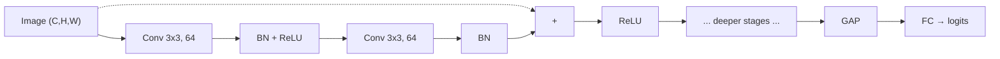

# 2.7 — Convolutional Neural Networks (CNN)

## 1. Intuition first
Images have local structure (nearby pixels correlate) and translation invariance (a cat is a cat wherever it appears). A convolution slides a small learnable filter across the image, detecting local patterns; stacking convs builds up features from edges → textures → parts → objects.

## 2. Why the topic exists
MLPs on raw pixels use too many parameters and ignore spatial locality. CNNs use weight sharing and locality, dramatically reducing parameters and building an inductive bias tailored to image-like data.

## 3. What problem it solves
Image / video / audio-spectrogram tasks: classification, detection, segmentation. Also 1D signals (audio, time series, DNA).

## 4. Mathematics

### 4.1 2D convolution (cross-correlation, really)
For input $X \in \mathbb{R}^{H\times W}$, kernel $K \in \mathbb{R}^{k\times k}$:

$$
(X * K)_{i,j} = \sum_{u=0}^{k-1}\sum_{v=0}^{k-1} X_{i+u, j+v} K_{u, v}
$$

Multi-channel: sum over input channels; produce multiple output channels.

### 4.2 Output shape
For input $H$, kernel $k$, padding $p$, stride $s$: $\text{out} = \lfloor (H + 2p - k)/s \rfloor + 1$.

### 4.3 Pooling
- Max pool: take max over $k \times k$ window.
- Average pool: mean.
- Global average pool: reduce spatial dims to 1 × 1 (used in ResNet before FC).

### 4.4 Receptive field
Grows linearly with depth for stride-1 convs; multiplicatively with strided convs / pooling.

### 4.5 Residual connection (ResNet)
$y = F(x) + x$. Solves gradient degradation in very deep nets.

### 4.6 Depthwise separable conv
Depthwise: one filter per channel. Pointwise: 1×1 conv across channels. Used in MobileNet, EfficientNet for efficiency.

### 4.7 Dilated / atrous conv
Skip pixels → larger receptive field without more params (semantic segmentation).

### 4.8 Transposed conv / upsampling
Used in U-Net, GAN generators for spatial upsampling.

## 5. Every formula explained
- Convolution = local dot product with a small learned filter. Weight sharing → translation equivariance.
- Padding preserves spatial size; stride subsamples.
- Pooling adds translation invariance and reduces size.
- Residual = identity path; gradient flows unimpeded.

## 6. Variables
$C_{in}, C_{out}$ input/output channels; $k$ kernel size; $s$ stride; $p$ padding; $d$ dilation.

## 7. Algorithm — a canonical CNN block
1. Conv2D → BN → ReLU.
2. Optional: another Conv → BN → ReLU.
3. Add residual.
4. Downsample (stride-2 conv or pool) every stage.

## 8. Simple example
LeNet-5 on MNIST: 2 conv/pool stages + 2 FC layers → 99% accuracy in seconds.

## 9. Real-world example
- AlexNet (2012) started the deep-learning revolution on ImageNet.
- ResNet unlocked training of 100+ layer networks.
- EfficientNet / ConvNeXt provide strong accuracy/compute trade-offs.
- YOLOv8, Mask R-CNN, U-Net use CNN backbones for detection/segmentation.

## 10. Diagram
```
Input → Conv → BN → ReLU → Conv → BN → (+ identity) → ReLU → Pool → ...
                                          ↑
                                      residual
```



## 11. Implementation from scratch — naive 2D conv
```python
import numpy as np

def conv2d_naive(x, W, b, stride=1, pad=0):
    # x: (N, C_in, H, W); W: (C_out, C_in, kH, kW); b: (C_out,)
    N, C_in, H, Ww = x.shape; C_out, _, kH, kW = W.shape
    x_p = np.pad(x, ((0,0),(0,0),(pad,pad),(pad,pad)))
    Ho = (H + 2*pad - kH) // stride + 1
    Wo = (Ww + 2*pad - kW) // stride + 1
    out = np.zeros((N, C_out, Ho, Wo))
    for n in range(N):
        for o in range(C_out):
            for i in range(Ho):
                for j in range(Wo):
                    r = x_p[n, :, i*stride:i*stride+kH, j*stride:j*stride+kW]
                    out[n, o, i, j] = (r * W[o]).sum() + b[o]
    return out
```

Efficient version uses `im2col` + matmul.

## 12. Implementation using libraries
```python
import torch.nn as nn
class BasicBlock(nn.Module):
    def __init__(self, c_in, c_out, stride=1):
        super().__init__()
        self.c1 = nn.Conv2d(c_in, c_out, 3, stride, 1, bias=False)
        self.b1 = nn.BatchNorm2d(c_out)
        self.c2 = nn.Conv2d(c_out, c_out, 3, 1, 1, bias=False)
        self.b2 = nn.BatchNorm2d(c_out)
        self.short = (nn.Identity() if stride == 1 and c_in == c_out
                      else nn.Sequential(nn.Conv2d(c_in, c_out, 1, stride, bias=False),
                                         nn.BatchNorm2d(c_out)))
    def forward(self, x):
        y = nn.functional.relu(self.b1(self.c1(x)))
        y = self.b2(self.c2(y))
        return nn.functional.relu(y + self.short(x))
```

Use `torchvision.models.resnet18(pretrained=True)` for real work.

## 13. Time complexity
Per conv layer: O(N × C_out × C_in × H_out × W_out × k²).

## 14. Space complexity
Weights O(C_out × C_in × k²). Activations O(N × C_out × H × W).

## 15. Advantages
Parameter efficient, translation equivariant, GPU-friendly, learns hierarchical features.

## 16. Disadvantages
Fixed receptive field; struggles with long-range dependencies (Transformers handle better).

## 17. Interview questions
1. Compute output size formula for conv.
2. Why is convolution translation equivariant, not invariant?
3. Explain receptive field growth.
4. What is a 1×1 convolution and why is it useful?
5. Depthwise-separable convs — savings?
6. What problem do residual connections solve?
7. Compare BN placement — before or after activation?
8. How do dilated convolutions work?
9. What is global average pooling?
10. CNN vs ViT trade-offs.

## 18. Common mistakes
- Forgetting to add padding → spatial dim shrinks too fast.
- Using dropout in conv feature maps aggressively.
- Not converting HWC↔CHW between OpenCV and PyTorch.
- Missing normalization for pretrained-model inputs.

## 19. Optimization techniques
Depthwise-separable convs, group convs, mixed precision, channel-last memory format, torch.compile, TensorRT for deployment.

## 20. Coding exercises
1. Implement `im2col`-based conv.
2. Implement a mini ResNet (ResNet-20) for CIFAR-10 achieving > 90% accuracy.
3. Visualize learned filters and feature maps of layer-1.
4. Add Squeeze-and-Excitation blocks.

## 21. Mini project
CIFAR-10 classifier with ResNet-20 + strong augmentation, > 92% test accuracy.

## 22. Medium project
Transfer-learn ResNet-50 on your own image dataset (fine-grained bird species); use MixUp + label smoothing.

## 23. Advanced project
Reproduce ConvNeXt-Tiny on ImageNet-100 subset; benchmark against ViT-Tiny.

## 24. Where it is used in industry
Any product touching images: photo tagging, medical imaging, self-driving perception, video moderation, OCR.

## 25. How companies use it
- Tesla: convolutional backbone for perception before Transformer heads.
- Google Photos: face and object recognition.
- Radiology AI (e.g., Aidoc): U-Net variants for segmentation.

## 26. When NOT to use it
- Very long-range dependencies without hierarchy → prefer Transformers.
- Extremely small or purely tabular data.
