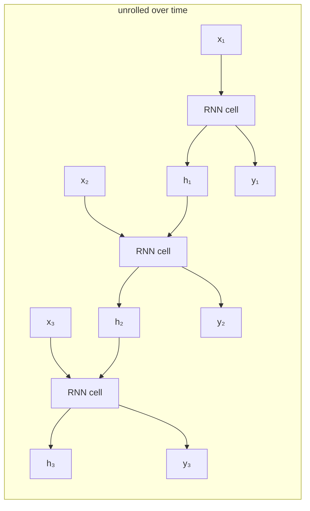
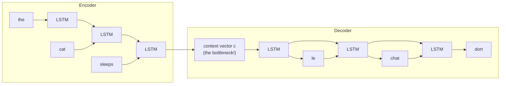
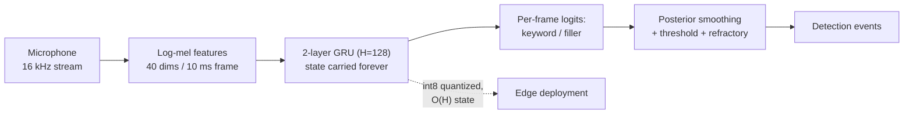

# 2.8 — RNN, LSTM, GRU

## 1. Overview

**What is it?** A Recurrent Neural Network (RNN) processes a sequence one element at a time while carrying a **hidden state** — a fixed-size vector summarizing everything seen so far — forward from step to step. LSTM (Long Short-Term Memory) and GRU (Gated Recurrent Unit) are gated refinements that control, with learned sigmoid "valves", what the network remembers and forgets.

**Why does it exist?** Sequence data — text, speech, sensor streams, stock prices — has variable length and order-dependent meaning. An MLP needs fixed-size input and has no notion of order; a [CNN](07-cnn.md) sees only a fixed local window. RNNs solve both by *sharing one set of weights across time steps* and threading state through the sequence.

**What problem does it solve?** Modeling temporal dependencies of arbitrary length with a fixed parameter budget: predicting the next word, transcribing audio, forecasting demand, translating sentences. LSTMs specifically solve the **vanishing gradient problem** that prevents vanilla RNNs from learning dependencies spanning more than ~10–20 steps.

**Where is it used?** RNNs (mainly LSTM) dominated NLP and speech from roughly 2014–2018 — Google Translate's first neural system was an 8-layer LSTM stack. [Transformers](10-transformer.md) have since taken over NLP, but recurrent models persist in streaming speech recognition, on-device inference, time-series forecasting, and are conceptually resurgent in modern state-space models (Mamba). Understanding them is also the fastest route to understanding *why* [attention](09-attention.md) was invented.

## 2. Learning Objectives

After this chapter you will be able to:

- Write the vanilla RNN recurrence and unroll it through time, defining every symbol.
- Explain backpropagation through time (BPTT) and truncated BPTT, including exactly what gets summed and why.
- Derive why the gradient $\partial h_t/\partial h_k$ vanishes or explodes as $(t-k)$ grows, via the product of Jacobians.
- Write all four LSTM equations from memory, derive the role of each gate, and explain why the *additive* cell-state update defeats vanishing gradients.
- Write the GRU equations and articulate the design trade-offs vs. LSTM (parameter count, coupled gates, no separate cell).
- Explain bidirectional RNNs and identify tasks where they are illegal (autoregressive generation, streaming).
- Describe the encoder–decoder (seq2seq) pattern, teacher forcing, and the context-vector bottleneck that motivates attention.
- Implement a vanilla RNN forward *and* backward pass in NumPy, and a manual LSTM cell verified against PyTorch.
- Apply gradient clipping, sequence packing, and truncated BPTT in a real PyTorch training loop.
- Diagnose exploding/vanishing gradients from training curves and gradient-norm logs.
- Decide, for a given production task, between an RNN, a transformer, or a hybrid.

## 3. Prerequisites

| Chapter | Why you need it |
|---|---|
| [Calculus](../phase-0-prerequisites/03-calculus.md) | BPTT is the chain rule applied along a temporal chain of Jacobians. |
| [Linear Algebra](../phase-0-prerequisites/02-linear-algebra.md) | Hidden-state updates are matrix–vector products; eigenvalues explain gradient explosion. |
| [Backpropagation](02-backpropagation.md) | BPTT is ordinary backprop on the unrolled computation graph. |
| [Activations](03-activations.md) | tanh and sigmoid saturations are central to the vanishing-gradient story. |
| [Optimizers](05-optimizers.md) | RNN training relies on gradient clipping and careful learning rates. |
| [Loss Functions](04-loss-functions.md) | Per-step cross-entropy summed over time is the standard sequence loss. |

## 4. Intuition

Reading a novel, you don't re-read pages 1–199 to understand page 200. You carry a **running mental summary** — who the characters are, what just happened — and update it sentence by sentence. That summary is the hidden state $h_t$: fixed size (your working memory doesn't grow with the book), updated by the same "reading procedure" (shared weights) at every sentence.

The vanilla RNN's flaw maps to a familiar experience: the game of **telephone**. A message whispered through 30 people arrives garbled, because every retelling slightly transforms it. In an RNN, information from step 3 must survive being *multiplied through a weight matrix and squashed through tanh* at steps 4, 5, …, 100 — after enough retellings, the original signal (and, crucially, its gradient) is gone.

The LSTM's fix is to add a **conveyor belt** running alongside the whisper chain: the cell state $c_t$. Items placed on the belt travel forward *untouched by default* — modification requires a deliberate action. Three gatekeepers with learned judgment stand along the belt:

- the **forget gate** decides what to remove from the belt ("the subplot about the aunt is over — drop it"),
- the **input gate** decides what new information to place on it ("new character introduced — keep her name"),
- the **output gate** decides what part of the belt's contents is relevant *right now* ("for this sentence, I need the current scene's location").

The GRU is the same idea with a leaner crew: one gatekeeper decides simultaneously "how much old to keep = how much new to skip" (update gate), and another controls how much history feeds into the new proposal (reset gate). Fewer decisions, fewer parameters, often just as effective.

## 5. Real-world Motivation

- **Google** launched GNMT (Google Neural Machine Translation) in 2016: 8 encoder + 8 decoder LSTM layers with attention, cutting translation errors by ~60% versus the previous phrase-based system — the single most visible RNN deployment in history.
- **Apple, Google, Amazon voice assistants** ran LSTM-based speech recognition and wake-word detection for years; streaming ASR still commonly uses RNN-Transducer (RNN-T) architectures because recurrence naturally processes audio *as it arrives*, unlike attention over a whole utterance.
- **Baidu's Deep Speech 2** (2015) used bidirectional recurrent layers over spectrograms — a landmark end-to-end speech system.
- **Amazon** has used sequence models including RNNs for demand forecasting (the DeepAR model, offered in SageMaker, is LSTM-based) across millions of products.
- **Tesla** and other embedded ML teams use small recurrent networks where per-step latency and memory beat transformers: a hidden state is $O(H)$ memory versus a KV-cache growing with sequence length.
- **Why you must learn this anyway in the transformer era:** the seq2seq encoder–decoder pattern, teacher forcing, the context bottleneck, and gating are the direct intellectual ancestors of [attention](09-attention.md) and the [Transformer](10-transformer.md) — those chapters assume this one.

## 6. Mathematical Foundations

Notation: $x_t \in \mathbb{R}^{D}$ is the input at time $t$ (e.g., a word embedding), $h_t \in \mathbb{R}^{H}$ the hidden state, $T$ the sequence length, $\sigma$ the logistic sigmoid, $\odot$ elementwise product. $[h_{t-1}, x_t]$ denotes concatenation.

### 6.1 Vanilla RNN

$$h_t = \tanh(W_{xh}\, x_t + W_{hh}\, h_{t-1} + b_h), \qquad y_t = W_{hy}\, h_t + b_y$$

with $W_{xh} \in \mathbb{R}^{H\times D}$ (input-to-hidden), $W_{hh} \in \mathbb{R}^{H\times H}$ (hidden-to-hidden, the *recurrent* weights), $W_{hy} \in \mathbb{R}^{V\times H}$ (hidden-to-output), biases $b_h, b_y$, and $h_0$ typically $\mathbf{0}$. **The same weights are used at every step** — the network is one cell, unrolled. Parameter count is independent of $T$: $H(D + H + 1) + V(H+1)$.

The sequence loss sums per-step losses, e.g. cross-entropy for language modeling: $\mathcal{L} = \sum_{t=1}^{T} \mathcal{L}_t(y_t, \text{target}_t)$.

### 6.2 Backpropagation Through Time (BPTT)

Unroll the recurrence into a $T$-layer feedforward graph *with tied weights* and run standard backprop. Because $W_{hh}$ is reused at every step, its gradient **sums contributions from all steps**:

$$\frac{\partial \mathcal{L}}{\partial W_{hh}} = \sum_{t=1}^{T} \sum_{k=1}^{t} \frac{\partial \mathcal{L}_t}{\partial h_t} \left( \prod_{m=k+1}^{t} \frac{\partial h_m}{\partial h_{m-1}} \right) \frac{\partial h_k}{\partial W_{hh}}$$

The inner product of Jacobians is the crux. For the vanilla RNN:

$$\frac{\partial h_m}{\partial h_{m-1}} = \operatorname{diag}\!\big(1 - h_m^2\big)\; W_{hh}$$

(since $\tanh'(z) = 1 - \tanh^2(z)$, and $h_m = \tanh(\cdot)$).

**Vanishing/exploding gradients.** The long-range factor is a product of $t-k$ such Jacobians. Its norm is bounded by $\big(\gamma_{\tanh}\, \|W_{hh}\|\big)^{t-k}$ where $\gamma_{\tanh} \le 1$ bounds the tanh derivative. Let $\lambda_{\max}$ be the largest singular value of $W_{hh}$:

- if effective $\lambda_{\max} \cdot \gamma < 1$: the product shrinks **exponentially** in $t-k$ → gradients from distant steps vanish; the network cannot learn long-range dependencies (in practice, beyond ~10–20 steps);
- if $> 1$: it grows exponentially → exploding gradients, loss spikes/NaNs.

Exploding gradients have a cheap fix — **gradient clipping** (rescale $g \leftarrow g \cdot \tau/\|g\|$ if $\|g\| > \tau$). Vanishing gradients cannot be fixed by rescaling (the *information* is gone, not just the scale); they require an architectural change. Enter the LSTM.

**Truncated BPTT:** for long sequences, backpropagate only $\tau \ll T$ steps back (process the sequence in chunks, carrying $h$ forward but detaching it from the graph between chunks). Cost drops from $O(T)$ to $O(\tau)$ memory; dependencies longer than $\tau$ receive no learning signal.

### 6.3 LSTM — gates derived from the failure they fix

Design goal: a memory that persists by *default*, where change is *gated*. Introduce a **cell state** $c_t \in \mathbb{R}^H$ with an additive update, and learn three gates (all functions of the current input and previous hidden state):

$$f_t = \sigma\big(W_f\,[h_{t-1}, x_t] + b_f\big) \qquad \text{forget gate: keep how much of each } c_{t-1} \text{ coordinate?}$$

$$i_t = \sigma\big(W_i\,[h_{t-1}, x_t] + b_i\big) \qquad \text{input gate: accept how much new content?}$$

$$\tilde c_t = \tanh\big(W_c\,[h_{t-1}, x_t] + b_c\big) \qquad \text{candidate: what new content, in } (-1,1)?$$

$$c_t = f_t \odot c_{t-1} + i_t \odot \tilde c_t \qquad \text{cell update: gated keep + gated write}$$

$$o_t = \sigma\big(W_o\,[h_{t-1}, x_t] + b_o\big) \qquad \text{output gate: reveal how much of the cell?}$$

$$h_t = o_t \odot \tanh(c_t)$$

Each $W_\bullet \in \mathbb{R}^{H \times (H+D)}$; total parameters $4H(H + D + 1)$ — exactly 4× a vanilla RNN cell, computed in practice as one fused matrix multiply producing $4H$ pre-activations.

**Why this defeats vanishing gradients.** Differentiate the cell path:

$$\frac{\partial c_t}{\partial c_{t-1}} = \operatorname{diag}(f_t) + \underbrace{\text{terms through } f_t, i_t, \tilde c_t}_{\text{gate dependencies on } h_{t-1}}$$

The dominant term is $\operatorname{diag}(f_t)$ — **no weight-matrix multiplication, no tanh squashing**, just an elementwise factor the network *learns to set*. Where the network sets $f_t \approx 1$, gradient flows across that step essentially undiminished; across $k$ steps the long-range factor is $\prod \operatorname{diag}(f)$, which the network can hold near 1 for as long as the information matters. It is the same "additive identity path" trick as the [ResNet residual](07-cnn.md) — a gated highway through *time* instead of depth. Practical corollary: initialize the forget-gate bias $b_f$ to +1 or +2 so training *starts* in the remember-by-default regime.

Sigmoid gates are the right nonlinearity because they output $(0,1)$ — interpretable as soft, differentiable fractions: 0 = fully closed valve, 1 = fully open. The candidate uses tanh so cell contents stay centered in $(-1, 1)$ and can encode both directions of a feature.

### 6.4 GRU — the streamlined gate design

The GRU (Cho et al., 2014) merges cell and hidden state and couples the forget/input decisions into a single **update gate**:

$$z_t = \sigma\big(W_z\,[h_{t-1}, x_t]\big) \qquad \text{update gate: how much to overwrite}$$

$$r_t = \sigma\big(W_r\,[h_{t-1}, x_t]\big) \qquad \text{reset gate: how much history feeds the proposal}$$

$$\tilde h_t = \tanh\big(W_h\,[\,r_t \odot h_{t-1},\ x_t\,]\big) \qquad \text{candidate state}$$

$$h_t = (1 - z_t) \odot h_{t-1} + z_t \odot \tilde h_t \qquad \text{interpolate old ↔ new}$$

The final line is a learned convex combination per coordinate: $z_t \to 0$ copies history exactly (gradient highway, coefficient $1 - z_t \approx 1$), $z_t \to 1$ replaces it. Three weight blocks instead of four: parameters $3H(H+D+1)$, ~25% fewer than LSTM. Empirically LSTM and GRU perform similarly; GRU trains slightly faster and is preferred when data or compute is modest, LSTM when an explicit long-term memory separate from the output (the $c_t$ vs. $h_t$ split) helps.

### 6.5 Stacked and bidirectional RNNs

**Stacked (deep):** layer $\ell$ consumes layer $\ell-1$'s hidden sequence: $h^{(\ell)}_t = \text{Cell}^{(\ell)}(h^{(\ell-1)}_t, h^{(\ell)}_{t-1})$. Two to four layers is typical; apply dropout *between layers only*, never across the time dimension (or use variational dropout with a mask fixed over time).

**Bidirectional:** run one RNN left-to-right ($\overrightarrow{h}_t$) and an independent one right-to-left ($\overleftarrow{h}_t$); concatenate $h_t = [\overrightarrow{h}_t; \overleftarrow{h}_t]$. Each position then sees full past *and* future context — valuable for tagging, encoding, offline ASR. **Illegal** wherever the future is unavailable: autoregressive generation and streaming/online inference.

### 6.6 Encoder–decoder (seq2seq) — a first look

To map an input sequence to an output sequence of *different* length (translation: 7 English words → 9 French words), the **encoder** RNN reads the source and its final state becomes a **context vector** $c = h^{enc}_{T}$; the **decoder** RNN is initialized from $c$ and generates output tokens autoregressively:

$$h^{dec}_t = \text{Cell}(y_{t-1},\ h^{dec}_{t-1}), \qquad p(y_t \mid y_{<t}, x) = \operatorname{softmax}(W\, h^{dec}_t)$$

**Teacher forcing:** during training, feed the *ground-truth* previous token $y_{t-1}$ rather than the model's own (possibly wrong) prediction — parallelizable and stable, but it creates *exposure bias*: at inference the model conditions on its own errors, a distribution it never saw in training (scheduled sampling partially mitigates).

**The bottleneck:** the entire source squeezes through one fixed-size vector $c$. Quality degrades sharply on long sentences — the empirical finding (Bahdanau et al., 2014) that led directly to [attention](09-attention.md), which lets the decoder look back at *all* encoder states. The full story continues in [Seq2seq](../phase-3-nlp-llm/03-seq2seq.md).

## 7. Visual Explanation

Unrolling one cell across time (weights shared at every step):



The LSTM cell — the top rail is the conveyor belt (cell state):

```
   c_{t-1} ──────⊗──────────────⊕──────────────────────▶ c_t
                 │              │                   │
               f_t (forget)   i_t ⊗ ĉ_t (write)    tanh
                 │              │                   │
   h_{t-1} ──┬──►σ──┐      ┌──σ─┴─tanh◄──┐         ⊗◄── o_t (output)
             │      │      │             │          │
   x_t ──────┴──────┴──────┴─────────────┴─────────▶ h_t
   (gates f, i, o and candidate ĉ all read [h_{t-1}, x_t])
```

Seq2seq and its bottleneck:



Gradient flow comparison across 100 steps:

```
 vanilla RNN:  grad ∝ ∏ diag(1−h²)·W_hh   →  ‖·‖ ≈ λ^100  → 0 (λ<1) or ∞ (λ>1)
 LSTM cell:    grad ∝ ∏ diag(f_t)          →  ≈ 1 wherever the net learns f_t ≈ 1
```

## 8. Algorithm

Training a character-level LSTM language model:

1. Build the vocabulary; encode the text as integer IDs; form (input, target) pairs where the target is the input shifted by one.
2. Initialize $h_0 = c_0 = \mathbf{0}$ (per sequence, or carried across chunks for truncated BPTT).
3. **Forward, for $t = 1..T$:** embed $x_t$; compute gates $f_t, i_t, o_t$ and candidate $\tilde c_t$ from $[h_{t-1}, x_t]$; update $c_t = f_t \odot c_{t-1} + i_t \odot \tilde c_t$; emit $h_t = o_t \odot \tanh(c_t)$; compute logits and per-step cross-entropy.
4. Sum the loss over time (and average over the batch).
5. **Backward (BPTT):** traverse $t = T..1$, accumulating gradients; recurrent weight gradients *sum* across steps.
6. **Clip the global gradient norm** (e.g., to 1.0) — non-negotiable for RNNs.
7. Optimizer step ([Adam/AdamW](05-optimizers.md)); for long texts, detach $h, c$ every $\tau$ steps (truncated BPTT) and continue.
8. Periodically sample from the model (feed its own predictions back in) to monitor quality.

```text
# Pseudocode: truncated BPTT training loop
h, c ← 0
for each chunk (x[1..τ], y[1..τ]) of the long sequence:
    h, c ← h.detach(), c.detach()          # cut the graph: gradients stop here
    loss ← 0
    for t in 1..τ:
        h, c ← LSTMCell(embed(x[t]), h, c)
        loss += cross_entropy(W·h, y[t])
    backprop(loss / τ)
    clip_grad_norm(params, 1.0)            # tame exploding gradients
    optimizer.step(); zero_grad()
```

## 9. Worked Example

**Tiny LSTM step fully by hand.** Scalar case ($H = D = 1$), so every quantity is a number. Suppose at step $t$ the pre-activations (after the $W[h_{t-1}, x_t] + b$ computations) come out as: forget 2.0, input −1.0, candidate 0.5, output 1.0, and the previous cell is $c_{t-1} = 0.8$.

- Forget gate: $f_t = \sigma(2.0) = 1/(1+e^{-2}) = 0.881$ — keep 88% of old memory.
- Input gate: $i_t = \sigma(-1.0) = 0.269$ — accept 27% of the new content.
- Candidate: $\tilde c_t = \tanh(0.5) = 0.462$.
- Cell update: $c_t = 0.881 \times 0.8 + 0.269 \times 0.462 = 0.705 + 0.124 = 0.829$.
- Output gate: $o_t = \sigma(1.0) = 0.731$.
- Hidden state: $h_t = 0.731 \times \tanh(0.829) = 0.731 \times 0.680 = 0.497$.

Gradient check on the highway: $\partial c_t/\partial c_{t-1} \approx f_t = 0.881$ — after 20 such steps, $0.881^{20} \approx 0.08$: still alive. A vanilla RNN factor of, say, 0.5 per step gives $0.5^{20} \approx 10^{-6}$: dead. And if the network *needs* the memory, it can learn to push $f_t \to 0.99$, giving $0.99^{20} \approx 0.82$.

**Vanishing gradient by the numbers (vanilla RNN).** Take scalar $w_{hh} = 0.9$ and tanh derivative ≈ 0.7 on average: the 30-step gradient factor is $(0.9 \times 0.7)^{30} = 0.63^{30} \approx 10^{-6}$ — a dependency 30 steps back contributes one-millionth of the learning signal. With $w_{hh} = 2.0$: $(2.0 \times 0.7)^{30} = 1.4^{30} \approx 2.4 \times 10^{4}$ — explosion.

**Realistic example.** Character-level language modeling on "hello": inputs `h,e,l,l`, targets `e,l,l,o`. Note the model must output different predictions for the two `l` inputs (first `l` → `l`, second `l` → `o`) — impossible for any stateless per-character classifier, trivial for an RNN whose hidden state distinguishes "first l" from "second l". Scaled up to the complete works of Shakespeare (~1M characters, 2-layer LSTM, $H=512$), the same setup generates passable pseudo-Elizabethan text after ~30 minutes on a GPU — the §22 project.

## 10. Python from Scratch

A vanilla RNN with a **complete BPTT backward pass** — the part tutorials usually skip — plus a manual LSTM step.

```python
import numpy as np

def rnn_forward(x, h0, Wxh, Whh, Why, bh, by):
    """x: (T, D) inputs; returns hidden states, logits, and a cache for backward."""
    T = x.shape[0]
    H = h0.shape[0]
    hs = np.zeros((T + 1, H)); hs[-1] = h0          # hs[t] = state AFTER step t; hs[-1] = h0
    ys = []
    for t in range(T):
        hs[t] = np.tanh(x[t] @ Wxh + hs[t - 1] @ Whh + bh)   # the recurrence
        ys.append(hs[t] @ Why + by)                          # per-step logits
    return hs, np.stack(ys), (x, hs)

def rnn_backward(dys, cache, Wxh, Whh, Why):
    """dys: (T, V) upstream gradients on logits. Full BPTT."""
    x, hs = cache
    T = x.shape[0]
    dWxh, dWhh, dWhy = np.zeros_like(Wxh), np.zeros_like(Whh), np.zeros_like(Why)
    dbh = np.zeros(Wxh.shape[1]); dby = np.zeros(Why.shape[1])
    dh_next = np.zeros(hs.shape[1])                 # gradient flowing back through time
    for t in reversed(range(T)):                    # walk time BACKWARD
        dWhy += np.outer(hs[t], dys[t])             # output-layer grads
        dby += dys[t]
        dh = dys[t] @ Why.T + dh_next               # from output AND from the future
        dz = (1.0 - hs[t] ** 2) * dh                # through tanh: tanh' = 1 - tanh²
        dWxh += np.outer(x[t], dz)                  # shared weights: grads SUM over t
        dWhh += np.outer(hs[t - 1], dz)
        dbh += dz
        dh_next = dz @ Whh.T                        # ∂h_t/∂h_{t-1} = diag(1−h²)·Whh
    for g in (dWxh, dWhh, dWhy, dbh, dby):          # gradient clipping — essential!
        np.clip(g, -5, 5, out=g)
    return dWxh, dWhh, dWhy, dbh, dby


def lstm_step(x_t, h_prev, c_prev, W, b):
    """One LSTM step. W: (H+D, 4H) fused weights; b: (4H,). Gate order: i, f, o, g."""
    H = h_prev.shape[0]
    z = np.concatenate([h_prev, x_t]) @ W + b       # ONE matmul → all 4 pre-activations
    i = 1 / (1 + np.exp(-z[:H]))                    # input gate  ∈ (0,1)
    f = 1 / (1 + np.exp(-z[H:2*H]))                 # forget gate ∈ (0,1)
    o = 1 / (1 + np.exp(-z[2*H:3*H]))               # output gate ∈ (0,1)
    g = np.tanh(z[3*H:])                            # candidate   ∈ (−1,1)
    c = f * c_prev + i * g                          # additive highway update
    h = o * np.tanh(c)
    return h, c

# --- demo: the vanishing-gradient measurement ---
rng = np.random.default_rng(0)
D, H, V, T = 8, 16, 8, 50
Wxh = rng.standard_normal((D, H)) * 0.3
Whh = rng.standard_normal((H, H)) * 0.3             # try * 1.5 to see EXPLOSION instead
Why = rng.standard_normal((H, V)) * 0.3
x = rng.standard_normal((T, D))
hs, ys, cache = rnn_forward(x, np.zeros(H), Wxh, Whh, Why, np.zeros(H), np.zeros(V))
dys = np.zeros((T, V)); dys[-1] = 1.0               # inject gradient ONLY at the last step
# measure how much reaches each earlier step:
dh = dys[-1] @ Why.T
norms = []
for t in reversed(range(T)):
    dz = (1 - hs[t] ** 2) * dh
    dh = dz @ Whh.T
    norms.append(np.linalg.norm(dh))
print([f"{n:.2e}" for n in norms[::10]])
# Expected: norms shrink by orders of magnitude as we go back in time — vanishing, visualized.
```

Complexity: forward and backward are both $O(T(DH + H^2 + HV))$ time and $O(TH)$ cached activations. **Common bug (worth internalizing):** forgetting `dh_next` and using only `dys[t] @ Why.T` as the hidden gradient — the code runs, loss even decreases, but no learning signal crosses time steps, so the model silently becomes a bag-of-recent-inputs. If your RNN "trains" but can't learn the second-`l`-vs-first-`l` distinction from §9, check this first.

## 11. Library Implementation

PyTorch's `nn.LSTM` with the production essentials: packing, clipping, and correct state handling.

```python
import torch
import torch.nn as nn

class CharLSTM(nn.Module):
    """2-layer LSTM language model: embed → LSTM → project to vocab."""
    def __init__(self, vocab_size, emb=128, hidden=512, layers=2, dropout=0.3):
        super().__init__()
        self.embed = nn.Embedding(vocab_size, emb)          # token IDs → dense vectors
        self.lstm = nn.LSTM(input_size=emb, hidden_size=hidden,
                            num_layers=layers, batch_first=True,
                            dropout=dropout)                # dropout BETWEEN layers only
        self.head = nn.Linear(hidden, vocab_size)

    def forward(self, ids, state=None):
        e = self.embed(ids)                                 # (B, T) → (B, T, emb)
        out, state = self.lstm(e, state)                    # out: (B, T, hidden)
        return self.head(out), state                        # logits: (B, T, vocab)

model = CharLSTM(vocab_size=96)
opt = torch.optim.AdamW(model.parameters(), lr=3e-4)
crit = nn.CrossEntropyLoss()

state = None
for ids, targets in loader:                                 # chunks of a long text stream
    if state is not None:                                   # truncated BPTT:
        state = tuple(s.detach() for s in state)            # carry state, cut the graph
    logits, state = model(ids, state)
    loss = crit(logits.reshape(-1, logits.size(-1)), targets.reshape(-1))
    opt.zero_grad(set_to_none=True)
    loss.backward()
    torch.nn.utils.clip_grad_norm_(model.parameters(), 1.0) # THE RNN essential
    opt.step()

# Variable-length batches: pack so the LSTM skips padding entirely.
from torch.nn.utils.rnn import pack_padded_sequence, pad_packed_sequence
lengths = (ids != PAD_ID).sum(1)                            # true length per sequence
packed = pack_padded_sequence(model.embed(ids), lengths.cpu(),
                              batch_first=True, enforce_sorted=False)
out, (h, c) = model.lstm(packed)                            # h: (layers, B, hidden)
out, _ = pad_packed_sequence(out, batch_first=True)         # back to (B, T, hidden)

# Bidirectional encoder (tagging / encoding tasks ONLY — never generation):
bi = nn.LSTM(128, 256, num_layers=2, batch_first=True, bidirectional=True)
# output feature size is 2*256 = 512 (forward ⧺ backward states)
```

Line-by-line notes: `batch_first=True` makes shapes (B, T, ·) — mixing this up with the default (T, B, ·) is the classic silent-transpose bug; `dropout=0.3` applies only between stacked layers (PyTorch never drops across time); detaching `state` between chunks implements truncated BPTT; without `pack_padded_sequence`, the LSTM burns compute on pad tokens *and* the final `h` reflects padding, corrupting downstream use. **Common bug:** using `h[-1]` for a bidirectional encoder thinking it summarizes the sequence — `h[-1]` is the *backward* direction's state at $t{=}0$-ish; you usually want `torch.cat([h[-2], h[-1]], dim=-1)`.

## 12. Code Walkthrough

Shape trace of `CharLSTM` on one training chunk, batch 64, chunk length 128, vocab 96:

| Tensor | Shape | Meaning |
|---|---|---|
| `ids` | (64, 128) | Integer character IDs |
| `self.embed(ids)` | (64, 128, 128) | Learned per-character vectors |
| `out` | (64, 128, 512) | Top-layer hidden state at every time step |
| `h` | (2, 64, 512) | Final hidden state of each layer (last time step) |
| `c` | (2, 64, 512) | Final cell state of each layer |
| `logits` | (64, 128, 96) | Next-character scores at every position |
| loss input | (8192, 96) vs (8192,) | Flattened (B·T) logits vs. targets |

Expected results: initial loss ≈ $\ln 96 \approx 4.56$ (uniform over the vocabulary — verify!); after one pass over ~1MB of Shakespeare, ≈ 1.8–2.0; a converged 2×512 model reaches ≈ 1.4 nats/char and samples recognizable English words. Internals worth checking: `torch.sigmoid` of the forget-gate pre-activations (accessible via `lstm.weight_hh_l0` slices) should drift upward during training as the model learns to retain context; the global grad-norm log should show occasional spikes being caught by clipping.

## 13. Complexity Analysis

**Time.** Per layer, per time step: input and recurrent matmuls cost $O(DH + H^2)$ (×4 for LSTM's fused gates, ×3 for GRU). Over a sequence: $O(T \cdot H(D + H))$ — *linear in sequence length*. Compare [self-attention](09-attention.md)'s $O(T^2 d)$: RNNs win asymptotically for long sequences. The catch is the **sequential dependency**: $h_t$ needs $h_{t-1}$, so the $T$ steps cannot be parallelized across time — a GPU processing batch 1 runs one tiny matmul at a time, badly under-utilized. Transformers do more FLOPs but all at once; this, not FLOP count, is why they train so much faster.

**Space.** Parameters: $4H(H+D+1)$ per LSTM layer (independent of $T$). Training activations: $O(T \cdot B \cdot H)$ per layer — every step's states must be cached for BPTT, which is exactly what truncated BPTT bounds to $O(\tau B H)$. **Inference is the RNN's superpower:** generating each next token needs only the current $(h, c)$ — $O(H)$ memory, constant in sequence length — versus a transformer's KV-cache growing as $O(T)$. This asymmetry keeps recurrence alive on-device and in streaming systems.

## 14. Advantages

- **Native variable-length handling:** one weight set serves 5-token and 500-token inputs alike — no fixed context window to engineer around; a fraud-detection model can consume however many transactions a user has.
- **Constant-memory streaming inference:** an on-device wake-word LSTM carries a few-KB state and processes audio frames as they arrive forever; a transformer would need an ever-growing (or awkwardly sliding) attention window.
- **Linear-time in sequence length:** $O(T)$ vs. attention's $O(T^2)$ — for a 100k-step sensor log, this is the difference between feasible and not.
- **Strong inductive bias for ordered, local-in-time data:** on small time-series datasets (energy-load forecasting with a few thousand series), LSTMs regularly beat transformers, which overfit without large-scale pretraining — the reason Amazon's DeepAR is LSTM-based.
- **The gating vocabulary generalizes:** highway networks, GRU-style update gates in graph networks, and the forget-gate-as-decay view in modern state-space models (Mamba) all descend from this chapter's math.

## 15. Disadvantages

- **No parallelism across time:** training throughput on GPUs is far below transformers of equal parameter count — the decisive reason NLP moved on. A 100-step sequence is 100 dependent kernel launches.
- **Long-range dependencies remain hard even for LSTMs:** gating stretches usable memory from ~10–20 steps to hundreds, but document-length (thousands of tokens) coherence empirically fails; content-based retrieval (attention) beats time-ordered decay.
- **The fixed-size state is a lossy bottleneck:** everything relevant must be crammed into $H$ numbers; seq2seq without attention visibly degrades beyond ~30-word sentences (the finding that launched attention).
- **Training fragility:** exploding gradients require clipping; results are sensitive to initialization (forget-gate bias!), and deep stacks (>4 layers) are hard to train without residual/highway additions.
- **Failure case — teacher-forcing exposure bias:** a translation model that trains only on gold prefixes can derail catastrophically at inference after its first wrong token, producing fluent nonsense.
- **Failure case — bidirectional misuse:** a bidirectional encoder accidentally used in a streaming pipeline silently reads "the future" in offline evaluation, then collapses in production where the future doesn't exist yet.

## 16. Common Mistakes

- **No gradient clipping.** Symptom: loss decreases for hours, then one spike/NaN destroys the run. Fix: `clip_grad_norm_(params, 1.0)` between `backward()` and `step()`, always, for anything recurrent.
- **Not detaching state between truncated-BPTT chunks.** Carrying `state` without `.detach()` makes the autograd graph span the entire corpus — memory climbs until OOM. Detach at every chunk boundary.
- **Ignoring padding.** Feeding padded batches without `pack_padded_sequence` (or masks) trains the model on pad tokens and takes the "final" hidden state from pad positions. Pack, or mask the loss and gather states at true lengths.
- **Shape confusion from `batch_first`.** `nn.LSTM` defaults to (T, B, D); most code elsewhere assumes (B, T, D). Pick `batch_first=True` and be consistent — the transposed version often *runs without error* and trains garbage.
- **Wrong final state for bidirectional encoders.** Use the concatenation of both directions' final states, not `h[-1]` alone (§11).
- **Dropout across time steps.** Naively dropping activations with a fresh mask each step destroys the memory the network is trying to keep; use inter-layer dropout or variational (time-constant-mask) dropout.
- **Evaluating a teacher-forced model only with teacher forcing.** Validation loss looks great; free-running generation is terrible. Always also evaluate autoregressive generation.
- **Forgetting to reset (or deliberately carry) state at sequence boundaries.** Carrying state across unrelated documents leaks context; resetting mid-document severs it. Make the choice explicit in the data loader.

## 17. Best Practices

Production checklist:

- [ ] Default cell: **LSTM** (or GRU when parameters are tight); forget-gate bias initialized to **+1**.
- [ ] **Clip global grad norm at 1.0**; log the pre-clip norm — its spikes are your early-warning system.
- [ ] 2 layers, hidden 256–1024, inter-layer dropout 0.2–0.5; add residual connections if stacking deeper.
- [ ] [AdamW](05-optimizers.md) at 1e-3 to 3e-4; truncated BPTT window 100–300 steps for long streams.
- [ ] Sort/bucket batches by length and **pack** them; mask the loss over padding.
- [ ] Bidirectional wherever the full sequence is available *and* the task isn't generative/streaming.
- [ ] Monitor: per-step loss vs. $\ln V$ at init, gradient norms, and *free-running* sample quality — not just teacher-forced perplexity.
- [ ] Use cuDNN-backed `nn.LSTM` (not a Python loop over `LSTMCell`) for 5–10× training speed; drop to `LSTMCell` only when you need custom per-step logic.
- [ ] Before committing to an RNN, benchmark a small [transformer](10-transformer.md) — unless you need streaming/constant-memory inference or have little data, it usually wins.

## 18. Optimization Techniques

- **Fused cuDNN kernels:** `nn.LSTM` fuses all four gates into one matmul per step and optimizes the time loop in C++/CUDA — never hand-roll the loop in Python for production training.
- **Truncated BPTT:** bounds activation memory to $O(\tau BH)$ and lets arbitrarily long streams train; choose $\tau$ ≥ the longest dependency you care about.
- **Sequence bucketing:** batching similar lengths together cuts padding waste (often 30–50% of compute on natural-language length distributions).
- **Mixed precision:** gate matmuls in bf16/fp16 with fp32 state accumulation; standard `torch.autocast` handles it.
- **Quantization for edge inference:** int8 LSTMs are well supported (TFLite, ONNX Runtime) because wake-word/keyword models live on microcontrollers; expect <1% accuracy loss with post-training quantization.
- **Alternative fast recurrences:** QRNN/SRU restructure the recurrence so the heavy matmuls parallelize across time and only a light elementwise recurrence stays sequential — 5–10× training speedups historically; modern state-space models (S4/Mamba) push the same idea further with parallel scans.
- **Activation checkpointing:** recompute per-step activations during backward to trade compute for the $O(T)$ activation memory when $\tau$ must be large.

## 19. Industry Applications

- **Google Translate (2016–2020 era):** GNMT's stacked LSTM encoder–decoder with attention served billions of daily translations before transformers replaced it — the archetypal production seq2seq system.
- **Streaming speech recognition (Google, Apple, Amazon):** RNN-Transducer models power on-device, as-you-speak transcription (e.g., Pixel's live dictation lineage) precisely because recurrence yields constant-latency, constant-memory streaming.
- **Amazon Forecast / SageMaker DeepAR:** LSTM-based probabilistic forecasting across retail demand, capacity planning, and finance — an RNN you can rent by the API call.
- **Keyword spotting and wake words ("Hey Siri"-class systems):** tiny recurrent/temporal models running continuously on low-power DSPs, where a transformer's memory profile is a non-starter.
- **Handwriting and gesture recognition:** stroke sequences on touchscreens (e.g., Google's handwriting input) are classic bidirectional-LSTM territory.
- **Finance and IoT:** irregular multivariate time series — risk scoring over transaction sequences, predictive maintenance from sensor streams — remain LSTM/GRU strongholds where datasets are too small for pretrking-scale transformers.

## 20. Interview Questions

### Beginner

- **Q: What makes an RNN different from an MLP?**
  A: An RNN maintains a hidden state carried across time steps and applies the *same* weights at every step, so it handles variable-length ordered input with a fixed parameter count; an MLP has fixed-size input, no state, and no notion of order.
- **Q: What is the hidden state, intuitively and formally?**
  A: Intuitively, a fixed-size running summary of everything seen so far. Formally, $h_t = \tanh(W_{xh}x_t + W_{hh}h_{t-1} + b_h)$ — a learned function of the current input and the previous summary.
- **Q: Name the LSTM gates and their jobs.**
  A: Forget gate ($f_t$): how much of the old cell state to keep. Input gate ($i_t$): how much of the new candidate to write. Output gate ($o_t$): how much of the (tanh-squashed) cell to expose as the hidden state.
- **Q: Why do gates use sigmoid but the candidate uses tanh?**
  A: Sigmoid outputs (0,1) — a differentiable fraction acting as a valve. The candidate carries *content*, so tanh's (−1,1) range keeps cell values centered and able to encode either direction of a feature.
- **Q: What is teacher forcing?**
  A: During seq2seq training, feeding the ground-truth previous token to the decoder instead of its own prediction — faster and more stable training, at the cost of exposure bias at inference time.

### Intermediate

- **Q: Derive why vanilla RNN gradients vanish.**
  A: BPTT's long-range term contains $\prod_{m=k+1}^{t} \partial h_m/\partial h_{m-1} = \prod \operatorname{diag}(1-h_m^2)W_{hh}$. Each factor's norm is at most $\gamma\|W_{hh}\|$ with $\gamma \le 1$ from tanh saturation; if that product's effective factor is below 1, the $(t-k)$-fold product decays exponentially, so distant steps contribute essentially zero gradient. Above 1, it explodes instead.
- **Q: Exactly how does the LSTM cell state fix this?**
  A: The cell update $c_t = f_t \odot c_{t-1} + i_t \odot \tilde c_t$ is *additive*: $\partial c_t/\partial c_{t-1} \approx \operatorname{diag}(f_t)$ — no repeated multiplication by a weight matrix, no activation squashing on the highway. The network can learn $f_t \approx 1$ to preserve gradients (and information) across arbitrarily many steps — the temporal analogue of a ResNet skip connection.
- **Q: LSTM vs. GRU — a complete comparison.**
  A: GRU merges cell and hidden state and couples forget/input into one update gate ($h_t = (1-z_t)\odot h_{t-1} + z_t \odot \tilde h_t$), using 3 weight blocks vs. LSTM's 4 (~25% fewer parameters, somewhat faster). LSTM's separate $c_t$/$h_t$ decouples what is *stored* from what is *exposed*, occasionally winning on tasks needing long, precise memory. Empirically they're usually comparable; try GRU first when compute-bound.
- **Q: What is truncated BPTT and what does it sacrifice?**
  A: Backpropagating only $\tau$ steps back: process long sequences in chunks, carrying the hidden state forward but detaching it from the graph between chunks. Memory falls from $O(TH)$ to $O(\tau H)$; the sacrifice is that no *learning signal* crosses chunk boundaries — dependencies longer than $\tau$ can be *used* at inference (state still flows) but never explicitly *trained*.
- **Q: When are bidirectional RNNs inapplicable, and why?**
  A: Whenever the future isn't available at prediction time: autoregressive generation (the future is what you're producing) and streaming/online inference (the future hasn't arrived). They're ideal for offline encoding: tagging, NER, offline ASR encoders.

### Advanced

- **Q: Why does clipping fix exploding but not vanishing gradients?**
  A: Explosion is a *scale* problem — the direction is informative but the magnitude destabilizes updates, so rescaling the norm preserves the signal. Vanishing is an *information* problem: the long-range contribution is exponentially small relative to short-range terms in the same summed gradient; multiplying the total gradient up rescales both equally and cannot recover the drowned-out component. Only architectural change (gated additive paths) or reparameterization fixes it.
- **Q: Where exactly can LSTM gradients still vanish?**
  A: (1) On the highway itself when the network sets $f_t < 1$ — memory decays by design at rate $\prod f$; (2) through the *gate computations*, which depend on $h_{t-1}$ via ordinary sigmoid/tanh paths — the full Jacobian $\partial c_t/\partial c_{t-1}$ has additional terms beyond $\operatorname{diag}(f_t)$ that behave like vanilla-RNN factors; (3) through the output path $h_t = o_t \odot \tanh(c_t)$ into the next step's gates. LSTMs stretch usable memory to hundreds of steps; they don't make it infinite.
- **Q: Analyze the seq2seq context-vector bottleneck information-theoretically and name the fix.**
  A: The encoder must compress an arbitrarily long source into a fixed $H$-dimensional vector; as source length grows, the information required exceeds what the fixed representation can hold, and empirically BLEU degrades sharply beyond ~30 words. Attention (Bahdanau, 2014) removes the bottleneck by letting the decoder compute a *fresh, content-weighted combination of all encoder states at every output step* — the representation capacity now scales with source length. This is the bridge to [Attention](09-attention.md).
- **Q: Why do transformers train so much faster than LSTMs despite doing more FLOPs?**
  A: The LSTM's $T$ steps are sequentially dependent — one small matmul at a time, leaving GPUs idle — while self-attention computes all positions' interactions in a few large, parallel matmuls. Hardware utilization, not asymptotic FLOP count ($O(T)$ vs. $O(T^2)$), dominates wall-clock at typical NLP lengths. RNNs retain the edge at inference (constant $O(H)$ state vs. a growing KV-cache) — the trade modern state-space models like Mamba try to win on both sides.
- **Q: You're deploying a sequence model on a microcontroller with 256 KB of RAM for always-on audio. Architecture and why?**
  A: A small (1–2 layer, $H \le 128$) unidirectional GRU/LSTM, int8-quantized: constant memory regardless of stream length, per-frame $O(H(D+H))$ compute, no attention cache, mature quantization support. A transformer needs a sliding window plus KV-cache and re-computation, blowing the RAM/power budget for marginal accuracy on short-range acoustic patterns.

## 21. Coding Exercises

### Easy

1. Extend the §10 code to train the char-level RNN on the string "hello world" until it reproduces it from the seed "h"; plot the loss. *Hint: greedy-sample in a loop, feeding each prediction back as the next input.*
2. Empirically map the vanishing/exploding boundary: run the §10 gradient-norm probe for recurrent-weight scales in {0.1, 0.3, 0.9, 1.1, 1.5}; plot gradient norm vs. steps-back on a log scale for each. *Hint: the transition should bracket $\|W_{hh}\| \approx 1$.*

### Medium

1. Implement a full LSTM *layer* (loop over `lstm_step` from §10) with backward pass, and verify gradients against `torch.autograd` on random data to 1e-5. *Hint: check one weight block at a time; the fused-gate slicing is where bugs hide.*
2. The **adding problem**: sequences of (random value, marker) pairs where exactly two markers are 1; the target is the sum of the two marked values. Train vanilla RNN, LSTM, and GRU at lengths T ∈ {30, 100, 300}; plot final MSE vs. T per architecture. *Hint: vanilla RNN should fail beyond T≈50 — that's the point.*
3. Implement teacher forcing *and* scheduled sampling (probability of using the model's own prediction ramps from 0 to 0.5) on a digit-sequence copy task; compare free-running accuracy. *Hint: sample the choice per time step, not per sequence.*

### Hard

1. Build a bidirectional-LSTM named-entity tagger on CoNLL-2003 with packed variable-length batches and masked loss; target ≥ 88 F1 with GloVe embeddings. *Hint: `pack_padded_sequence` + per-token loss mask; concatenate both directions per token.*
2. Implement an LSTM encoder–decoder for English→French on the Tatoeba/Multi30k small pairs, with teacher forcing and greedy + beam-search decoding (beam 5); report BLEU and show the quality drop vs. sentence length that motivates attention. *Hint: bucket by length; evaluate BLEU separately for length bins.*
3. Reproduce a QRNN or SRU cell (parallelizable recurrence) and benchmark training throughput vs. `nn.LSTM` at equal parameter count on a language-modeling task. *Hint: the matmuls leave the time loop; only an elementwise recurrence remains sequential.*

## 22. Mini Project

**Character-level Shakespeare generator.**

1. Download the Tiny Shakespeare corpus (~1.1 MB); build char↔ID maps (~65 symbols); encode the full text as one ID array.
2. Create a chunked loader: contiguous (input, target-shifted-by-one) pairs of length 128, batch 64, carrying LSTM state across chunks within an epoch (truncated BPTT).
3. Implement `CharLSTM` from §11 (2 layers, hidden 512, dropout 0.3); verify initial loss ≈ $\ln 65 \approx 4.17$.
4. Train with AdamW 3e-4 + gradient clipping 1.0 for ~20 epochs; log loss and pre-clip gradient norms.
5. Implement temperature sampling (divide logits by $\tau$ before softmax); generate 500-character samples at $\tau \in \{0.5, 0.8, 1.0, 1.3\}$ every few epochs and watch structure emerge: gibberish → words → line structure → character names with stage directions.
6. Final report: loss curve, best samples per temperature, and one paragraph on what the model clearly learned (spelling, formatting) vs. didn't (plot, long-range coherence).

## 23. Medium Project

**Seq2seq translation with — and without — the bottleneck (English → French).**

1. Prepare a small parallel corpus (Multi30k or filtered Tatoeba, ≤ 15-token sentences); tokenize per [Tokenization](../phase-3-nlp-llm/01-tokenization.md); build source/target vocabularies.
2. Implement the baseline: bidirectional-GRU encoder → context vector → GRU decoder with teacher forcing; train with masked cross-entropy and clipping.
3. Implement greedy decoding and beam search (beam 5, length normalization); evaluate BLEU on a held-out set.
4. Plot BLEU vs. source-sentence length; document the degradation on longer sentences — the bottleneck made visible.
5. Add Bahdanau-style additive attention over encoder states (a preview of [Attention](09-attention.md)); retrain identically.
6. Re-plot BLEU vs. length with attention; visualize attention weight matrices for a few sentences (they should approximate soft word alignments).
7. Deliverables: BLEU table (baseline vs. attention × greedy vs. beam), length-degradation plots, attention heatmaps, and a discussion connecting results to §6.6. Continue the theory in [Seq2seq](../phase-3-nlp-llm/03-seq2seq.md).

## 24. Advanced Project

**Streaming keyword-spotting system — RNN vs. the alternatives, deployed for real.**

Build an always-on "wake word" detector as production teams do: constant memory, frame-by-frame, quantized.



Implementation phases:

1. **Data:** Google Speech Commands dataset; pick 2–3 target words vs. filler; compute 40-dim log-mel features (10 ms hop); build long synthetic streams by concatenating utterances with background noise at varied SNRs.
2. **Model:** 2-layer unidirectional GRU (H=128) with a per-frame classification head; train on windows with frame-level labels, gradient clipping, and SpecAugment-style masking as regularization.
3. **Streaming evaluation:** run the model *statefully* frame-by-frame over 1-hour synthetic streams; implement posterior smoothing and a refractory period; report false-accepts/hour vs. false-reject rate (DET curve), not just accuracy.
4. **Baselines:** (a) a small 1D-CNN over sliding 1-second windows, (b) a tiny transformer with a sliding attention window; compare accuracy, per-frame FLOPs, state memory, and detection latency.
5. **Deployment pass:** int8 post-training quantization (ONNX Runtime or TFLite); measure real-time factor and memory on a Raspberry Pi-class device; verify the DET curve survives quantization.
6. **Report:** a table of DET-curve operating points, latency, and RAM per architecture, with a recommendation memo.

Possible improvements: RNN-T-style joint streaming decoder for multi-word phrases; knowledge distillation from a large offline bidirectional teacher into the streaming student; compare against a small Mamba/state-space block to connect with the modern recurrent revival.

## 25. Summary

- RNNs process sequences step by step with shared weights and a fixed-size hidden state — parameters independent of sequence length, memory a running summary.
- Training = BPTT: backprop on the unrolled graph; shared-weight gradients sum over time steps.
- The long-range gradient is a product of Jacobians $\operatorname{diag}(1-h^2)\,W_{hh}$; its norm decays or grows exponentially with distance → vanishing/exploding gradients, capping vanilla RNN memory at ~10–20 steps.
- Clipping fixes exploding gradients (a scale problem); vanishing needs architecture (an information problem).
- LSTM adds an additively-updated cell state with sigmoid gates: $c_t = f_t \odot c_{t-1} + i_t \odot \tilde c_t$; since $\partial c_t/\partial c_{t-1} \approx \operatorname{diag}(f_t)$, learned $f_t \approx 1$ keeps gradients alive — a ResNet-style highway through time. Initialize $b_f > 0$.
- GRU couples the gates ($h_t = (1-z_t)\odot h_{t-1} + z_t\odot\tilde h_t$): ~25% fewer parameters, usually comparable quality.
- Bidirectional RNNs read both directions — great for encoding/tagging, forbidden for generation and streaming.
- Seq2seq compresses the source into one context vector; the bottleneck degrades long inputs and directly motivated attention.
- Training essentials: clip at 1.0, truncated BPTT with detached state, packed padded sequences, teacher forcing (mind exposure bias).
- RNNs are $O(T)$ compute and $O(H)$ inference memory but sequential (GPU-unfriendly training); transformers are parallel but $O(T^2)$ with growing caches — hence RNNs' survival in streaming/edge, transformers' dominance elsewhere, and state-space models trying to claim both.

## 26. Cheat Sheet

| Model | Update | Params/layer |
|---|---|---|
| Vanilla RNN | $h_t = \tanh(W_{xh}x_t + W_{hh}h_{t-1} + b)$ | $H(D{+}H{+}1)$ |
| LSTM | $c_t = f_t \odot c_{t-1} + i_t \odot \tilde c_t$; $h_t = o_t \odot \tanh c_t$; $f,i,o = \sigma(\cdot)$, $\tilde c = \tanh(\cdot)$ | $4H(D{+}H{+}1)$ |
| GRU | $h_t = (1{-}z_t)\odot h_{t-1} + z_t\odot\tanh(W[r_t \odot h_{t-1}, x_t])$ | $3H(D{+}H{+}1)$ |

**Key facts:** gradient factor — vanilla $\prod \text{diag}(1{-}h^2)W_{hh}$ (vanishes/explodes) vs. LSTM $\prod \text{diag}(f_t)$ (learnable ≈ 1) • time $O(T\,H(D{+}H))$, sequential in $T$ • inference state $O(H)$, constant in length.
**Defaults:** 2 layers, H 256–1024, inter-layer dropout 0.3, AdamW 3e-4–1e-3, clip 1.0, truncated BPTT 100–300, forget-bias +1.
**One-liners:** detach state between chunks • pack padded sequences • initial loss ≈ ln(vocab) • evaluate free-running, not just teacher-forced • bidirectional ⇒ never for generation/streaming.
**Gotchas:** missing `dh_next` in hand-rolled BPTT • `batch_first` transposition • `h[-1]` on bidirectional encoders • dropout across time • no clipping → NaN hours in.

## 27. Further Reading

- **Books:** *Deep Learning* (Goodfellow, Bengio, Courville), Ch. 10 "Sequence Modeling: Recurrent and Recursive Nets"; *Dive into Deep Learning* (d2l.ai), RNN/LSTM/GRU and seq2seq chapters; Jurafsky & Martin, *Speech and Language Processing*, RNN chapters.
- **Research Papers:** Hochreiter & Schmidhuber, "Long Short-Term Memory" (1997); Cho et al., "Learning Phrase Representations using RNN Encoder–Decoder" (GRU, 2014); Sutskever, Vinyals & Le, "Sequence to Sequence Learning with Neural Networks" (2014); Bahdanau, Cho & Bengio, "Neural Machine Translation by Jointly Learning to Align and Translate" (2014); Pascanu, Mikolov & Bengio, "On the difficulty of training recurrent neural networks" (2013); Wu et al., "Google's Neural Machine Translation System" (GNMT, 2016); Graves, "Sequence Transduction with Recurrent Neural Networks" (RNN-T, 2012); Greff et al., "LSTM: A Search Space Odyssey" (2017); Jozefowicz et al., "An Empirical Exploration of Recurrent Network Architectures" (2015); Gu & Dao, "Mamba: Linear-Time Sequence Modeling with Selective State Spaces" (2023).
- **Documentation:** PyTorch `nn.RNN` / `nn.LSTM` / `nn.GRU` and `torch.nn.utils.rnn` (packing) docs; the PyTorch seq2seq translation tutorial.
- **GitHub Repositories:** `karpathy/min-char-rnn` (the 112-line classic) and `karpathy/char-rnn`; `bentrevett/pytorch-seq2seq` (superb annotated notebooks); `salesforce/awd-lstm-lm` (regularized LSTM language modeling).
- **Datasets:** Tiny Shakespeare (char-LM), Penn Treebank / WikiText-2 (word-LM), Multi30k and Tatoeba (small-scale translation), Google Speech Commands (keyword spotting), CoNLL-2003 (tagging).
- **YouTube/Videos:** Stanford CS224n lectures on RNNs, LSTMs, and seq2seq; Andrej Karpathy's RNN lecture (CS231n) and "Zero to Hero" series.
- **Blogs:** Christopher Olah, "Understanding LSTM Networks" (colah.github.io — the canonical LSTM explainer); Andrej Karpathy, "The Unreasonable Effectiveness of Recurrent Neural Networks"; distill.pub, "Attention and Augmented Recurrent Neural Networks".
