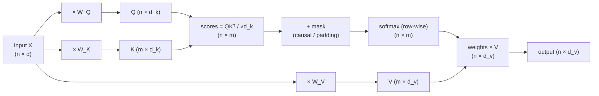
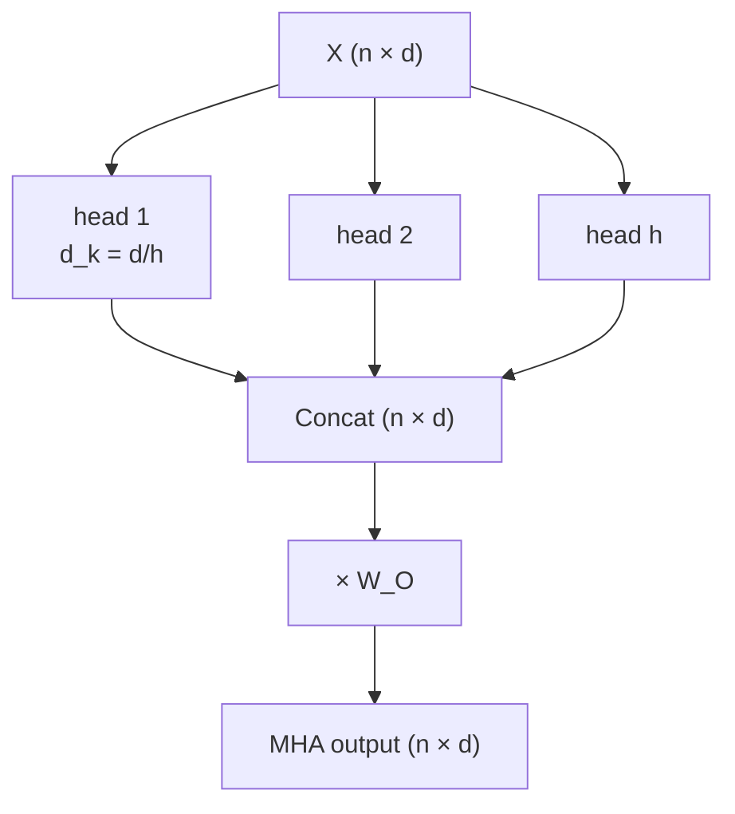
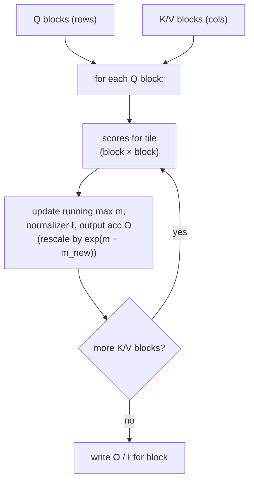

# 2.9 — Attention & Self-Attention

## 1. Overview

**What is it?** Attention is a mechanism that lets a neural network compute, for every output position, a *weighted average of input representations*, where the weights are learned similarities between what the output "wants" (a **query**) and what each input "offers" (a **key**). **Self-attention** is the special case where a sequence attends to itself: every token gathers information from every other token in a single, parallel operation.

**Why does it exist?** Recurrent networks (see [RNN, LSTM & GRU](08-rnn-lstm-gru.md)) compress an entire sequence into one fixed-size hidden vector — an information bottleneck that degrades badly on long sequences. Attention removes the bottleneck: instead of forcing information through one vector, every output position looks directly at every input position.

**What problem does it solve?** Three problems at once: (1) modeling **long-range dependencies** — token 1 and token 10,000 are one step apart, not 10,000 recurrent steps apart; (2) **parallelism** — unlike an RNN, all positions are processed simultaneously, so GPUs are fully utilized during training; (3) **interpretability** — the attention weights form a probability distribution you can visualize to see what the model "looked at."

**Where is it used?** Attention is the single most important building block of modern AI. Every large language model (GPT-4, Claude, Gemini, LLaMA), every Vision Transformer, Whisper for speech, CLIP for image–text alignment, and AlphaFold for protein folding is, at its heart, a stack of attention layers. The next chapter, [The Transformer](10-transformer.md), builds the full architecture around the attention primitive you learn here.

## 2. Learning Objectives

After this chapter you will be able to:

- State the scaled dot-product attention formula and define every symbol in it.
- Derive **why** we divide by $\sqrt{d_k}$ using the variance of a dot product of random vectors.
- Distinguish **self-attention** from **cross-attention** and know when each is used.
- Explain **multi-head attention**: how heads are split, computed in parallel, and recombined.
- Construct and apply **causal (autoregressive) masks** and **padding masks** correctly.
- Explain why attention is permutation-equivariant and why positional information must be injected.
- Compare sinusoidal, learned absolute, relative (T5), **RoPE**, and **ALiBi** positional encodings.
- Implement multi-head self-attention from scratch in NumPy and in PyTorch, with correct tensor shapes.
- Analyze the $O(n^2 d)$ time and $O(n^2)$ memory complexity, and explain how **FlashAttention** reduces memory traffic.
- Describe efficiency variants: MQA, GQA, sliding-window and sparse attention, and linear attention.
- Hand-compute an attention output for a tiny example and verify it against code.
- Answer standard interview questions about attention with confidence.

## 3. Prerequisites

| Chapter | Why you need it |
|---|---|
| [Linear Algebra](../phase-0-prerequisites/02-linear-algebra.md) | Attention is built from matrix multiplications, dot products, and projections. |
| [Probability & Statistics](../phase-0-prerequisites/04-probability-statistics.md) | Softmax produces a probability distribution; the $\sqrt{d_k}$ derivation uses variance. |
| [Backpropagation](02-backpropagation.md) | The projections $W_Q, W_K, W_V, W_O$ are learned by gradient descent through the attention computation. |
| [Activation Functions](03-activations.md) | Softmax is the key nonlinearity inside attention. |
| [Loss Functions](04-loss-functions.md) | Attention layers are trained end-to-end under a task loss such as cross-entropy. |
| [RNN, LSTM & GRU](08-rnn-lstm-gru.md) | Attention was invented to fix the fixed-vector bottleneck of recurrent seq2seq models. |

## 4. Intuition

Imagine you are translating the sentence *"the cat sat on the mat"* into French, and you have just reached the word *"sat"*. To choose the correct verb form, you must look back at the subject *"cat"*. A human translator's eyes literally dart back to the relevant word. Attention gives a neural network the same ability: for each output, it asks *"which inputs matter right now?"* and blends them proportionally to their relevance.

**The library analogy.** Think of attention as a fuzzy database lookup in a library:

- Your **query** is the question you walk in with: "I need material on 17th-century shipbuilding."
- Every book has a **key**: its index-card description.
- Every book also has a **value**: its actual contents.

A conventional database returns the single best match. Attention is softer: it compares your query with *every* key, converts the similarities into percentages (softmax), and hands you back a *blend* of all values — 70% of the best book, 20% of the second, 10% sprinkled over the rest. Because the blend is a smooth, differentiable function of the similarities, the network can *learn* what to look for.

**An everyday story.** At a dinner party you (the query) chat with ten guests. You subconsciously score each guest for relevance to the story you're telling — the marine biologist scores high when you mention scuba diving. Your mental summary of the evening is a weighted mixture of conversations, dominated by the most relevant ones. Self-attention runs this dinner party for *every token simultaneously*: each word in a sentence "chats" with every other word and walks away with a context-aware summary of the whole sentence. That is why the representation of "bank" ends up different in "river bank" versus "bank account" — the neighbors it attended to were different.

## 5. Real-world Motivation

- **Google** introduced attention-based Transformers in the 2017 paper *Attention Is All You Need* and deployed BERT — a stack of self-attention layers — into Google Search ranking in 2019, one of the largest improvements to search quality in years. Google Translate moved from RNN-based seq2seq to Transformer-based models for the same reason: better quality *and* faster training due to parallelism.
- **OpenAI** built the entire GPT family on masked (causal) self-attention; Whisper, their speech-recognition model, uses both self-attention and cross-attention between audio and text.
- **Meta** trains the LLaMA model family with rotary positional embeddings (RoPE) and grouped-query attention (GQA) — two of the refinements covered in this chapter — specifically to make attention cheaper at inference time.
- **Microsoft** integrates attention-based models throughout GitHub Copilot and the Office Copilot products; long-context serving costs are dominated by exactly the $O(n^2)$ attention economics analyzed in Section 13.
- **Tesla** has described using attention/Transformer modules in its autonomous-driving vision stack to fuse information across camera views.

The economic punchline: attention's compute cost grows *quadratically* with context length, so companies serving million-token contexts care intensely about the optimizations in Section 18. Understanding attention deeply is understanding the cost structure of modern AI.

## 6. Mathematical Foundations

### 6.1 Setup and notation

| Symbol | Meaning |
|---|---|
| $n$ | number of query positions (output sequence length) |
| $m$ | number of key/value positions (input sequence length); $m = n$ for self-attention |
| $d$ | model (embedding) dimension |
| $d_k$ | dimension of each query/key vector |
| $d_v$ | dimension of each value vector |
| $h$ | number of attention heads |
| $X \in \mathbb{R}^{n \times d}$ | input token representations (one row per token) |
| $W_Q \in \mathbb{R}^{d \times d_k},\, W_K \in \mathbb{R}^{d \times d_k},\, W_V \in \mathbb{R}^{d \times d_v}$ | learned projection matrices |
| $W_O \in \mathbb{R}^{h d_v \times d}$ | learned output projection |

### 6.2 Scaled dot-product attention

Given queries $Q \in \mathbb{R}^{n\times d_k}$, keys $K \in \mathbb{R}^{m\times d_k}$, and values $V \in \mathbb{R}^{m\times d_v}$:

$$
\text{Attn}(Q, K, V) = \text{softmax}\!\left(\frac{QK^\top}{\sqrt{d_k}}\right) V
$$

Reading it inside-out:

1. $S = QK^\top \in \mathbb{R}^{n \times m}$ — the **score matrix**. Entry $S_{ij} = q_i \cdot k_j$ measures how similar query $i$ is to key $j$. A dot product is a natural similarity: it is large when the vectors point the same way and have large magnitude.
2. $S / \sqrt{d_k}$ — **scaling** (derived below).
3. $A = \text{softmax}(S/\sqrt{d_k})$, applied **row-wise**: $A_{ij} = \dfrac{e^{S_{ij}/\sqrt{d_k}}}{\sum_{j'=1}^{m} e^{S_{ij'}/\sqrt{d_k}}}$. Each row of $A$ is a probability distribution over the $m$ key positions: "where should query $i$ look?"
4. $AV \in \mathbb{R}^{n \times d_v}$ — each output row is the attention-weighted average of value vectors: $\text{out}_i = \sum_{j=1}^{m} A_{ij}\, v_j$.

### 6.3 Why divide by $\sqrt{d_k}$? (full derivation)

Assume the components of $q, k \in \mathbb{R}^{d_k}$ are independent random variables with mean $0$ and variance $1$ — a reasonable model for activations after normalization. The dot product is

$$
q \cdot k = \sum_{i=1}^{d_k} q_i k_i.
$$

Each term $q_i k_i$ has mean $\mathbb{E}[q_i k_i] = \mathbb{E}[q_i]\,\mathbb{E}[k_i] = 0$ (independence) and variance

$$
\mathrm{Var}(q_i k_i) = \mathbb{E}[q_i^2 k_i^2] - \big(\mathbb{E}[q_i k_i]\big)^2 = \mathbb{E}[q_i^2]\,\mathbb{E}[k_i^2] - 0 = 1 \cdot 1 = 1.
$$

Summing $d_k$ independent terms:

$$
\mathbb{E}[q \cdot k] = 0, \qquad \mathrm{Var}(q \cdot k) = d_k, \qquad \text{std}(q \cdot k) = \sqrt{d_k}.
$$

So for $d_k = 64$ the typical score magnitude is $\approx 8$; for $d_k = 512$ it is $\approx 22.6$. Feeding logits of magnitude 20+ into softmax makes it nearly one-hot (**saturated**). The softmax Jacobian is $\partial A_i / \partial S_j = A_i(\delta_{ij} - A_j)$; when $A$ is nearly one-hot, every entry of this Jacobian is close to zero, so gradients vanish and learning stalls. Dividing by $\sqrt{d_k}$ restores unit variance:

$$
\mathrm{Var}\!\left(\frac{q \cdot k}{\sqrt{d_k}}\right) = \frac{d_k}{d_k} = 1,
$$

keeping softmax in its responsive regime regardless of head dimension.

> [!NOTE]
> The scale factor is $\sqrt{d_k}$ (the **head** dimension), not $\sqrt{d}$ (the model dimension). With $d = 768$ and $h = 12$ heads, $d_k = 64$ and the scale is $8$.

### 6.4 Self-attention

In self-attention, queries, keys, and values are all projections of the **same** input $X$:

$$
Q = XW_Q, \qquad K = XW_K, \qquad V = XW_V.
$$

Every token simultaneously plays all three roles: it asks questions (query), advertises what it contains (key), and provides content (value). The three projection matrices let the model *decouple* these roles — what a token looks for need not be what it offers.

### 6.5 Cross-attention

In **cross-attention**, queries come from one sequence and keys/values from another:

$$
Q = X_{\text{dec}} W_Q, \qquad K = X_{\text{enc}} W_K, \qquad V = X_{\text{enc}} W_V.
$$

This is how a translation decoder consults the encoded source sentence, how Whisper's text decoder consults audio features, and how Stable Diffusion's U-Net consults text embeddings. Self-attention mixes information *within* a sequence; cross-attention pulls information *across* sequences.

### 6.6 Multi-head attention (MHA)

A single softmax-weighted average can only express one "mixing pattern" per position. Multi-head attention runs $h$ attention operations in parallel in **lower-dimensional subspaces**, letting different heads specialize (one may track syntax, another coreference, another positional neighbors):

$$
\text{head}_i = \text{Attn}(XW_Q^{(i)},\, XW_K^{(i)},\, XW_V^{(i)}), \qquad i = 1,\dots,h
$$

$$
\text{MHA}(X) = \text{Concat}(\text{head}_1, \ldots, \text{head}_h)\, W_O
$$

with per-head dimensions $d_k = d_v = d/h$, so the total compute matches a single full-width head. $W_O$ mixes information back across heads.

### 6.7 Masks

Attention scores can be selectively disabled by adding $-\infty$ (in practice a large negative number) **before** softmax, which forces the corresponding weights to zero:

$$
A = \text{softmax}\!\left(\frac{QK^\top}{\sqrt{d_k}} + M\right), \qquad M_{ij} = \begin{cases} 0 & \text{position } j \text{ visible to } i \\ -\infty & \text{otherwise.} \end{cases}
$$

- **Causal (autoregressive) mask**: $M_{ij} = -\infty$ for $j > i$ (strictly upper-triangular). Token $t$ may only attend to positions $\le t$. Essential for language models: without it, the model at training time can copy the token it is supposed to predict — perfect training loss, useless model.
- **Padding mask**: when batching variable-length sequences with padding tokens, mask key columns corresponding to pads so no real token attends to padding.

### 6.8 Positional encodings

Permute the rows of $X$ and self-attention permutes its output identically — it is **permutation-equivariant** and hence blind to word order ("dog bites man" = "man bites dog"). Order must be injected explicitly:

| Scheme | Mechanism | Extrapolates beyond training length? | Used in |
|---|---|---|---|
| **Sinusoidal** | Add fixed $PE_{(pos,2i)}=\sin(pos/10000^{2i/d})$, $PE_{(pos,2i+1)}=\cos(pos/10000^{2i/d})$ to embeddings | Somewhat (defined for any $pos$) | Original Transformer |
| **Learned absolute** | A trainable embedding per position, added to token embeddings | No (hard limit at trained length) | BERT, GPT-2 |
| **Relative (T5-style)** | Learned scalar bias per bucketed distance $i-j$, added to scores | Moderate | T5 |
| **RoPE (rotary)** | Rotate each 2-D pair of Q/K features by angle $\propto$ position | Good, and improvable with scaling tricks | LLaMA, Qwen, most modern LLMs |
| **ALiBi** | Add bias $-\lambda_h \cdot |i-j|$ to scores (per-head slope $\lambda_h$, no learned params) | Excellent | BLOOM, MPT |

**RoPE in one derivation.** Pair up feature dimensions $(x_{2t}, x_{2t+1})$ and rotate them by an angle proportional to the token position $p$ with per-pair frequency $\theta_t = 10000^{-2t/d_k}$:

$$
\begin{pmatrix} x'_{2t} \\ x'_{2t+1} \end{pmatrix} = \begin{pmatrix} \cos p\theta_t & -\sin p\theta_t \\ \sin p\theta_t & \cos p\theta_t \end{pmatrix} \begin{pmatrix} x_{2t} \\ x_{2t+1} \end{pmatrix}
$$

Because a rotation by $p_q\theta$ composed with the inverse rotation by $p_k\theta$ leaves only the *difference*, the dot product of a rotated query and rotated key depends on positions **only through the relative offset** $p_q - p_k$:

$$
\langle R(p_q)\,q,\; R(p_k)\,k \rangle = \langle q,\; R(p_k - p_q)\,k \rangle.
$$

Relative position emerges from absolute rotations — the best of both worlds, which is why RoPE dominates modern LLMs. **ALiBi** is even simpler: no vectors are modified at all; a linear distance penalty is added to attention scores, so nearby tokens are naturally favored and the model generalizes gracefully to lengths never seen in training.

## 7. Visual Explanation

Data flow of one self-attention layer:



Multi-head structure:



A causal mask for $n = 4$ (✓ = attend, ✗ = blocked; row = query, column = key):

```
            key1  key2  key3  key4
  query1     ✓     ✗     ✗     ✗
  query2     ✓     ✓     ✗     ✗
  query3     ✓     ✓     ✓     ✗
  query4     ✓     ✓     ✓     ✓
```

## 8. Algorithm

Multi-head self-attention, step by step:

1. **Project**: compute $Q = XW_Q$, $K = XW_K$, $V = XW_V$ (each $n \times d$).
2. **Split heads**: reshape each of $Q, K, V$ from $(n, d)$ into $(h, n, d/h)$.
3. **Score**: per head, compute $S = QK^\top / \sqrt{d/h}$, shape $(h, n, n)$.
4. **Mask**: add $-\infty$ at disallowed positions (causal and/or padding).
5. **Normalize**: apply softmax over the **last** axis (keys), producing weights that sum to 1 per query.
6. **Aggregate**: compute $AV$, shape $(h, n, d/h)$.
7. **Merge heads**: transpose and reshape back to $(n, d)$.
8. **Output projection**: multiply by $W_O$ to get the final $(n, d)$ output.

```text
function MultiHeadSelfAttention(X, W_Q, W_K, W_V, W_O, h, mask):
    # X: (n, d)
    Q, K, V ← X·W_Q, X·W_K, X·W_V          # each (n, d)
    split Q, K, V into h heads              # each (h, n, d/h)
    for each head i in parallel:
        S_i ← Q_i · K_iᵀ / sqrt(d/h)        # (n, n)
        S_i ← S_i + mask                    # −∞ where blocked
        A_i ← softmax_rows(S_i)             # (n, n), rows sum to 1
        O_i ← A_i · V_i                     # (n, d/h)
    O ← concat(O_1 … O_h)                   # (n, d)
    return O · W_O                          # (n, d)
```

## 9. Worked Example

### 9.1 Tiny example by hand

Take $n = 3$ tokens, $d_k = d_v = 2$, one head, and suppose the projections have already produced:

$$
Q = \begin{pmatrix} 1 & 0 \\ 0 & 1 \\ 1 & 1 \end{pmatrix}, \quad
K = \begin{pmatrix} 1 & 0 \\ 0 & 1 \\ 1 & 1 \end{pmatrix}, \quad
V = \begin{pmatrix} 1 & 2 \\ 3 & 4 \\ 5 & 6 \end{pmatrix}.
$$

**Step 1 — scores** $S = QK^\top$:

$$
S = \begin{pmatrix} 1 & 0 & 1 \\ 0 & 1 & 1 \\ 1 & 1 & 2 \end{pmatrix}
$$

(e.g. $S_{31} = (1,1)\cdot(1,0) = 1$, $S_{33} = (1,1)\cdot(1,1) = 2$).

**Step 2 — scale** by $\sqrt{d_k} = \sqrt{2} \approx 1.414$:

$$
S' = \begin{pmatrix} 0.707 & 0 & 0.707 \\ 0 & 0.707 & 0.707 \\ 0.707 & 0.707 & 1.414 \end{pmatrix}
$$

**Step 3 — row-wise softmax.** Row 1: $e^{0.707} = 2.028$, $e^{0} = 1$, $e^{0.707} = 2.028$; sum $= 5.056$, giving weights $(0.401,\, 0.198,\, 0.401)$. Row 2 by symmetry: $(0.198,\, 0.401,\, 0.401)$. Row 3: $e^{0.707}=2.028,\ e^{0.707}=2.028,\ e^{1.414}=4.113$; sum $= 8.169$, weights $(0.248,\, 0.248,\, 0.504)$.

**Step 4 — weighted values.** Output row 1:

$$
0.401\,(1,2) + 0.198\,(3,4) + 0.401\,(5,6) = (0.401 + 0.594 + 2.005,\; 0.802 + 0.792 + 2.406) = (3.00,\; 4.00).
$$

Output row 3: $0.248(1,2) + 0.248(3,4) + 0.504(5,6) = (3.51,\ 4.51)$. Query 3, which matched keys 1, 2, *and* itself, produces a blend tilted toward value 3 — exactly the "soft lookup" behavior we described in Section 4. You can verify these numbers with the NumPy code in Section 10.

### 9.2 Realistic scale

In GPT-2 small: $d = 768$, $h = 12$ heads, so $d_k = 64$ and the scale factor is $\sqrt{64} = 8$. For a context of $n = 1024$ tokens, each layer computes a $12 \times 1024 \times 1024$ attention tensor — about 12.6 M weights per layer per example — repeated over 12 layers. When researchers visualize these weights on the sentence *"The animal didn't cross the street because it was too tired"*, some heads make *"it"* attend strongly to *"animal"* — attention performing coreference resolution with no explicit supervision.

## 10. Python from Scratch

Multi-head self-attention with causal masking in pure NumPy — no ML libraries, no magic:

```python
import numpy as np

def softmax(x, axis=-1):
    # Subtract the row max BEFORE exponentiating for numerical stability:
    # softmax is invariant to constant shifts, but exp(1000) overflows to inf.
    x = x - x.max(axis=axis, keepdims=True)
    e = np.exp(x)
    return e / e.sum(axis=axis, keepdims=True)

def multi_head_self_attention(X, Wq, Wk, Wv, Wo, n_heads, causal=False):
    """X: (n, d). Wq/Wk/Wv/Wo: (d, d). Returns (n, d)."""
    n, d = X.shape
    dh = d // n_heads                       # per-head dimension d_k

    # 1) Project input to Q, K, V; reshape (n, d) -> (n, h, dh) -> (h, n, dh)
    #    so each head is a separate leading batch dimension.
    Q = (X @ Wq).reshape(n, n_heads, dh).transpose(1, 0, 2)   # (h, n, dh)
    K = (X @ Wk).reshape(n, n_heads, dh).transpose(1, 0, 2)   # (h, n, dh)
    V = (X @ Wv).reshape(n, n_heads, dh).transpose(1, 0, 2)   # (h, n, dh)

    # 2) Scores: batched matmul (h, n, dh) @ (h, dh, n) -> (h, n, n),
    #    scaled by sqrt(d_k) — the HEAD dim, not the model dim (Section 6.3).
    scores = Q @ K.transpose(0, 2, 1) / np.sqrt(dh)           # (h, n, n)

    # 3) Causal mask: -inf strictly above the diagonal so softmax gives
    #    exactly zero weight to future positions. Added BEFORE softmax.
    if causal:
        mask = np.triu(np.full((n, n), -np.inf), k=1)         # (n, n)
        scores = scores + mask                                # broadcasts over heads

    # 4) Softmax over the KEY axis (last): each query row sums to 1.
    weights = softmax(scores, axis=-1)                        # (h, n, n)

    # 5) Weighted sum of values, then merge heads back to (n, d).
    out = weights @ V                                         # (h, n, dh)
    out = out.transpose(1, 0, 2).reshape(n, d)                # (n, d)

    # 6) Output projection mixes information across heads.
    return out @ Wo, weights

# --- Demo ------------------------------------------------------------------
rng = np.random.default_rng(0)
n, d, h = 8, 16, 4
X = rng.standard_normal((n, d))
Wq, Wk, Wv, Wo = (rng.standard_normal((d, d)) / np.sqrt(d) for _ in range(4))

out, w = multi_head_self_attention(X, Wq, Wk, Wv, Wo, n_heads=h, causal=True)
print(out.shape)                          # (8, 16)
print(np.allclose(w.sum(-1), 1.0))        # True: rows are distributions
print(np.allclose(np.triu(w[0], k=1), 0)) # True: no attention to the future
```

Expected output: `(8, 16)`, `True`, `True`. Complexity is $O(n^2 d)$ time and $O(h n^2)$ extra memory for the weight tensor.

> [!WARNING]
> **Common bug:** applying the mask *after* softmax (e.g. zeroing weights). The remaining weights then no longer sum to 1 and the output magnitude is wrong. The mask must be **added as $-\infty$ to the scores before softmax**. A second classic bug is softmaxing over the wrong axis — over queries (axis $-2$) instead of keys (axis $-1$).

## 11. Library Implementation

PyTorch offers attention at three abstraction levels:

```python
import torch
import torch.nn.functional as F

B, T, D, H = 2, 128, 768, 12               # batch, seq len, model dim, heads
x = torch.randn(B, T, D)

# --- Level 1: nn.MultiheadAttention (module owns W_Q, W_K, W_V, W_O) -------
mha = torch.nn.MultiheadAttention(embed_dim=D, num_heads=H, batch_first=True)
causal = torch.triu(torch.ones(T, T, dtype=torch.bool), diagonal=1)  # True = BLOCK
out, attn_w = mha(query=x, key=x, value=x,   # self-attention: q = k = v = x
                  attn_mask=causal,
                  need_weights=False)         # skip weights -> enables fast kernels
print(out.shape)                              # torch.Size([2, 128, 768])

# --- Level 2: F.scaled_dot_product_attention (you provide q, k, v) ---------
# Fused kernel; dispatches to FlashAttention on supported GPUs.
q = k = v = x.view(B, T, H, D // H).transpose(1, 2)   # (B, H, T, d_k)
out2 = F.scaled_dot_product_attention(q, k, v, is_causal=True)  # (B, H, T, d_k)
out2 = out2.transpose(1, 2).reshape(B, T, D)          # merge heads -> (B, T, D)

# --- Level 3: manual (what SDPA does internally, for understanding) --------
scores = q @ k.transpose(-2, -1) / (D // H) ** 0.5     # (B, H, T, T)
scores = scores.masked_fill(causal, float("-inf"))     # block the future
out3 = torch.softmax(scores, dim=-1) @ v               # (B, H, T, d_k)
```

Line-by-line notes: `batch_first=True` makes tensors `(B, T, D)` rather than the legacy `(T, B, D)` — mixing these up is a frequent bug that *silently* produces garbage since the shapes may still broadcast. In `attn_mask`, boolean `True` means **blocked** — the opposite convention of some codebases where a mask marks *allowed* positions. `is_causal=True` lets the kernel apply the triangular mask internally without materializing it. Prefer `scaled_dot_product_attention` in new code: it avoids materializing the $(B, H, T, T)$ weights and is typically 2–4× faster and far more memory-efficient than the manual version.

## 12. Code Walkthrough

Tracing the Level-2 PyTorch path with $B=2$, $T=128$, $D=768$, $H=12$, $d_k = 64$:

| Tensor | Shape | Meaning |
|---|---|---|
| `x` | (2, 128, 768) | input token representations |
| `q`, `k`, `v` | (2, 12, 128, 64) | per-head queries/keys/values after split + transpose |
| `scores` | (2, 12, 128, 128) | pairwise similarity, scaled by $\sqrt{64}=8$ |
| `causal` mask | (128, 128) | boolean upper triangle, broadcast over batch and heads |
| softmax output | (2, 12, 128, 128) | attention weights; each row sums to 1; upper triangle exactly 0 |
| `out2` (pre-merge) | (2, 12, 128, 64) | per-head weighted value sums |
| `out2` (final) | (2, 128, 768) | heads merged back; same shape as input |

**Inputs:** any real-valued `(B, T, D)` tensor. **Outputs:** a `(B, T, D)` tensor where each position is a context-aware mixture of value vectors from visible positions. **Expected results to sanity-check:** attention weight rows sum to 1 (within float tolerance); with `is_causal=True`, position 0's output depends only on token 0 — verify by changing token 5 and confirming outputs at positions 0–4 are bit-identical. That last check is the single best unit test for causal correctness and catches leakage bugs that loss curves hide until inference.

## 13. Complexity Analysis

**Time.** Computing $QK^\top$ multiplies $(n \times d_k)$ by $(d_k \times n)$: $O(n^2 d_k)$ per head, and $O(n^2 d)$ summed over all $h$ heads (since $h \cdot d_k = d$). The weighted sum $AV$ is another $O(n^2 d)$. The projections cost $O(n d^2)$. Total per layer:

$$
O(n^2 d + n d^2).
$$

The $n^2 d$ term dominates once $n > d$ — for a 128k-token context with $d = 4096$, the quadratic term is 32× the linear one. Doubling context length quadruples attention compute.

**Space.** The attention matrix is $O(h n^2)$ per layer per example. At $n = 32{,}768$, $h = 32$, fp16: $32 \times 32768^2 \times 2$ bytes ≈ **64 GB for one example's one layer** — impossible to materialize. This is exactly the problem FlashAttention solves.

**FlashAttention** (Dao et al., 2022) computes *mathematically identical* attention without ever storing the full $n \times n$ matrix. It processes $Q, K, V$ in tiles that fit in fast on-chip SRAM, maintaining *online softmax* running statistics (running max $m$ and running normalizer $\ell$) so partial results can be rescaled and combined exactly as new tiles arrive. FLOPs stay $O(n^2 d)$, but memory drops from $O(n^2)$ to $O(n)$ and slow HBM↔SRAM traffic falls dramatically — attention is memory-bandwidth-bound, so wall-clock speedups of 2–4× follow. **Linear attention** variants (Performer, linear transformers) reorder the computation as $\phi(Q)(\phi(K)^\top V)$ for a feature map $\phi$, costing $O(n d^2)$ — truly linear in $n$, but with a quality gap that has kept exact attention dominant.

## 14. Advantages

- **Constant path length between any two tokens.** A dependency spanning 5,000 tokens is one attention hop; in an RNN the gradient signal must survive 5,000 recurrent steps. Concretely: a model answering a question about page 1 of a 50-page contract attends directly to the relevant clause.
- **Full parallelism across positions during training.** All $n$ positions are processed simultaneously as matrix multiplies — the reason Transformers train orders of magnitude faster than RNNs on modern GPUs, and the practical enabler of trillion-token pretraining.
- **Interpretable weights.** Attention maps are actual probability distributions; visualizing BERT's heads reveals heads that track syntax, coreference, and adjacency — a debugging window most architectures lack.
- **Content-based, dynamic routing.** Unlike a convolution's fixed local kernel, attention weights depend on the *input*: "bank" in "river bank" pulls from different neighbors than in "bank account".
- **Architectural universality.** The same primitive handles text, image patches (ViT), audio frames (Whisper), and protein residues (AlphaFold) — one mechanism, one engineering stack.

## 15. Disadvantages

- **Quadratic cost in sequence length.** $O(n^2)$ time and (naively) memory. Failure case: serving 1M-token contexts with vanilla attention is economically infeasible; every long-context system relies on the mitigations of Section 18.
- **No inherent notion of order.** Pure attention treats input as a *set*; forget positional encodings and "dog bites man" equals "man bites dog". This is a real, silent failure mode — the model trains, loss decreases, word order is ignored.
- **Data hunger.** Attention imposes weaker inductive biases than convolution (no locality or translation-equivariance prior), so small-data regimes often favor CNNs; ViT underperforms ResNets when trained on small datasets from scratch.
- **KV memory growth at inference.** Autoregressive generation must cache keys/values for every past token; at long contexts the KV cache, not the weights, becomes the memory bottleneck (analyzed fully in [The Transformer](10-transformer.md)).
- **Attention ≠ explanation.** Attention weights *correlate* with importance but are not faithful attributions; heads can be pruned or redistributed with little output change, so treat maps as hints, not proofs.

## 16. Common Mistakes

- **Forgetting the $\sqrt{d_k}$ scaling.** Softmax saturates, gradients vanish, the model trains slowly or plateaus. *Avoid:* bake scaling into your attention function; unit-test that score variance is ≈1 at init.
- **Masking after softmax instead of before.** Rows no longer sum to 1. *Avoid:* always add $-\infty$ (or a large negative like $-10^9$ in fp16-safe code) to **scores**, then softmax.
- **Wrong mask polarity or shape.** PyTorch boolean `attn_mask` uses `True = blocked`; other codebases use `True = allowed`. Broadcasting bugs across `(B, H, T, T)` fail silently. *Avoid:* test that changing a future token leaves past outputs unchanged.
- **Softmax over the wrong axis.** Normalizing over queries instead of keys yields plausible-looking nonsense. *Avoid:* assert `weights.sum(-1) ≈ 1`.
- **Scaling by $\sqrt{d}$ instead of $\sqrt{d_k}$.** With 12 heads this makes logits ~3.5× too small. *Avoid:* derive the scale from the per-head dim in code (`d // n_heads`).
- **Adding RoPE to values or to embeddings.** RoPE rotates **queries and keys only**, inside each layer — not values, not input embeddings.
- **Three separate `nn.Linear` layers for Q, K, V.** Correct but slower than one fused `Linear(d, 3d)` followed by `chunk(3)`; kernel-launch overhead adds up over dozens of layers.

## 17. Best Practices

- [ ] Use `F.scaled_dot_product_attention` (or the FlashAttention library) rather than hand-rolled attention in any production code path.
- [ ] Fuse Q/K/V into a single projection `Linear(d, 3d)`; fuse mask logic via `is_causal=True` where possible.
- [ ] Keep per-head dimension in the 64–128 range — the regime GPU kernels are optimized for.
- [ ] Unit-test causality: perturb token $t$, assert outputs at positions $< t$ are unchanged.
- [ ] Unit-test the padding mask: outputs for real tokens must not change when padding length changes.
- [ ] In fp16/bf16, use $-10^4$…$-10^9$-style large negatives (or boolean masks handled by the kernel) rather than `float('-inf')` arithmetic you perform yourself, which can produce NaNs via $\infty - \infty$.
- [ ] Choose RoPE for new decoder LLMs (ecosystem default); consider ALiBi when length extrapolation is the top priority.
- [ ] For inference-heavy serving, adopt GQA at design time — retrofitting it later requires retraining or careful up-training.
- [ ] Log attention-entropy statistics during training; near-zero entropy across many heads early in training often signals a scaling or initialization bug.

## 18. Optimization Techniques

- **FlashAttention (v1/v2/v3).** Tiled, fused, exact attention with online softmax; $O(n)$ memory, large wall-clock gains. *How-to:* `pip install flash-attn`, or simply use PyTorch SDPA, which dispatches to it automatically on supported GPUs.
- **Multi-Query Attention (MQA).** All heads share one K/V head; KV cache shrinks by $h\times$ at a small quality cost.
- **Grouped-Query Attention (GQA).** Middle ground — e.g. 32 query heads sharing 8 KV heads (LLaMA-2 70B): most of MQA's memory savings, most of MHA's quality. *How-to:* `repeat_interleave` KV heads across query groups, or pass `enable_gqa=True` to recent SDPA versions.
- **Sliding-window attention.** Each token attends only to the previous $w$ tokens ($O(nw)$); stacked layers still propagate information globally. Used in Mistral ($w = 4096$).
- **Sparse/global patterns (Longformer, BigBird).** Local windows plus a few global tokens; $O(n)$ with theoretical guarantees on expressiveness.
- **Linear attention / SSMs (Performer, Mamba).** $O(n)$ alternatives that replace or reformulate softmax attention; strong in long-context niches, not yet dominant for frontier LLM quality.
- **KV-cache quantization.** Store cached K/V in 8-bit or 4-bit to cut inference memory — often the cheapest long-context win.
- **Mixed precision.** Run attention in bf16; keep softmax accumulation in fp32 for stability (fused kernels do this internally).

## 19. Industry Applications

- **Search & ranking:** Google Search uses BERT-style bidirectional self-attention to interpret queries; attention over query–document pairs powers modern rerankers everywhere.
- **Chat assistants:** GPT-4, Claude, Gemini, and LLaMA-family models are stacks of causal self-attention; serving cost is dominated by attention's KV-cache economics, which is why GQA and FlashAttention are standard in production stacks like vLLM.
- **Speech:** OpenAI Whisper uses encoder self-attention over audio and decoder cross-attention from text to audio for transcription in ~100 languages.
- **Vision:** ViT (Google) treats an image as 16×16 patches and applies plain self-attention, matching or beating CNNs at scale; DETR (Meta) uses cross-attention from learned object queries to image features for detection.
- **Science:** AlphaFold 2 (DeepMind) uses attention over residue pairs and MSA rows as the core of its structure module.
- **Recommendation:** self-attention over user-interaction sequences (e.g. SASRec-style models) is widely used for next-item prediction at large e-commerce and streaming companies.

## 20. Interview Questions

### Beginner

**Q: What are the query, key, and value in attention?**
A: Three projected versions of token representations. The query is what a position is looking for; keys advertise what each position contains; values carry the content that is actually mixed. Output = softmax-similarity of query with all keys, used as weights over values.

**Q: Why do we divide the scores by $\sqrt{d_k}$?**
A: For unit-variance components, the dot-product variance grows linearly with $d_k$, so typical logit magnitude is $\sqrt{d_k}$. Large logits saturate softmax (near one-hot), whose Jacobian entries $A_i(\delta_{ij}-A_j)$ then vanish, killing gradients. Dividing by $\sqrt{d_k}$ restores unit variance.

**Q: What is the difference between self-attention and cross-attention?**
A: Self-attention: Q, K, V all come from the same sequence (tokens contextualize each other). Cross-attention: Q comes from one sequence, K and V from another (e.g. a translation decoder querying encoder outputs).

**Q: What does a causal mask do and why is it needed?**
A: It sets scores for future positions ($j > i$) to $-\infty$ before softmax, so each token attends only to itself and the past. Without it, a language model trained with teacher forcing can copy the very token it must predict — perfect training loss, useless generation.

**Q: Why does attention need positional encodings?**
A: Attention is permutation-equivariant: shuffle the input rows and outputs shuffle identically, so word order is invisible. Positional encodings (sinusoidal, learned, RoPE, ALiBi) inject order information.

### Intermediate

**Q: Why multiple heads instead of one big head with the same total compute?**
A: One softmax produces a single mixing distribution per position — a single convex combination. Multiple heads in different learned subspaces attend to different relations simultaneously (syntax, coreference, locality), and $W_O$ recombines them. Empirically heads specialize; a single head cannot represent several distinct patterns at once.

**Q: Compare sinusoidal, learned absolute, RoPE, and ALiBi encodings.**
A: Sinusoidal: fixed waves added to embeddings; parameter-free, weak extrapolation in practice. Learned absolute: trainable per-position vectors; flexible but hard-capped at training length. RoPE: rotates Q/K by position-dependent angles so scores depend only on relative offset; strong extrapolation with scaling tricks; the modern LLM default. ALiBi: adds a per-head linear distance penalty to scores; no parameters, best zero-shot length extrapolation.

**Q: What are MQA and GQA, and why do they matter?**
A: They shrink the KV cache. MQA: all query heads share one K/V head ($h\times$ smaller cache, slight quality loss). GQA: groups of query heads share K/V heads (e.g. 32 Q heads, 8 KV heads) — near-MHA quality with most of the memory savings. At long contexts the KV cache dominates inference memory, so this directly cuts serving cost.

**Q: Attention vs convolution — key differences?**
A: Convolution has a fixed, local, input-independent kernel with translation-equivariance built in; attention has a global, dynamic, content-dependent weighting. Convolution is $O(n k)$, attention $O(n^2)$. CNN biases help small data; attention wins with scale and long-range dependencies.

**Q: Why can Transformers train in parallel while RNNs cannot?**
A: An RNN's hidden state $h_t$ depends on $h_{t-1}$ — an inherently sequential chain. Self-attention computes all positions from the same input via batched matrix multiplies with no step-to-step dependency, so the whole sequence is processed in one parallel pass.

### Advanced

**Q: How does FlashAttention achieve speedups without changing the math?**
A: Attention is memory-bandwidth-bound: the naive version writes/reads the $n \times n$ matrix to slow HBM. FlashAttention tiles Q/K/V into SRAM-sized blocks and uses online softmax — maintaining running max and normalizer per query row so partial outputs can be exactly rescaled as new key tiles arrive. It never materializes the full matrix: $O(n)$ memory, identical outputs, 2–4× wall-clock speedup; the backward pass recomputes tiles instead of storing weights.

**Q: Derive why RoPE yields relative-position-dependent scores.**
A: RoPE applies block-diagonal 2-D rotations $R(p)$ (angle $p\theta_t$ per feature pair) to queries and keys. Rotations are orthogonal and compose additively: $R(p_q)^\top R(p_k) = R(p_k - p_q)$. Hence $\langle R(p_q)q, R(p_k)k\rangle = \langle q, R(p_k - p_q)k\rangle$ — the score depends on positions only through $p_k - p_q$, giving relative encoding from absolute per-token operations.

**Q: What is attention entropy collapse and why is it a problem?**
A: When attention distributions become extremely peaked (near-zero entropy) across many heads, the softmax Jacobian shrinks toward zero, destabilizing or stalling training; it is associated with logit explosion in large models. Mitigations: proper $\sqrt{d_k}$ scaling, QK-normalization (LayerNorm/RMSNorm on queries and keys), logit soft-capping, and lower attention learning rates.

**Q: Options for extending a RoPE model's context beyond its training length?**
A: (1) Position interpolation — rescale positions by trained/target length so all positions land in the trained range, then briefly fine-tune. (2) NTK-aware scaling — adjust the RoPE frequency base so high-frequency (local) components change less than low-frequency ones. (3) YaRN — combines NTK-style per-band interpolation with attention temperature adjustment; best quality-per-fine-tuning-token. (4) Architectural: sliding-window attention or ALiBi from the start.

**Q: Why doesn't linear attention simply replace softmax attention?**
A: Linear attention rewrites $\text{softmax}(QK^\top)V$ as $\phi(Q)(\phi(K)^\top V)$, reducing cost to $O(nd^2)$, but the fixed-size state $\phi(K)^\top V \in \mathbb{R}^{d\times d}$ compresses all history — reintroducing an RNN-like bottleneck. Softmax's sharp, input-dependent selectivity (crucial for exact retrieval/copying, e.g. induction heads) is hard to match; quality gaps persist at frontier scale, though hybrids and SSMs (Mamba) narrow them.

## 21. Coding Exercises

### Easy

1. **Scaled dot-product attention in NumPy.** Write `attention(Q, K, V)` implementing the full formula. Verify each output row of the softmax sums to 1. *Hint:* subtract the row max before `exp` for stability.
2. **Causal mask.** Write `causal_mask(n)` returning an $(n, n)$ matrix with $0$ on/below the diagonal and $-\infty$ above; apply it and verify the attention weight matrix is lower-triangular. *Hint:* `np.triu(..., k=1)`.
3. **Hand-check.** Reproduce the Section 9.1 example in code and confirm the output row 1 is $(3.00, 4.00)$ to 2 decimals. *Hint:* the values are exact by design.

### Medium

1. **Padding mask with batching.** Batch two sequences of lengths 5 and 8 (padded to 8); mask key columns for pads and verify that changing padding content leaves real-token outputs unchanged. *Hint:* build a `(B, 1, 1, T)` boolean mask and broadcast.
2. **RoPE.** Implement `apply_rope(x, positions)` rotating feature pairs by $p \cdot 10000^{-2t/d}$; verify numerically that $\langle \text{rope}(q, p_1), \text{rope}(k, p_2)\rangle$ depends only on $p_1 - p_2$. *Hint:* test several $(p_1, p_2)$ pairs with equal difference.
3. **Equivalence test.** Compare your NumPy MHA against `torch.nn.functional.scaled_dot_product_attention` on identical random inputs; assert agreement within `1e-5`. *Hint:* match the head-split layout `(B, H, T, d_k)` exactly.

### Hard

1. **Online softmax.** Implement attention that processes keys in blocks of size $b \ll n$, maintaining running max and normalizer per query, never materializing the $n \times n$ matrix. Verify exact agreement with the naive version. *Hint:* when a new block max exceeds the running max $m$, rescale the accumulated output and normalizer by $e^{m - m_{\text{new}}}$.
2. **GQA.** Extend your MHA to `n_kv_heads < n_heads`; measure KV memory at $n = 4096$ for MHA vs GQA(4) vs MQA. *Hint:* `repeat` each KV head across its query group.
3. **Sliding-window attention.** Implement window size $w$ and empirically confirm the effective receptive field grows to $\approx L \cdot w$ after $L$ stacked layers by tracing gradient flow from output to input positions. *Hint:* the mask allows $i - w < j \le i$.

## 22. Mini Project

**Attention visualizer on a copy task.**

1. Generate synthetic data: random token sequences of length 10 from a vocabulary of 20; the target is the input reversed.
2. Build a single-layer, single-head self-attention model in PyTorch (embedding → attention → linear head), with learned positional embeddings.
3. Train with cross-entropy (see [Loss Functions](04-loss-functions.md)) and Adam (see [Optimizers](05-optimizers.md)) for ~2,000 steps to near-zero loss.
4. Extract the attention weight matrix for a held-out sequence and plot it with `matplotlib.pyplot.imshow`.
5. Confirm the expected anti-diagonal pattern: position $i$ attends to position $n-1-i$. Ablate the positional embeddings, retrain, and explain why the task now fails (Section 6.8).

## 23. Medium Project

**Add attention to an RNN encoder–decoder and beat the no-attention baseline.**

1. Take a small translation dataset (e.g. English–French pairs from Tatoeba/Multi30k) and build a GRU encoder–decoder baseline as in [RNN, LSTM & GRU](08-rnn-lstm-gru.md).
2. Train the baseline; record BLEU as a function of source-sentence length — observe degradation on long sentences.
3. Add Luong-style cross-attention: at each decoder step, use the decoder hidden state as the query over all encoder states; concatenate the context vector with the decoder state before the output projection.
4. Retrain with identical hyperparameters and budget; compare BLEU overall and bucketed by length — the gap should widen with length, empirically demonstrating the fixed-vector bottleneck.
5. Visualize the attention matrix for several examples and identify soft word alignments.
6. Stretch goal: replace the GRU stack entirely with the Transformer of [the next chapter](10-transformer.md) and compare training speed.

## 24. Advanced Project

**Implement a FlashAttention-style forward pass and benchmark it.**

Architecture: a blocked attention kernel that tiles $Q$ into row blocks and $K, V$ into column blocks, keeping per-row running statistics for exact online softmax.



Implementation phases:

1. **Reference:** naive attention in PyTorch; validate against `F.scaled_dot_product_attention`.
2. **Blocked NumPy/PyTorch prototype:** implement the online-softmax recurrence (running max $m$, normalizer $\ell$, accumulator $O$, rescaling by $e^{m - m_{\text{new}}}$ on max updates); assert exact agreement with the reference.
3. **Triton kernel:** port the inner loop to a Triton GPU kernel with each program instance owning one Q block; handle the causal mask by skipping fully masked tiles.
4. **Benchmark:** measure runtime and peak memory vs the naive version for $n \in \{1\text{k}, 4\text{k}, 16\text{k}, 64\text{k}\}$; show naive memory exploding ($O(n^2)$) while yours stays $O(n)$.
5. **Possible improvements:** backward pass with recomputation; GQA support; paged KV cache for inference; comparison against the official `flash-attn` package and vLLM's paged attention.

## 25. Summary

- Attention computes, for each query position, a **softmax-weighted average of values**, with weights from query–key dot products: $\text{softmax}(QK^\top/\sqrt{d_k})V$.
- The $\sqrt{d_k}$ scaling keeps score variance at 1 (dot-product variance grows as $d_k$), preventing softmax saturation and vanishing gradients.
- **Self-attention**: Q, K, V from one sequence; **cross-attention**: queries from one sequence, keys/values from another.
- **Multi-head** attention runs $h$ parallel attentions in $d/h$-dimensional subspaces so different heads capture different relations, then recombines with $W_O$.
- **Masks** are added as $-\infty$ to scores *before* softmax: causal masks prevent seeing the future; padding masks hide pad tokens.
- Attention is **permutation-equivariant**, so positional information must be injected — sinusoidal, learned, relative, **RoPE** (rotate Q/K; relative-by-construction; the LLM default), or **ALiBi** (linear distance penalty; best extrapolation).
- Complexity is $O(n^2 d)$ time and naively $O(n^2)$ memory; **FlashAttention** gives exact attention in $O(n)$ memory via tiling + online softmax.
- **MQA/GQA** shrink the KV cache; sliding-window and sparse attention cut compute; linear attention/SSMs trade exactness for $O(n)$.
- The most common bugs: missing scaling, masking after softmax, wrong mask polarity/axis, and RoPE applied to values.
- Attention is the core primitive of the [Transformer](10-transformer.md) — master this chapter before the next.

## 26. Cheat Sheet

| Formula | Statement |
|---|---|
| Scaled dot-product | $\text{Attn}(Q,K,V) = \text{softmax}(QK^\top/\sqrt{d_k})V$ |
| Self-attention projections | $Q = XW_Q,\; K = XW_K,\; V = XW_V$ |
| Multi-head | $\text{MHA}(X) = \text{Concat}(\text{head}_1..\text{head}_h)W_O$, $d_k = d/h$ |
| Causal mask | $M_{ij} = -\infty$ for $j > i$, added before softmax |
| Score variance | $\mathrm{Var}(q\cdot k) = d_k$ for unit-variance components |
| RoPE property | $\langle R(p_q)q, R(p_k)k\rangle = \langle q, R(p_k{-}p_q)k\rangle$ |
| ALiBi | $\text{score} \mathrel{{+}{=}} -\lambda_h |i-j|$ |
| Cost | Time $O(n^2 d + nd^2)$; memory $O(n^2)$ naive, $O(n)$ with FlashAttention |

**Typical defaults:** head dim 64–128; $h = d / 64$; RoPE base 10,000 (larger, e.g. 500k, for long context); attention dropout 0.0–0.1.

**One-liners:** scale by the *head* dim; mask *before* softmax; softmax over the *key* axis; RoPE touches Q and K only; `need_weights=False` unlocks fast kernels; GQA is decided at pretraining time.

**Gotchas:** PyTorch boolean `attn_mask` means `True = blocked`; `batch_first` defaults to `False` in `nn.MultiheadAttention`; hand-rolled $-\infty$ arithmetic can NaN in fp16.

## 27. Further Reading

**Books**
- *Deep Learning* — Goodfellow, Bengio, Courville (sequence modeling background).
- *Speech and Language Processing* (3rd ed. draft) — Jurafsky & Martin, chapter on Transformers and attention.
- *Build a Large Language Model (From Scratch)* — Sebastian Raschka.

**Research Papers**
- Bahdanau, Cho, Bengio (2014), *Neural Machine Translation by Jointly Learning to Align and Translate* — the original attention paper.
- Vaswani et al. (2017), *Attention Is All You Need* — scaled dot-product and multi-head attention.
- Su et al. (2021), *RoFormer: Enhanced Transformer with Rotary Position Embedding* — RoPE.
- Press, Smith, Lewis (2021), *Train Short, Test Long* — ALiBi.
- Dao et al. (2022), *FlashAttention*; Dao (2023), *FlashAttention-2*.
- Ainslie et al. (2023), *GQA: Training Generalized Multi-Query Transformer Models*.
- Beltagy et al. (2020), *Longformer*; Zaheer et al. (2020), *Big Bird* — sparse attention.

**Documentation**
- PyTorch docs: `torch.nn.functional.scaled_dot_product_attention`, `torch.nn.MultiheadAttention`.
- The Annotated Transformer (Harvard NLP) — line-by-line paper implementation.

**GitHub Repositories**
- `karpathy/nanoGPT` — minimal, readable causal self-attention.
- `Dao-AILab/flash-attention` — official FlashAttention kernels.
- `lucidrains/x-transformers` — reference implementations of dozens of attention variants.

**Datasets**
- TinyShakespeare (character-level LM), Multi30k / Tatoeba (translation), The Pile / C4 (large-scale pretraining corpora).

**YouTube / Videos**
- Andrej Karpathy — *Let's build GPT: from scratch, in code, spelled out* (attention section).
- 3Blue1Brown — *Attention in transformers, visually explained*.
- Stanford CS224N lectures on self-attention and Transformers.

**Blogs**
- Jay Alammar — *The Illustrated Transformer*.
- Lilian Weng — *Attention? Attention!* and *The Transformer Family v2*.
- EleutherAI blog — *Rotary Embeddings: A Relative Revolution*.
