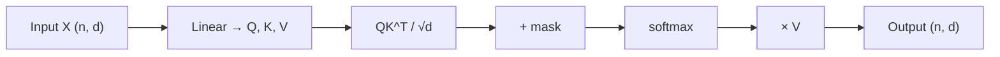

# 2.9 — Attention & Self-Attention

## 1. Intuition first
When translating "the cat sat on the mat", to translate "sat" you should look primarily at "cat" (subject). Attention lets a model, for each output token, compute a **weighted average of relevant input tokens** — weights come from learned similarity between a *query* (what we're looking for) and *keys* (what each input has to offer).

## 2. Why the topic exists
RNNs compress everything into a fixed vector — a bottleneck for long sequences. Attention lets every output token look at every input token directly.

## 3. What problem it solves
Model long-range dependencies; provide parallelism (unlike RNNs); interpretable attention maps.

## 4. Mathematics

### 4.1 Scaled dot-product attention
Given queries $Q \in \mathbb{R}^{n\times d_k}$, keys $K \in \mathbb{R}^{m\times d_k}$, values $V \in \mathbb{R}^{m\times d_v}$:

$$
\text{Attn}(Q, K, V) = \text{softmax}\!\left(\tfrac{QK^T}{\sqrt{d_k}}\right) V
$$

$\sqrt{d_k}$ prevents huge logits when $d_k$ is large.

### 4.2 Self-attention
$Q = XW_Q$, $K = XW_K$, $V = XW_V$ for the same input $X$.

### 4.3 Multi-head attention
Split into $h$ heads of dim $d_k/h$; run attention in parallel; concatenate; project.

$$
\text{MHA}(X) = \text{Concat}(\text{head}_1, \ldots, \text{head}_h) W_O
$$

### 4.4 Masks
- **Causal / autoregressive mask**: upper triangular = $-\infty$ so token $t$ only attends to $\leq t$.
- **Padding mask**: zero out padded positions.

### 4.5 Cross-attention
Queries from decoder, keys/values from encoder (used in seq2seq transformers).

### 4.6 Positional encodings
Attention is permutation-equivariant → need to inject order:
- Sinusoidal (Vaswani 2017).
- Learned absolute (BERT).
- Relative (T5).
- Rotary (RoPE) — used in LLaMA.
- ALiBi — additive linear bias.

## 5. Every formula explained
- $QK^T$: similarity matrix; $\sqrt{d_k}$ scaling stabilizes softmax gradients.
- Softmax turns similarities into a distribution.
- Multi-head lets the model attend from different "subspaces" simultaneously.

## 6. Variables
$n, m$ sequence lengths (query / key); $d_k, d_v$ head dims; $h$ heads; $W_Q, W_K, W_V, W_O$ projections.

## 7. Algorithm — self-attention step-by-step
1. Project $X$ → $Q, K, V$.
2. Split into $h$ heads.
3. Compute scaled dot product per head.
4. Apply mask (if any).
5. Softmax across keys.
6. Multiply by $V$.
7. Concatenate heads; project with $W_O$.

## 8. Simple example
For 4 tokens "the cat sat mat", attention matrix shows "sat" attends most to "cat".

## 9. Real-world example
Every Transformer-based model — BERT, GPT, T5, LLaMA, ViT, Whisper, CLIP — is a stack of attention layers.

## 10. Diagram
```
       Q      K      V
       │      │      │
     softmax(Q·Kᵀ / √d)
             │
           ─── × V ─── output
```



## 11. Implementation from scratch — multi-head self-attention
```python
import numpy as np

def softmax(x, axis=-1):
    x = x - x.max(axis=axis, keepdims=True)
    e = np.exp(x); return e / e.sum(axis=axis, keepdims=True)

def mha(X, Wq, Wk, Wv, Wo, n_heads=8, mask=None):
    n, d = X.shape
    dh = d // n_heads
    Q = (X @ Wq).reshape(n, n_heads, dh).transpose(1, 0, 2)   # (h, n, dh)
    K = (X @ Wk).reshape(n, n_heads, dh).transpose(1, 0, 2)
    V = (X @ Wv).reshape(n, n_heads, dh).transpose(1, 0, 2)
    scores = Q @ K.transpose(0, 2, 1) / np.sqrt(dh)           # (h, n, n)
    if mask is not None:
        scores = np.where(mask, scores, -1e9)
    weights = softmax(scores, axis=-1)
    out = weights @ V                                          # (h, n, dh)
    out = out.transpose(1, 0, 2).reshape(n, d)
    return out @ Wo
```

## 12. Implementation using libraries
```python
import torch, torch.nn as nn
mha = nn.MultiheadAttention(embed_dim=768, num_heads=12, batch_first=True)
out, weights = mha(query=X, key=X, value=X, attn_mask=causal_mask)
# torch.nn.functional.scaled_dot_product_attention is fused & fast (Flash-Attn on GPU)
```

## 13. Time complexity
Standard: O(n² d) — quadratic in sequence length.
FlashAttention: still O(n²) FLOPs, but memory-efficient and fused.
Linear-attention variants: O(n d²).

## 14. Space complexity
Attention matrix O(n²) — the bottleneck for long context.

## 15. Advantages
Global receptive field; parallelizable; interpretable weights; SOTA on nearly every sequence task.

## 16. Disadvantages
Quadratic cost in sequence length; needs positional encoding; heavy memory.

## 17. Interview questions
1. Why do we divide by $\sqrt{d_k}$?
2. Explain multi-head attention benefits.
3. Self-attention vs cross-attention.
4. What is a causal mask and why?
5. Compare sinusoidal, learned, relative, and RoPE positional encodings.
6. Complexity of attention; how does FlashAttention help?
7. What is linear attention?
8. Difference between attention and convolution.
9. Why can transformers process input in parallel while RNNs can't?
10. How do you handle very long context (RoPE scaling, YARN, ALiBi, sliding window)?

## 18. Common mistakes
- Forgetting scaling → soft-max saturation.
- Wrong mask shape/broadcast.
- Applying LN in the wrong place (pre-norm vs post-norm).
- Building QKV via three separate `Linear`s instead of one fused one (minor perf).

## 19. Optimization techniques
FlashAttention, sliding-window attention, grouped-query attention (GQA), multi-query attention (MQA), sparse attention (Longformer, BigBird), Mamba/SSMs for O(n) alternatives.

## 20. Coding exercises
1. Implement scaled dot-product attention in NumPy.
2. Implement causal mask correctly.
3. Add rotary positional embedding.
4. Verify equivalence between naive and `sdpa` on random tensors.

## 21. Mini project
Toy sequence-to-sequence attention visualizer on a copy task.

## 22. Medium project
Add attention to an encoder–decoder RNN and beat the no-attention baseline on a translation task.

## 23. Advanced project
Implement FlashAttention v1 forward pass; benchmark against a naive implementation on long sequences.

## 24. Where it is used in industry
Every modern LLM, Vision Transformer, speech model, code model — attention is the workhorse.

## 25. How companies use it
- GPT-4, Claude, LLaMA, Gemini: stacked multi-head attention.
- Google Search (BERT-based ranking).
- OpenAI Whisper for speech.

## 26. When NOT to use it
- Very long sequences with hard latency budgets → consider Mamba/SSM/linear attention.
- Highly local tasks where convolutions are cheaper.
