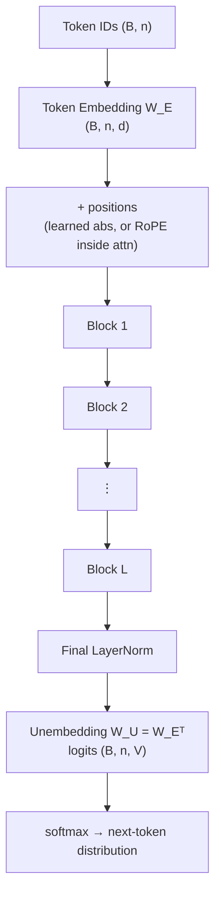
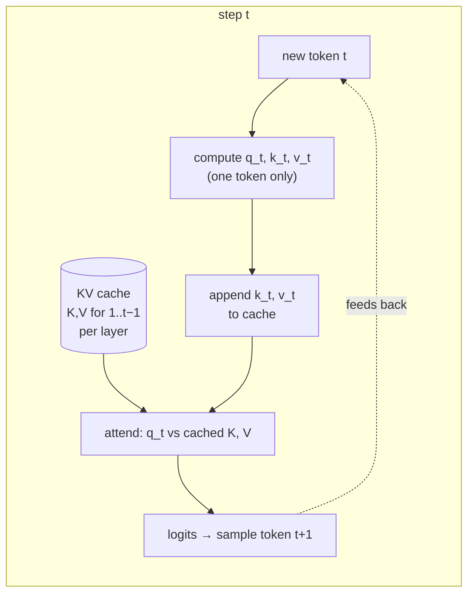
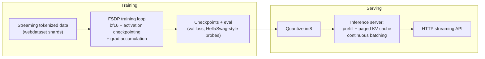

# 2.10 — The Transformer

## 1. Overview

**What is it?** The Transformer is a neural network architecture built by stacking a simple, repeated unit — the **Transformer block** — consisting of multi-head self-attention (from the [previous chapter](09-attention.md)), a position-wise feed-forward network, residual connections, and layer normalization. Add token embeddings at the bottom and a task head at the top, and you have the architecture behind essentially every frontier AI model.

**Why does it exist?** The 2017 paper *Attention Is All You Need* (Vaswani et al.) asked a radical question: if attention is what makes RNN-based translation work, do we need the RNN at all? The answer was no. Removing recurrence made every position trainable in parallel, which unlocked GPU efficiency, which unlocked scale — billions of parameters, trillions of tokens — which unlocked the modern LLM era.

**What problem does it solve?** General-purpose sequence modeling with no task-specific architecture engineering. One design handles translation, language modeling, classification, images (ViT treats patches as tokens), audio (Whisper), code (Codex/Copilot), proteins (AlphaFold's Evoformer is attention-based), and multimodal fusion (CLIP, GPT-4V).

**Where is it used?** GPT-4, Claude, Gemini, LLaMA, Mistral, and DeepSeek are decoder-only Transformers; BERT and its descendants are encoder-only; T5 and Whisper are encoder-decoder. If you learn a single architecture deeply in your entire ML education, it should be this one. This chapter assembles the block, derives parameter counts, walks the GPT forward pass token by token, and explains the KV cache that makes inference affordable.

## 2. Learning Objectives

After this chapter you will be able to:

- Draw and explain a **pre-norm Transformer block** and contrast it with the original post-norm design.
- Explain the role of each sub-component: multi-head attention, FFN, residual connections, LayerNorm.
- Distinguish **encoder-only**, **decoder-only**, and **encoder-decoder** variants and pick the right one for a task.
- Describe the embedding pipeline: token embeddings, positional information, and weight tying with the output head.
- **Count the parameters** of a GPT-style model from $L$, $d$, $d_{\text{ff}}$, and $V$, and verify against GPT-2.
- Trace the full **GPT forward pass** from token IDs to next-token probabilities with exact tensor shapes.
- Explain the **KV cache**: why naive generation is $O(n^2)$ per token, how caching fixes it, and how much memory it costs.
- Implement a working mini-GPT in PyTorch and train it on character-level data.
- Analyze per-layer time and space complexity and identify which term dominates at which scale.
- Explain modern refinements: RMSNorm, SwiGLU, RoPE, GQA — the LLaMA-style recipe.
- Answer interview questions on architecture choices, and estimate training/inference costs.

## 3. Prerequisites

| Chapter | Why you need it |
|---|---|
| [Attention & Self-Attention](09-attention.md) | The Transformer's core component; this chapter assumes you know MHA, masks, and positional encodings cold. |
| [Linear Algebra](../phase-0-prerequisites/02-linear-algebra.md) | The whole architecture is matrix multiplications and reshapes. |
| [Backpropagation](02-backpropagation.md) | Residual connections exist precisely to help gradients flow through deep stacks. |
| [Activation Functions](03-activations.md) | GELU/SwiGLU inside the FFN; softmax at the output. |
| [Loss Functions](04-loss-functions.md) | Language models train with cross-entropy over next tokens. |
| [Optimizers](05-optimizers.md) | AdamW with warmup + cosine decay is the standard Transformer recipe. |
| [Regularization for Deep Learning](06-regularization-dl.md) | Dropout, weight decay, and label smoothing appear throughout. |

Forward pointers: pretraining decoder-only models at scale is covered in [GPT & Pretraining](../phase-3-nlp-llm/05-gpt-pretraining.md); the encoder-only branch in [BERT](../phase-3-nlp-llm/04-bert.md).

## 4. Intuition

A Transformer block does two things, over and over: **communicate**, then **compute**.

- **Communicate (attention):** each token looks around the sequence and gathers relevant information from other tokens.
- **Compute (FFN):** each token, *independently*, processes what it gathered through a small two-layer neural network.

Andrej Karpathy's phrasing is the cleanest mental model: attention is the *token-mixing* step, the FFN is the *per-token thinking* step. Stack this communicate-then-compute cycle $L$ times, and tokens iteratively refine their understanding — early layers capture local syntax, later layers capture semantics, discourse, and task-specific structure.

**The conference analogy.** Imagine a room of specialists solving a problem together over $L$ rounds. In each round, everyone first mingles and exchanges notes with whomever seems relevant (attention), then returns to their desk to digest privately what they heard (FFN). Two more rules keep the process sane. First, nobody throws away their old notes; new insights are *added* to them (residual connections) — so even if one round produces nothing useful, no knowledge is lost. Second, before each round everyone tidies their notes to a standard format (layer normalization) — so no single loud participant's notes overwhelm the room.

**An everyday story.** Reading the sentence *"The trophy didn't fit in the suitcase because it was too big"*, you resolve *"it"* to *"trophy"* by relating words to each other (communication), then reason about what that implies (computation). You don't do this in one shot — you refine your interpretation as you read. A Transformer refines its token representations the same way, one block at a time, except all tokens are refined simultaneously.

## 5. Real-world Motivation

- **OpenAI** bet the company on the observation that a plain decoder-only Transformer, scaled up in parameters and data, keeps improving predictably (the scaling-law papers of 2020). GPT-2 (1.5B), GPT-3 (175B), and GPT-4 are architecturally conservative — the value came from scaling this exact design.
- **Google** invented the architecture, deployed BERT into Search ranking, built T5 as an encoder-decoder testbed, and trains the Gemini family; ViT from Google Research showed the same block works on image patches with no convolutions.
- **Meta** released the LLaMA models — decoder-only Transformers with RMSNorm, SwiGLU, RoPE, and GQA — which became the reference open-weights recipe the entire ecosystem copies.
- **Anthropic, Mistral, DeepSeek** all ship decoder-only Transformers, differing mainly in data, scale, attention efficiency tricks (sliding window, MoE, latent attention), not in the core block.
- **Microsoft/GitHub** Copilot is a Transformer over code; **Tesla** has used Transformer modules for multi-camera fusion in autonomous driving.

The strategic reason every company converged here: the Transformer is the most *scalable* known architecture — hardware-friendly (dense matmuls), parallelizable across thousands of GPUs, and predictable under scaling laws, which makes hundred-million-dollar training runs plannable business decisions rather than gambles.

## 6. Mathematical Foundations

### 6.1 Notation

| Symbol | Meaning |
|---|---|
| $L$ | number of Transformer blocks (layers) |
| $d$ | model (hidden) dimension |
| $h$ | number of attention heads; head dim $d_k = d/h$ |
| $d_{\text{ff}}$ | FFN inner dimension (classically $4d$) |
| $n$ | sequence length (tokens) |
| $V$ | vocabulary size |
| $B$ | batch size |
| $X \in \mathbb{R}^{n \times d}$ | activations for one sequence |
| $W_E \in \mathbb{R}^{V \times d}$ | token embedding matrix |

### 6.2 The pre-norm Transformer block

The standard modern block (GPT-2 onward) applies LayerNorm **before** each sub-layer, inside the residual branch:

$$
X \leftarrow X + \text{MHA}(\text{LN}_1(X)) \qquad \text{(communicate)}
$$

$$
X \leftarrow X + \text{FFN}(\text{LN}_2(X)) \qquad \text{(compute)}
$$

Every symbol: $\text{LN}(x) = \gamma \odot \frac{x - \mu}{\sigma} + \beta$ normalizes each token's $d$-vector to zero mean $\mu$ and unit std $\sigma$ (computed over the feature dimension), with learned scale $\gamma$ and shift $\beta$. $\text{MHA}$ is multi-head self-attention exactly as in [chapter 2.9](09-attention.md). The FFN is applied to each position independently:

$$
\text{FFN}(x) = W_2\, \phi(W_1 x + b_1) + b_2,
$$

with $W_1 \in \mathbb{R}^{d_{\text{ff}} \times d}$, $W_2 \in \mathbb{R}^{d \times d_{\text{ff}}}$, and $\phi$ a nonlinearity (GELU classically; modern LLMs use **SwiGLU**: $\text{FFN}(x) = W_2\,(\text{SiLU}(W_1 x) \odot W_3 x)$ with three matrices and $d_{\text{ff}} \approx \tfrac{8}{3}d$ to keep parameter count comparable).

**Why residuals?** Write the network output as $X_L = X_0 + \sum_{l=1}^{L} F_l(\text{LN}(X_{l-1}))$. The identity path gives gradients a direct highway from the loss to every layer — $\partial X_L/\partial X_0$ contains an identity term — which is what makes 100-layer stacks trainable (the same argument as ResNets in [Backpropagation](02-backpropagation.md)).

**Why the FFN at all?** Attention's output is a *convex combination* of value vectors — linear in $V$. Without the FFN, stacking attention layers composes (input-dependent) linear maps with limited per-token nonlinearity. The FFN, holding roughly two-thirds of the parameters, adds pointwise nonlinear processing; interpretability research suggests FFN layers act as key–value memories storing factual associations.

**Pre-norm vs post-norm.** The original paper used post-norm: $X \leftarrow \text{LN}(X + \text{Sublayer}(X))$. Post-norm places LN *on* the residual path, so gradient magnitudes vary sharply with depth; deep post-norm models need careful learning-rate warmup and can diverge. Pre-norm leaves the identity path untouched — training is far more stable, at a mild cost in final quality that modern tricks recover. Nearly every model since GPT-2 is pre-norm; a final LN after the last block is required (otherwise the residual stream is never normalized before the head). LLaMA-family models replace LayerNorm with **RMSNorm** ($x \cdot \gamma/\sqrt{\text{mean}(x^2)+\epsilon}$ — no mean subtraction, no bias, ~equally good and slightly faster).

### 6.3 The three architectural variants

| Variant | Attention pattern | Pretraining objective | Examples | Best for |
|---|---|---|---|---|
| **Encoder-only** | Bidirectional (no causal mask) | Masked LM | BERT, RoBERTa, DeBERTa | Classification, NER, retrieval embeddings |
| **Decoder-only** | Causal self-attention | Next-token prediction | GPT-*, LLaMA, Claude, Gemini | Generation, chat, few-shot everything |
| **Encoder-decoder** | Bidirectional encoder; decoder with causal self-attn + cross-attn | Span corruption / seq2seq | T5, BART, Whisper | Translation, summarization, speech→text |

The decoder block in an encoder-decoder model has **three** sub-layers: causal self-attention over generated tokens, **cross-attention** where queries come from the decoder and keys/values from the final encoder output, then the FFN. Decoder-only won the LLM era because next-token prediction turns *all* text into training signal, and a single autoregressive interface subsumes every task via prompting — see [GPT & Pretraining](../phase-3-nlp-llm/05-gpt-pretraining.md) vs [BERT](../phase-3-nlp-llm/04-bert.md).

### 6.4 Embeddings, positions, and weight tying

Token IDs $t_1..t_n$ index rows of $W_E$: $X_0 = W_E[t] \; (+ \; W_P[0{:}n]$ if learned absolute positions are used$)$. The original paper multiplied embeddings by $\sqrt{d}$ to balance their scale against sinusoidal encodings. Modern models using **RoPE or ALiBi add nothing to the embeddings** — positional information is injected inside each attention call (rotating Q/K, or biasing scores), as derived in [chapter 2.9](09-attention.md).

At the output, logits are produced by $\text{logits} = X_L W_U$ with unembedding $W_U \in \mathbb{R}^{d \times V}$. **Weight tying** sets $W_U = W_E^\top$, saving $Vd$ parameters (a big deal at small scale: 38.6M of GPT-2 small's 124M) and acting as a regularizer that couples input and output token semantics. GPT-2 ties; several recent large models untie because the parameter savings no longer matter at scale.

### 6.5 Parameter counting (derivation)

Per block, with biases ignored (modern models mostly drop them):

- Attention: $W_Q, W_K, W_V, W_O$, each $d \times d$ → $4d^2$.
- FFN (GELU, $d_{\text{ff}} = 4d$): $W_1 \in \mathbb{R}^{4d \times d}$ and $W_2 \in \mathbb{R}^{d \times 4d}$ → $8d^2$.
- LayerNorms: $4d$ (negligible).

$$
P \approx L(4d^2 + 8d^2) + Vd = 12Ld^2 + Vd
$$

**Verification on GPT-2 small** ($L = 12$, $d = 768$, $V = 50257$, context 1024, tied embeddings): $12 \cdot 12 \cdot 768^2 = 84.9\text{M}$, plus embeddings $50257 \cdot 768 = 38.6\text{M}$, plus positional $1024 \cdot 768 = 0.8\text{M}$ → $\approx 124\text{M}$. The published number is 124M. ✓

Rules of thumb that follow: the FFN holds $8/12 = 2/3$ of block parameters; embeddings dominate small models and become negligible at scale ($Vd$ grows linearly in $d$, blocks quadratically); and training compute per token is $\approx 6P$ FLOPs (forward $2P$, backward $4P$) — the estimate behind every LLM budget spreadsheet.

### 6.6 The training objective

A decoder-only LM maximizes the likelihood of each token given its prefix — cross-entropy at **every position simultaneously** (teacher forcing), which is why one forward pass over $n$ tokens yields $n$ training signals:

$$
\mathcal{L} = -\frac{1}{n}\sum_{t=1}^{n} \log p_\theta(x_{t+1} \mid x_1, \dots, x_t)
$$

The causal mask is what makes this valid: position $t$'s prediction provably cannot peek at $x_{t+1}$.

### 6.7 The KV cache (inference)

Generation is sequential: to emit token $n{+}1$, run the model on tokens $1..n$. Done naively, each new token reprocesses the whole prefix — total work over $n$ generated tokens is $O(n^2)$ forward passes' worth ($O(n^3 d)$-ish attention FLOPs). The fix: at step $t$, keys and values for positions $1..t-1$ are **identical to those computed at earlier steps** (they depend only on prefix tokens). So cache per layer the tensors $K, V \in \mathbb{R}^{t \times d}$; each new step computes Q/K/V *for the one new token only*, appends its K/V to the cache, and attends against the cached keys/values. Per-step cost drops from $O(t^2 d + t d^2)$ to $O(td + d^2)$ per layer.

Cache memory (the price paid):

$$
\text{bytes} = 2 \cdot B \cdot L \cdot n \cdot d_{kv} \cdot \text{bytes/elt}
$$

where the leading 2 counts K and V and $d_{kv} = h_{kv} \cdot d_k$ is the total KV width ($= d$ for MHA, smaller under GQA/MQA). For LLaMA-2-70B (L=80, GQA with $h_{kv}=8$, $d_k=128$ → $d_{kv}=1024$) at $n = 4096$, fp16, $B=1$: $2 \cdot 80 \cdot 4096 \cdot 1024 \cdot 2 \approx 1.3$ GB per sequence — with full MHA ($d_{kv} = 8192$) it would be 10.7 GB. This is why GQA exists, and why serving systems obsess over cache management (paged attention in vLLM).

## 7. Visual Explanation

Full decoder-only (GPT) architecture:



One pre-norm block (residual stream flows top to bottom; sub-layers *read* via LN and *write back* additively):

```
   x ──┬──► LN1 ──► Multi-Head Attention ──► (+) ──┬──► LN2 ──► FFN ──► (+) ──► out
       │            (causal mask)             ▲    │                     ▲
       └───────────── residual ───────────────┘    └────── residual ─────┘
```

Autoregressive generation with a KV cache:



## 8. Algorithm

**GPT forward pass** (training mode, full sequence):

1. Look up token embeddings: $X \leftarrow W_E[t]$, shape $(B, n, d)$; add learned positional embeddings if used.
2. For each layer $l = 1..L$:
   a. $X \leftarrow X + \text{MHA}_l(\text{LN}_1^{(l)}(X))$ with causal mask (RoPE applied to Q/K inside).
   b. $X \leftarrow X + \text{FFN}_l(\text{LN}_2^{(l)}(X))$.
3. Final LayerNorm: $X \leftarrow \text{LN}_f(X)$.
4. Logits $\leftarrow X W_U$, shape $(B, n, V)$.
5. Training: cross-entropy of logits at position $t$ vs token $t{+}1$, averaged. Inference: take logits at the last position, apply temperature/top-p, sample.

```text
function gpt_forward(tokens):                  # tokens: (B, n) ints
    x ← W_E[tokens] + W_P[0:n]                 # (B, n, d)
    for l in 1..L:
        x ← x + MHA_l(LN1_l(x), causal=True)   # communicate
        x ← x + FFN_l(LN2_l(x))                # compute
    x ← LN_f(x)
    return x @ W_U                             # logits (B, n, V)

function generate(prompt, T_new):
    cache ← empty per-layer K/V lists
    logits ← gpt_forward_with_cache(prompt, cache)   # prefill: whole prompt at once
    for i in 1..T_new:
        tok ← sample(softmax(logits[last] / temperature))
        logits ← gpt_forward_with_cache([tok], cache)  # decode: ONE token per step
        emit tok
```

The two inference phases have very different performance profiles: **prefill** processes the whole prompt in parallel (compute-bound), while **decode** processes one token at a time (memory-bandwidth-bound — dominated by streaming weights and KV cache).

## 9. Worked Example

### 9.1 Tiny model by hand

Configuration: $V = 10$, $n = 4$, $d = 8$, $h = 2$, $d_{\text{ff}} = 32$, $L = 2$, learned positions, tied embeddings.

**Parameter count.** Blocks: $12Ld^2 = 12 \cdot 2 \cdot 64 = 1536$. Embeddings: $Vd = 80$; positional: $nd = 32$; LN params: $2 \cdot 2 \cdot (2\cdot8) + 16 = 80$. Total $\approx 1728$ parameters.

**Forward pass shapes for input `[3, 7, 1, 4]`.** Embedding lookup: $(4, 8)$. Inside each block: LN keeps $(4,8)$; Q/K/V each $(4,8)$, split into 2 heads of $(2, 4, 4)$; scores $(2, 4, 4)$ scaled by $\sqrt{4} = 2$; causal mask zeroes the 6 upper-triangular weights per head; weighted values $(2,4,4)$; merged $(4,8)$; FFN expands to $(4, 32)$ and back to $(4, 8)$. After 2 blocks and final LN: logits $(4, 10) = (4,8) \times (8,10)$.

**Hand-verify one number.** Suppose after final LN row 4 is $x = (1, 0, \dots, 0)$ and column 5 of $W_U$ is $(0.5, \dots)$: logit for token 5 at position 4 is $x \cdot W_U[:,5] = 0.5$. If all ten logits at that position were equal, the model would assign each next token probability $0.1$ and the cross-entropy loss would be $-\ln 0.1 \approx 2.303$ — which is exactly the loss you should see at initialization ($\ln V$). **Checking that initial loss $\approx \ln V$ is the single most useful sanity test when building a LM.**

### 9.2 Realistic scale

nanoGPT-style TinyShakespeare run: character vocab $V = 65$, $L = 6$, $d = 384$, $h = 6$, $n = 256$. Parameters: $12 \cdot 6 \cdot 384^2 = 10.6\text{M}$ plus tiny embeddings ($65 \cdot 384 \approx 0.02$M) → ~10.7M. Initial loss $\ln 65 \approx 4.17$; after ~5,000 AdamW steps on one GPU, validation loss ~1.5 and samples read like plausible pseudo-Shakespeare. Scaling the same code and equations to GPT-3 (L=96, d=12288, h=96, V≈50k) gives $12 \cdot 96 \cdot 12288^2 \approx 174\text{B}$ — matching the published 175B. Same architecture; only the numbers change.

## 10. Python from Scratch

A complete, trainable mini-GPT in PyTorch, written from primitives (only `Linear`, `Embedding`, `LayerNorm` — attention logic by hand):

```python
import math
import torch
import torch.nn as nn
import torch.nn.functional as F

class CausalSelfAttention(nn.Module):
    def __init__(self, d, h, ctx):
        super().__init__()
        assert d % h == 0
        self.h, self.dk = h, d // h
        self.qkv  = nn.Linear(d, 3 * d, bias=False)   # fused Q,K,V projection
        self.proj = nn.Linear(d, d, bias=False)       # output projection W_O
        # Causal mask precomputed once; registered as buffer (not a parameter).
        self.register_buffer("mask",
            torch.tril(torch.ones(ctx, ctx)).view(1, 1, ctx, ctx))

    def forward(self, x):
        B, T, D = x.shape
        q, k, v = self.qkv(x).chunk(3, dim=-1)                    # each (B, T, D)
        # Split heads: (B, T, D) -> (B, h, T, dk) so heads batch over dim 1.
        q = q.view(B, T, self.h, self.dk).transpose(1, 2)
        k = k.view(B, T, self.h, self.dk).transpose(1, 2)
        v = v.view(B, T, self.h, self.dk).transpose(1, 2)
        att = (q @ k.transpose(-2, -1)) / math.sqrt(self.dk)      # (B, h, T, T)
        att = att.masked_fill(self.mask[:, :, :T, :T] == 0, float("-inf"))
        att = F.softmax(att, dim=-1)                              # rows sum to 1
        y = att @ v                                               # (B, h, T, dk)
        y = y.transpose(1, 2).contiguous().view(B, T, D)          # merge heads
        return self.proj(y)

class Block(nn.Module):
    """Pre-norm: x + Attn(LN(x)); x + FFN(LN(x))."""
    def __init__(self, d, h, ctx):
        super().__init__()
        self.ln1, self.ln2 = nn.LayerNorm(d), nn.LayerNorm(d)
        self.attn = CausalSelfAttention(d, h, ctx)
        self.ffn  = nn.Sequential(                # classic 4x GELU FFN
            nn.Linear(d, 4 * d), nn.GELU(), nn.Linear(4 * d, d))

    def forward(self, x):
        x = x + self.attn(self.ln1(x))   # communicate
        x = x + self.ffn(self.ln2(x))    # compute
        return x

class MiniGPT(nn.Module):
    def __init__(self, vocab, d=384, h=6, L=6, ctx=256):
        super().__init__()
        self.ctx = ctx
        self.tok = nn.Embedding(vocab, d)
        self.pos = nn.Embedding(ctx, d)           # learned absolute positions
        self.blocks = nn.ModuleList([Block(d, h, ctx) for _ in range(L)])
        self.ln_f = nn.LayerNorm(d)               # final LN (mandatory in pre-norm)
        self.head = nn.Linear(d, vocab, bias=False)
        self.head.weight = self.tok.weight        # weight tying: W_U = W_E

    def forward(self, idx, targets=None):
        B, T = idx.shape
        pos = torch.arange(T, device=idx.device)
        x = self.tok(idx) + self.pos(pos)                  # (B, T, d)
        for blk in self.blocks:
            x = blk(x)
        logits = self.head(self.ln_f(x))                   # (B, T, V)
        loss = None
        if targets is not None:                            # targets = idx shifted left
            loss = F.cross_entropy(logits.view(-1, logits.size(-1)),
                                   targets.view(-1))
        return logits, loss

    @torch.no_grad()
    def generate(self, idx, n_new, temperature=1.0):
        for _ in range(n_new):
            logits, _ = self(idx[:, -self.ctx:])           # crop to context window
            probs = F.softmax(logits[:, -1] / temperature, dim=-1)
            idx = torch.cat([idx, torch.multinomial(probs, 1)], dim=1)
        return idx

model = MiniGPT(vocab=65)
x = torch.randint(0, 65, (4, 256))                # (B, T) random tokens
logits, loss = model(x, targets=x.roll(-1, dims=1))
print(sum(p.numel() for p in model.parameters()))  # ~10.7M
print(loss.item())                                 # ≈ ln(65) ≈ 4.17 at init
```

Expected output: ~10.7M parameters and an initial loss near 4.17. Complexity per forward: $O(L(n^2 d + n d^2))$.

> [!WARNING]
> **Common bug:** building targets wrong. Targets must be inputs shifted **left by one** (position $t$ predicts token $t{+}1$). Off-by-one in the shift — or forgetting the causal mask entirely — produces suspiciously low training loss and gibberish generation. If your LM loss drops far below $\approx 1$ nat almost immediately, suspect leakage before celebrating.

## 11. Library Implementation

Production code uses Hugging Face `transformers`, which wraps pretrained weights, tokenizers, KV caching, and generation logic:

```python
from transformers import AutoModelForCausalLM, AutoTokenizer
import torch

tok = AutoTokenizer.from_pretrained("gpt2")             # BPE tokenizer, V = 50257
model = AutoModelForCausalLM.from_pretrained("gpt2")    # 124M params, our formula's L=12, d=768
model.eval()

ids = tok("The Transformer architecture", return_tensors="pt").input_ids  # (1, 4)

with torch.no_grad():
    out = model(ids)                     # forward pass, no generation
print(out.logits.shape)                  # torch.Size([1, 4, 50257]) = (B, n, V)

gen = model.generate(
    ids,
    max_new_tokens=40,
    do_sample=True,       # sample instead of greedy argmax
    temperature=0.8,      # <1 sharpens the distribution
    top_p=0.95,           # nucleus sampling: smallest set with 95% mass
    use_cache=True,       # KV cache ON (default) — decode is O(t) not O(t^2)
)
print(tok.decode(gen[0]))
```

Line notes: `AutoModelForCausalLM` selects the decoder-only class with an LM head; `out.logits` has exactly the $(B, n, V)$ shape derived in Section 6; `generate` implements the prefill-then-decode loop of Section 8, managing `past_key_values` (the KV cache) internally. Setting `use_cache=False` makes generation dramatically slower at long lengths — a good experiment to run once to feel the quadratic cost. For real serving, engines like **vLLM** add paged KV-cache management and continuous batching on top of the same model weights.

## 12. Code Walkthrough

Tracing `MiniGPT` from Section 10 with $B = 4$, $T = 256$, $d = 384$, $h = 6$, $V = 65$:

| Tensor | Shape | Meaning |
|---|---|---|
| `idx` | (4, 256) | integer token IDs |
| `self.tok(idx)` | (4, 256, 384) | token embeddings |
| `self.pos(pos)` | (256, 384) | positional embeddings, broadcast over batch |
| `q, k, v` (per block) | (4, 6, 256, 64) | per-head queries/keys/values |
| `att` | (4, 6, 256, 256) | causal attention weights; upper triangle = 0 |
| block output | (4, 256, 384) | same shape as input — blocks are shape-preserving, hence stackable |
| `logits` | (4, 256, 65) | next-token scores at **every** position |
| `loss` | scalar | mean cross-entropy over all $4 \times 256$ predictions |

**Inputs:** token IDs in $[0, V)$, sequence length $\le$ context. **Outputs:** logits over the vocabulary at each position (training) or sampled continuations (generation). **Expected results:** initial loss $\approx \ln V = 4.17$; loss decreasing steadily; and the causality check — perturb token at position 100 and verify logits at positions $< 100$ are bit-identical. Note the design invariant that makes Transformers composable: every block maps $(B, T, d) \to (B, T, d)$, so depth is a free knob.

## 13. Complexity Analysis

**Time (training / prefill), per layer:**

- Attention scores + weighted sum: $O(n^2 d)$.
- Q/K/V/O projections: $O(n d^2)$.
- FFN: $O(n \cdot d \cdot d_{\text{ff}}) = O(4 n d^2)$.

Total: $O\!\big(L(n^2 d + n d^2)\big)$. The crossover is at $n \approx d$: below it (e.g. $n = 2048$, $d = 12288$ in GPT-3) FFN/projection matmuls dominate; above it (128k contexts) attention dominates — matching where the industry spends optimization effort at each era's typical context length. Training FLOPs $\approx 6 \cdot P \cdot (\text{tokens})$: e.g. GPT-3, $6 \times 175\text{e}9 \times 300\text{e}9 \approx 3.1 \times 10^{23}$ FLOPs.

**Space:** weights $O(12Ld^2 + Vd)$; activations for backprop $O(B \cdot L \cdot n \cdot d)$ plus $O(B L h n^2)$ for attention matrices unless FlashAttention (never materializes them) and/or activation checkpointing (recompute in backward, trading ~30% compute for ~$\sqrt{L}$ memory) are used. **Inference:** with KV cache, per-token time is $O(L(td + d^2))$ — linear in position $t$, not quadratic — and cache memory is $2BLn\,d_{kv}$ elements, which at long contexts rivals the weights themselves; decode speed is bounded by memory bandwidth (streaming $\sim P$ weights per token), not FLOPs.

## 14. Advantages

- **Trains in parallel over sequence positions.** One forward pass yields $n$ prediction losses; combined with GPU-friendly dense matmuls, this is why a Transformer trains orders of magnitude faster than an equally sized RNN — the practical enabler of trillion-token pretraining.
- **Scales predictably.** Loss follows smooth power laws in parameters and data (Kaplan 2020, Chinchilla 2022), so GPT-4-class training runs can be planned from small-scale pilot experiments — a property no earlier architecture demonstrated as cleanly.
- **One architecture, every modality.** Text (GPT), images-as-patches (ViT), audio (Whisper), code (Copilot), proteins (AlphaFold): the same block, letting the whole field share kernels, tooling, and hardware roadmaps.
- **Transfer learning by default.** Pretrain once, adapt everywhere — few-shot prompting, fine-tuning, or LoRA (see [LoRA & PEFT](../phase-3-nlp-llm/07-lora-peft.md)); BERT made "pretrain + fine-tune" the standard NLP workflow within a year of release.
- **Long-range dependencies in $O(1)$ hops.** Any two tokens interact directly through attention — a contract's page-1 definition informs page-40 clauses in one layer, versus thousands of fragile recurrent steps.

## 15. Disadvantages

- **Quadratic attention cost in context length.** Doubling context quadruples attention compute; million-token contexts are only feasible with the mitigations of Section 18. Failure case: naively fine-tuning a 4k-context model on 64k-token documents will exhaust memory or your budget.
- **Fixed context window.** Text beyond the window is invisible; models with learned absolute positions cannot even *represent* longer inputs without surgery (RoPE scaling, covered in [chapter 2.9](09-attention.md)).
- **Data- and compute-hungry.** Weak inductive biases mean small-data training from scratch usually loses to CNNs (vision) or gradient-boosted trees (tabular). A Transformer on 10k labeled examples without pretraining is almost always the wrong tool.
- **Expensive autoregressive inference.** One full forward pass per generated token, memory-bandwidth-bound, plus a KV cache that grows linearly with context and batch — serving economics dominate LLM product decisions.
- **Opacity.** Billions of parameters with no explicit reasoning trace; interpretability (circuits, sparse autoencoder features) is an active research field precisely because the architecture provides no built-in explanation of its outputs.

## 16. Common Mistakes

- **Forgetting the causal mask** (or applying it after softmax). Training loss looks great; generation is gibberish because the model was trained to copy the visible next token. *Avoid:* the perturbation test — change token $t$, assert outputs $< t$ unchanged.
- **Off-by-one targets.** Targets must be inputs shifted left by one. *Avoid:* eyeball a batch — `inputs[0, 1] == targets[0, 0]`.
- **Omitting the final LayerNorm** in pre-norm models. The unnormalized residual stream hits the head; training destabilizes as depth grows. *Avoid:* `ln_f` after the last block, always.
- **Initial loss far from $\ln V$.** Signals broken initialization, wrong labels, or leakage. *Avoid:* assert this before training.
- **No warmup with post-norm or large learning rates.** Divergence in the first hundred steps. *Avoid:* linear warmup (~1–2% of steps) then cosine decay; use pre-norm.
- **Wrong weight decay set.** Applying decay to LayerNorm parameters and embeddings hurts. *Avoid:* two parameter groups — decay on 2-D matrices only (standard nanoGPT/AdamW practice, cf. [Regularization](06-regularization-dl.md)).
- **Forgetting to crop context at generation.** Feeding sequences longer than trained positions crashes (learned positions) or degrades badly. *Avoid:* `idx[:, -ctx:]` as in Section 10.
- **Disabled KV cache in production.** Latency grows quadratically with output length. *Avoid:* verify `use_cache=True` and measure per-token latency at several lengths.

## 17. Best Practices

- [ ] Start from a known-good recipe (nanoGPT / LLaMA config); change one variable at a time.
- [ ] Pre-norm (RMSNorm), SwiGLU FFN, RoPE, no biases — the modern default stack.
- [ ] AdamW with $\beta = (0.9, 0.95)$, weight decay 0.1 on matrices only; grad-norm clipping at 1.0.
- [ ] Linear warmup → cosine decay; peak LR roughly $3\times10^{-4}$ at ~100M scale, decreasing with model size.
- [ ] bf16 mixed precision; fp32 master weights and softmax accumulation.
- [ ] Use `F.scaled_dot_product_attention` / FlashAttention — never materialize $n \times n$ attention in production.
- [ ] Size data per Chinchilla intuition (~20 tokens per parameter for compute-optimal pretraining).
- [ ] Log: loss vs tokens, grad norm, LR, and samples at fixed prompts every N steps.
- [ ] Sanity suite before any long run: init loss $= \ln V$, overfit a single batch to ~0 loss, causality perturbation test.
- [ ] For serving: KV cache always on; GQA if designing from scratch; quantize weights (int8/int4) before scaling out replicas.

## 18. Optimization Techniques

- **FlashAttention** — exact attention, $O(n)$ memory, 2–4× faster (see [chapter 2.9](09-attention.md)); default in modern stacks via SDPA.
- **KV cache + paged attention** — cache K/V per layer during decode; vLLM's paged allocator eliminates fragmentation and enables continuous batching, often 5–10× throughput over naive serving.
- **GQA/MQA** — shrink $d_{kv}$ to cut cache memory (LLaMA-2-70B: 8× reduction).
- **Mixed precision (bf16)** — halves memory and roughly doubles matmul throughput on tensor cores; keep loss-scale-free bf16 rather than fp16 where hardware allows.
- **Activation (gradient) checkpointing** — store only block inputs, recompute inside blocks during backward: ~30% extra compute for several-fold activation-memory savings; essential above ~1B parameters per GPU.
- **Quantization** — int8/int4 weights (GPTQ, AWQ) for inference: 2–4× memory cut, minor quality loss; also KV-cache quantization for long contexts.
- **Distributed parallelism** — data parallel (FSDP/ZeRO shards weights+optimizer), tensor parallel (split matmuls across GPUs), pipeline parallel (split layers): composed, these train trillion-parameter models.
- **Mixture of Experts (MoE)** — replace the FFN with $E$ expert FFNs and a router activating $k \ll E$ per token (Mixtral, DeepSeek): parameters scale without proportional per-token FLOPs.
- **torch.compile / CUDA graphs** — kernel fusion and launch-overhead elimination; typically 1.3–2× on training and small-batch decode.

## 19. Industry Applications

- **Chat assistants:** ChatGPT (OpenAI), Claude (Anthropic), Gemini (Google) — decoder-only Transformers with RLHF post-training (see [RLHF & DPO](../phase-3-nlp-llm/06-rlhf-dpo.md)).
- **Search:** Google Search query understanding via BERT; Bing integrates GPT-4-class models; dense retrieval embeddings from encoder Transformers power semantic search everywhere.
- **Code:** GitHub Copilot serves Transformer completions to millions of developers; internal code models at Google and Meta do the same.
- **Translation & speech:** Google Translate (Transformer since 2018); OpenAI Whisper (encoder-decoder) for transcription; Meta's NLLB for 200-language translation.
- **Vision:** ViT backbones in production classification pipelines; DETR-style detection; Tesla's occupancy networks use Transformer fusion across cameras.
- **Science & biology:** AlphaFold 2's attention-based Evoformer (DeepMind) solved protein structure prediction well enough to earn a Nobel-recognized impact; ESM protein LMs at Meta.
- **Recommendations:** Transformer sequence models over user histories at Netflix-, Amazon-, and Alibaba-scale replace/augment classic collaborative filtering.

## 20. Interview Questions

### Beginner

**Q: Draw and describe a Transformer block.**
A: Pre-norm block: input → LN → multi-head self-attention → add residual → LN → position-wise FFN (expand to $4d$, nonlinearity, project back) → add residual. Attention mixes information across tokens; the FFN processes each token independently; residuals preserve gradient flow; LN stabilizes activation scales.

**Q: Encoder-only vs decoder-only vs encoder-decoder — when do you use each?**
A: Encoder-only (BERT): bidirectional attention, best for understanding tasks — classification, NER, embeddings. Decoder-only (GPT): causal attention, best for generation and few-shot prompting. Encoder-decoder (T5, Whisper): a bidirectional encoder plus a causally-masked decoder with cross-attention — natural for input→output transformations like translation and speech-to-text.

**Q: Why do Transformers train so much faster than RNNs?**
A: No recurrence: all $n$ positions are computed in parallel via matrix multiplies, and teacher forcing gives $n$ loss terms per forward pass. RNNs must process tokens sequentially, leaving GPUs underutilized.

**Q: What is the purpose of residual connections?**
A: They give gradients an identity path from the loss to every layer ($\partial X_L / \partial X_0$ contains an identity term), preventing vanishing gradients in deep stacks, and let each block learn an incremental *update* to the representation rather than a full transformation.

**Q: What loss is a GPT trained with?**
A: Cross-entropy on next-token prediction at every position simultaneously (teacher forcing), valid because the causal mask prevents any position from seeing its target.

### Intermediate

**Q: Pre-norm vs post-norm — what actually differs?**
A: Post-norm ($\text{LN}(x + F(x))$) puts LN on the residual path, so gradient scale varies with depth; deep models need warmup and can diverge. Pre-norm ($x + F(\text{LN}(x))$) keeps the identity path clean — stable training at depth, needs a final LN before the head. Pre-norm is the modern default (GPT-2 onward); post-norm can yield slightly better final loss when it trains successfully.

**Q: Derive the parameter count of a GPT and verify on GPT-2 small.**
A: Per block: attention $4d^2$ + FFN $8d^2$ (for $d_{\text{ff}}{=}4d$) = $12d^2$; total $12Ld^2 + Vd$ (+ positional). GPT-2 small: $12 \cdot 12 \cdot 768^2 = 84.9$M + $50257 \cdot 768 = 38.6$M + $0.8$M ≈ 124M ✓.

**Q: Why is the FFN necessary if attention already mixes information?**
A: Attention outputs are convex combinations of value vectors — (input-dependent) linear in the values. The FFN supplies per-token nonlinear computation and holds ~2/3 of parameters; evidence suggests it functions as key–value memory storing learned associations. Removing it collapses expressiveness sharply.

**Q: Explain the KV cache and quantify its memory.**
A: During autoregressive decoding, keys/values for past positions never change, so they're computed once and cached per layer; each step processes only the new token and attends against the cache, making per-step cost linear in $t$ instead of quadratic. Memory: $2 \cdot B \cdot L \cdot n \cdot d_{kv} \cdot$ bytes/elt — e.g. LLaMA-2-70B with GQA at 4k context ≈ 1.3 GB/sequence in fp16 (10.7 GB without GQA — which is why GQA exists).

**Q: Why tie input and output embeddings?**
A: Setting $W_U = W_E^\top$ saves $Vd$ parameters (31% of GPT-2 small) and regularizes by coupling input and output token semantics — a token's embedding and its prediction direction should be related. Large models often untie since $Vd$ becomes negligible and untying adds a little capacity.

**Q: Prefill vs decode — why do they perform so differently?**
A: Prefill processes the whole prompt in parallel: big matmuls, compute-bound, high GPU utilization. Decode emits one token at a time: every step streams all weights and the KV cache from memory for tiny matmuls — memory-bandwidth-bound. This is why batching/speculative decoding help decode throughput and why time-to-first-token vs per-token latency are engineered separately.

### Advanced

**Q: What is the LLaMA-style modern recipe, and why each change?**
A: RMSNorm instead of LayerNorm (drops mean-centering; cheaper, equally stable); SwiGLU FFN with $d_{\text{ff}} \approx \frac{8}{3}d$ (gated activation, better loss per parameter); RoPE (relative positions via Q/K rotation; better length behavior); no bias terms (negligible quality change, simpler); GQA (KV-cache reduction for serving). Individually small, jointly a meaningful quality/cost win — validated by nearly every open model copying the recipe.

**Q: How would you estimate cost to train a 7B model on 2T tokens?**
A: FLOPs $\approx 6PD = 6 \times 7\text{e}9 \times 2\text{e}12 = 8.4\times10^{22}$. On H100s at ~40% utilization of ~1e15 FLOP/s effective bf16, that's $8.4\text{e}22 / 4\text{e}14 \approx 2.1\times10^8$ GPU-seconds ≈ 58k GPU-hours; at ~\$2.50/hr ≈ \$150k, before ablations, restarts, and evaluation. (Interviewers want the $6PD$ heuristic and a utilization assumption.)

**Q: Why did decoder-only win over encoder-decoder for general LLMs?**
A: (1) Every token of raw text is a training target — maximally efficient data use with no masking/corruption scheme; (2) a single autoregressive interface subsumes all tasks via prompting, including in-context learning; (3) architectural simplicity aids scaling infrastructure; (4) KV caching makes autoregressive serving tractable, while encoder-decoder buys little for open-ended generation where input and output are the same stream. Encoder-decoder still wins for fixed input→output transforms like translation and ASR (Whisper).

**Q: Your 30-layer post-norm Transformer diverges early in training. Diagnose.**
A: Post-norm at depth compounds residual-branch growth; early large gradients + high LR cause divergence. Fixes ranked: switch to pre-norm; add/lengthen LR warmup; grad clipping at 1.0; lower peak LR; careful residual init scaling (e.g. scale output projections by $1/\sqrt{2L}$, GPT-2 style); check for fp16 overflow (prefer bf16).

**Q: How does Mixture of Experts change the parameter/compute trade-off?**
A: Replace each FFN with $E$ experts plus a router selecting top-$k$ (typically 1–2) per token. Parameters grow ~$E\times$ in FFNs, but per-token FLOPs stay near dense-with-$k$-experts. Mixtral 8×7B: ~47B parameters, ~13B active per token — better quality per inference-FLOP. Costs: all experts must reside in memory, routing adds load-balancing losses and training instability, and expert parallelism complicates serving.

## 21. Coding Exercises

### Easy

1. **Causal mask.** Implement `make_causal_mask(T)` and verify that `MiniGPT`'s attention weights are exactly lower-triangular for a random input. *Hint:* `torch.tril`.
2. **Parameter audit.** Write a function that walks `model.named_parameters()` and prints a table of counts per component; confirm the $12Ld^2 + Vd$ formula and that FFNs hold ~2/3 of block parameters. *Hint:* group by name prefix.
3. **Init-loss check.** Verify initial loss $\approx \ln V$ for three vocab sizes. *Hint:* `math.log(V)`.

### Medium

1. **KV cache.** Add a `generate_cached` method to `MiniGPT` that stores per-layer K/V and processes one token per step; verify identical outputs to uncached generation (greedy decoding), then benchmark both at 500 generated tokens. *Hint:* pass and return `past_kv` lists; positions for the new token continue from cache length.
2. **RoPE swap.** Replace learned positional embeddings with rotary embeddings applied to Q/K inside attention; confirm the model still trains to comparable loss on TinyShakespeare. *Hint:* reuse your RoPE implementation from [chapter 2.9](09-attention.md)'s exercises.
3. **Weight tying ablation.** Train tied vs untied variants of the same small model on identical data; compare parameter counts and validation loss. *Hint:* the difference is one line — `self.head.weight = self.tok.weight`.

### Hard

1. **MoE FFN.** Convert `MiniGPT`'s FFN to a 4-expert top-1 MoE with a load-balancing auxiliary loss; log per-expert token counts and show balanced routing. *Hint:* auxiliary loss = mean(fraction routed × router probability) × E, per Switch Transformer.
2. **Encoder-decoder.** Extend the code to a small encoder-decoder with cross-attention; train on a synthetic string-reversal seq2seq task to near-perfect accuracy. *Hint:* the decoder block has three sub-layers; cross-attention queries come from the decoder stream.
3. **Speculative decoding.** Implement draft-then-verify generation using a 2-layer draft model and your 6-layer target model; measure acceptance rate and wall-clock speedup. *Hint:* accept draft token $i$ with probability $\min(1, p_{\text{target}}/p_{\text{draft}})$; resample from the residual distribution on rejection.

## 22. Mini Project

**Train a character-level nano-GPT on TinyShakespeare.**

1. Download the TinyShakespeare text file (~1.1 MB); build char↔int maps ($V = 65$).
2. Encode the corpus; split 90/10 train/val; write a `get_batch(split)` that samples random $(B{=}64, T{=}256)$ windows with targets shifted left by one.
3. Instantiate `MiniGPT(vocab=65, d=384, h=6, L=6, ctx=256)`; verify parameter count (~10.7M) and initial loss (~4.17).
4. Train with AdamW (lr $3\times10^{-4}$, weight decay 0.1 on matrices, betas (0.9, 0.95)), grad clipping 1.0, ~5,000 steps; log train/val loss every 250 steps.
5. Overfit a single batch first (loss → ~0) to validate the pipeline; then run the full training.
6. Generate 500-character samples at temperatures 0.5 / 0.8 / 1.2 and describe how coherence and diversity trade off.

## 23. Medium Project

**Scaling mini-study: loss vs compute across model sizes.**

1. Tokenize a ~100M-token slice of OpenWebText or C4 with the GPT-2 BPE tokenizer (via `tiktoken`).
2. Train four models spanning ~1M → ~50M parameters (vary $d$ and $L$ together; keep $d/h = 64$), each with tuned-ish LR and the same token budget per compute rule (~20 tokens/param).
3. Record final validation loss and total training FLOPs ($6PD$) for each run.
4. Plot log(loss) vs log(FLOPs); fit a power law and compare its slope to published scaling-law exponents.
5. Use your fit to predict the loss of a 100M model, train it, and check the prediction — the exercise that turns "scaling laws" from folklore into something you've measured.
6. Write up: where did the prediction hold, where did it break, and what would you change (LR schedule, data quality, token budget)?

## 24. Advanced Project

**Build and serve a 100M–1B parameter GPT end to end.**

Architecture: LLaMA-style decoder-only (RMSNorm, SwiGLU, RoPE, no biases, optional GQA), trained with FSDP across multiple GPUs, then served with a KV-cache inference server.



Implementation phases:

1. **Model:** implement the LLaMA-style block; unit-test causality, init loss, and single-batch overfit.
2. **Data:** streaming tokenized shards with deterministic resumption; no epoch-boundary shuffling bugs.
3. **Distributed training:** FSDP (or DeepSpeed ZeRO-3) + bf16 + activation checkpointing + gradient accumulation; verify loss parity with single-GPU on a small config; monitor tokens/sec/GPU utilization.
4. **Evaluation:** perplexity on held-out data plus a few zero-shot multiple-choice probes scored by LM likelihood.
5. **Serving:** KV-cached generation server with continuous batching; measure time-to-first-token and tokens/sec at several batch sizes; add int8 quantization and re-measure.
6. **Possible improvements:** GQA retrofit via up-training; speculative decoding with a distilled draft model; LoRA fine-tuning endpoint (see [LoRA & PEFT](../phase-3-nlp-llm/07-lora-peft.md)); comparison against vLLM serving the same checkpoint.

## 25. Summary

- A Transformer = embeddings + $L$ × (pre-norm block) + final LN + task head; the block is **communicate** (multi-head attention) then **compute** (per-token FFN), each wrapped in residual + LayerNorm.
- **Pre-norm** ($x + F(\text{LN}(x))$) keeps the residual identity path clean and trains stably at depth; it requires a final LayerNorm before the head.
- The FFN ($d \to 4d \to d$, GELU or SwiGLU) holds ~2/3 of block parameters and supplies the per-token nonlinearity that attention alone lacks.
- Three variants: **encoder-only** (BERT — understanding), **decoder-only** (GPT — generation; the LLM default), **encoder-decoder** (T5/Whisper — input→output transforms, with cross-attention).
- Parameters: $P \approx 12Ld^2 + Vd$; training compute $\approx 6PD$ FLOPs for $D$ tokens; initial loss should equal $\ln V$.
- Training: cross-entropy next-token prediction at all positions in parallel (teacher forcing), enabled by the causal mask; targets are inputs shifted left by one.
- Inference has two phases: **prefill** (parallel, compute-bound) and **decode** (sequential, memory-bandwidth-bound); the **KV cache** makes decode linear per token at a memory cost of $2BLn\,d_{kv}$ elements.
- Modern recipe: RMSNorm + SwiGLU + RoPE + no biases + GQA + FlashAttention + AdamW with warmup/cosine — copy it before innovating.
- Per-layer cost $O(n^2 d + nd^2)$: FFN dominates at short context, attention at long context.
- Master this chapter and [attention](09-attention.md), and the rest of the LLM stack — [pretraining](../phase-3-nlp-llm/05-gpt-pretraining.md), [BERT](../phase-3-nlp-llm/04-bert.md), fine-tuning, serving — is elaboration.

## 26. Cheat Sheet

| Formula | Statement |
|---|---|
| Pre-norm block | $x \mathrel{+}= \text{MHA}(\text{LN}(x))$; then $x \mathrel{+}= \text{FFN}(\text{LN}(x))$ |
| FFN | $W_2\,\phi(W_1 x)$, $d_{\text{ff}} = 4d$ (SwiGLU: $\tfrac{8}{3}d$, 3 matrices) |
| Parameters | $P \approx 12Ld^2 + Vd$ |
| Training FLOPs | $\approx 6 P D$ ($D$ = tokens) |
| Initial loss | $\ln V$ (e.g. 10.82 for $V{=}50257$) |
| KV cache | $2 \cdot B \cdot L \cdot n \cdot d_{kv}$ elements |
| Per-layer time | $O(n^2 d + n d^2)$; crossover at $n \approx d$ |
| Chinchilla rule | $\sim$20 training tokens per parameter |

**Defaults:** head dim 64; $d_{\text{ff}}/d = 4$ (GELU) or $8/3$ (SwiGLU); AdamW $\beta=(0.9, 0.95)$, wd 0.1 (matrices only); warmup 1–2% of steps → cosine; clip grad-norm 1.0; bf16.

**One-liners:** targets = inputs shifted left; final LN is not optional in pre-norm; overfit one batch before any long run; blocks map $(B,T,d) \to (B,T,d)$; decode is bandwidth-bound — batch it.

**Gotchas:** loss $\ll \ln V$ instantly ⇒ leakage (mask or target shift); learned positions hard-cap context; `use_cache=False` silently makes generation quadratic; weight decay on LayerNorm/embeddings hurts.

## 27. Further Reading

**Books**
- *Build a Large Language Model (From Scratch)* — Sebastian Raschka.
- *Speech and Language Processing* (3rd ed. draft) — Jurafsky & Martin (Transformer and LLM chapters).
- *Deep Learning* — Goodfellow, Bengio, Courville (foundations).

**Research Papers**
- Vaswani et al. (2017), *Attention Is All You Need*.
- Radford et al. (2018, 2019), *GPT / GPT-2*; Brown et al. (2020), *Language Models are Few-Shot Learners* (GPT-3).
- Xiong et al. (2020), *On Layer Normalization in the Transformer Architecture* (pre- vs post-norm).
- Kaplan et al. (2020), *Scaling Laws for Neural Language Models*; Hoffmann et al. (2022), *Chinchilla*.
- Touvron et al. (2023), *LLaMA* and *LLaMA 2* (the modern recipe).
- Shazeer (2020), *GLU Variants Improve Transformer* (SwiGLU); Zhang & Sennrich (2019), *RMSNorm*.
- Fedus et al. (2021), *Switch Transformers* (MoE); Leviathan et al. (2022), *Speculative Decoding*.
- Kwon et al. (2023), *Efficient Memory Management for LLM Serving with PagedAttention* (vLLM).

**Documentation**
- The Annotated Transformer (Harvard NLP); Hugging Face `transformers` docs; PyTorch FSDP tutorial.

**GitHub Repositories**
- `karpathy/nanoGPT` and `karpathy/build-nanogpt` — the best pedagogical GPT implementations.
- `meta-llama/llama` — reference LLaMA architecture code.
- `vllm-project/vllm` — production inference with paged KV cache.

**Datasets**
- TinyShakespeare, OpenWebText, C4, The Pile, FineWeb — the standard pretraining ladder from toy to serious.

**YouTube / Videos**
- Andrej Karpathy — *Let's build GPT from scratch* and *Let's reproduce GPT-2 (124M)*.
- 3Blue1Brown — *But what is a GPT?* visual series.
- Stanford CS224N / CS25 Transformer lectures.

**Blogs**
- Jay Alammar — *The Illustrated Transformer* and *The Illustrated GPT-2*.
- Lilian Weng — *The Transformer Family v2*.
- Harvard/Sasha Rush — *The Annotated Transformer*; kipply — *Transformer Inference Arithmetic*.
