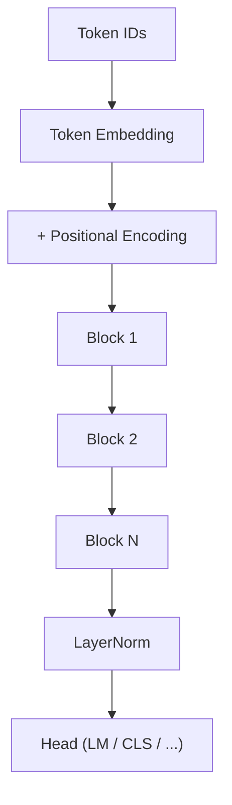

# 2.10 — The Transformer

## 1. Intuition first
Take multi-head self-attention, add a feed-forward network per token, wrap with residual connections and normalization, stack $N$ times. That is a Transformer block. Stack blocks + embeddings + task head → a Transformer.

The magic: everything is parallel and every token can see every other token in one shot.

## 2. Why the topic exists
"Attention Is All You Need" (Vaswani et al., 2017) showed that self-attention alone (no RNNs, no convs) beat state-of-the-art seq2seq — and enabled scaling to billions of parameters and trillions of tokens. Basis of every modern LLM.

## 3. What problem it solves
General-purpose sequence modeling: NLP, vision (ViT), audio (Whisper), multimodal (CLIP), code (Codex), protein folding (AlphaFold), etc.

## 4. Mathematics

### 4.1 Transformer block (pre-norm variant, standard today)
Given input $X \in \mathbb{R}^{n\times d}$:

$$
X \leftarrow X + \text{MHA}(\text{LN}(X))
$$
$$
X \leftarrow X + \text{FFN}(\text{LN}(X))
$$

with $\text{FFN}(x) = W_2 \phi(W_1 x)$ (usually $d_{\text{ff}} = 4d$), $\phi$ = GELU/SwiGLU.

### 4.2 Encoder (BERT-family)
$N$ layers of the block above; bidirectional (no mask). Task heads: [CLS] classification, MLM, NER, etc.

### 4.3 Decoder (GPT-family)
Same block + **causal mask** so token $t$ only attends to $\leq t$. LM head: `Linear(d, |V|)` shared with input embeddings.

### 4.4 Encoder-decoder (T5, original Transformer)
Encoder produces representations; decoder does causal self-attention + cross-attention to encoder outputs.

### 4.5 Embeddings & positions
Token embedding + positional encoding. RoPE / ALiBi injected inside attention, not added to embeddings.

### 4.6 Parameter count (approx.)
For a model with $L$ layers, hidden $d$, and $d_{\text{ff}}=4d$:

$$
P \approx L \cdot (4 d^2 + 8 d^2) + V \cdot d = 12 L d^2 + V d
$$

## 5. Every formula explained
- Residuals help gradient flow across $L$ layers.
- LN keeps activation scale bounded.
- The FFN adds per-token non-linearity (attention alone is linear w.r.t. values).

## 6. Variables
$L$ layers; $d$ hidden dim; $h$ heads; $d_{\text{ff}}$ FFN dim; $n$ seq length; $V$ vocab size.

## 7. Algorithm — GPT forward pass
1. Embed tokens: $E = X \cdot W_E$.
2. Add / apply positional info.
3. For each layer $l$: $E \leftarrow \text{Block}_l(E, \text{causal mask})$.
4. LN, then project to vocab: logits = $E W_E^T$.
5. Sample or take argmax.

## 8. Simple example
Nano-GPT (Karpathy) with 6 layers, 6 heads, d=192 trains on TinyShakespeare and generates coherent-ish text on a laptop GPU.

## 9. Real-world example
- GPT-4, Claude, Gemini, LLaMA, Mistral, DeepSeek — all decoder-only transformers.
- BERT/RoBERTa/DeBERTa — encoder-only.
- T5, BART — encoder-decoder.
- ViT — patch embeddings → transformer for images.

## 10. Diagram


Block:
```
   x ──► LN ──► MHA ──►(+)──► LN ──► FFN ──►(+)──► out
        │              ▲           │              ▲
        └──────────────┘           └──────────────┘
              residual                   residual
```

## 11. Implementation from scratch — a mini GPT block (PyTorch)
```python
import torch, torch.nn as nn, torch.nn.functional as F

class GPTBlock(nn.Module):
    def __init__(self, d, h, d_ff=None, dropout=0.0):
        super().__init__()
        d_ff = d_ff or 4 * d
        self.ln1 = nn.LayerNorm(d); self.ln2 = nn.LayerNorm(d)
        self.qkv = nn.Linear(d, 3 * d, bias=False)
        self.proj = nn.Linear(d, d, bias=False)
        self.ff = nn.Sequential(nn.Linear(d, d_ff), nn.GELU(), nn.Linear(d_ff, d))
        self.h = h; self.dropout = nn.Dropout(dropout)

    def forward(self, x, mask):
        B, T, D = x.shape
        y = self.ln1(x)
        q, k, v = self.qkv(y).chunk(3, dim=-1)
        q = q.view(B, T, self.h, D // self.h).transpose(1, 2)
        k = k.view(B, T, self.h, D // self.h).transpose(1, 2)
        v = v.view(B, T, self.h, D // self.h).transpose(1, 2)
        att = F.scaled_dot_product_attention(q, k, v, is_causal=True)
        att = att.transpose(1, 2).contiguous().view(B, T, D)
        x = x + self.dropout(self.proj(att))
        x = x + self.dropout(self.ff(self.ln2(x)))
        return x

class MiniGPT(nn.Module):
    def __init__(self, vocab, d=384, h=6, L=6, ctx=256):
        super().__init__()
        self.tok = nn.Embedding(vocab, d); self.pos = nn.Embedding(ctx, d)
        self.blocks = nn.ModuleList([GPTBlock(d, h) for _ in range(L)])
        self.ln = nn.LayerNorm(d); self.head = nn.Linear(d, vocab, bias=False)
    def forward(self, idx):
        B, T = idx.shape
        pos = torch.arange(T, device=idx.device)
        x = self.tok(idx) + self.pos(pos)
        for b in self.blocks: x = b(x, mask=None)
        return self.head(self.ln(x))
```

## 12. Implementation using libraries
```python
from transformers import AutoModelForCausalLM, AutoTokenizer
tok = AutoTokenizer.from_pretrained("gpt2")
model = AutoModelForCausalLM.from_pretrained("gpt2")
ids = tok("Hello", return_tensors="pt").input_ids
out = model.generate(ids, max_new_tokens=50)
print(tok.decode(out[0]))
```

## 13. Time complexity
Per layer: O(n² d + n d²). Total: O(L (n² d + n d²)).

## 14. Space complexity
O(L n² h) for attention plus O(L n d) activations.

## 15. Advantages
Parallelism, long-range modeling, transferable pretraining, scales beautifully.

## 16. Disadvantages
Quadratic attention; huge memory; opaque; needs massive data.

## 17. Interview questions
1. Draw a Transformer block.
2. Encoder vs decoder vs enc-dec.
3. Pre-norm vs post-norm.
4. Why is FFN necessary?
5. Explain positional encodings — 4 variants.
6. How does causal masking work?
7. Complexity vs sequence length; mitigations.
8. Why tie input/output embeddings?
9. Parameter count formula for a GPT.
10. Compare Transformer vs Mamba/SSM.

## 18. Common mistakes
- Forgetting causal mask → data leakage during training.
- Wrong FFN dim / activation.
- Not scaling embeddings by $\sqrt{d}$ (original paper).
- Using post-norm for very deep networks without warmup.

## 19. Optimization techniques
FlashAttention, KV-cache during inference, GQA/MQA, RoPE scaling, tensor parallelism, expert parallelism (MoE).

## 20. Coding exercises
1. Implement causal mask.
2. Implement KV-cache for inference.
3. Add RoPE positional embedding.
4. Convert MiniGPT above to MoE with 4 experts.

## 21. Mini project
Train nano-GPT on TinyShakespeare; generate coherent samples.

## 22. Medium project
Train a 30M-parameter GPT on 1B tokens of text (subset of C4); track loss vs FLOPs; verify Chinchilla-ish scaling.

## 23. Advanced project
Build a distributed training script for a 1B-parameter model on 8 GPUs with FSDP + activation checkpointing + gradient accumulation.

## 24. Where it is used in industry
Every LLM, ViT, audio transformer, code model, multimodal model.

## 25. How companies use it
- OpenAI, Anthropic, Google, Meta, xAI train enormous decoder-only transformers.
- Hugging Face hub distributes thousands of transformer variants for fine-tuning.

## 26. When NOT to use it
- Very small data / small model where classical methods win.
- Ultra-low-latency inference on edge without KV cache and quantization.
